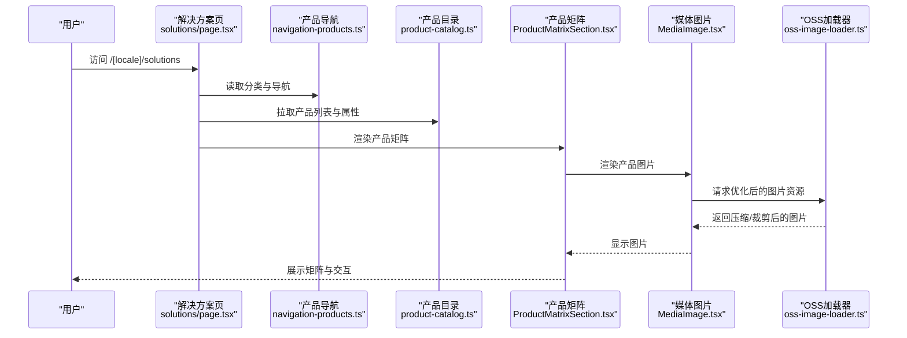
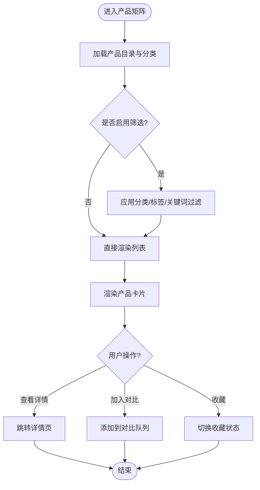
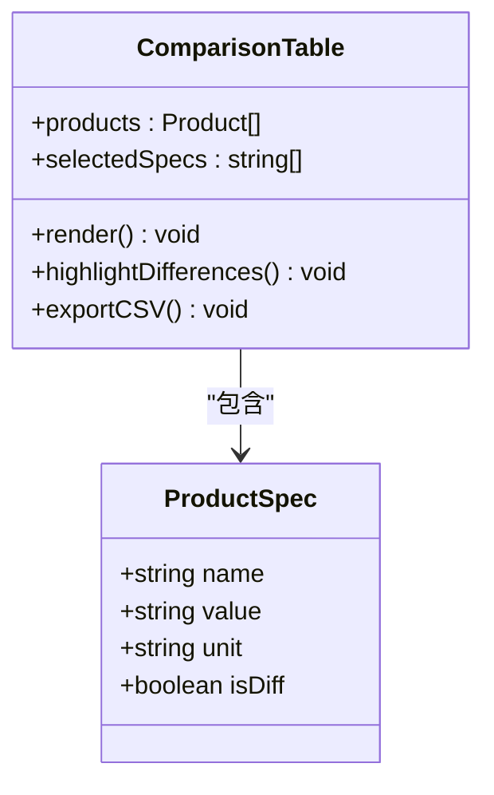
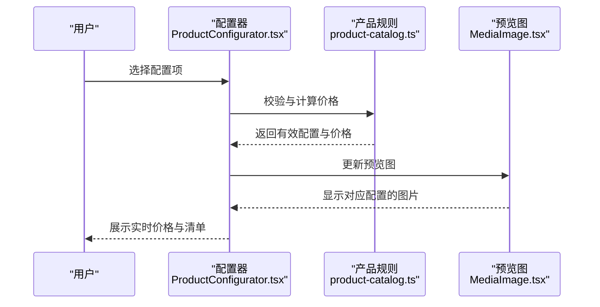
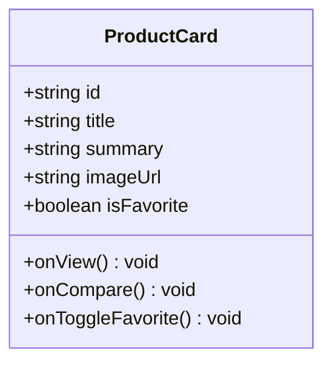
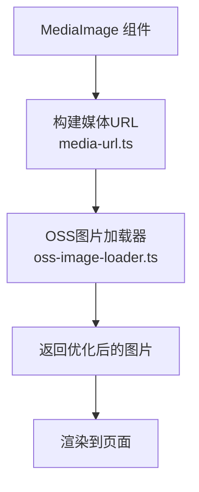
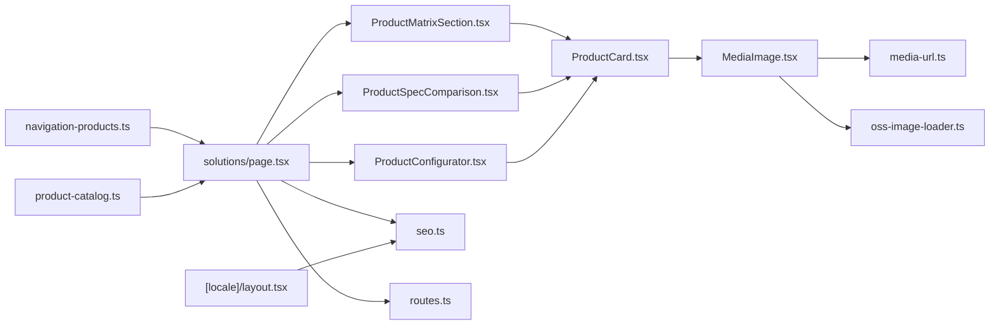

# 产品解决方案页面

<cite>
**本文引用的文件**   
- [apps/web/src/app/[locale]/solutions/page.tsx](file://apps/web/src/app/[locale]/solutions/page.tsx)
- [apps/web/src/lib/navigation-products.ts](file://apps/web/src/lib/navigation-products.ts)
- [apps/web/src/lib/product-catalog.ts](file://apps/web/src/lib/product-catalog.ts)
- [apps/web/src/components/products/ProductCard.tsx](file://apps/web/src/components/products/ProductCard.tsx)
- [apps/web/src/components/sections/ProductMatrixSection.tsx](file://apps/web/src/components/sections/ProductMatrixSection.tsx)
- [apps/web/src/components/sections/ProductSpecComparison.tsx](file://apps/web/src/components/sections/ProductSpecComparison.tsx)
- [apps/web/src/components/sections/ProductConfigurator.tsx](file://apps/web/src/components/sections/ProductConfigurator.tsx)
- [apps/web/src/components/MediaImage.tsx](file://apps/web/src/components/MediaImage.tsx)
- [apps/web/src/lib/media-url.ts](file://apps/web/src/lib/media-url.ts)
- [apps/web/src/lib/oss-image-loader.ts](file://apps/web/src/lib/oss-image-loader.ts)
- [apps/web/src/lib/seo.ts](file://apps/web/src/lib/seo.ts)
- [apps/web/src/app/[locale]/layout.tsx](file://apps/web/src/app/[locale]/layout.tsx)
- [apps/web/src/lib/routes.ts](file://apps/web/src/lib/routes.ts)
</cite>

## 目录
1. [简介](#简介)
2. [项目结构](#项目结构)
3. [核心组件](#核心组件)
4. [架构总览](#架构总览)
5. [详细组件分析](#详细组件分析)
6. [依赖关系分析](#依赖关系分析)
7. [性能考量](#性能考量)
8. [故障排查指南](#故障排查指南)
9. [结论](#结论)
10. [附录](#附录)

## 简介
本文件面向“产品解决方案”页面的设计与实现，聚焦基于 Next.js 的产品页面架构。文档将系统阐述：
- 产品线组织与分类导航
- 产品矩阵展示、规格对比与交互式配置器
- 图片优化策略与 3D 模型集成方案
- 移动端体验优化
- 内容管理与 SEO 最佳实践

目标读者包括前端工程师、产品经理与内容运营人员，帮助快速理解并高效扩展产品解决方案页面。

## 项目结构
产品解决方案页面位于多语言路由下，采用 Next.js App Router 的目录式路由组织。关键路径如下：
- 页面入口：[apps/web/src/app/[locale]/solutions/page.tsx](file://apps/web/src/app/[locale]/solutions/page.tsx)
- 产品导航与分类：[apps/web/src/lib/navigation-products.ts](file://apps/web/src/lib/navigation-products.ts)
- 产品目录数据源：[apps/web/src/lib/product-catalog.ts](file://apps/web/src/lib/product-catalog.ts)
- 通用 UI 组件（产品卡片、矩阵、对比、配置器）：
  - [apps/web/src/components/products/ProductCard.tsx](file://apps/web/src/components/products/ProductCard.tsx)
  - [apps/web/src/components/sections/ProductMatrixSection.tsx](file://apps/web/src/components/sections/ProductMatrixSection.tsx)
  - [apps/web/src/components/sections/ProductSpecComparison.tsx](file://apps/web/src/components/sections/ProductSpecComparison.tsx)
  - [apps/web/src/components/sections/ProductConfigurator.tsx](file://apps/web/src/components/sections/ProductConfigurator.tsx)
- 媒体与图片优化：
  - [apps/web/src/components/MediaImage.tsx](file://apps/web/src/components/MediaImage.tsx)
  - [apps/web/src/lib/media-url.ts](file://apps/web/src/lib/media-url.ts)
  - [apps/web/src/lib/oss-image-loader.ts](file://apps/web/src/lib/oss-image-loader.ts)
- SEO 与站点布局：
  - [apps/web/src/lib/seo.ts](file://apps/web/src/lib/seo.ts)
  - [apps/web/src/app/[locale]/layout.tsx](file://apps/web/src/app/[locale]/layout.tsx)
  - [apps/web/src/lib/routes.ts](file://apps/web/src/lib/routes.ts)

```mermaid
graph TB
subgraph "应用层"
S["解决方案页<br/>solutions/page.tsx"]
L["布局与元信息<br/>[locale]/layout.tsx"]
end
subgraph "业务逻辑"
NP["产品导航<br/>navigation-products.ts"]
PC["产品目录<br/>product-catalog.ts"]
RT["路由常量<br/>routes.ts"]
end
subgraph "UI 组件"
PM["产品矩阵<br/>ProductMatrixSection.tsx"]
PS["规格对比<br/>ProductSpecComparison.tsx]
PCfg["配置器<br/>ProductConfigurator.tsx"]
Card["产品卡片<br/>ProductCard.tsx"]
Img["媒体图片<br/>MediaImage.tsx"]
end
subgraph "媒体与SEO"
MU["媒体URL工具<br/>media-url.ts"]
OSL["OSS图片加载器<br/>oss-image-loader.ts"]
SEO["SEO工具<br/>seo.ts"]
end
S --> NP
S --> PC
S --> PM
S --> PS
S --> PCfg
PM --> Card
PS --> Card
PCfg --> Card
Card --> Img
Img --> MU
Img --> OSL
S --> SEO
L --> SEO
S --> RT
```

**图表来源** 
- [apps/web/src/app/[locale]/solutions/page.tsx](file://apps/web/src/app/[locale]/solutions/page.tsx)
- [apps/web/src/lib/navigation-products.ts](file://apps/web/src/lib/navigation-products.ts)
- [apps/web/src/lib/product-catalog.ts](file://apps/web/src/lib/product-catalog.ts)
- [apps/web/src/components/sections/ProductMatrixSection.tsx](file://apps/web/src/components/sections/ProductMatrixSection.tsx)
- [apps/web/src/components/sections/ProductSpecComparison.tsx](file://apps/web/src/components/sections/ProductSpecComparison.tsx)
- [apps/web/src/components/sections/ProductConfigurator.tsx](file://apps/web/src/components/sections/ProductConfigurator.tsx)
- [apps/web/src/components/products/ProductCard.tsx](file://apps/web/src/components/products/ProductCard.tsx)
- [apps/web/src/components/MediaImage.tsx](file://apps/web/src/components/MediaImage.tsx)
- [apps/web/src/lib/media-url.ts](file://apps/web/src/lib/media-url.ts)
- [apps/web/src/lib/oss-image-loader.ts](file://apps/web/src/lib/oss-image-loader.ts)
- [apps/web/src/lib/seo.ts](file://apps/web/src/lib/seo.ts)
- [apps/web/src/app/[locale]/layout.tsx](file://apps/web/src/app/[locale]/layout.tsx)
- [apps/web/src/lib/routes.ts](file://apps/web/src/lib/routes.ts)

**章节来源**
- [apps/web/src/app/[locale]/solutions/page.tsx](file://apps/web/src/app/[locale]/solutions/page.tsx)
- [apps/web/src/lib/navigation-products.ts](file://apps/web/src/lib/navigation-products.ts)
- [apps/web/src/lib/product-catalog.ts](file://apps/web/src/lib/product-catalog.ts)
- [apps/web/src/components/sections/ProductMatrixSection.tsx](file://apps/web/src/components/sections/ProductMatrixSection.tsx)
- [apps/web/src/components/sections/ProductSpecComparison.tsx](file://apps/web/src/components/sections/ProductSpecComparison.tsx)
- [apps/web/src/components/sections/ProductConfigurator.tsx](file://apps/web/src/components/sections/ProductConfigurator.tsx)
- [apps/web/src/components/products/ProductCard.tsx](file://apps/web/src/components/products/ProductCard.tsx)
- [apps/web/src/components/MediaImage.tsx](file://apps/web/src/components/MediaImage.tsx)
- [apps/web/src/lib/media-url.ts](file://apps/web/src/lib/media-url.ts)
- [apps/web/src/lib/oss-image-loader.ts](file://apps/web/src/lib/oss-image-loader.ts)
- [apps/web/src/lib/seo.ts](file://apps/web/src/lib/seo.ts)
- [apps/web/src/app/[locale]/layout.tsx](file://apps/web/src/app/[locale]/layout.tsx)
- [apps/web/src/lib/routes.ts](file://apps/web/src/lib/routes.ts)

## 核心组件
- 产品导航与分类：通过集中化的导航定义与产品目录数据，驱动页面侧边栏或顶部导航的分类切换与筛选。
- 产品矩阵展示：以网格形式呈现产品卡片，支持按分类、标签、关键词等维度过滤与排序。
- 规格对比：提供多产品参数对比视图，便于用户横向比较关键指标。
- 交互式配置器：允许用户选择配置项（如尺寸、材质、功能模块），实时计算价格与生成推荐清单。
- 媒体图片优化：统一封装图片组件，结合 OSS 加载器与媒体 URL 工具，实现自适应尺寸、懒加载与缓存策略。
- SEO 优化：在页面与布局层注入结构化数据、元信息与站点地图，提升搜索引擎可见性。

**章节来源**
- [apps/web/src/lib/navigation-products.ts](file://apps/web/src/lib/navigation-products.ts)
- [apps/web/src/lib/product-catalog.ts](file://apps/web/src/lib/product-catalog.ts)
- [apps/web/src/components/sections/ProductMatrixSection.tsx](file://apps/web/src/components/sections/ProductMatrixSection.tsx)
- [apps/web/src/components/sections/ProductSpecComparison.tsx](file://apps/web/src/components/sections/ProductSpecComparison.tsx)
- [apps/web/src/components/sections/ProductConfigurator.tsx](file://apps/web/src/components/sections/ProductConfigurator.tsx)
- [apps/web/src/components/MediaImage.tsx](file://apps/web/src/components/MediaImage.tsx)
- [apps/web/src/lib/media-url.ts](file://apps/web/src/lib/media-url.ts)
- [apps/web/src/lib/oss-image-loader.ts](file://apps/web/src/lib/oss-image-loader.ts)
- [apps/web/src/lib/seo.ts](file://apps/web/src/lib/seo.ts)

## 架构总览
产品解决方案页面采用“数据驱动 + 组件化”的架构模式：
- 数据层：产品目录与导航定义作为单一事实来源，确保一致性。
- 表现层：矩阵、对比、配置器等组件按需渲染，减少首屏负载。
- 媒体层：统一的图片组件与加载器，适配不同设备与网络环境。
- SEO 层：集中管理元信息、结构化数据与站点地图。



**图表来源** 
- [apps/web/src/app/[locale]/solutions/page.tsx](file://apps/web/src/app/[locale]/solutions/page.tsx)
- [apps/web/src/lib/navigation-products.ts](file://apps/web/src/lib/navigation-products.ts)
- [apps/web/src/lib/product-catalog.ts](file://apps/web/src/lib/product-catalog.ts)
- [apps/web/src/components/sections/ProductMatrixSection.tsx](file://apps/web/src/components/sections/ProductMatrixSection.tsx)
- [apps/web/src/components/MediaImage.tsx](file://apps/web/src/components/MediaImage.tsx)
- [apps/web/src/lib/oss-image-loader.ts](file://apps/web/src/lib/oss-image-loader.ts)

## 详细组件分析

### 产品矩阵展示（ProductMatrixSection）
- 职责：聚合产品卡片，提供分类筛选、搜索与排序能力。
- 数据流：从 product-catalog 获取产品列表，根据 navigation-products 的分类进行过滤。
- 交互：点击卡片进入详情页；支持多选对比与收藏。
- 性能：使用虚拟滚动或分页加载，避免一次性渲染大量 DOM。



**图表来源** 
- [apps/web/src/components/sections/ProductMatrixSection.tsx](file://apps/web/src/components/sections/ProductMatrixSection.tsx)
- [apps/web/src/lib/product-catalog.ts](file://apps/web/src/lib/product-catalog.ts)
- [apps/web/src/lib/navigation-products.ts](file://apps/web/src/lib/navigation-products.ts)

**章节来源**
- [apps/web/src/components/sections/ProductMatrixSection.tsx](file://apps/web/src/components/sections/ProductMatrixSection.tsx)
- [apps/web/src/lib/product-catalog.ts](file://apps/web/src/lib/product-catalog.ts)
- [apps/web/src/lib/navigation-products.ts](file://apps/web/src/lib/navigation-products.ts)

### 规格对比（ProductSpecComparison）
- 职责：横向对比多个产品的关键规格，突出差异点。
- 数据结构：产品属性以键值对形式存储，支持单位换算与布尔标记。
- 交互：动态添加/移除对比项，高亮差异列，导出对比结果。
- 可访问性：为表格提供语义化结构与键盘导航支持。



**图表来源** 
- [apps/web/src/components/sections/ProductSpecComparison.tsx](file://apps/web/src/components/sections/ProductSpecComparison.tsx)

**章节来源**
- [apps/web/src/components/sections/ProductSpecComparison.tsx](file://apps/web/src/components/sections/ProductSpecComparison.tsx)

### 交互式配置器（ProductConfigurator）
- 职责：提供产品配置选项（如尺寸、材质、功能模块），实时计算价格与生成配置清单。
- 状态管理：使用本地状态或全局状态管理配置项，支持撤销/重做。
- 校验规则：必填项校验、互斥选项处理、库存与交期提示。
- 输出：生成可分享的配置链接与 PDF 报价单。



**图表来源** 
- [apps/web/src/components/sections/ProductConfigurator.tsx](file://apps/web/src/components/sections/ProductConfigurator.tsx)
- [apps/web/src/lib/product-catalog.ts](file://apps/web/src/lib/product-catalog.ts)
- [apps/web/src/components/MediaImage.tsx](file://apps/web/src/components/MediaImage.tsx)

**章节来源**
- [apps/web/src/components/sections/ProductConfigurator.tsx](file://apps/web/src/components/sections/ProductConfigurator.tsx)
- [apps/web/src/lib/product-catalog.ts](file://apps/web/src/lib/product-catalog.ts)
- [apps/web/src/components/MediaImage.tsx](file://apps/web/src/components/MediaImage.tsx)

### 产品卡片（ProductCard）
- 职责：展示产品缩略图、名称、关键卖点与快捷操作（详情、对比、收藏）。
- 响应式：在小屏设备上自动调整布局与交互方式。
- 性能：图片懒加载与占位符优化，减少首次渲染开销。



**图表来源** 
- [apps/web/src/components/products/ProductCard.tsx](file://apps/web/src/components/products/ProductCard.tsx)

**章节来源**
- [apps/web/src/components/products/ProductCard.tsx](file://apps/web/src/components/products/ProductCard.tsx)

### 媒体图片优化（MediaImage + media-url + oss-image-loader）
- MediaImage：统一封装 img 标签，提供懒加载、占位符、错误回退与无障碍属性。
- media-url：构建媒体资源的标准化 URL，支持多域名与协议切换。
- oss-image-loader：调用 OSS 服务进行图片压缩、裁剪与格式转换，提升加载速度。



**图表来源** 
- [apps/web/src/components/MediaImage.tsx](file://apps/web/src/components/MediaImage.tsx)
- [apps/web/src/lib/media-url.ts](file://apps/web/src/lib/media-url.ts)
- [apps/web/src/lib/oss-image-loader.ts](file://apps/web/src/lib/oss-image-loader.ts)

**章节来源**
- [apps/web/src/components/MediaImage.tsx](file://apps/web/src/components/MediaImage.tsx)
- [apps/web/src/lib/media-url.ts](file://apps/web/src/lib/media-url.ts)
- [apps/web/src/lib/oss-image-loader.ts](file://apps/web/src/lib/oss-image-loader.ts)

### 3D 模型集成建议
- 使用轻量级 3D 库（如 Three.js 或 Model Viewer）嵌入产品模型。
- 预加载模型资源，提供低精度版本用于移动端。
- 交互控制：旋转、缩放、爆炸视图与标注说明。
- 性能优化：分块加载、纹理压缩与 GPU 加速。

[本节为概念性说明，不直接分析具体文件]

### 移动端体验优化
- 响应式布局：使用栅格系统与弹性布局适配不同屏幕尺寸。
- 触摸友好：增大点击区域，支持滑动手势与长按菜单。
- 性能优先：减少重排重绘，使用 CSS 动画与硬件加速。
- 可访问性：确保键盘导航与屏幕阅读器兼容。

[本节为概念性说明，不直接分析具体文件]

## 依赖关系分析
产品解决方案页面依赖以下核心模块：
- 导航与目录：navigation-products.ts 与 product-catalog.ts 提供数据基础。
- UI 组件：ProductMatrixSection、ProductSpecComparison、ProductConfigurator 与 ProductCard 组合成完整页面。
- 媒体与 SEO：MediaImage、media-url、oss-image-loader 与 seo.ts 保障性能与可发现性。
- 路由与布局：[locale]/layout.tsx 与 routes.ts 提供国际化与路由常量。



**图表来源** 
- [apps/web/src/lib/navigation-products.ts](file://apps/web/src/lib/navigation-products.ts)
- [apps/web/src/lib/product-catalog.ts](file://apps/web/src/lib/product-catalog.ts)
- [apps/web/src/app/[locale]/solutions/page.tsx](file://apps/web/src/app/[locale]/solutions/page.tsx)
- [apps/web/src/components/sections/ProductMatrixSection.tsx](file://apps/web/src/components/sections/ProductMatrixSection.tsx)
- [apps/web/src/components/sections/ProductSpecComparison.tsx](file://apps/web/src/components/sections/ProductSpecComparison.tsx)
- [apps/web/src/components/sections/ProductConfigurator.tsx](file://apps/web/src/components/sections/ProductConfigurator.tsx)
- [apps/web/src/components/products/ProductCard.tsx](file://apps/web/src/components/products/ProductCard.tsx)
- [apps/web/src/components/MediaImage.tsx](file://apps/web/src/components/MediaImage.tsx)
- [apps/web/src/lib/media-url.ts](file://apps/web/src/lib/media-url.ts)
- [apps/web/src/lib/oss-image-loader.ts](file://apps/web/src/lib/oss-image-loader.ts)
- [apps/web/src/lib/seo.ts](file://apps/web/src/lib/seo.ts)
- [apps/web/src/app/[locale]/layout.tsx](file://apps/web/src/app/[locale]/layout.tsx)
- [apps/web/src/lib/routes.ts](file://apps/web/src/lib/routes.ts)

**章节来源**
- [apps/web/src/lib/navigation-products.ts](file://apps/web/src/lib/navigation-products.ts)
- [apps/web/src/lib/product-catalog.ts](file://apps/web/src/lib/product-catalog.ts)
- [apps/web/src/app/[locale]/solutions/page.tsx](file://apps/web/src/app/[locale]/solutions/page.tsx)
- [apps/web/src/components/sections/ProductMatrixSection.tsx](file://apps/web/src/components/sections/ProductMatrixSection.tsx)
- [apps/web/src/components/sections/ProductSpecComparison.tsx](file://apps/web/src/components/sections/ProductSpecComparison.tsx)
- [apps/web/src/components/sections/ProductConfigurator.tsx](file://apps/web/src/components/sections/ProductConfigurator.tsx)
- [apps/web/src/components/products/ProductCard.tsx](file://apps/web/src/components/products/ProductCard.tsx)
- [apps/web/src/components/MediaImage.tsx](file://apps/web/src/components/MediaImage.tsx)
- [apps/web/src/lib/media-url.ts](file://apps/web/src/lib/media-url.ts)
- [apps/web/src/lib/oss-image-loader.ts](file://apps/web/src/lib/oss-image-loader.ts)
- [apps/web/src/lib/seo.ts](file://apps/web/src/lib/seo.ts)
- [apps/web/src/app/[locale]/layout.tsx](file://apps/web/src/app/[locale]/layout.tsx)
- [apps/web/src/lib/routes.ts](file://apps/web/src/lib/routes.ts)

## 性能考量
- 首屏优化：仅加载必要组件与数据，延迟加载非关键资源。
- 图片优化：使用 WebP/AVIF 格式，按需裁剪与压缩，启用 CDN 缓存。
- 代码分割：按路由与组件粒度拆分 bundle，减少主包体积。
- 缓存策略：利用浏览器缓存与服务端缓存，减少重复请求。
- 监控与分析：集成性能监控与用户行为分析，持续优化体验。

[本节为通用指导，不直接分析具体文件]

## 故障排查指南
- 图片加载失败：检查 media-url 配置与 OSS 权限，确认图片路径与格式支持。
- 产品数据异常：验证 product-catalog 数据结构与字段完整性，确保分类映射正确。
- 配置器计算错误：核对产品规则与价格算法，检查互斥选项与边界条件。
- SEO 问题：确认 meta 标签与结构化数据是否正确注入，检查 robots.txt 与 sitemap。
- 移动端问题：测试不同设备与浏览器，关注触摸事件与布局错位。

**章节来源**
- [apps/web/src/lib/media-url.ts](file://apps/web/src/lib/media-url.ts)
- [apps/web/src/lib/product-catalog.ts](file://apps/web/src/lib/product-catalog.ts)
- [apps/web/src/components/sections/ProductConfigurator.tsx](file://apps/web/src/components/sections/ProductConfigurator.tsx)
- [apps/web/src/lib/seo.ts](file://apps/web/src/lib/seo.ts)

## 结论
产品解决方案页面通过模块化组件与数据驱动架构，实现了灵活的产品展示与交互体验。结合图片优化、3D 模型集成与 SEO 最佳实践，能够有效提升用户参与度与转化率。建议在后续迭代中持续优化性能与可访问性，并加强内容管理与数据分析能力。

[本节为总结性内容，不直接分析具体文件]

## 附录
- 产品导航与分类定义参考：[apps/web/src/lib/navigation-products.ts](file://apps/web/src/lib/navigation-products.ts)
- 产品目录数据结构参考：[apps/web/src/lib/product-catalog.ts](file://apps/web/src/lib/product-catalog.ts)
- 页面入口与路由配置参考：[apps/web/src/app/[locale]/solutions/page.tsx](file://apps/web/src/app/[locale]/solutions/page.tsx)、[apps/web/src/lib/routes.ts](file://apps/web/src/lib/routes.ts)
- 媒体与 SEO 工具参考：[apps/web/src/components/MediaImage.tsx](file://apps/web/src/components/MediaImage.tsx)、[apps/web/src/lib/media-url.ts](file://apps/web/src/lib/media-url.ts)、[apps/web/src/lib/oss-image-loader.ts](file://apps/web/src/lib/oss-image-loader.ts)、[apps/web/src/lib/seo.ts](file://apps/web/src/lib/seo.ts)