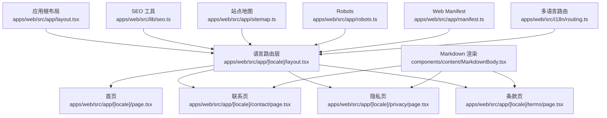
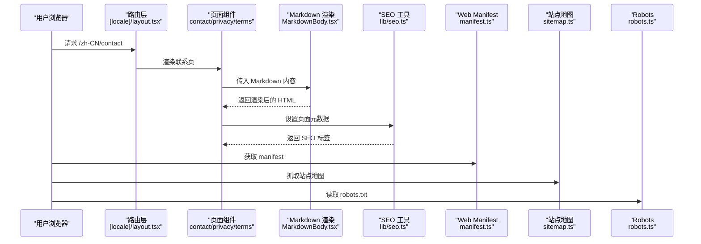
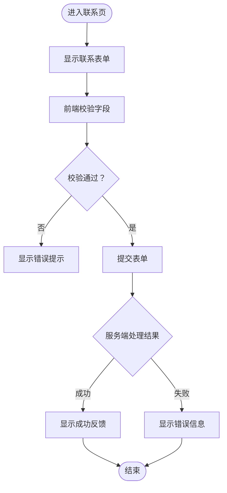
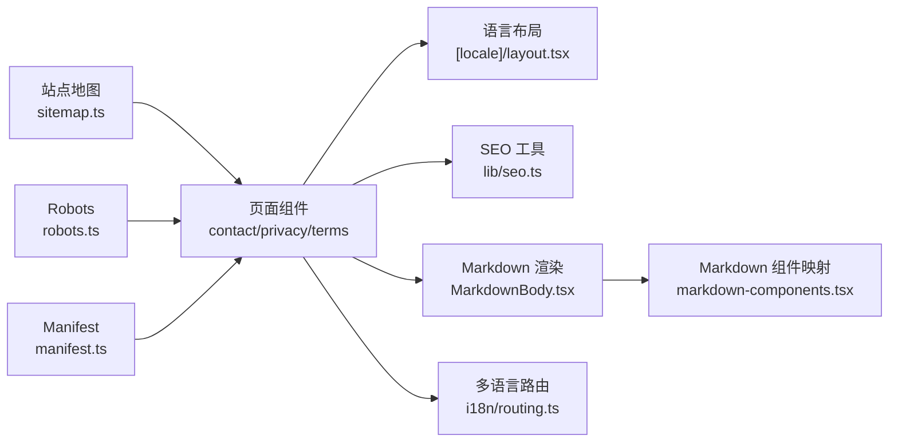

# 内容页面结构

<cite>
**本文引用的文件**   
- [apps/web/src/app/[locale]/page.tsx](file://apps/web/src/app/[locale]/page.tsx)
- [apps/web/src/app/[locale]/layout.tsx](file://apps/web/src/app/[locale]/layout.tsx)
- [apps/web/src/app/[locale]/contact/page.tsx](file://apps/web/src/app/[locale]/contact/page.tsx)
- [apps/web/src/app/[locale]/privacy/page.tsx](file://apps/web/src/app/[locale]/privacy/page.tsx)
- [apps/web/src/app/[locale]/terms/page.tsx](file://apps/web/src/app/[locale]/terms/page.tsx)
- [apps/web/src/components/content/MarkdownBody.tsx](file://apps/web/src/components/content/MarkdownBody.tsx)
- [apps/web/src/components/content/markdown-components.tsx](file://apps/web/src/components/content/markdown-components.tsx)
- [apps/web/src/lib/seo.ts](file://apps/web/src/lib/seo.ts)
- [apps/web/src/app/sitemap.ts](file://apps/web/src/app/sitemap.ts)
- [apps/web/src/app/robots.ts](file://apps/web/src/app/robots.ts)
- [apps/web/src/app/manifest.ts](file://apps/web/src/app/manifest.ts)
- [apps/web/src/lib/site-settings.ts](file://apps/web/src/lib/site-settings.ts)
- [apps/web/src/lib/navigation.ts](file://apps/web/src/lib/navigation.ts)
- [apps/web/src/i18n/routing.ts](file://apps/web/src/i18n/routing.ts)
- [apps/web/src/messages/en.json](file://apps/web/src/messages/en.json)
- [apps/web/src/messages/zh-CN.json](file://apps/web/src/messages/zh-CN.json)
- [apps/web/src/messages/zh-TW.json](file://apps/web/src/messages/zh-TW.json)
</cite>

## 目录
1. [简介](#简介)
2. [项目结构](#项目结构)
3. [核心组件](#核心组件)
4. [架构总览](#架构总览)
5. [详细组件分析](#详细组件分析)
6. [依赖分析](#依赖分析)
7. [性能考虑](#性能考虑)
8. [故障排查指南](#故障排查指南)
9. [结论](#结论)
10. [附录](#附录)

## 简介
本文件面向使用 Next.js App Router 的内容型网站，聚焦“内容页面结构”的落地实现与最佳实践。文档覆盖首页、联系页、隐私政策页等静态页面的组织方式，阐述 Markdown 渲染、表单处理、SEO 优化（元数据、站点地图、robots）、多语言与国际化配置，以及内容更新流程与版本管理建议。读者无需深入代码即可理解整体结构与扩展方法。

## 项目结构
本项目采用 Next.js App Router 的多区域布局与路由约定：
- 应用根布局位于 apps/web/src/app/layout.tsx，提供全局样式、主题与 Provider。
- 多语言路由通过 apps/web/src/app/[locale]/... 动态段实现，所有面向用户的页面均置于该目录下。
- 静态内容页面如 contact、privacy、terms 以独立文件夹 + page.tsx 的方式组织，便于按功能拆分与维护。
- SEO 相关能力集中在 sitemap.ts、robots.ts、manifest.ts 与 lib/seo.ts。
- Markdown 渲染由 components/content 下的 MarkdownBody 与 markdown-components 提供统一渲染与组件映射。
- 多语言文案集中存放于 messages 目录，并通过 i18n/routing.ts 进行路由与导航集成。

图表来源 
- [apps/web/src/app/[locale]/layout.tsx](file://apps/web/src/app/[locale]/layout.tsx)
- [apps/web/src/app/[locale]/page.tsx](file://apps/web/src/app/[locale]/page.tsx)
- [apps/web/src/app/[locale]/contact/page.tsx](file://apps/web/src/app/[locale]/contact/page.tsx)
- [apps/web/src/app/[locale]/privacy/page.tsx](file://apps/web/src/app/[locale]/privacy/page.tsx)
- [apps/web/src/app/[locale]/terms/page.tsx](file://apps/web/src/app/[locale]/terms/page.tsx)
- [apps/web/src/components/content/MarkdownBody.tsx](file://apps/web/src/components/content/MarkdownBody.tsx)
- [apps/web/src/lib/seo.ts](file://apps/web/src/lib/seo.ts)
- [apps/web/src/app/sitemap.ts](file://apps/web/src/app/sitemap.ts)
- [apps/web/src/app/robots.ts](file://apps/web/src/app/robots.ts)
- [apps/web/src/app/manifest.ts](file://apps/web/src/app/manifest.ts)
- [apps/web/src/i18n/routing.ts](file://apps/web/src/i18n/routing.ts)

章节来源
- [apps/web/src/app/[locale]/layout.tsx](file://apps/web/src/app/[locale]/layout.tsx)
- [apps/web/src/app/[locale]/page.tsx](file://apps/web/src/app/[locale]/page.tsx)
- [apps/web/src/app/[locale]/contact/page.tsx](file://apps/web/src/app/[locale]/contact/page.tsx)
- [apps/web/src/app/[locale]/privacy/page.tsx](file://apps/web/src/app/[locale]/privacy/page.tsx)
- [apps/web/src/app/[locale]/terms/page.tsx](file://apps/web/src/app/[locale]/terms/page.tsx)
- [apps/web/src/components/content/MarkdownBody.tsx](file://apps/web/src/components/content/MarkdownBody.tsx)
- [apps/web/src/lib/seo.ts](file://apps/web/src/lib/seo.ts)
- [apps/web/src/app/sitemap.ts](file://apps/web/src/app/sitemap.ts)
- [apps/web/src/app/robots.ts](file://apps/web/src/app/robots.ts)
- [apps/web/src/app/manifest.ts](file://apps/web/src/app/manifest.ts)
- [apps/web/src/i18n/routing.ts](file://apps/web/src/i18n/routing.ts)

## 核心组件
- MarkdownBody：统一的 Markdown 渲染容器，负责将 Markdown 文本转换为可访问的 HTML，并注入自定义组件映射（如图片、链接、表格等）。
- markdown-components：定义 Markdown 渲染时的组件映射表，确保内容与展示解耦，便于统一样式与行为控制。
- SEO 工具集：封装标题、描述、Open Graph、结构化数据等元数据的生成逻辑，供各页面复用。
- 站点地图与 robots：自动生成或静态声明站点地图与爬虫规则，提升搜索引擎收录质量。
- Web Manifest：定义 PWA 基础信息，增强移动端体验。
- 多语言路由与消息：基于 [locale] 动态路由与 messages 目录，实现页面文案与导航的多语言切换。

章节来源
- [apps/web/src/components/content/MarkdownBody.tsx](file://apps/web/src/components/content/MarkdownBody.tsx)
- [apps/web/src/components/content/markdown-components.tsx](file://apps/web/src/components/content/markdown-components.tsx)
- [apps/web/src/lib/seo.ts](file://apps/web/src/lib/seo.ts)
- [apps/web/src/app/sitemap.ts](file://apps/web/src/app/sitemap.ts)
- [apps/web/src/app/robots.ts](file://apps/web/src/app/robots.ts)
- [apps/web/src/app/manifest.ts](file://apps/web/src/app/manifest.ts)
- [apps/web/src/i18n/routing.ts](file://apps/web/src/i18n/routing.ts)

## 架构总览
Next.js App Router 的内容页面架构围绕“布局 + 页面 + 工具库”展开：
- 布局层：[locale] 布局负责语言上下文、导航与全局 UI；根布局负责主题、Provider 与全局样式。
- 页面层：每个内容页面（首页、联系、隐私、条款）均为独立的 page.tsx，职责单一，易于维护。
- 工具层：Markdown 渲染、SEO、i18n、媒体资源等能力被抽象为可复用模块，页面仅关注业务组装。

图表来源 
- [apps/web/src/app/[locale]/layout.tsx](file://apps/web/src/app/[locale]/layout.tsx)
- [apps/web/src/app/[locale]/contact/page.tsx](file://apps/web/src/app/[locale]/contact/page.tsx)
- [apps/web/src/app/[locale]/privacy/page.tsx](file://apps/web/src/app/[locale]/privacy/page.tsx)
- [apps/web/src/app/[locale]/terms/page.tsx](file://apps/web/src/app/[locale]/terms/page.tsx)
- [apps/web/src/components/content/MarkdownBody.tsx](file://apps/web/src/components/content/MarkdownBody.tsx)
- [apps/web/src/lib/seo.ts](file://apps/web/src/lib/seo.ts)
- [apps/web/src/app/manifest.ts](file://apps/web/src/app/manifest.ts)
- [apps/web/src/app/sitemap.ts](file://apps/web/src/app/sitemap.ts)
- [apps/web/src/app/robots.ts](file://apps/web/src/app/robots.ts)

## 详细组件分析

### 首页（Home）
- 路由位置：apps/web/src/app/[locale]/page.tsx
- 职责：作为站点入口，聚合关键信息与导航入口，通常包含 Hero、特性介绍、案例展示等区块。
- 实现要点：
  - 使用布局提供的语言上下文与导航。
  - 通过 SEO 工具设置标题、描述与 Open Graph 信息。
  - 若包含 Markdown 内容，可通过 MarkdownBody 渲染。
  - 与多语言文案结合，确保不同语言的展示一致性。

章节来源
- [apps/web/src/app/[locale]/page.tsx](file://apps/web/src/app/[locale]/page.tsx)
- [apps/web/src/lib/seo.ts](file://apps/web/src/lib/seo.ts)
- [apps/web/src/components/content/MarkdownBody.tsx](file://apps/web/src/components/content/MarkdownBody.tsx)

### 联系页面（Contact）
- 路由位置：apps/web/src/app/[locale]/contact/page.tsx
- 职责：提供联系方式与表单提交能力，支持多语言展示。
- 实现要点：
  - 表单字段校验与错误提示。
  - 提交后反馈（成功/失败），必要时调用后端 API。
  - 使用 MarkdownBody 渲染帮助说明或常见问题。
  - 通过 SEO 工具设置页面元数据，利于搜索收录。

图表来源 
- [apps/web/src/app/[locale]/contact/page.tsx](file://apps/web/src/app/[locale]/contact/page.tsx)
- [apps/web/src/components/content/MarkdownBody.tsx](file://apps/web/src/components/content/MarkdownBody.tsx)

章节来源
- [apps/web/src/app/[locale]/contact/page.tsx](file://apps/web/src/app/[locale]/contact/page.tsx)
- [apps/web/src/components/content/MarkdownBody.tsx](file://apps/web/src/components/content/MarkdownBody.tsx)

### 隐私政策页面（Privacy）
- 路由位置：apps/web/src/app/[locale]/privacy/page.tsx
- 职责：展示隐私政策内容，通常以 Markdown 形式维护，便于编辑与版本控制。
- 实现要点：
  - 通过 MarkdownBody 渲染策略文本，保证可读性与可访问性。
  - 使用 SEO 工具设置标题与描述，避免重复内容。
  - 多语言文案与路由联动，确保不同地区用户看到对应版本。

章节来源
- [apps/web/src/app/[locale]/privacy/page.tsx](file://apps/web/src/app/[locale]/privacy/page.tsx)
- [apps/web/src/components/content/MarkdownBody.tsx](file://apps/web/src/components/content/MarkdownBody.tsx)
- [apps/web/src/lib/seo.ts](file://apps/web/src/lib/seo.ts)

### 条款页面（Terms）
- 路由位置：apps/web/src/app/[locale]/terms/page.tsx
- 职责：展示服务条款，结构与隐私页类似，强调清晰排版与可访问性。
- 实现要点：
  - 使用 MarkdownBody 渲染条款内容。
  - 通过 SEO 工具设置合适的元数据。
  - 多语言路由与消息文件配合，确保一致体验。

章节来源
- [apps/web/src/app/[locale]/terms/page.tsx](file://apps/web/src/app/[locale]/terms/page.tsx)
- [apps/web/src/components/content/MarkdownBody.tsx](file://apps/web/src/components/content/MarkdownBody.tsx)
- [apps/web/src/lib/seo.ts](file://apps/web/src/lib/seo.ts)

### Markdown 渲染组件
- MarkdownBody：统一渲染入口，接收 Markdown 字符串，输出语义化 HTML。
- markdown-components：定义渲染映射，例如图片懒加载、链接新窗口打开、代码高亮等。
- 优势：内容与样式分离，便于统一规范与迭代升级。

章节来源
- [apps/web/src/components/content/MarkdownBody.tsx](file://apps/web/src/components/content/MarkdownBody.tsx)
- [apps/web/src/components/content/markdown-components.tsx](file://apps/web/src/components/content/markdown-components.tsx)

### SEO 与元数据
- lib/seo.ts：封装标题、描述、OG 标签、结构化数据等生成逻辑。
- sitemap.ts：生成站点地图，提升搜索引擎索引效率。
- robots.ts：定义爬虫规则，控制抓取行为。
- manifest.ts：定义 PWA 基础信息，改善移动端体验。

章节来源
- [apps/web/src/lib/seo.ts](file://apps/web/src/lib/seo.ts)
- [apps/web/src/app/sitemap.ts](file://apps/web/src/app/sitemap.ts)
- [apps/web/src/app/robots.ts](file://apps/web/src/app/robots.ts)
- [apps/web/src/app/manifest.ts](file://apps/web/src/app/manifest.ts)

### 多语言与国际化
- [locale] 动态路由：根据 URL 前缀区分语言，如 /zh-CN、/en、/zh-TW。
- messages 目录：集中管理文案键值对，页面按需引用。
- i18n/routing.ts：提供路由与导航辅助函数，确保链接与跳转遵循多语言规则。

章节来源
- [apps/web/src/i18n/routing.ts](file://apps/web/src/i18n/routing.ts)
- [apps/web/src/messages/en.json](file://apps/web/src/messages/en.json)
- [apps/web/src/messages/zh-CN.json](file://apps/web/src/messages/zh-CN.json)
- [apps/web/src/messages/zh-TW.json](file://apps/web/src/messages/zh-TW.json)

## 依赖分析
- 页面组件依赖布局与 SEO 工具，确保一致的元数据与导航。
- Markdown 渲染组件被多个内容页面复用，降低耦合度。
- 多语言路由贯穿所有页面，保证链接与文案的一致性。
- 站点地图与 robots 在构建期或运行期生成，减少手动维护成本。

图表来源 
- [apps/web/src/app/[locale]/contact/page.tsx](file://apps/web/src/app/[locale]/contact/page.tsx)
- [apps/web/src/app/[locale]/privacy/page.tsx](file://apps/web/src/app/[locale]/privacy/page.tsx)
- [apps/web/src/app/[locale]/terms/page.tsx](file://apps/web/src/app/[locale]/terms/page.tsx)
- [apps/web/src/app/[locale]/layout.tsx](file://apps/web/src/app/[locale]/layout.tsx)
- [apps/web/src/components/content/MarkdownBody.tsx](file://apps/web/src/components/content/MarkdownBody.tsx)
- [apps/web/src/components/content/markdown-components.tsx](file://apps/web/src/components/content/markdown-components.tsx)
- [apps/web/src/lib/seo.ts](file://apps/web/src/lib/seo.ts)
- [apps/web/src/app/sitemap.ts](file://apps/web/src/app/sitemap.ts)
- [apps/web/src/app/robots.ts](file://apps/web/src/app/robots.ts)
- [apps/web/src/app/manifest.ts](file://apps/web/src/app/manifest.ts)
- [apps/web/src/i18n/routing.ts](file://apps/web/src/i18n/routing.ts)

章节来源
- [apps/web/src/app/[locale]/layout.tsx](file://apps/web/src/app/[locale]/layout.tsx)
- [apps/web/src/app/[locale]/contact/page.tsx](file://apps/web/src/app/[locale]/contact/page.tsx)
- [apps/web/src/app/[locale]/privacy/page.tsx](file://apps/web/src/app/[locale]/privacy/page.tsx)
- [apps/web/src/app/[locale]/terms/page.tsx](file://apps/web/src/app/[locale]/terms/page.tsx)
- [apps/web/src/components/content/MarkdownBody.tsx](file://apps/web/src/components/content/MarkdownBody.tsx)
- [apps/web/src/components/content/markdown-components.tsx](file://apps/web/src/components/content/markdown-components.tsx)
- [apps/web/src/lib/seo.ts](file://apps/web/src/lib/seo.ts)
- [apps/web/src/app/sitemap.ts](file://apps/web/src/app/sitemap.ts)
- [apps/web/src/app/robots.ts](file://apps/web/src/app/robots.ts)
- [apps/web/src/app/manifest.ts](file://apps/web/src/app/manifest.ts)
- [apps/web/src/i18n/routing.ts](file://apps/web/src/i18n/routing.ts)

## 性能考虑
- 静态内容优先：对于隐私、条款等不常变更的页面，尽量采用静态生成，减少运行时开销。
- Markdown 渲染优化：避免在渲染时执行重型计算，必要时缓存解析结果。
- 图片与媒体：使用懒加载与合适的尺寸，减少首屏负载。
- SEO 元数据：在构建期生成 sitemap 与 robots，避免每次请求都计算。
- 多语言资源：按需加载语言包，减小初始包体积。

## 故障排查指南
- 页面未正确显示元数据：检查 SEO 工具调用是否正确，确认 title、description、OG 标签是否设置。
- Markdown 渲染异常：核对 markdown-components 映射是否完整，检查输入内容的格式与转义。
- 多语言路由失效：确认 i18n/routing.ts 配置与 messages 文件键值是否一致，检查链接拼接是否符合路由规则。
- 表单提交失败：查看前端校验逻辑与服务端响应，定位错误码与提示信息。
- 站点地图未更新：检查 sitemap.ts 生成逻辑与部署脚本，确保构建产物已更新。

章节来源
- [apps/web/src/lib/seo.ts](file://apps/web/src/lib/seo.ts)
- [apps/web/src/components/content/MarkdownBody.tsx](file://apps/web/src/components/content/MarkdownBody.tsx)
- [apps/web/src/components/content/markdown-components.tsx](file://apps/web/src/components/content/markdown-components.tsx)
- [apps/web/src/i18n/routing.ts](file://apps/web/src/i18n/routing.ts)
- [apps/web/src/app/sitemap.ts](file://apps/web/src/app/sitemap.ts)
- [apps/web/src/app/robots.ts](file://apps/web/src/app/robots.ts)

## 结论
通过 Next.js App Router 的模块化组织与工具库抽象，内容页面具备清晰的职责边界与良好的可扩展性。Markdown 渲染、SEO 优化、多语言与表单处理等能力被有效解耦，便于团队协作与持续迭代。建议在内容更新流程中引入版本管理与自动化测试，确保稳定性与一致性。

## 附录
- 内容更新流程建议：
  - 使用 Git 分支管理，按功能或页面划分 PR。
  - 对 Markdown 内容进行预览与校验，确保语法与链接有效。
  - 构建阶段生成 sitemap 与 robots，发布前验证元数据与多语言完整性。
- 版本管理最佳实践：
  - 为重要页面建立变更记录，保留历史版本以便回滚。
  - 使用语义化版本与变更日志，便于追踪影响范围。
  - 对 SEO 元数据进行回归测试，防止因改动导致收录问题。