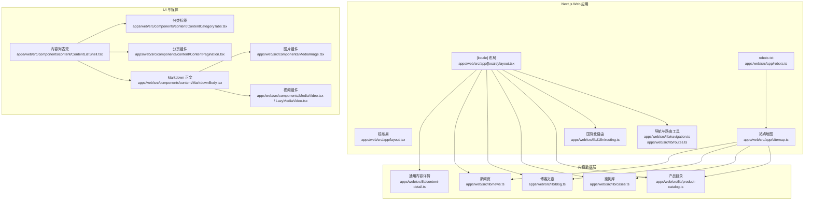
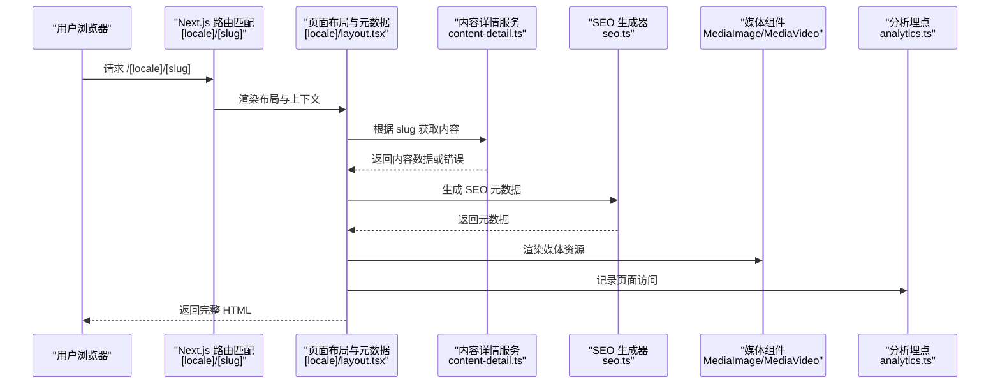
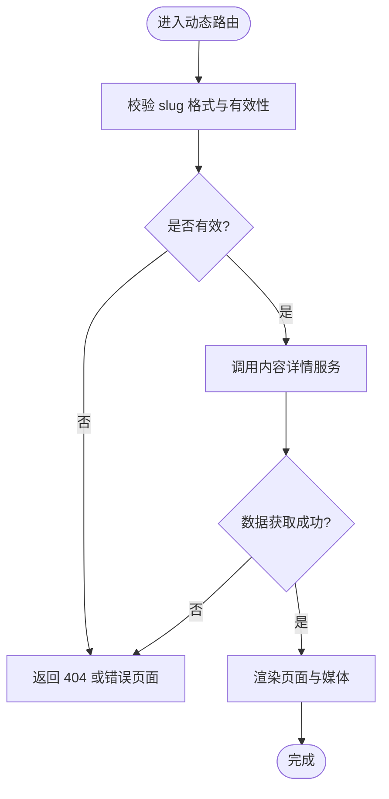
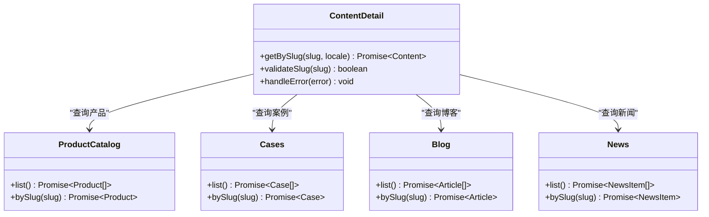
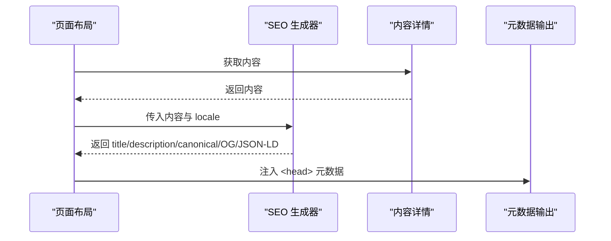
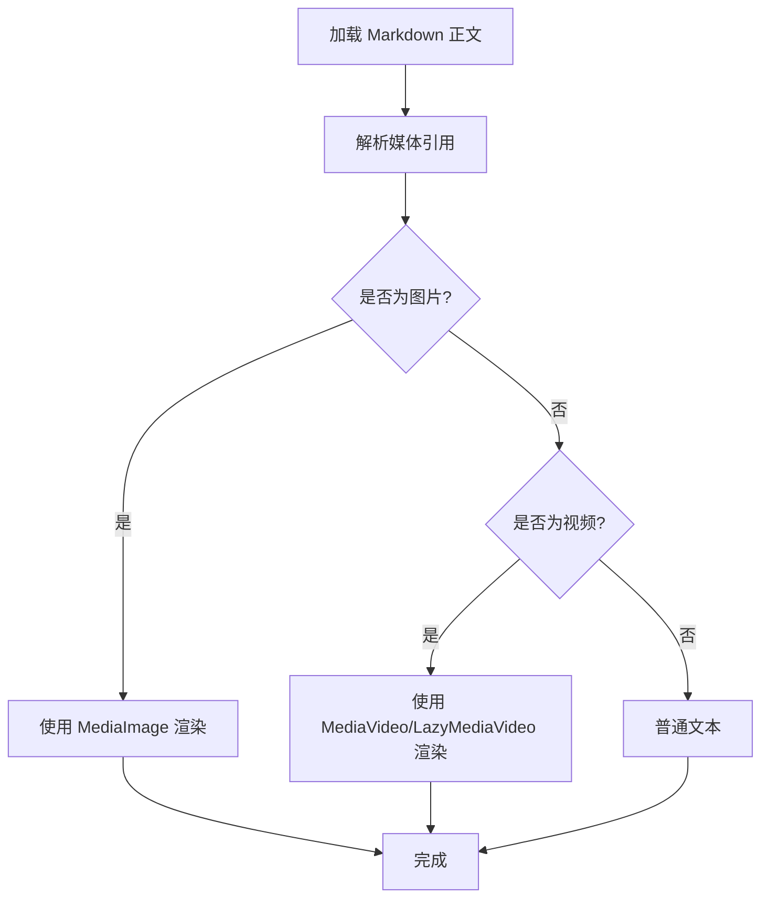
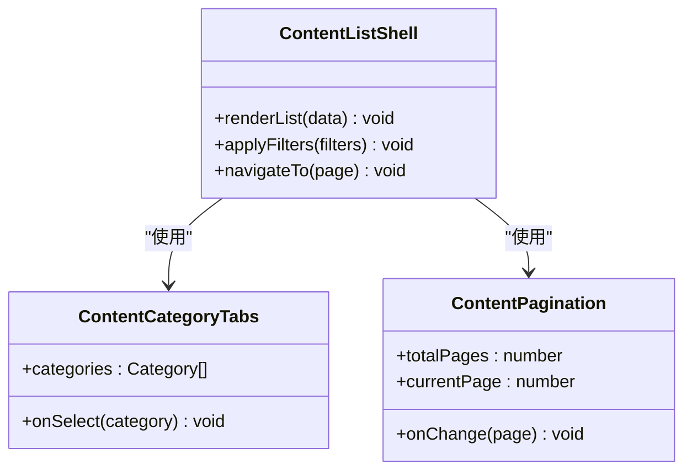
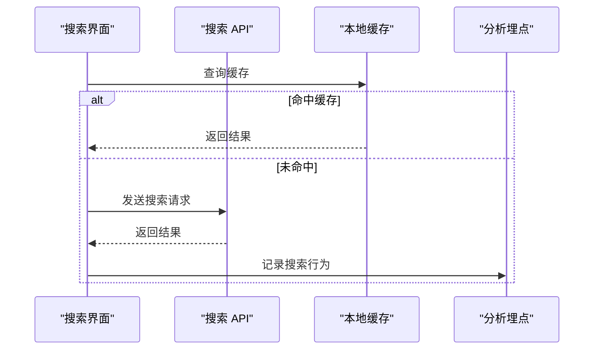
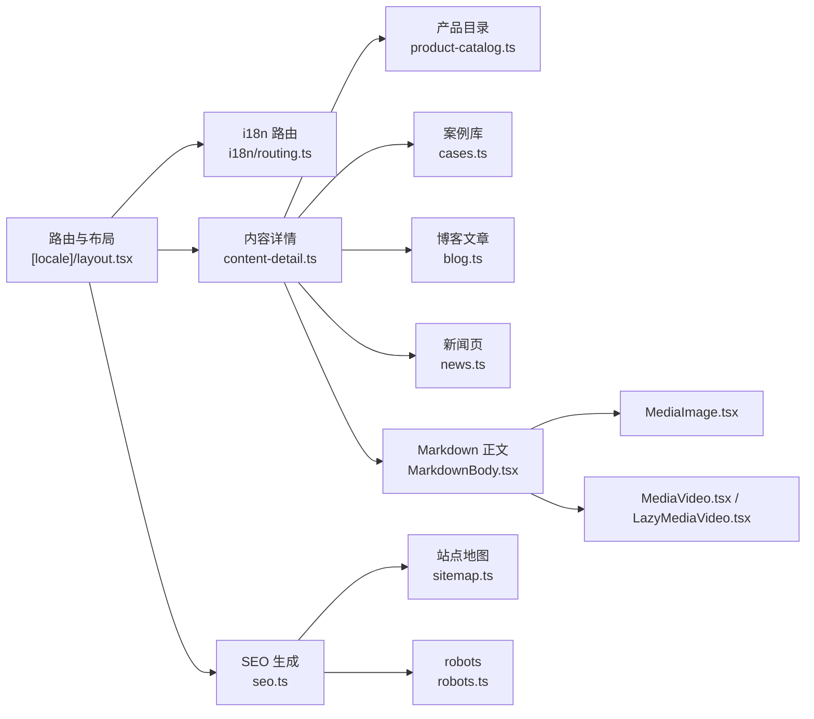

# 动态路由实现

<cite>
**本文引用的文件**   
- [apps/web/src/app/[locale]/layout.tsx](file://apps/web/src/app/[locale]/layout.tsx)
- [apps/web/src/app/layout.tsx](file://apps/web/src/app/layout.tsx)
- [apps/web/src/app/sitemap.ts](file://apps/web/src/app/sitemap.ts)
- [apps/web/src/app/robots.ts](file://apps/web/src/app/robots.ts)
- [apps/web/src/lib/navigation.ts](file://apps/web/src/lib/navigation.ts)
- [apps/web/src/lib/routes.ts](file://apps/web/src/lib/routes.ts)
- [apps/web/src/lib/i18n/routing.ts](file://apps/web/src/lib/i18n/routing.ts)
- [apps/web/src/lib/seo.ts](file://apps/web/src/lib/seo.ts)
- [apps/web/src/lib/media-url.ts](file://apps/web/src/lib/media-url.ts)
- [apps/web/src/lib/product-catalog.ts](file://apps/web/src/lib/product-catalog.ts)
- [apps/web/src/lib/cases.ts](file://apps/web/src/lib/cases.ts)
- [apps/web/src/lib/blog.ts](file://apps/web/src/lib/blog.ts)
- [apps/web/src/lib/news.ts](file://apps/web/src/lib/news.ts)
- [apps/web/src/lib/content-detail.ts](file://apps/web/src/lib/content-detail.ts)
- [apps/web/src/components/content/ContentListShell.tsx](file://apps/web/src/components/content/ContentListShell.tsx)
- [apps/web/src/components/content/ContentCategoryTabs.tsx](file://apps/web/src/components/content/ContentCategoryTabs.tsx)
- [apps/web/src/components/content/ContentPagination.tsx](file://apps/web/src/components/content/ContentPagination.tsx)
- [apps/web/src/components/content/MarkdownBody.tsx](file://apps/web/src/components/content/MarkdownBody.tsx)
- [apps/web/src/components/MediaImage.tsx](file://apps/web/src/components/MediaImage.tsx)
- [apps/web/src/components/MediaVideo.tsx](file://apps/web/src/components/MediaVideo.tsx)
- [apps/web/src/components/LazyMediaVideo.tsx](file://apps/web/src/components/LazyMediaVideo.tsx)
- [apps/web/src/components/analytics/VisitorTracker.tsx](file://apps/web/src/components/analytics/VisitorTracker.tsx)
- [apps/web/src/app/api/search/route.ts](file://apps/web/src/app/api/search/route.ts)
- [apps/web/src/app/api/search/suggest/route.ts](file://apps/web/src/app/api/search/suggest/route.ts)
- [apps/web/src/app/api/search/analytics/route.ts](file://apps/web/src/app/api/search/analytics/route.ts)
- [apps/web/src/lib/analytics.ts](file://apps/web/src/lib/analytics.ts)
</cite>

## 目录
1. [简介](#简介)
2. [项目结构](#项目结构)
3. [核心组件](#核心组件)
4. [架构总览](#架构总览)
5. [详细组件分析](#详细组件分析)
6. [依赖关系分析](#依赖关系分析)
7. [性能考量](#性能考量)
8. [故障排查指南](#故障排查指南)
9. [结论](#结论)
10. [附录](#附录)

## 简介
本文件围绕 Next.js App Router 的动态路由机制，系统阐述基于 [slug] 参数化的产品详情、案例详情、博客文章等动态内容页面的加载流程。文档覆盖参数校验、数据获取策略（服务端渲染与客户端请求）、错误处理、SEO 元数据动态生成、缓存策略与性能优化，并提供可落地的最佳实践与代码示例路径，帮助读者快速理解并落地实现。

## 项目结构
本项目采用多应用仓库结构，Web 端位于 apps/web，使用 Next.js App Router 组织页面与路由。动态路由通过 [locale] 国际化前缀与资源目录下的 [slug] 参数化路由组合，形成如 /[locale]/products/[slug]、/[locale]/cases/[slug]、/[locale]/blog/[slug] 等路径。

图表来源
- [apps/web/src/app/[locale]/layout.tsx](file://apps/web/src/app/[locale]/layout.tsx)
- [apps/web/src/app/layout.tsx](file://apps/web/src/app/layout.tsx)
- [apps/web/src/app/sitemap.ts](file://apps/web/src/app/sitemap.ts)
- [apps/web/src/app/robots.ts](file://apps/web/src/app/robots.ts)
- [apps/web/src/lib/navigation.ts](file://apps/web/src/lib/navigation.ts)
- [apps/web/src/lib/routes.ts](file://apps/web/src/lib/routes.ts)
- [apps/web/src/lib/i18n/routing.ts](file://apps/web/src/lib/i18n/routing.ts)
- [apps/web/src/lib/product-catalog.ts](file://apps/web/src/lib/product-catalog.ts)
- [apps/web/src/lib/cases.ts](file://apps/web/src/lib/cases.ts)
- [apps/web/src/lib/blog.ts](file://apps/web/src/lib/blog.ts)
- [apps/web/src/lib/news.ts](file://apps/web/src/lib/news.ts)
- [apps/web/src/lib/content-detail.ts](file://apps/web/src/lib/content-detail.ts)
- [apps/web/src/components/content/ContentListShell.tsx](file://apps/web/src/components/content/ContentListShell.tsx)
- [apps/web/src/components/content/ContentCategoryTabs.tsx](file://apps/web/src/components/content/ContentCategoryTabs.tsx)
- [apps/web/src/components/content/ContentPagination.tsx](file://apps/web/src/components/content/ContentPagination.tsx)
- [apps/web/src/components/content/MarkdownBody.tsx](file://apps/web/src/components/content/MarkdownBody.tsx)
- [apps/web/src/components/MediaImage.tsx](file://apps/web/src/components/MediaImage.tsx)
- [apps/web/src/components/MediaVideo.tsx](file://apps/web/src/components/MediaVideo.tsx)
- [apps/web/src/components/LazyMediaVideo.tsx](file://apps/web/src/components/LazyMediaVideo.tsx)

章节来源
- [apps/web/src/app/[locale]/layout.tsx](file://apps/web/src/app/[locale]/layout.tsx)
- [apps/web/src/app/layout.tsx](file://apps/web/src/app/layout.tsx)
- [apps/web/src/app/sitemap.ts](file://apps/web/src/app/sitemap.ts)
- [apps/web/src/app/robots.ts](file://apps/web/src/app/robots.ts)
- [apps/web/src/lib/navigation.ts](file://apps/web/src/lib/navigation.ts)
- [apps/web/src/lib/routes.ts](file://apps/web/src/lib/routes.ts)
- [apps/web/src/lib/i18n/routing.ts](file://apps/web/src/lib/i18n/routing.ts)

## 核心组件
- 国际化与路由：[locale] 作为一级路由段，结合 i18n 路由工具进行语言切换与 URL 规范化。
- 动态路由参数：[slug] 用于产品、案例、博客、新闻等内容的唯一标识，统一由内容详情模块解析与校验。
- 数据获取：服务端优先读取静态或 API 数据，结合 Next.js 的缓存与增量静态再生成（ISR）策略。
- SEO 元数据：根据 slug 动态生成 title、description、canonical、Open Graph、JSON-LD 等。
- 媒体渲染：图片与视频组件支持懒加载、占位图与自适应尺寸，提升首屏性能。

章节来源
- [apps/web/src/lib/i18n/routing.ts](file://apps/web/src/lib/i18n/routing.ts)
- [apps/web/src/lib/content-detail.ts](file://apps/web/src/lib/content-detail.ts)
- [apps/web/src/lib/seo.ts](file://apps/web/src/lib/seo.ts)
- [apps/web/src/components/MediaImage.tsx](file://apps/web/src/components/MediaImage.tsx)
- [apps/web/src/components/MediaVideo.tsx](file://apps/web/src/components/MediaVideo.tsx)
- [apps/web/src/components/LazyMediaVideo.tsx](file://apps/web/src/components/LazyMediaVideo.tsx)

## 架构总览
下图展示从浏览器访问到动态内容渲染的整体流程，包括路由匹配、参数校验、数据获取、SEO 生成与媒体渲染。

图表来源
- [apps/web/src/app/[locale]/layout.tsx](file://apps/web/src/app/[locale]/layout.tsx)
- [apps/web/src/lib/content-detail.ts](file://apps/web/src/lib/content-detail.ts)
- [apps/web/src/lib/seo.ts](file://apps/web/src/lib/seo.ts)
- [apps/web/src/components/MediaImage.tsx](file://apps/web/src/components/MediaImage.tsx)
- [apps/web/src/components/MediaVideo.tsx](file://apps/web/src/components/MediaVideo.tsx)
- [apps/web/src/lib/analytics.ts](file://apps/web/src/lib/analytics.ts)

## 详细组件分析

### 动态路由与参数验证
- 路由段设计：[locale] 与 [slug] 两段式路由，确保多语言与内容唯一性。
- 参数校验：在内容详情服务中统一对 slug 进行格式校验与存在性检查，避免非法输入导致异常。
- 错误处理：当 slug 不存在或数据获取失败时，返回统一的 404 或错误状态，并由全局错误页面接管。

图表来源
- [apps/web/src/lib/content-detail.ts](file://apps/web/src/lib/content-detail.ts)
- [apps/web/src/app/[locale]/layout.tsx](file://apps/web/src/app/[locale]/layout.tsx)

章节来源
- [apps/web/src/lib/content-detail.ts](file://apps/web/src/lib/content-detail.ts)
- [apps/web/src/app/[locale]/layout.tsx](file://apps/web/src/app/[locale]/layout.tsx)

### 数据获取策略
- 服务端优先：在布局或页面级别发起数据请求，利用 Next.js 的服务端能力减少客户端负载。
- 缓存策略：对静态或低频更新的内容启用 ISR；对高频内容采用短期缓存与按需刷新。
- 错误降级：网络异常或服务不可用时，提供降级数据或友好提示。

图表来源
- [apps/web/src/lib/content-detail.ts](file://apps/web/src/lib/content-detail.ts)
- [apps/web/src/lib/product-catalog.ts](file://apps/web/src/lib/product-catalog.ts)
- [apps/web/src/lib/cases.ts](file://apps/web/src/lib/cases.ts)
- [apps/web/src/lib/blog.ts](file://apps/web/src/lib/blog.ts)
- [apps/web/src/lib/news.ts](file://apps/web/src/lib/news.ts)

章节来源
- [apps/web/src/lib/content-detail.ts](file://apps/web/src/lib/content-detail.ts)
- [apps/web/src/lib/product-catalog.ts](file://apps/web/src/lib/product-catalog.ts)
- [apps/web/src/lib/cases.ts](file://apps/web/src/lib/cases.ts)
- [apps/web/src/lib/blog.ts](file://apps/web/src/lib/blog.ts)
- [apps/web/src/lib/news.ts](file://apps/web/src/lib/news.ts)

### SEO 元数据动态生成
- 标题与描述：根据内容标题与摘要动态生成，避免重复与缺失。
- 规范链接：为每个 slug 生成 canonical 链接，防止重复索引。
- Open Graph 与 JSON-LD：补充社交分享与结构化数据，提升搜索引擎可见性。
- 站点地图与 robots：集中管理可抓取内容与规则。

图表来源
- [apps/web/src/lib/seo.ts](file://apps/web/src/lib/seo.ts)
- [apps/web/src/app/sitemap.ts](file://apps/web/src/app/sitemap.ts)
- [apps/web/src/app/robots.ts](file://apps/web/src/app/robots.ts)

章节来源
- [apps/web/src/lib/seo.ts](file://apps/web/src/lib/seo.ts)
- [apps/web/src/app/sitemap.ts](file://apps/web/src/app/sitemap.ts)
- [apps/web/src/app/robots.ts](file://apps/web/src/app/robots.ts)

### 媒体渲染与懒加载
- 图片组件：支持占位图、自适应尺寸、懒加载与 CDN 优化。
- 视频组件：支持懒加载与播放控制，避免阻塞首屏。
- Markdown 正文：渲染富文本内容，内嵌媒体资源。

图表来源
- [apps/web/src/components/content/MarkdownBody.tsx](file://apps/web/src/components/content/MarkdownBody.tsx)
- [apps/web/src/components/MediaImage.tsx](file://apps/web/src/components/MediaImage.tsx)
- [apps/web/src/components/MediaVideo.tsx](file://apps/web/src/components/MediaVideo.tsx)
- [apps/web/src/components/LazyMediaVideo.tsx](file://apps/web/src/components/LazyMediaVideo.tsx)

章节来源
- [apps/web/src/components/content/MarkdownBody.tsx](file://apps/web/src/components/content/MarkdownBody.tsx)
- [apps/web/src/components/MediaImage.tsx](file://apps/web/src/components/MediaImage.tsx)
- [apps/web/src/components/MediaVideo.tsx](file://apps/web/src/components/MediaVideo.tsx)
- [apps/web/src/components/LazyMediaVideo.tsx](file://apps/web/src/components/LazyMediaVideo.tsx)

### 列表与分页
- 内容列表壳：统一承载分类、筛选、排序与分页逻辑。
- 分类标签：按类别过滤内容，提升浏览体验。
- 分页组件：支持页码跳转与无限滚动（可选）。

图表来源
- [apps/web/src/components/content/ContentListShell.tsx](file://apps/web/src/components/content/ContentListShell.tsx)
- [apps/web/src/components/content/ContentCategoryTabs.tsx](file://apps/web/src/components/content/ContentCategoryTabs.tsx)
- [apps/web/src/components/content/ContentPagination.tsx](file://apps/web/src/components/content/ContentPagination.tsx)

章节来源
- [apps/web/src/components/content/ContentListShell.tsx](file://apps/web/src/components/content/ContentListShell.tsx)
- [apps/web/src/components/content/ContentCategoryTabs.tsx](file://apps/web/src/components/content/ContentCategoryTabs.tsx)
- [apps/web/src/components/content/ContentPagination.tsx](file://apps/web/src/components/content/ContentPagination.tsx)

### 搜索与分析
- 搜索接口：提供关键词建议与搜索结果，支持前端缓存与去抖。
- 分析埋点：记录页面访问、搜索行为与交互事件，便于数据分析。

图表来源
- [apps/web/src/app/api/search/route.ts](file://apps/web/src/app/api/search/route.ts)
- [apps/web/src/app/api/search/suggest/route.ts](file://apps/web/src/app/api/search/suggest/route.ts)
- [apps/web/src/app/api/search/analytics/route.ts](file://apps/web/src/app/api/search/analytics/route.ts)
- [apps/web/src/lib/analytics.ts](file://apps/web/src/lib/analytics.ts)

章节来源
- [apps/web/src/app/api/search/route.ts](file://apps/web/src/app/api/search/route.ts)
- [apps/web/src/app/api/search/suggest/route.ts](file://apps/web/src/app/api/search/suggest/route.ts)
- [apps/web/src/app/api/search/analytics/route.ts](file://apps/web/src/app/api/search/analytics/route.ts)
- [apps/web/src/lib/analytics.ts](file://apps/web/src/lib/analytics.ts)

## 依赖关系分析
- 路由与国际化：[locale] 路由段与 i18n 路由工具紧密耦合，确保多语言一致性。
- 内容数据层：product-catalog、cases、blog、news 等模块被 content-detail 统一调度，降低页面复杂度。
- SEO 与站点配置：sitemap 与 robots 集中管理可抓取内容，提升 SEO 效果。
- 媒体组件：MarkdownBody 依赖 MediaImage/MediaVideo，形成稳定的渲染链路。

图表来源
- [apps/web/src/app/[locale]/layout.tsx](file://apps/web/src/app/[locale]/layout.tsx)
- [apps/web/src/lib/i18n/routing.ts](file://apps/web/src/lib/i18n/routing.ts)
- [apps/web/src/lib/content-detail.ts](file://apps/web/src/lib/content-detail.ts)
- [apps/web/src/lib/product-catalog.ts](file://apps/web/src/lib/product-catalog.ts)
- [apps/web/src/lib/cases.ts](file://apps/web/src/lib/cases.ts)
- [apps/web/src/lib/blog.ts](file://apps/web/src/lib/blog.ts)
- [apps/web/src/lib/news.ts](file://apps/web/src/lib/news.ts)
- [apps/web/src/lib/seo.ts](file://apps/web/src/lib/seo.ts)
- [apps/web/src/app/sitemap.ts](file://apps/web/src/app/sitemap.ts)
- [apps/web/src/app/robots.ts](file://apps/web/src/app/robots.ts)
- [apps/web/src/components/content/MarkdownBody.tsx](file://apps/web/src/components/content/MarkdownBody.tsx)
- [apps/web/src/components/MediaImage.tsx](file://apps/web/src/components/MediaImage.tsx)
- [apps/web/src/components/MediaVideo.tsx](file://apps/web/src/components/MediaVideo.tsx)
- [apps/web/src/components/LazyMediaVideo.tsx](file://apps/web/src/components/LazyMediaVideo.tsx)

章节来源
- [apps/web/src/app/[locale]/layout.tsx](file://apps/web/src/app/[locale]/layout.tsx)
- [apps/web/src/lib/i18n/routing.ts](file://apps/web/src/lib/i18n/routing.ts)
- [apps/web/src/lib/content-detail.ts](file://apps/web/src/lib/content-detail.ts)
- [apps/web/src/lib/product-catalog.ts](file://apps/web/src/lib/product-catalog.ts)
- [apps/web/src/lib/cases.ts](file://apps/web/src/lib/cases.ts)
- [apps/web/src/lib/blog.ts](file://apps/web/src/lib/blog.ts)
- [apps/web/src/lib/news.ts](file://apps/web/src/lib/news.ts)
- [apps/web/src/lib/seo.ts](file://apps/web/src/lib/seo.ts)
- [apps/web/src/app/sitemap.ts](file://apps/web/src/app/sitemap.ts)
- [apps/web/src/app/robots.ts](file://apps/web/src/app/robots.ts)
- [apps/web/src/components/content/MarkdownBody.tsx](file://apps/web/src/components/content/MarkdownBody.tsx)
- [apps/web/src/components/MediaImage.tsx](file://apps/web/src/components/MediaImage.tsx)
- [apps/web/src/components/MediaVideo.tsx](file://apps/web/src/components/MediaVideo.tsx)
- [apps/web/src/components/LazyMediaVideo.tsx](file://apps/web/src/components/LazyMediaVideo.tsx)

## 性能考量
- 服务端渲染与缓存：优先在服务端获取数据，结合 ISR 与短期缓存减少重复请求。
- 媒体优化：图片懒加载、自适应尺寸与 CDN 加速；视频懒加载与按需播放。
- 路由与导航：使用统一的导航与路由工具，避免重复计算与重渲染。
- 分析与埋点：异步记录，避免阻塞主线程。

[本节为通用指导，不直接分析具体文件]

## 故障排查指南
- 404 与无效 slug：确认 slug 校验逻辑与内容是否存在，检查内容详情服务的错误处理分支。
- 媒体加载失败：检查媒体 URL 生成与 CDN 配置，确保图片与视频路径正确。
- SEO 缺失：核对 SEO 生成器是否接收到必要字段，检查 sitemap 与 robots 配置。
- 搜索无结果：验证搜索接口与缓存策略，检查去抖与请求频率限制。

章节来源
- [apps/web/src/lib/content-detail.ts](file://apps/web/src/lib/content-detail.ts)
- [apps/web/src/lib/media-url.ts](file://apps/web/src/lib/media-url.ts)
- [apps/web/src/lib/seo.ts](file://apps/web/src/lib/seo.ts)
- [apps/web/src/app/api/search/route.ts](file://apps/web/src/app/api/search/route.ts)

## 结论
通过 [locale] 与 [slug] 的组合，本项目实现了灵活且可扩展的动态路由体系。内容详情服务统一了参数校验与数据获取，SEO 生成器保障了搜索引擎友好性，媒体组件提升了渲染性能。遵循本文档的最佳实践，可在保证用户体验的同时，持续优化性能与可维护性。

[本节为总结，不直接分析具体文件]

## 附录
- 最佳实践清单
  - 始终对 slug 进行严格校验与存在性检查。
  - 在服务端优先获取数据，合理使用缓存与 ISR。
  - 为每个动态页面生成完整的 SEO 元数据。
  - 媒体资源使用懒加载与 CDN 加速。
  - 统一错误处理与降级策略，提升鲁棒性。
- 参考文件路径
  - 路由与布局：[apps/web/src/app/[locale]/layout.tsx](file://apps/web/src/app/[locale]/layout.tsx)、[apps/web/src/app/layout.tsx](file://apps/web/src/app/layout.tsx)
  - 内容详情：[apps/web/src/lib/content-detail.ts](file://apps/web/src/lib/content-detail.ts)
  - SEO：[apps/web/src/lib/seo.ts](file://apps/web/src/lib/seo.ts)、[apps/web/src/app/sitemap.ts](file://apps/web/src/app/sitemap.ts)、[apps/web/src/app/robots.ts](file://apps/web/src/app/robots.ts)
  - 媒体：[apps/web/src/components/MediaImage.tsx](file://apps/web/src/components/MediaImage.tsx)、[apps/web/src/components/MediaVideo.tsx](file://apps/web/src/components/MediaVideo.tsx)、[apps/web/src/components/LazyMediaVideo.tsx](file://apps/web/src/components/LazyMediaVideo.tsx)
  - 列表与分页：[apps/web/src/components/content/ContentListShell.tsx](file://apps/web/src/components/content/ContentListShell.tsx)、[apps/web/src/components/content/ContentCategoryTabs.tsx](file://apps/web/src/components/content/ContentCategoryTabs.tsx)、[apps/web/src/components/content/ContentPagination.tsx](file://apps/web/src/components/content/ContentPagination.tsx)
  - 搜索与分析：[apps/web/src/app/api/search/route.ts](file://apps/web/src/app/api/search/route.ts)、[apps/web/src/lib/analytics.ts](file://apps/web/src/lib/analytics.ts)