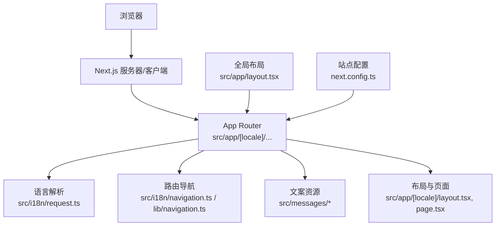
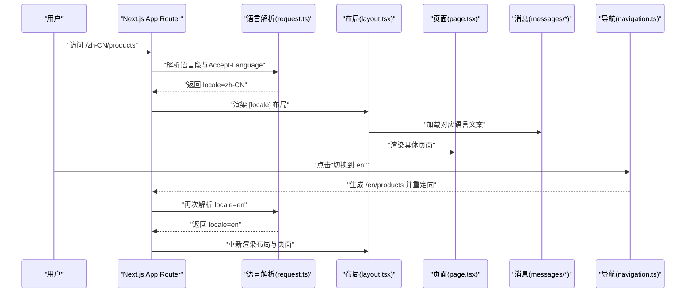
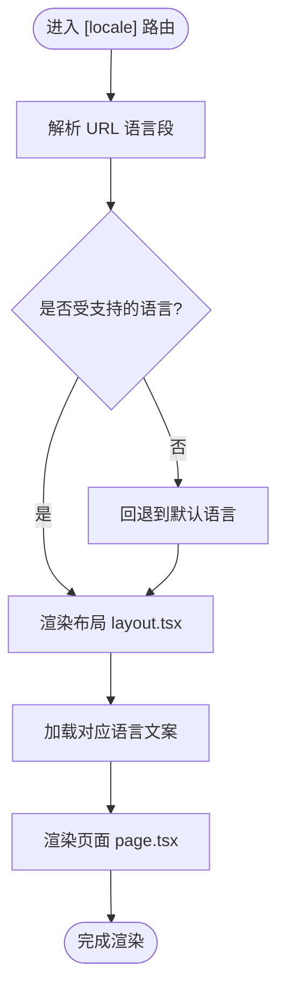
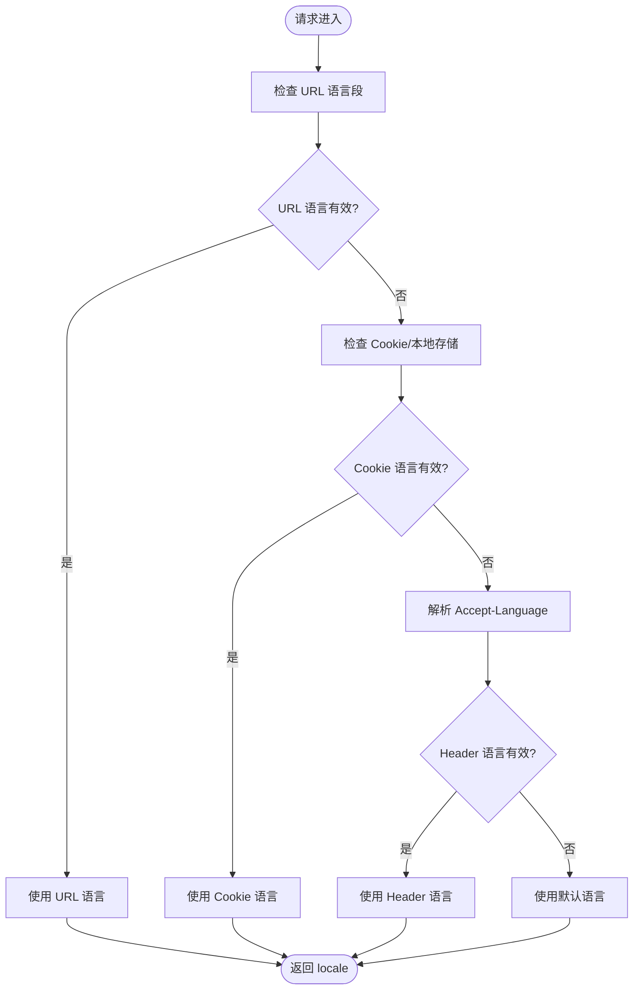
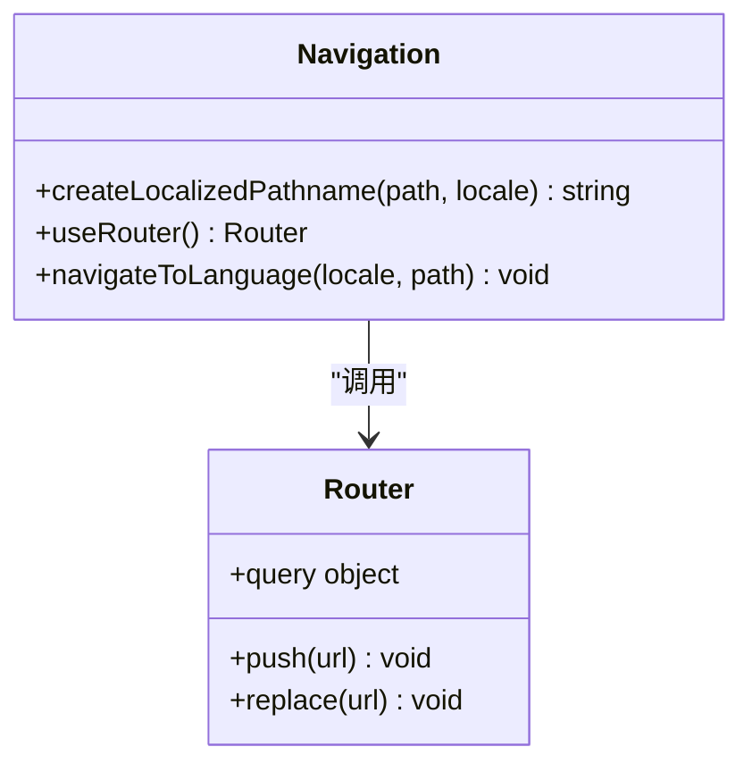
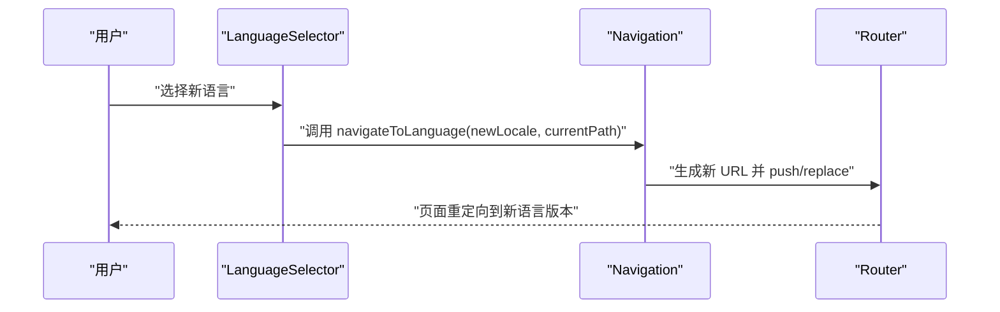
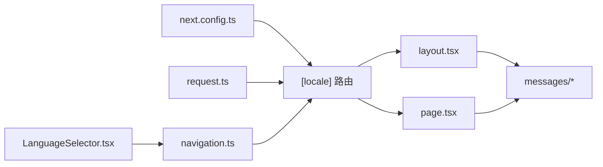

# 国际化路由配置

<cite>
**本文引用的文件**   
- [apps/web/src/app/[locale]/layout.tsx](file://apps/web/src/app/[locale]/layout.tsx)
- [apps/web/src/app/[locale]/page.tsx](file://apps/web/src/app/[locale]/page.tsx)
- [apps/web/src/app/layout.tsx](file://apps/web/src/app/layout.tsx)
- [apps/web/src/i18n/navigation.ts](file://apps/web/src/i18n/navigation.ts)
- [apps/web/src/i18n/request.ts](file://apps/web/src/i18n/request.ts)
- [apps/web/src/i18n/routing.ts](file://apps/web/src/i18n/routing.ts)
- [apps/web/src/messages/en.json](file://apps/web/src/messages/en.json)
- [apps/web/src/messages/zh-CN.json](file://apps/web/src/messages/zh-CN.json)
- [apps/web/src/messages/zh-TW.json](file://apps/web/src/messages/zh-TW.json)
- [apps/web/src/components/i18n/LanguageSelector.tsx](file://apps/web/src/components/i18n/LanguageSelector.tsx)
- [apps/web/src/lib/locale-config.ts](file://apps/web/src/lib/locale-config.ts)
- [apps/web/src/lib/navigation.ts](file://apps/web/src/lib/navigation.ts)
- [apps/web/src/lib/routes.ts](file://apps/web/src/lib/routes.ts)
- [apps/web/next.config.ts](file://apps/web/next.config.ts)
</cite>

## 目录
1. [简介](#简介)
2. [项目结构](#项目结构)
3. [核心组件](#核心组件)
4. [架构总览](#架构总览)
5. [详细组件分析](#详细组件分析)
6. [依赖关系分析](#依赖关系分析)
7. [性能考量](#性能考量)
8. [故障排查指南](#故障排查指南)
9. [结论](#结论)
10. [附录](#附录)

## 简介
本文件面向使用 Next.js App Router 的国际化（i18n）路由配置，重点说明基于 [locale] 动态路由的实现机制、语言检测逻辑与路由切换功能。文档涵盖 i18n 配置、导航函数使用、语言包管理，并提供简体中文、繁体中文与英文三语完整实现示例，同时给出路由性能优化与 SEO 最佳实践建议。

## 项目结构
本项目采用多应用仓库结构，国际化路由相关代码位于 apps/web 子应用中，遵循 Next.js App Router 约定：
- 路由层：通过 src/app/[locale]/... 定义带语言前缀的动态路由
- 语言检测与解析：在请求生命周期中解析 locale，并注入到页面上下文
- 导航与路由生成：提供类型安全的导航函数，自动处理语言前缀与路径拼接
- 文案资源：按语言分目录或文件组织 messages，供客户端与服务端渲染使用
- 配置：在 next.config.ts 中声明支持的 locales 与默认语言

图表来源
- [apps/web/src/app/[locale]/layout.tsx](file://apps/web/src/app/[locale]/layout.tsx)
- [apps/web/src/app/layout.tsx](file://apps/web/src/app/layout.tsx)
- [apps/web/src/i18n/request.ts](file://apps/web/src/i18n/request.ts)
- [apps/web/src/i18n/navigation.ts](file://apps/web/src/i18n/navigation.ts)
- [apps/web/src/lib/navigation.ts](file://apps/web/src/lib/navigation.ts)
- [apps/web/next.config.ts](file://apps/web/next.config.ts)

章节来源
- [apps/web/src/app/[locale]/layout.tsx](file://apps/web/src/app/[locale]/layout.tsx)
- [apps/web/src/app/layout.tsx](file://apps/web/src/app/layout.tsx)
- [apps/web/next.config.ts](file://apps/web/next.config.ts)

## 核心组件
- 动态路由 [locale]：Next.js App Router 支持以 [locale] 作为文件夹名，用于匹配 URL 中的语言段（如 /zh-CN/about）。该约定使框架自动识别语言段并注入到页面上下文。
- 语言检测 request：在服务端请求阶段解析 Accept-Language、Cookie、URL 等来源，确定最终使用的 locale，并将其注入到页面 props 或上下文。
- 导航函数 navigation：封装 createLocalizedPathname、useRouter 等能力，确保跨语言跳转时正确保留路径与查询参数，避免手动拼接错误。
- 语言选择器 LanguageSelector：前端 UI 组件，允许用户切换语言，内部调用导航函数更新 URL 的语言段并保持当前路径。
- 文案资源 messages：按语言组织 JSON 文件，可在服务端与客户端按需加载，减少首屏体积。
- 站点配置 next.config.ts：声明 supportedLocales、defaultLocale 等，驱动路由与导航行为。

章节来源
- [apps/web/src/i18n/request.ts](file://apps/web/src/i18n/request.ts)
- [apps/web/src/i18n/navigation.ts](file://apps/web/src/i18n/navigation.ts)
- [apps/web/src/components/i18n/LanguageSelector.tsx](file://apps/web/src/components/i18n/LanguageSelector.tsx)
- [apps/web/src/messages/en.json](file://apps/web/src/messages/en.json)
- [apps/web/src/messages/zh-CN.json](file://apps/web/src/messages/zh-CN.json)
- [apps/web/src/messages/zh-TW.json](file://apps/web/src/messages/zh-TW.json)
- [apps/web/next.config.ts](file://apps/web/next.config.ts)

## 架构总览
下图展示了从浏览器发起请求到页面渲染的关键流程，包括语言解析、路由匹配、导航与文案加载。

图表来源
- [apps/web/src/app/[locale]/layout.tsx](file://apps/web/src/app/[locale]/layout.tsx)
- [apps/web/src/app/[locale]/page.tsx](file://apps/web/src/app/[locale]/page.tsx)
- [apps/web/src/i18n/request.ts](file://apps/web/src/i18n/request.ts)
- [apps/web/src/i18n/navigation.ts](file://apps/web/src/i18n/navigation.ts)
- [apps/web/src/messages/en.json](file://apps/web/src/messages/en.json)
- [apps/web/src/messages/zh-CN.json](file://apps/web/src/messages/zh-CN.json)
- [apps/web/src/messages/zh-TW.json](file://apps/web/src/messages/zh-TW.json)

## 详细组件分析

### 动态路由 [locale] 与布局
- [locale] 动态路由：将语言段作为 URL 的一部分，便于搜索引擎索引与分享链接携带语言信息。
- 布局 layout.tsx：负责注入 locale、设置 HTML lang 属性、加载全局样式与脚本，并可在此处进行语言相关的初始化。
- 页面 page.tsx：根据 locale 渲染不同文案与内容，可结合服务端数据获取与客户端交互。

图表来源
- [apps/web/src/app/[locale]/layout.tsx](file://apps/web/src/app/[locale]/layout.tsx)
- [apps/web/src/app/[locale]/page.tsx](file://apps/web/src/app/[locale]/page.tsx)

章节来源
- [apps/web/src/app/[locale]/layout.tsx](file://apps/web/src/app/[locale]/layout.tsx)
- [apps/web/src/app/[locale]/page.tsx](file://apps/web/src/app/[locale]/page.tsx)

### 语言检测逻辑（request.ts）
- 优先级策略：通常优先读取 URL 语言段，其次读取 Cookie 或本地存储，最后回退到默认语言。
- 兼容性处理：对 Accept-Language 头进行解析与匹配，确保服务端渲染时的语言一致性。
- 校验与回退：若解析出的语言不在支持列表中，则回退到默认语言，避免无效路由。

图表来源
- [apps/web/src/i18n/request.ts](file://apps/web/src/i18n/request.ts)

章节来源
- [apps/web/src/i18n/request.ts](file://apps/web/src/i18n/request.ts)

### 导航函数与路由切换（navigation.ts、lib/navigation.ts）
- 类型安全：通过 TypeScript 约束路径与参数，避免拼写错误。
- 自动语言前缀：导航函数会根据当前 locale 自动添加或替换语言段，保持路径一致。
- 查询参数与哈希：切换语言时保留查询参数与锚点，提升用户体验。
- 重定向策略：切换语言后触发客户端重定向，避免整页刷新。

图表来源
- [apps/web/src/i18n/navigation.ts](file://apps/web/src/i18n/navigation.ts)
- [apps/web/src/lib/navigation.ts](file://apps/web/src/lib/navigation.ts)

章节来源
- [apps/web/src/i18n/navigation.ts](file://apps/web/src/i18n/navigation.ts)
- [apps/web/src/lib/navigation.ts](file://apps/web/src/lib/navigation.ts)

### 语言选择器组件（LanguageSelector.tsx）
- 用户交互：提供下拉或抽屉式语言选择界面。
- 状态同步：选择语言后调用导航函数更新 URL，并持久化用户偏好（可选）。
- 无障碍：确保键盘操作与屏幕阅读器友好。

图表来源
- [apps/web/src/components/i18n/LanguageSelector.tsx](file://apps/web/src/components/i18n/LanguageSelector.tsx)
- [apps/web/src/i18n/navigation.ts](file://apps/web/src/i18n/navigation.ts)

章节来源
- [apps/web/src/components/i18n/LanguageSelector.tsx](file://apps/web/src/components/i18n/LanguageSelector.tsx)

### 文案资源管理（messages/*）
- 组织结构：按语言分文件或分目录，便于维护与增量加载。
- 命名规范：key 层级清晰，避免冲突；建议使用命名空间区分模块。
- 加载策略：服务端渲染时预加载必要文案，客户端按需懒加载，减少首屏体积。

章节来源
- [apps/web/src/messages/en.json](file://apps/web/src/messages/en.json)
- [apps/web/src/messages/zh-CN.json](file://apps/web/src/messages/zh-CN.json)
- [apps/web/src/messages/zh-TW.json](file://apps/web/src/messages/zh-TW.json)

### 站点配置（next.config.ts）
- supportedLocales：声明支持的语言列表，影响路由生成与导航行为。
- defaultLocale：未检测到语言时的回退语言。
- 其他选项：如 localeDetection、cookieName 等，可根据需求调整。

章节来源
- [apps/web/next.config.ts](file://apps/web/next.config.ts)

## 依赖关系分析
- 路由层依赖语言解析模块，确保每次请求都能获得正确的 locale。
- 导航模块依赖 Router API，保证跨语言跳转的正确性与一致性。
- 布局与页面依赖文案资源，确保渲染内容与语言匹配。
- 配置模块为整个 i18n 系统提供基础参数。

图表来源
- [apps/web/next.config.ts](file://apps/web/next.config.ts)
- [apps/web/src/i18n/request.ts](file://apps/web/src/i18n/request.ts)
- [apps/web/src/app/[locale]/layout.tsx](file://apps/web/src/app/[locale]/layout.tsx)
- [apps/web/src/app/[locale]/page.tsx](file://apps/web/src/app/[locale]/page.tsx)
- [apps/web/src/i18n/navigation.ts](file://apps/web/src/i18n/navigation.ts)
- [apps/web/src/components/i18n/LanguageSelector.tsx](file://apps/web/src/components/i18n/LanguageSelector.tsx)

章节来源
- [apps/web/next.config.ts](file://apps/web/next.config.ts)
- [apps/web/src/i18n/request.ts](file://apps/web/src/i18n/request.ts)
- [apps/web/src/i18n/navigation.ts](file://apps/web/src/i18n/navigation.ts)
- [apps/web/src/app/[locale]/layout.tsx](file://apps/web/src/app/[locale]/layout.tsx)
- [apps/web/src/app/[locale]/page.tsx](file://apps/web/src/app/[locale]/page.tsx)
- [apps/web/src/components/i18n/LanguageSelector.tsx](file://apps/web/src/components/i18n/LanguageSelector.tsx)

## 性能考量
- 路由预取：对常用语言的路由进行预取，减少切换延迟。
- 文案懒加载：仅在需要时加载对应语言的文案，降低初始包体。
- 缓存策略：对静态资源与文案进行 CDN 缓存，提升加载速度。
- 服务端渲染：关键页面启用 SSR，提高首屏性能与 SEO。
- 避免重复渲染：在布局层缓存语言相关状态，减少不必要的重渲染。

## 故障排查指南
- 语言未生效：检查 next.config.ts 中 supportedLocales 是否包含目标语言，确认 URL 语言段是否正确。
- 导航异常：确认导航函数是否正确传入路径与语言，避免路径拼接错误。
- 文案缺失：检查 messages 文件中是否存在对应 key，确保命名空间与层级一致。
- SEO 问题：确保 HTML lang 属性与当前语言匹配，sitemap 与 robots.txt 包含所有语言版本。

## 结论
通过 Next.js App Router 的 [locale] 动态路由与完善的语言检测、导航与文案管理机制，本项目实现了稳定高效的国际化支持。遵循本文档的最佳实践，可进一步提升性能与 SEO，为用户提供流畅的多语言体验。

## 附录
- 中英文繁体三语示例：参考以下文件结构与用法
  - 路由：apps/web/src/app/[locale]/...
  - 语言检测：apps/web/src/i18n/request.ts
  - 导航函数：apps/web/src/i18n/navigation.ts、apps/web/src/lib/navigation.ts
  - 语言选择器：apps/web/src/components/i18n/LanguageSelector.tsx
  - 文案资源：apps/web/src/messages/en.json、zh-CN.json、zh-TW.json
  - 站点配置：apps/web/next.config.ts