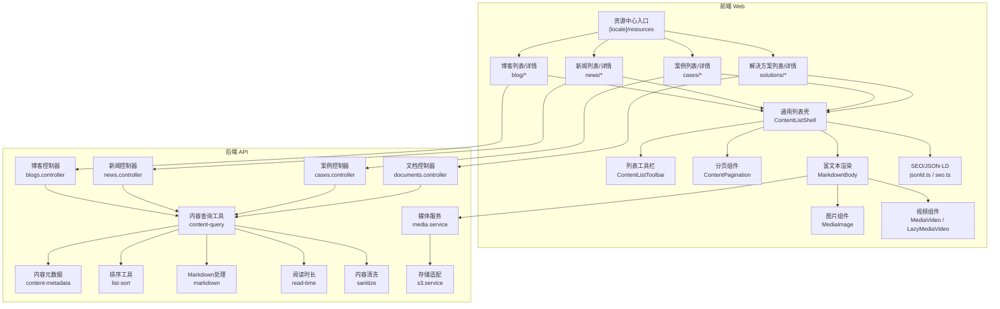
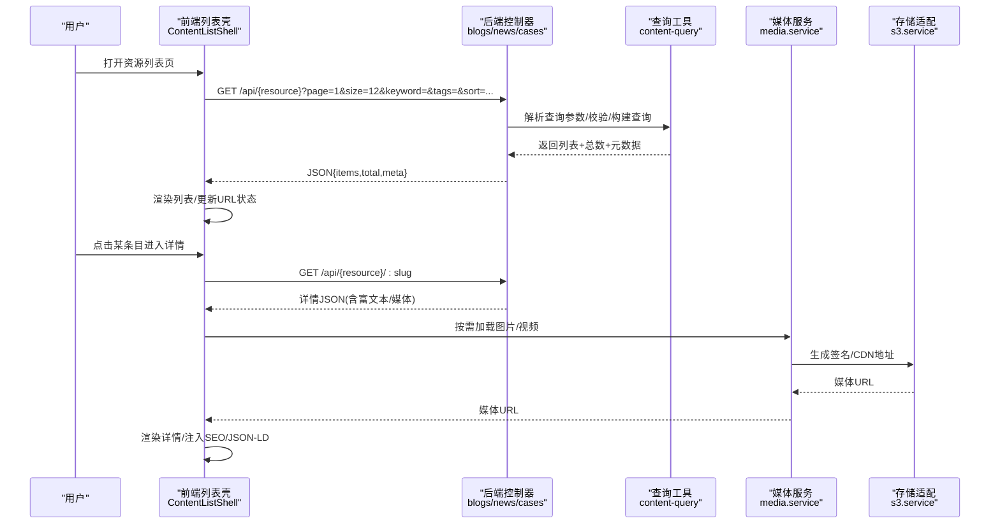
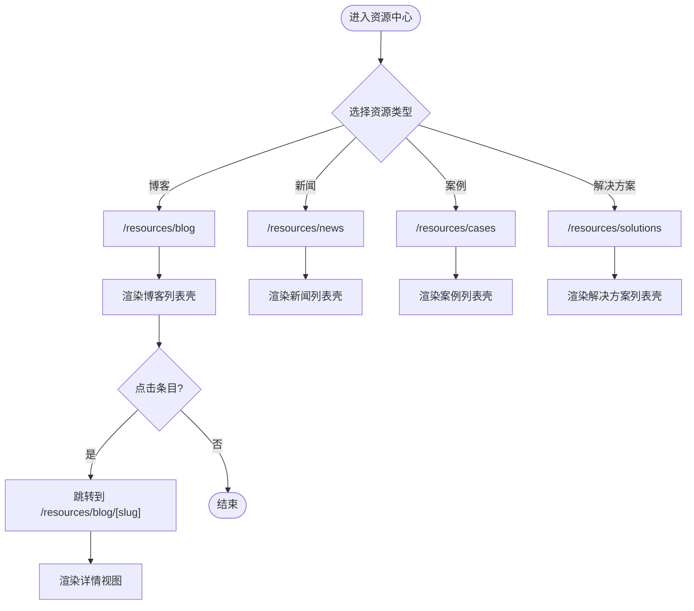
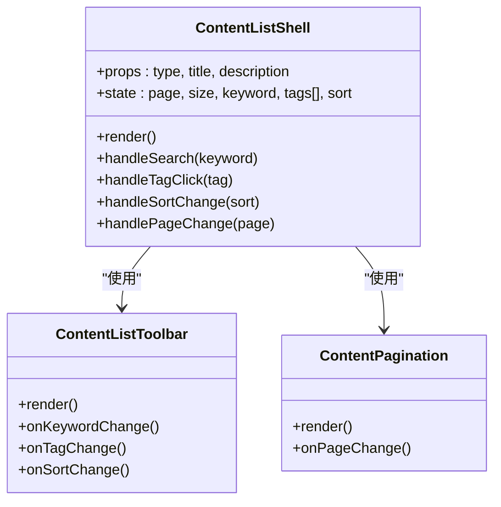
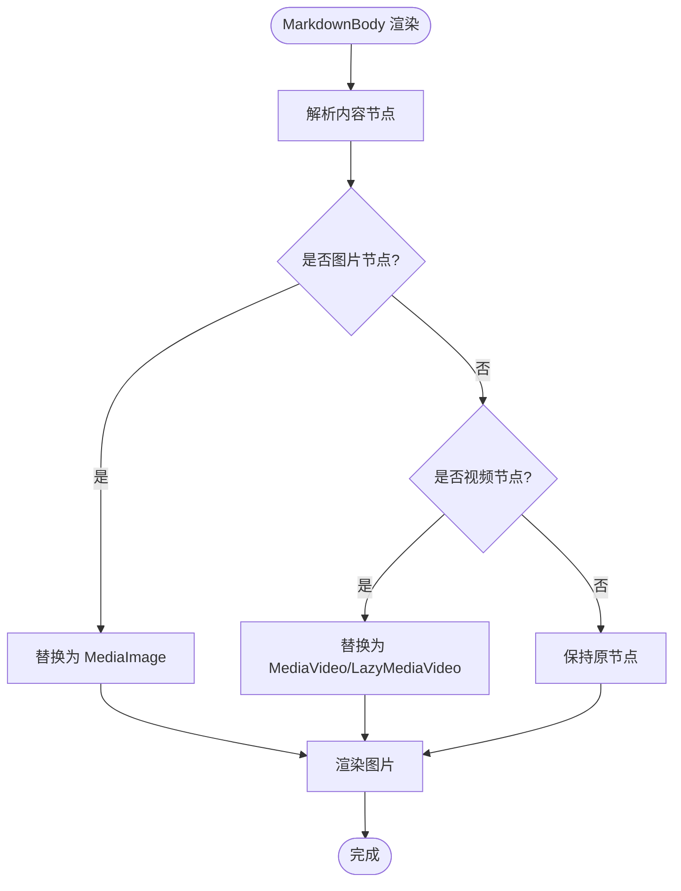
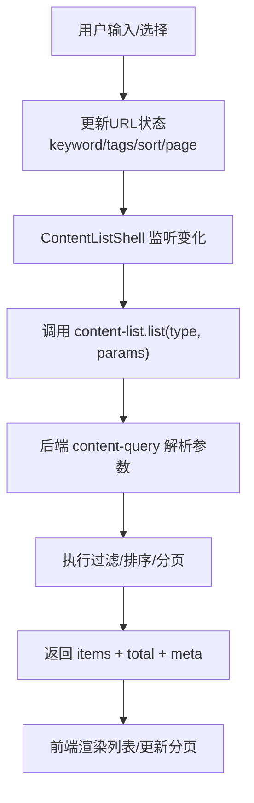
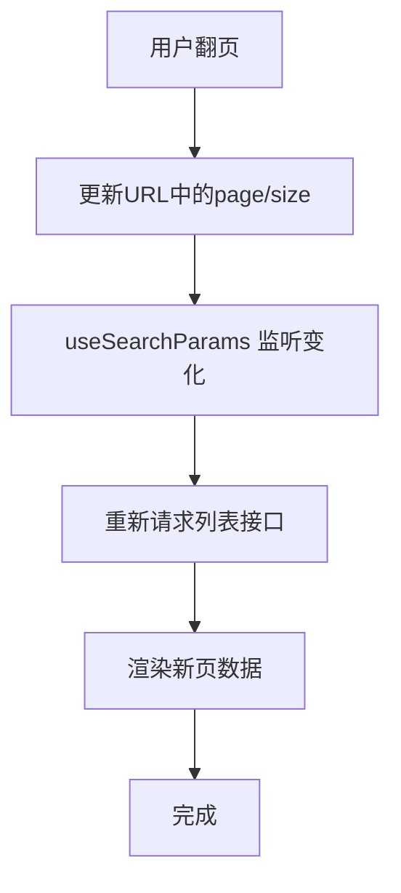
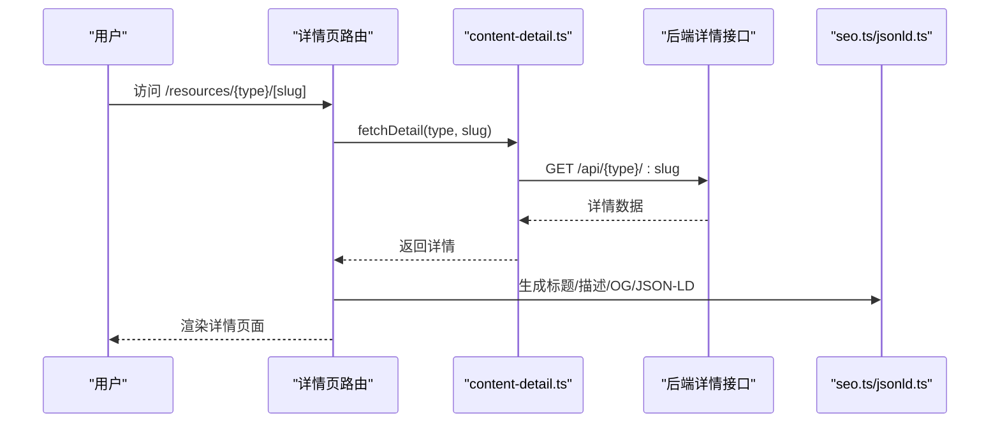
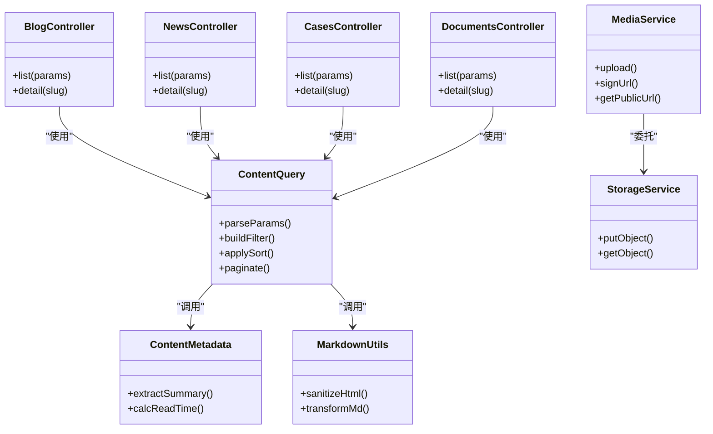
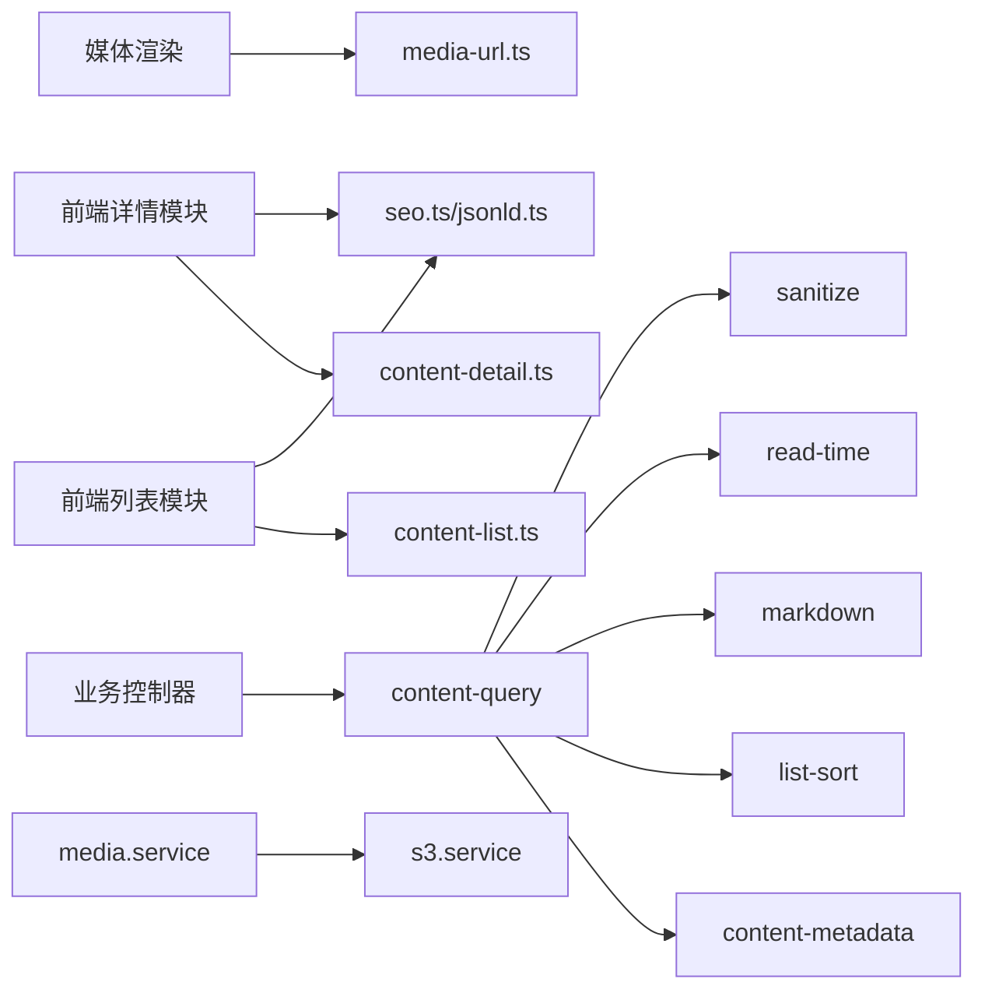

# 资源中心页面

<cite>
**本文引用的文件**   
- [apps/web/src/app/[locale]/resources/page.tsx](file://apps/web/src/app/[locale]/resources/page.tsx)
- [apps/web/src/components/content/ContentListShell.tsx](file://apps/web/src/components/content/ContentListShell.tsx)
- [apps/web/src/components/content/ContentListToolbar.tsx](file://apps/web/src/components/content/ContentListToolbar.tsx)
- [apps/web/src/components/content/ContentPagination.tsx](file://apps/web/src/components/content/ContentPagination.tsx)
- [apps/web/src/components/content/MarkdownBody.tsx](file://apps/web/src/components/content/MarkdownBody.tsx)
- [apps/web/src/lib/content-list.ts](file://apps/web/src/lib/content-list.ts)
- [apps/web/src/lib/content-detail.ts](file://apps/web/src/lib/content-detail.ts)
- [apps/web/src/lib/blog.ts](file://apps/web/src/lib/blog.ts)
- [apps/web/src/lib/news.ts](file://apps/web/src/lib/news.ts)
- [apps/web/src/lib/cases.ts](file://apps/web/src/lib/cases.ts)
- [apps/web/src/lib/solutions.ts](file://apps/web/src/lib/solutions.ts)
- [apps/web/src/lib/jsonld.ts](file://apps/web/src/lib/jsonld.ts)
- [apps/web/src/lib/seo.ts](file://apps/web/src/lib/seo.ts)
- [apps/web/src/lib/media-url.ts](file://apps/web/src/lib/media-url.ts)
- [apps/web/src/components/MediaImage.tsx](file://apps/web/src/components/MediaImage.tsx)
- [apps/web/src/components/MediaVideo.tsx](file://apps/web/src/components/MediaVideo.tsx)
- [apps/web/src/components/LazyMediaVideo.tsx](file://apps/web/src/components/LazyMediaVideo.tsx)
- [apps/web/src/components/content/markdown-components.tsx](file://apps/web/src/components/content/markdown-components.tsx)
- [apps/web/src/app/[locale]/resources/blog/page.tsx](file://apps/web/src/app/[locale]/resources/blog/page.tsx)
- [apps/web/src/app/[locale]/resources/news/page.tsx](file://apps/web/src/app/[locale]/resources/news/page.tsx)
- [apps/web/src/app/[locale]/resources/cases/page.tsx](file://apps/web/src/app/[locale]/resources/cases/page.tsx)
- [apps/web/src/app/[locale]/resources/solutions/page.tsx](file://apps/web/src/app/[locale]/resources/solutions/page.tsx)
- [apps/web/src/app/[locale]/resources/blog/[slug]/page.tsx](file://apps/web/src/app/[locale]/resources/blog/[slug]/page.tsx)
- [apps/web/src/app/[locale]/resources/news/[slug]/page.tsx](file://apps/web/src/app/[locale]/resources/news/[slug]/page.tsx)
- [apps/web/src/app/[locale]/resources/cases/[slug]/page.tsx](file://apps/web/src/app/[locale]/resources/cases/[slug]/page.tsx)
- [apps/web/src/app/[locale]/resources/solutions/[slug]/page.tsx](file://apps/web/src/app/[locale]/resources/solutions/[slug]/page.tsx)
- [apps/api/src/blogs/blogs.controller.ts](file://apps/api/src/blogs/blogs.controller.ts)
- [apps/api/src/news/news.controller.ts](file://apps/api/src/news/news.controller.ts)
- [apps/api/src/cases/cases.controller.ts](file://apps/api/src/cases/cases.controller.ts)
- [apps/api/src/documents/documents.controller.ts](file://apps/api/src/documents/documents.controller.ts)
- [apps/api/src/common/utils/content-query.ts](file://apps/api/src/common/utils/content-query.ts)
- [apps/api/src/common/utils/content-metadata.ts](file://apps/api/src/common/utils/content-metadata.ts)
- [apps/api/src/common/utils/list-sort.ts](file://apps/api/src/common/utils/list-sort.ts)
- [apps/api/src/common/utils/markdown.ts](file://apps/api/src/common/utils/markdown.ts)
- [apps/api/src/common/utils/read-time.ts](file://apps/api/src/common/utils/read-time.ts)
- [apps/api/src/common/utils/sanitize.ts](file://apps/api/src/common/utils/sanitize.ts)
- [apps/api/src/media/media.service.ts](file://apps/api/src/media/media.service.ts)
- [apps/api/src/storage/s3.service.ts](file://apps/api/src/storage/s3.service.ts)
</cite>

## 目录
1. [简介](#简介)
2. [项目结构](#项目结构)
3. [核心组件](#核心组件)
4. [架构总览](#架构总览)
5. [详细组件分析](#详细组件分析)
6. [依赖关系分析](#依赖关系分析)
7. [性能考量](#性能考量)
8. [故障排查指南](#故障排查指南)
9. [结论](#结论)
10. [附录](#附录)

## 简介
本文件面向“资源中心”页面的实现与使用，覆盖博客、新闻、案例、解决方案等资源的列表页与详情页。文档重点说明：
- Next.js App Router 下的路由组织与数据流
- 内容分页、搜索过滤与标签分类的实现方式
- 富文本渲染、媒体嵌入与社交分享能力
- 与后端 API 的集成模式（NestJS）
- SEO 优化与结构化数据最佳实践

## 项目结构
资源中心位于前端 apps/web 的 [locale] 路由下，按资源类型划分子路由，并复用通用列表与详情组件；后端 NestJS 提供统一的查询与元数据处理工具。

图表来源
- [apps/web/src/app/[locale]/resources/page.tsx](file://apps/web/src/app/[locale]/resources/page.tsx)
- [apps/web/src/components/content/ContentListShell.tsx](file://apps/web/src/components/content/ContentListShell.tsx)
- [apps/web/src/components/content/ContentListToolbar.tsx](file://apps/web/src/components/content/ContentListToolbar.tsx)
- [apps/web/src/components/content/ContentPagination.tsx](file://apps/web/src/components/content/ContentPagination.tsx)
- [apps/web/src/components/content/MarkdownBody.tsx](file://apps/web/src/components/content/MarkdownBody.tsx)
- [apps/web/src/lib/content-list.ts](file://apps/web/src/lib/content-list.ts)
- [apps/web/src/lib/content-detail.ts](file://apps/web/src/lib/content-detail.ts)
- [apps/web/src/lib/jsonld.ts](file://apps/web/src/lib/jsonld.ts)
- [apps/web/src/lib/seo.ts](file://apps/web/src/lib/seo.ts)
- [apps/web/src/components/MediaImage.tsx](file://apps/web/src/components/MediaImage.tsx)
- [apps/web/src/components/MediaVideo.tsx](file://apps/web/src/components/MediaVideo.tsx)
- [apps/web/src/components/LazyMediaVideo.tsx](file://apps/web/src/components/LazyMediaVideo.tsx)
- [apps/api/src/blogs/blogs.controller.ts](file://apps/api/src/blogs/blogs.controller.ts)
- [apps/api/src/news/news.controller.ts](file://apps/api/src/news/news.controller.ts)
- [apps/api/src/cases/cases.controller.ts](file://apps/api/src/cases/cases.controller.ts)
- [apps/api/src/documents/documents.controller.ts](file://apps/api/src/documents/documents.controller.ts)
- [apps/api/src/common/utils/content-query.ts](file://apps/api/src/common/utils/content-query.ts)
- [apps/api/src/common/utils/content-metadata.ts](file://apps/api/src/common/utils/content-metadata.ts)
- [apps/api/src/common/utils/list-sort.ts](file://apps/api/src/common/utils/list-sort.ts)
- [apps/api/src/common/utils/markdown.ts](file://apps/api/src/common/utils/markdown.ts)
- [apps/api/src/common/utils/read-time.ts](file://apps/api/src/common/utils/read-time.ts)
- [apps/api/src/common/utils/sanitize.ts](file://apps/api/src/common/utils/sanitize.ts)
- [apps/api/src/media/media.service.ts](file://apps/api/src/media/media.service.ts)
- [apps/api/src/storage/s3.service.ts](file://apps/api/src/storage/s3.service.ts)

章节来源
- [apps/web/src/app/[locale]/resources/page.tsx](file://apps/web/src/app/[locale]/resources/page.tsx)
- [apps/web/src/components/content/ContentListShell.tsx](file://apps/web/src/components/content/ContentListShell.tsx)
- [apps/web/src/lib/content-list.ts](file://apps/web/src/lib/content-list.ts)

## 核心组件
- 资源中心入口：统一导航到各资源类型的列表页，承载全局标题、描述与 SEO。
- 列表壳 ContentListShell：封装分页、筛选、排序、标签切换与结果展示的统一容器。
- 工具栏 ContentListToolbar：提供关键词搜索、类别/标签筛选、排序选择器。
- 分页 ContentPagination：基于 URL 状态的分页控制，支持跳转与页码高亮。
- 富文本 MarkdownBody：将 Markdown/HTML 安全渲染为可访问的内容，内嵌图片与视频。
- 媒体组件 MediaImage/MediaVideo/LazyMediaVideo：响应式图片、懒加载视频与播放器封装。
- 内容库 content-list.ts/content-detail.ts：前后端一致的请求参数、分页与详情获取逻辑。
- SEO/JSON-LD：生成页面标题、描述、OpenGraph 与结构化数据。

章节来源
- [apps/web/src/components/content/ContentListShell.tsx](file://apps/web/src/components/content/ContentListShell.tsx)
- [apps/web/src/components/content/ContentListToolbar.tsx](file://apps/web/src/components/content/ContentListToolbar.tsx)
- [apps/web/src/components/content/ContentPagination.tsx](file://apps/web/src/components/content/ContentPagination.tsx)
- [apps/web/src/components/content/MarkdownBody.tsx](file://apps/web/src/components/content/MarkdownBody.tsx)
- [apps/web/src/components/MediaImage.tsx](file://apps/web/src/components/MediaImage.tsx)
- [apps/web/src/components/MediaVideo.tsx](file://apps/web/src/components/MediaVideo.tsx)
- [apps/web/src/components/LazyMediaVideo.tsx](file://apps/web/src/components/LazyMediaVideo.tsx)
- [apps/web/src/lib/content-list.ts](file://apps/web/src/lib/content-list.ts)
- [apps/web/src/lib/content-detail.ts](file://apps/web/src/lib/content-detail.ts)
- [apps/web/src/lib/jsonld.ts](file://apps/web/src/lib/jsonld.ts)
- [apps/web/src/lib/seo.ts](file://apps/web/src/lib/seo.ts)

## 架构总览
资源中心采用“前端列表壳 + 类型化路由 + 后端统一查询工具”的架构。前端通过 content-list.ts 发起请求，后端由各业务控制器调用 content-query 工具进行分页、过滤、排序与元数据处理，最终返回标准化数据结构供前端渲染。

图表来源
- [apps/web/src/components/content/ContentListShell.tsx](file://apps/web/src/components/content/ContentListShell.tsx)
- [apps/web/src/lib/content-list.ts](file://apps/web/src/lib/content-list.ts)
- [apps/api/src/blogs/blogs.controller.ts](file://apps/api/src/blogs/blogs.controller.ts)
- [apps/api/src/news/news.controller.ts](file://apps/api/src/news/news.controller.ts)
- [apps/api/src/cases/cases.controller.ts](file://apps/api/src/cases/cases.controller.ts)
- [apps/api/src/common/utils/content-query.ts](file://apps/api/src/common/utils/content-query.ts)
- [apps/api/src/media/media.service.ts](file://apps/api/src/media/media.service.ts)
- [apps/api/src/storage/s3.service.ts](file://apps/api/src/storage/s3.service.ts)

## 详细组件分析

### 列表页与详情页路由
- 列表路由：/resources/blog、/resources/news、/resources/cases、/resources/solutions
- 详情路由：/resources/{type}/[slug]
- 每个类型路由页负责设置页面元信息、调用对应类型的数据获取函数，并渲染通用列表壳或详情视图。

图表来源
- [apps/web/src/app/[locale]/resources/blog/page.tsx](file://apps/web/src/app/[locale]/resources/blog/page.tsx)
- [apps/web/src/app/[locale]/resources/news/page.tsx](file://apps/web/src/app/[locale]/resources/news/page.tsx)
- [apps/web/src/app/[locale]/resources/cases/page.tsx](file://apps/web/src/app/[locale]/resources/cases/page.tsx)
- [apps/web/src/app/[locale]/resources/solutions/page.tsx](file://apps/web/src/app/[locale]/resources/solutions/page.tsx)
- [apps/web/src/app/[locale]/resources/blog/[slug]/page.tsx](file://apps/web/src/app/[locale]/resources/blog/[slug]/page.tsx)
- [apps/web/src/app/[locale]/resources/news/[slug]/page.tsx](file://apps/web/src/app/[locale]/resources/news/[slug]/page.tsx)
- [apps/web/src/app/[locale]/resources/cases/[slug]/page.tsx](file://apps/web/src/app/[locale]/resources/cases/[slug]/page.tsx)
- [apps/web/src/app/[locale]/resources/solutions/[slug]/page.tsx](file://apps/web/src/app/[locale]/resources/solutions/[slug]/page.tsx)

章节来源
- [apps/web/src/app/[locale]/resources/blog/page.tsx](file://apps/web/src/app/[locale]/resources/blog/page.tsx)
- [apps/web/src/app/[locale]/resources/news/page.tsx](file://apps/web/src/app/[locale]/resources/news/page.tsx)
- [apps/web/src/app/[locale]/resources/cases/page.tsx](file://apps/web/src/app/[locale]/resources/cases/page.tsx)
- [apps/web/src/app/[locale]/resources/solutions/page.tsx](file://apps/web/src/app/[locale]/resources/solutions/page.tsx)
- [apps/web/src/app/[locale]/resources/blog/[slug]/page.tsx](file://apps/web/src/app/[locale]/resources/blog/[slug]/page.tsx)
- [apps/web/src/app/[locale]/resources/news/[slug]/page.tsx](file://apps/web/src/app/[locale]/resources/news/[slug]/page.tsx)
- [apps/web/src/app/[locale]/resources/cases/[slug]/page.tsx](file://apps/web/src/app/[locale]/resources/cases/[slug]/page.tsx)
- [apps/web/src/app/[locale]/resources/solutions/[slug]/page.tsx](file://apps/web/src/app/[locale]/resources/solutions/[slug]/page.tsx)

### 列表壳 ContentListShell
- 职责：聚合分页、搜索、排序、标签/分类切换、结果渲染骨架与错误态。
- 关键交互：
  - 搜索：防抖输入触发重新请求，URL 同步 keyword。
  - 标签/分类：点击切换 activeTag，重置页码后刷新列表。
  - 排序：根据 sort 字段与方向组合请求。
  - 分页：页码变化时更新 URL 并拉取新数据。
- 数据流：调用 content-list.ts 的 list 方法，传入类型、分页与过滤参数。

图表来源
- [apps/web/src/components/content/ContentListShell.tsx](file://apps/web/src/components/content/ContentListShell.tsx)
- [apps/web/src/components/content/ContentListToolbar.tsx](file://apps/web/src/components/content/ContentListToolbar.tsx)
- [apps/web/src/components/content/ContentPagination.tsx](file://apps/web/src/components/content/ContentPagination.tsx)

章节来源
- [apps/web/src/components/content/ContentListShell.tsx](file://apps/web/src/components/content/ContentListShell.tsx)
- [apps/web/src/components/content/ContentListToolbar.tsx](file://apps/web/src/components/content/ContentListToolbar.tsx)
- [apps/web/src/components/content/ContentPagination.tsx](file://apps/web/src/components/content/ContentPagination.tsx)
- [apps/web/src/lib/content-list.ts](file://apps/web/src/lib/content-list.ts)

### 富文本渲染与媒体嵌入
- MarkdownBody：将 Markdown/HTML 安全渲染，内置图片与视频组件替换规则。
- MediaImage：响应式图片、占位图、懒加载与 CDN 路径处理。
- MediaVideo/LazyMediaVideo：自动懒加载、播放器初始化与错误回退。
- markdown-components：扩展 Markdown 节点（如代码块、引用、表格）的渲染样式。

图表来源
- [apps/web/src/components/content/MarkdownBody.tsx](file://apps/web/src/components/content/MarkdownBody.tsx)
- [apps/web/src/components/MediaImage.tsx](file://apps/web/src/components/MediaImage.tsx)
- [apps/web/src/components/MediaVideo.tsx](file://apps/web/src/components/MediaVideo.tsx)
- [apps/web/src/components/LazyMediaVideo.tsx](file://apps/web/src/components/LazyMediaVideo.tsx)
- [apps/web/src/components/content/markdown-components.tsx](file://apps/web/src/components/content/markdown-components.tsx)

章节来源
- [apps/web/src/components/content/MarkdownBody.tsx](file://apps/web/src/components/content/MarkdownBody.tsx)
- [apps/web/src/components/MediaImage.tsx](file://apps/web/src/components/MediaImage.tsx)
- [apps/web/src/components/MediaVideo.tsx](file://apps/web/src/components/MediaVideo.tsx)
- [apps/web/src/components/LazyMediaVideo.tsx](file://apps/web/src/components/LazyMediaVideo.tsx)
- [apps/web/src/components/content/markdown-components.tsx](file://apps/web/src/components/content/markdown-components.tsx)

### 搜索、过滤与标签分类
- 搜索：前端防抖触发，URL 中携带 keyword，后端全文检索或模糊匹配。
- 过滤：按 category/tags 过滤，支持多选与清空。
- 排序：支持按时间、热度、阅读量等维度排序。
- 后端工具：content-query 统一解析查询参数、校验与构建数据库查询；list-sort 提供排序策略；content-metadata 补充摘要、阅读时长等元数据。

图表来源
- [apps/web/src/components/content/ContentListShell.tsx](file://apps/web/src/components/content/ContentListShell.tsx)
- [apps/web/src/lib/content-list.ts](file://apps/web/src/lib/content-list.ts)
- [apps/api/src/common/utils/content-query.ts](file://apps/api/src/common/utils/content-query.ts)
- [apps/api/src/common/utils/list-sort.ts](file://apps/api/src/common/utils/list-sort.ts)
- [apps/api/src/common/utils/content-metadata.ts](file://apps/api/src/common/utils/content-metadata.ts)

章节来源
- [apps/web/src/lib/content-list.ts](file://apps/web/src/lib/content-list.ts)
- [apps/api/src/common/utils/content-query.ts](file://apps/api/src/common/utils/content-query.ts)
- [apps/api/src/common/utils/list-sort.ts](file://apps/api/src/common/utils/list-sort.ts)
- [apps/api/src/common/utils/content-metadata.ts](file://apps/api/src/common/utils/content-metadata.ts)

### 分页实现
- 前端：ContentPagination 组件基于 URL 状态驱动，支持页码跳转、每页大小切换。
- 后端：content-query 统一处理 page/size 边界条件与越界保护。
- 建议：对大数据集启用服务端分页，避免一次性加载过多数据。

图表来源
- [apps/web/src/components/content/ContentPagination.tsx](file://apps/web/src/components/content/ContentPagination.tsx)
- [apps/web/src/lib/content-list.ts](file://apps/web/src/lib/content-list.ts)
- [apps/api/src/common/utils/content-query.ts](file://apps/api/src/common/utils/content-query.ts)

章节来源
- [apps/web/src/components/content/ContentPagination.tsx](file://apps/web/src/components/content/ContentPagination.tsx)
- [apps/web/src/lib/content-list.ts](file://apps/web/src/lib/content-list.ts)
- [apps/api/src/common/utils/content-query.ts](file://apps/api/src/common/utils/content-query.ts)

### 详情内容与社交分享
- 详情路由：/resources/{type}/[slug] 读取 slug 并调用 content-detail.ts 获取详情。
- 富文本：MarkdownBody 渲染正文，内嵌图片与视频。
- 社交分享：在详情页头部或侧边插入分享按钮，链接包含当前 URL 与标题。
- SEO：动态生成 title、description、canonical、OG 与 JSON-LD。

图表来源
- [apps/web/src/lib/content-detail.ts](file://apps/web/src/lib/content-detail.ts)
- [apps/web/src/lib/jsonld.ts](file://apps/web/src/lib/jsonld.ts)
- [apps/web/src/lib/seo.ts](file://apps/web/src/lib/seo.ts)
- [apps/web/src/app/[locale]/resources/blog/[slug]/page.tsx](file://apps/web/src/app/[locale]/resources/blog/[slug]/page.tsx)
- [apps/web/src/app/[locale]/resources/news/[slug]/page.tsx](file://apps/web/src/app/[locale]/resources/news/[slug]/page.tsx)
- [apps/web/src/app/[locale]/resources/cases/[slug]/page.tsx](file://apps/web/src/app/[locale]/resources/cases/[slug]/page.tsx)
- [apps/web/src/app/[locale]/resources/solutions/[slug]/page.tsx](file://apps/web/src/app/[locale]/resources/solutions/[slug]/page.tsx)

章节来源
- [apps/web/src/lib/content-detail.ts](file://apps/web/src/lib/content-detail.ts)
- [apps/web/src/lib/jsonld.ts](file://apps/web/src/lib/jsonld.ts)
- [apps/web/src/lib/seo.ts](file://apps/web/src/lib/seo.ts)
- [apps/web/src/app/[locale]/resources/blog/[slug]/page.tsx](file://apps/web/src/app/[locale]/resources/blog/[slug]/page.tsx)
- [apps/web/src/app/[locale]/resources/news/[slug]/page.tsx](file://apps/web/src/app/[locale]/resources/news/[slug]/page.tsx)
- [apps/web/src/app/[locale]/resources/cases/[slug]/page.tsx](file://apps/web/src/app/[locale]/resources/cases/[slug]/page.tsx)
- [apps/web/src/app/[locale]/resources/solutions/[slug]/page.tsx](file://apps/web/src/app/[locale]/resources/solutions/[slug]/page.tsx)

### 内容管理系统集成
- 前端类型定义：blog.ts、news.ts、cases.ts、solutions.ts 定义各资源的数据结构与请求函数。
- 后端控制器：blogs.controller.ts、news.controller.ts、cases.controller.ts、documents.controller.ts 暴露 REST 接口。
- 通用工具：content-query、content-metadata、markdown、read-time、sanitize 保证数据一致性与安全性。
- 媒体服务：media.service.ts 与 s3.service.ts 负责上传、签名、CDN 与水印等能力。

图表来源
- [apps/api/src/blogs/blogs.controller.ts](file://apps/api/src/blogs/blogs.controller.ts)
- [apps/api/src/news/news.controller.ts](file://apps/api/src/news/news.controller.ts)
- [apps/api/src/cases/cases.controller.ts](file://apps/api/src/cases/cases.controller.ts)
- [apps/api/src/documents/documents.controller.ts](file://apps/api/src/documents/documents.controller.ts)
- [apps/api/src/common/utils/content-query.ts](file://apps/api/src/common/utils/content-query.ts)
- [apps/api/src/common/utils/content-metadata.ts](file://apps/api/src/common/utils/content-metadata.ts)
- [apps/api/src/common/utils/markdown.ts](file://apps/api/src/common/utils/markdown.ts)
- [apps/api/src/common/utils/read-time.ts](file://apps/api/src/common/utils/read-time.ts)
- [apps/api/src/media/media.service.ts](file://apps/api/src/media/media.service.ts)
- [apps/api/src/storage/s3.service.ts](file://apps/api/src/storage/s3.service.ts)

章节来源
- [apps/web/src/lib/blog.ts](file://apps/web/src/lib/blog.ts)
- [apps/web/src/lib/news.ts](file://apps/web/src/lib/news.ts)
- [apps/web/src/lib/cases.ts](file://apps/web/src/lib/cases.ts)
- [apps/web/src/lib/solutions.ts](file://apps/web/src/lib/solutions.ts)
- [apps/api/src/blogs/blogs.controller.ts](file://apps/api/src/blogs/blogs.controller.ts)
- [apps/api/src/news/news.controller.ts](file://apps/api/src/news/news.controller.ts)
- [apps/api/src/cases/cases.controller.ts](file://apps/api/src/cases/cases.controller.ts)
- [apps/api/src/documents/documents.controller.ts](file://apps/api/src/documents/documents.controller.ts)
- [apps/api/src/common/utils/content-query.ts](file://apps/api/src/common/utils/content-query.ts)
- [apps/api/src/common/utils/content-metadata.ts](file://apps/api/src/common/utils/content-metadata.ts)
- [apps/api/src/common/utils/markdown.ts](file://apps/api/src/common/utils/markdown.ts)
- [apps/api/src/common/utils/read-time.ts](file://apps/api/src/common/utils/read-time.ts)
- [apps/api/src/media/media.service.ts](file://apps/api/src/media/media.service.ts)
- [apps/api/src/storage/s3.service.ts](file://apps/api/src/storage/s3.service.ts)

## 依赖关系分析
- 前端依赖：
  - 列表页依赖 ContentListShell、ContentListToolbar、ContentPagination、content-list.ts。
  - 详情页依赖 content-detail.ts、MarkdownBody、seo.ts、jsonld.ts。
  - 媒体渲染依赖 MediaImage、MediaVideo、LazyMediaVideo、media-url.ts。
- 后端依赖：
  - 各业务控制器依赖 content-query、content-metadata、list-sort、markdown、read-time、sanitize。
  - 媒体相关依赖 media.service.ts 与 s3.service.ts。

图表来源
- [apps/web/src/lib/content-list.ts](file://apps/web/src/lib/content-list.ts)
- [apps/web/src/lib/content-detail.ts](file://apps/web/src/lib/content-detail.ts)
- [apps/web/src/lib/media-url.ts](file://apps/web/src/lib/media-url.ts)
- [apps/web/src/lib/seo.ts](file://apps/web/src/lib/seo.ts)
- [apps/web/src/lib/jsonld.ts](file://apps/web/src/lib/jsonld.ts)
- [apps/api/src/common/utils/content-query.ts](file://apps/api/src/common/utils/content-query.ts)
- [apps/api/src/common/utils/content-metadata.ts](file://apps/api/src/common/utils/content-metadata.ts)
- [apps/api/src/common/utils/list-sort.ts](file://apps/api/src/common/utils/list-sort.ts)
- [apps/api/src/common/utils/markdown.ts](file://apps/api/src/common/utils/markdown.ts)
- [apps/api/src/common/utils/read-time.ts](file://apps/api/src/common/utils/read-time.ts)
- [apps/api/src/common/utils/sanitize.ts](file://apps/api/src/common/utils/sanitize.ts)
- [apps/api/src/media/media.service.ts](file://apps/api/src/media/media.service.ts)
- [apps/api/src/storage/s3.service.ts](file://apps/api/src/storage/s3.service.ts)

章节来源
- [apps/web/src/lib/content-list.ts](file://apps/web/src/lib/content-list.ts)
- [apps/web/src/lib/content-detail.ts](file://apps/web/src/lib/content-detail.ts)
- [apps/web/src/lib/media-url.ts](file://apps/web/src/lib/media-url.ts)
- [apps/web/src/lib/seo.ts](file://apps/web/src/lib/seo.ts)
- [apps/web/src/lib/jsonld.ts](file://apps/web/src/lib/jsonld.ts)
- [apps/api/src/common/utils/content-query.ts](file://apps/api/src/common/utils/content-query.ts)
- [apps/api/src/common/utils/content-metadata.ts](file://apps/api/src/common/utils/content-metadata.ts)
- [apps/api/src/common/utils/list-sort.ts](file://apps/api/src/common/utils/list-sort.ts)
- [apps/api/src/common/utils/markdown.ts](file://apps/api/src/common/utils/markdown.ts)
- [apps/api/src/common/utils/read-time.ts](file://apps/api/src/common/utils/read-time.ts)
- [apps/api/src/common/utils/sanitize.ts](file://apps/api/src/common/utils/sanitize.ts)
- [apps/api/src/media/media.service.ts](file://apps/api/src/media/media.service.ts)
- [apps/api/src/storage/s3.service.ts](file://apps/api/src/storage/s3.service.ts)

## 性能考量
- 列表分页：优先服务端分页，合理设置每页大小，避免大数组传输。
- 搜索防抖：前端输入防抖，减少频繁请求。
- 媒体懒加载：图片与视频默认懒加载，首屏只加载必要资源。
- 缓存策略：对热点列表与详情启用浏览器缓存与 CDN 缓存。
- 渲染优化：Markdown 渲染前进行 HTML 清洗，避免重绘与回流。
- 网络优化：媒体 URL 走 CDN，开启压缩与 HTTP/2。

## 故障排查指南
- 列表为空：检查 URL 参数是否正确、后端 content-query 过滤条件是否过严。
- 分页异常：确认 page/size 边界值与后端分页逻辑一致性。
- 富文本显示异常：检查 MarkdownBody 的节点替换规则与 sanitize 配置。
- 媒体无法加载：核对 media-url.ts 的域名与 CDN 配置，检查媒体服务签名有效期。
- SEO 不生效：确认详情页正确注入 title/description/OG/JSON-LD，canonical 指向唯一 URL。

章节来源
- [apps/web/src/components/content/ContentListShell.tsx](file://apps/web/src/components/content/ContentListShell.tsx)
- [apps/web/src/components/content/MarkdownBody.tsx](file://apps/web/src/components/content/MarkdownBody.tsx)
- [apps/web/src/lib/media-url.ts](file://apps/web/src/lib/media-url.ts)
- [apps/web/src/lib/seo.ts](file://apps/web/src/lib/seo.ts)
- [apps/web/src/lib/jsonld.ts](file://apps/web/src/lib/jsonld.ts)
- [apps/api/src/common/utils/content-query.ts](file://apps/api/src/common/utils/content-query.ts)
- [apps/api/src/common/utils/sanitize.ts](file://apps/api/src/common/utils/sanitize.ts)
- [apps/api/src/media/media.service.ts](file://apps/api/src/media/media.service.ts)

## 结论
资源中心通过统一的列表壳与类型化路由实现了可扩展的资源管理；借助后端通用查询工具保证了数据一致性与高性能；结合富文本渲染、媒体嵌入与 SEO/JSON-LD 提供了良好的用户体验与搜索引擎友好性。建议在新增资源类型时遵循现有模式，复用通用组件与工具，确保一致性与可维护性。

## 附录
- 最佳实践清单
  - 列表页始终使用服务端分页与防抖搜索。
  - 详情页必须注入完整的 SEO 与结构化数据。
  - 媒体资源一律走 CDN，避免直链泄露。
  - 富文本内容需经 sanitize 清洗后再渲染。
  - 所有对外接口需做参数校验与错误处理。
- 常见问题定位
  - 列表无数据：检查过滤条件与分页参数。
  - 详情空白：检查 slug 是否存在与富文本渲染是否正常。
  - 分享无效：确认 canonical 与 OG 链接正确。