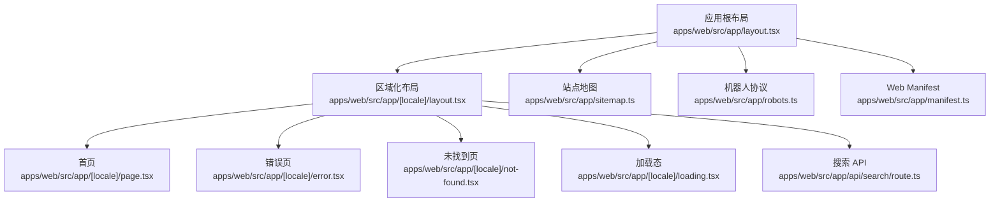
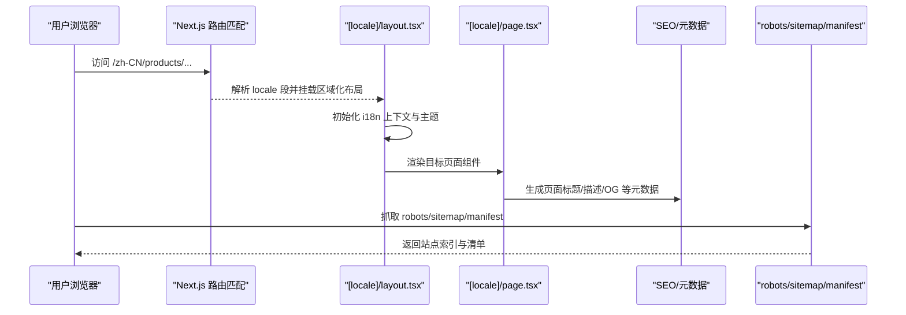
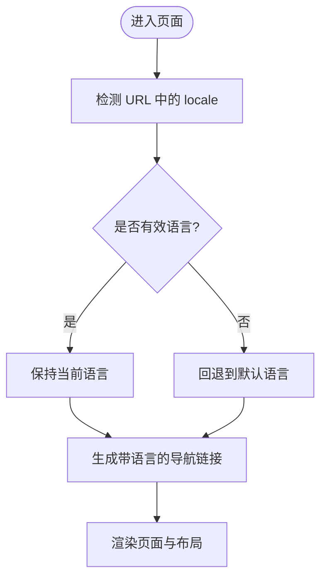
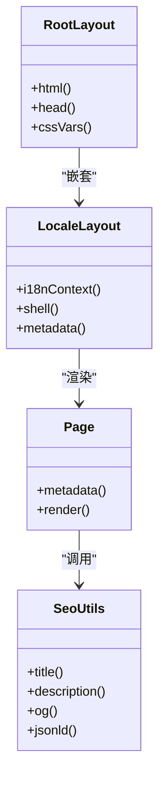
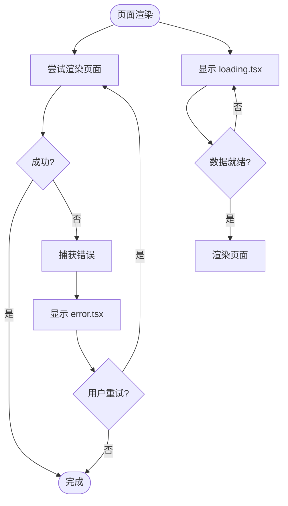
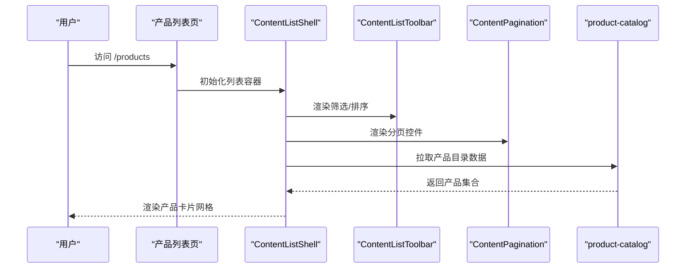
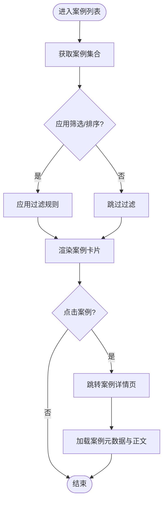
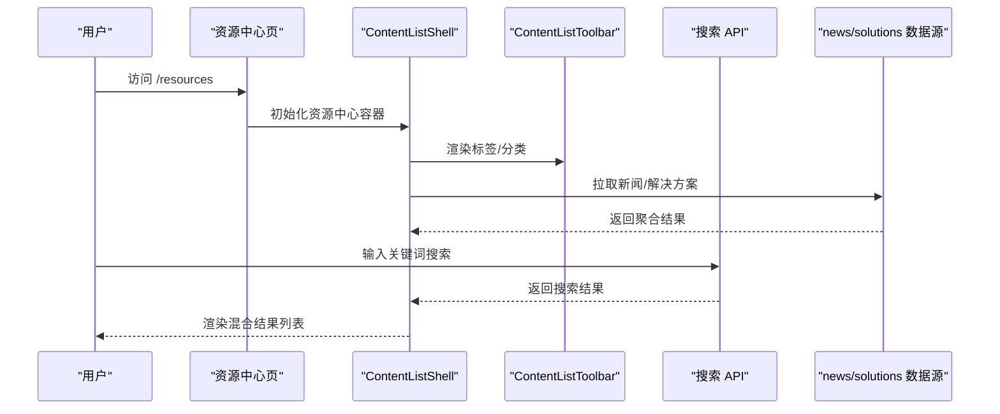
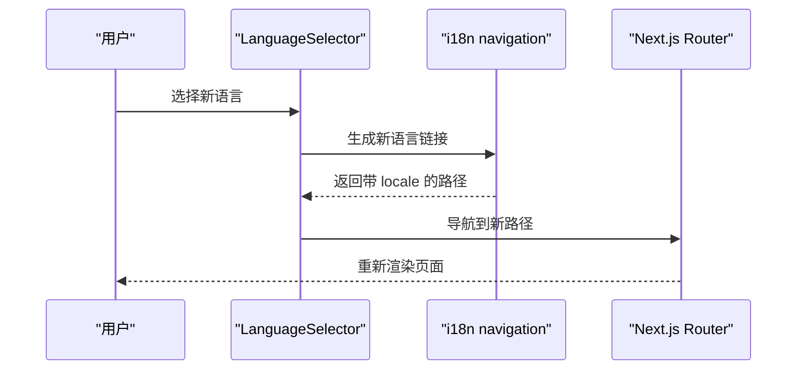
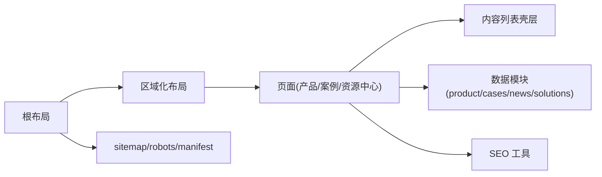

# 路由与页面结构

<cite>
**本文引用的文件**   
- [apps/web/src/app/layout.tsx](file://apps/web/src/app/layout.tsx)
- [apps/web/src/app/[locale]/layout.tsx](file://apps/web/src/app/[locale]/layout.tsx)
- [apps/web/src/app/[locale]/page.tsx](file://apps/web/src/app/[locale]/page.tsx)
- [apps/web/src/app/[locale]/error.tsx](file://apps/web/src/app/[locale]/error.tsx)
- [apps/web/src/app/[locale]/not-found.tsx](file://apps/web/src/app/[locale]/not-found.tsx)
- [apps/web/src/app/[locale]/loading.tsx](file://apps/web/src/app/[locale]/loading.tsx)
- [apps/web/src/app/robots.ts](file://apps/web/src/app/robots.ts)
- [apps/web/src/app/sitemap.ts](file://apps/web/src/app/sitemap.ts)
- [apps/web/src/app/manifest.ts](file://apps/web/src/app/manifest.ts)
- [apps/web/src/i18n/navigation.ts](file://apps/web/src/i18n/navigation.ts)
- [apps/web/src/i18n/routing.ts](file://apps/web/src/i18n/routing.ts)
- [apps/web/src/lib/routes.ts](file://apps/web/src/lib/routes.ts)
- [apps/web/src/lib/navigation.ts](file://apps/web/src/lib/navigation.ts)
- [apps/web/src/lib/locale-config.ts](file://apps/web/src/lib/locale-config.ts)
- [apps/web/src/lib/seo.ts](file://apps/web/src/lib/seo.ts)
- [apps/web/src/app/api/search/route.ts](file://apps/web/src/app/api/search/route.ts)
- [apps/web/src/components/i18n/LanguageSelector.tsx](file://apps/web/src/components/i18n/LanguageSelector.tsx)
- [apps/web/src/components/i18n/FooterLanguageTrigger.tsx](file://apps/web/src/components/i18n/FooterLanguage触发器.tsx)
- [apps/web/src/components/content/ContentListShell.tsx](file://apps/web/src/components/content/ContentListShell.tsx)
- [apps/web/src/components/content/ContentListToolbar.tsx](file://apps/web/src/components/content/ContentListToolbar.tsx)
- [apps/web/src/components/content/ContentPagination.tsx](file://apps/web/src/components/content/ContentPagination.tsx)
- [apps/web/src/components/products/ProductCard.tsx](file://apps/web/src/components/products/ProductCard.tsx)
- [apps/web/src/lib/product-catalog.ts](file://apps/web/src/lib/product-catalog.ts)
- [apps/web/src/lib/cases.ts](file://apps/web/src/lib/cases.ts)
- [apps/web/src/lib/news.ts](file://apps/web/src/lib/news.ts)
- [apps/web/src/lib/solutions.ts](file://apps/web/src/lib/solutions.ts)
</cite>

## 目录
1. [简介](#简介)
2. [项目结构](#项目结构)
3. [核心组件](#核心组件)
4. [架构总览](#架构总览)
5. [详细组件分析](#详细组件分析)
6. [依赖关系分析](#依赖关系分析)
7. [性能考量](#性能考量)
8. [故障排查指南](#故障排查指南)
9. [结论](#结论)
10. [附录](#附录)

## 简介
本文件面向使用 Next.js App Router 的多语言网站，聚焦于“路由与页面结构”的设计与实现。内容涵盖：
- 基于 [locale] 的动态路由组织方式
- 国际化（i18n）路由配置与导航切换
- 页面布局系统、元数据管理、错误处理与加载状态
- 产品页面、案例页面、资源中心页面的具体实现与最佳实践
- SEO 配置与页面性能优化建议

## 项目结构
本项目采用 Next.js App Router 的目录即路由约定，多语言通过 [locale] 动态段实现。公共布局与全局元数据位于根 layout，区域化布局与 i18n 上下文在 [locale]/layout 中提供。业务页面按功能域划分到对应目录，API 路由统一放在 app/api 下。

图表来源
- [apps/web/src/app/layout.tsx](file://apps/web/src/app/layout.tsx)
- [apps/web/src/app/[locale]/layout.tsx](file://apps/web/src/app/[locale]/layout.tsx)
- [apps/web/src/app/[locale]/page.tsx](file://apps/web/src/app/[locale]/page.tsx)
- [apps/web/src/app/[locale]/error.tsx](file://apps/web/src/app/[locale]/error.tsx)
- [apps/web/src/app/[locale]/not-found.tsx](file://apps/web/src/app/[locale]/not-found.tsx)
- [apps/web/src/app/[locale]/loading.tsx](file://apps/web/src/app/[locale]/loading.tsx)
- [apps/web/src/app/sitemap.ts](file://apps/web/src/app/sitemap.ts)
- [apps/web/src/app/robots.ts](file://apps/web/src/app/robots.ts)
- [apps/web/src/app/manifest.ts](file://apps/web/src/app/manifest.ts)
- [apps/web/src/app/api/search/route.ts](file://apps/web/src/app/api/search/route.ts)

章节来源
- [apps/web/src/app/layout.tsx](file://apps/web/src/app/layout.tsx)
- [apps/web/src/app/[locale]/layout.tsx](file://apps/web/src/app/[locale]/layout.tsx)
- [apps/web/src/app/[locale]/page.tsx](file://apps/web/src/app/[locale]/page.tsx)
- [apps/web/src/app/sitemap.ts](file://apps/web/src/app/sitemap.ts)
- [apps/web/src/app/robots.ts](file://apps/web/src/app/robots.ts)
- [apps/web/src/app/manifest.ts](file://apps/web/src/app/manifest.ts)

## 核心组件
- 区域化布局与 i18n 上下文：[apps/web/src/app/[locale]/layout.tsx] 负责注入语言环境、设置文档方向与基础样式，并承载各语言下的通用 UI Shell。
- 导航与路由工具：[apps/web/src/i18n/navigation.ts] 与 [apps/web/src/i18n/routing.ts] 提供受 i18n 支持的生成链接与路由解析；[apps/web/src/lib/routes.ts] 集中定义站点路由常量。
- 元数据与 SEO：[apps/web/src/lib/seo.ts] 封装标题、描述、OpenGraph、结构化数据等元信息生成逻辑；sitemap/robots/manifest 由各自文件导出。
- 语言切换组件：[apps/web/src/components/i18n/LanguageSelector.tsx] 与 [apps/web/src/components/i18n/FooterLanguageTrigger.tsx] 提供用户侧的语言切换入口。
- 内容列表壳层：[apps/web/src/components/content/ContentListShell.tsx]、[apps/web/src/components/content/ContentListToolbar.tsx]、[apps/web/src/components/content/ContentPagination.tsx] 用于产品、案例、资源中心等列表页的统一结构与交互。

章节来源
- [apps/web/src/app/[locale]/layout.tsx](file://apps/web/src/app/[locale]/layout.tsx)
- [apps/web/src/i18n/navigation.ts](file://apps/web/src/i18n/navigation.ts)
- [apps/web/src/i18n/routing.ts](file://apps/web/src/i18n/routing.ts)
- [apps/web/src/lib/routes.ts](file://apps/web/src/lib/routes.ts)
- [apps/web/src/lib/seo.ts](file://apps/web/src/lib/seo.ts)
- [apps/web/src/components/i18n/LanguageSelector.tsx](file://apps/web/src/components/i18n/LanguageSelector.tsx)
- [apps/web/src/components/i18n/FooterLanguageTrigger.tsx](file://apps/web/src/components/i18n/FooterLanguage触发器.tsx)
- [apps/web/src/components/content/ContentListShell.tsx](file://apps/web/src/components/content/ContentListShell.tsx)
- [apps/web/src/components/content/ContentListToolbar.tsx](file://apps/web/src/components/content/ContentListToolbar.tsx)
- [apps/web/src/components/content/ContentPagination.tsx](file://apps/web/src/components/content/ContentPagination.tsx)

## 架构总览
下图展示了从浏览器请求到服务端渲染的关键路径，包括 i18n 路由解析、布局装配、页面渲染与元数据生成。

图表来源
- [apps/web/src/app/[locale]/layout.tsx](file://apps/web/src/app/[locale]/layout.tsx)
- [apps/web/src/app/[locale]/page.tsx](file://apps/web/src/app/[locale]/page.tsx)
- [apps/web/src/app/sitemap.ts](file://apps/web/src/app/sitemap.ts)
- [apps/web/src/app/robots.ts](file://apps/web/src/app/robots.ts)
- [apps/web/src/app/manifest.ts](file://apps/web/src/app/manifest.ts)

## 详细组件分析

### 国际化路由与导航
- 路由前缀：所有公开页面均位于 [locale] 目录下，确保 URL 包含语言代码，便于 SEO 与可维护性。
- 导航生成：通过 i18n 导航模块生成带语言的链接，避免硬编码路径，保证语言切换时链接一致性。
- 路由解析：统一解析当前 locale、回退策略与默认语言。

图表来源
- [apps/web/src/i18n/navigation.ts](file://apps/web/src/i18n/navigation.ts)
- [apps/web/src/i18n/routing.ts](file://apps/web/src/i18n/routing.ts)
- [apps/web/src/lib/routes.ts](file://apps/web/src/lib/routes.ts)

章节来源
- [apps/web/src/i18n/navigation.ts](file://apps/web/src/i18n/navigation.ts)
- [apps/web/src/i18n/routing.ts](file://apps/web/src/i18n/routing.ts)
- [apps/web/src/lib/routes.ts](file://apps/web/src/lib/routes.ts)

### 页面布局系统与元数据管理
- 根布局：定义全局 HTML 结构、字体、CSS 变量与第三方脚本注入点。
- 区域化布局：注入 i18n 上下文、设置 lang/dir、包裹业务 Shell（头部、底部、通知等）。
- 元数据：每个页面导出 metadata，结合 SEO 工具函数生成标题、描述、OG、JSON-LD 等。

图表来源
- [apps/web/src/app/layout.tsx](file://apps/web/src/app/layout.tsx)
- [apps/web/src/app/[locale]/layout.tsx](file://apps/web/src/app/[locale]/layout.tsx)
- [apps/web/src/lib/seo.ts](file://apps/web/src/lib/seo.ts)

章节来源
- [apps/web/src/app/layout.tsx](file://apps/web/src/app/layout.tsx)
- [apps/web/src/app/[locale]/layout.tsx](file://apps/web/src/app/[locale]/layout.tsx)
- [apps/web/src/lib/seo.ts](file://apps/web/src/lib/seo.ts)

### 错误处理与加载状态
- 错误页：[locale]/error.tsx 捕获渲染或数据获取异常，提供友好提示与重试入口。
- 未找到页：[locale]/not-found.tsx 处理 404 场景，支持重定向或推荐内容。
- 加载态：[locale]/loading.tsx 为骨架屏或占位图，提升感知性能。

图表来源
- [apps/web/src/app/[locale]/error.tsx](file://apps/web/src/app/[locale]/error.tsx)
- [apps/web/src/app/[locale]/not-found.tsx](file://apps/web/src/app/[locale]/not-found.tsx)
- [apps/web/src/app/[locale]/loading.tsx](file://apps/web/src/app/[locale]/loading.tsx)

章节来源
- [apps/web/src/app/[locale]/error.tsx](file://apps/web/src/app/[locale]/error.tsx)
- [apps/web/src/app/[locale]/not-found.tsx](file://apps/web/src/app/[locale]/not-found.tsx)
- [apps/web/src/app/[locale]/loading.tsx](file://apps/web/src/app/[locale]/loading.tsx)

### 产品页面实现与最佳实践
- 列表页：使用 ContentListShell 统一容器，配合 ContentListToolbar 筛选与排序，ContentPagination 分页。
- 数据源：产品目录与分类来自 product-catalog 与相关类型定义，确保强类型与可扩展。
- 详情页：通过动态路由 [slug] 展示产品详情，复用 SEO 工具生成结构化数据。

图表来源
- [apps/web/src/components/content/ContentListShell.tsx](file://apps/web/src/components/content/ContentListShell.tsx)
- [apps/web/src/components/content/ContentListToolbar.tsx](file://apps/web/src/components/content/ContentListToolbar.tsx)
- [apps/web/src/components/content/ContentPagination.tsx](file://apps/web/src/components/content/ContentPagination.tsx)
- [apps/web/src/lib/product-catalog.ts](file://apps/web/src/lib/product-catalog.ts)
- [apps/web/src/components/products/ProductCard.tsx](file://apps/web/src/components/products/ProductCard.tsx)

章节来源
- [apps/web/src/components/content/ContentListShell.tsx](file://apps/web/src/components/content/ContentListShell.tsx)
- [apps/web/src/components/content/ContentListToolbar.tsx](file://apps/web/src/components/content/ContentListToolbar.tsx)
- [apps/web/src/components/content/ContentPagination.tsx](file://apps/web/src/components/content/ContentPagination.tsx)
- [apps/web/src/lib/product-catalog.ts](file://apps/web/src/lib/product-catalog.ts)
- [apps/web/src/components/products/ProductCard.tsx](file://apps/web/src/components/products/ProductCard.tsx)

### 案例页面实现与最佳实践
- 列表与详情：案例列表页同样基于 ContentListShell，详情页通过动态路由 [id] 渲染。
- 数据模型：cases.ts 定义案例数据结构与查询方法，便于扩展字段与过滤条件。
- SEO：为每个案例生成独立标题、描述与 OG 图片，利于分享与收录。

图表来源
- [apps/web/src/lib/cases.ts](file://apps/web/src/lib/cases.ts)
- [apps/web/src/components/content/ContentListShell.tsx](file://apps/web/src/components/content/ContentListShell.tsx)

章节来源
- [apps/web/src/lib/cases.ts](file://apps/web/src/lib/cases.ts)
- [apps/web/src/components/content/ContentListShell.tsx](file://apps/web/src/components/content/ContentListShell.tsx)

### 资源中心页面实现与最佳实践
- 内容聚合：资源中心聚合新闻、解决方案等多类内容，统一通过 ContentListShell 呈现。
- 标签与分类：利用 ContentListToolbar 提供标签切换与分类筛选。
- 分页与搜索：ContentPagination 与搜索 API 协作，提升长列表体验。

图表来源
- [apps/web/src/components/content/ContentListShell.tsx](file://apps/web/src/components/content/ContentListShell.tsx)
- [apps/web/src/components/content/ContentListToolbar.tsx](file://apps/web/src/components/content/ContentListToolbar.tsx)
- [apps/web/src/app/api/search/route.ts](file://apps/web/src/app/api/search/route.ts)
- [apps/web/src/lib/news.ts](file://apps/web/src/lib/news.ts)
- [apps/web/src/lib/solutions.ts](file://apps/web/src/lib/solutions.ts)

章节来源
- [apps/web/src/components/content/ContentListShell.tsx](file://apps/web/src/components/content/ContentListShell.tsx)
- [apps/web/src/components/content/ContentListToolbar.tsx](file://apps/web/src/components/content/ContentListToolbar.tsx)
- [apps/web/src/app/api/search/route.ts](file://apps/web/src/app/api/search/route.ts)
- [apps/web/src/lib/news.ts](file://apps/web/src/lib/news.ts)
- [apps/web/src/lib/solutions.ts](file://apps/web/src/lib/solutions.ts)

### 语言切换与导航
- 语言选择器：LanguageSelector 与 FooterLanguageTrigger 提供顶部与底部的语言切换入口。
- 路由保持：切换语言后保持当前路径，仅替换 locale 段，确保用户体验一致。
- 导航一致性：所有内部链接通过 i18n 导航模块生成，避免不一致。

图表来源
- [apps/web/src/components/i18n/LanguageSelector.tsx](file://apps/web/src/components/i18n/LanguageSelector.tsx)
- [apps/web/src/components/i18n/FooterLanguageTrigger.tsx](file://apps/web/src/components/i18n/FooterLanguage触发器.tsx)
- [apps/web/src/i18n/navigation.ts](file://apps/web/src/i18n/navigation.ts)

章节来源
- [apps/web/src/components/i18n/LanguageSelector.tsx](file://apps/web/src/components/i18n/LanguageSelector.tsx)
- [apps/web/src/components/i18n/FooterLanguageTrigger.tsx](file://apps/web/src/components/i18n/FooterLanguage触发器.tsx)
- [apps/web/src/i18n/navigation.ts](file://apps/web/src/i18n/navigation.ts)

## 依赖关系分析
- 布局与页面：根布局嵌套区域化布局，区域化布局再嵌套具体页面，形成清晰的渲染层级。
- 内容与数据：产品、案例、资源中心等内容页依赖各自的数据模块与统一的列表壳层组件。
- SEO 与站点文件：页面元数据由 SEO 工具生成，sitemap/robots/manifest 作为站点级文件被搜索引擎与客户端读取。

图表来源
- [apps/web/src/app/layout.tsx](file://apps/web/src/app/layout.tsx)
- [apps/web/src/app/[locale]/layout.tsx](file://apps/web/src/app/[locale]/layout.tsx)
- [apps/web/src/components/content/ContentListShell.tsx](file://apps/web/src/components/content/ContentListShell.tsx)
- [apps/web/src/lib/product-catalog.ts](file://apps/web/src/lib/product-catalog.ts)
- [apps/web/src/lib/cases.ts](file://apps/web/src/lib/cases.ts)
- [apps/web/src/lib/news.ts](file://apps/web/src/lib/news.ts)
- [apps/web/src/lib/solutions.ts](file://apps/web/src/lib/solutions.ts)
- [apps/web/src/lib/seo.ts](file://apps/web/src/lib/seo.ts)
- [apps/web/src/app/sitemap.ts](file://apps/web/src/app/sitemap.ts)
- [apps/web/src/app/robots.ts](file://apps/web/src/app/robots.ts)
- [apps/web/src/app/manifest.ts](file://apps/web/src/app/manifest.ts)

章节来源
- [apps/web/src/app/layout.tsx](file://apps/web/src/app/layout.tsx)
- [apps/web/src/app/[locale]/layout.tsx](file://apps/web/src/app/[locale]/layout.tsx)
- [apps/web/src/components/content/ContentListShell.tsx](file://apps/web/src/components/content/ContentListShell.tsx)
- [apps/web/src/lib/product-catalog.ts](file://apps/web/src/lib/product-catalog.ts)
- [apps/web/src/lib/cases.ts](file://apps/web/src/lib/cases.ts)
- [apps/web/src/lib/news.ts](file://apps/web/src/lib/news.ts)
- [apps/web/src/lib/solutions.ts](file://apps/web/src/lib/solutions.ts)
- [apps/web/src/lib/seo.ts](file://apps/web/src/lib/seo.ts)
- [apps/web/src/app/sitemap.ts](file://apps/web/src/app/sitemap.ts)
- [apps/web/src/app/robots.ts](file://apps/web/src/app/robots.ts)
- [apps/web/src/app/manifest.ts](file://apps/web/src/app/manifest.ts)

## 性能考量
- 静态与增量生成：对不频繁变化的页面启用静态生成或 ISR，减少首屏延迟。
- 图片与媒体：使用合适的图片格式与懒加载，避免阻塞渲染。
- 代码分割：将大型组件与第三方库按需加载，减小主包体积。
- 缓存策略：合理设置 HTTP 缓存头与 CDN 缓存，提高重复访问速度。
- 搜索与分页：对长列表使用分页与虚拟滚动，降低 DOM 压力。

## 故障排查指南
- 404 问题：检查 [locale]/not-found.tsx 是否正确处理未知路径，确认路由命名与动态段匹配。
- 渲染错误：查看 [locale]/error.tsx 的错误边界与日志输出，定位数据获取或组件渲染异常。
- 语言切换无效：确认 i18n 导航模块生成的链接包含正确的 locale，且路由表已更新。
- SEO 缺失：检查页面 metadata 导出与 SEO 工具函数调用，确保 sitemap/robots/manifest 正常生成。

章节来源
- [apps/web/src/app/[locale]/not-found.tsx](file://apps/web/src/app/[locale]/not-found.tsx)
- [apps/web/src/app/[locale]/error.tsx](file://apps/web/src/app/[locale]/error.tsx)
- [apps/web/src/i18n/navigation.ts](file://apps/web/src/i18n/navigation.ts)
- [apps/web/src/lib/seo.ts](file://apps/web/src/lib/seo.ts)
- [apps/web/src/app/sitemap.ts](file://apps/web/src/app/sitemap.ts)
- [apps/web/src/app/robots.ts](file://apps/web/src/app/robots.ts)
- [apps/web/src/app/manifest.ts](file://apps/web/src/app/manifest.ts)

## 结论
通过 Next.js App Router 的 [locale] 动态路由与区域化布局，本项目实现了清晰、可维护的多语言页面结构。统一的列表壳层与 SEO 工具提升了内容页的一致性与搜索引擎友好度。遵循本文的最佳实践与性能建议，可进一步优化用户体验与站点质量。

## 附录
- 常用路由常量与导航工具位置：[apps/web/src/lib/routes.ts]、[apps/web/src/lib/navigation.ts]
- 语言配置与默认语言：[apps/web/src/lib/locale-config.ts]
- 搜索 API 入口：[apps/web/src/app/api/search/route.ts]