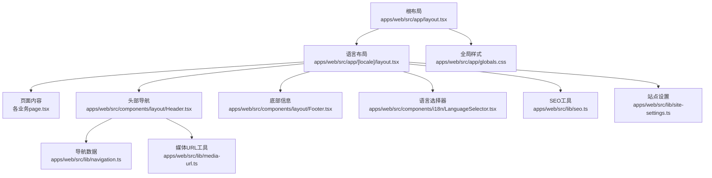
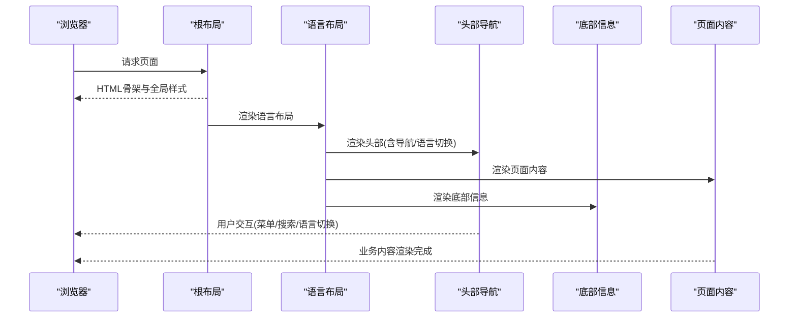
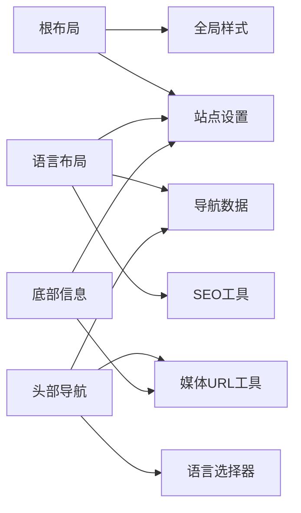

# 页面布局系统

<cite>
**本文引用的文件**   
- [apps/web/src/app/layout.tsx](file://apps/web/src/app/layout.tsx)
- [apps/web/src/app/[locale]/layout.tsx](file://apps/web/src/app/%5Blocale%5D/layout.tsx)
- [apps/web/src/app/globals.css](file://apps/web/src/app/globals.css)
- [apps/web/src/components/layout/Header.tsx](file://apps/web/src/components/layout/Header.tsx)
- [apps/web/src/components/layout/Footer.tsx](file://apps/web/src/components/layout/Footer.tsx)
- [apps/web/src/components/i18n/LanguageSelector.tsx](file://apps/web/src/components/i18n/LanguageSelector.tsx)
- [apps/web/src/lib/navigation.ts](file://apps/web/src/lib/navigation.ts)
- [apps/web/src/lib/seo.ts](file://apps/web/src/lib/seo.ts)
- [apps/web/src/lib/site-settings.ts](file://apps/web/src/lib/site-settings.ts)
- [apps/web/src/lib/media-url.ts](file://apps/web/src/lib/media-url.ts)
- [apps/web/src/hooks/useScrollHeaderHide.ts](file://apps/web/src/hooks/useScrollHeaderHide.ts)
- [apps/web/next.config.ts](file://apps/web/next.config.ts)
- [apps/web/public/browser-support.js](file://apps/web/public/browser-support.js)
</cite>

## 目录
1. [简介](#简介)
2. [项目结构](#项目结构)
3. [核心组件](#核心组件)
4. [架构总览](#架构总览)
5. [详细组件分析](#详细组件分析)
6. [依赖关系分析](#依赖关系分析)
7. [性能考量](#性能考量)
8. [故障排查指南](#故障排查指南)
9. [结论](#结论)
10. [附录](#附录)

## 简介
本文件面向Next.js应用中的页面布局系统，聚焦于全局布局结构、头部导航、底部信息、响应式设计与主题切换。文档基于仓库中web应用的布局实现，解释布局嵌套机制、状态管理、组件复用模式，并给出移动端适配与可访问性实践，以及SEO配置与性能优化建议。

## 项目结构
该项目的布局体系采用Next.js App Router的层级布局：
- 根级布局负责全局样式、元数据、国际化与站点设置注入
- 语言路由层布局负责按语言渲染内容与导航上下文
- 业务页面通过children挂载到对应布局
- 公共UI（头部、底部、语言选择器等）集中在components/layout与components/i18n下

图表来源
- [apps/web/src/app/layout.tsx](file://apps/web/src/app/layout.tsx)
- [apps/web/src/app/[locale]/layout.tsx](file://apps/web/src/app/%5Blocale%5D/layout.tsx)
- [apps/web/src/app/globals.css](file://apps/web/src/app/globals.css)
- [apps/web/src/components/layout/Header.tsx](file://apps/web/src/components/layout/Header.tsx)
- [apps/web/src/components/layout/Footer.tsx](file://apps/web/src/components/layout/Footer.tsx)
- [apps/web/src/components/i18n/LanguageSelector.tsx](file://apps/web/src/components/i18n/LanguageSelector.tsx)
- [apps/web/src/lib/navigation.ts](file://apps/web/src/lib/navigation.ts)
- [apps/web/src/lib/seo.ts](file://apps/web/src/lib/seo.ts)
- [apps/web/src/lib/site-settings.ts](file://apps/web/src/lib/site-settings.ts)
- [apps/web/src/lib/media-url.ts](file://apps/web/src/lib/media-url.ts)

章节来源
- [apps/web/src/app/layout.tsx](file://apps/web/src/app/layout.tsx)
- [apps/web/src/app/[locale]/layout.tsx](file://apps/web/src/app/%5Blocale%5D/layout.tsx)
- [apps/web/src/app/globals.css](file://apps/web/src/app/globals.css)

## 核心组件
- 根布局：提供全局HTML骨架、字体与CSS变量、站点元信息与主题初始化
- 语言布局：根据当前语言加载导航与SEO上下文，包裹头部、主体与底部
- 头部导航：响应式菜单、搜索入口、语言切换与登录态展示
- 底部信息：版权、链接、联系方式与社交媒体图标
- 语言选择器：支持多语言切换与抽屉式交互
- SEO工具：集中生成标题、描述、OpenGraph与结构化数据
- 站点设置：读取站点配置（如Logo、Favicon、社交渠道等）
- 媒体URL工具：统一处理图片与视频资源路径与CDN参数

章节来源
- [apps/web/src/app/layout.tsx](file://apps/web/src/app/layout.tsx)
- [apps/web/src/app/[locale]/layout.tsx](file://apps/web/src/app/%5Blocale%5D/layout.tsx)
- [apps/web/src/components/layout/Header.tsx](file://apps/web/src/components/layout/Header.tsx)
- [apps/web/src/components/layout/Footer.tsx](file://apps/web/src/components/layout/Footer.tsx)
- [apps/web/src/components/i18n/LanguageSelector.tsx](file://apps/web/src/components/i18n/LanguageSelector.tsx)
- [apps/web/src/lib/seo.ts](file://apps/web/src/lib/seo.ts)
- [apps/web/src/lib/site-settings.ts](file://apps/web/src/lib/site-settings.ts)
- [apps/web/src/lib/media-url.ts](file://apps/web/src/lib/media-url.ts)

## 架构总览
布局系统遵循“根布局 → 语言布局 → 页面”的嵌套模型，配合共享组件与工具库完成导航、SEO与站点配置的注入。

图表来源
- [apps/web/src/app/layout.tsx](file://apps/web/src/app/layout.tsx)
- [apps/web/src/app/[locale]/layout.tsx](file://apps/web/src/app/%5Blocale%5D/layout.tsx)
- [apps/web/src/components/layout/Header.tsx](file://apps/web/src/components/layout/Header.tsx)
- [apps/web/src/components/layout/Footer.tsx](file://apps/web/src/components/layout/Footer.tsx)

## 详细组件分析

### 根布局（全局结构与主题）
- 职责
  - 定义HTML文档结构、全局CSS变量与字体加载
  - 注入站点元数据（标题、描述、favicon、主题色）
  - 初始化主题与国际化上下文
- 关键点
  - 使用全局样式表与CSS变量控制主题
  - 通过站点设置动态更新元数据
  - 为子布局提供统一的容器与背景

章节来源
- [apps/web/src/app/layout.tsx](file://apps/web/src/app/layout.tsx)
- [apps/web/src/app/globals.css](file://apps/web/src/app/globals.css)
- [apps/web/src/lib/site-settings.ts](file://apps/web/src/lib/site-settings.ts)

### 语言布局（导航与SEO上下文）
- 职责
  - 根据当前语言加载导航数据与文案
  - 组合头部、主体与底部
  - 注入页面级SEO（标题、描述、OG标签）
- 关键点
  - 使用导航数据源构建菜单结构
  - 结合SEO工具生成结构化元数据
  - 将语言切换器集成至头部或独立区域

章节来源
- [apps/web/src/app/[locale]/layout.tsx](file://apps/web/src/app/%5Blocale%5D/layout.tsx)
- [apps/web/src/lib/navigation.ts](file://apps/web/src/lib/navigation.ts)
- [apps/web/src/lib/seo.ts](file://apps/web/src/lib/seo.ts)

### 头部导航（响应式与可访问性）
- 职责
  - 展示品牌Logo、主导航、搜索入口与语言切换
  - 在移动端提供抽屉式菜单
  - 支持滚动时隐藏/显示以提升阅读体验
- 关键点
  - 使用响应式断点切换布局
  - 键盘可达性与ARIA属性完善
  - 与滚动钩子联动控制显隐

章节来源
- [apps/web/src/components/layout/Header.tsx](file://apps/web/src/components/layout/Header.tsx)
- [apps/web/src/hooks/useScrollHeaderHide.ts](file://apps/web/src/hooks/useScrollHeaderHide.ts)
- [apps/web/src/components/i18n/LanguageSelector.tsx](file://apps/web/src/components/i18n/LanguageSelector.tsx)

### 底部信息（站点信息与链接）
- 职责
  - 展示版权、帮助链接、隐私条款与社交媒体
  - 提供联系入口与二维码卡片
- 关键点
  - 从站点设置读取Logo与社交渠道
  - 图片与媒体资源使用统一URL工具

章节来源
- [apps/web/src/components/layout/Footer.tsx](file://apps/web/src/components/layout/Footer.tsx)
- [apps/web/src/lib/site-settings.ts](file://apps/web/src/lib/site-settings.ts)
- [apps/web/src/lib/media-url.ts](file://apps/web/src/lib/media-url.ts)

### 语言选择器（国际化切换）
- 职责
  - 提供语言切换入口与抽屉式面板
  - 保持用户偏好与路由一致性
- 关键点
  - 与路由层语言前缀同步
  - 无障碍标签与键盘操作支持

章节来源
- [apps/web/src/components/i18n/LanguageSelector.tsx](file://apps/web/src/components/i18n/LanguageSelector.tsx)

### SEO配置（标题、描述与结构化数据）
- 职责
  - 集中生成页面标题、描述、OpenGraph与JSON-LD
  - 与站点设置与导航数据联动
- 关键点
  - 避免重复元数据冲突
  - 按需加载结构化数据

章节来源
- [apps/web/src/lib/seo.ts](file://apps/web/src/lib/seo.ts)

### 站点设置（Logo、Favicon与社交渠道）
- 职责
  - 提供站点级别的配置项与默认值
  - 供布局与组件读取以保持一致性
- 关键点
  - 支持运行时覆盖与缓存策略

章节来源
- [apps/web/src/lib/site-settings.ts](file://apps/web/src/lib/site-settings.ts)

### 媒体URL工具（图片与视频路径）
- 职责
  - 统一处理媒体资源的域名、路径与CDN参数
  - 为头部与底部等组件提供一致的媒体引用
- 关键点
  - 区分静态与动态资源
  - 兼容不同部署环境

章节来源
- [apps/web/src/lib/media-url.ts](file://apps/web/src/lib/media-url.ts)

## 依赖关系分析
布局组件之间的依赖关系如下：
- 根布局依赖全局样式与站点设置
- 语言布局依赖导航数据、SEO工具与站点设置
- 头部导航依赖导航数据、媒体URL与语言选择器
- 底部信息依赖站点设置与媒体URL

图表来源
- [apps/web/src/app/layout.tsx](file://apps/web/src/app/layout.tsx)
- [apps/web/src/app/[locale]/layout.tsx](file://apps/web/src/app/%5Blocale%5D/layout.tsx)
- [apps/web/src/components/layout/Header.tsx](file://apps/web/src/components/layout/Header.tsx)
- [apps/web/src/components/layout/Footer.tsx](file://apps/web/src/components/layout/Footer.tsx)
- [apps/web/src/components/i18n/LanguageSelector.tsx](file://apps/web/src/components/i18n/LanguageSelector.tsx)
- [apps/web/src/lib/navigation.ts](file://apps/web/src/lib/navigation.ts)
- [apps/web/src/lib/seo.ts](file://apps/web/src/lib/seo.ts)
- [apps/web/src/lib/site-settings.ts](file://apps/web/src/lib/site-settings.ts)
- [apps/web/src/lib/media-url.ts](file://apps/web/src/lib/media-url.ts)

章节来源
- [apps/web/src/app/layout.tsx](file://apps/web/src/app/layout.tsx)
- [apps/web/src/app/[locale]/layout.tsx](file://apps/web/src/app/%5Blocale%5D/layout.tsx)
- [apps/web/src/components/layout/Header.tsx](file://apps/web/src/components/layout/Header.tsx)
- [apps/web/src/components/layout/Footer.tsx](file://apps/web/src/components/layout/Footer.tsx)
- [apps/web/src/components/i18n/LanguageSelector.tsx](file://apps/web/src/components/i18n/LanguageSelector.tsx)
- [apps/web/src/lib/navigation.ts](file://apps/web/src/lib/navigation.ts)
- [apps/web/src/lib/seo.ts](file://apps/web/src/lib/seo.ts)
- [apps/web/src/lib/site-settings.ts](file://apps/web/src/lib/site-settings.ts)
- [apps/web/src/lib/media-url.ts](file://apps/web/src/lib/media-url.ts)

## 性能考量
- 首屏优化
  - 关键CSS内联与字体预加载
  - 减少头部与底部的重渲染
- 资源加载
  - 图片懒加载与CDN压缩
  - 媒体URL工具统一参数化
- 交互优化
  - 滚动时头部显隐节流
  - 移动端菜单延迟渲染
- 构建与缓存
  - Next.js静态导出与增量再生成
  - 站点设置与导航数据的缓存策略

[本节为通用指导，不直接分析具体文件]

## 故障排查指南
- 布局错位或样式异常
  - 检查全局样式变量是否被覆盖
  - 确认CSS断点与媒体查询是否正确
- 导航或语言切换无效
  - 校验导航数据源与路由前缀
  - 检查语言选择器的状态同步
- SEO元数据缺失
  - 确认SEO工具调用顺序与优先级
  - 验证站点设置中的标题与描述字段
- 媒体资源无法加载
  - 核对媒体URL工具的域名与路径规则
  - 检查CDN与跨域配置

章节来源
- [apps/web/src/app/globals.css](file://apps/web/src/app/globals.css)
- [apps/web/src/components/i18n/LanguageSelector.tsx](file://apps/web/src/components/i18n/LanguageSelector.tsx)
- [apps/web/src/lib/seo.ts](file://apps/web/src/lib/seo.ts)
- [apps/web/src/lib/media-url.ts](file://apps/web/src/lib/media-url.ts)

## 结论
该布局系统通过清晰的层级结构与共享组件实现了可扩展、可维护的全局布局。借助SEO工具、站点设置与媒体URL工具，保证了内容呈现的一致性与性能。建议在后续迭代中继续强化移动端体验、可访问性测试与性能监控。

[本节为总结，不直接分析具体文件]

## 附录
- 浏览器兼容性脚本
  - 用于检测与提示不支持的环境，提升用户体验

章节来源
- [apps/web/public/browser-support.js](file://apps/web/public/browser-support.js)