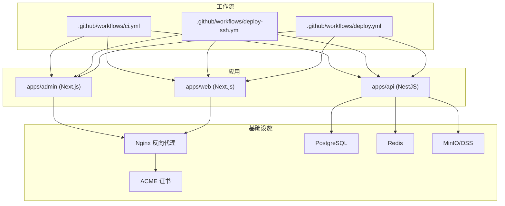
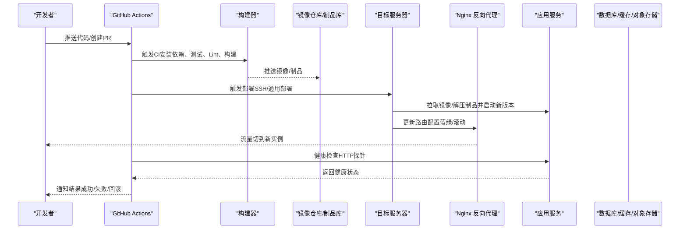
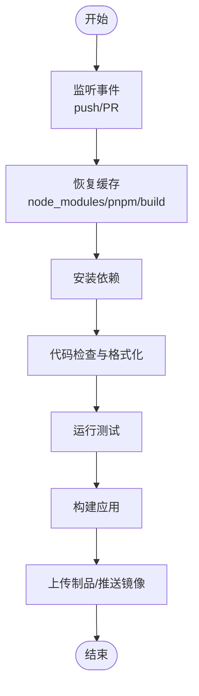
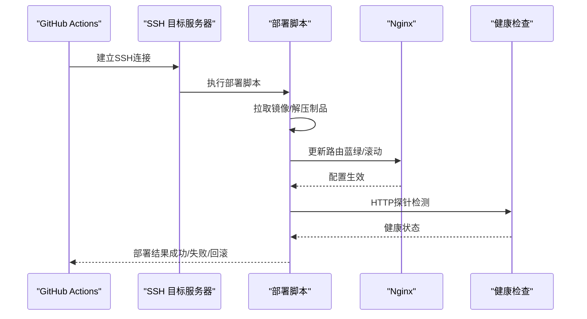
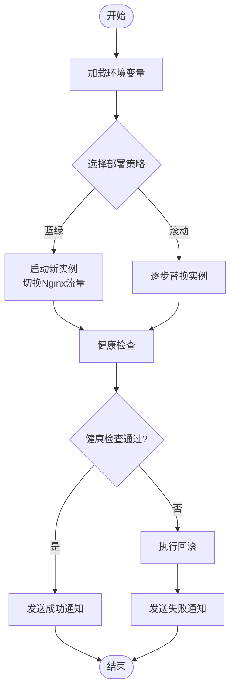
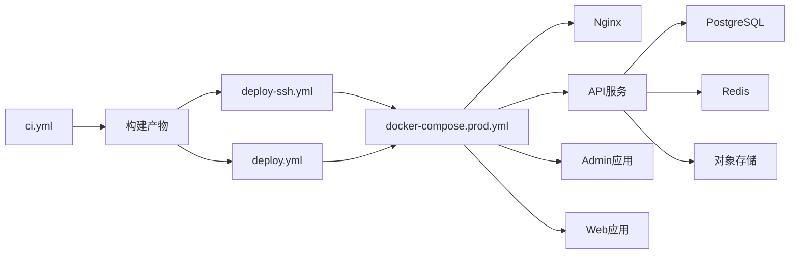

# CI/CD流水线

<cite>
**本文引用的文件**   
- [ci.yml](file://.github/workflows/ci.yml)
- [deploy-ssh.yml](file://.github/workflows/deploy-ssh.yml)
- [deploy.yml](file://.github/workflows/deploy.yml)
- [docker-compose.prod.yml](file://infra/docker/docker-compose.prod.yml)
- [docker-compose.dev.yml](file://infra/docker/docker-compose.dev.yml)
- [nginx/tzj.conf.template](file://infra/docker/nginx/templates/tzj.conf.template)
- [nginx/tzj-bootstrap.conf](file://infra/docker/nginx/tzj-bootstrap.conf)
- [nginx/entrypoint.d/90-periodic-reload.sh](file://infra/docker/nginx/entrypoint.d/90-periodic-reload.sh)
- [acme/Dockerfile](file://infra/docker/acme/Dockerfile)
- [acme/deploy-cdn.sh](file://infra/docker/acme/deploy-cdn.sh)
- [oss/apply-cors.sh](file://infra/docker/oss/apply-cors.sh)
- [oss/cors.json](file://infra/docker/oss/cors.json)
- [postgres/init.sql](file://infra/docker/postgres/init.sql)
- [redis/redis.conf](file://infra/docker/redis/redis.conf)
- [apps/admin/Dockerfile](file://apps/admin/Dockerfile)
- [apps/api/Dockerfile](file://apps/api/Dockerfile)
- [apps/web/Dockerfile](file://apps/web/Dockerfile)
- [Makefile](file://Makefile)
- [turbo.json](file://turbo.json)
- [.npmrc](file://.npmrc)
- [package.json](file://package.json)
</cite>

## 目录
1. [简介](#简介)
2. [项目结构](#项目结构)
3. [核心组件](#核心组件)
4. [架构总览](#架构总览)
5. [详细组件分析](#详细组件分析)
6. [依赖关系分析](#依赖关系分析)
7. [性能考虑](#性能考虑)
8. [故障排查指南](#故障排查指南)
9. [结论](#结论)
10. [附录](#附录)

## 简介
本文件面向CI/CD流水线的构建、测试、检查与发布全流程，结合仓库中的GitHub Actions工作流与基础设施脚本，系统化说明：
- GitHub Actions工作流配置（CI、SSH部署、通用部署）
- 自动化测试与代码检查
- 构建与发布流程（多应用、多环境）
- 多环境部署策略（开发/生产）、蓝绿部署与滚动更新实现思路
- SSH部署、密钥管理与安全最佳实践
- 流水线监控、失败重试、通知机制与回滚策略
- 自定义Action开发、缓存优化与并行执行配置

## 项目结构
仓库采用Monorepo组织，包含前端管理端（admin）、服务端API（api）、前端站点（web），以及基础设施（infra）与GitHub Actions工作流（.github/workflows）。关键目录与职责：
- .github/workflows：定义CI与部署工作流
- apps/{admin,api,web}：各应用的源码、Dockerfile与构建配置
- infra/docker：容器化编排、Nginx反向代理、证书与存储配置
- Makefile与turbo.json：统一命令入口与任务编排

图表来源
- [ci.yml:1-200](file://.github/workflows/ci.yml#L1-L200)
- [deploy-ssh.yml:1-200](file://.github/workflows/deploy-ssh.yml#L1-L200)
- [deploy.yml:1-200](file://.github/workflows/deploy.yml#L1-L200)
- [docker-compose.prod.yml:1-200](file://infra/docker/docker-compose.prod.yml#L1-L200)
- [nginx/tzj.conf.template:1-200](file://infra/docker/nginx/templates/tzj.conf.template#L1-L200)

章节来源
- [ci.yml:1-200](file://.github/workflows/ci.yml#L1-L200)
- [deploy-ssh.yml:1-200](file://.github/workflows/deploy-ssh.yml#L1-L200)
- [deploy.yml:1-200](file://.github/workflows/deploy.yml#L1-L200)
- [docker-compose.prod.yml:1-200](file://infra/docker/docker-compose.prod.yml#L1-L200)
- [Makefile:1-200](file://Makefile#L1-L200)
- [turbo.json:1-200](file://turbo.json#L1-L200)

## 核心组件
- GitHub Actions工作流
  - ci.yml：触发条件、缓存、并行构建、单元测试、类型检查、代码质量检查
  - deploy-ssh.yml：通过SSH将制品或镜像推送到目标服务器并执行部署脚本
  - deploy.yml：通用部署流程（支持按分支/标签触发、环境变量注入、健康检查）
- 应用Dockerfile
  - apps/admin/Dockerfile、apps/api/Dockerfile、apps/web/Dockerfile：多阶段构建、依赖安装、静态资源生成、运行时最小化镜像
- 基础设施编排
  - docker-compose.prod.yml：生产环境服务编排（Nginx、API、DB、Cache、对象存储、证书）
  - nginx模板与启动脚本：动态配置重载、蓝绿切换、滚动更新钩子
- 工具与脚本
  - Makefile：统一命令入口（build、test、lint、deploy等）
  - turbo.json：任务图与缓存策略
  - .npmrc：包管理器镜像与缓存加速

章节来源
- [ci.yml:1-200](file://.github/workflows/ci.yml#L1-L200)
- [deploy-ssh.yml:1-200](file://.github/workflows/deploy-ssh.yml#L1-L200)
- [deploy.yml:1-200](file://.github/workflows/deploy.yml#L1-L200)
- [apps/admin/Dockerfile:1-200](file://apps/admin/Dockerfile#L1-L200)
- [apps/api/Dockerfile:1-200](file://apps/api/Dockerfile#L1-L200)
- [apps/web/Dockerfile:1-200](file://apps/web/Dockerfile#L1-L200)
- [docker-compose.prod.yml:1-200](file://infra/docker/docker-compose.prod.yml#L1-L200)
- [Makefile:1-200](file://Makefile#L1-L200)
- [turbo.json:1-200](file://turbo.json#L1-L200)
- [.npmrc:1-200](file://.npmrc#L1-L200)

## 架构总览
整体CI/CD架构围绕“代码提交→CI校验→构建制品→部署到目标环境→健康检查→灰度/蓝绿切换”的闭环展开。Nginx作为统一入口，根据配置将流量路由至不同版本实例；数据库与缓存由容器化服务提供；对象存储用于媒体资源。

图表来源
- [ci.yml:1-200](file://.github/workflows/ci.yml#L1-L200)
- [deploy-ssh.yml:1-200](file://.github/workflows/deploy-ssh.yml#L1-L200)
- [deploy.yml:1-200](file://.github/workflows/deploy.yml#L1-L200)
- [docker-compose.prod.yml:1-200](file://infra/docker/docker-compose.prod.yml#L1-L200)
- [nginx/tzj.conf.template:1-200](file://infra/docker/nginx/templates/tzj.conf.template#L1-L200)

## 详细组件分析

### GitHub Actions工作流：CI（ci.yml）
- 触发条件：push/PR事件，按分支过滤（如main、develop、feature/*）
- 缓存策略：Node模块缓存、pnpm缓存、构建产物缓存
- 并行执行：多应用并行构建与测试（turbo任务图）
- 代码质量：TypeScript类型检查、Biome/Lint、格式化校验
- 测试：单元测试、集成测试（可选）
- 构建：多阶段构建，输出可分发制品或镜像
- 失败重试：对网络相关步骤启用自动重试

图表来源
- [ci.yml:1-200](file://.github/workflows/ci.yml#L1-L200)

章节来源
- [ci.yml:1-200](file://.github/workflows/ci.yml#L1-L200)
- [turbo.json:1-200](file://turbo.json#L1-L200)
- [.npmrc:1-200](file://.npmrc#L1-L200)

### GitHub Actions工作流：SSH部署（deploy-ssh.yml）
- 触发条件：特定分支/标签（如release/v*、main）
- 认证方式：SSH私钥（Secrets管理）
- 部署步骤：
  - 连接目标服务器
  - 拉取最新镜像或下载制品
  - 执行部署脚本（停止旧实例、启动新实例、更新Nginx配置）
  - 健康检查与回滚逻辑
- 并发控制：避免同一环境重复部署

图表来源
- [deploy-ssh.yml:1-200](file://.github/workflows/deploy-ssh.yml#L1-L200)
- [nginx/tzj.conf.template:1-200](file://infra/docker/nginx/templates/tzj.conf.template#L1-L200)

章节来源
- [deploy-ssh.yml:1-200](file://.github/workflows/deploy-ssh.yml#L1-L200)

### GitHub Actions工作流：通用部署（deploy.yml）
- 触发条件：手动触发或按分支/标签自动触发
- 环境变量：按环境注入（DEV/STAGING/PROD）
- 部署策略：
  - 蓝绿部署：同时运行新旧两套实例，通过Nginx切换流量
  - 滚动更新：逐步替换实例，保证零停机
- 健康检查：基于HTTP探针与数据库连通性检查
- 通知机制：成功/失败通知（邮件/IM）

图表来源
- [deploy.yml:1-200](file://.github/workflows/deploy.yml#L1-L200)
- [docker-compose.prod.yml:1-200](file://infra/docker/docker-compose.prod.yml#L1-L200)

章节来源
- [deploy.yml:1-200](file://.github/workflows/deploy.yml#L1-L200)

### 应用Dockerfile与构建优化
- 多阶段构建：分离依赖安装、构建与运行时环境，减小镜像体积
- 缓存层优化：将依赖安装与业务代码分层，利用Docker缓存
- 环境变量注入：通过构建时参数与运行时环境变量区分
- 安全加固：非root用户运行、最小权限原则

章节来源
- [apps/admin/Dockerfile:1-200](file://apps/admin/Dockerfile#L1-L200)
- [apps/api/Dockerfile:1-200](file://apps/api/Dockerfile#L1-L200)
- [apps/web/Dockerfile:1-200](file://apps/web/Dockerfile#L1-L200)

### 基础设施编排与反向代理
- docker-compose.prod.yml：定义服务依赖、端口映射、数据卷挂载、环境变量
- Nginx模板：根据环境变量动态生成配置，支持蓝绿路由与热重载
- 启动脚本：周期性重载配置，确保配置变更即时生效

章节来源
- [docker-compose.prod.yml:1-200](file://infra/docker/docker-compose.prod.yml#L1-L200)
- [nginx/tzj.conf.template:1-200](file://infra/docker/nginx/templates/tzj.conf.template#L1-L200)
- [nginx/entrypoint.d/90-periodic-reload.sh:1-200](file://infra/docker/nginx/entrypoint.d/90-periodic-reload.sh#L1-L200)

### 证书与对象存储
- ACME：自动申请与续期HTTPS证书
- OSS/MinIO：媒体资源存储，CORS配置与安全策略

章节来源
- [acme/Dockerfile:1-200](file://infra/docker/acme/Dockerfile#L1-L200)
- [acme/deploy-cdn.sh:1-200](file://infra/docker/acme/deploy-cdn.sh#L1-L200)
- [oss/apply-cors.sh:1-200](file://infra/docker/oss/apply-cors.sh#L1-L200)
- [oss/cors.json:1-200](file://infra/docker/oss/cors.json#L1-L200)

### 数据库与缓存
- PostgreSQL：初始化SQL脚本、迁移策略
- Redis：会话缓存、队列与热点数据

章节来源
- [postgres/init.sql:1-200](file://infra/docker/postgres/init.sql#L1-L200)
- [redis/redis.conf:1-200](file://infra/docker/redis/redis.conf#L1-L200)

### 统一命令与任务编排
- Makefile：封装常用命令（build、test、lint、deploy）
- turbo.json：定义任务依赖与缓存键，提升并行效率

章节来源
- [Makefile:1-200](file://Makefile#L1-L200)
- [turbo.json:1-200](file://turbo.json#L1-L200)

## 依赖关系分析
- 工作流依赖：ci.yml为前置校验，deploy-ssh.yml与deploy.yml依赖构建产物
- 应用依赖：admin/web依赖api服务，api依赖数据库、缓存与对象存储
- 基础设施依赖：Nginx依赖后端服务，证书与存储为外部依赖

图表来源
- [ci.yml:1-200](file://.github/workflows/ci.yml#L1-L200)
- [deploy-ssh.yml:1-200](file://.github/workflows/deploy-ssh.yml#L1-L200)
- [deploy.yml:1-200](file://.github/workflows/deploy.yml#L1-L200)
- [docker-compose.prod.yml:1-200](file://infra/docker/docker-compose.prod.yml#L1-L200)

章节来源
- [ci.yml:1-200](file://.github/workflows/ci.yml#L1-L200)
- [deploy-ssh.yml:1-200](file://.github/workflows/deploy-ssh.yml#L1-L200)
- [deploy.yml:1-200](file://.github/workflows/deploy.yml#L1-L200)
- [docker-compose.prod.yml:1-200](file://infra/docker/docker-compose.prod.yml#L1-L200)

## 性能考虑
- 缓存优化：
  - Node模块与pnpm缓存
  - Docker层缓存与构建缓存
  - 构建产物缓存（turbo）
- 并行执行：
  - 多应用并行构建与测试
  - 任务图依赖优化
- 镜像优化：
  - 多阶段构建减少体积
  - 使用轻量基础镜像
- 网络优化：
  - 镜像仓库镜像加速
  - 依赖源镜像配置

章节来源
- [.npmrc:1-200](file://.npmrc#L1-L200)
- [turbo.json:1-200](file://turbo.json#L1-L200)
- [apps/admin/Dockerfile:1-200](file://apps/admin/Dockerfile#L1-L200)
- [apps/api/Dockerfile:1-200](file://apps/api/Dockerfile#L1-L200)
- [apps/web/Dockerfile:1-200](file://apps/web/Dockerfile#L1-L200)

## 故障排查指南
- 常见问题定位：
  - 构建失败：检查依赖安装、类型检查、测试用例
  - 部署失败：验证SSH密钥、环境变量、健康检查
  - 服务不可用：检查日志、端口占用、依赖服务状态
- 调试技巧：
  - 启用详细日志输出
  - 分步执行工作流任务
  - 本地复现问题
- 回滚策略：
  - 保留历史版本镜像/制品
  - 快速切换Nginx路由
  - 数据库迁移回滚脚本

章节来源
- [deploy-ssh.yml:1-200](file://.github/workflows/deploy-ssh.yml#L1-L200)
- [deploy.yml:1-200](file://.github/workflows/deploy.yml#L1-L200)
- [nginx/tzj.conf.template:1-200](file://infra/docker/nginx/templates/tzj.conf.template#L1-L200)

## 结论
本CI/CD流水线通过GitHub Actions实现自动化构建、测试与部署，结合Docker与Nginx实现蓝绿部署与滚动更新。通过缓存优化、并行执行与安全最佳实践，确保高效、稳定、安全的交付流程。建议持续完善监控告警、日志收集与性能分析，进一步提升系统可靠性与可观测性。

## 附录
- 安全最佳实践：
  - 使用GitHub Secrets管理敏感信息
  - 最小权限原则分配访问令牌
  - 定期轮换密钥与证书
- 监控与告警：
  - 集成日志聚合与错误追踪
  - 设置健康检查与告警规则
  - 监控构建与部署指标
- 自定义Action开发：
  - 封装重复任务为Reusable Workflows
  - 开发自定义Action提高复用性
  - 遵循Action规范与最佳实践