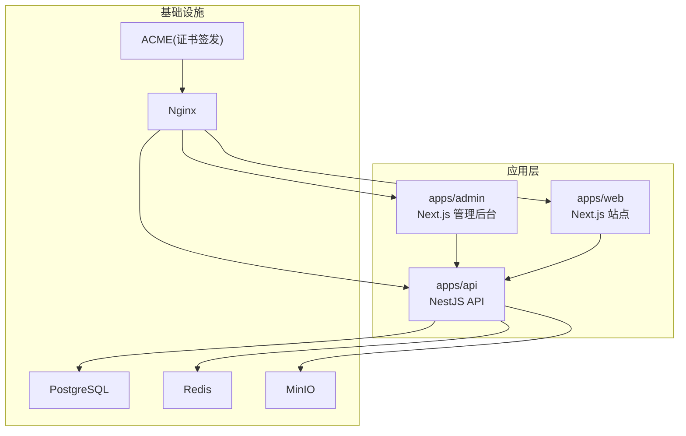
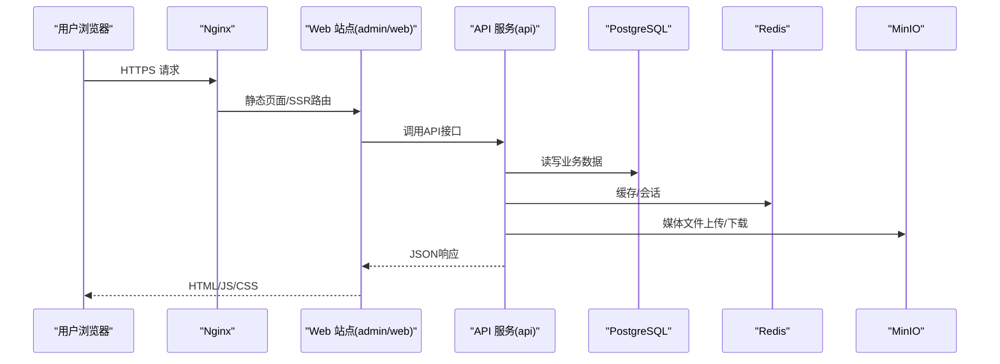
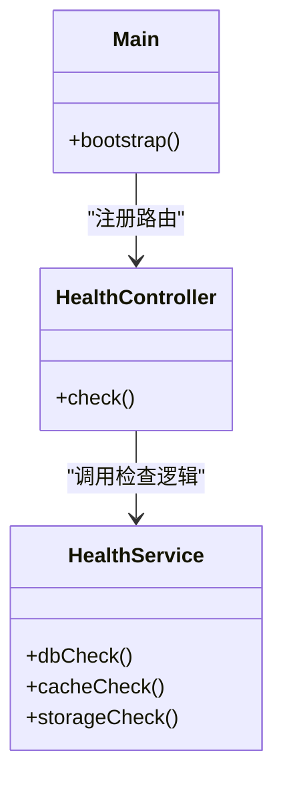
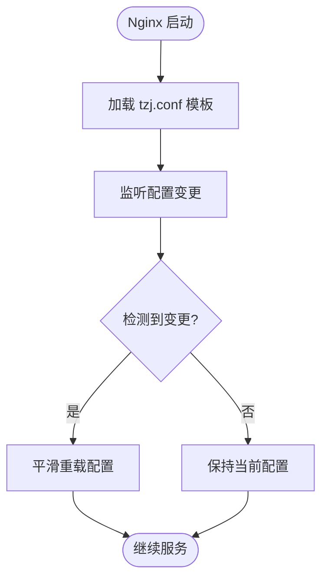
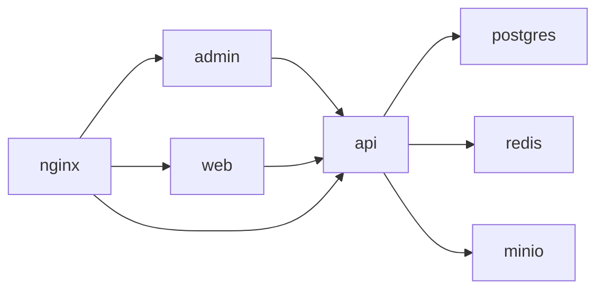

# Docker容器化部署

<cite>
**本文档引用的文件**   
- [apps/admin/Dockerfile](file://apps/admin/Dockerfile)
- [apps/api/Dockerfile](file://apps/api/Dockerfile)
- [apps/web/Dockerfile](file://apps/web/Dockerfile)
- [infra/docker/docker-compose.dev.yml](file://infra/docker/docker-compose.dev.yml)
- [infra/docker/docker-compose.prod.yml](file://infra/docker/docker-compose.prod.yml)
- [infra/docker/nginx/tzj.conf.template](file://infra/docker/nginx/tzj.conf.template)
- [infra/docker/nginx/entrypoint.d/90-periodic-reload.sh](file://infra/docker/nginx/entrypoint.d/90-periodic-reload.sh)
- [infra/docker/postgres/init.sql](file://infra/docker/postgres/init.sql)
- [infra/docker/minio/cors.xml](file://infra/docker/minio/cors.xml)
- [infra/docker/acme/Dockerfile](file://infra/docker/acme/Dockerfile)
- [infra/docker/acme/deploy-cdn.sh](file://infra/docker/acme/deploy-cdn.sh)
- [infra/docker/acme/issue.sh](file://infra/docker/acme/issue.sh)
- [infra/docker/redis/redis.conf](file://infra/docker/redis/redis.conf)
- [apps/api/src/main.ts](file://apps/api/src/main.ts)
- [apps/api/src/health/health.controller.ts](file://apps/api/src/health/health.controller.ts)
- [apps/api/src/health/health.service.ts](file://apps/api/src/health/health.service.ts)
- [apps/api/package.json](file://apps/api/package.json)
- [apps/admin/package.json](file://apps/admin/package.json)
- [apps/web/package.json](file://apps/web/package.json)
</cite>

## 目录
1. [简介](#简介)
2. [项目结构](#项目结构)
3. [核心组件](#核心组件)
4. [架构总览](#架构总览)
5. [详细组件分析](#详细组件分析)
6. [依赖关系分析](#依赖关系分析)
7. [性能与体积优化](#性能与体积优化)
8. [故障排查指南](#故障排查指南)
9. [结论](#结论)
10. [附录](#附录)

## 简介
本文件面向使用Docker进行容器化部署的工程师与运维人员，围绕本项目的前端（admin、web）、后端API服务以及基础设施（PostgreSQL、Redis、MinIO、Nginx、ACME证书）给出完整的容器化方案。内容涵盖：
- 各应用的Dockerfile配置与多阶段构建策略
- 镜像分层与依赖管理最佳实践
- docker-compose编排与服务间通信、网络、数据卷与环境变量注入
- 开发环境与生产环境的差异化配置
- 健康检查、日志收集与监控集成建议
- 缓存策略与镜像体积优化技巧

## 项目结构
仓库采用多应用+基础设施分离的组织方式：
- apps/admin：管理后台（Next.js）
- apps/web：对外站点（Next.js）
- apps/api：业务API（NestJS）
- infra/docker：Docker相关资源（compose、Nginx模板、数据库初始化、对象存储CORS、ACME脚本等）

图表来源
- [apps/admin/Dockerfile](file://apps/admin/Dockerfile)
- [apps/web/Dockerfile](file://apps/web/Dockerfile)
- [apps/api/Dockerfile](file://apps/api/Dockerfile)
- [infra/docker/nginx/tzj.conf.template](file://infra/docker/nginx/tzj.conf.template)
- [infra/docker/postgres/init.sql](file://infra/docker/postgres/init.sql)
- [infra/docker/minio/cors.xml](file://infra/docker/minio/cors.xml)
- [infra/docker/acme/Dockerfile](file://infra/docker/acme/Dockerfile)

章节来源
- [apps/admin/Dockerfile](file://apps/admin/Dockerfile)
- [apps/web/Dockerfile](file://apps/web/Dockerfile)
- [apps/api/Dockerfile](file://apps/api/Dockerfile)
- [infra/docker/docker-compose.dev.yml](file://infra/docker/docker-compose.dev.yml)
- [infra/docker/docker-compose.prod.yml](file://infra/docker/docker-compose.prod.yml)

## 核心组件
- 前端应用（admin、web）：基于Next.js，通过Dockerfile进行多阶段构建，生成静态产物或可运行镜像。
- API服务（api）：基于NestJS，提供REST与WebSocket能力，连接PostgreSQL、Redis、MinIO。
- 反向代理（Nginx）：统一入口、HTTPS终止、动态配置重载。
- 数据存储：PostgreSQL（持久化）、Redis（缓存与会话）、MinIO（对象存储）。
- 证书管理（ACME）：自动化申请与续期TLS证书，并触发Nginx重载。

章节来源
- [apps/admin/Dockerfile](file://apps/admin/Dockerfile)
- [apps/web/Dockerfile](file://apps/web/Dockerfile)
- [apps/api/Dockerfile](file://apps/api/Dockerfile)
- [infra/docker/nginx/tzj.conf.template](file://infra/docker/nginx/tzj.conf.template)
- [infra/docker/postgres/init.sql](file://infra/docker/postgres/init.sql)
- [infra/docker/minio/cors.xml](file://infra/docker/minio/cors.xml)
- [infra/docker/acme/Dockerfile](file://infra/docker/acme/Dockerfile)

## 架构总览
下图展示了请求从浏览器到Nginx，再到前端应用与API服务的完整路径，以及数据流向PostgreSQL、Redis、MinIO。

图表来源
- [infra/docker/nginx/tzj.conf.template](file://infra/docker/nginx/tzj.conf.template)
- [apps/api/src/main.ts](file://apps/api/src/main.ts)
- [apps/api/package.json](file://apps/api/package.json)
- [apps/admin/package.json](file://apps/admin/package.json)
- [apps/web/package.json](file://apps/web/package.json)

## 详细组件分析

### 应用镜像构建（多阶段与分层）
- 构建阶段
  - 安装依赖、执行类型检查与构建，利用pnpm缓存层加速重复构建。
  - Next.js应用优先输出静态产物或生产构建结果，减少运行时依赖。
- 运行阶段
  - 仅包含运行时所需的最小基础镜像与产物，避免源码与构建工具链。
- 分层策略
  - 将package.json与锁文件置于最上层，最大化利用Docker缓存。
  - 将依赖安装与源代码拷贝分离，仅在代码变更时重新构建。
- 安全与体积
  - 使用非root用户运行进程。
  - 清理构建中间产物与不必要的系统包。

章节来源
- [apps/admin/Dockerfile](file://apps/admin/Dockerfile)
- [apps/web/Dockerfile](file://apps/web/Dockerfile)
- [apps/api/Dockerfile](file://apps/api/Dockerfile)
- [apps/admin/package.json](file://apps/admin/package.json)
- [apps/web/package.json](file://apps/web/package.json)
- [apps/api/package.json](file://apps/api/package.json)

### API服务（NestJS）
- 启动流程
  - 主入口加载模块、监听端口、注册中间件与拦截器。
- 健康检查
  - 暴露健康检查端点，用于容器探针与负载均衡探测。
- 外部依赖
  - 连接PostgreSQL（Prisma）、Redis（缓存/队列）、MinIO（对象存储）。

图表来源
- [apps/api/src/main.ts](file://apps/api/src/main.ts)
- [apps/api/src/health/health.controller.ts](file://apps/api/src/health/health.controller.ts)
- [apps/api/src/health/health.service.ts](file://apps/api/src/health/health.service.ts)

章节来源
- [apps/api/src/main.ts](file://apps/api/src/main.ts)
- [apps/api/src/health/health.controller.ts](file://apps/api/src/health/health.controller.ts)
- [apps/api/src/health/health.service.ts](file://apps/api/src/health/health.service.ts)

### Nginx反向代理与动态重载
- 作用
  - 统一入口、HTTPS终止、按域名路由至admin/web/api。
- 动态重载
  - 通过定时任务检测配置变化并平滑重载，避免中断请求。
- 模板化配置
  - 使用模板文件集中管理上游服务地址与路径映射。

图表来源
- [infra/docker/nginx/tzj.conf.template](file://infra/docker/nginx/tzj.conf.template)
- [infra/docker/nginx/entrypoint.d/90-periodic-reload.sh](file://infra/docker/nginx/entrypoint.d/90-periodic-reload.sh)

章节来源
- [infra/docker/nginx/tzj.conf.template](file://infra/docker/nginx/tzj.conf.template)
- [infra/docker/nginx/entrypoint.d/90-periodic-reload.sh](file://infra/docker/nginx/entrypoint.d/90-periodic-reload.sh)

### 数据存储与对象存储
- PostgreSQL
  - 通过init.sql初始化数据库结构与初始数据。
  - 数据卷持久化，确保重启不丢失。
- Redis
  - 使用自定义redis.conf调整内存与持久化策略。
- MinIO
  - 通过cors.xml配置跨域访问策略，供前端直传媒体文件。

章节来源
- [infra/docker/postgres/init.sql](file://infra/docker/postgres/init.sql)
- [infra/docker/redis/redis.conf](file://infra/docker/redis/redis.conf)
- [infra/docker/minio/cors.xml](file://infra/docker/minio/cors.xml)

### ACME证书自动化
- 功能
  - 自动申请与续期TLS证书，并将证书部署到Nginx挂载目录。
- 触发机制
  - 定时任务或事件触发脚本执行申请与部署。

章节来源
- [infra/docker/acme/Dockerfile](file://infra/docker/acme/Dockerfile)
- [infra/docker/acme/deploy-cdn.sh](file://infra/docker/acme/deploy-cdn.sh)
- [infra/docker/acme/issue.sh](file://infra/docker/acme/issue.sh)

## 依赖关系分析
- 服务间依赖
  - admin/web依赖api；api依赖PostgreSQL、Redis、MinIO。
- 网络模型
  - 所有服务在同一Compose网络内，通过服务名互相发现。
- 环境变量
  - 通过.env或compose文件注入数据库连接、存储凭证、站点URL等。

图表来源
- [infra/docker/docker-compose.dev.yml](file://infra/docker/docker-compose.dev.yml)
- [infra/docker/docker-compose.prod.yml](file://infra/docker/docker-compose.prod.yml)

章节来源
- [infra/docker/docker-compose.dev.yml](file://infra/docker/docker-compose.dev.yml)
- [infra/docker/docker-compose.prod.yml](file://infra/docker/docker-compose.prod.yml)

## 性能与体积优化
- 多阶段构建
  - 构建阶段与运行阶段分离，运行镜像仅包含必要依赖与产物。
- 缓存策略
  - 将依赖安装与源码拷贝分层，充分利用pnpm缓存与Docker层缓存。
- 镜像瘦身
  - 使用更小的基础镜像，清理临时文件与构建工具链。
- 构建优化
  - 并行构建与增量构建，跳过未变更模块。
- 运行时优化
  - 合理设置Node.js与框架参数，启用HTTP/2与Gzip/Brotli压缩。

章节来源
- [apps/admin/Dockerfile](file://apps/admin/Dockerfile)
- [apps/web/Dockerfile](file://apps/web/Dockerfile)
- [apps/api/Dockerfile](file://apps/api/Dockerfile)
- [apps/admin/package.json](file://apps/admin/package.json)
- [apps/web/package.json](file://apps/web/package.json)
- [apps/api/package.json](file://apps/api/package.json)

## 故障排查指南
- 健康检查
  - 使用API健康检查端点进行容器存活与就绪探测。
- 日志收集
  - 将应用stdout/stderr输出到容器日志，结合docker logs或集中式日志系统。
- 常见问题
  - 数据库连接失败：检查环境变量与网络连通性。
  - 对象存储CORS错误：确认MinIO CORS配置。
  - 证书过期：检查ACME任务与Nginx重载脚本。

章节来源
- [apps/api/src/health/health.controller.ts](file://apps/api/src/health/health.controller.ts)
- [apps/api/src/health/health.service.ts](file://apps/api/src/health/health.service.ts)
- [infra/docker/minio/cors.xml](file://infra/docker/minio/cors.xml)
- [infra/docker/acme/deploy-cdn.sh](file://infra/docker/acme/deploy-cdn.sh)
- [infra/docker/acme/issue.sh](file://infra/docker/acme/issue.sh)

## 结论
通过多阶段构建、合理的镜像分层与依赖管理，配合docker-compose编排与Nginx反向代理，本项目实现了前后端与基础设施的容器化部署。开发环境与生产环境通过不同compose文件与环境变量实现差异化管理。健康检查、日志与监控为稳定运行提供了保障。建议在CI中集成镜像扫描与安全加固，持续优化镜像体积与构建速度。

## 附录
- 环境变量清单
  - API：数据库连接串、Redis地址、MinIO端点与密钥、JWT密钥等。
  - 前端：站点URL、API基础路径、媒体源地址等。
- 数据卷挂载
  - PostgreSQL数据目录、MinIO数据目录、Nginx证书目录。
- 监控与告警
  - 接入Prometheus指标采集与日志聚合平台，设置关键指标阈值告警。