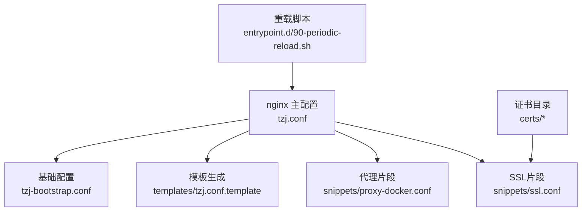
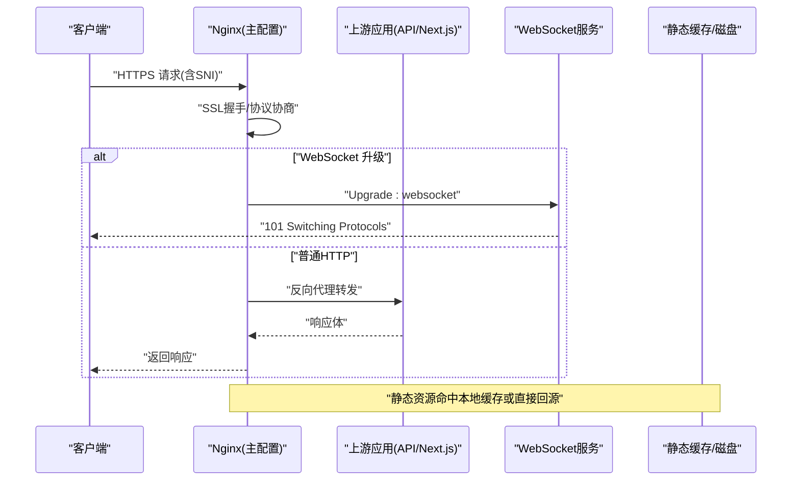
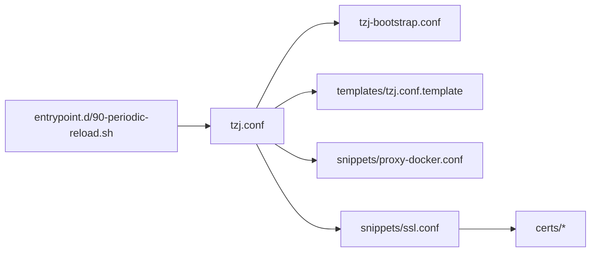

# Nginx反向代理配置

<cite>
**本文档引用的文件**   
- [infra/docker/nginx/tzj.conf](file://infra/docker/nginx/tzj.conf)
- [infra/docker/nginx/tzj-bootstrap.conf](file://infra/docker/nginx/tzj-bootstrap.conf)
- [infra/docker/nginx/templates/tzj.conf.template](file://infra/docker/nginx/templates/tzj.conf.template)
- [infra/docker/nginx/snippets/proxy-docker.conf](file://infra/docker/nginx/snippets/proxy-docker.conf)
- [infra/docker/nginx/snippets/ssl.conf](file://infra/docker/nginx/snippets/ssl.conf)
- [infra/docker/nginx/certs](file://infra/docker/nginx/certs)
- [infra/docker/nginx/entrypoint.d/90-periodic-reload.sh](file://infra/docker/nginx/entrypoint.d/90-periodic-reload.sh)
</cite>

## 目录
1. [简介](#简介)
2. [项目结构](#项目结构)
3. [核心组件](#核心组件)
4. [架构总览](#架构总览)
5. [详细组件分析](#详细组件分析)
6. [依赖关系分析](#依赖关系分析)
7. [性能调优与并发优化](#性能调优与并发优化)
8. [故障排查指南](#故障排查指南)
9. [结论](#结论)
10. [附录](#附录)

## 简介
本文件面向运维与后端工程师，系统化说明本项目中Nginx反向代理的配置结构与最佳实践。内容覆盖主配置文件组织、路由规则、负载均衡、SSL证书管理、WebSocket支持、静态资源缓存、Gzip压缩与安全头、子域名与路径重写、访问控制、错误页面定制、性能参数、连接池与并发优化，以及常见问题的定位与修复方法。

## 项目结构
Nginx相关配置集中在 infra/docker/nginx 目录下，采用“模板+片段+运行时生成”的方式：
- 模板层：templates/tzj.conf.template 用于根据环境变量或外部输入动态生成最终配置。
- 运行层：tzj.conf 为实际生效的主配置；tzj-bootstrap.conf 提供启动阶段的基础配置（如监听端口、日志、进程模型等）。
- 片段层：snippets 下包含可复用的片段，如 proxy-docker.conf（反向代理通用设置）与 ssl.conf（TLS/SSL安全参数）。
- 证书目录：certs 存放证书与私钥，供HTTPS站点使用。
- 钩子脚本：entrypoint.d/90-periodic-reload.sh 用于周期性重载Nginx，保障配置热更新。

图表来源
- [infra/docker/nginx/tzj.conf](file://infra/docker/nginx/tzj.conf)
- [infra/docker/nginx/tzj-bootstrap.conf](file://infra/docker/nginx/tzj-bootstrap.conf)
- [infra/docker/nginx/templates/tzj.conf.template](file://infra/docker/nginx/templates/tzj.conf.template)
- [infra/docker/nginx/snippets/proxy-docker.conf](file://infra/docker/nginx/snippets/proxy-docker.conf)
- [infra/docker/nginx/snippets/ssl.conf](file://infra/docker/nginx/snippets/ssl.conf)
- [infra/docker/nginx/certs](file://infra/docker/nginx/certs)
- [infra/docker/nginx/entrypoint.d/90-periodic-reload.sh](file://infra/docker/nginx/entrypoint.d/90-periodic-reload.sh)

章节来源
- [infra/docker/nginx/tzj.conf](file://infra/docker/nginx/tzj.conf)
- [infra/docker/nginx/tzj-bootstrap.conf](file://infra/docker/nginx/tzj-bootstrap.conf)
- [infra/docker/nginx/templates/tzj.conf.template](file://infra/docker/nginx/templates/tzj.conf.template)
- [infra/docker/nginx/snippets/proxy-docker.conf](file://infra/docker/nginx/snippets/proxy-docker.conf)
- [infra/docker/nginx/snippets/ssl.conf](file://infra/docker/nginx/snippets/ssl.conf)
- [infra/docker/nginx/certs](file://infra/docker/nginx/certs)
- [infra/docker/nginx/entrypoint.d/90-periodic-reload.sh](file://infra/docker/nginx/entrypoint.d/90-periodic-reload.sh)

## 核心组件
- 主配置入口 tzj.conf：定义http/server/location等块，组合片段与模板，形成完整请求处理流程。
- 启动基础配置 tzj-bootstrap.conf：定义worker进程、事件模型、日志、超时、缓冲等全局参数。
- 模板 tzj.conf.template：按环境注入变量，生成多站点、多路径、多上游的灵活配置。
- 代理片段 proxy-docker.conf：封装Docker环境下常见的proxy_set_header、超时、缓冲、健康检查等。
- SSL片段 ssl.conf：集中管理TLS版本、加密套件、会话复用、OCSP Stapling、HSTS等。
- 证书目录 certs：存放*.crt/.key或PEM格式证书，配合ssl_certificate指令使用。
- 重载脚本 90-periodic-reload.sh：定时检测配置变更并执行平滑重载，避免服务中断。

章节来源
- [infra/docker/nginx/tzj.conf](file://infra/docker/nginx/tzj.conf)
- [infra/docker/nginx/tzj-bootstrap.conf](file://infra/docker/nginx/tzj-bootstrap.conf)
- [infra/docker/nginx/templates/tzj.conf.template](file://infra/docker/nginx/templates/tzj.conf.template)
- [infra/docker/nginx/snippets/proxy-docker.conf](file://infra/docker/nginx/snippets/proxy-docker.conf)
- [infra/docker/nginx/snippets/ssl.conf](file://infra/docker/nginx/snippets/ssl.conf)
- [infra/docker/nginx/certs](file://infra/docker/nginx/certs)
- [infra/docker/nginx/entrypoint.d/90-periodic-reload.sh](file://infra/docker/nginx/entrypoint.d/90-periodic-reload.sh)

## 架构总览
下图展示从客户端到Nginx再到上游服务的典型请求流，包括HTTP/HTTPS、WebSocket、静态资源与API分流。

图表来源
- [infra/docker/nginx/tzj.conf](file://infra/docker/nginx/tzj.conf)
- [infra/docker/nginx/snippets/proxy-docker.conf](file://infra/docker/nginx/snippets/proxy-docker.conf)
- [infra/docker/nginx/snippets/ssl.conf](file://infra/docker/nginx/snippets/ssl.conf)

## 详细组件分析

### 主配置文件结构（tzj.conf）
- http块：聚合全局参数、日志格式、gzip、缓存、限流、上游定义等。
- server块：按域名/端口划分虚拟主机，绑定SSL与路由规则。
- location块：按路径匹配，区分静态资源、API、WebSocket、重定向与错误页。
- include机制：引入片段与模板，保持配置模块化与可维护性。

建议关注点
- 将通用代理参数放入片段，减少重复。
- 使用正则location精确匹配WebSocket与长连接路径。
- 通过变量与环境注入实现多环境配置切换。

章节来源
- [infra/docker/nginx/tzj.conf](file://infra/docker/nginx/tzj.conf)
- [infra/docker/nginx/templates/tzj.conf.template](file://infra/docker/nginx/templates/tzj.conf.template)

### 路由规则与路径重写
- 基于server_name与location前缀进行路由分发。
- 使用rewrite或return实现301/302跳转与路径规范化。
- 对API统一前缀（如/api）进行集中转发，便于鉴权与限流。
- WebSocket路径（如/ws或/socket）单独配置，确保头部与超时正确。

章节来源
- [infra/docker/nginx/tzj.conf](file://infra/docker/nginx/tzj.conf)
- [infra/docker/nginx/templates/tzj.conf.template](file://infra/docker/nginx/templates/tzj.conf.template)

### 负载均衡配置
- upstream定义多个上游节点，支持权重、fail_timeout、max_fails与健康检查。
- 策略选择：轮询（默认）、最少连接、IP哈希等。
- Docker环境下注意容器DNS解析与网络隔离，必要时使用固定服务名或VIP。

章节来源
- [infra/docker/nginx/tzj.conf](file://infra/docker/nginx/tzj.conf)
- [infra/docker/nginx/templates/tzj.conf.template](file://infra/docker/nginx/templates/tzj.conf.template)

### SSL证书管理
- 使用ssl_certificate与ssl_certificate_key指向certs下的证书与私钥。
- 启用ssl.conf片段以统一TLS版本、加密套件、会话复用与HSTS。
- 推荐开启OCSP Stapling提升握手性能。
- 证书自动续期可通过ACME工具链配合reload脚本完成。

章节来源
- [infra/docker/nginx/snippets/ssl.conf](file://infra/docker/nginx/snippets/ssl.conf)
- [infra/docker/nginx/certs](file://infra/docker/nginx/certs)

### WebSocket支持
- 在对应location中设置必要的代理头部（如Upgrade、Connection）。
- 调整超时与缓冲，避免长连接被提前断开。
- 若使用upstream集群，需保证会话粘性（如IP哈希）以避免状态不一致。

章节来源
- [infra/docker/nginx/snippets/proxy-docker.conf](file://infra/docker/nginx/snippets/proxy-docker.conf)
- [infra/docker/nginx/tzj.conf](file://infra/docker/nginx/tzj.conf)

### 静态资源缓存与Gzip压缩
- 针对图片、字体、JS/CSS等设置expires与cache-control，结合etag提高命中率。
- 启用gzip_types与gzip_comp_level，合理权衡CPU与带宽。
- 大文件传输可考虑开启sendfile与tcp_nopush。

章节来源
- [infra/docker/nginx/tzj.conf](file://infra/docker/nginx/tzj.conf)
- [infra/docker/nginx/snippets/proxy-docker.conf](file://infra/docker/nginx/snippets/proxy-docker.conf)

### 安全头配置
- 添加X-Frame-Options、X-Content-Type-Options、Referrer-Policy、Permissions-Policy等。
- 限制CORS范围，仅允许可信来源。
- 强制HTTPS与HSTS，禁用不安全协议与弱加密套件。

章节来源
- [infra/docker/nginx/snippets/ssl.conf](file://infra/docker/nginx/snippets/ssl.conf)
- [infra/docker/nginx/tzj.conf](file://infra/docker/nginx/tzj.conf)

### 子域名配置与访问控制
- 通过不同server块绑定子域名，分别配置SSL与路由。
- 使用allow/deny或auth_basic实现IP白名单或基础认证。
- 敏感路径（如/admin）可结合JWT或网关鉴权。

章节来源
- [infra/docker/nginx/tzj.conf](file://infra/docker/nginx/tzj.conf)
- [infra/docker/nginx/templates/tzj.conf.template](file://infra/docker/nginx/templates/tzj.conf.template)

### 错误页面定制
- 自定义4xx/5xx错误页，提升用户体验。
- 将错误日志与访问日志分离，便于问题追踪。
- 对关键错误码进行告警与监控接入。

章节来源
- [infra/docker/nginx/tzj.conf](file://infra/docker/nginx/tzj.conf)

## 依赖关系分析
Nginx配置模块间存在清晰的依赖关系：主配置依赖片段与模板，SSL片段依赖证书目录，重载脚本依赖主配置路径。

图表来源
- [infra/docker/nginx/tzj.conf](file://infra/docker/nginx/tzj.conf)
- [infra/docker/nginx/tzj-bootstrap.conf](file://infra/docker/nginx/tzj-bootstrap.conf)
- [infra/docker/nginx/templates/tzj.conf.template](file://infra/docker/nginx/templates/tzj.conf.template)
- [infra/docker/nginx/snippets/proxy-docker.conf](file://infra/docker/nginx/snippets/proxy-docker.conf)
- [infra/docker/nginx/snippets/ssl.conf](file://infra/docker/nginx/snippets/ssl.conf)
- [infra/docker/nginx/certs](file://infra/docker/nginx/certs)
- [infra/docker/nginx/entrypoint.d/90-periodic-reload.sh](file://infra/docker/nginx/entrypoint.d/90-periodic-reload.sh)

章节来源
- [infra/docker/nginx/tzj.conf](file://infra/docker/nginx/tzj.conf)
- [infra/docker/nginx/templates/tzj.conf.template](file://infra/docker/nginx/templates/tzj.conf.template)
- [infra/docker/nginx/snippets/proxy-docker.conf](file://infra/docker/nginx/snippets/proxy-docker.conf)
- [infra/docker/nginx/snippets/ssl.conf](file://infra/docker/nginx/snippets/ssl.conf)
- [infra/docker/nginx/certs](file://infra/docker/nginx/certs)
- [infra/docker/nginx/entrypoint.d/90-periodic-reload.sh](file://infra/docker/nginx/entrypoint.d/90-periodic-reload.sh)

## 性能调优与并发优化
- worker进程与事件模型：根据CPU核数设置worker_processes与events.worker_connections。
- 连接与缓冲：合理设置client_body_buffer_size、proxy_buffer_size、proxy_buffers与proxy_busy_buffers_size。
- I/O优化：启用sendfile、tcp_nopush、tcp_nodelay，降低系统调用开销。
- 缓存策略：对静态资源启用磁盘缓存与浏览器缓存，减少回源压力。
- Gzip压缩：按类型与大小阈值启用，避免对已压缩资源重复压缩。
- 超时控制：根据业务特性设置proxy_connect_timeout、proxy_send_timeout、proxy_read_timeout。
- 连接池：上游keepalive连接数与最大空闲时间需与上游能力匹配，避免连接耗尽或频繁重建。

章节来源
- [infra/docker/nginx/tzj-bootstrap.conf](file://infra/docker/nginx/tzj-bootstrap.conf)
- [infra/docker/nginx/snippets/proxy-docker.conf](file://infra/docker/nginx/snippets/proxy-docker.conf)
- [infra/docker/nginx/tzj.conf](file://infra/docker/nginx/tzj.conf)

## 故障排查指南
常见问题与定位步骤：
- 502/504错误：检查上游服务是否存活、端口与网络连通性；查看Nginx错误日志与上游响应头。
- WebSocket断连：确认location是否正确设置Upgrade与Connection头部；检查超时与缓冲配置。
- HTTPS握手失败：核对证书路径与权限、TLS版本与加密套件兼容性；检查HSTS与中间人代理影响。
- 缓存不生效：验证Cache-Control与Expires头；清除浏览器缓存与CDN缓存后重试。
- 高CPU或内存占用：观察worker连接数与请求队列；调整buffer与gzip参数；分析慢查询与热点路径。
- 配置重载失败：使用nginx -t校验语法；确保reload脚本有执行权限且路径正确。

章节来源
- [infra/docker/nginx/tzj.conf](file://infra/docker/nginx/tzj.conf)
- [infra/docker/nginx/snippets/proxy-docker.conf](file://infra/docker/nginx/snippets/proxy-docker.conf)
- [infra/docker/nginx/snippets/ssl.conf](file://infra/docker/nginx/snippets/ssl.conf)
- [infra/docker/nginx/entrypoint.d/90-periodic-reload.sh](file://infra/docker/nginx/entrypoint.d/90-periodic-reload.sh)

## 结论
本项目Nginx反向代理采用模块化与模板化设计，兼顾灵活性与可维护性。通过合理的SSL、缓存、压缩与安全头配置，可在保障安全的前提下显著提升性能。建议在上线前进行压测与容量规划，持续监控关键指标，并结合业务变化迭代配置。

## 附录
- 建议的监控指标：QPS、延迟分布、错误率、连接数、缓存命中率、带宽利用率。
- 自动化部署：结合CI/CD流水线进行配置校验、灰度发布与回滚。
- 文档与规范：建立配置评审清单与变更审批流程，确保生产稳定性。