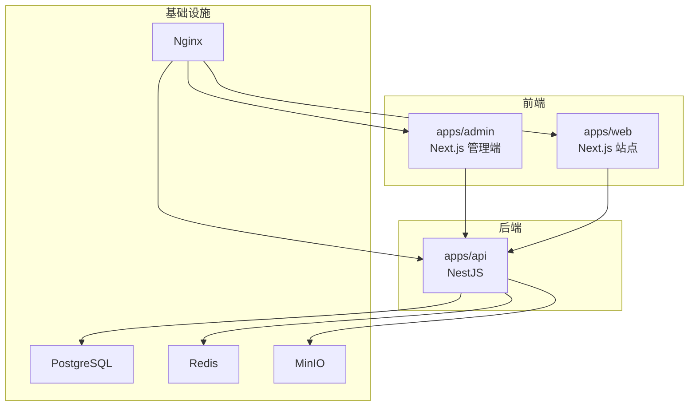
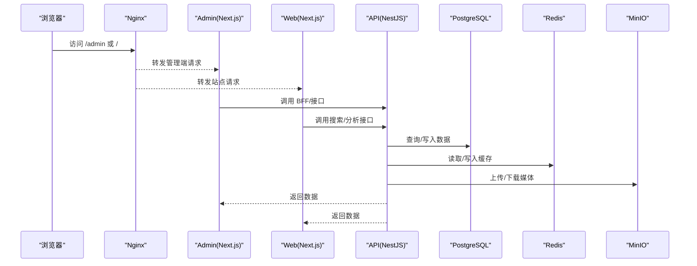
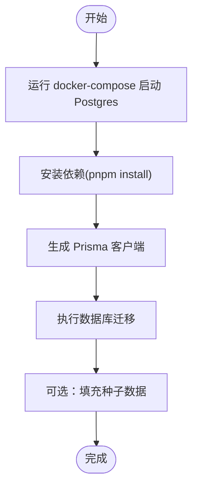
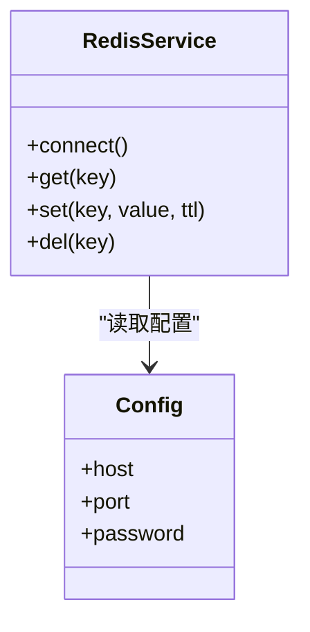
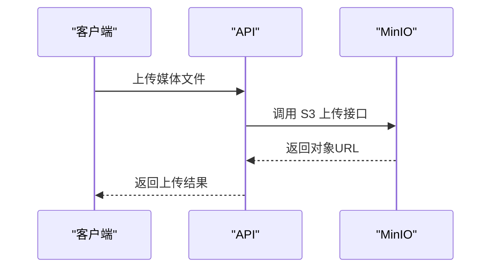
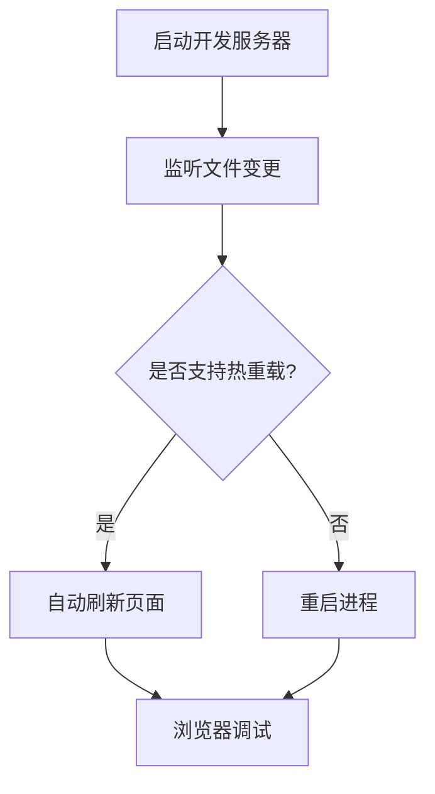
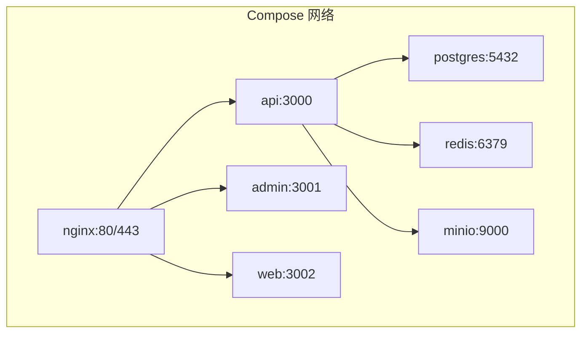
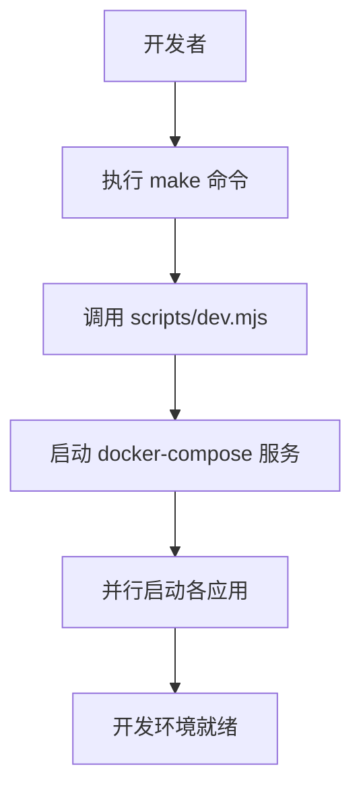
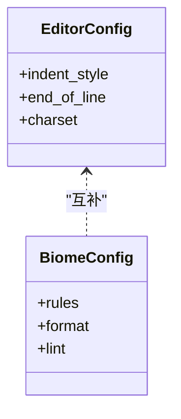
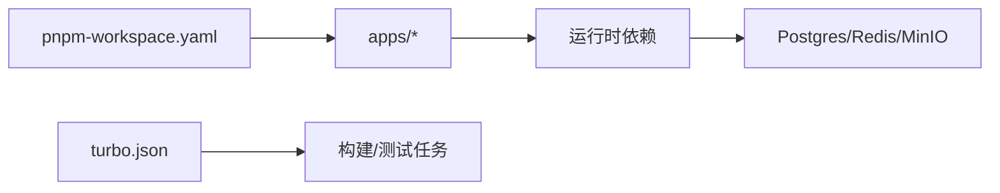

# 本地开发环境搭建

<cite>
**本文引用的文件**   
- [package.json](file://package.json)
- [pnpm-workspace.yaml](file://pnpm-workspace.yaml)
- [turbo.json](file://turbo.json)
- [.npmrc](file://.npmrc)
- [Makefile](file://Makefile)
- [scripts/dev.mjs](file://scripts/dev.mjs)
- [apps/api/package.json](file://apps/api/package.json)
- [apps/api/src/main.ts](file://apps/api/src/main.ts)
- [apps/api/src/app.module.ts](file://apps/api/src/app.module.ts)
- [apps/api/prisma/schema.prisma](file://apps/api/prisma/schema.prisma)
- [apps/api/Dockerfile](file://apps/api/Dockerfile)
- [apps/admin/package.json](file://apps/admin/package.json)
- [apps/admin/next.config.ts](file://apps/admin/next.config.ts)
- [apps/admin/Dockerfile](file://apps/admin/Dockerfile)
- [apps/web/package.json](file://apps/web/package.json)
- [apps/web/next.config.ts](file://apps/web/next.config.ts)
- [apps/web/Dockerfile](file://apps/web/Dockerfile)
- [infra/docker/docker-compose.dev.yml](file://infra/docker/docker-compose.dev.yml)
- [infra/docker/postgres/init.sql](file://infra/docker/postgres/init.sql)
- [infra/docker/redis/redis.conf](file://infra/docker/redis/redis.conf)
- [infra/docker/minio/cors.xml](file://infra/docker/minio/cors.xml)
- [infra/docker/nginx/tzj.conf](file://infra/docker/nginx/tzj.conf)
- [infra/docker/nginx/tzj-bootstrap.conf](file://infra/docker/nginx/tzj-bootstrap.conf)
- [infra/docker/deploy-local.sh](file://infra/docker/deploy-local.sh)
- [infra/docker/setup-docker-mirror.sh](file://infra/docker/setup-docker-mirror.sh)
- [biome.json](file://biome.json)
- [.editorconfig](file://.editorconfig)
</cite>

## 目录
1. [简介](#简介)
2. [项目结构](#项目结构)
3. [核心组件](#核心组件)
4. [架构总览](#架构总览)
5. [详细组件分析](#详细组件分析)
6. [依赖关系分析](#依赖关系分析)
7. [性能考虑](#性能考虑)
8. [故障排除指南](#故障排除指南)
9. [结论](#结论)
10. [附录](#附录)

## 简介
本文件面向本地开发与团队协作，提供从零到一的完整环境搭建指南。内容涵盖：
- 开发环境与依赖安装（Node、pnpm、Docker）
- 数据库初始化（PostgreSQL + Prisma）
- Redis 缓存服务配置与连接
- MinIO 对象存储配置与跨域设置
- 热重载与调试工具使用
- Docker Compose 开发环境、端口映射与服务发现
- 常用开发命令、快捷脚本
- IDE 配置、代码规范与协作最佳实践

## 项目结构
本项目采用多应用（Monorepo）结构，包含：
- apps/api：NestJS 后端服务，负责业务逻辑、鉴权、媒体存储、聊天等
- apps/admin：Next.js 管理后台，通过 BFF 代理调用 API
- apps/web：Next.js 对外站点，支持多语言与搜索
- infra/docker：Docker 相关配置（Compose、Nginx、Redis、MinIO、Postgres）
- scripts：通用脚本（如 dev.mjs）
- 根级包管理与构建配置（pnpm、Turbo、Biome、EditorConfig）

**图表来源**
- [apps/admin/package.json](file://apps/admin/package.json)
- [apps/web/package.json](file://apps/web/package.json)
- [apps/api/package.json](file://apps/api/package.json)
- [infra/docker/docker-compose.dev.yml](file://infra/docker/docker-compose.dev.yml)

**章节来源**
- [package.json](file://package.json)
- [pnpm-workspace.yaml](file://pnpm-workspace.yaml)
- [turbo.json](file://turbo.json)

## 核心组件
- 包管理器与工作区
  - pnpm workspace 统一依赖与脚本
  - Turbo 加速构建与任务编排
- 应用层
  - NestJS API：模块化架构，Prisma ORM，JWT 鉴权，S3/MinIO 存储，WebSocket 聊天
  - Next.js Admin/Web：SSR/CSR 混合，BFF 代理，国际化，媒体处理
- 基础设施
  - PostgreSQL：数据持久化
  - Redis：缓存与会话
  - MinIO：对象存储（兼容 S3）
  - Nginx：反向代理与静态资源分发

**章节来源**
- [apps/api/src/app.module.ts](file://apps/api/src/app.module.ts)
- [apps/api/src/main.ts](file://apps/api/src/main.ts)
- [apps/admin/next.config.ts](file://apps/admin/next.config.ts)
- [apps/web/next.config.ts](file://apps/web/next.config.ts)

## 架构总览
下图展示本地开发环境的请求路径与组件交互：浏览器通过 Nginx 访问前端，前端通过 BFF/代理访问 API；API 读写数据库、缓存与对象存储。

**图表来源**
- [infra/docker/nginx/tzj.conf](file://infra/docker/nginx/tzj.conf)
- [apps/admin/next.config.ts](file://apps/admin/next.config.ts)
- [apps/web/next.config.ts](file://apps/web/next.config.ts)
- [apps/api/src/main.ts](file://apps/api/src/main.ts)
- [infra/docker/docker-compose.dev.yml](file://infra/docker/docker-compose.dev.yml)

## 详细组件分析

### 开发环境与依赖安装
- Node.js 与 pnpm
  - 使用 pnpm 作为包管理器，工作区由 pnpm-workspace.yaml 定义
  - 根 package.json 中集中定义脚本与依赖版本
- Docker 与镜像加速
  - 提供 setup-docker-mirror.sh 用于配置镜像源
  - 推荐使用 Docker Desktop 并开启 Linux 容器

**章节来源**
- [pnpm-workspace.yaml](file://pnpm-workspace.yaml)
- [package.json](file://package.json)
- [infra/docker/setup-docker-mirror.sh](file://infra/docker/setup-docker-mirror.sh)

### 数据库初始化（PostgreSQL + Prisma）
- 启动 Postgres 容器
  - 使用 docker-compose.dev.yml 中的 postgres 服务
  - 初始化脚本位于 infra/docker/postgres/init.sql
- 生成与迁移
  - 在 apps/api 中使用 Prisma CLI 生成客户端与执行迁移
  - schema.prisma 定义数据模型

**图表来源**
- [infra/docker/docker-compose.dev.yml](file://infra/docker/docker-compose.dev.yml)
- [infra/docker/postgres/init.sql](file://infra/docker/postgres/init.sql)
- [apps/api/prisma/schema.prisma](file://apps/api/prisma/schema.prisma)

**章节来源**
- [apps/api/prisma/schema.prisma](file://apps/api/prisma/schema.prisma)
- [infra/docker/postgres/init.sql](file://infra/docker/postgres/init.sql)

### Redis 缓存服务配置
- 启动 Redis 容器
  - 使用 docker-compose.dev.yml 中的 redis 服务
  - 自定义配置位于 infra/docker/redis/redis.conf
- 连接方式
  - API 通过环境变量或配置文件连接 Redis（主机名通常为 redis，端口默认 6379）

**图表来源**
- [infra/docker/redis/redis.conf](file://infra/docker/redis/redis.conf)
- [infra/docker/docker-compose.dev.yml](file://infra/docker/docker-compose.dev.yml)

**章节来源**
- [infra/docker/redis/redis.conf](file://infra/docker/redis/redis.conf)
- [infra/docker/docker-compose.dev.yml](file://infra/docker/docker-compose.dev.yml)

### MinIO 对象存储配置
- 启动 MinIO 容器
  - 使用 docker-compose.dev.yml 中的 minio 服务
  - CORS 规则位于 infra/docker/minio/cors.xml
- 连接方式
  - API 通过 S3 兼容 SDK 连接 MinIO（主机名通常为 minio，端口 9000）
  - 前端媒体 URL 需指向 MinIO 的公开地址或通过 Nginx 代理

**图表来源**
- [infra/docker/docker-compose.dev.yml](file://infra/docker/docker-compose.dev.yml)
- [infra/docker/minio/cors.xml](file://infra/docker/minio/cors.xml)

**章节来源**
- [infra/docker/minio/cors.xml](file://infra/docker/minio/cors.xml)
- [infra/docker/docker-compose.dev.yml](file://infra/docker/docker-compose.dev.yml)

### 热重载与调试
- 前端（Next.js）
  - 开发模式启用热重载，修改代码即时刷新
  - 可通过浏览器开发者工具调试网络与状态
- 后端（NestJS）
  - 使用 ts-node-dev 或 nodemon 实现热重载
  - 集成 VS Code 调试配置（launch.json）进行断点调试

**图表来源**
- [apps/admin/next.config.ts](file://apps/admin/next.config.ts)
- [apps/web/next.config.ts](file://apps/web/next.config.ts)
- [apps/api/package.json](file://apps/api/package.json)

**章节来源**
- [apps/admin/next.config.ts](file://apps/admin/next.config.ts)
- [apps/web/next.config.ts](file://apps/web/next.config.ts)
- [apps/api/package.json](file://apps/api/package.json)

### Docker Compose 开发环境
- 服务清单
  - api、admin、web、postgres、redis、minio、nginx
- 端口映射
  - Nginx 暴露 80/443，API 内部端口，前端开发端口
- 服务发现
  - 容器间通过服务名互相访问（如 api、redis、minio）

**图表来源**
- [infra/docker/docker-compose.dev.yml](file://infra/docker/docker-compose.dev.yml)
- [infra/docker/nginx/tzj.conf](file://infra/docker/nginx/tzj.conf)

**章节来源**
- [infra/docker/docker-compose.dev.yml](file://infra/docker/docker-compose.dev.yml)
- [infra/docker/nginx/tzj.conf](file://infra/docker/nginx/tzj.conf)

### 常用开发命令与脚本
- 根级脚本
  - Makefile 提供一键启动、停止、日志查看等命令
  - scripts/dev.mjs 为统一开发入口
- 应用级脚本
  - apps/*/package.json 中定义各自开发、构建、测试命令

**图表来源**
- [Makefile](file://Makefile)
- [scripts/dev.mjs](file://scripts/dev.mjs)

**章节来源**
- [Makefile](file://Makefile)
- [scripts/dev.mjs](file://scripts/dev.mjs)
- [apps/api/package.json](file://apps/api/package.json)
- [apps/admin/package.json](file://apps/admin/package.json)
- [apps/web/package.json](file://apps/web/package.json)

### IDE 配置与代码规范
- 编辑器配置
  - .editorconfig 统一缩进、换行、编码等
  - 推荐 VS Code，安装 TypeScript、ESLint、Prettier、Biome 插件
- 代码规范
  - biome.json 定义 lint/format 规则
  - 提交前运行格式化与检查

**图表来源**
- [.editorconfig](file://.editorconfig)
- [biome.json](file://biome.json)

**章节来源**
- [.editorconfig](file://.editorconfig)
- [biome.json](file://biome.json)

### 团队协作开发最佳实践
- 分支策略
  - 功能分支开发，合并至主分支前通过 CI 检查
- 依赖管理
  - 使用 pnpm 锁定依赖版本，避免冲突
- 文档与注释
  - 关键模块添加注释，更新 README 与变更记录

[本节为概念性内容，不直接分析具体文件]

## 依赖关系分析
- 包管理
  - pnpm workspace 统一管理多应用依赖
  - turbo.json 定义任务图与缓存策略
- 运行时依赖
  - API 依赖数据库、缓存、对象存储
  - 前端依赖后端 API 与静态资源

**图表来源**
- [pnpm-workspace.yaml](file://pnpm-workspace.yaml)
- [turbo.json](file://turbo.json)

**章节来源**
- [pnpm-workspace.yaml](file://pnpm-workspace.yaml)
- [turbo.json](file://turbo.json)

## 性能考虑
- 构建优化
  - 使用 Turbo 缓存与并行构建
  - Next.js 启用增量构建与代码分割
- 运行时优化
  - 数据库索引与查询优化
  - Redis 缓存热点数据
  - MinIO 分片上传与大文件优化

[本节为通用指导，不直接分析具体文件]

## 故障排除指南
- 常见端口冲突
  - 检查 docker-compose 端口映射，避免与宿主机冲突
- 数据库连接失败
  - 确认 Postgres 容器运行正常，环境变量正确
- Redis 连接超时
  - 检查防火墙与容器网络连通性
- MinIO 上传失败
  - 验证 CORS 配置与访问密钥
- 前端代理错误
  - 检查 Next.js 代理配置与 API 地址

**章节来源**
- [infra/docker/docker-compose.dev.yml](file://infra/docker/docker-compose.dev.yml)
- [apps/admin/next.config.ts](file://apps/admin/next.config.ts)
- [apps/web/next.config.ts](file://apps/web/next.config.ts)

## 结论
通过本指南，您可以快速搭建完整的本地开发环境，包括依赖安装、数据库初始化、缓存与对象存储配置、热重载与调试、Docker Compose 编排以及团队协作最佳实践。建议结合 CI/CD 流程确保环境一致性。

[本节为总结性内容，不直接分析具体文件]

## 附录
- 参考命令
  - 启动开发环境：make dev
  - 停止服务：make down
  - 查看日志：make logs
  - 进入容器：make shell
- 环境变量模板
  - 复制 .env.example 为 .env 并填写必要参数

[本节为补充信息，不直接分析具体文件]