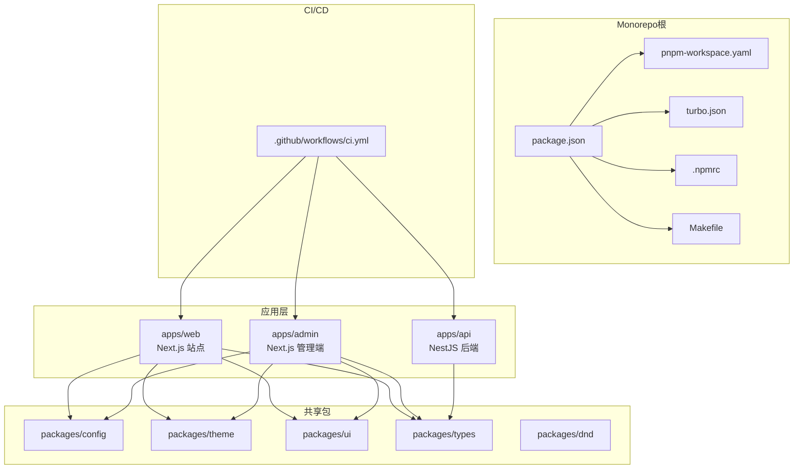
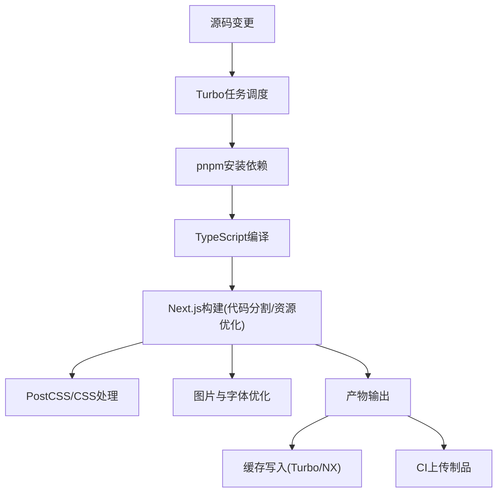
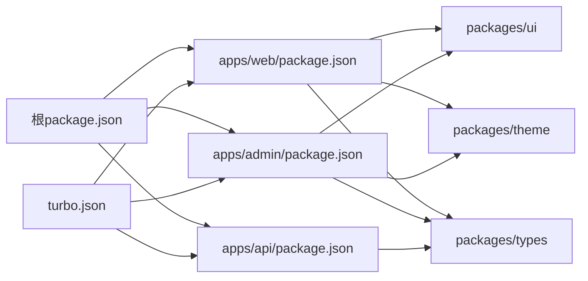

# 构建优化与打包

<cite>
**本文引用的文件**   
- [package.json](file://package.json)
- [pnpm-workspace.yaml](file://pnpm-workspace.yaml)
- [turbo.json](file://turbo.json)
- [tsconfig.base.json](file://tsconfig.base.json)
- [apps/web/next.config.ts](file://apps/web/next.config.ts)
- [apps/web/postcss.config.mjs](file://apps/web/postcss.config.mjs)
- [apps/web/tsconfig.json](file://apps/web/tsconfig.json)
- [apps/admin/next.config.ts](file://apps/admin/next.config.ts)
- [apps/admin/postcss.config.mjs](file://apps/admin/postcss.config.mjs)
- [apps/admin/tsconfig.json](file://apps/admin/tsconfig.json)
- [apps/api/nest-cli.json](file://apps/api/nest-cli.json)
- [apps/api/tsconfig.build.json](file://apps/api/tsconfig.build.json)
- [apps/api/tsconfig.json](file://apps/api/tsconfig.json)
- [.github/workflows/ci.yml](file://.github/workflows/ci.yml)
- [.npmrc](file://.npmrc)
- [Makefile](file://Makefile)
</cite>

## 目录
1. [简介](#简介)
2. [项目结构](#项目结构)
3. [核心组件](#核心组件)
4. [架构总览](#架构总览)
5. [详细组件分析](#详细组件分析)
6. [依赖关系分析](#依赖关系分析)
7. [性能考量](#性能考量)
8. [故障排查指南](#故障排查指南)
9. [结论](#结论)
10. [附录](#附录)

## 简介
本文件面向Next.js Monorepo的构建优化与打包，覆盖以下主题：
- Next.js构建配置、代码分割策略、资源优化与缓存机制
- Monorepo依赖管理、工作空间配置与并行构建
- TypeScript编译优化、CSS处理、图片优化与字体加载策略
- 构建产物分析、Bundle大小分析与性能指标监控
- 增量构建、缓存策略与CI环境下的构建加速技巧

## 项目结构
本项目采用Monorepo组织方式，包含多个应用与共享包：
- apps/web：面向用户的Next.js站点（国际化、搜索、内容展示等）
- apps/admin：后台管理Next.js应用（BFF、媒体、权限等）
- apps/api：NestJS后端服务（业务API、鉴权、存储、通知等）
- packages：共享包（配置、主题、UI、类型等）
- infra：部署与基础设施（Docker、Nginx、K8s等）
- .github/workflows：CI/CD流水线
- turbo：任务编排与缓存
- pnpm-workspace：工作区与依赖管理

图表来源
- [package.json](file://package.json)
- [pnpm-workspace.yaml](file://pnpm-workspace.yaml)
- [turbo.json](file://turbo.json)
- [.github/workflows/ci.yml](file://.github/workflows/ci.yml)

章节来源
- [package.json](file://package.json)
- [pnpm-workspace.yaml](file://pnpm-workspace.yaml)
- [turbo.json](file://turbo.json)

## 核心组件
- 工作区与依赖管理
  - pnpm-workspace定义多包工作区，统一依赖解析与安装
  - .npmrc配置镜像源与缓存行为，提升安装速度
  - package.json集中脚本入口，便于跨包调用
- 任务编排与缓存
  - turbo.json定义任务图、依赖关系与缓存键策略
  - Makefile封装常用命令，简化本地与CI执行
- TypeScript编译
  - tsconfig.base.json提供基础编译选项
  - 各应用独立tsconfig.json继承基础配置
- Next.js构建配置
  - apps/web/next.config.ts与apps/admin/next.config.ts分别配置站点与管理端
  - PostCSS与Tailwind在postcss.config.mjs中启用
- NestJS构建
  - nest-cli.json与tsconfig.build.json控制后端构建输出

章节来源
- [pnpm-workspace.yaml](file://pnpm-workspace.yaml)
- [.npmrc](file://.npmrc)
- [package.json](file://package.json)
- [turbo.json](file://turbo.json)
- [tsconfig.base.json](file://tsconfig.base.json)
- [apps/web/next.config.ts](file://apps/web/next.config.ts)
- [apps/admin/next.config.ts](file://apps/admin/next.config.ts)
- [apps/web/postcss.config.mjs](file://apps/web/postcss.config.mjs)
- [apps/admin/postcss.config.mjs](file://apps/admin/postcss.config.mjs)
- [apps/api/nest-cli.json](file://apps/api/nest-cli.json)
- [apps/api/tsconfig.build.json](file://apps/api/tsconfig.build.json)

## 架构总览
下图展示了从源码到构建产物的关键流程，包括TypeScript编译、Next.js构建、资源优化与缓存。

图表来源
- [turbo.json](file://turbo.json)
- [apps/web/next.config.ts](file://apps/web/next.config.ts)
- [apps/admin/next.config.ts](file://apps/admin/next.config.ts)
- [apps/web/postcss.config.mjs](file://apps/web/postcss.config.mjs)
- [apps/admin/postcss.config.mjs](file://apps/admin/postcss.config.mjs)

## 详细组件分析

### Next.js构建配置与优化
- 代码分割策略
  - 使用动态导入与路由级拆分，减少首屏体积
  - 第三方库按需引入，避免全量打包
- 资源优化
  - 图片自动优化（格式转换、尺寸裁剪、懒加载）
  - 字体预加载与子集化，减少阻塞
  - 静态资源哈希与长缓存策略
- 缓存机制
  - 浏览器缓存头设置
  - CDN缓存与版本化发布
- 构建产物分析
  - 生成bundle分析报告，识别大依赖与重复模块
  - 通过Tree Shaking与Side Effects标记剔除无用代码

章节来源
- [apps/web/next.config.ts](file://apps/web/next.config.ts)
- [apps/admin/next.config.ts](file://apps/admin/next.config.ts)

### CSS处理与样式优化
- PostCSS与Tailwind集成
  - 启用PurgeCSS或等效工具，移除未使用的样式
  - 按需加载组件样式，降低CSS体积
- 样式隔离与复用
  - 组件级样式文件，避免全局污染
  - 共享主题变量与Token，保持一致性

章节来源
- [apps/web/postcss.config.mjs](file://apps/web/postcss.config.mjs)
- [apps/admin/postcss.config.mjs](file://apps/admin/postcss.config.mjs)

### TypeScript编译优化
- 基础配置
  - tsconfig.base.json定义严格模式、路径映射与模块解析
- 增量编译
  - 启用incremental与cache，缩短二次构建时间
- 类型检查与构建分离
  - 开发时仅类型检查，生产构建跳过冗余步骤

章节来源
- [tsconfig.base.json](file://tsconfig.base.json)
- [apps/web/tsconfig.json](file://apps/web/tsconfig.json)
- [apps/admin/tsconfig.json](file://apps/admin/tsconfig.json)

### NestJS后端构建
- 构建目标
  - 使用tsconfig.build.json限定编译范围，排除测试与文档
- 模块化输出
  - nest-cli.json配置输出目录与监听文件
- 依赖优化
  - 仅包含运行时依赖，减小镜像体积

章节来源
- [apps/api/nest-cli.json](file://apps/api/nest-cli.json)
- [apps/api/tsconfig.build.json](file://apps/api/tsconfig.build.json)
- [apps/api/tsconfig.json](file://apps/api/tsconfig.json)

### Monorepo依赖管理与并行构建
- 工作区配置
  - pnpm-workspace.yaml声明包依赖关系，支持Hoist与Symlink
- 任务编排
  - turbo.json定义任务依赖图，支持并行执行与缓存命中
- 脚本入口
  - package.json集中定义build/dev/test等命令，便于跨包调用

章节来源
- [pnpm-workspace.yaml](file://pnpm-workspace.yaml)
- [turbo.json](file://turbo.json)
- [package.json](file://package.json)

### CI环境与构建加速
- 缓存策略
  - 缓存node_modules与构建产物，减少重复安装与编译
- 并行执行
  - 利用Turbo并行构建多个应用与包
- 制品上传
  - 将构建产物上传至对象存储或CDN，供部署使用

章节来源
- [.github/workflows/ci.yml](file://.github/workflows/ci.yml)
- [turbo.json](file://turbo.json)

## 依赖关系分析
下图展示了Monorepo中各包的依赖关系与构建顺序。

图表来源
- [package.json](file://package.json)
- [turbo.json](file://turbo.json)

章节来源
- [package.json](file://package.json)
- [turbo.json](file://turbo.json)

## 性能考量
- 构建时间优化
  - 启用增量构建与缓存，避免重复工作
  - 并行执行任务，充分利用CPU资源
- Bundle大小优化
  - 动态导入与路由级拆分
  - 第三方库按需引入与Tree Shaking
- 运行时性能
  - 图片懒加载与自适应格式
  - 字体子集化与预加载
  - CSS精简与按需加载

## 故障排查指南
- 构建失败
  - 检查TypeScript类型错误与路径映射
  - 确认依赖版本一致性与工作区链接
- 构建缓慢
  - 验证缓存是否命中，清理无效缓存
  - 分析依赖树，移除未使用包
- 产物异常
  - 检查Next.js配置中的路径与别名
  - 确认静态资源路径与CDN配置

## 结论
通过合理的Monorepo架构、Next.js构建优化与CI缓存策略，可显著提升构建效率与运行性能。建议持续监控Bundle大小与构建时间，结合代码分割与资源优化，保持产品体验与开发效率的平衡。

## 附录
- 常用命令
  - 本地开发：启动各应用并监听变更
  - 构建产物：并行构建所有应用与包
  - 分析Bundle：生成报告并定位大依赖
- 最佳实践
  - 优先使用框架内置优化能力
  - 定期审查依赖与构建配置
  - 在CI中启用缓存与并行构建