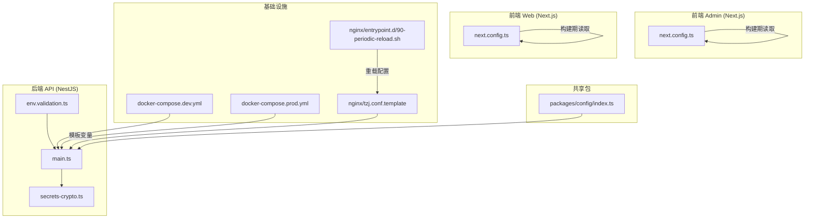
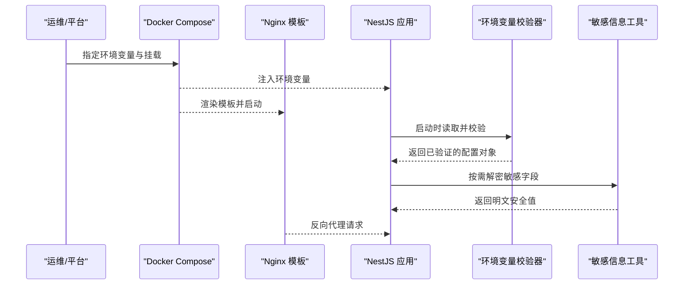
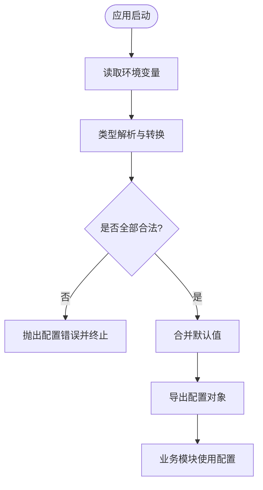
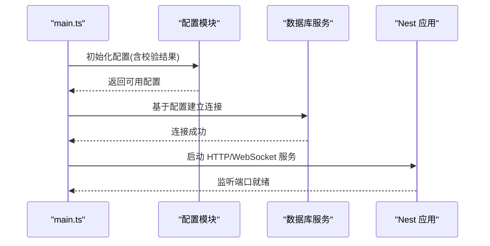
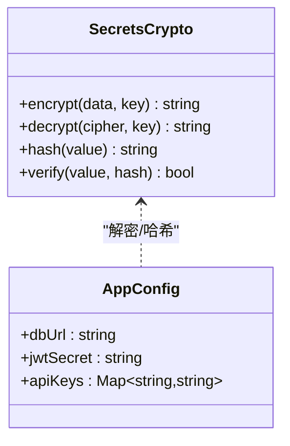
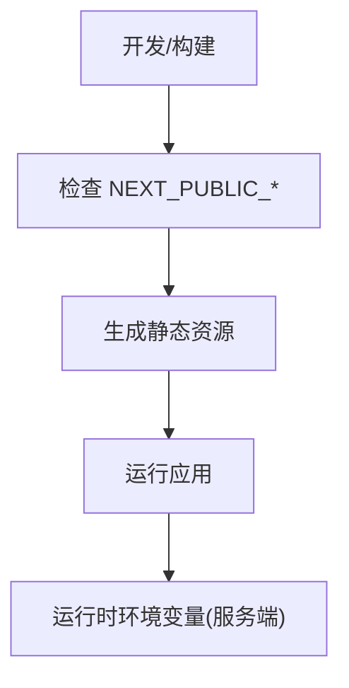
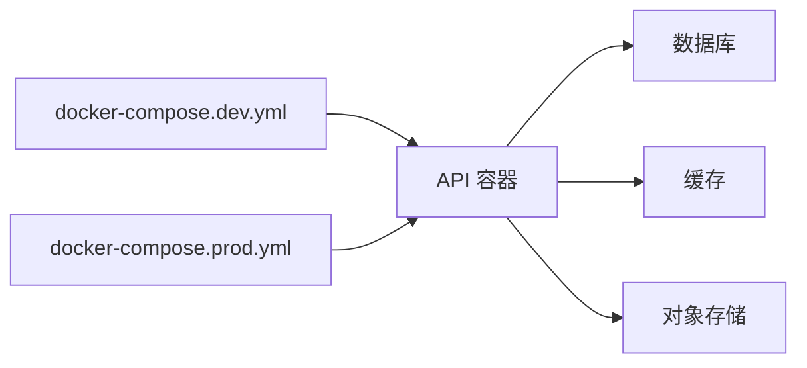
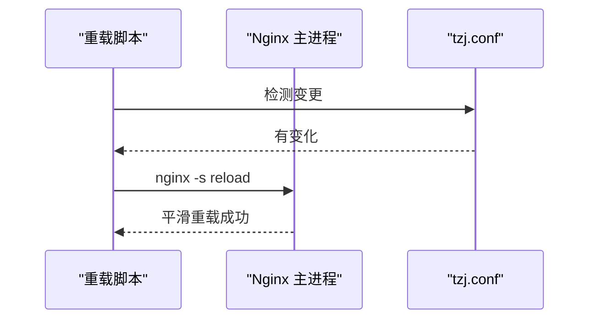
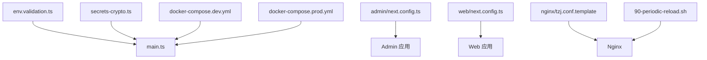
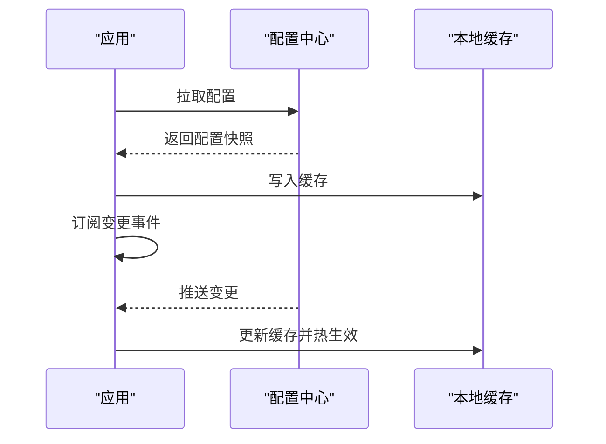

# 环境变量与配置管理

<cite>
**本文引用的文件**   
- [apps/api/src/config/env.validation.ts](file://apps/api/src/config/env.validation.ts)
- [apps/api/src/main.ts](file://apps/api/src/main.ts)
- [apps/api/Dockerfile](file://apps/api/Dockerfile)
- [apps/admin/next.config.ts](file://apps/admin/next.config.ts)
- [apps/web/next.config.ts](file://apps/web/next.config.ts)
- [infra/docker/docker-compose.dev.yml](file://infra/docker/docker-compose.dev.yml)
- [infra/docker/docker-compose.prod.yml](file://infra/docker/docker-compose.prod.yml)
- [infra/docker/nginx/tzj.conf.template](file://infra/docker/nginx/tzj.conf.template)
- [infra/docker/nginx/entrypoint.d/90-periodic-reload.sh](file://infra/docker/nginx/entrypoint.d/90-periodic-reload.sh)
- [packages/config/index.ts](file://packages/config/index.ts)
- [apps/api/src/common/crypto/secrets-crypto.ts](file://apps/api/src/common/crypto/secrets-crypto.ts)
</cite>

## 目录
1. [简介](#简介)
2. [项目结构](#项目结构)
3. [核心组件](#核心组件)
4. [架构总览](#架构总览)
5. [详细组件分析](#详细组件分析)
6. [依赖关系分析](#依赖关系分析)
7. [性能考量](#性能考量)
8. [故障排查指南](#故障排查指南)
9. [结论](#结论)
10. [附录](#附录)

## 简介
本文件系统化梳理本项目的环境变量与配置管理机制，覆盖后端 NestJS、前端 Next.js（admin 与 web）、Docker 编排与 Nginx 模板。重点说明：
- 各应用的环境变量来源、类型校验与默认值策略
- 开发、测试、生产环境的差异化配置
- 敏感信息保护与热更新机制
- 环境变量优先级、继承与动态加载
- 配置验证、错误处理与调试技巧
- Docker 注入、Kubernetes ConfigMap 集成思路与配置中心对接方案

## 项目结构
围绕配置与环境变量的关键位置如下：
- 后端（NestJS）
  - 环境变量校验与启动入口
  - 敏感信息加解密工具
- 前端（Next.js）
  - 构建期与运行期环境变量使用
- 基础设施
  - Docker Compose 环境差异
  - Nginx 模板与运行时重载
- 共享包
  - 统一配置导出（如存在）

图表来源
- [apps/api/src/config/env.validation.ts](file://apps/api/src/config/env.validation.ts)
- [apps/api/src/main.ts](file://apps/api/src/main.ts)
- [apps/api/src/common/crypto/secrets-crypto.ts](file://apps/api/src/common/crypto/secrets-crypto.ts)
- [apps/admin/next.config.ts](file://apps/admin/next.config.ts)
- [apps/web/next.config.ts](file://apps/web/next.config.ts)
- [infra/docker/docker-compose.dev.yml](file://infra/docker/docker-compose.dev.yml)
- [infra/docker/docker-compose.prod.yml](file://infra/docker/docker-compose.prod.yml)
- [infra/docker/nginx/tzj.conf.template](file://infra/docker/nginx/tzj.conf.template)
- [infra/docker/nginx/entrypoint.d/90-periodic-reload.sh](file://infra/docker/nginx/entrypoint.d/90-periodic-reload.sh)
- [packages/config/index.ts](file://packages/config/index.ts)

章节来源
- [apps/api/src/config/env.validation.ts](file://apps/api/src/config/env.validation.ts)
- [apps/api/src/main.ts](file://apps/api/src/main.ts)
- [apps/admin/next.config.ts](file://apps/admin/next.config.ts)
- [apps/web/next.config.ts](file://apps/web/next.config.ts)
- [infra/docker/docker-compose.dev.yml](file://infra/docker/docker-compose.dev.yml)
- [infra/docker/docker-compose.prod.yml](file://infra/docker/docker-compose.prod.yml)
- [infra/docker/nginx/tzj.conf.template](file://infra/docker/nginx/tzj.conf.template)
- [infra/docker/nginx/entrypoint.d/90-periodic-reload.sh](file://infra/docker/nginx/entrypoint.d/90-periodic-reload.sh)
- [packages/config/index.ts](file://packages/config/index.ts)

## 核心组件
- 环境变量校验器（后端）
  - 负责在进程启动时读取并严格校验必需的环境变量，提供类型转换与缺失报错
- 启动引导（后端）
  - 初始化配置模块、注册全局中间件/拦截器、加载数据库连接等
- 敏感信息工具（后端）
  - 提供密钥管理与数据加/解密能力，避免明文泄露
- 前端构建配置（Next.js）
  - 通过 NEXT_PUBLIC_* 暴露给客户端；其他变量仅用于服务端构建或 API 调用
- 容器编排（Docker Compose）
  - 按环境注入不同变量集，区分开发/生产
- Nginx 模板与重载
  - 模板化站点配置，支持运行时重载以生效新配置

章节来源
- [apps/api/src/config/env.validation.ts](file://apps/api/src/config/env.validation.ts)
- [apps/api/src/main.ts](file://apps/api/src/main.ts)
- [apps/api/src/common/crypto/secrets-crypto.ts](file://apps/api/src/common/crypto/secrets-crypto.ts)
- [apps/admin/next.config.ts](file://apps/admin/next.config.ts)
- [apps/web/next.config.ts](file://apps/web/next.config.ts)
- [infra/docker/docker-compose.dev.yml](file://infra/docker/docker-compose.dev.yml)
- [infra/docker/docker-compose.prod.yml](file://infra/docker/docker-compose.prod.yml)
- [infra/docker/nginx/tzj.conf.template](file://infra/docker/nginx/tzj.conf.template)
- [infra/docker/nginx/entrypoint.d/90-periodic-reload.sh](file://infra/docker/nginx/entrypoint.d/90-periodic-reload.sh)

## 架构总览
下图展示从容器到应用的配置加载顺序与职责边界：

图表来源
- [infra/docker/docker-compose.dev.yml](file://infra/docker/docker-compose.dev.yml)
- [infra/docker/docker-compose.prod.yml](file://infra/docker/docker-compose.prod.yml)
- [infra/docker/nginx/tzj.conf.template](file://infra/docker/nginx/tzj.conf.template)
- [apps/api/src/config/env.validation.ts](file://apps/api/src/config/env.validation.ts)
- [apps/api/src/main.ts](file://apps/api/src/main.ts)
- [apps/api/src/common/crypto/secrets-crypto.ts](file://apps/api/src/common/crypto/secrets-crypto.ts)

## 详细组件分析

### 后端环境变量校验与默认值
- 启动阶段集中读取环境变量，进行类型转换与必填校验
- 对布尔、数字、URL、数组等常见类型提供解析与校验
- 缺失或类型不匹配时抛出明确错误，便于快速定位问题
- 建议将默认值集中在一个地方，并通过校验器合并

图表来源
- [apps/api/src/config/env.validation.ts](file://apps/api/src/config/env.validation.ts)

章节来源
- [apps/api/src/config/env.validation.ts](file://apps/api/src/config/env.validation.ts)

### 后端启动引导与配置装配
- 在 main.ts 中完成配置模块的初始化与全局装配
- 确保所有依赖配置的模块在启动后均可访问一致的配置视图
- 结合健康检查与日志输出，便于观察配置加载结果

图表来源
- [apps/api/src/main.ts](file://apps/api/src/main.ts)

章节来源
- [apps/api/src/main.ts](file://apps/api/src/main.ts)

### 敏感信息保护与加解密
- 对密钥、令牌、连接串等敏感字段采用加密存储或注入
- 应用内通过工具函数进行解密，避免明文落盘或进入日志
- 建议配合外部密钥管理服务（如 KMS/Secrets Manager）

图表来源
- [apps/api/src/common/crypto/secrets-crypto.ts](file://apps/api/src/common/crypto/secrets-crypto.ts)

章节来源
- [apps/api/src/common/crypto/secrets-crypto.ts](file://apps/api/src/common/crypto/secrets-crypto.ts)

### 前端环境变量与构建期注入
- Next.js 使用 NEXT_PUBLIC_* 前缀暴露给浏览器端
- 非公共变量仅在后端构建或 API 调用中使用，不会打包进客户端
- 建议在 next.config.ts 中集中声明与校验必要的前端变量

图表来源
- [apps/admin/next.config.ts](file://apps/admin/next.config.ts)
- [apps/web/next.config.ts](file://apps/web/next.config.ts)

章节来源
- [apps/admin/next.config.ts](file://apps/admin/next.config.ts)
- [apps/web/next.config.ts](file://apps/web/next.config.ts)

### Docker 环境变量注入与环境差异
- docker-compose.dev.yml 与 docker-compose.prod.yml 分别定义开发与生产环境变量
- 通过环境变量覆盖数据库、缓存、第三方服务等连接信息
- 建议将敏感信息放入 .env 文件或平台密钥管理，不在仓库中硬编码

图表来源
- [infra/docker/docker-compose.dev.yml](file://infra/docker/docker-compose.dev.yml)
- [infra/docker/docker-compose.prod.yml](file://infra/docker/docker-compose.prod.yml)
- [apps/api/Dockerfile](file://apps/api/Dockerfile)

章节来源
- [infra/docker/docker-compose.dev.yml](file://infra/docker/docker-compose.dev.yml)
- [infra/docker/docker-compose.prod.yml](file://infra/docker/docker-compose.prod.yml)
- [apps/api/Dockerfile](file://apps/api/Dockerfile)

### Nginx 模板与配置热更新
- 使用模板文件渲染站点配置，支持根据环境变量替换域名、证书路径等
- 通过 entrypoint 脚本定时重载 Nginx，实现配置热更新而不重启容器

图表来源
- [infra/docker/nginx/tzj.conf.template](file://infra/docker/nginx/tzj.conf.template)
- [infra/docker/nginx/entrypoint.d/90-periodic-reload.sh](file://infra/docker/nginx/entrypoint.d/90-periodic-reload.sh)

章节来源
- [infra/docker/nginx/tzj.conf.template](file://infra/docker/nginx/tzj.conf.template)
- [infra/docker/nginx/entrypoint.d/90-periodic-reload.sh](file://infra/docker/nginx/entrypoint.d/90-periodic-reload.sh)

### 共享配置包（可选）
- packages/config/index.ts 可用于跨应用共享基础配置常量或类型定义
- 建议仅包含不可变、无敏感信息的通用配置

章节来源
- [packages/config/index.ts](file://packages/config/index.ts)

## 依赖关系分析
- 后端
  - env.validation.ts 被 main.ts 在启动时调用，形成强依赖
  - secrets-crypto.ts 被需要处理敏感数据的模块按需引入
- 前端
  - next.config.ts 决定构建期可访问的变量集合
- 基础设施
  - docker-compose.* 为容器注入环境变量
  - Nginx 模板与重载脚本共同保障配置热更新

图表来源
- [apps/api/src/config/env.validation.ts](file://apps/api/src/config/env.validation.ts)
- [apps/api/src/main.ts](file://apps/api/src/main.ts)
- [apps/api/src/common/crypto/secrets-crypto.ts](file://apps/api/src/common/crypto/secrets-crypto.ts)
- [apps/admin/next.config.ts](file://apps/admin/next.config.ts)
- [apps/web/next.config.ts](file://apps/web/next.config.ts)
- [infra/docker/docker-compose.dev.yml](file://infra/docker/docker-compose.dev.yml)
- [infra/docker/docker-compose.prod.yml](file://infra/docker/docker-compose.prod.yml)
- [infra/docker/nginx/tzj.conf.template](file://infra/docker/nginx/tzj.conf.template)
- [infra/docker/nginx/entrypoint.d/90-periodic-reload.sh](file://infra/docker/nginx/entrypoint.d/90-periodic-reload.sh)

章节来源
- [apps/api/src/config/env.validation.ts](file://apps/api/src/config/env.validation.ts)
- [apps/api/src/main.ts](file://apps/api/src/main.ts)
- [apps/api/src/common/crypto/secrets-crypto.ts](file://apps/api/src/common/crypto/secrets-crypto.ts)
- [apps/admin/next.config.ts](file://apps/admin/next.config.ts)
- [apps/web/next.config.ts](file://apps/web/next.config.ts)
- [infra/docker/docker-compose.dev.yml](file://infra/docker/docker-compose.dev.yml)
- [infra/docker/docker-compose.prod.yml](file://infra/docker/docker-compose.prod.yml)
- [infra/docker/nginx/tzj.conf.template](file://infra/docker/nginx/tzj.conf.template)
- [infra/docker/nginx/entrypoint.d/90-periodic-reload.sh](file://infra/docker/nginx/entrypoint.d/90-periodic-reload.sh)

## 性能考量
- 配置加载应在应用启动阶段一次性完成，避免重复 I/O
- 对大体积配置（如多租户规则）考虑懒加载与缓存
- Nginx 热重载应控制频率，避免频繁 reload 导致抖动
- 前端构建期变量不参与运行时解析，减少运行时开销

## 故障排查指南
- 启动失败且提示缺少环境变量
  - 检查 docker-compose.* 或平台注入的环境变量是否完整
  - 查看环境变量校验器的错误堆栈，确认键名与类型
- 运行时出现鉴权或连接失败
  - 核对敏感信息是否正确注入与解密
  - 检查证书路径、域名、端口等网络相关变量
- 前端页面无法访问某些功能
  - 确认 NEXT_PUBLIC_* 变量是否在构建期正确设置
  - 清理构建缓存并重新构建
- Nginx 配置未生效
  - 检查模板变量替换是否正确
  - 确认重载脚本是否执行成功

章节来源
- [apps/api/src/config/env.validation.ts](file://apps/api/src/config/env.validation.ts)
- [apps/api/src/common/crypto/secrets-crypto.ts](file://apps/api/src/common/crypto/secrets-crypto.ts)
- [infra/docker/nginx/tzj.conf.template](file://infra/docker/nginx/tzj.conf.template)
- [infra/docker/nginx/entrypoint.d/90-periodic-reload.sh](file://infra/docker/nginx/entrypoint.d/90-periodic-reload.sh)

## 结论
本项目通过“启动时集中校验 + 敏感信息工具 + 容器化注入 + 模板化 Nginx”的组合，实现了稳定、可审计、可扩展的配置管理体系。建议后续补充：
- 配置中心对接（如 Apollo/Nacos），实现动态配置与灰度发布
- Kubernetes ConfigMap/Secret 统一管理，提升多集群一致性
- 更完善的配置版本化与回滚策略

## 附录

### 环境变量优先级与继承机制（建议）
- 优先级从高到低：显式注入 > 平台密钥 > 环境特定 .env > 默认值
- 继承机制：子环境可继承父环境，再叠加覆盖
- 动态配置：通过配置中心拉取，应用内缓存并定期刷新

### Docker 环境变量注入要点
- 使用 docker-compose.* 的 environment 或 env_file
- 敏感信息通过平台 Secret 或外部密钥服务注入
- 镜像层不包含任何敏感信息

### Kubernetes ConfigMap 集成要点
- 将非敏感配置放入 ConfigMap，通过环境变量或卷挂载
- 将敏感信息放入 Secret，通过环境变量或卷挂载
- 使用滚动更新触发 Pod 重建以加载新配置

### 配置中心对接方案（示例流程）
