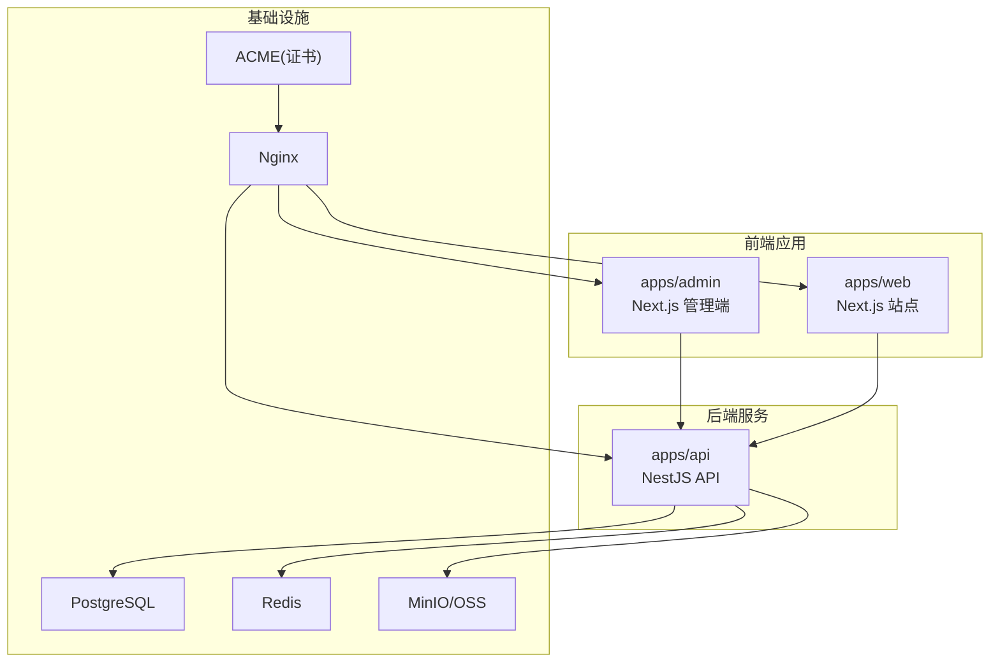
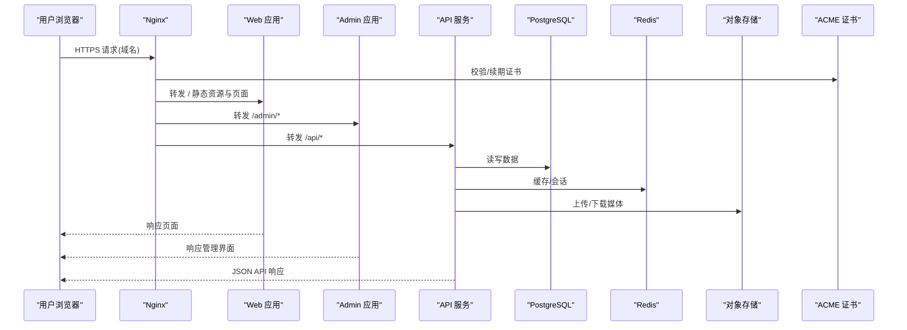
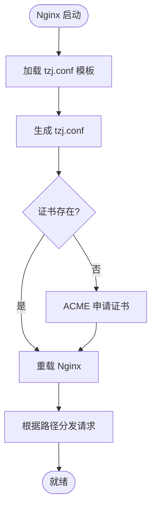
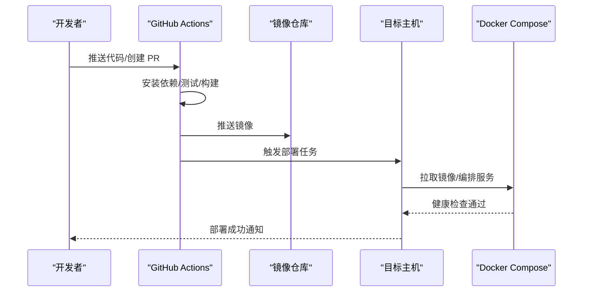
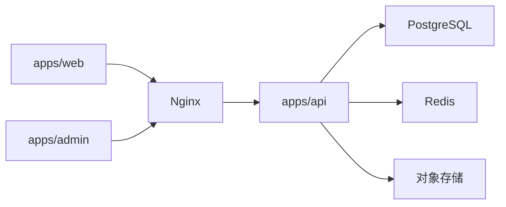

# 部署与构建

<cite>
**本文引用的文件**   
- [apps/admin/Dockerfile](file://apps/admin/Dockerfile)
- [apps/api/Dockerfile](file://apps/api/Dockerfile)
- [apps/web/Dockerfile](file://apps/web/Dockerfile)
- [infra/docker/docker-compose.dev.yml](file://infra/docker/docker-compose.dev.yml)
- [infra/docker/docker-compose.prod.yml](file://infra/docker/docker-compose.prod.yml)
- [infra/docker/nginx/tzj.conf](file://infra/docker/nginx/tzj.conf)
- [infra/docker/nginx/templates/tzj.conf.template](file://infra/docker/nginx/templates/tzj.conf.template)
- [infra/docker/nginx/snippets/proxy-docker.conf](file://infra/docker/nginx/snippets/proxy-docker.conf)
- [infra/docker/nginx/snippets/ssl.conf](file://infra/docker/nginx/snippets/ssl.conf)
- [infra/docker/acme/Dockerfile](file://infra/docker/acme/Dockerfile)
- [infra/docker/acme/deploy-cdn.sh](file://infra/docker/acme/deploy-cdn.sh)
- [infra/docker/acme/issue.sh](file://infra/docker/acme/issue.sh)
- [infra/docker/postgres/init.sql](file://infra/docker/postgres/init.sql)
- [infra/docker/redis/redis.conf](file://infra/docker/redis/redis.conf)
- [.github/workflows/ci.yml](file://.github/workflows/ci.yml)
- [.github/workflows/deploy.yml](file://.github/workflows/deploy.yml)
- [.github/workflows/deploy-ssh.yml](file://.github/workflows/deploy-ssh.yml)
- [Makefile](file://Makefile)
- [package.json](file://package.json)
- [turbo.json](file://turbo.json)
- [apps/api/src/config/env.validation.ts](file://apps/api/src/config/env.validation.ts)
- [apps/admin/next.config.ts](file://apps/admin/next.config.ts)
- [apps/web/next.config.ts](file://apps/web/next.config.ts)
</cite>

## 目录
1. [简介](#简介)
2. [项目结构](#项目结构)
3. [核心组件](#核心组件)
4. [架构总览](#架构总览)
5. [详细组件分析](#详细组件分析)
6. [依赖关系分析](#依赖关系分析)
7. [性能考虑](#性能考虑)
8. [故障排查指南](#故障排查指南)
9. [结论](#结论)
10. [附录](#附录)

## 简介
本文件面向生产与本地环境的部署与构建，覆盖以下主题：
- Docker 容器化与镜像构建优化
- Nginx 反向代理、SSL/TLS 证书管理与域名配置
- 环境变量管理、安全与多环境差异
- CI/CD 流水线、自动化部署与回滚策略
- 生产环境优化、日志收集、监控告警与故障恢复
- 本地开发环境搭建、热重载与调试技巧

## 项目结构
仓库采用多应用（admin、api、web）+ 基础设施（docker、nginx、acme、postgres、redis）的模块化组织。顶层 Makefile 与 pnpm/turbo 提供统一构建入口；GitHub Actions 负责 CI/CD；Docker Compose 编排本地与生产环境。

图表来源
- [apps/admin/Dockerfile](file://apps/admin/Dockerfile)
- [apps/web/Dockerfile](file://apps/web/Dockerfile)
- [apps/api/Dockerfile](file://apps/api/Dockerfile)
- [infra/docker/docker-compose.prod.yml](file://infra/docker/docker-compose.prod.yml)
- [infra/docker/nginx/tzj.conf](file://infra/docker/nginx/tzj.conf)
- [infra/docker/acme/Dockerfile](file://infra/docker/acme/Dockerfile)

章节来源
- [Makefile](file://Makefile)
- [package.json](file://package.json)
- [turbo.json](file://turbo.json)

## 核心组件
- 应用镜像
  - admin: Next.js 管理后台，静态资源与 SSR 产物由独立镜像承载
  - web: Next.js 站点，支持国际化与搜索等能力
  - api: NestJS 服务，数据库、缓存、对象存储、消息与鉴权等
- 基础设施
  - PostgreSQL: 持久化数据
  - Redis: 会话/缓存/限流
  - MinIO/OSS: 媒体与静态资源
  - Nginx: 反向代理、HTTPS、压缩、缓存
  - ACME: 自动签发与续期 TLS 证书
- 构建与发布
  - pnpm + Turbo 多包构建
  - GitHub Actions CI/CD
  - Docker Compose 编排

章节来源
- [apps/admin/Dockerfile](file://apps/admin/Dockerfile)
- [apps/web/Dockerfile](file://apps/web/Dockerfile)
- [apps/api/Dockerfile](file://apps/api/Dockerfile)
- [infra/docker/docker-compose.dev.yml](file://infra/docker/docker-compose.dev.yml)
- [infra/docker/docker-compose.prod.yml](file://infra/docker/docker-compose.prod.yml)

## 架构总览
下图展示请求从浏览器到各服务的完整路径，以及证书与域名流程。

图表来源
- [infra/docker/nginx/tzj.conf](file://infra/docker/nginx/tzj.conf)
- [infra/docker/nginx/templates/tzj.conf.template](file://infra/docker/nginx/templates/tzj.conf.template)
- [infra/docker/acme/Dockerfile](file://infra/docker/acme/Dockerfile)
- [apps/api/Dockerfile](file://apps/api/Dockerfile)
- [apps/web/Dockerfile](file://apps/web/Dockerfile)
- [apps/admin/Dockerfile](file://apps/admin/Dockerfile)

## 详细组件分析

### Docker 镜像与构建优化
- 多阶段构建
  - 使用 Node 基础镜像进行依赖安装与编译，最终产物仅包含运行所需文件，减小镜像体积
  - 分离依赖层与源码层，提升缓存命中率
- 环境变量注入
  - 通过构建参数与环境变量控制不同环境行为（如 API 地址、媒体源、功能开关）
- 运行时优化
  - 启用进程守护与健康检查
  - 限制内存/CPU，避免资源争用
  - 非 root 用户运行，提高安全性

章节来源
- [apps/admin/Dockerfile](file://apps/admin/Dockerfile)
- [apps/web/Dockerfile](file://apps/web/Dockerfile)
- [apps/api/Dockerfile](file://apps/api/Dockerfile)
- [apps/admin/next.config.ts](file://apps/admin/next.config.ts)
- [apps/web/next.config.ts](file://apps/web/next.config.ts)

### Nginx 反向代理与 SSL
- 路由规则
  - 将 / 与 /assets 等静态资源指向 Web 应用
  - 将 /admin 指向 Admin 应用
  - 将 /api 与 WebSocket 路径指向 API 服务
- 性能与安全
  - 开启 gzip/brotli、HTTP/2、缓存头、访问日志
  - 强制 HTTPS、HSTS、安全响应头
- 证书管理
  - 集成 ACME 自动申请与续期
  - 证书挂载至 Nginx，按域名动态加载

图表来源
- [infra/docker/nginx/tzj.conf](file://infra/docker/nginx/tzj.conf)
- [infra/docker/nginx/templates/tzj.conf.template](file://infra/docker/nginx/templates/tzj.conf.template)
- [infra/docker/nginx/snippets/proxy-docker.conf](file://infra/docker/nginx/snippets/proxy-docker.conf)
- [infra/docker/nginx/snippets/ssl.conf](file://infra/docker/nginx/snippets/ssl.conf)
- [infra/docker/acme/issue.sh](file://infra/docker/acme/issue.sh)
- [infra/docker/acme/deploy-cdn.sh](file://infra/docker/acme/deploy-cdn.sh)

章节来源
- [infra/docker/nginx/tzj.conf](file://infra/docker/nginx/tzj.conf)
- [infra/docker/nginx/templates/tzj.conf.template](file://infra/docker/nginx/templates/tzj.conf.template)
- [infra/docker/nginx/snippets/proxy-docker.conf](file://infra/docker/nginx/snippets/proxy-docker.conf)
- [infra/docker/nginx/snippets/ssl.conf](file://infra/docker/nginx/snippets/ssl.conf)
- [infra/docker/acme/Dockerfile](file://infra/docker/acme/Dockerfile)
- [infra/docker/acme/issue.sh](file://infra/docker/acme/issue.sh)
- [infra/docker/acme/deploy-cdn.sh](file://infra/docker/acme/deploy-cdn.sh)

### 环境变量管理
- 分层配置
  - 构建期环境变量用于决定构建产物与特性开关
  - 运行期环境变量用于连接数据库、缓存、对象存储、第三方服务
- 校验与默认值
  - API 服务在启动时校验关键环境变量，缺失则失败或回退
- 敏感信息
  - 密钥、令牌等通过 Secret 管理，不进入镜像与代码库

章节来源
- [apps/api/src/config/env.validation.ts](file://apps/api/src/config/env.validation.ts)
- [apps/admin/next.config.ts](file://apps/admin/next.config.ts)
- [apps/web/next.config.ts](file://apps/web/next.config.ts)

### CI/CD 流水线与自动化部署
- CI
  - 代码提交触发 lint、类型检查、单元测试与构建
  - 生成制品并推送镜像
- CD
  - 基于分支策略触发预发/生产部署
  - 滚动更新与健康检查，失败自动回滚
- SSH 部署
  - 通过 SSH 执行远程脚本完成拉取、构建与服务重启

图表来源
- [.github/workflows/ci.yml](file://.github/workflows/ci.yml)
- [.github/workflows/deploy.yml](file://.github/workflows/deploy.yml)
- [.github/workflows/deploy-ssh.yml](file://.github/workflows/deploy-ssh.yml)

章节来源
- [.github/workflows/ci.yml](file://.github/workflows/ci.yml)
- [.github/workflows/deploy.yml](file://.github/workflows/deploy.yml)
- [.github/workflows/deploy-ssh.yml](file://.github/workflows/deploy-ssh.yml)

### 本地开发与调试
- 一键启动
  - 使用 Compose 启动 Postgres、Redis、MinIO、Nginx、ACME 与应用
- 热重载
  - 源码变更自动重建/重启相关服务
- 调试技巧
  - 暴露调试端口、查看容器日志、模拟外部依赖

章节来源
- [infra/docker/docker-compose.dev.yml](file://infra/docker/docker-compose.dev.yml)
- [Makefile](file://Makefile)

### 生产环境编排与优化
- 资源限制
  - 为每个容器设置 CPU/内存上限，避免雪崩
- 高可用
  - 多副本部署、健康检查、优雅退出
- 存储与备份
  - 数据库定期备份、对象存储生命周期策略
- 日志与监控
  - 集中日志采集、指标上报、告警阈值

章节来源
- [infra/docker/docker-compose.prod.yml](file://infra/docker/docker-compose.prod.yml)
- [apps/api/Dockerfile](file://apps/api/Dockerfile)

## 依赖关系分析
- 应用间依赖
  - Web/Admin 通过 Nginx 反代访问 API
  - API 依赖数据库、缓存、对象存储
- 构建依赖
  - pnpm workspace + Turbo 并行构建
  - Docker 多阶段构建复用缓存

图表来源
- [apps/web/Dockerfile](file://apps/web/Dockerfile)
- [apps/admin/Dockerfile](file://apps/admin/Dockerfile)
- [apps/api/Dockerfile](file://apps/api/Dockerfile)
- [infra/docker/docker-compose.prod.yml](file://infra/docker/docker-compose.prod.yml)

章节来源
- [package.json](file://package.json)
- [turbo.json](file://turbo.json)
- [infra/docker/docker-compose.prod.yml](file://infra/docker/docker-compose.prod.yml)

## 性能考虑
- 构建优化
  - 利用 Turbo 并行与缓存，减少重复构建
  - 合理拆分依赖安装与源码拷贝顺序
- 运行时优化
  - 启用 HTTP/2、Gzip/Brotli、静态资源缓存
  - 数据库连接池、查询索引、慢查询分析
  - 缓存热点数据、CDN 加速静态资源
- 可观测性
  - 结构化日志、分布式追踪、APM 指标

[本节为通用指导，不直接分析具体文件]

## 故障排查指南
- 常见问题
  - 证书申请失败：检查 DNS 解析、ACME 网络连通性与域名验证
  - 反向代理 502/504：确认上游服务健康与超时配置
  - 数据库连接失败：核对连接串、权限与迁移状态
  - 镜像拉取失败：检查镜像仓库认证与网络
- 定位手段
  - 查看容器日志与 Nginx 访问/错误日志
  - 使用健康检查接口与探针
  - 逐步隔离问题域（网络、依赖、配置）

章节来源
- [infra/docker/nginx/tzj.conf](file://infra/docker/nginx/tzj.conf)
- [infra/docker/acme/issue.sh](file://infra/docker/acme/issue.sh)
- [apps/api/src/config/env.validation.ts](file://apps/api/src/config/env.validation.ts)

## 结论
本项目以多应用、多环境、容器化的方式实现端到端交付。通过 Nginx + ACME 提供安全的反向代理与证书管理，借助 CI/CD 实现自动化构建与部署，配合完善的监控与日志体系保障生产稳定性。建议在生产中持续完善健康检查、灰度发布与容量规划，进一步提升系统韧性与可维护性。

## 附录
- 常用命令
  - 本地开发：使用 Compose 一键拉起所有服务
  - 构建镜像：按应用分别构建，或使用顶层脚本批量构建
  - 部署：通过 CI/CD 触发，或 SSH 手动执行部署脚本
- 参考文件
  - 构建与脚本：Makefile、package.json、turbo.json
  - 环境编排：docker-compose.*.yml
  - 反向代理：Nginx 配置与模板
  - 证书：ACME 脚本与镜像
  - 数据库与缓存：初始化脚本与配置

[本节为补充说明，不直接分析具体文件]