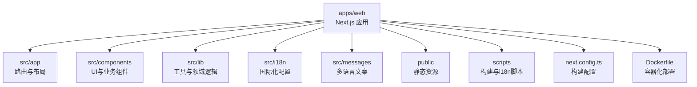
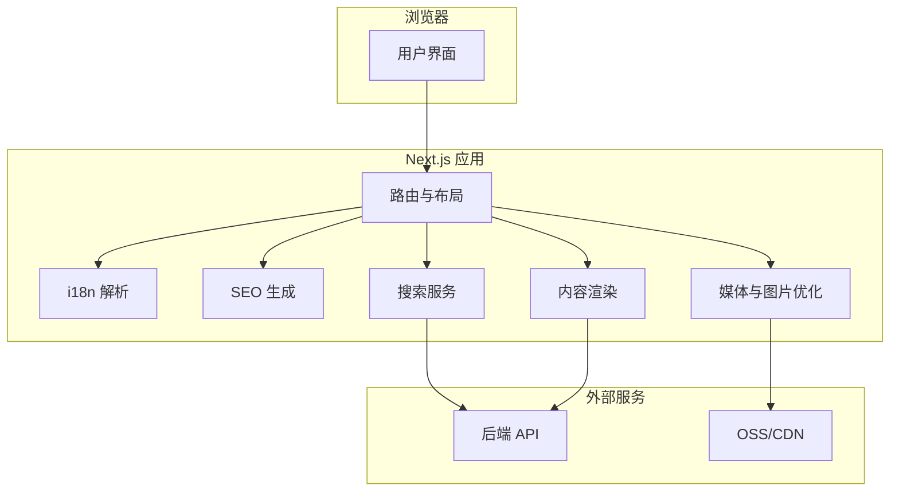
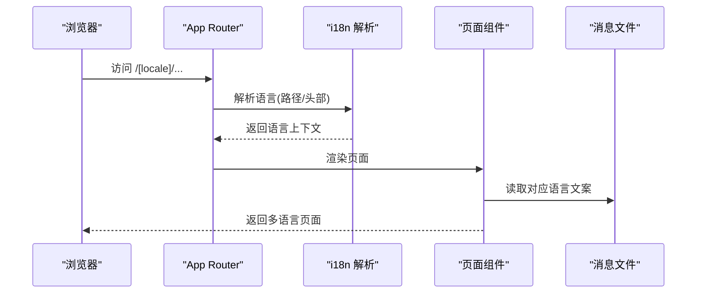
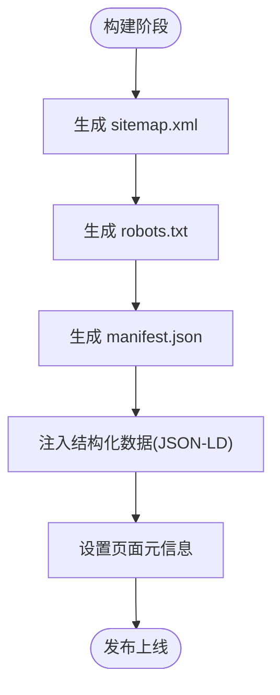
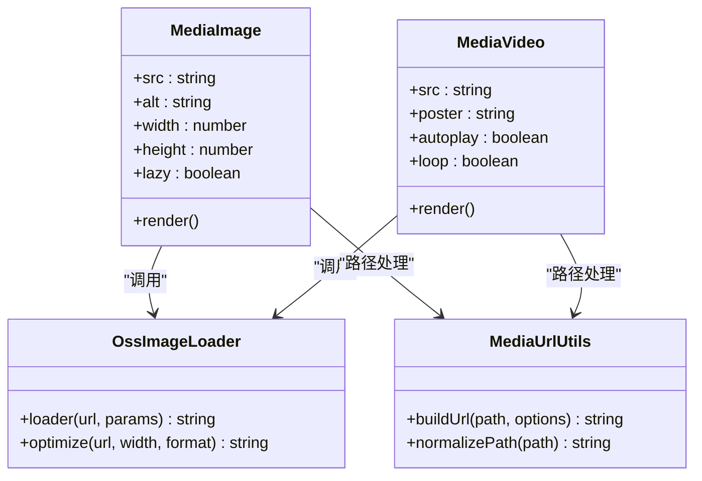
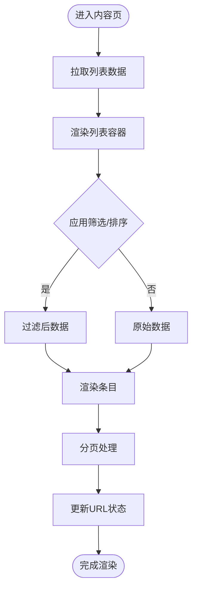
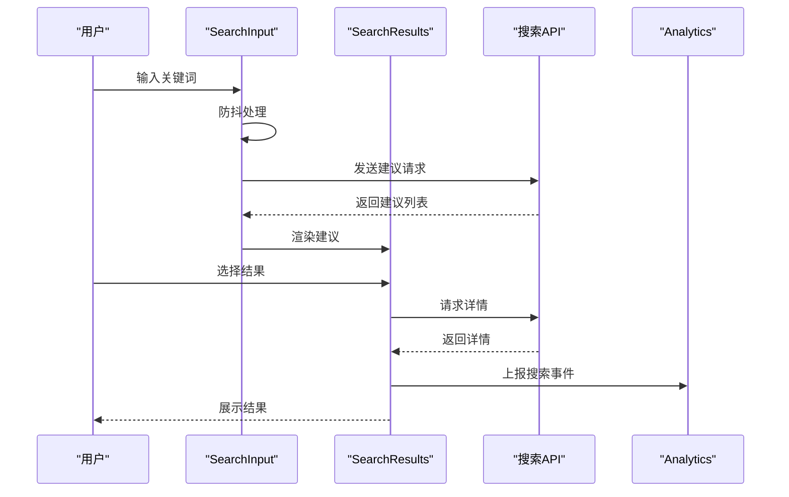
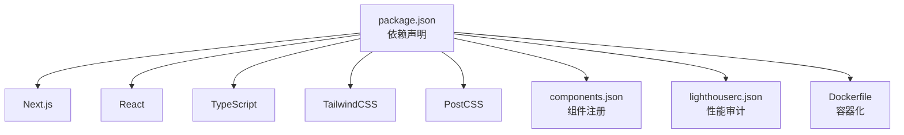

# 项目概览与技术栈

<cite>
**本文引用的文件**   
- [package.json](file://apps/web/package.json)
- [next.config.ts](file://apps/web/next.config.ts)
- [tsconfig.json](file://apps/web/tsconfig.json)
- [postcss.config.mjs](file://apps/web/postcss.config.mjs)
- [components.json](file://apps/web/components.json)
- [lighthouserc.json](file://apps/web/lighthouserc.json)
- [Dockerfile](file://apps/web/Dockerfile)
- [src/app/layout.tsx](file://apps/web/src/app/layout.tsx)
- [src/app/[locale]/layout.tsx](file://apps/web/src/app/[locale]/layout.tsx)
- [src/app/[locale]/page.tsx](file://apps/web/src/app/[locale]/page.tsx)
- [src/app/sitemap.ts](file://apps/web/src/app/sitemap.ts)
- [src/app/robots.ts](file://apps/web/src/app/robots.ts)
- [src/app/manifest.ts](file://apps/web/src/app/manifest.ts)
- [src/i18n/navigation.ts](file://apps/web/src/i18n/navigation.ts)
- [src/i18n/request.ts](file://apps/web/src/i18n/request.ts)
- [src/i18n/routing.ts](file://apps/web/src/i18n/routing.ts)
- [src/lib/seo.ts](file://apps/web/src/lib/seo.ts)
- [src/lib/media-url.ts](file://apps/web/src/lib/media-url.ts)
- [src/lib/oss-image-loader.ts](file://apps/web/src/lib/oss-image-loader.ts)
- [src/lib/analytics.ts](file://apps/web/src/lib/analytics.ts)
- [src/lib/site-settings.ts](file://apps/web/src/lib/site-settings.ts)
- [src/lib/routes.ts](file://apps/web/src/lib/routes.ts)
- [src/lib/navigation.ts](file://apps/web/src/lib/navigation.ts)
- [src/lib/product-catalog.ts](file://apps/web/src/lib/product-catalog.ts)
- [src/lib/content-list.ts](file://apps/web/src/lib/content-list.ts)
- [src/lib/content-detail.ts](file://apps/web/src/lib/content-detail.ts)
- [src/lib/jsonld.ts](file://apps/web/src/lib/jsonld.ts)
- [src/lib/locale-config.ts](file://apps/web/src/lib/locale-config.ts)
- [src/messages/en.json](file://apps/web/src/messages/en.json)
- [src/messages/zh-CN.json](file://apps/web/src/messages/zh-CN.json)
- [src/messages/zh-TW.json](file://apps/web/src/messages/zh-TW.json)
- [src/components/i18n/LanguageSelector.tsx](file://apps/web/src/components/i18n/LanguageSelector.tsx)
- [src/components/i18n/FooterLanguageTrigger.tsx](file://apps/web/src/components/i18n/FooterLanguage触发器.tsx)
- [src/components/MediaImage.tsx](file://apps/web/src/components/MediaImage.tsx)
- [src/components/MediaVideo.tsx](file://apps/web/src/components/MediaVideo.tsx)
- [src/components/JsonLd.tsx](file://apps/web/src/components/JsonLd.tsx)
- [src/components/search/SearchInput.tsx](file://apps/web/src/components/search/SearchInput.tsx)
- [src/components/search/SearchResults.tsx](file://apps/web/src/components/search/SearchResults.tsx)
- [src/components/content/ContentListShell.tsx](file://apps/web/src/components/content/ContentListShell.tsx)
- [src/components/content/ContentListToolbar.tsx](file://apps/web/src/components/content/ContentListToolbar.tsx)
- [src/components/content/ContentPagination.tsx](file://apps/web/src/components/content/ContentPagination.tsx)
- [src/components/content/MarkdownBody.tsx](file://apps/web/src/components/content/MarkdownBody.tsx)
- [src/components/products/ProductCard.tsx](file://apps/web/src/components/products/ProductCard.tsx)
- [src/components/sections/HeroSection.tsx](file://apps/web/src/components/sections/HeroSection.tsx)
- [src/components/sections/FeaturesSection.tsx](file://apps/web/src/components/sections/FeaturesSection.tsx)
- [src/components/analytics/VisitorTracker.tsx](file://apps/web/src/components/analytics/VisitorTracker.tsx)
- [src/features/chat/useVisitorChat.ts](file://apps/web/src/features/chat/useVisitorChat.ts)
- [scripts/i18n-extract-pages.py](file://apps/web/scripts/i18n-extract-pages.py)
- [scripts/i18n-replace-strings.py](file://apps/web/scripts/i18n-replace-strings.py)
- [scripts/i18n-sync-locales.py](file://apps/web/scripts/i18n-sync-locales.py)
</cite>

## 目录
1. [简介](#简介)
2. [项目结构](#项目结构)
3. [核心组件](#核心组件)
4. [架构总览](#架构总览)
5. [详细组件分析](#详细组件分析)
6. [依赖分析](#依赖分析)
7. [性能考量](#性能考量)
8. [故障排查指南](#故障排查指南)
9. [结论](#结论)
10. [附录](#附录)

## 简介
本项目为基于 Next.js 14 的官方网站前端，采用 App Router、TypeScript 与现代化的构建工具链。项目以“内容驱动 + SEO 优先”为核心设计理念，通过多语言（i18n）支持覆盖中英文及繁体中文，结合服务端渲染与静态生成策略，确保首屏性能与搜索引擎友好性。同时，项目内置媒体资源优化、图片懒加载、结构化数据注入与访问统计埋点，形成完整的官网交付方案。

## 项目结构
- 应用入口位于 apps/web，使用 Next.js App Router 组织路由与页面。
- i18n 通过 [locale] 动态段实现，消息文件集中在 src/messages。
- 公共 UI 与业务组件按功能域拆分至 src/components，通用逻辑下沉到 src/lib。
- 搜索、内容列表、产品等特性模块在对应目录内自包含。
- 构建与部署配置集中于根级配置文件与 Dockerfile。

**图表来源** 
- [next.config.ts](file://apps/web/next.config.ts)
- [Dockerfile](file://apps/web/Dockerfile)

**章节来源**
- [package.json](file://apps/web/package.json)
- [next.config.ts](file://apps/web/next.config.ts)
- [tsconfig.json](file://apps/web/tsconfig.json)

## 核心组件
- 路由与布局：App Router 的 layout.tsx 提供全局布局与元信息；[locale] 动态段承载多语言路由。
- 多语言：i18n 通过 routing.ts、request.ts、navigation.ts 协同工作，配合 messages 下的多语言 JSON。
- SEO：sitemap.ts、robots.ts、manifest.ts 与 lib/seo.ts、lib/jsonld.ts 共同完成站点地图、爬虫规则、PWA 清单与结构化数据。
- 媒体与图片：MediaImage/MediaVideo 组件结合 oss-image-loader 与 media-url 工具进行 CDN 与尺寸优化。
- 内容展示：ContentListShell、ContentListToolbar、ContentPagination、MarkdownBody 构成内容页骨架。
- 搜索：SearchInput 与 SearchResults 对接 API 路由，提供实时建议与结果展示。
- 分析埋点：VisitorTracker 与 analytics.ts 集成访问统计。

**章节来源**
- [src/app/layout.tsx](file://apps/web/src/app/layout.tsx)
- [src/app/[locale]/layout.tsx](file://apps/web/src/app/[locale]/layout.tsx)
- [src/i18n/routing.ts](file://apps/web/src/i18n/routing.ts)
- [src/i18n/request.ts](file://apps/web/src/i18n/request.ts)
- [src/i18n/navigation.ts](file://apps/web/src/i18n/navigation.ts)
- [src/app/sitemap.ts](file://apps/web/src/app/sitemap.ts)
- [src/app/robots.ts](file://apps/web/src/app/robots.ts)
- [src/app/manifest.ts](file://apps/web/src/app/manifest.ts)
- [src/lib/seo.ts](file://apps/web/src/lib/seo.ts)
- [src/lib/jsonld.ts](file://apps/web/src/lib/jsonld.ts)
- [src/components/MediaImage.tsx](file://apps/web/src/components/MediaImage.tsx)
- [src/components/MediaVideo.tsx](file://apps/web/src/components/MediaVideo.tsx)
- [src/lib/media-url.ts](file://apps/web/src/lib/media-url.ts)
- [src/lib/oss-image-loader.ts](file://apps/web/src/lib/oss-image-loader.ts)
- [src/components/content/ContentListShell.tsx](file://apps/web/src/components/content/ContentListShell.tsx)
- [src/components/content/ContentListToolbar.tsx](file://apps/web/src/components/content/ContentListToolbar.tsx)
- [src/components/content/ContentPagination.tsx](file://apps/web/src/components/content/ContentPagination.tsx)
- [src/components/content/MarkdownBody.tsx](file://apps/web/src/components/content/MarkdownBody.tsx)
- [src/components/search/SearchInput.tsx](file://apps/web/src/components/search/SearchInput.tsx)
- [src/components/search/SearchResults.tsx](file://apps/web/src/components/search/SearchResults.tsx)
- [src/components/analytics/VisitorTracker.tsx](file://apps/web/src/components/analytics/VisitorTracker.tsx)
- [src/lib/analytics.ts](file://apps/web/src/lib/analytics.ts)

## 架构总览
Next.js App Router 作为前端核心，负责路由、布局、数据获取与渲染。i18n 通过动态段与请求上下文解析语言，SEO 由服务端生成 sitemap/robots/PWA manifest，并结合结构化数据提升检索质量。媒体资源通过 OSS 与自定义 loader 进行按需裁剪与缓存。搜索与内容列表通过 API 路由与组件协作，实现前后端解耦。

**图表来源** 
- [src/app/[locale]/layout.tsx](file://apps/web/src/app/[locale]/layout.tsx)
- [src/i18n/routing.ts](file://apps/web/src/i18n/routing.ts)
- [src/app/sitemap.ts](file://apps/web/src/app/sitemap.ts)
- [src/lib/oss-image-loader.ts](file://apps/web/src/lib/oss-image-loader.ts)
- [src/components/search/SearchInput.tsx](file://apps/web/src/components/search/SearchInput.tsx)
- [src/components/content/ContentListShell.tsx](file://apps/web/src/components/content/ContentListShell.tsx)

## 详细组件分析

### 多语言支持（i18n）
- 路由层：[locale] 动态段与 routing.ts 定义支持的语种与默认语言。
- 请求层：request.ts 从请求头或路径解析语言，并注入上下文。
- 导航层：navigation.ts 提供带语言的链接生成与跳转。
- 文案管理：messages 下按语种分文件，脚本辅助提取与同步。
- UI 交互：LanguageSelector 与 FooterLanguageTrigger 提供切换入口。

**图表来源** 
- [src/i18n/routing.ts](file://apps/web/src/i18n/routing.ts)
- [src/i18n/request.ts](file://apps/web/src/i18n/request.ts)
- [src/i18n/navigation.ts](file://apps/web/src/i18n/navigation.ts)
- [src/components/i18n/LanguageSelector.tsx](file://apps/web/src/components/i18n/LanguageSelector.tsx)
- [src/components/i18n/FooterLanguageTrigger.tsx](file://apps/web/src/components/i18n/FooterLanguage触发器.tsx)

**章节来源**
- [src/i18n/routing.ts](file://apps/web/src/i18n/routing.ts)
- [src/i18n/request.ts](file://apps/web/src/i18n/request.ts)
- [src/i18n/navigation.ts](file://apps/web/src/i18n/navigation.ts)
- [src/messages/en.json](file://apps/web/src/messages/en.json)
- [src/messages/zh-CN.json](file://apps/web/src/messages/zh-CN.json)
- [src/messages/zh-TW.json](file://apps/web/src/messages/zh-TW.json)
- [scripts/i18n-extract-pages.py](file://apps/web/scripts/i18n-extract-pages.py)
- [scripts/i18n-replace-strings.py](file://apps/web/scripts/i18n-replace-strings.py)
- [scripts/i18n-sync-locales.py](file://apps/web/scripts/i18n-sync-locales.py)

### SEO 优化策略
- 站点地图：sitemap.ts 自动生成可索引页面集合。
- 爬虫规则：robots.ts 控制抓取行为。
- PWA 清单：manifest.ts 提供应用图标与启动参数。
- 结构化数据：jsonld.ts 与 JsonLd 组件注入 Schema.org 标记。
- 元信息管理：seo.ts 统一处理标题、描述、OpenGraph 等元数据。

**图表来源** 
- [src/app/sitemap.ts](file://apps/web/src/app/sitemap.ts)
- [src/app/robots.ts](file://apps/web/src/app/robots.ts)
- [src/app/manifest.ts](file://apps/web/src/app/manifest.ts)
- [src/lib/jsonld.ts](file://apps/web/src/lib/jsonld.ts)
- [src/components/JsonLd.tsx](file://apps/web/src/components/JsonLd.tsx)
- [src/lib/seo.ts](file://apps/web/src/lib/seo.ts)

**章节来源**
- [src/app/sitemap.ts](file://apps/web/src/app/sitemap.ts)
- [src/app/robots.ts](file://apps/web/src/app/robots.ts)
- [src/app/manifest.ts](file://apps/web/src/app/manifest.ts)
- [src/lib/jsonld.ts](file://apps/web/src/lib/jsonld.ts)
- [src/components/JsonLd.tsx](file://apps/web/src/components/JsonLd.tsx)
- [src/lib/seo.ts](file://apps/web/src/lib/seo.ts)

### 媒体与图片优化
- MediaImage/MediaVideo 封装媒体渲染，自动处理占位与错误状态。
- oss-image-loader 与 media-url 组合实现 CDN 路径拼接与尺寸裁剪。
- 懒加载与响应式图片降低首屏体积，提升 LCP。

**图表来源** 
- [src/components/MediaImage.tsx](file://apps/web/src/components/MediaImage.tsx)
- [src/components/MediaVideo.tsx](file://apps/web/src/components/MediaVideo.tsx)
- [src/lib/oss-image-loader.ts](file://apps/web/src/lib/oss-image-loader.ts)
- [src/lib/media-url.ts](file://apps/web/src/lib/media-url.ts)

**章节来源**
- [src/components/MediaImage.tsx](file://apps/web/src/components/MediaImage.tsx)
- [src/components/MediaVideo.tsx](file://apps/web/src/components/MediaVideo.tsx)
- [src/lib/oss-image-loader.ts](file://apps/web/src/lib/oss-image-loader.ts)
- [src/lib/media-url.ts](file://apps/web/src/lib/media-url.ts)

### 内容列表与分页
- ContentListShell 提供列表容器与骨架屏。
- ContentListToolbar 提供筛选与排序工具栏。
- ContentPagination 处理分页逻辑与 URL 状态同步。
- MarkdownBody 渲染 Markdown 内容，支持代码高亮与外链安全。

**图表来源** 
- [src/components/content/ContentListShell.tsx](file://apps/web/src/components/content/ContentListShell.tsx)
- [src/components/content/ContentListToolbar.tsx](file://apps/web/src/components/content/ContentListToolbar.tsx)
- [src/components/content/ContentPagination.tsx](file://apps/web/src/components/content/ContentPagination.tsx)
- [src/components/content/MarkdownBody.tsx](file://apps/web/src/components/content/MarkdownBody.tsx)

**章节来源**
- [src/components/content/ContentListShell.tsx](file://apps/web/src/components/content/ContentListShell.tsx)
- [src/components/content/ContentListToolbar.tsx](file://apps/web/src/components/content/ContentListToolbar.tsx)
- [src/components/content/ContentPagination.tsx](file://apps/web/src/components/content/ContentPagination.tsx)
- [src/components/content/MarkdownBody.tsx](file://apps/web/src/components/content/MarkdownBody.tsx)

### 搜索功能
- SearchInput 提供输入与防抖，SearchResults 展示建议与结果。
- 通过 API 路由 /api/search/* 获取建议与搜索结果。
- 结合 analytics.ts 记录搜索行为。

**图表来源** 
- [src/components/search/SearchInput.tsx](file://apps/web/src/components/search/SearchInput.tsx)
- [src/components/search/SearchResults.tsx](file://apps/web/src/components/search/SearchResults.tsx)
- [src/lib/analytics.ts](file://apps/web/src/lib/analytics.ts)

**章节来源**
- [src/components/search/SearchInput.tsx](file://apps/web/src/components/search/SearchInput.tsx)
- [src/components/search/SearchResults.tsx](file://apps/web/src/components/search/SearchResults.tsx)
- [src/lib/analytics.ts](file://apps/web/src/lib/analytics.ts)

### 访问统计与埋点
- VisitorTracker 在页面挂载时采集基础指标。
- analytics.ts 封装事件上报与去重逻辑。
- 与聊天功能 useVisitorChat 联动，记录访客会话。

**章节来源**
- [src/components/analytics/VisitorTracker.tsx](file://apps/web/src/components/analytics/VisitorTracker.tsx)
- [src/lib/analytics.ts](file://apps/web/src/lib/analytics.ts)
- [src/features/chat/useVisitorChat.ts](file://apps/web/src/features/chat/useVisitorChat.ts)

## 依赖分析
- 运行时依赖：Next.js、React、TypeScript、TailwindCSS、PostCSS。
- 构建工具：pnpm workspace、Turbo（若启用）、Docker。
- 第三方库：媒体处理、Markdown 渲染、搜索与统计相关库。
- 配置项：components.json 管理 UI 组件注册，lighthouserc.json 指导性能审计。

**图表来源** 
- [package.json](file://apps/web/package.json)
- [components.json](file://apps/web/components.json)
- [lighthouserc.json](file://apps/web/lighthouserc.json)
- [Dockerfile](file://apps/web/Dockerfile)

**章节来源**
- [package.json](file://apps/web/package.json)
- [components.json](file://apps/web/components.json)
- [lighthouserc.json](file://apps/web/lighthouserc.json)

## 性能考量
- 首屏优化：SSR/静态生成结合，关键路由预渲染，减少客户端计算。
- 图片优化：自适应尺寸、WebP/AVIF 格式、CDN 缓存与懒加载。
- 资源分割：按路由与组件懒加载，避免一次性加载全部 JS/CSS。
- 缓存策略：HTTP 缓存头、Service Worker（可选）、PWA manifest。
- 监控与审计：Lighthouse CI 与本地审计脚本持续改进。

[本节为通用性能建议，不直接分析具体文件]

## 故障排查指南
- 构建失败：检查 next.config.ts 与 postcss.config.mjs 配置是否正确，确认依赖版本兼容。
- 多语言异常：验证 routing.ts 与 request.ts 的语言解析逻辑，确认 messages 文件完整性。
- 图片无法加载：核对 oss-image-loader 与 media-url 的路径拼接与域名配置。
- SEO 未生效：检查 sitemap.ts、robots.ts、manifest.ts 输出是否被服务器正确托管。
- 搜索无结果：确认 API 路由可用性与网络权限，查看控制台报错。

**章节来源**
- [next.config.ts](file://apps/web/next.config.ts)
- [postcss.config.mjs](file://apps/web/postcss.config.mjs)
- [src/i18n/routing.ts](file://apps/web/src/i18n/routing.ts)
- [src/i18n/request.ts](file://apps/web/src/i18n/request.ts)
- [src/lib/oss-image-loader.ts](file://apps/web/src/lib/oss-image-loader.ts)
- [src/lib/media-url.ts](file://apps/web/src/lib/media-url.ts)
- [src/app/sitemap.ts](file://apps/web/src/app/sitemap.ts)
- [src/app/robots.ts](file://apps/web/src/app/robots.ts)
- [src/app/manifest.ts](file://apps/web/src/app/manifest.ts)

## 结论
本项目以 Next.js 14 的 App Router 为核心，结合 TypeScript 与现代化构建工具，构建了可扩展、高性能且 SEO 友好的官方网站前端。多语言、媒体优化、搜索与埋点等功能模块清晰解耦，便于团队协作与持续演进。通过完善的构建与部署配置，项目可在多种环境中稳定运行。

[本节为总结性内容，不直接分析具体文件]

## 附录
- 开发环境搭建
  - 安装 pnpm 与 Node.js 指定版本。
  - 在项目根目录执行依赖安装与构建命令。
  - 启动开发服务器，访问本地端口预览。
- 依赖管理
  - 使用 pnpm workspace 管理多包依赖。
  - 通过 package.json 锁定版本，保持构建一致性。
- 构建流程
  - 使用 next build 进行生产构建。
  - 通过 Dockerfile 打包镜像，部署到容器环境。
- 快速入门
  - 新增页面：在 src/app/[locale] 下创建路由与组件。
  - 新增文案：在 messages 下对应语言文件中添加键值。
  - 新增组件：在 components 下创建并按需注册。

[本节为操作指引，不直接分析具体文件]