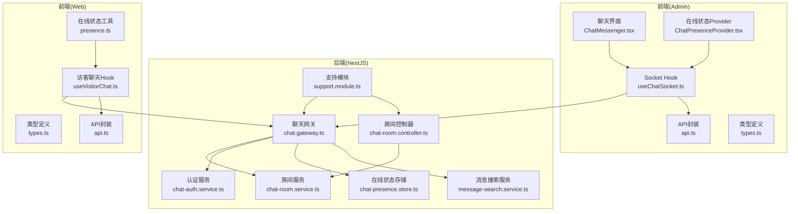
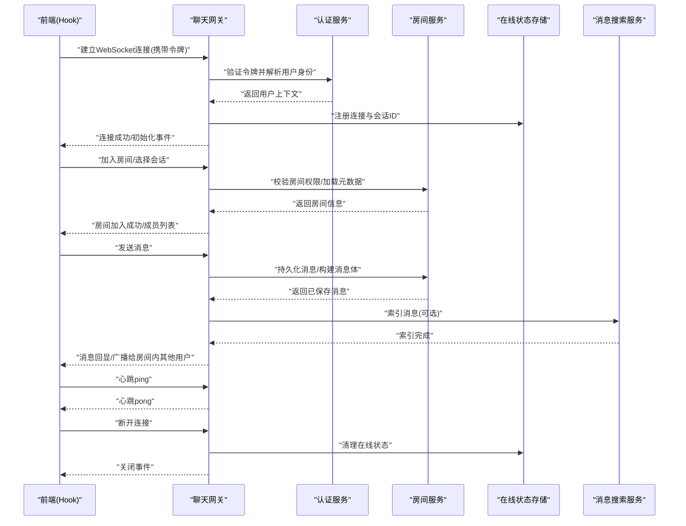
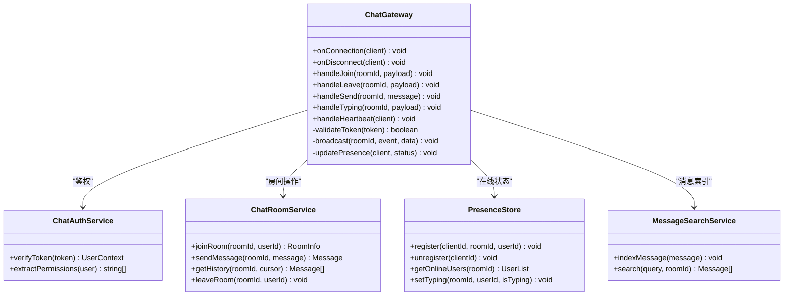
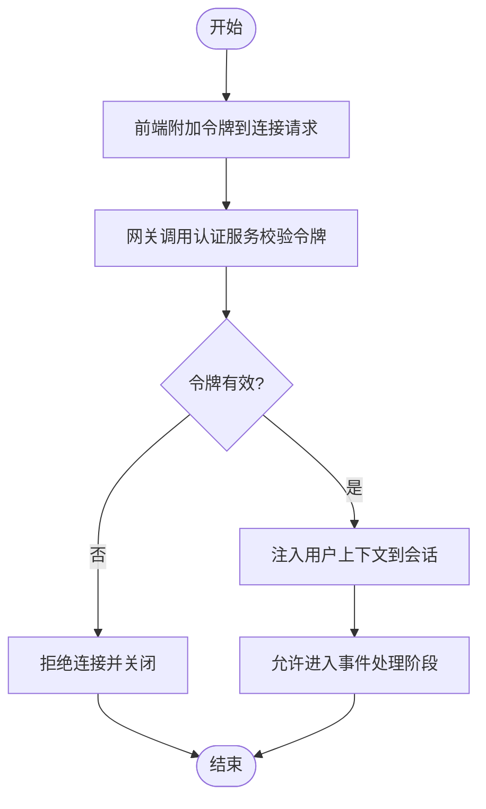
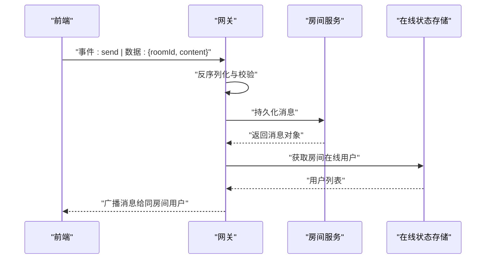
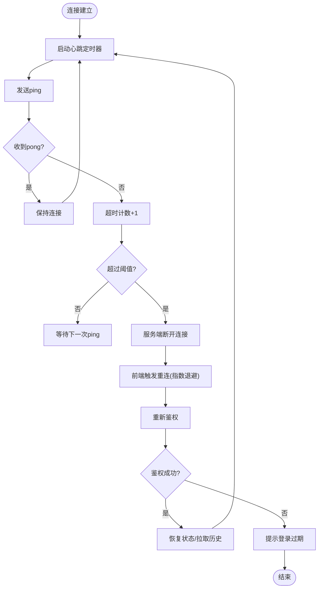
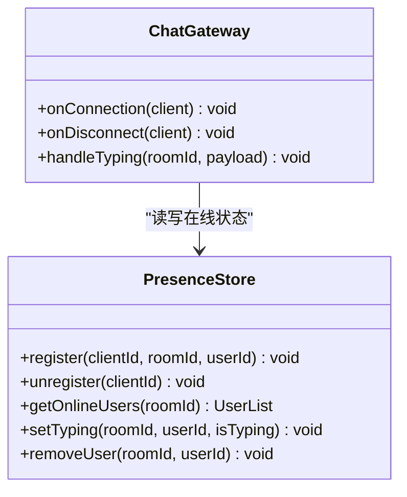
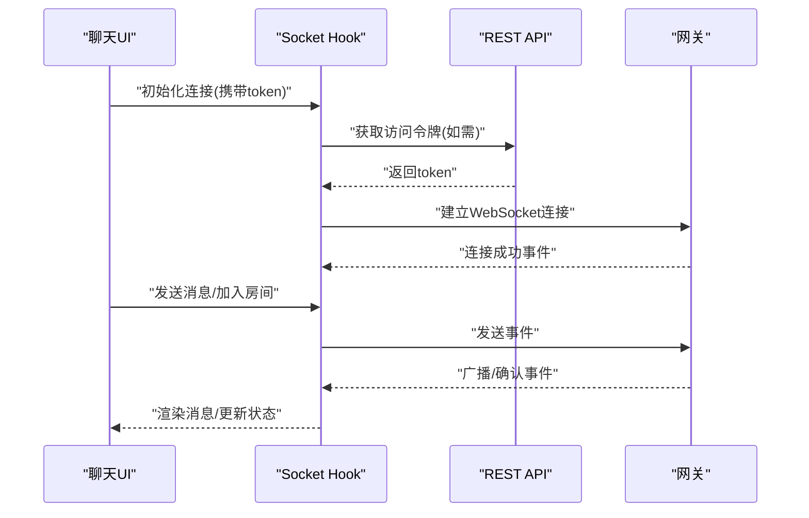
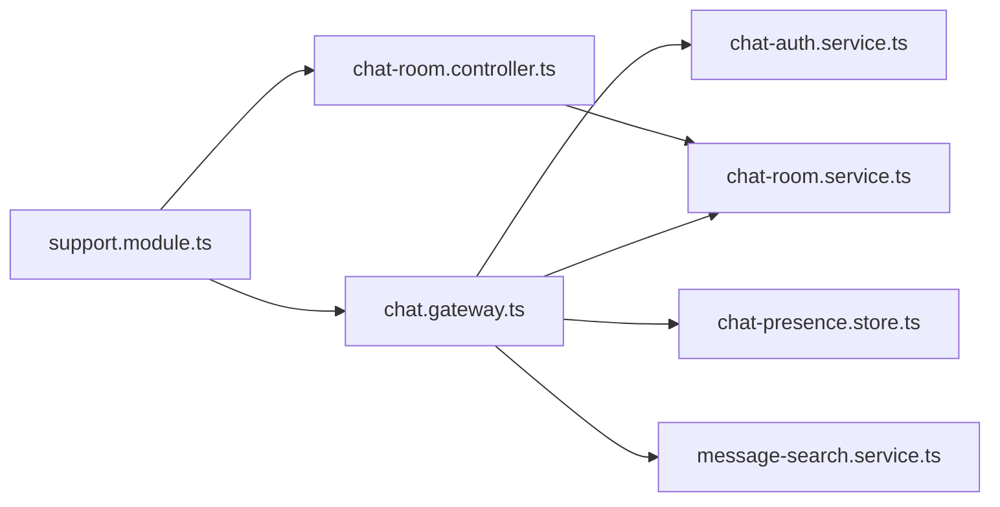

# WebSocket通信层

<cite>
**本文档引用的文件**   
- [chat.gateway.ts](file://apps/api/src/support/chat.gateway.ts)
- [support.module.ts](file://apps/api/src/support/support.module.ts)
- [chat-room.controller.ts](file://apps/api/src/support/chat-room.controller.ts)
- [chat-room.service.ts](file://apps/api/src/support/chat-room.service.ts)
- [chat-auth.service.ts](file://apps/api/src/support/chat-auth.service.ts)
- [chat-presence.store.ts](file://apps/api/src/support/chat-presence.store.ts)
- [message-search.service.ts](file://apps/api/src/support/message-search.service.ts)
- [ChatMessenger.tsx](file://apps/admin/src/features/chat/ChatMessenger.tsx)
- [useChatSocket.ts](file://apps/admin/src/features/chat/useChatSocket.ts)
- [api.ts](file://apps/admin/src/features/chat/api.ts)
- [types.ts](file://apps/admin/src/features/chat/types.ts)
- [ChatPresenceProvider.tsx](file://apps/admin/src/features/chat/ChatPresenceProvider.tsx)
- [useVisitorChat.ts](file://apps/web/src/features/chat/useVisitorChat.ts)
- [presence.ts](file://apps/web/src/features/chat/presence.ts)
- [types.ts](file://apps/web/src/features/chat/types.ts)
- [api.ts](file://apps/web/src/features/chat/api.ts)
</cite>

## 目录
1. [简介](#简介)
2. [项目结构](#项目结构)
3. [核心组件](#核心组件)
4. [架构总览](#架构总览)
5. [详细组件分析](#详细组件分析)
6. [依赖关系分析](#依赖关系分析)
7. [性能考量](#性能考量)
8. [故障排查指南](#故障排查指南)
9. [结论](#结论)
10. [附录](#附录)

## 简介
本文件面向WebSocket通信层，聚焦聊天网关的实现原理与前后端Socket连接机制。内容涵盖连接建立、消息路由、事件处理、连接管理、认证流程、心跳检测、断线重连、错误处理、消息序列化与传输优化、连接池管理、负载均衡与故障转移策略，并提供具体代码示例路径以便快速定位实现细节。

## 项目结构
后端采用NestJS模块组织，聊天相关能力集中在support模块中；前端在admin与web两个应用中分别提供聊天功能与Socket封装。关键文件分布如下：
- 后端网关与服务：
  - 网关入口与事件路由：chat.gateway.ts
  - 模块装配：support.module.ts
  - REST接口（令牌、房间等）：chat-room.controller.ts
  - 业务服务：chat-room.service.ts、chat-auth.service.ts、chat-presence.store.ts、message-search.service.ts
- 前端客户端：
  - 管理后台聊天UI与Socket Hook：ChatMessenger.tsx、useChatSocket.ts、api.ts、types.ts、ChatPresenceProvider.tsx
  - 访客聊天Hook与类型：useVisitorChat.ts、presence.ts、types.ts、api.ts

图表来源
- [chat.gateway.ts](file://apps/api/src/support/chat.gateway.ts)
- [support.module.ts](file://apps/api/src/support/support.module.ts)
- [chat-room.controller.ts](file://apps/api/src/support/chat-room.controller.ts)
- [chat-room.service.ts](file://apps/api/src/support/chat-room.service.ts)
- [chat-auth.service.ts](file://apps/api/src/support/chat-auth.service.ts)
- [chat-presence.store.ts](file://apps/api/src/support/chat-presence.store.ts)
- [message-search.service.ts](file://apps/api/src/support/message-search.service.ts)
- [ChatMessenger.tsx](file://apps/admin/src/features/chat/ChatMessenger.tsx)
- [useChatSocket.ts](file://apps/admin/src/features/chat/useChatSocket.ts)
- [api.ts](file://apps/admin/src/features/chat/api.ts)
- [types.ts](file://apps/admin/src/features/chat/types.ts)
- [ChatPresenceProvider.tsx](file://apps/admin/src/features/chat/ChatPresenceProvider.tsx)
- [useVisitorChat.ts](file://apps/web/src/features/chat/useVisitorChat.ts)
- [presence.ts](file://apps/web/src/features/chat/presence.ts)
- [types.ts](file://apps/web/src/features/chat/types.ts)
- [api.ts](file://apps/web/src/features/chat/api.ts)

章节来源
- [chat.gateway.ts](file://apps/api/src/support/chat.gateway.ts)
- [support.module.ts](file://apps/api/src/support/support.module.ts)
- [chat-room.controller.ts](file://apps/api/src/support/chat-room.controller.ts)
- [chat-room.service.ts](file://apps/api/src/support/chat-room.service.ts)
- [chat-auth.service.ts](file://apps/api/src/support/chat-auth.service.ts)
- [chat-presence.store.ts](file://apps/api/src/support/chat-presence.store.ts)
- [message-search.service.ts](file://apps/api/src/support/message-search.service.ts)
- [ChatMessenger.tsx](file://apps/admin/src/features/chat/ChatMessenger.tsx)
- [useChatSocket.ts](file://apps/admin/src/features/chat/useChatSocket.ts)
- [api.ts](file://apps/admin/src/features/chat/api.ts)
- [types.ts](file://apps/admin/src/features/chat/types.ts)
- [ChatPresenceProvider.tsx](file://apps/admin/src/features/chat/ChatPresenceProvider.tsx)
- [useVisitorChat.ts](file://apps/web/src/features/chat/useVisitorChat.ts)
- [presence.ts](file://apps/web/src/features/chat/presence.ts)
- [types.ts](file://apps/web/src/features/chat/types.ts)
- [api.ts](file://apps/web/src/features/chat/api.ts)

## 核心组件
- 聊天网关（Gateway）：负责WebSocket生命周期管理、鉴权、消息路由、广播与订阅、心跳与断线重连触发。
- 房间服务（Room Service）：会话生命周期、消息持久化、历史查询、房间元数据维护。
- 认证服务（Auth Service）：校验访问令牌、解析用户身份、权限控制。
- 在线状态存储（Presence Store）：维护用户在线状态、设备信息、房间成员列表。
- 消息搜索服务（Message Search）：对消息进行索引与检索，支持关键词过滤。
- 前端Socket Hook（Admin/Web）：封装连接建立、事件监听、消息发送、心跳、重连、错误处理与状态同步。
- 在线状态Provider（Admin）：集中管理在线状态展示与更新。

章节来源
- [chat.gateway.ts](file://apps/api/src/support/chat.gateway.ts)
- [chat-room.service.ts](file://apps/api/src/support/chat-room.service.ts)
- [chat-auth.service.ts](file://apps/api/src/support/chat-auth.service.ts)
- [chat-presence.store.ts](file://apps/api/src/support/chat-presence.store.ts)
- [message-search.service.ts](file://apps/api/src/support/message-search.service.ts)
- [useChatSocket.ts](file://apps/admin/src/features/chat/useChatSocket.ts)
- [ChatPresenceProvider.tsx](file://apps/admin/src/features/chat/ChatPresenceProvider.tsx)
- [useVisitorChat.ts](file://apps/web/src/features/chat/useVisitorChat.ts)
- [presence.ts](file://apps/web/src/features/chat/presence.ts)

## 架构总览
整体采用“网关+服务”的解耦设计：网关仅处理协议与路由，业务逻辑下沉至服务层；前端通过统一的Hook抽象Socket交互，屏蔽底层差异。

图表来源
- [chat.gateway.ts](file://apps/api/src/support/chat.gateway.ts)
- [chat-auth.service.ts](file://apps/api/src/support/chat-auth.service.ts)
- [chat-room.service.ts](file://apps/api/src/support/chat-room.service.ts)
- [chat-presence.store.ts](file://apps/api/src/support/chat-presence.store.ts)
- [message-search.service.ts](file://apps/api/src/support/message-search.service.ts)
- [useChatSocket.ts](file://apps/admin/src/features/chat/useChatSocket.ts)
- [useVisitorChat.ts](file://apps/web/src/features/chat/useVisitorChat.ts)

## 详细组件分析

### 聊天网关（Gateway）
职责与要点：
- 连接建立：拦截器或守卫阶段校验JWT令牌，失败则拒绝连接。
- 事件路由：按事件名分发到对应处理器（如join、leave、send、typing、heartbeat）。
- 消息广播：基于房间ID将消息推送给同房间用户，避免跨房间泄漏。
- 心跳检测：服务端定时检查活跃连接，超时主动断开。
- 断线重连：配合前端指数退避策略，服务端不主动重连但保持会话可恢复。
- 错误处理：统一异常包装，区分网络错误、鉴权错误、业务错误。

图表来源
- [chat.gateway.ts](file://apps/api/src/support/chat.gateway.ts)
- [chat-auth.service.ts](file://apps/api/src/support/chat-auth.service.ts)
- [chat-room.service.ts](file://apps/api/src/support/chat-room.service.ts)
- [chat-presence.store.ts](file://apps/api/src/support/chat-presence.store.ts)
- [message-search.service.ts](file://apps/api/src/support/message-search.service.ts)

章节来源
- [chat.gateway.ts](file://apps/api/src/support/chat.gateway.ts)

### 认证流程（JWT）
- 前端在建立WebSocket连接时附带令牌（通常通过查询参数或握手头）。
- 网关在服务端校验令牌有效性及权限范围，失败则立即断开连接。
- 成功后将用户上下文注入到后续事件处理器中。

图表来源
- [chat-auth.service.ts](file://apps/api/src/support/chat-auth.service.ts)
- [chat.gateway.ts](file://apps/api/src/support/chat.gateway.ts)

章节来源
- [chat-auth.service.ts](file://apps/api/src/support/chat-auth.service.ts)
- [chat.gateway.ts](file://apps/api/src/support/chat.gateway.ts)

### 消息路由与广播
- 路由规则：以事件名为键，匹配处理器；房间级隔离确保消息只推送给同房间用户。
- 广播策略：优先内存广播，必要时结合外部消息队列（可扩展）。
- 反序列化：接收JSON字符串后校验结构，失败返回结构化错误。

图表来源
- [chat.gateway.ts](file://apps/api/src/support/chat.gateway.ts)
- [chat-room.service.ts](file://apps/api/src/support/chat-room.service.ts)
- [chat-presence.store.ts](file://apps/api/src/support/chat-presence.store.ts)

章节来源
- [chat.gateway.ts](file://apps/api/src/support/chat.gateway.ts)
- [chat-room.service.ts](file://apps/api/src/support/chat-room.service.ts)

### 心跳检测与断线重连
- 心跳：前端定时发送ping，服务端回复pong；若长时间无响应，服务端主动断开。
- 重连：前端实现指数退避与最大重试次数，避免雪崩；重连时重新鉴权。
- 状态恢复：重连后拉取未确认消息与最新房间状态。

图表来源
- [useChatSocket.ts](file://apps/admin/src/features/chat/useChatSocket.ts)
- [useVisitorChat.ts](file://apps/web/src/features/chat/useVisitorChat.ts)
- [chat.gateway.ts](file://apps/api/src/support/chat.gateway.ts)

章节来源
- [useChatSocket.ts](file://apps/admin/src/features/chat/useChatSocket.ts)
- [useVisitorChat.ts](file://apps/web/src/features/chat/useVisitorChat.ts)
- [chat.gateway.ts](file://apps/api/src/support/chat.gateway.ts)

### 连接管理与在线状态
- 连接注册：每次连接建立时记录clientId、roomId、userId、设备信息。
- 状态更新：用户打字、离开、在线状态变更实时广播。
- 清理策略：连接关闭时移除在线记录，防止僵尸状态。

图表来源
- [chat-presence.store.ts](file://apps/api/src/support/chat-presence.store.ts)
- [chat.gateway.ts](file://apps/api/src/support/chat.gateway.ts)

章节来源
- [chat-presence.store.ts](file://apps/api/src/support/chat-presence.store.ts)
- [chat.gateway.ts](file://apps/api/src/support/chat.gateway.ts)

### 前端Socket封装（Admin与Web）
- Admin侧Hook：封装连接、事件订阅、消息发送、心跳、重连、错误处理，暴露统一API供UI使用。
- Web侧Hook：轻量版，侧重访客场景的快速接入与最小化状态管理。
- 类型定义：统一消息结构、事件名、状态枚举，保证前后端一致性。

图表来源
- [useChatSocket.ts](file://apps/admin/src/features/chat/useChatSocket.ts)
- [api.ts](file://apps/admin/src/features/chat/api.ts)
- [types.ts](file://apps/admin/src/features/chat/types.ts)
- [useVisitorChat.ts](file://apps/web/src/features/chat/useVisitorChat.ts)
- [api.ts](file://apps/web/src/features/chat/api.ts)
- [types.ts](file://apps/web/src/features/chat/types.ts)

章节来源
- [useChatSocket.ts](file://apps/admin/src/features/chat/useChatSocket.ts)
- [api.ts](file://apps/admin/src/features/chat/api.ts)
- [types.ts](file://apps/admin/src/features/chat/types.ts)
- [useVisitorChat.ts](file://apps/web/src/features/chat/useVisitorChat.ts)
- [api.ts](file://apps/web/src/features/chat/api.ts)
- [types.ts](file://apps/web/src/features/chat/types.ts)

### 在线状态Provider（Admin）
- 集中管理在线人数、当前用户状态、打字指示等。
- 与Socket Hook联动，实时更新UI展示。

章节来源
- [ChatPresenceProvider.tsx](file://apps/admin/src/features/chat/ChatPresenceProvider.tsx)
- [useChatSocket.ts](file://apps/admin/src/features/chat/useChatSocket.ts)

## 依赖关系分析
- 模块装配：support.module.ts将网关、控制器、服务注册为NestJS模块，便于依赖注入与生命周期管理。
- 控制器依赖：chat-room.controller.ts依赖chat-room.service.ts提供REST接口（如令牌、房间信息）。
- 网关依赖：chat.gateway.ts依赖auth、room、presence、search服务，形成低耦合高内聚。
- 前端依赖：Hook依赖API封装与类型定义，保证契约一致。

图表来源
- [support.module.ts](file://apps/api/src/support/support.module.ts)
- [chat-room.controller.ts](file://apps/api/src/support/chat-room.controller.ts)
- [chat-room.service.ts](file://apps/api/src/support/chat-room.service.ts)
- [chat-auth.service.ts](file://apps/api/src/support/chat-auth.service.ts)
- [chat-presence.store.ts](file://apps/api/src/support/chat-presence.store.ts)
- [message-search.service.ts](file://apps/api/src/support/message-search.service.ts)
- [chat.gateway.ts](file://apps/api/src/support/chat.gateway.ts)

章节来源
- [support.module.ts](file://apps/api/src/support/support.module.ts)
- [chat-room.controller.ts](file://apps/api/src/support/chat-room.controller.ts)
- [chat-room.service.ts](file://apps/api/src/support/chat-room.service.ts)
- [chat-auth.service.ts](file://apps/api/src/support/chat-auth.service.ts)
- [chat-presence.store.ts](file://apps/api/src/support/chat-presence.store.ts)
- [message-search.service.ts](file://apps/api/src/support/message-search.service.ts)
- [chat.gateway.ts](file://apps/api/src/support/chat.gateway.ts)

## 性能考量
- 消息序列化：尽量使用紧凑JSON结构，避免冗余字段；大消息分片传输。
- 广播优化：房间级广播优先内存转发，避免不必要的数据库写入；批量合并高频事件（如typing）。
- 心跳间隔：合理设置心跳周期与超时阈值，平衡实时性与资源消耗。
- 连接池与负载均衡：多实例部署时，网关需共享在线状态与房间映射（可通过Redis扩展）；通过反向代理均衡负载。
- 故障转移：网关实例故障时，前端自动切换至可用节点并重连；服务端状态迁移由中间件或外部存储保障。

[本节为通用指导，不直接分析具体文件]

## 故障排查指南
- 连接失败：检查令牌是否有效、CORS配置、端口与域名是否正确。
- 消息丢失：确认消息持久化是否成功、广播目标房间是否正确、是否存在重复消费。
- 心跳超时：调整心跳间隔与超时阈值，检查网络延迟与服务器负载。
- 在线状态不一致：检查连接关闭事件是否触发清理、是否存在僵尸连接。
- 鉴权失败：核对JWT签名、有效期、权限范围与网关校验逻辑。

章节来源
- [chat.gateway.ts](file://apps/api/src/support/chat.gateway.ts)
- [chat-auth.service.ts](file://apps/api/src/support/chat-auth.service.ts)
- [chat-room.service.ts](file://apps/api/src/support/chat-room.service.ts)
- [chat-presence.store.ts](file://apps/api/src/support/chat-presence.store.ts)

## 结论
本WebSocket通信层以网关为核心，结合认证、房间、在线状态与消息搜索服务，实现了稳定可靠的实时聊天能力。前端通过统一的Hook封装了连接、事件、心跳与重连逻辑，降低了集成复杂度。通过合理的序列化、广播与心跳策略，系统在性能与可靠性之间取得平衡。未来可在多实例部署下引入分布式状态共享与更完善的负载均衡与故障转移机制。

[本节为总结性内容，不直接分析具体文件]

## 附录
- 连接建立示例路径：
  - 前端Hook初始化与发送消息：[useChatSocket.ts](file://apps/admin/src/features/chat/useChatSocket.ts)、[useVisitorChat.ts](file://apps/web/src/features/chat/useVisitorChat.ts)
  - 网关事件处理与鉴权：[chat.gateway.ts](file://apps/api/src/support/chat.gateway.ts)、[chat-auth.service.ts](file://apps/api/src/support/chat-auth.service.ts)
- 消息序列化与类型定义：
  - 前端类型：[types.ts](file://apps/admin/src/features/chat/types.ts)、[types.ts](file://apps/web/src/features/chat/types.ts)
  - 后端DTO与模型：参考support模块中的服务与控制器文件
- 在线状态与Provider：
  - 后端存储：[chat-presence.store.ts](file://apps/api/src/support/chat-presence.store.ts)
  - 前端Provider：[ChatPresenceProvider.tsx](file://apps/admin/src/features/chat/ChatPresenceProvider.tsx)

[本节为补充说明，不直接分析具体文件]