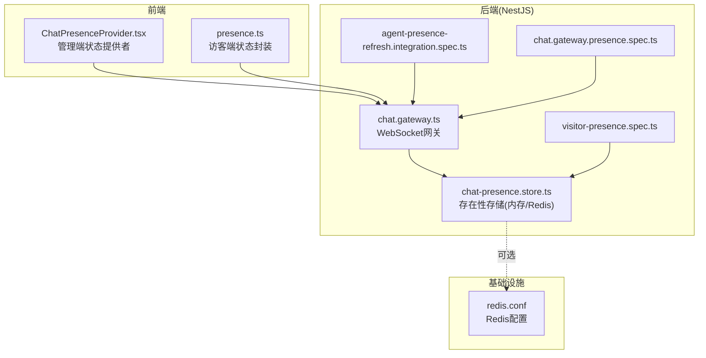
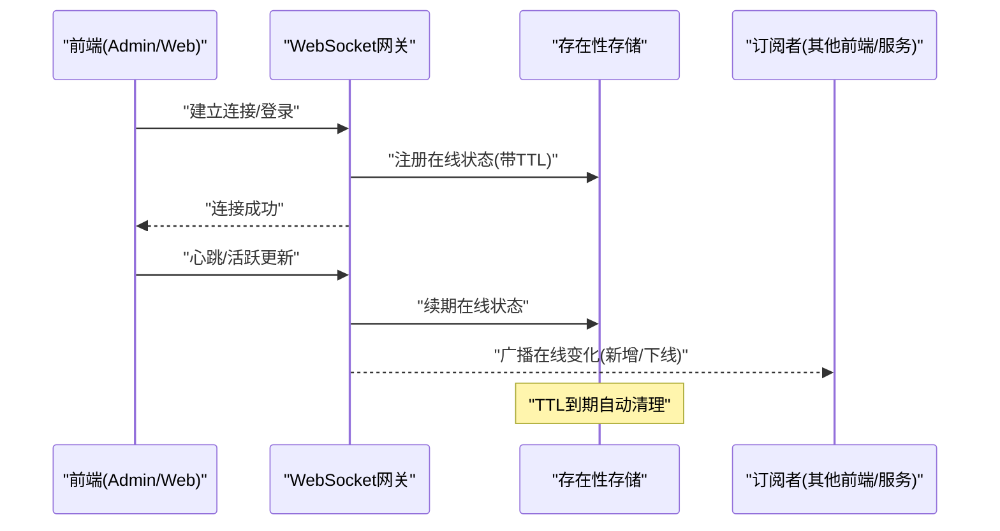
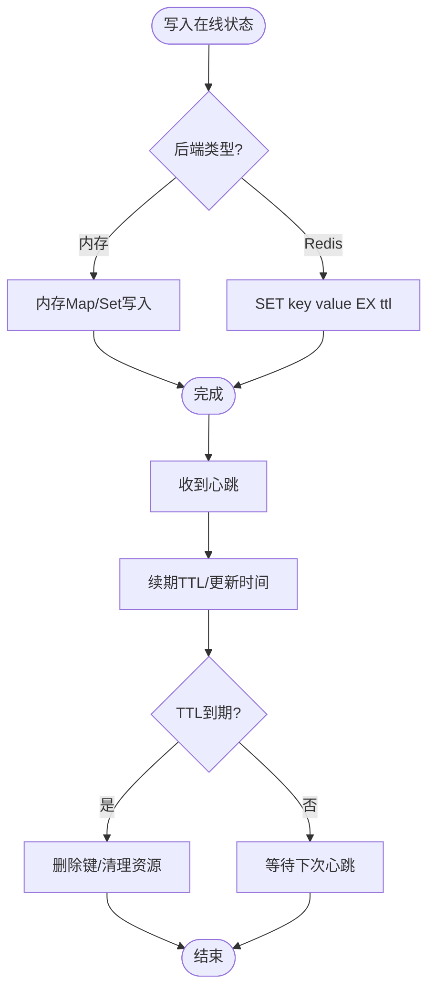
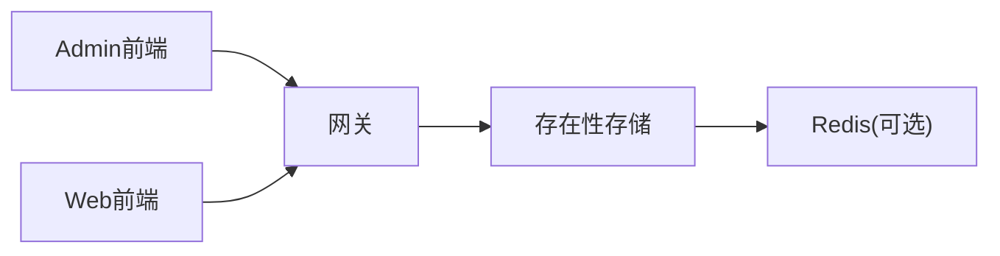

# 在线状态系统

<cite>
**本文引用的文件**   
- [apps/api/src/support/chat.gateway.ts](file://apps/api/src/support/chat.gateway.ts)
- [apps/api/src/support/chat-presence.store.ts](file://apps/api/src/support/chat-presence.store.ts)
- [apps/api/src/support/agent-presence-refresh.integration.spec.ts](file://apps/api/src/support/agent-presence-refresh.integration.spec.ts)
- [apps/api/src/support/chat.gateway.presence.spec.ts](file://apps/api/src/support/chat.gateway.presence.spec.ts)
- [apps/api/src/support/visitor-presence.spec.ts](file://apps/api/src/support/visitor-presence.spec.ts)
- [apps/admin/src/features/chat/ChatPresenceProvider.tsx](file://apps/admin/src/features/chat/ChatPresenceProvider.tsx)
- [apps/web/src/features/chat/presence.ts](file://apps/web/src/features/chat/presence.ts)
- [infra/docker/redis/redis.conf](file://infra/docker/redis/redis.conf)
</cite>

## 目录
1. [简介](#简介)
2. [项目结构](#项目结构)
3. [核心组件](#核心组件)
4. [架构总览](#架构总览)
5. [详细组件分析](#详细组件分析)
6. [依赖分析](#依赖分析)
7. [性能考虑](#性能考虑)
8. [故障排查指南](#故障排查指南)
9. [结论](#结论)
10. [附录](#附录)

## 简介
本文件面向在线状态系统的实现与使用，覆盖用户在线状态的检测、更新与同步机制；解释存在性存储（Redis 或内存）的选择与使用；说明状态广播、实时同步与冲突解决策略；给出状态过期处理、资源清理与性能优化建议；并提供状态监听与订阅的使用方法以及自定义扩展指南。

## 项目结构
在线状态能力主要分布在后端 NestJS 的 support 模块（WebSocket Gateway、存在性存储、集成测试）与前端两个应用（admin、web）的状态提供者与客户端封装中。Redis 作为可选的外部存在性存储通过 Docker 配置提供。

图表来源 
- [apps/api/src/support/chat.gateway.ts](file://apps/api/src/support/chat.gateway.ts)
- [apps/api/src/support/chat-presence.store.ts](file://apps/api/src/support/chat-presence.store.ts)
- [apps/api/src/support/agent-presence-refresh.integration.spec.ts](file://apps/api/src/support/agent-presence-refresh.integration.spec.ts)
- [apps/api/src/support/chat.gateway.presence.spec.ts](file://apps/api/src/support/chat.gateway.presence.spec.ts)
- [apps/api/src/support/visitor-presence.spec.ts](file://apps/api/src/support/visitor-presence.spec.ts)
- [apps/admin/src/features/chat/ChatPresenceProvider.tsx](file://apps/admin/src/features/chat/ChatPresenceProvider.tsx)
- [apps/web/src/features/chat/presence.ts](file://apps/web/src/features/chat/presence.ts)
- [infra/docker/redis/redis.conf](file://infra/docker/redis/redis.conf)

章节来源
- [apps/api/src/support/chat.gateway.ts](file://apps/api/src/support/chat.gateway.ts)
- [apps/api/src/support/chat-presence.store.ts](file://apps/api/src/support/chat-presence.store.ts)
- [apps/admin/src/features/chat/ChatPresenceProvider.tsx](file://apps/admin/src/features/chat/ChatPresenceProvider.tsx)
- [apps/web/src/features/chat/presence.ts](file://apps/web/src/features/chat/presence.ts)
- [infra/docker/redis/redis.conf](file://infra/docker/redis/redis.conf)

## 核心组件
- WebSocket 网关：负责连接生命周期管理、事件分发、在线状态广播与订阅。
- 存在性存储：维护会话/连接的在线标记与过期时间，支持内存与 Redis 两种后端。
- 前端状态提供者/封装：在浏览器侧建立连接、上报心跳、订阅在线变化并驱动 UI。
- 集成测试：验证在线状态刷新、访客/代理在线行为等关键路径。

章节来源
- [apps/api/src/support/chat.gateway.ts](file://apps/api/src/support/chat.gateway.ts)
- [apps/api/src/support/chat-presence.store.ts](file://apps/api/src/support/chat-presence.store.ts)
- [apps/admin/src/features/chat/ChatPresenceProvider.tsx](file://apps/admin/src/features/chat/ChatPresenceProvider.tsx)
- [apps/web/src/features/chat/presence.ts](file://apps/web/src/features/chat/presence.ts)

## 架构总览
在线状态系统采用“网关 + 存在性存储”的解耦设计。前端通过 WebSocket 与网关交互，网关将在线状态写入存在性存储，并通过事件通道向订阅者广播。存在性存储可切换为内存或 Redis，以适配单机与分布式部署。

图表来源 
- [apps/api/src/support/chat.gateway.ts](file://apps/api/src/support/chat.gateway.ts)
- [apps/api/src/support/chat-presence.store.ts](file://apps/api/src/support/chat-presence.store.ts)

## 详细组件分析

### WebSocket 网关（在线状态广播与订阅）
- 职责
  - 管理连接生命周期（连接、断开）。
  - 接收客户端心跳，触发在线状态续期。
  - 将在线状态变更广播给相关订阅者。
  - 暴露查询接口（如获取房间/会话内在线列表）。
- 关键点
  - 事件命名空间与频道隔离，避免跨会话污染。
  - 幂等处理重复心跳与重连。
  - 错误与异常捕获，保证稳定性。

章节来源
- [apps/api/src/support/chat.gateway.ts](file://apps/api/src/support/chat.gateway.ts)
- [apps/api/src/support/chat.gateway.presence.spec.ts](file://apps/api/src/support/chat.gateway.presence.spec.ts)

### 存在性存储（内存/Redis）
- 职责
  - 维护键值映射：用户/会话 -> 在线标记与元数据。
  - 设置 TTL，实现自动过期清理。
  - 提供原子操作（存在性检查、更新、删除）。
- 选择与使用
  - 内存存储：适合单机开发/测试，启动快、无外部依赖。
  - Redis 存储：适合多实例部署，共享状态、持久化与高可用。
- 数据结构建议
  - 键名包含租户/会话/用户维度，避免冲突。
  - 值包含最后活跃时间戳、设备信息等轻量元数据。
  - TTL 根据业务心跳周期动态调整。

图表来源 
- [apps/api/src/support/chat-presence.store.ts](file://apps/api/src/support/chat-presence.store.ts)
- [infra/docker/redis/redis.conf](file://infra/docker/redis/redis.conf)

章节来源
- [apps/api/src/support/chat-presence.store.ts](file://apps/api/src/support/chat-presence.store.ts)
- [infra/docker/redis/redis.conf](file://infra/docker/redis/redis.conf)

### 前端状态提供者与封装
- Admin 端 ChatPresenceProvider
  - 建立 WebSocket 连接，订阅在线变化事件。
  - 维护本地状态缓存，驱动 UI 展示在线人数/头像等。
  - 处理断线重连与错误提示。
- Web 端 presence 封装
  - 统一封装心跳发送、在线状态订阅与回调。
  - 提供最小 API 供页面组件调用。

章节来源
- [apps/admin/src/features/chat/ChatPresenceProvider.tsx](file://apps/admin/src/features/chat/ChatPresenceProvider.tsx)
- [apps/web/src/features/chat/presence.ts](file://apps/web/src/features/chat/presence.ts)

### 集成测试与行为验证
- agent-presence-refresh.integration.spec.ts：验证代理在线状态刷新流程。
- chat.gateway.presence.spec.ts：验证网关在线状态事件广播。
- visitor-presence.spec.ts：验证访客在线状态的生命周期。

章节来源
- [apps/api/src/support/agent-presence-refresh.integration.spec.ts](file://apps/api/src/support/agent-presence-refresh.integration.spec.ts)
- [apps/api/src/support/chat.gateway.presence.spec.ts](file://apps/api/src/support/chat.gateway.presence.spec.ts)
- [apps/api/src/support/visitor-presence.spec.ts](file://apps/api/src/support/visitor-presence.spec.ts)

## 依赖分析
- 组件耦合
  - 网关依赖存在性存储进行状态持久化。
  - 前端依赖网关的事件通道进行实时同步。
- 外部依赖
  - Redis 作为可选后端，需确保网络连通性与配置正确。
- 潜在循环依赖
  - 网关与存储之间单向依赖，避免循环。

图表来源 
- [apps/api/src/support/chat.gateway.ts](file://apps/api/src/support/chat.gateway.ts)
- [apps/api/src/support/chat-presence.store.ts](file://apps/api/src/support/chat-presence.store.ts)
- [infra/docker/redis/redis.conf](file://infra/docker/redis/redis.conf)

章节来源
- [apps/api/src/support/chat.gateway.ts](file://apps/api/src/support/chat.gateway.ts)
- [apps/api/src/support/chat-presence.store.ts](file://apps/api/src/support/chat-presence.store.ts)
- [infra/docker/redis/redis.conf](file://infra/docker/redis/redis.conf)

## 性能考虑
- 心跳频率与 TTL
  - 合理设置心跳间隔与 TTL，避免频繁写放大与误判离线。
- 批量广播
  - 对大规模在线用户变更，采用批量化广播减少消息风暴。
- 存储选择
  - 单机优先内存存储，降低延迟；分布式选择 Redis，保障一致性。
- 连接池与限流
  - 限制单实例最大连接数，防止资源耗尽。
- 索引与键设计
  - 键名短小、结构化，便于快速查找与清理。

[本节为通用指导，不直接分析具体文件]

## 故障排查指南
- 常见问题
  - 连接不稳定：检查网络、Nginx 反向代理与 WebSocket 升级配置。
  - 状态不同步：确认网关事件路由与订阅频道是否正确。
  - 内存泄漏：检查未释放的连接与订阅者。
  - Redis 不可用：检查 redis.conf 与容器网络连通性。
- 定位方法
  - 查看网关日志与错误过滤器输出。
  - 使用集成测试用例复现问题路径。
  - 监控 Redis 命中率与慢查询。

章节来源
- [apps/api/src/support/chat.gateway.presence.spec.ts](file://apps/api/src/support/chat.gateway.presence.spec.ts)
- [apps/api/src/support/visitor-presence.spec.ts](file://apps/api/src/support/visitor-presence.spec.ts)
- [infra/docker/redis/redis.conf](file://infra/docker/redis/redis.conf)

## 结论
在线状态系统通过 WebSocket 网关与存在性存储的协作，实现了可靠的在线检测、实时更新与跨实例同步。选择合适的存储后端、合理的心跳与 TTL 策略、完善的错误处理与监控，是保障系统稳定性的关键。前端通过简洁的提供者/封装，即可快速接入在线状态能力。

[本节为总结，不直接分析具体文件]

## 附录

### 状态监听与订阅使用方法
- 前端订阅
  - 建立连接后订阅在线变化事件。
  - 处理新增/下线回调，更新本地状态与 UI。
- 服务端监听
  - 在网关内监听连接/断开事件，触发状态写入与广播。
  - 提供查询接口返回当前在线集合。

章节来源
- [apps/admin/src/features/chat/ChatPresenceProvider.tsx](file://apps/admin/src/features/chat/ChatPresenceProvider.tsx)
- [apps/web/src/features/chat/presence.ts](file://apps/web/src/features/chat/presence.ts)
- [apps/api/src/support/chat.gateway.ts](file://apps/api/src/support/chat.gateway.ts)

### 自定义状态扩展指南
- 定义新状态字段
  - 在存在性存储的值结构中扩展字段（如角色、设备信息）。
- 事件扩展
  - 在网关中新增事件类型与路由逻辑。
- 前端适配
  - 在前端状态提供者中解析新字段并渲染。
- 测试覆盖
  - 补充集成测试用例，覆盖新增分支与边界条件。

章节来源
- [apps/api/src/support/chat-presence.store.ts](file://apps/api/src/support/chat-presence.store.ts)
- [apps/api/src/support/chat.gateway.ts](file://apps/api/src/support/chat.gateway.ts)
- [apps/admin/src/features/chat/ChatPresenceProvider.tsx](file://apps/admin/src/features/chat/ChatPresenceProvider.tsx)
- [apps/web/src/features/chat/presence.ts](file://apps/web/src/features/chat/presence.ts)