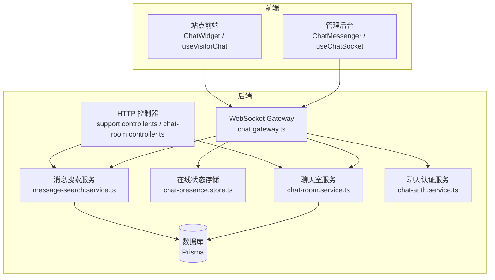
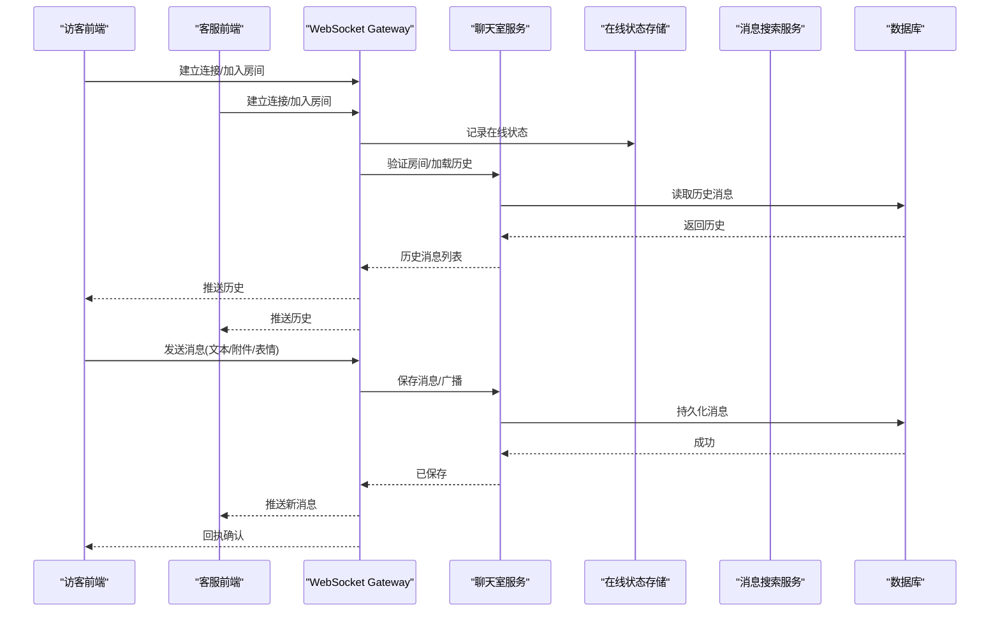
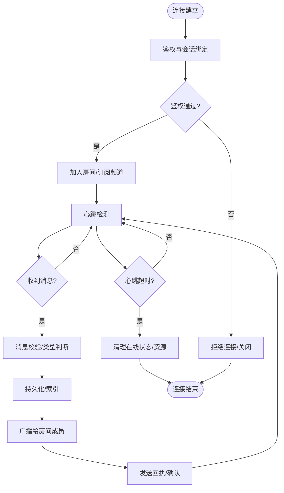
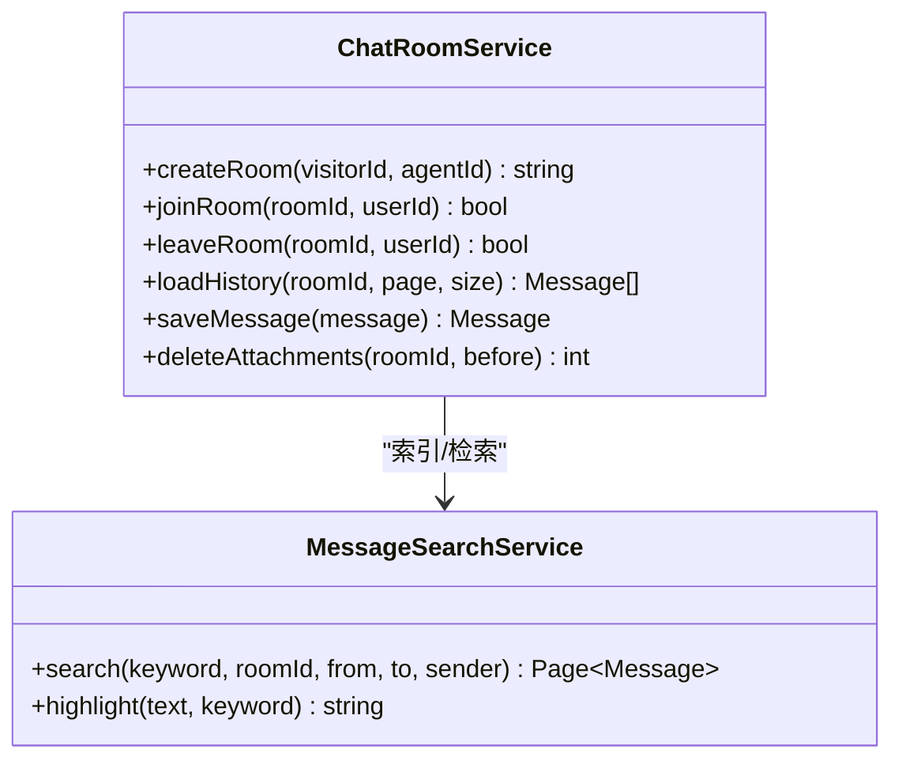
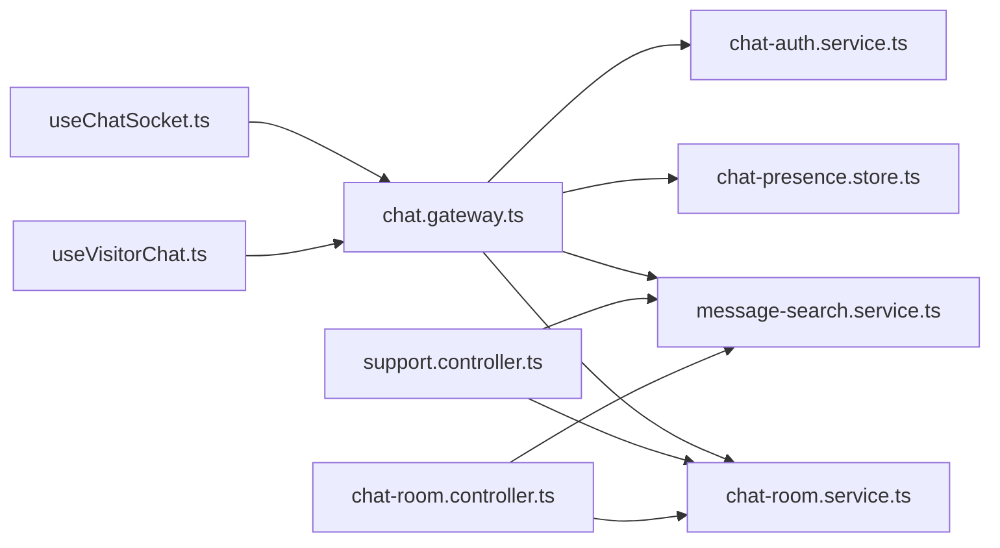

# 实时聊天系统

<cite>
**本文档引用的文件**   
- [chat.gateway.ts](file://apps/api/src/support/chat.gateway.ts)
- [chat-room.service.ts](file://apps/api/src/support/chat-room.service.ts)
- [chat-presence.store.ts](file://apps/api/src/support/chat-presence.store.ts)
- [message-search.service.ts](file://apps/api/src/support/message-search.service.ts)
- [chat-auth.service.ts](file://apps/api/src/support/chat-auth.service.ts)
- [support.controller.ts](file://apps/api/src/support/support.controller.ts)
- [chat-room.controller.ts](file://apps/api/src/support/chat-room.controller.ts)
- [schema.prisma](file://apps/api/prisma/schema.prisma)
- [ChatMessenger.tsx](file://apps/admin/src/features/chat/ChatMessenger.tsx)
- [useChatSocket.ts](file://apps/admin/src/features/chat/useChatSocket.ts)
- [api.ts](file://apps/admin/src/features/chat/api.ts)
- [types.ts](file://apps/admin/src/features/chat/types.ts)
- [ChatWidget.tsx](file://apps/web/src/components/chat/ChatWidget.tsx)
- [useVisitorChat.ts](file://apps/web/src/features/chat/useVisitorChat.ts)
- [presence.ts](file://apps/web/src/features/chat/presence.ts)
- [api.ts](file://apps/web/src/features/chat/api.ts)
- [EmojiPicker.tsx](file://apps/web/src/components/chat/EmojiPicker.tsx)
- [seed-chat-mock.ts](file://apps/api/scripts/seed-chat-mock.ts)
</cite>

## 目录
1. [简介](#简介)
2. [项目结构](#项目结构)
3. [核心组件](#核心组件)
4. [架构总览](#架构总览)
5. [详细组件分析](#详细组件分析)
6. [依赖关系分析](#依赖关系分析)
7. [性能考量](#性能考量)
8. [故障排查指南](#故障排查指南)
9. [结论](#结论)
10. [附录](#附录)

## 简介
本文件为基于 WebSocket 的实时聊天系统的完整技术文档，覆盖聊天室管理、消息收发、在线状态同步与消息持久化；同时包含访客识别、会话管理、消息搜索与历史记录能力。文档还解释前后端 Socket 连接管理、断线重连、消息确认与错误处理机制，并给出聊天界面组件、消息渲染、表情支持与文件附件功能的实现要点，为客服系统与访客互动提供端到端的实时通信解决方案。

## 项目结构
本项目采用多应用（Monorepo）组织：
- apps/api：NestJS 后端服务，包含 WebSocket Gateway、聊天室服务、在线状态存储、消息搜索、认证与控制器等。
- apps/admin：管理后台前端，集成聊天工作台、Socket Hook、API 封装与类型定义。
- apps/web：站点前端，集成访客聊天小部件、访客侧 Socket Hook、在线状态与 API。
- apps/api/prisma：数据库模型与迁移，包含聊天相关实体定义。
- scripts：数据初始化脚本，含聊天模拟数据生成。

图表来源
- [chat.gateway.ts](file://apps/api/src/support/chat.gateway.ts)
- [chat-room.service.ts](file://apps/api/src/support/chat-room.service.ts)
- [chat-presence.store.ts](file://apps/api/src/support/chat-presence.store.ts)
- [message-search.service.ts](file://apps/api/src/support/message-search.service.ts)
- [support.controller.ts](file://apps/api/src/support/support.controller.ts)
- [chat-room.controller.ts](file://apps/api/src/support/chat-room.controller.ts)
- [schema.prisma](file://apps/api/prisma/schema.prisma)

章节来源
- [chat.gateway.ts](file://apps/api/src/support/chat.gateway.ts)
- [chat-room.service.ts](file://apps/api/src/support/chat-room.service.ts)
- [chat-presence.store.ts](file://apps/api/src/support/chat-presence.store.ts)
- [message-search.service.ts](file://apps/api/src/support/message-search.service.ts)
- [support.controller.ts](file://apps/api/src/support/support.controller.ts)
- [chat-room.controller.ts](file://apps/api/src/support/chat-room.controller.ts)
- [schema.prisma](file://apps/api/prisma/schema.prisma)

## 核心组件
- WebSocket Gateway：负责建立/维护 WebSocket 连接、事件路由、权限校验、消息广播与在线状态同步。
- 聊天室服务：聊天室生命周期管理、成员进出、历史消息加载、消息落库与清理。
- 在线状态存储：维护访客/客服在线状态、房间可见性、心跳检测与离线清理。
- 消息搜索服务：按关键词、时间范围、发送者等维度检索消息，支持分页与高亮。
- 聊天认证服务：对访客与客服进行身份校验、令牌签发与会话绑定。
- HTTP 控制器：暴露 REST 接口用于创建/加入聊天室、上传附件、查询历史与搜索。
- 前端 Socket Hook：封装连接、重连、事件订阅、消息确认与错误处理。
- 聊天界面组件：消息渲染、表情选择、文件附件上传与预览。

章节来源
- [chat.gateway.ts](file://apps/api/src/support/chat.gateway.ts)
- [chat-room.service.ts](file://apps/api/src/support/chat-room.service.ts)
- [chat-presence.store.ts](file://apps/api/src/support/chat-presence.store.ts)
- [message-search.service.ts](file://apps/api/src/support/message-search.service.ts)
- [chat-auth.service.ts](file://apps/api/src/support/chat-auth.service.ts)
- [support.controller.ts](file://apps/api/src/support/support.controller.ts)
- [chat-room.controller.ts](file://apps/api/src/support/chat-room.controller.ts)
- [useChatSocket.ts](file://apps/admin/src/features/chat/useChatSocket.ts)
- [useVisitorChat.ts](file://apps/web/src/features/chat/useVisitorChat.ts)
- [ChatWidget.tsx](file://apps/web/src/components/chat/ChatWidget.tsx)
- [EmojiPicker.tsx](file://apps/web/src/components/chat/EmojiPicker.tsx)

## 架构总览
系统采用“前端 WebSocket + NestJS Gateway + 服务层 + 数据库”的分层架构。Gateway 作为实时通信入口，将事件分发到对应服务；服务层负责业务逻辑与数据持久化；前端通过 Hook 统一管理与后端的连接与事件流。

图表来源
- [chat.gateway.ts](file://apps/api/src/support/chat.gateway.ts)
- [chat-room.service.ts](file://apps/api/src/support/chat-room.service.ts)
- [chat-presence.store.ts](file://apps/api/src/support/chat-presence.store.ts)
- [message-search.service.ts](file://apps/api/src/support/message-search.service.ts)
- [schema.prisma](file://apps/api/prisma/schema.prisma)

## 详细组件分析

### WebSocket Gateway（实时通信中枢）
- 职责：连接生命周期管理、事件路由、权限校验、消息广播、在线状态同步、心跳与断线处理。
- 关键流程：
  - 握手与鉴权：解析 Token/会话信息，绑定用户角色（访客/客服）。
  - 房间管理：加入/离开房间，广播成员变更。
  - 消息处理：接收消息、校验内容、持久化、广播给房间内成员。
  - 状态同步：更新在线状态、心跳保活、超时清理。
  - 错误处理：捕获异常、返回标准化错误码、触发重连提示。

图表来源
- [chat.gateway.ts](file://apps/api/src/support/chat.gateway.ts)
- [chat-presence.store.ts](file://apps/api/src/support/chat-presence.store.ts)

章节来源
- [chat.gateway.ts](file://apps/api/src/support/chat.gateway.ts)
- [chat-presence.store.ts](file://apps/api/src/support/chat-presence.store.ts)

### 聊天室服务（会话与消息）
- 职责：聊天室创建/销毁、成员管理、历史消息加载与分页、消息落库、附件清理策略。
- 关键点：
  - 会话生命周期：根据访客标识与客服分配策略创建会话，支持转接与合并。
  - 消息持久化：结构化存储文本、附件、表情标记，确保可检索与回放。
  - 清理策略：过期附件删除、归档历史、冷热数据分离。

图表来源
- [chat-room.service.ts](file://apps/api/src/support/chat-room.service.ts)
- [message-search.service.ts](file://apps/api/src/support/message-search.service.ts)

章节来源
- [chat-room.service.ts](file://apps/api/src/support/chat-room.service.ts)
- [message-search.service.ts](file://apps/api/src/support/message-search.service.ts)

### 在线状态存储（Presence）
- 职责：维护访客/客服在线状态、房间可见性、心跳检测、离线清理。
- 关键点：
  - 使用内存或缓存存储活跃连接映射。
  - 定时任务扫描超时连接，释放资源并广播离线事件。
  - 支持跨进程共享（可扩展至 Redis）。

章节来源
- [chat-presence.store.ts](file://apps/api/src/support/chat-presence.store.ts)

### 消息搜索服务
- 职责：全文检索、条件过滤、分页、结果高亮。
- 关键点：
  - 索引构建：消息入库时异步构建倒排索引或写入搜索引擎。
  - 查询优化：关键词分词、时间范围与发送者过滤。
  - 结果展示：返回命中片段与上下文摘要。

章节来源
- [message-search.service.ts](file://apps/api/src/support/message-search.service.ts)

### 聊天认证服务
- 职责：访客匿名/实名识别、客服令牌校验、会话绑定与权限控制。
- 关键点：
  - 访客识别：基于设备指纹、IP、首次访问标记生成唯一 ID。
  - 客服认证：JWT 校验、角色与权限检查。
  - 会话绑定：将连接与房间/会话关联，限制越权访问。

章节来源
- [chat-auth.service.ts](file://apps/api/src/support/chat-auth.service.ts)

### HTTP 控制器（REST 接口）
- 职责：聊天室 CRUD、附件上传、历史查询、搜索接口。
- 关键点：
  - 安全校验：鉴权中间件、参数校验、速率限制。
  - 响应格式：统一错误码与消息体结构。
  - 文件处理：分片上传、大小限制、病毒扫描（可选）。

章节来源
- [support.controller.ts](file://apps/api/src/support/support.controller.ts)
- [chat-room.controller.ts](file://apps/api/src/support/chat-room.controller.ts)

### 前端 Socket Hook（管理后台）
- 职责：连接管理、自动重连、事件订阅、消息确认、错误处理。
- 关键点：
  - 指数退避重连：失败重试间隔递增，避免雪崩。
  - 事件去抖与节流：高频事件（如输入中）节流，减少带宽。
  - 消息确认：服务端回执驱动 UI 状态（发送中/已送达/已读）。

章节来源
- [useChatSocket.ts](file://apps/admin/src/features/chat/useChatSocket.ts)
- [api.ts](file://apps/admin/src/features/chat/api.ts)
- [types.ts](file://apps/admin/src/features/chat/types.ts)

### 前端聊天组件（管理后台）
- 职责：聊天工作台、消息渲染、表情插入、附件上传与预览。
- 关键点：
  - 消息渲染：支持富文本、图片、视频、文件链接。
  - 表情支持：本地表情面板与自定义表情扩展。
  - 附件上传：拖拽上传、进度条、失败重试。

章节来源
- [ChatMessenger.tsx](file://apps/admin/src/features/chat/ChatMessenger.tsx)

### 前端 Socket Hook（站点访客）
- 职责：轻量级连接、自动重连、事件订阅、最小化状态管理。
- 关键点：
  - 低开销设计：按需订阅频道，减少不必要事件。
  - 离线队列：网络恢复后补发未确认消息。
  - 隐私保护：不持久化敏感数据，页面卸载清理。

章节来源
- [useVisitorChat.ts](file://apps/web/src/features/chat/useVisitorChat.ts)
- [presence.ts](file://apps/web/src/features/chat/presence.ts)
- [api.ts](file://apps/web/src/features/chat/api.ts)

### 前端聊天组件（站点访客）
- 职责：聊天小部件、消息渲染、表情选择、附件上传。
- 关键点：
  - 嵌入友好：iframe 或 JS SDK 形式注入站点。
  - 主题适配：跟随站点样式，支持暗色模式。
  - 无障碍：键盘导航、屏幕阅读器兼容。

章节来源
- [ChatWidget.tsx](file://apps/web/src/components/chat/ChatWidget.tsx)
- [EmojiPicker.tsx](file://apps/web/src/components/chat/EmojiPicker.tsx)

## 依赖关系分析
- Gateway 依赖聊天室服务、在线状态存储、消息搜索服务与认证服务。
- 控制器依赖聊天室服务与消息搜索服务。
- 前端 Hook 依赖各自模块的 API 封装与类型定义。
- 数据库通过 Prisma 抽象，所有读写操作由服务层统一封装。

图表来源
- [chat.gateway.ts](file://apps/api/src/support/chat.gateway.ts)
- [chat-room.service.ts](file://apps/api/src/support/chat-room.service.ts)
- [chat-presence.store.ts](file://apps/api/src/support/chat-presence.store.ts)
- [message-search.service.ts](file://apps/api/src/support/message-search.service.ts)
- [chat-auth.service.ts](file://apps/api/src/support/chat-auth.service.ts)
- [support.controller.ts](file://apps/api/src/support/support.controller.ts)
- [chat-room.controller.ts](file://apps/api/src/support/chat-room.controller.ts)
- [useChatSocket.ts](file://apps/admin/src/features/chat/useChatSocket.ts)
- [useVisitorChat.ts](file://apps/web/src/features/chat/useVisitorChat.ts)

章节来源
- [chat.gateway.ts](file://apps/api/src/support/chat.gateway.ts)
- [chat-room.service.ts](file://apps/api/src/support/chat-room.service.ts)
- [chat-presence.store.ts](file://apps/api/src/support/chat-presence.store.ts)
- [message-search.service.ts](file://apps/api/src/support/message-search.service.ts)
- [chat-auth.service.ts](file://apps/api/src/support/chat-auth.service.ts)
- [support.controller.ts](file://apps/api/src/support/support.controller.ts)
- [chat-room.controller.ts](file://apps/api/src/support/chat-room.controller.ts)
- [useChatSocket.ts](file://apps/admin/src/features/chat/useChatSocket.ts)
- [useVisitorChat.ts](file://apps/web/src/features/chat/useVisitorChat.ts)

## 性能考量
- 连接与事件：
  - 使用连接池与批量广播，降低 CPU 与内存占用。
  - 事件去抖/节流，避免高频输入导致风暴。
- 消息持久化：
  - 异步写入与索引构建，主路径仅做必要校验与快速返回。
  - 冷热数据分离：热数据缓存，冷数据归档。
- 在线状态：
  - 内存/缓存存储活跃映射，定期清理超时连接。
  - 心跳间隔可调，平衡实时性与资源消耗。
- 前端优化：
  - 虚拟滚动渲染长列表，减少 DOM 压力。
  - 图片懒加载与压缩，附件分块上传。

[本节为通用指导，无需特定文件引用]

## 故障排查指南
- 连接问题：
  - 检查 Gateway 健康状态与端口可达性。
  - 查看浏览器控制台与网络面板，确认 WebSocket 握手成功。
  - 启用调试日志，定位鉴权失败或房间不存在错误。
- 消息丢失：
  - 核对消息回执与本地队列状态。
  - 检查数据库写入与索引构建是否成功。
  - 验证附件上传与 CDN 回源是否正常。
- 在线状态异常：
  - 检查心跳间隔与超时阈值配置。
  - 确认在线状态存储是否被正确清理。
- 搜索不可用：
  - 验证索引构建任务是否运行。
  - 检查搜索服务的查询语法与权限。

章节来源
- [chat.gateway.ts](file://apps/api/src/support/chat.gateway.ts)
- [chat-room.service.ts](file://apps/api/src/support/chat-room.service.ts)
- [chat-presence.store.ts](file://apps/api/src/support/chat-presence.store.ts)
- [message-search.service.ts](file://apps/api/src/support/message-search.service.ts)

## 结论
本实时聊天系统以 NestJS WebSocket Gateway 为核心，结合聊天室服务、在线状态存储、消息搜索与认证服务，构建了完整的客服与访客互动方案。前端通过统一的 Socket Hook 与组件封装，实现了稳定的连接管理、消息确认与丰富的交互体验。系统在性能、可靠性与可扩展性方面具备良好基础，适合在生产环境部署与持续演进。

[本节为总结性内容，无需特定文件引用]

## 附录
- 数据模型概览（Prisma）：
  - 聊天室、消息、访客、客服、附件等实体定义与关系。
- 测试与模拟：
  - 聊天模拟数据生成脚本，便于开发与演示。

章节来源
- [schema.prisma](file://apps/api/prisma/schema.prisma)
- [seed-chat-mock.ts](file://apps/api/scripts/seed-chat-mock.ts)