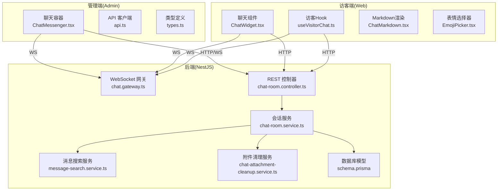
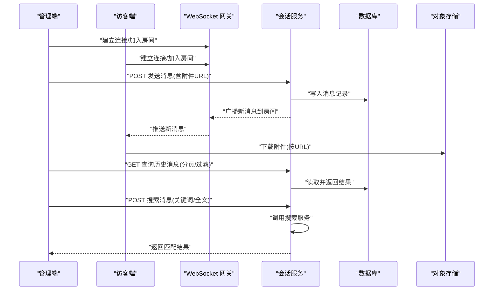
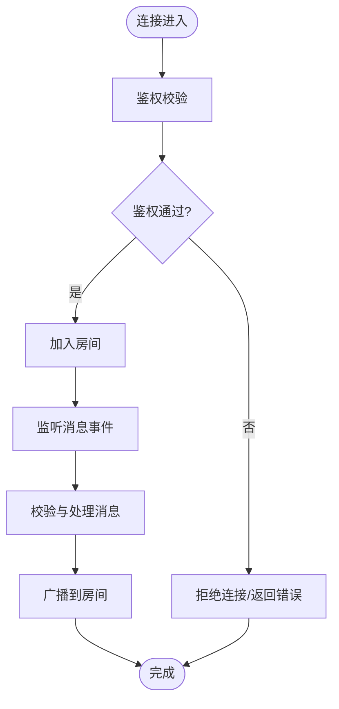
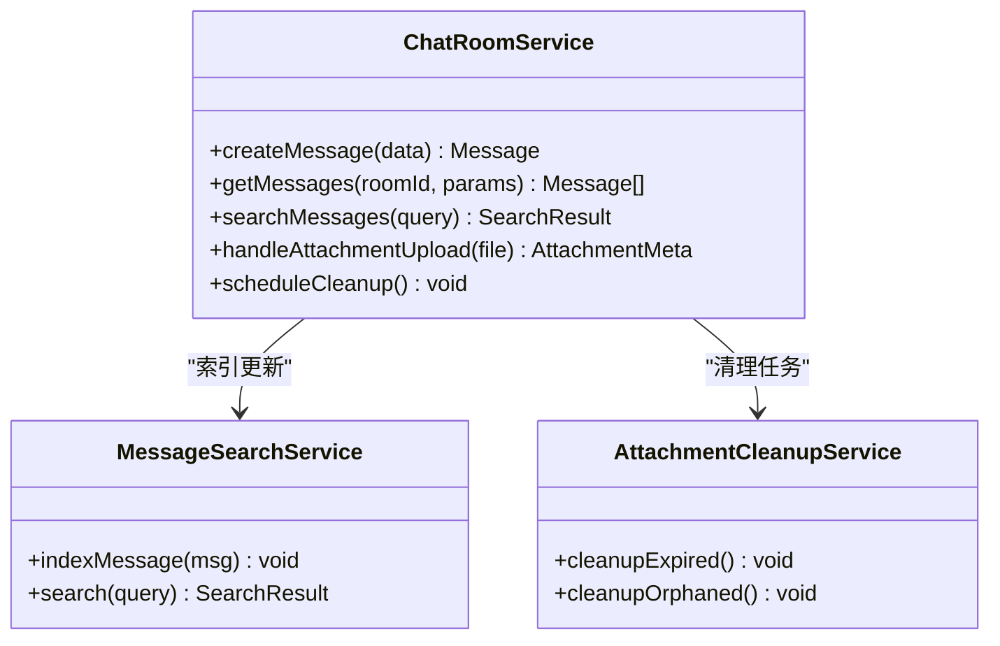
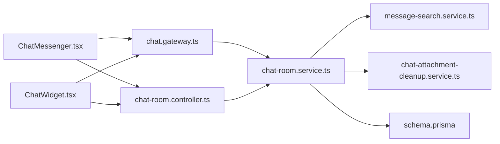

# 消息处理系统

<cite>
**本文引用的文件**   
- [apps/api/src/support/chat.gateway.ts](file://apps/api/src/support/chat.gateway.ts)
- [apps/api/src/support/chat-room.service.ts](file://apps/api/src/support/chat-room.service.ts)
- [apps/api/src/support/chat-room.controller.ts](file://apps/api/src/support/chat-room.controller.ts)
- [apps/api/src/support/message-search.service.ts](file://apps/api/src/support/message-search.service.ts)
- [apps/api/src/support/chat-attachment-cleanup.service.ts](file://apps/api/src/support/chat-attachment-cleanup.service.ts)
- [apps/api/src/support/support.module.ts](file://apps/api/src/support/support.module.ts)
- [apps/api/src/support/support.controller.ts](file://apps/api/src/support/support.controller.ts)
- [apps/api/src/support/support.service.ts](file://apps/api/src/support/support.service.ts)
- [apps/api/src/support/dto/chat-room.dto.ts](file://apps/api/src/support/dto/chat-room.dto.ts)
- [apps/admin/src/features/chat/types.ts](file://apps/admin/src/features/chat/types.ts)
- [apps/admin/src/features/chat/api.ts](file://apps/admin/src/features/chat/api.ts)
- [apps/admin/src/features/chat/ChatMessenger.tsx](file://apps/admin/src/features/chat/ChatMessenger.tsx)
- [apps/admin/src/features/chat/components/index.ts](file://apps/admin/src/features/chat/components/index.ts)
- [apps/web/src/features/chat/types.ts](file://apps/web/src/features/chat/types.ts)
- [apps/web/src/features/chat/useVisitorChat.ts](file://apps/web/src/features/chat/useVisitorChat.ts)
- [apps/web/src/components/chat/ChatWidget.tsx](file://apps/web/src/components/chat/ChatWidget.tsx)
- [apps/web/src/components/chat/ChatMarkdown.tsx](file://apps/web/src/components/chat/ChatMarkdown.tsx)
- [apps/web/src/components/chat/EmojiPicker.tsx](file://apps/web/src/components/chat/EmojiPicker.tsx)
- [apps/api/prisma/schema.prisma](file://apps/api/prisma/schema.prisma)
</cite>

## 目录
1. [简介](#简介)
2. [项目结构](#项目结构)
3. [核心组件](#核心组件)
4. [架构总览](#架构总览)
5. [详细组件分析](#详细组件分析)
6. [依赖关系分析](#依赖关系分析)
7. [性能考虑](#性能考虑)
8. [故障排查指南](#故障排查指南)
9. [结论](#结论)
10. [附录](#附录)

## 简介
本文件面向“消息处理系统”的完整实现与使用，覆盖消息的发送、接收、存储与检索机制；说明支持的消息类型（文本、图片、文件等）、消息格式规范与富媒体处理流程；介绍消息搜索能力（关键词与全文检索）及性能优化策略；阐述附件管理（上传、下载、清理策略）；并提供消息渲染组件的使用方法与自定义扩展指南。文档同时兼顾非技术读者，通过图示与分层说明帮助快速理解与上手。

## 项目结构
消息处理系统横跨后端 NestJS 模块、前端管理端与访客端三个部分：
- 后端（NestJS）
  - WebSocket 网关负责实时消息收发与会话状态同步
  - REST 控制器与服务层负责会话生命周期、消息持久化、附件管理与搜索
  - Prisma 数据模型定义消息与附件相关表结构
- 管理端（Next.js Admin）
  - ChatMessenger 作为聊天主容器，集成消息列表、输入框、附件选择与预览
  - API 客户端封装与类型定义，统一调用后端接口
- 访客端（Next.js Web）
  - ChatWidget 嵌入站点，提供轻量聊天入口
  - useVisitorChat Hook 管理连接与事件回调
  - ChatMarkdown 与 EmojiPicker 用于内容渲染与表情输入

图表来源
- [apps/api/src/support/chat.gateway.ts](file://apps/api/src/support/chat.gateway.ts)
- [apps/api/src/support/chat-room.service.ts](file://apps/api/src/support/chat-room.service.ts)
- [apps/api/src/support/chat-room.controller.ts](file://apps/api/src/support/chat-room.controller.ts)
- [apps/api/src/support/message-search.service.ts](file://apps/api/src/support/message-search.service.ts)
- [apps/api/src/support/chat-attachment-cleanup.service.ts](file://apps/api/src/support/chat-attachment-cleanup.service.ts)
- [apps/api/prisma/schema.prisma](file://apps/api/prisma/schema.prisma)
- [apps/admin/src/features/chat/ChatMessenger.tsx](file://apps/admin/src/features/chat/ChatMessenger.tsx)
- [apps/admin/src/features/chat/api.ts](file://apps/admin/src/features/chat/api.ts)
- [apps/admin/src/features/chat/types.ts](file://apps/admin/src/features/chat/types.ts)
- [apps/web/src/components/chat/ChatWidget.tsx](file://apps/web/src/components/chat/ChatWidget.tsx)
- [apps/web/src/features/chat/useVisitorChat.ts](file://apps/web/src/features/chat/useVisitorChat.ts)
- [apps/web/src/components/chat/ChatMarkdown.tsx](file://apps/web/src/components/chat/ChatMarkdown.tsx)
- [apps/web/src/components/chat/EmojiPicker.tsx](file://apps/web/src/components/chat/EmojiPicker.tsx)

章节来源
- [apps/api/src/support/support.module.ts](file://apps/api/src/support/support.module.ts)
- [apps/api/src/support/support.controller.ts](file://apps/api/src/support/support.controller.ts)
- [apps/api/src/support/support.service.ts](file://apps/api/src/support/support.service.ts)

## 核心组件
- WebSocket 网关：负责建立连接、鉴权、房间广播、在线状态与心跳检测
- 会话服务：封装消息创建、查询、分页、富媒体处理、附件生命周期与搜索索引更新
- REST 控制器：暴露会话管理、消息读写、附件上传下载的 HTTP 接口
- 消息搜索服务：基于关键词与全文检索能力，提供高效查询
- 附件清理服务：定时或触发式清理过期/无用附件，释放存储空间
- 前端聊天容器与组件：管理 UI 状态、事件绑定、消息渲染与扩展点

章节来源
- [apps/api/src/support/chat.gateway.ts](file://apps/api/src/support/chat.gateway.ts)
- [apps/api/src/support/chat-room.service.ts](file://apps/api/src/support/chat-room.service.ts)
- [apps/api/src/support/chat-room.controller.ts](file://apps/api/src/support/chat-room.controller.ts)
- [apps/api/src/support/message-search.service.ts](file://apps/api/src/support/message-search.service.ts)
- [apps/api/src/support/chat-attachment-cleanup.service.ts](file://apps/api/src/support/chat-attachment-cleanup.service.ts)

## 架构总览
消息处理采用“前后端分离 + 实时通信”的架构：
- 管理端与访客端通过 WebSocket 与网关交互，实现低延迟消息推送
- 所有消息落库由服务层统一处理，确保一致性与可追溯性
- 附件通过独立存储服务（如对象存储）管理，数据库仅保存元数据
- 搜索服务对消息内容进行索引，支持关键词与全文检索

图表来源
- [apps/api/src/support/chat.gateway.ts](file://apps/api/src/support/chat.gateway.ts)
- [apps/api/src/support/chat-room.service.ts](file://apps/api/src/support/chat-room.service.ts)
- [apps/api/src/support/chat-room.controller.ts](file://apps/api/src/support/chat-room.controller.ts)
- [apps/api/src/support/message-search.service.ts](file://apps/api/src/support/message-search.service.ts)
- [apps/api/prisma/schema.prisma](file://apps/api/prisma/schema.prisma)

## 详细组件分析

### WebSocket 网关（实时消息通道）
职责
- 连接建立与鉴权校验
- 房间加入/离开与在线成员管理
- 消息广播与错误回传
- 心跳保活与断线重连提示

关键流程
- 客户端连接后携带 token 或会话标识进行鉴权
- 根据会话ID加入对应房间
- 收到消息后校验权限与格式，转发给房间内其他成员
- 处理离线与异常断开，必要时触发重连逻辑

图表来源
- [apps/api/src/support/chat.gateway.ts](file://apps/api/src/support/chat.gateway.ts)

章节来源
- [apps/api/src/support/chat.gateway.ts](file://apps/api/src/support/chat.gateway.ts)

### 会话服务（消息与附件编排）
职责
- 消息的创建、查询、分页与过滤
- 富媒体处理（图片、文件、音视频）
- 附件上传下载协调与元数据维护
- 搜索索引更新与清理任务调度

数据结构与复杂度
- 消息实体包含类型、内容、附件列表、时间戳、会话ID等字段
- 分页查询通常采用游标或偏移量，避免深翻页性能问题
- 全文检索建议引入倒排索引或搜索引擎（如 ES），提升大规模数据下的查询效率

图表来源
- [apps/api/src/support/chat-room.service.ts](file://apps/api/src/support/chat-room.service.ts)
- [apps/api/src/support/message-search.service.ts](file://apps/api/src/support/message-search.service.ts)
- [apps/api/src/support/chat-attachment-cleanup.service.ts](file://apps/api/src/support/chat-attachment-cleanup.service.ts)

章节来源
- [apps/api/src/support/chat-room.service.ts](file://apps/api/src/support/chat-room.service.ts)
- [apps/api/src/support/message-search.service.ts](file://apps/api/src/support/message-search.service.ts)
- [apps/api/src/support/chat-attachment-cleanup.service.ts](file://apps/api/src/support/chat-attachment-cleanup.service.ts)

### REST 控制器（HTTP 接口）
职责
- 会话生命周期管理（创建、关闭、归档）
- 消息读写接口（发送、获取历史、分页、过滤）
- 附件上传下载接口（分片、校验、签名）
- 搜索接口（关键词、全文、高亮）

典型接口
- POST /support/chat/messages：发送消息
- GET /support/chat/messages?roomId=...&page=...：获取历史消息
- POST /support/chat/search：执行搜索
- POST /support/chat/attachments/upload：上传附件
- GET /support/chat/attachments/:id/download：下载附件

章节来源
- [apps/api/src/support/chat-room.controller.ts](file://apps/api/src/support/chat-room.controller.ts)

### 管理端聊天容器（Admin ChatMessenger）
职责
- 管理消息列表、输入框、附件选择与预览
- 订阅 WebSocket 事件，渲染不同类型消息
- 调用 API 客户端进行消息发送与历史加载
- 提供扩展点以接入自定义消息类型与渲染组件

使用要点
- 初始化时传入会话ID与鉴权信息
- 监听消息到达事件，自动滚动到底部
- 支持拖拽上传与图片预览
- 可通过插槽或配置注入自定义渲染器

章节来源
- [apps/admin/src/features/chat/ChatMessenger.tsx](file://apps/admin/src/features/chat/ChatMessenger.tsx)
- [apps/admin/src/features/chat/api.ts](file://apps/admin/src/features/chat/api.ts)
- [apps/admin/src/features/chat/types.ts](file://apps/admin/src/features/chat/types.ts)
- [apps/admin/src/features/chat/components/index.ts](file://apps/admin/src/features/chat/components/index.ts)

### 访客端聊天组件（Web ChatWidget）
职责
- 在站点页面中嵌入轻量聊天入口
- 管理连接状态与消息展示
- 提供最小化的输入与发送能力
- 适配移动端与不同屏幕尺寸

章节来源
- [apps/web/src/components/chat/ChatWidget.tsx](file://apps/web/src/components/chat/ChatWidget.tsx)
- [apps/web/src/features/chat/useVisitorChat.ts](file://apps/web/src/features/chat/useVisitorChat.ts)
- [apps/web/src/features/chat/types.ts](file://apps/web/src/features/chat/types.ts)

### 消息渲染与富媒体（ChatMarkdown、EmojiPicker）
职责
- Markdown 渲染：支持基础语法与代码块高亮
- 表情选择器：提供常用表情与自定义表情集
- 富媒体预览：图片缩略图、文件图标与下载链接

扩展方式
- 注册新的渲染器以支持自定义消息类型
- 通过主题与样式覆盖调整外观
- 插入第三方插件（如数学公式、流程图）

章节来源
- [apps/web/src/components/chat/ChatMarkdown.tsx](file://apps/web/src/components/chat/ChatMarkdown.tsx)
- [apps/web/src/components/chat/EmojiPicker.tsx](file://apps/web/src/components/chat/EmojiPicker.tsx)

## 依赖关系分析
- 网关依赖服务层进行业务编排，服务层依赖数据库与搜索服务
- 控制器解耦于网关，提供 HTTP 访问路径
- 前端组件依赖类型定义与 API 客户端，保证类型安全
- 附件清理服务由定时任务或事件触发，降低人工干预

图表来源
- [apps/api/src/support/chat.gateway.ts](file://apps/api/src/support/chat.gateway.ts)
- [apps/api/src/support/chat-room.service.ts](file://apps/api/src/support/chat-room.service.ts)
- [apps/api/src/support/chat-room.controller.ts](file://apps/api/src/support/chat-room.controller.ts)
- [apps/api/src/support/message-search.service.ts](file://apps/api/src/support/message-search.service.ts)
- [apps/api/src/support/chat-attachment-cleanup.service.ts](file://apps/api/src/support/chat-attachment-cleanup.service.ts)
- [apps/api/prisma/schema.prisma](file://apps/api/prisma/schema.prisma)
- [apps/admin/src/features/chat/ChatMessenger.tsx](file://apps/admin/src/features/chat/ChatMessenger.tsx)
- [apps/web/src/components/chat/ChatWidget.tsx](file://apps/web/src/components/chat/ChatWidget.tsx)

章节来源
- [apps/api/src/support/support.module.ts](file://apps/api/src/support/support.module.ts)

## 性能考虑
- 分页与游标：避免深翻页，优先使用游标或时间戳排序
- 索引优化：为高频查询字段（会话ID、时间戳、消息类型）建立索引
- 全文检索：引入搜索引擎（如 Elasticsearch）或数据库全文索引，减少全表扫描
- 缓存策略：热点会话消息短期缓存（Redis），降低数据库压力
- 附件处理：大文件分片上传、异步转码与缩略图生成，CDN 加速下载
- 连接管理：心跳检测与断线重连，限制单用户并发连接数
- 批量操作：批量写入与批量删除，减少事务开销

[本节为通用指导，不直接分析具体文件]

## 故障排查指南
常见问题与定位方法
- 连接失败：检查鉴权参数、网络连通与防火墙规则
- 消息未送达：确认房间ID正确、网关广播逻辑正常、客户端订阅事件
- 附件无法下载：验证对象存储权限、URL 有效期与跨域设置
- 搜索无结果：检查索引是否构建成功、关键词分词是否正确
- 内存占用过高：排查大消息体、未释放的附件句柄与未关闭的连接

排查步骤
- 查看网关日志与错误码，定位连接与事件处理异常
- 检查服务层事务与数据库锁，确认写入一致性
- 验证搜索服务的索引状态与查询语句
- 监控对象存储的访问日志与配额使用情况

章节来源
- [apps/api/src/support/chat.gateway.ts](file://apps/api/src/support/chat.gateway.ts)
- [apps/api/src/support/chat-room.service.ts](file://apps/api/src/support/chat-room.service.ts)
- [apps/api/src/support/message-search.service.ts](file://apps/api/src/support/message-search.service.ts)
- [apps/api/src/support/chat-attachment-cleanup.service.ts](file://apps/api/src/support/chat-attachment-cleanup.service.ts)

## 结论
本消息处理系统通过 WebSocket 网关与 REST 控制器协同，实现了高效的实时消息收发与可靠的持久化存储。结合搜索服务与附件管理，满足多类型消息与富媒体场景需求。前端组件提供可扩展的渲染与交互能力，便于定制与集成。在生产环境中，应重点关注性能优化、索引建设与附件生命周期管理，以确保系统的稳定性与可维护性。

[本节为总结性内容，不直接分析具体文件]

## 附录

### 消息类型与格式规范
- 文本消息：纯文本与 Markdown 混排，支持换行与基础排版
- 图片消息：支持常见格式（PNG/JPG/WebP），提供缩略图与高清原图
- 文件消息：支持文档与压缩包，显示文件名、大小与下载链接
- 富媒体消息：音视频播放控件、预览与下载
- 消息结构：包含类型、内容、附件列表、时间戳、发送者标识与会话ID

章节来源
- [apps/api/prisma/schema.prisma](file://apps/api/prisma/schema.prisma)
- [apps/admin/src/features/chat/types.ts](file://apps/admin/src/features/chat/types.ts)
- [apps/web/src/features/chat/types.ts](file://apps/web/src/features/chat/types.ts)

### 消息搜索与全文检索
- 关键词搜索：支持标题、内容与标签匹配
- 全文检索：基于分词与权重排序，返回高亮片段
- 过滤条件：按会话、时间范围、消息类型与发送者筛选
- 性能优化：分页、缓存与增量索引更新

章节来源
- [apps/api/src/support/message-search.service.ts](file://apps/api/src/support/message-search.service.ts)

### 附件管理与清理策略
- 上传流程：分片上传、完整性校验、生成唯一 ID 与元数据
- 下载流程：签名 URL、权限校验、CDN 缓存命中
- 清理策略：定期清理过期与孤立附件，释放存储空间
- 监控告警：存储用量阈值与失败重试机制

章节来源
- [apps/api/src/support/chat-attachment-cleanup.service.ts](file://apps/api/src/support/chat-attachment-cleanup.service.ts)

### 消息渲染组件使用与扩展
- 使用方法：在聊天容器中配置渲染器与样式主题
- 自定义扩展：注册新消息类型与渲染组件，覆盖默认行为
- 国际化：支持多语言文案与本地化资源
- 无障碍：提供键盘导航与屏幕阅读器支持

章节来源
- [apps/web/src/components/chat/ChatMarkdown.tsx](file://apps/web/src/components/chat/ChatMarkdown.tsx)
- [apps/web/src/components/chat/EmojiPicker.tsx](file://apps/web/src/components/chat/EmojiPicker.tsx)
- [apps/admin/src/features/chat/ChatMessenger.tsx](file://apps/admin/src/features/chat/ChatMessenger.tsx)