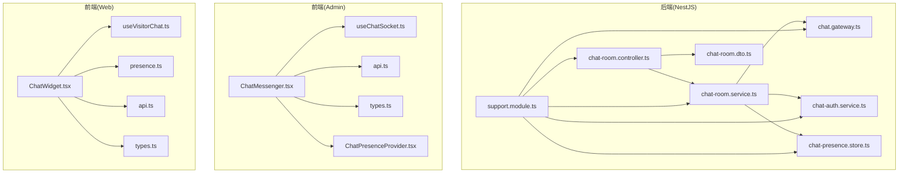
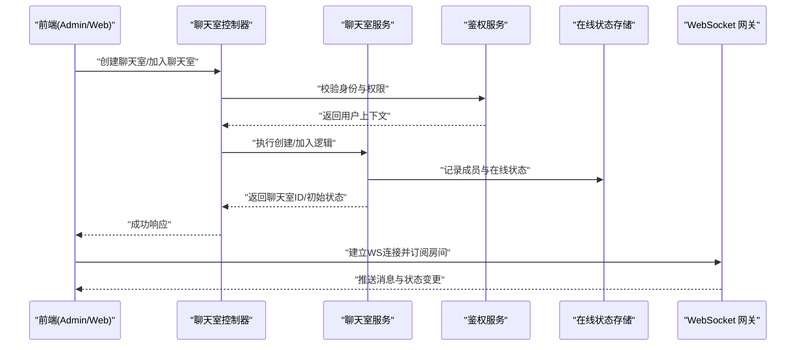
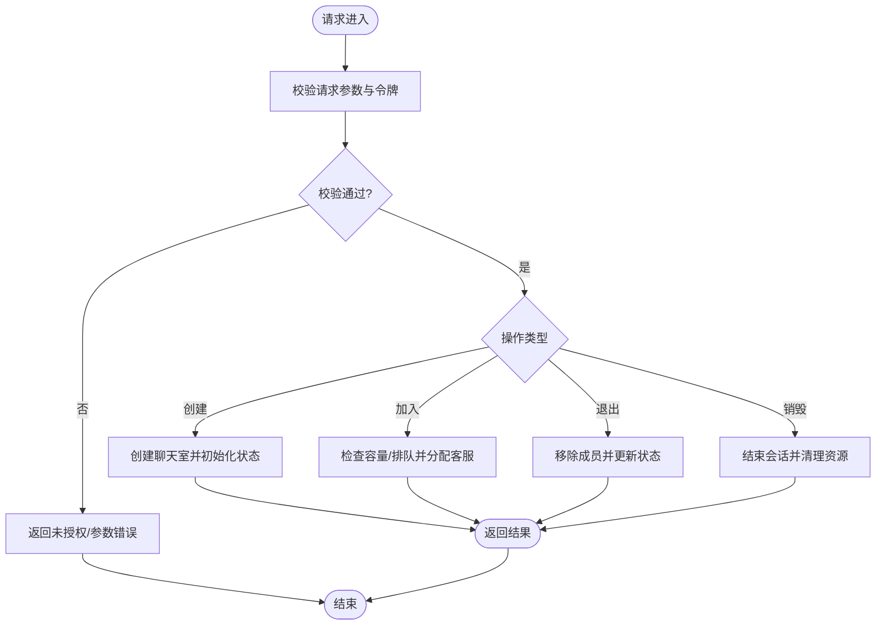
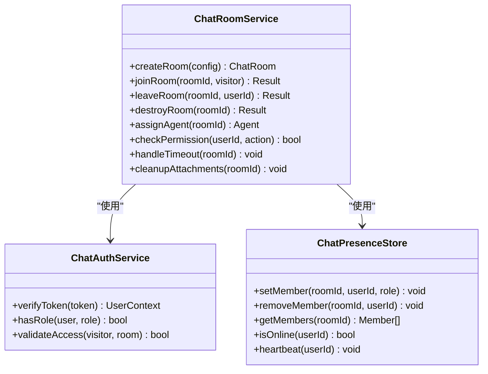
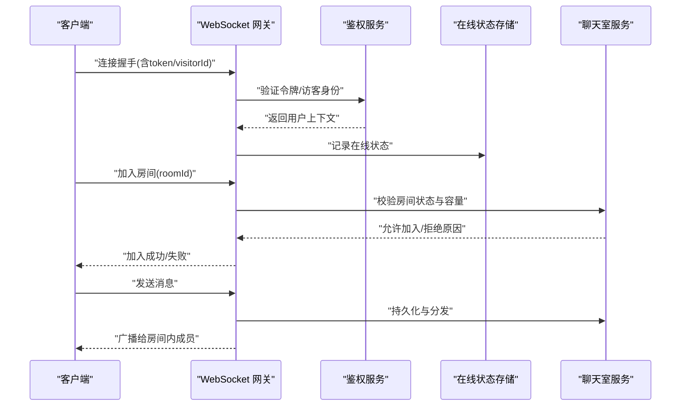
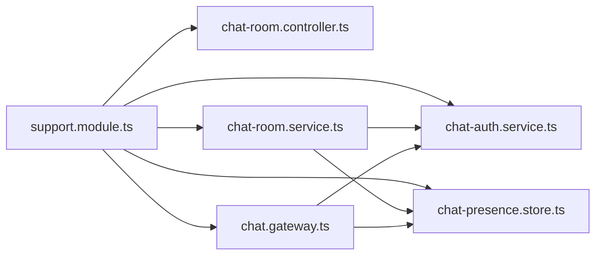

# 聊天室管理

<cite>
**本文引用的文件**   
- [chat-room.controller.ts](file://apps/api/src/support/chat-room.controller.ts)
- [chat-room.service.ts](file://apps/api/src/support/chat-room.service.ts)
- [chat.gateway.ts](file://apps/api/src/support/chat.gateway.ts)
- [chat-auth.service.ts](file://apps/api/src/support/chat-auth.service.ts)
- [chat-presence.store.ts](file://apps/api/src/support/chat-presence.store.ts)
- [chat-panel.integration.spec.ts](file://apps/api/src/support/chat-panel.integration.spec.ts)
- [chat-conversation-lifecycle.integration.spec.ts](file://apps/api/src/support/chat-conversation-lifecycle.integration.spec.ts)
- [agent-presence-refresh.integration.spec.ts](file://apps/api/src/support/agent-presence-refresh.integration.spec.ts)
- [visitor-presence.spec.ts](file://apps/api/src/support/visitor-presence.spec.ts)
- [chat-attachment-cleanup.service.ts](file://apps/api/src/support/chat-attachment-cleanup.service.ts)
- [message-search.service.ts](file://apps/api/src/support/message-search.service.ts)
- [support.module.ts](file://apps/api/src/support/support.module.ts)
- [chat-room.dto.ts](file://apps/api/src/support/dto/chat-room.dto.ts)
- [ChatMessenger.tsx](file://apps/admin/src/features/chat/ChatMessenger.tsx)
- [useChatSocket.ts](file://apps/admin/src/features/chat/useChatSocket.ts)
- [api.ts](file://apps/admin/src/features/chat/api.ts)
- [types.ts](file://apps/admin/src/features/chat/types.ts)
- [ChatPresenceProvider.tsx](file://apps/admin/src/features/chat/ChatPresenceProvider.tsx)
- [ChatWidget.tsx](file://apps/web/src/components/chat/ChatWidget.tsx)
- [useVisitorChat.ts](file://apps/web/src/features/chat/useVisitorChat.ts)
- [presence.ts](file://apps/web/src/features/chat/presence.ts)
- [api.ts](file://apps/web/src/features/chat/api.ts)
- [types.ts](file://apps/web/src/features/chat/types.ts)
</cite>

## 目录
1. [简介](#简介)
2. [项目结构](#项目结构)
3. [核心组件](#核心组件)
4. [架构总览](#架构总览)
5. [详细组件分析](#详细组件分析)
6. [依赖关系分析](#依赖关系分析)
7. [性能考虑](#性能考虑)
8. [故障排查指南](#故障排查指南)
9. [结论](#结论)
10. [附录](#附录)

## 简介
本文件面向“聊天室管理系统”的开发者与集成者，系统性说明聊天室的创建、加入、退出与销毁流程；解释访客与客服的配对机制、聊天室状态管理与生命周期控制；阐述权限控制、访问验证与安全策略；并给出配置项、会话超时处理与自动清理机制。文档同时提供后端 API 接口说明与前后端集成示例，帮助快速落地与排障。

## 项目结构
聊天室功能位于后端 support 模块与前端 admin/web 两个应用中：
- 后端（NestJS）
  - 控制器与服务：聊天室 HTTP API、业务逻辑、消息网关、鉴权与会话存在性存储等
  - DTO：请求/响应数据结构定义
  - 测试：面板集成、会话生命周期、在线状态刷新、访客在线等
- 前端（Next.js）
  - 管理端（admin）：客服工作台、WebSocket 连接封装、聊天 UI 与状态管理
  - 访客端（web）：站点内嵌聊天组件、访客侧 WebSocket 与状态管理

图表来源
- [chat-room.controller.ts](file://apps/api/src/support/chat-room.controller.ts)
- [chat-room.service.ts](file://apps/api/src/support/chat-room.service.ts)
- [chat.gateway.ts](file://apps/api/src/support/chat.gateway.ts)
- [chat-auth.service.ts](file://apps/api/src/support/chat-auth.service.ts)
- [chat-presence.store.ts](file://apps/api/src/support/chat-presence.store.ts)
- [chat-room.dto.ts](file://apps/api/src/support/dto/chat-room.dto.ts)
- [support.module.ts](file://apps/api/src/support/support.module.ts)
- [ChatMessenger.tsx](file://apps/admin/src/features/chat/ChatMessenger.tsx)
- [useChatSocket.ts](file://apps/admin/src/features/chat/useChatSocket.ts)
- [api.ts](file://apps/admin/src/features/chat/api.ts)
- [types.ts](file://apps/admin/src/features/chat/types.ts)
- [ChatPresenceProvider.tsx](file://apps/admin/src/features/chat/ChatPresenceProvider.tsx)
- [ChatWidget.tsx](file://apps/web/src/components/chat/ChatWidget.tsx)
- [useVisitorChat.ts](file://apps/web/src/features/chat/useVisitorChat.ts)
- [presence.ts](file://apps/web/src/features/chat/presence.ts)
- [api.ts](file://apps/web/src/features/chat/api.ts)
- [types.ts](file://apps/web/src/features/chat/types.ts)

章节来源
- [support.module.ts](file://apps/api/src/support/support.module.ts)
- [chat-room.controller.ts](file://apps/api/src/support/chat-room.controller.ts)
- [chat-room.service.ts](file://apps/api/src/support/chat-room.service.ts)
- [chat.gateway.ts](file://apps/api/src/support/chat.gateway.ts)
- [chat-auth.service.ts](file://apps/api/src/support/chat-auth.service.ts)
- [chat-presence.store.ts](file://apps/api/src/support/chat-presence.store.ts)
- [chat-room.dto.ts](file://apps/api/src/support/dto/chat-room.dto.ts)
- [ChatMessenger.tsx](file://apps/admin/src/features/chat/ChatMessenger.tsx)
- [useChatSocket.ts](file://apps/admin/src/features/chat/useChatSocket.ts)
- [api.ts](file://apps/admin/src/features/chat/api.ts)
- [types.ts](file://apps/admin/src/features/chat/types.ts)
- [ChatPresenceProvider.tsx](file://apps/admin/src/features/chat/ChatPresenceProvider.tsx)
- [ChatWidget.tsx](file://apps/web/src/components/chat/ChatWidget.tsx)
- [useVisitorChat.ts](file://apps/web/src/features/chat/useVisitorChat.ts)
- [presence.ts](file://apps/web/src/features/chat/presence.ts)
- [api.ts](file://apps/web/src/features/chat/api.ts)
- [types.ts](file://apps/web/src/features/chat/types.ts)

## 核心组件
- 聊天室控制器（HTTP）
  - 负责聊天室创建、加入、退出、销毁、列表查询等 REST 接口
  - 校验输入、调用服务层、返回统一响应
- 聊天室服务（业务）
  - 实现聊天室生命周期、访客与客服配对、权限校验、状态流转、超时与清理协调
- WebSocket 网关（实时通信）
  - 管理客户端连接、房间订阅、消息广播、在线状态同步
- 鉴权服务
  - 校验访客/客服身份、签发或验证会话令牌、权限判定
- 在线状态存储
  - 维护访客与客服的在线映射、房间成员信息、心跳与离线回收
- DTO
  - 定义聊天室相关请求/响应的字段约束与类型

章节来源
- [chat-room.controller.ts](file://apps/api/src/support/chat-room.controller.ts)
- [chat-room.service.ts](file://apps/api/src/support/chat-room.service.ts)
- [chat.gateway.ts](file://apps/api/src/support/chat.gateway.ts)
- [chat-auth.service.ts](file://apps/api/src/support/chat-auth.service.ts)
- [chat-presence.store.ts](file://apps/api/src/support/chat-presence.store.ts)
- [chat-room.dto.ts](file://apps/api/src/support/dto/chat-room.dto.ts)

## 架构总览
聊天室系统采用“HTTP + WebSocket”的双通道架构：
- HTTP 用于资源管理（创建/加入/退出/销毁、配置、审计）
- WebSocket 用于实时消息、在线状态与事件推送
- 服务层集中编排业务规则，网关专注连接与消息路由，鉴权与存在性存储作为横切能力

图表来源
- [chat-room.controller.ts](file://apps/api/src/support/chat-room.controller.ts)
- [chat-room.service.ts](file://apps/api/src/support/chat-room.service.ts)
- [chat-auth.service.ts](file://apps/api/src/support/chat-auth.service.ts)
- [chat-presence.store.ts](file://apps/api/src/support/chat-presence.store.ts)
- [chat.gateway.ts](file://apps/api/src/support/chat.gateway.ts)

## 详细组件分析

### 聊天室控制器（HTTP API）
- 职责
  - 暴露聊天室 CRUD 与加入/退出/销毁等接口
  - 参数校验、错误码统一、审计日志入口
- 关键流程
  - 创建聊天室：接收配置（如最大人数、是否允许匿名、超时设置），调用服务生成唯一 ID，初始化状态为“待分配”
  - 加入聊天室：校验访客身份/令牌，检查容量与排队策略，分配客服或进入等待队列
  - 退出聊天室：从房间移除成员，更新在线状态，触发后续清理
  - 销毁聊天室：结束会话、归档消息、释放资源、通知所有成员
- 安全策略
  - 基于角色的访问控制（RBAC）：仅客服可创建/销毁，访客仅能加入/退出
  - 防重入与幂等：重复加入返回已加入结果，重复退出忽略
  - 速率限制与黑名单：结合安全模块对恶意 IP/账号进行限流或封禁

图表来源
- [chat-room.controller.ts](file://apps/api/src/support/chat-room.controller.ts)
- [chat-room.service.ts](file://apps/api/src/support/chat-room.service.ts)
- [chat-auth.service.ts](file://apps/api/src/support/chat-auth.service.ts)

章节来源
- [chat-room.controller.ts](file://apps/api/src/support/chat-room.controller.ts)
- [chat-room.dto.ts](file://apps/api/src/support/dto/chat-room.dto.ts)

### 聊天室服务（业务编排）
- 职责
  - 聊天室生命周期管理：创建、激活、空闲、忙碌、关闭、销毁
  - 访客与客服配对：按策略（轮询、技能匹配、负载均衡）选择客服
  - 权限与准入：校验角色、访客白名单、IP 黑白名单
  - 超时与清理：会话空闲超时、附件清理、消息归档
- 数据模型与复杂度
  - 时间复杂度：配对通常为 O(n) 遍历候选客服，可通过索引优化至 O(log n)
  - 空间复杂度：在线状态与房间成员映射 O(m)，m 为活跃会话数
- 错误处理
  - 非法操作（如非管理员销毁）、容量已满、客服离线、令牌过期等
  - 重试与降级：当存在性存储不可用时，回退到本地内存缓存（需保证一致性）

图表来源
- [chat-room.service.ts](file://apps/api/src/support/chat-room.service.ts)
- [chat-auth.service.ts](file://apps/api/src/support/chat-auth.service.ts)
- [chat-presence.store.ts](file://apps/api/src/support/chat-presence.store.ts)

章节来源
- [chat-room.service.ts](file://apps/api/src/support/chat-room.service.ts)
- [chat-auth.service.ts](file://apps/api/src/support/chat-auth.service.ts)
- [chat-presence.store.ts](file://apps/api/src/support/chat-presence.store.ts)

### WebSocket 网关（实时通信）
- 职责
  - 管理客户端连接、认证握手、房间订阅/取消订阅
  - 消息路由：点对点、房间广播、系统事件（上线/下线、分配结果）
- 关键事件
  - 连接建立：携带 token 或访客标识，完成鉴权后加入默认房间
  - 加入房间：校验房间是否存在、成员上限、访客是否已在其他房间
  - 发送消息：校验内容长度、敏感词过滤、异步落库
  - 断开连接：清理订阅、更新在线状态、触发超时检测

图表来源
- [chat.gateway.ts](file://apps/api/src/support/chat.gateway.ts)
- [chat-auth.service.ts](file://apps/api/src/support/chat-auth.service.ts)
- [chat-presence.store.ts](file://apps/api/src/support/chat-presence.store.ts)
- [chat-room.service.ts](file://apps/api/src/support/chat-room.service.ts)

章节来源
- [chat.gateway.ts](file://apps/api/src/support/chat.gateway.ts)

### 在线状态存储（Presence Store）
- 职责
  - 维护用户在线映射、房间成员表、心跳与离线回收
- 设计要点
  - 高可用：支持 Redis/内存双写，优先外部存储
  - 一致性：分布式锁避免并发写入冲突
  - 性能：批量更新与惰性删除，降低热点键压力

章节来源
- [chat-presence.store.ts](file://apps/api/src/support/chat-presence.store.ts)

### 鉴权服务（Auth Service）
- 职责
  - 令牌校验、角色判断、访客访问策略（白名单/IP/UA）
- 安全策略
  - JWT 短期令牌 + 刷新机制
  - 最小权限原则：访客仅读/发消息，客服可管理房间，管理员可销毁
  - 审计：登录、加入、退出、销毁均记录审计日志

章节来源
- [chat-auth.service.ts](file://apps/api/src/support/chat-auth.service.ts)

### 附件清理与消息搜索
- 附件清理服务
  - 定时任务扫描过期附件，按聊天室维度清理，释放存储空间
- 消息搜索服务
  - 全文检索、按时间/发送人/关键词过滤，支持分页与高亮

章节来源
- [chat-attachment-cleanup.service.ts](file://apps/api/src/support/chat-attachment-cleanup.service.ts)
- [message-search.service.ts](file://apps/api/src/support/message-search.service.ts)

### 前端集成（Admin 客服工作台）
- 组件与状态
  - ChatMessenger：聊天主界面，渲染消息列表、输入框、附件上传
  - useChatSocket：封装 WebSocket 连接、重连、事件监听、消息收发
  - ChatPresenceProvider：管理客服在线状态、房间切换、通知
  - api.ts/types.ts：REST 调用与类型定义
- 集成步骤
  - 初始化 Socket 连接，传入客服 token
  - 订阅房间事件（新消息、成员变化、系统通知）
  - 处理加入/退出/销毁回调，更新 UI 状态

章节来源
- [ChatMessenger.tsx](file://apps/admin/src/features/chat/ChatMessenger.tsx)
- [useChatSocket.ts](file://apps/admin/src/features/chat/useChatSocket.ts)
- [ChatPresenceProvider.tsx](file://apps/admin/src/features/chat/ChatPresenceProvider.tsx)
- [api.ts](file://apps/admin/src/features/chat/api.ts)
- [types.ts](file://apps/admin/src/features/chat/types.ts)

### 前端集成（Web 访客端）
- 组件与状态
  - ChatWidget：站点右下角悬浮聊天入口，点击展开聊天窗口
  - useVisitorChat：访客侧聊天逻辑（创建/加入房间、发送消息、处理提示）
  - presence.ts：访客在线状态与心跳
  - api.ts/types.ts：公共 API 与类型
- 集成步骤
  - 页面加载时注入脚本，初始化访客标识
  - 用户点击打开聊天，调用后端创建/加入房间
  - 建立 WS 连接，订阅房间消息与状态

章节来源
- [ChatWidget.tsx](file://apps/web/src/components/chat/ChatWidget.tsx)
- [useVisitorChat.ts](file://apps/web/src/features/chat/useVisitorChat.ts)
- [presence.ts](file://apps/web/src/features/chat/presence.ts)
- [api.ts](file://apps/web/src/features/chat/api.ts)
- [types.ts](file://apps/web/src/features/chat/types.ts)

## 依赖关系分析
- 模块装配
  - support.module.ts 将控制器、服务、网关、鉴权与存在性存储装配为聊天室域模块
- 耦合与内聚
  - 控制器低耦合，仅做参数校验与转发
  - 服务高内聚，集中业务规则与状态编排
  - 网关与存储解耦，便于替换存储实现
- 外部依赖
  - 数据库（消息持久化）、对象存储（附件）、Redis（在线状态/锁）、消息队列（可选，用于异步清理）

图表来源
- [support.module.ts](file://apps/api/src/support/support.module.ts)
- [chat-room.controller.ts](file://apps/api/src/support/chat-room.controller.ts)
- [chat-room.service.ts](file://apps/api/src/support/chat-room.service.ts)
- [chat.gateway.ts](file://apps/api/src/support/chat.gateway.ts)
- [chat-auth.service.ts](file://apps/api/src/support/chat-auth.service.ts)
- [chat-presence.store.ts](file://apps/api/src/support/chat-presence.store.ts)

章节来源
- [support.module.ts](file://apps/api/src/support/support.module.ts)

## 性能考虑
- 连接与消息
  - 使用连接池与心跳保活，减少频繁重连开销
  - 消息批量合并与节流，避免高频抖动
- 存储与查询
  - 在线状态使用 Redis，热点键分片与过期策略
  - 消息分页与索引优化，避免全表扫描
- 清理与归档
  - 定时任务错峰执行，避免与高峰时段冲突
  - 附件按天/周归档，冷热分离

[本节为通用指导，不直接分析具体文件]

## 故障排查指南
- 常见问题
  - 无法加入房间：检查令牌有效性、房间容量、访客是否在排队中
  - 消息未送达：确认 WS 连接状态、房间订阅、服务端广播逻辑
  - 在线状态异常：心跳间隔、离线回收阈值、存储可用性
  - 附件丢失：清理任务是否运行、对象存储权限、路径映射
- 定位方法
  - 查看控制器与服务层日志，关注错误码与堆栈
  - 检查在线状态存储的键值与过期时间
  - 使用消息搜索服务回溯历史消息与发送人
- 参考测试用例
  - 面板集成、会话生命周期、代理在线刷新、访客在线等

章节来源
- [chat-panel.integration.spec.ts](file://apps/api/src/support/chat-panel.integration.spec.ts)
- [chat-conversation-lifecycle.integration.spec.ts](file://apps/api/src/support/chat-conversation-lifecycle.integration.spec.ts)
- [agent-presence-refresh.integration.spec.ts](file://apps/api/src/support/agent-presence-refresh.integration.spec.ts)
- [visitor-presence.spec.ts](file://apps/api/src/support/visitor-presence.spec.ts)
- [message-search.service.ts](file://apps/api/src/support/message-search.service.ts)

## 结论
聊天室管理系统以清晰的分层与职责划分，实现了稳定的聊天室生命周期管理、可靠的访客与客服配对、完善的权限与安全策略，以及高效的实时通信与在线状态维护。通过模块化设计与可扩展的存储/鉴权实现，系统具备良好的可维护性与扩展性。建议在生产环境启用监控告警、完善审计日志，并定期演练清理与恢复流程。

[本节为总结性内容，不直接分析具体文件]

## 附录

### API 接口说明（摘要）
- 创建聊天室
  - 方法：POST /api/chat/rooms
  - 请求体：房间配置（名称、最大人数、是否匿名、超时设置等）
  - 响应：聊天室 ID、初始状态、加入链接
- 加入聊天室
  - 方法：POST /api/chat/rooms/:id/join
  - 请求体：访客标识/令牌
  - 响应：加入结果、分配的客服信息（如有）
- 退出聊天室
  - 方法：POST /api/chat/rooms/:id/leave
  - 请求体：用户标识
  - 响应：退出结果
- 销毁聊天室
  - 方法：DELETE /api/chat/rooms/:id
  - 权限：管理员/客服负责人
  - 响应：销毁结果、归档信息
- 获取聊天室详情
  - 方法：GET /api/chat/rooms/:id
  - 响应：房间状态、成员列表、最近消息（可选）

[本节为接口概览，具体字段与错误码请参考 DTO 与控制器实现]

章节来源
- [chat-room.controller.ts](file://apps/api/src/support/chat-room.controller.ts)
- [chat-room.dto.ts](file://apps/api/src/support/dto/chat-room.dto.ts)

### 前端集成示例（步骤）
- Admin（客服）
  - 初始化 WebSocket：传入客服 token，建立连接
  - 订阅房间：根据聊天室 ID 加入房间，监听消息与状态事件
  - 处理 UI：渲染消息、显示在线成员、处理发送与附件
- Web（访客）
  - 注入聊天组件：在页面挂载 ChatWidget
  - 创建/加入房间：点击聊天按钮，调用后端接口获取房间信息
  - 建立 WS 连接：订阅房间消息，展示对话界面

章节来源
- [ChatMessenger.tsx](file://apps/admin/src/features/chat/ChatMessenger.tsx)
- [useChatSocket.ts](file://apps/admin/src/features/chat/useChatSocket.ts)
- [ChatWidget.tsx](file://apps/web/src/components/chat/ChatWidget.tsx)
- [useVisitorChat.ts](file://apps/web/src/features/chat/useVisitorChat.ts)