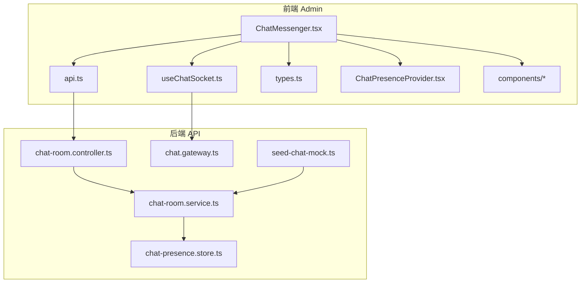
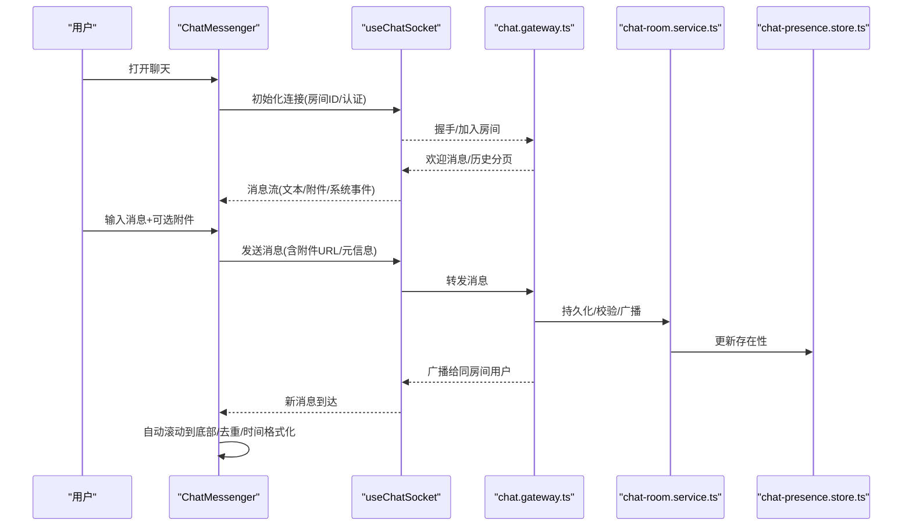
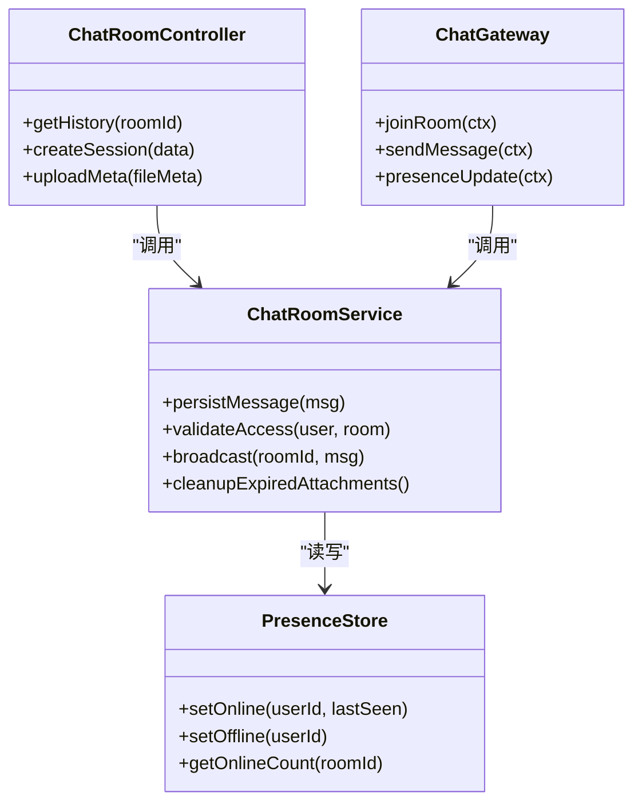
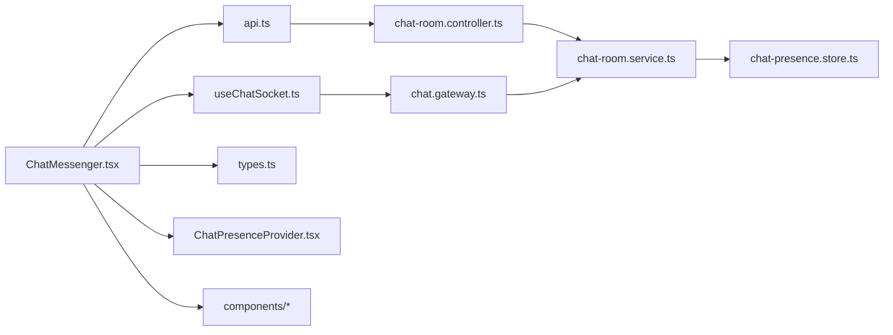

# 聊天界面组件

<cite>
**本文引用的文件**   
- [ChatMessenger.tsx](file://apps/admin/src/features/chat/ChatMessenger.tsx)
- [useChatSocket.ts](file://apps/admin/src/features/chat/useChatSocket.ts)
- [api.ts](file://apps/admin/src/features/chat/api.ts)
- [types.ts](file://apps/admin/src/features/chat/types.ts)
- [ChatPresenceProvider.tsx](file://apps/admin/src/features/chat/ChatPresenceProvider.tsx)
- [components/index.tsx](file://apps/admin/src/features/chat/components/index.tsx)
- [chat-room.controller.ts](file://apps/api/src/support/chat-room.controller.ts)
- [chat.gateway.ts](file://apps/api/src/support/chat.gateway.ts)
- [chat-room.service.ts](file://apps/api/src/support/chat-room.service.ts)
- [chat-presence.store.ts](file://apps/api/src/support/chat-presence.store.ts)
- [seed-chat-mock.ts](file://apps/api/scripts/seed-chat-mock.ts)
</cite>

## 目录
1. [简介](#简介)
2. [项目结构](#项目结构)
3. [核心组件](#核心组件)
4. [架构总览](#架构总览)
5. [详细组件分析](#详细组件分析)
6. [依赖关系分析](#依赖关系分析)
7. [性能考虑](#性能考虑)
8. [故障排查指南](#故障排查指南)
9. [结论](#结论)
10. [附录](#附录)

## 简介
本文件面向“聊天界面组件”的设计与实现，覆盖布局设计、交互流程、用户体验优化，以及消息气泡、输入框、工具栏等关键子组件的实现要点。文档同时介绍表情选择器、文件上传与预览的集成方式，并给出响应式设计、无障碍支持与国际化适配的实践建议。最后提供组件的 Props 配置、事件回调、样式定制方法，以及实际使用示例和最佳实践。

## 项目结构
聊天功能在前后端均有实现：
- 前端（Admin）位于 apps/admin/src/features/chat，包含页面级容器、WebSocket Hook、API 封装、类型定义、存在性状态提供者及组件集合。
- 后端（API）位于 apps/api/src/support，包含聊天室控制器、WebSocket 网关、服务层、存在性存储与种子数据脚本。

**图表来源** 
- [ChatMessenger.tsx](file://apps/admin/src/features/chat/ChatMessenger.tsx)
- [useChatSocket.ts](file://apps/admin/src/features/chat/useChatSocket.ts)
- [api.ts](file://apps/admin/src/features/chat/api.ts)
- [types.ts](file://apps/admin/src/features/chat/types.ts)
- [ChatPresenceProvider.tsx](file://apps/admin/src/features/chat/ChatPresenceProvider.tsx)
- [chat-room.controller.ts](file://apps/api/src/support/chat-room.controller.ts)
- [chat.gateway.ts](file://apps/api/src/support/chat.gateway.ts)
- [chat-room.service.ts](file://apps/api/src/support/chat-room.service.ts)
- [chat-presence.store.ts](file://apps/api/src/support/chat-presence.store.ts)
- [seed-chat-mock.ts](file://apps/api/scripts/seed-chat-mock.ts)

**章节来源**
- [ChatMessenger.tsx](file://apps/admin/src/features/chat/ChatMessenger.tsx)
- [useChatSocket.ts](file://apps/admin/src/features/chat/useChatSocket.ts)
- [api.ts](file://apps/admin/src/features/chat/api.ts)
- [types.ts](file://apps/admin/src/features/chat/types.ts)
- [ChatPresenceProvider.tsx](file://apps/admin/src/features/chat/ChatPresenceProvider.tsx)
- [chat-room.controller.ts](file://apps/api/src/support/chat-room.controller.ts)
- [chat.gateway.ts](file://apps/api/src/support/chat.gateway.ts)
- [chat-room.service.ts](file://apps/api/src/support/chat-room.service.ts)
- [chat-presence.store.ts](file://apps/api/src/support/chat-presence.store.ts)
- [seed-chat-mock.ts](file://apps/api/scripts/seed-chat-mock.ts)

## 核心组件
- ChatMessenger：聊天主容器，负责消息列表渲染、滚动定位、发送逻辑、错误提示与用户存在性订阅。
- useChatSocket：封装 WebSocket 连接、重连策略、心跳检测、消息收发与事件分发。
- api：REST 接口封装，用于获取会话历史、创建会话、上传附件元信息等。
- types：统一的消息、会话、附件与事件类型定义。
- ChatPresenceProvider：管理在线/离线状态、最近活动时间与跨组件共享。
- components/*：消息气泡、输入框、工具栏、表情选择器、文件上传与预览等子组件集合。

**章节来源**
- [ChatMessenger.tsx](file://apps/admin/src/features/chat/ChatMessenger.tsx)
- [useChatSocket.ts](file://apps/admin/src/features/chat/useChatSocket.ts)
- [api.ts](file://apps/admin/src/features/chat/api.ts)
- [types.ts](file://apps/admin/src/features/chat/types.ts)
- [ChatPresenceProvider.tsx](file://apps/admin/src/features/chat/ChatPresenceProvider.tsx)
- [components/index.tsx](file://apps/admin/src/features/chat/components/index.tsx)

## 架构总览
聊天系统采用“前端 React + WebSocket + NestJS Gateway”的实时通信架构。前端通过 useChatSocket 建立长连接，接收服务端推送的消息与存在性事件；REST API 用于拉取历史与上传附件元信息。后端由 chat-room.controller 暴露 REST 接口，chat.gateway 处理 WebSocket 事件，chat-room.service 编排业务逻辑，chat-presence.store 维护在线状态。

**图表来源** 
- [ChatMessenger.tsx](file://apps/admin/src/features/chat/ChatMessenger.tsx)
- [useChatSocket.ts](file://apps/admin/src/features/chat/useChatSocket.ts)
- [chat.gateway.ts](file://apps/api/src/support/chat.gateway.ts)
- [chat-room.service.ts](file://apps/api/src/support/chat-room.service.ts)
- [chat-presence.store.ts](file://apps/api/src/support/chat-presence.store.ts)

## 详细组件分析

### ChatMessenger（聊天主容器）
职责
- 管理会话上下文（房间ID、用户身份、权限）。
- 维护消息列表、已读状态、加载态与错误态。
- 驱动发送流程（文本、表情、附件），调用 REST 与 WebSocket。
- 订阅存在性状态，展示在线人数与最近活跃。
- 处理键盘快捷键、滚动行为与无障碍标签。

交互流程
- 进入页面时拉取历史消息，建立 WebSocket 连接，订阅房间事件。
- 用户输入后点击发送或按回车，先本地乐观插入，再等待服务端确认。
- 收到新消息时自动滚动到底部，避免抖动。
- 附件上传失败回滚乐观消息并提示。

可访问性与国际化
- 为消息区域设置 aria-live="polite"，确保屏幕阅读器播报新消息。
- 按钮具备 aria-label，输入框有占位符与错误提示。
- 文案通过 i18n 键值注入，支持多语言切换。

性能优化
- 虚拟列表或分页加载历史消息，减少首屏渲染压力。
- 图片懒加载与缩略图预览，降低带宽占用。
- 防抖搜索与节流滚动，避免频繁重排。

Props 参考
- roomId: string
- userId: string
- initialMessages?: Message[]
- onSend?: (payload) => void
- onError?: (error) => void
- presenceEnabled?: boolean
- maxAttachmentSize?: number
- allowedMimeTypes?: string[]

事件回调
- onMessageReceived(message)
- onTypingUpdate(userId, isTyping)
- onPresenceChange(status)
- onUploadProgress(file, progress)
- onHistoryLoaded(messages)

样式定制
- 通过 CSS 变量或主题 Provider 覆盖气泡颜色、圆角、间距。
- 支持暗色模式与高对比度主题。

**章节来源**
- [ChatMessenger.tsx](file://apps/admin/src/features/chat/ChatMessenger.tsx)
- [types.ts](file://apps/admin/src/features/chat/types.ts)

### useChatSocket（WebSocket 钩子）
职责
- 建立与 chat.gateway 的连接，处理握手、鉴权与重连。
- 订阅/取消订阅房间事件，解析消息协议。
- 心跳保活、断线告警与指数退避重连。
- 提供 send、subscribe、unsubscribe 等方法。

关键逻辑
- 连接生命周期：初始化 -> 握手 -> 加入房间 -> 监听事件 -> 异常恢复。
- 消息路由：根据事件类型分发给不同处理器（消息、系统、存在性）。
- 可靠性：重复消息去重、乱序重排、ACK 机制（如需要）。

错误处理
- 网络异常：指数退避重连，最大重试次数限制。
- 鉴权失败：触发登录引导或刷新令牌。
- 房间不存在：提示并允许重新选择。

**章节来源**
- [useChatSocket.ts](file://apps/admin/src/features/chat/useChatSocket.ts)
- [chat.gateway.ts](file://apps/api/src/support/chat.gateway.ts)

### 子组件集合（components/*）
- 消息气泡（MessageBubble）
  - 显示文本、富文本、图片、文件链接。
  - 区分发送方/接收方样式，支持复制、下载、预览。
  - 支持时间戳、已读标记与操作菜单。
- 输入框（ChatInput）
  - 支持多行输入、Enter 发送、Shift+Enter 换行。
  - 表情面板快捷插入、@提及（可选）、字数统计。
  - 粘贴图片转 Base64 或直传 OSS。
- 工具栏（Toolbar）
  - 表情选择器、附件上传、截图粘贴、清空、发送。
  - 快捷键提示与无障碍焦点管理。
- 表情选择器（EmojiPicker）
  - 分类检索、最近使用、自定义表情。
  - 键盘导航与屏幕阅读器友好。
- 文件上传与预览（FileUploader & Preview）
  - 拖拽上传、进度条、失败重试、大小与类型校验。
  - 图片缩略图、PDF 预览、视频播放器嵌入。

响应式与无障碍
- 移动端优先布局，小屏隐藏次要按钮，增大触控区域。
- 焦点顺序合理，Tab 导航清晰，ARIA 属性完整。
- 高对比度与字体缩放兼容。

国际化
- 所有用户可见文案通过 i18n key 注入，支持动态切换。
- 日期/时间格式随 locale 变化。

**章节来源**
- [components/index.tsx](file://apps/admin/src/features/chat/components/index.tsx)

### 后端支撑（Gateway/Controller/Service）
- chat-room.controller.ts：提供 REST 接口，如获取历史、创建会话、上传附件元信息。
- chat.gateway.ts：处理 WebSocket 事件，如 joinRoom、sendMessage、presence。
- chat-room.service.ts：业务编排，包括消息持久化、权限校验、广播与清理。
- chat-presence.store.ts：内存或缓存中的在线状态与最近活跃时间。
- seed-chat-mock.ts：开发环境种子数据，便于快速验证。

**图表来源** 
- [chat-room.controller.ts](file://apps/api/src/support/chat-room.controller.ts)
- [chat.gateway.ts](file://apps/api/src/support/chat.gateway.ts)
- [chat-room.service.ts](file://apps/api/src/support/chat-room.service.ts)
- [chat-presence.store.ts](file://apps/api/src/support/chat-presence.store.ts)

**章节来源**
- [chat-room.controller.ts](file://apps/api/src/support/chat-room.controller.ts)
- [chat.gateway.ts](file://apps/api/src/support/chat.gateway.ts)
- [chat-room.service.ts](file://apps/api/src/support/chat-room.service.ts)
- [chat-presence.store.ts](file://apps/api/src/support/chat-presence.store.ts)
- [seed-chat-mock.ts](file://apps/api/scripts/seed-chat-mock.ts)

## 依赖关系分析
- 前端 ChatMessenger 依赖 useChatSocket、api、types、ChatPresenceProvider 与子组件集合。
- useChatSocket 依赖 WebSocket 网关与错误处理库。
- api 依赖 HTTP 客户端与鉴权中间件。
- 后端 Controller 依赖 Service，Gateway 依赖 Service，Service 依赖 PresenceStore 与数据库/对象存储。

**图表来源** 
- [ChatMessenger.tsx](file://apps/admin/src/features/chat/ChatMessenger.tsx)
- [useChatSocket.ts](file://apps/admin/src/features/chat/useChatSocket.ts)
- [api.ts](file://apps/admin/src/features/chat/api.ts)
- [types.ts](file://apps/admin/src/features/chat/types.ts)
- [ChatPresenceProvider.tsx](file://apps/admin/src/features/chat/ChatPresenceProvider.tsx)
- [chat-room.controller.ts](file://apps/api/src/support/chat-room.controller.ts)
- [chat.gateway.ts](file://apps/api/src/support/chat.gateway.ts)
- [chat-room.service.ts](file://apps/api/src/support/chat-room.service.ts)
- [chat-presence.store.ts](file://apps/api/src/support/chat-presence.store.ts)

**章节来源**
- [ChatMessenger.tsx](file://apps/admin/src/features/chat/ChatMessenger.tsx)
- [useChatSocket.ts](file://apps/admin/src/features/chat/useChatSocket.ts)
- [api.ts](file://apps/admin/src/features/chat/api.ts)
- [types.ts](file://apps/admin/src/features/chat/types.ts)
- [ChatPresenceProvider.tsx](file://apps/admin/src/features/chat/ChatPresenceProvider.tsx)
- [chat-room.controller.ts](file://apps/api/src/support/chat-room.controller.ts)
- [chat.gateway.ts](file://apps/api/src/support/chat.gateway.ts)
- [chat-room.service.ts](file://apps/api/src/support/chat-room.service.ts)
- [chat-presence.store.ts](file://apps/api/src/support/chat-presence.store.ts)

## 性能考虑
- 首屏优化：分页加载历史消息，按需渲染大图与媒体。
- 内存控制：及时释放未使用的 Blob URL 与订阅事件。
- 网络优化：压缩传输、合并批量消息、启用 CDN 静态资源。
- 渲染优化：使用 memoization、虚拟化列表、避免不必要的重渲染。
- 后端优化：消息批处理、索引查询、过期附件清理。

[本节为通用指导，不直接分析具体文件]

## 故障排查指南
常见问题与解决思路
- 无法连接 WebSocket
  - 检查网关地址、端口、CORS 与鉴权头。
  - 查看浏览器控制台与后端日志，确认握手成功。
- 消息不显示或重复
  - 检查消息 ID 唯一性与去重逻辑。
  - 确认前端排序与时间戳一致性。
- 附件上传失败
  - 校验 MIME 类型与大小限制。
  - 检查对象存储凭证与 CORS 配置。
- 存在性状态不准确
  - 检查心跳间隔与超时设置。
  - 确认离线清理任务是否执行。

调试建议
- 使用浏览器 Network 与 WebSocket 面板观察请求与帧。
- 在后端开启详细日志，记录事件流转与错误堆栈。
- 使用种子数据快速复现问题场景。

**章节来源**
- [useChatSocket.ts](file://apps/admin/src/features/chat/useChatSocket.ts)
- [chat.gateway.ts](file://apps/api/src/support/chat.gateway.ts)
- [chat-room.service.ts](file://apps/api/src/support/chat-room.service.ts)
- [seed-chat-mock.ts](file://apps/api/scripts/seed-chat-mock.ts)

## 结论
本聊天界面组件以模块化设计与清晰的职责划分实现了完整的即时通讯体验。通过 WebSocket 保障实时性，REST 接口完善历史与附件能力，配合存在性状态提升协作感。建议在后续迭代中持续优化渲染性能、增强无障碍与国际化体验，并完善错误监控与可观测性。

[本节为总结性内容，不直接分析具体文件]

## 附录
- 使用示例（步骤概述）
  - 在页面中引入 ChatMessenger，传入 roomId、userId 与必要回调。
  - 配置子组件的样式与行为（如最大附件大小、允许的 MIME 类型）。
  - 接入 i18n，确保文案与日期格式随语言切换。
  - 在生产环境配置 WebSocket 代理与 HTTPS。

- 最佳实践
  - 对敏感信息进行脱敏与加密传输。
  - 对用户输入进行严格校验与 XSS 防护。
  - 为长列表使用虚拟化与分页。
  - 为媒体资源启用懒加载与缩略图。
  - 为错误路径提供友好的用户提示与重试入口。

[本节为补充说明，不直接分析具体文件]