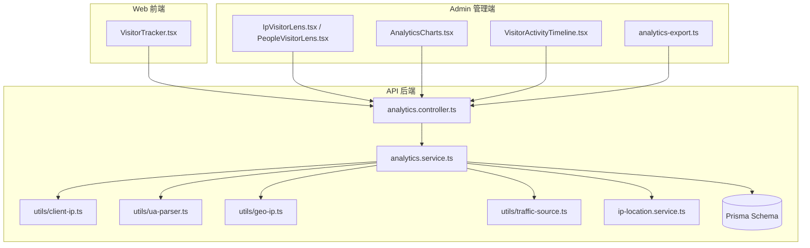
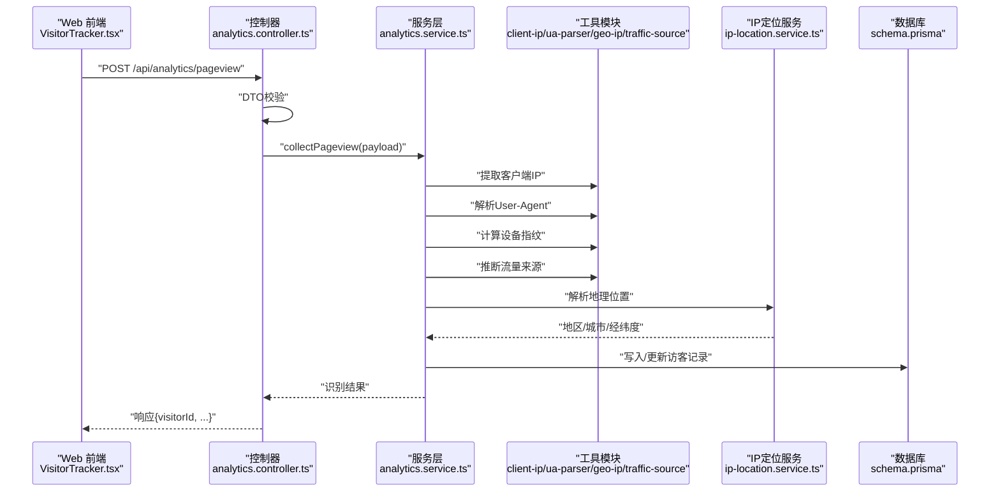
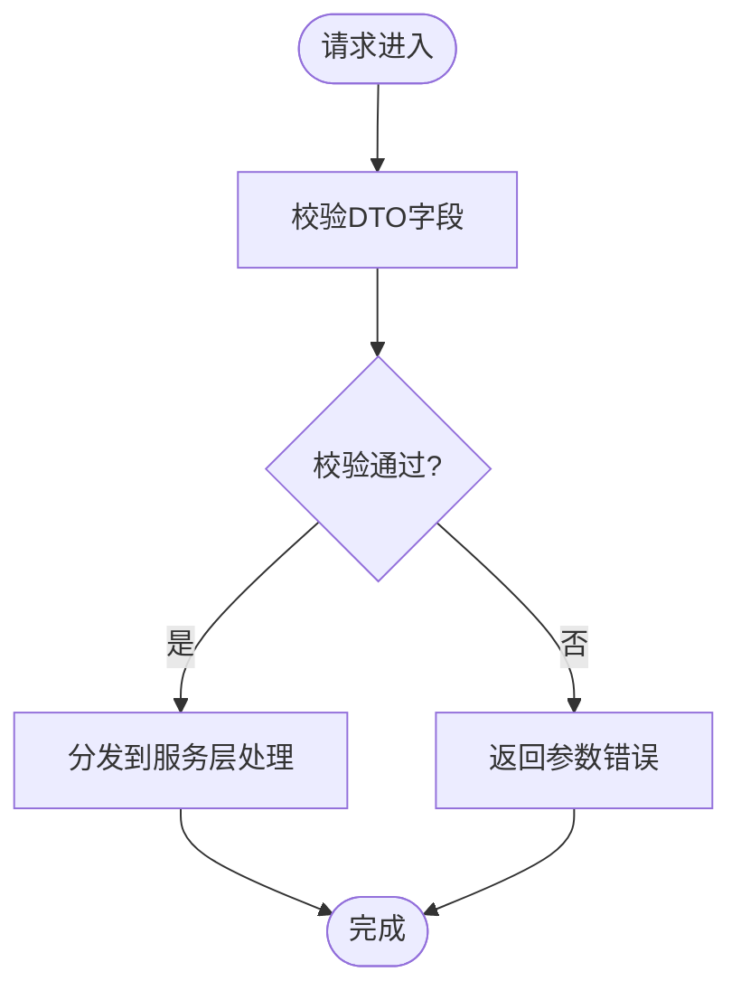
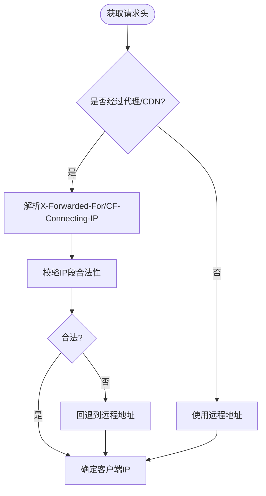
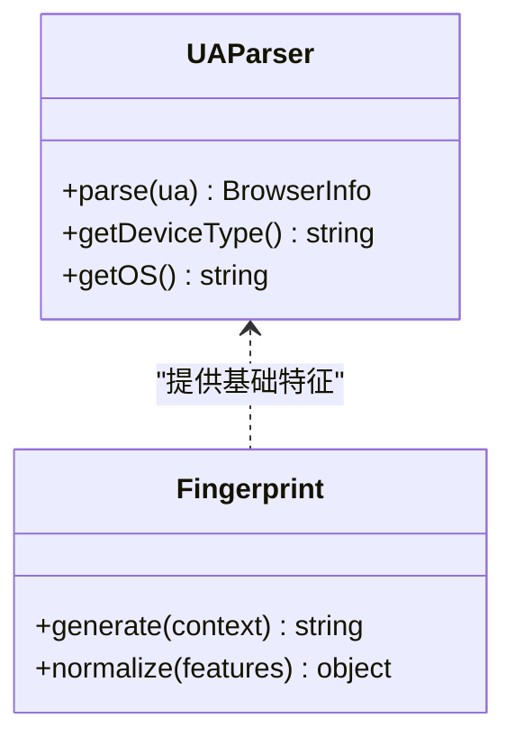
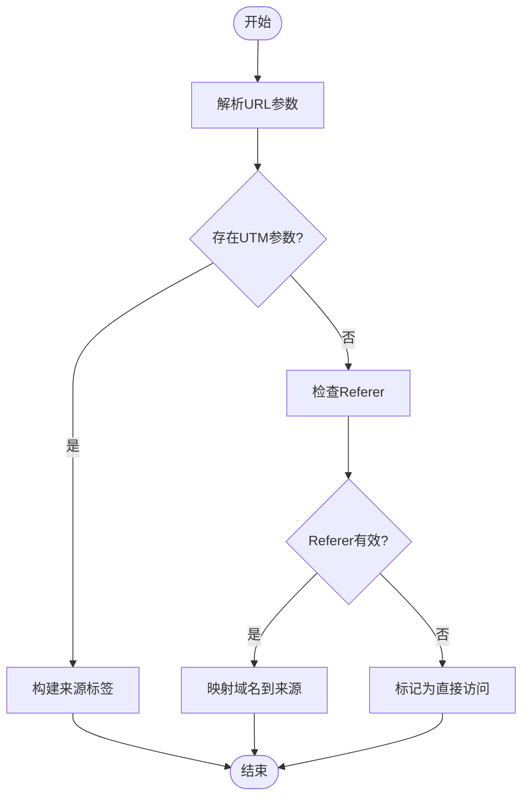
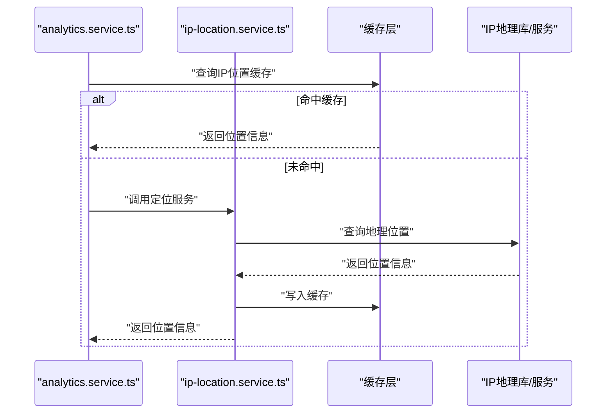
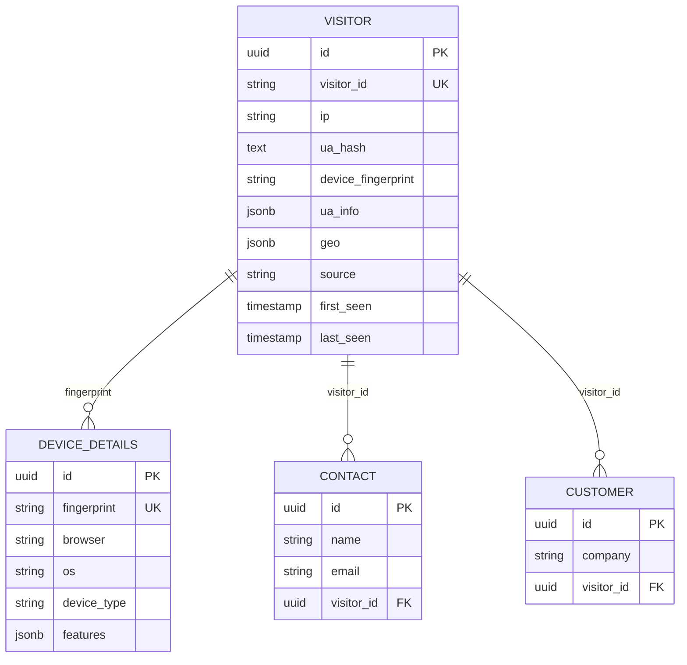
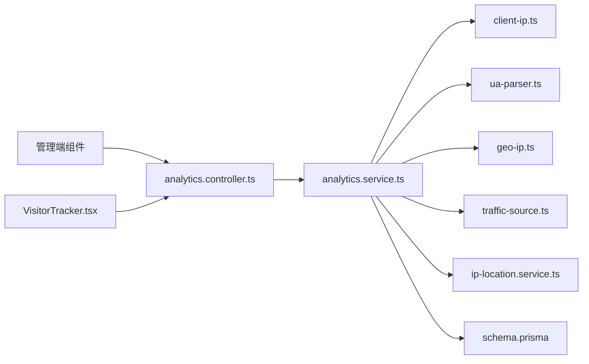

# 访客识别与追踪

<cite>
**本文引用的文件**   
- [analytics.controller.ts](file://apps/api/src/analytics/analytics.controller.ts)
- [analytics.service.ts](file://apps/api/src/analytics/analytics.service.ts)
- [collect-pageview.dto.ts](file://apps/api/src/analytics/dto/collect-pageview.dto.ts)
- [identify.dto.ts](file://apps/api/src/analytics/dto/identify.dto.ts)
- [client-ip.ts](file://apps/api/src/analytics/utils/client-ip.ts)
- [ua-parser.ts](file://apps/api/src/analytics/utils/ua-parser.ts)
- [geo-ip.ts](file://apps/api/src/analytics/utils/geo-ip.ts)
- [traffic-source.ts](file://apps/api/src/analytics/utils/traffic-source.ts)
- [ip-location.service.ts](file://apps/api/src/analytics/ip-location.service.ts)
- [schema.prisma](file://apps/api/prisma/schema.prisma)
- [20260723110621_add_device_details/migration.sql](file://apps/api/prisma/migrations/20260723110621_add_device_details/migration.sql)
- [20260723120000_add_contact_visitor_id/migration.sql](file://apps/api/prisma/migrations/20260723120000_add_contact_visitor_id/migration.sql)
- [20260724122950_customer_visitor_id/migration.sql](file://apps/api/prisma/migrations/20260724122950_customer_visitor_id/migration.sql)
- [VisitorTracker.tsx](file://apps/web/src/components/analytics/VisitorTracker.tsx)
- [IpVisitorLens.tsx](file://apps/admin/src/components/visitors/IpVisitorLens.tsx)
- [PeopleVisitorLens.tsx](file://apps/admin/src/components/visitors/PeopleVisitorLens.tsx)
- [AnalyticsCharts.tsx](file://apps/admin/src/components/analytics/AnalyticsCharts.tsx)
- [IpVisitorDetailSheet.tsx](file://apps/admin/src/components/analytics/IpVisitorDetailSheet.tsx)
- [VisitorActivityTimeline.tsx](file://apps/admin/src/components/analytics/VisitorActivityTimeline.tsx)
- [device-columns.tsx](file://apps/admin/src/components/analytics/device-columns.tsx)
- [analytics.ts](file://apps/admin/src/features/analytics.ts)
- [analytics-export.ts](file://apps/admin/src/features/analytics-export.ts)
- [analytics-granularity.ts](file://apps/admin/src/lib/analytics-granularity.ts)
- [analytics-geo-hints.ts](file://apps/admin/src/lib/analytics-geo-hints.ts)
- [security-ip-block.ts](file://apps/admin/src/features/security-ip-block.ts)
- [IpBlockPanel.tsx](file://apps/admin/src/components/security/IpBlockPanel.tsx)
</cite>

## 目录
1. [简介](#简介)
2. [项目结构](#项目结构)
3. [核心组件](#核心组件)
4. [架构总览](#架构总览)
5. [详细组件分析](#详细组件分析)
6. [依赖关系分析](#依赖关系分析)
7. [性能考量](#性能考量)
8. [故障排查指南](#故障排查指南)
9. [结论](#结论)
10. [附录](#附录)

## 简介
本文件面向“访客识别与追踪系统”的开发者与运维人员，系统性阐述访客身份识别机制（IP地址解析、设备指纹、用户代理分析）、访客信息的采集、存储与关联逻辑，以及访客画像构建、行为追踪与分析统计。文档同时覆盖隐私保护措施、数据脱敏与合规要求，并提供访客识别API的使用方法与自定义追踪规则的配置指南。

## 项目结构
本项目采用多应用架构：
- apps/api：后端 NestJS 服务，提供访客数据采集、识别、地理定位、分析与导出等能力。
- apps/web：前端站点，集成轻量级访客追踪脚本，上报页面浏览与事件。
- apps/admin：管理后台，提供访客列表、按IP/人群维度筛选、活动时序、图表统计与导出等功能。
- prisma：数据库模型与迁移，包含访客、设备详情、联系人/客户与访客ID关联等表结构演进。

图示来源
- [VisitorTracker.tsx](file://apps/web/src/components/analytics/VisitorTracker.tsx)
- [analytics.controller.ts](file://apps/api/src/analytics/analytics.controller.ts)
- [analytics.service.ts](file://apps/api/src/analytics/analytics.service.ts)
- [client-ip.ts](file://apps/api/src/analytics/utils/client-ip.ts)
- [ua-parser.ts](file://apps/api/src/analytics/utils/ua-parser.ts)
- [geo-ip.ts](file://apps/api/src/analytics/utils/geo-ip.ts)
- [traffic-source.ts](file://apps/api/src/analytics/utils/traffic-source.ts)
- [ip-location.service.ts](file://apps/api/src/analytics/ip-location.service.ts)
- [schema.prisma](file://apps/api/prisma/schema.prisma)

章节来源
- [schema.prisma](file://apps/api/prisma/schema.prisma)
- [20260723110621_add_device_details/migration.sql](file://apps/api/prisma/migrations/20260723110621_add_device_details/migration.sql)
- [20260723120000_add_contact_visitor_id/migration.sql](file://apps/api/prisma/migrations/20260723120000_add_contact_visitor_id/migration.sql)
- [20260724122950_customer_visitor_id/migration.sql](file://apps/api/prisma/migrations/20260724122950_customer_visitor_id/migration.sql)

## 核心组件
- 访客识别控制器（analytics.controller.ts）：暴露采集与识别接口，接收页面浏览与访客标识请求，进行参数校验并委派给服务层处理。
- 访客服务（analytics.service.ts）：实现访客识别主流程，包括客户端IP提取、UA解析、设备指纹生成、流量来源推断、地理位置解析、去重与持久化。
- 工具模块：
  - client-ip.ts：从请求头安全地提取真实客户端IP。
  - ua-parser.ts：解析User-Agent，输出浏览器、操作系统、设备等元信息。
  - geo-ip.ts：基于IP查询地理位置信息。
  - traffic-source.ts：根据URL参数或Referer推断流量来源。
- IP定位服务（ip-location.service.ts）：封装地理位置查询与缓存策略。
- 前端追踪器（VisitorTracker.tsx）：在页面加载时收集基础上下文并上报至后端。
- 管理端分析视图：
  - IpVisitorLens.tsx / PeopleVisitorLens.tsx：按IP或人群维度查看访客列表与明细。
  - AnalyticsCharts.tsx：聚合统计图表。
  - VisitorActivityTimeline.tsx：按时间线展示访客活动轨迹。
  - analytics-export.ts：支持导出分析结果。

章节来源
- [analytics.controller.ts](file://apps/api/src/analytics/analytics.controller.ts)
- [analytics.service.ts](file://apps/api/src/analytics/analytics.service.ts)
- [client-ip.ts](file://apps/api/src/analytics/utils/client-ip.ts)
- [ua-parser.ts](file://apps/api/src/analytics/utils/ua-parser.ts)
- [geo-ip.ts](file://apps/api/src/analytics/utils/geo-ip.ts)
- [traffic-source.ts](file://apps/api/src/analytics/utils/traffic-source.ts)
- [ip-location.service.ts](file://apps/api/src/analytics/ip-location.service.ts)
- [VisitorTracker.tsx](file://apps/web/src/components/analytics/VisitorTracker.tsx)
- [IpVisitorLens.tsx](file://apps/admin/src/components/visitors/IpVisitorLens.tsx)
- [PeopleVisitorLens.tsx](file://apps/admin/src/components/visitors/PeopleVisitorLens.tsx)
- [AnalyticsCharts.tsx](file://apps/admin/src/components/analytics/AnalyticsCharts.tsx)
- [VisitorActivityTimeline.tsx](file://apps/admin/src/components/analytics/VisitorActivityTimeline.tsx)
- [analytics-export.ts](file://apps/admin/src/features/analytics-export.ts)

## 架构总览
访客识别与追踪的整体调用链如下：
- Web端通过VisitorTracker在页面生命周期内触发上报。
- API控制器接收请求，进行DTO校验后交由服务层处理。
- 服务层依次执行IP解析、UA解析、设备指纹计算、流量来源推断、地理位置解析，最终落库并返回结果。
- 管理端通过查询接口获取聚合与明细数据，用于可视化与导出。

图示来源
- [VisitorTracker.tsx](file://apps/web/src/components/analytics/VisitorTracker.tsx)
- [analytics.controller.ts](file://apps/api/src/analytics/analytics.controller.ts)
- [analytics.service.ts](file://apps/api/src/analytics/analytics.service.ts)
- [client-ip.ts](file://apps/api/src/analytics/utils/client-ip.ts)
- [ua-parser.ts](file://apps/api/src/analytics/utils/ua-parser.ts)
- [geo-ip.ts](file://apps/api/src/analytics/utils/geo-ip.ts)
- [traffic-source.ts](file://apps/api/src/analytics/utils/traffic-source.ts)
- [ip-location.service.ts](file://apps/api/src/analytics/ip-location.service.ts)
- [schema.prisma](file://apps/api/prisma/schema.prisma)

## 详细组件分析

### 访客识别API与DTO
- 页面浏览采集接口：接收页面路径、标题、时间戳、可选的访客标识与扩展字段，用于记录一次访问。
- 访客识别接口：接收显式标识（如登录后的用户ID或会话ID），将匿名访客与已知身份关联。
- DTO定义：
  - collect-pageview.dto.ts：定义页面浏览上报的数据结构与校验规则。
  - identify.dto.ts：定义访客识别请求的数据结构与校验规则。

图示来源
- [collect-pageview.dto.ts](file://apps/api/src/analytics/dto/collect-pageview.dto.ts)
- [identify.dto.ts](file://apps/api/src/analytics/dto/identify.dto.ts)
- [analytics.controller.ts](file://apps/api/src/analytics/analytics.controller.ts)

章节来源
- [collect-pageview.dto.ts](file://apps/api/src/analytics/dto/collect-pageview.dto.ts)
- [identify.dto.ts](file://apps/api/src/analytics/dto/identify.dto.ts)
- [analytics.controller.ts](file://apps/api/src/analytics/analytics.controller.ts)

### 客户端IP解析与安全
- 从HTTP请求头中安全提取客户端IP，考虑反向代理、CDN等场景下的X-Forwarded-For、CF-Connecting-IP等头部。
- 对可疑头部进行清洗与校验，防止伪造IP。

图示来源
- [client-ip.ts](file://apps/api/src/analytics/utils/client-ip.ts)

章节来源
- [client-ip.ts](file://apps/api/src/analytics/utils/client-ip.ts)

### 用户代理解析与设备指纹
- UA解析：提取浏览器名称与版本、操作系统、设备类型（移动/桌面/平板）。
- 设备指纹：结合UA、屏幕分辨率、语言、时区、Canvas/WebGL特征等生成稳定且不可逆的设备标识。
- 用途：用于区分不同设备、合并同一设备的多次访问、提升画像准确性。

图示来源
- [ua-parser.ts](file://apps/api/src/analytics/utils/ua-parser.ts)

章节来源
- [ua-parser.ts](file://apps/api/src/analytics/utils/ua-parser.ts)

### 流量来源推断
- 依据URL参数（如utm_source、utm_medium、utm_campaign）与Referer域名，推断流量来源渠道。
- 支持自定义来源映射规则，便于营销归因分析。

图示来源
- [traffic-source.ts](file://apps/api/src/analytics/utils/traffic-source.ts)

章节来源
- [traffic-source.ts](file://apps/api/src/analytics/utils/traffic-source.ts)

### 地理位置解析
- 基于IP查询地理位置（国家、省份、城市、经纬度），支持本地库与在线服务两种模式。
- 引入缓存策略以减少外部依赖延迟与成本。

图示来源
- [geo-ip.ts](file://apps/api/src/analytics/utils/geo-ip.ts)
- [ip-location.service.ts](file://apps/api/src/analytics/ip-location.service.ts)

章节来源
- [geo-ip.ts](file://apps/api/src/analytics/utils/geo-ip.ts)
- [ip-location.service.ts](file://apps/api/src/analytics/ip-location.service.ts)

### 数据存储与关联逻辑
- 访客记录：包含访客ID、IP、UA解析结果、设备指纹、地理位置、首次/最近访问时间、来源渠道等。
- 设备详情：独立表存储设备维度信息，便于跨会话聚合。
- 联系人/客户与访客关联：通过visitor_id字段建立联系人与访客、客户与访客的关系，支持匿名访客转化为线索或客户。

图示来源
- [schema.prisma](file://apps/api/prisma/schema.prisma)
- [20260723110621_add_device_details/migration.sql](file://apps/api/prisma/migrations/20260723110621_add_device_details/migration.sql)
- [20260723120000_add_contact_visitor_id/migration.sql](file://apps/api/prisma/migrations/20260723120000_add_contact_visitor_id/migration.sql)
- [20260724122950_customer_visitor_id/migration.sql](file://apps/api/prisma/migrations/20260724122950_customer_visitor_id/migration.sql)

章节来源
- [schema.prisma](file://apps/api/prisma/schema.prisma)
- [20260723110621_add_device_details/migration.sql](file://apps/api/prisma/migrations/20260723110621_add_device_details/migration.sql)
- [20260723120000_add_contact_visitor_id/migration.sql](file://apps/api/prisma/migrations/20260723120000_add_contact_visitor_id/migration.sql)
- [20260724122950_customer_visitor_id/migration.sql](file://apps/api/prisma/migrations/20260724122950_customer_visitor_id/migration.sql)

### 管理端分析视图与导出
- 访客列表与筛选：
  - IpVisitorLens.tsx：按IP维度查看访客明细与活动。
  - PeopleVisitorLens.tsx：按人群维度（如来源、地域、设备类型）筛选。
- 图表与时间线：
  - AnalyticsCharts.tsx：聚合指标（PV、UV、来源分布、地域分布等）。
  - VisitorActivityTimeline.tsx：按时间轴展示访客行为序列。
- 导出功能：
  - analytics-export.ts：支持将分析结果导出为CSV/Excel，便于离线分析。

章节来源
- [IpVisitorLens.tsx](file://apps/admin/src/components/visitors/IpVisitorLens.tsx)
- [PeopleVisitorLens.tsx](file://apps/admin/src/components/visitors/PeopleVisitorLens.tsx)
- [AnalyticsCharts.tsx](file://apps/admin/src/components/analytics/AnalyticsCharts.tsx)
- [VisitorActivityTimeline.tsx](file://apps/admin/src/components/analytics/VisitorActivityTimeline.tsx)
- [analytics-export.ts](file://apps/admin/src/features/analytics-export.ts)

### 隐私保护与数据脱敏
- IP脱敏：对IP地址进行掩码或哈希处理，避免直接存储明文。
- UA与设备指纹：仅保留必要特征，不存储完整UA字符串；指纹为不可逆摘要。
- 地理位置：仅保留省/市级别，避免精确坐标泄露。
- 数据最小化：仅采集业务必需字段，减少敏感信息暴露面。
- 合规建议：遵循GDPR/CCPA等法规，提供用户同意与退出机制，支持数据删除与导出。

章节来源
- [client-ip.ts](file://apps/api/src/analytics/utils/client-ip.ts)
- [ua-parser.ts](file://apps/api/src/analytics/utils/ua-parser.ts)
- [geo-ip.ts](file://apps/api/src/analytics/utils/geo-ip.ts)

### 自定义追踪规则配置
- 来源映射：在traffic-source.ts中扩展来源域名到渠道的映射规则。
- 过滤规则：在analytics.service.ts中添加忽略规则（如内部IP、爬虫UA、健康检查路径）。
- 采样策略：在高并发场景下启用采样以降低存储压力。
- 缓存策略：在ip-location.service.ts中调整缓存TTL与失效策略。

章节来源
- [traffic-source.ts](file://apps/api/src/analytics/utils/traffic-source.ts)
- [analytics.service.ts](file://apps/api/src/analytics/analytics.service.ts)
- [ip-location.service.ts](file://apps/api/src/analytics/ip-location.service.ts)

## 依赖关系分析
- 控制器依赖服务层，服务层依赖工具模块与定位服务，最终依赖数据库。
- 管理端通过API消费分析数据，前端追踪器向API上报数据。

图示来源
- [analytics.controller.ts](file://apps/api/src/analytics/analytics.controller.ts)
- [analytics.service.ts](file://apps/api/src/analytics/analytics.service.ts)
- [client-ip.ts](file://apps/api/src/analytics/utils/client-ip.ts)
- [ua-parser.ts](file://apps/api/src/analytics/utils/ua-parser.ts)
- [geo-ip.ts](file://apps/api/src/analytics/utils/geo-ip.ts)
- [traffic-source.ts](file://apps/api/src/analytics/utils/traffic-source.ts)
- [ip-location.service.ts](file://apps/api/src/analytics/ip-location.service.ts)
- [schema.prisma](file://apps/api/prisma/schema.prisma)
- [VisitorTracker.tsx](file://apps/web/src/components/analytics/VisitorTracker.tsx)

章节来源
- [analytics.controller.ts](file://apps/api/src/analytics/analytics.controller.ts)
- [analytics.service.ts](file://apps/api/src/analytics/analytics.service.ts)
- [schema.prisma](file://apps/api/prisma/schema.prisma)

## 性能考量
- 批量写入：在高并发场景下，将多次访问合并为批量插入，降低数据库压力。
- 异步处理：地理位置解析与设备指纹计算可异步执行，避免阻塞主流程。
- 缓存优化：对IP地理位置与热门来源映射进行缓存，缩短查询延迟。
- 索引设计：为visitor_id、ip、first_seen、last_seen等高频查询字段建立索引。
- 采样与降级：在峰值时段启用采样与降级策略，保障系统稳定性。

[本节为通用指导，无需特定文件引用]

## 故障排查指南
- 常见问题：
  - IP解析异常：检查代理/CDN头部配置与校验逻辑。
  - UA解析失败：确认UA格式兼容性与解析库版本。
  - 地理位置缺失：检查定位服务可用性、缓存状态与网络连通性。
  - 数据不一致：核对DTO校验规则与服务层处理逻辑。
- 调试建议：
  - 启用请求日志与链路追踪，定位问题环节。
  - 使用管理端“IP阻断面板”快速屏蔽恶意来源。
  - 通过导出功能拉取原始数据进行离线分析。

章节来源
- [IpBlockPanel.tsx](file://apps/admin/src/components/security/IpBlockPanel.tsx)
- [security-ip-block.ts](file://apps/admin/src/features/security-ip-block.ts)

## 结论
本访客识别与追踪系统以清晰的职责划分与模块化设计，实现了从前端采集、后端识别到管理端可视化的完整闭环。通过IP解析、UA分析、设备指纹与流量来源推断，构建了准确的访客画像；借助地理位置解析与关联逻辑，打通了匿名访客与联系人/客户的转化路径。系统在隐私保护与合规方面提供了必要的脱敏与最小化策略，并通过灵活的配置机制支持自定义追踪规则。建议在大规模部署时关注性能优化与监控告警，确保系统的稳定性与可扩展性。

[本节为总结性内容，无需特定文件引用]

## 附录
- API使用方法：
  - 页面浏览采集：POST /api/analytics/pageview，携带页面路径、标题、时间戳与可选访客标识。
  - 访客识别：POST /api/analytics/identify，携带访客标识与用户身份信息，完成匿名到已知的关联。
- 自定义规则配置：
  - 来源映射：在traffic-source.ts中扩展域名到渠道映射。
  - 过滤规则：在analytics.service.ts中添加忽略条件。
  - 采样与缓存：在服务层与定位服务中调整策略。

章节来源
- [collect-pageview.dto.ts](file://apps/api/src/analytics/dto/collect-pageview.dto.ts)
- [identify.dto.ts](file://apps/api/src/analytics/dto/identify.dto.ts)
- [analytics.controller.ts](file://apps/api/src/analytics/analytics.controller.ts)
- [traffic-source.ts](file://apps/api/src/analytics/utils/traffic-source.ts)
- [analytics.service.ts](file://apps/api/src/analytics/analytics.service.ts)
- [ip-location.service.ts](file://apps/api/src/analytics/ip-location.service.ts)