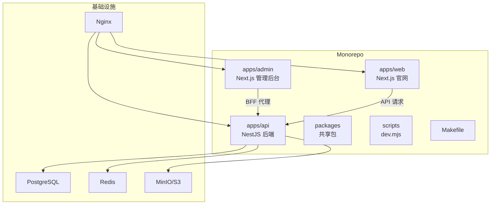
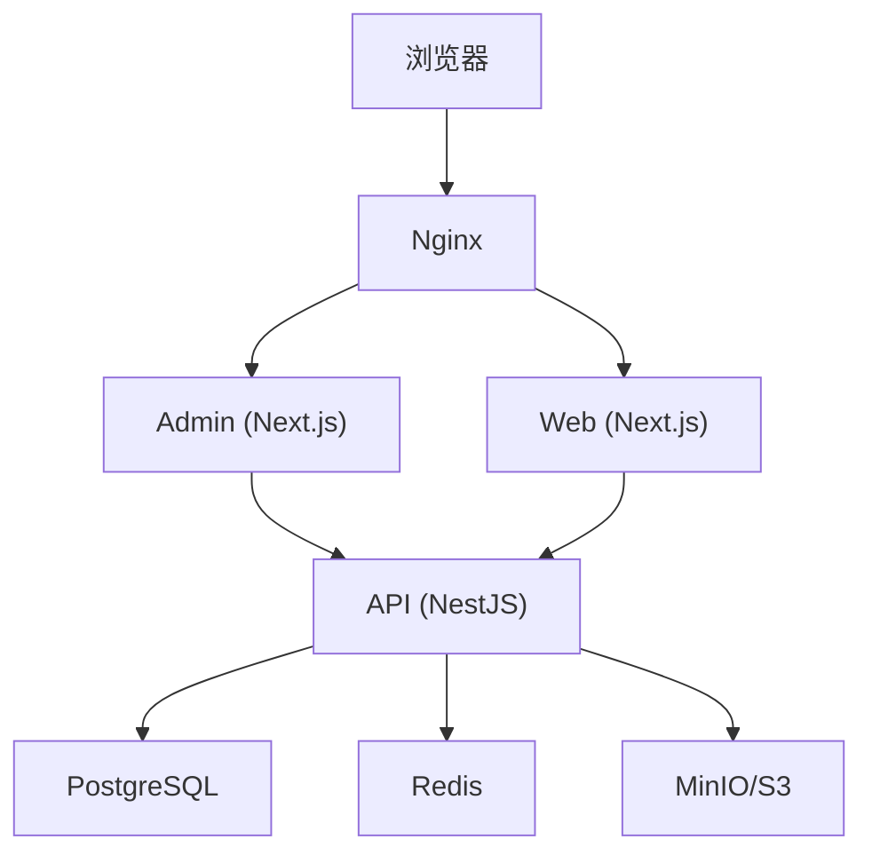
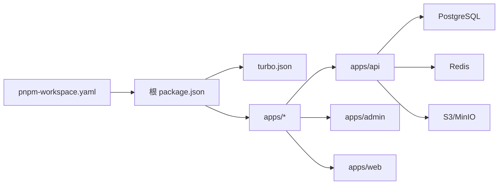

# 快速开始

<cite>
**本文引用的文件**   
- [README.md](file://README.md)
- [package.json](file://package.json)
- [pnpm-workspace.yaml](file://pnpm-workspace.yaml)
- [turbo.json](file://turbo.json)
- [Makefile](file://Makefile)
- [scripts/dev.mjs](file://scripts/dev.mjs)
- [apps/api/package.json](file://apps/api/package.json)
- [apps/admin/package.json](file://apps/admin/package.json)
- [apps/web/package.json](file://apps/web/package.json)
- [apps/api/src/main.ts](file://apps/api/src/main.ts)
- [apps/api/src/config/env.validation.ts](file://apps/api/src/config/env.validation.ts)
- [apps/api/prisma/schema.prisma](file://apps/api/prisma/schema.prisma)
- [apps/api/prisma/migrations/0_init/migration.sql](file://apps/api/prisma/migrations/0_init/migration.sql)
- [apps/api/prisma/seed.ts](file://apps/api/prisma/seed.ts)
- [apps/api/Dockerfile](file://apps/api/Dockerfile)
- [apps/admin/Dockerfile](file://apps/admin/Dockerfile)
- [apps/web/Dockerfile](file://apps/web/Dockerfile)
- [infra/docker/docker-compose.dev.yml](file://infra/docker/docker-compose.dev.yml)
- [infra/docker/docker-compose.prod.yml](file://infra/docker/docker-compose.prod.yml)
- [infra/docker/deploy-local.sh](file://infra/docker/deploy-local.sh)
- [infra/docker/nginx/tzj.conf](file://infra/docker/nginx/tzj.conf)
- [infra/docker/postgres/init.sql](file://infra/docker/postgres/init.sql)
- [infra/docker/redis/redis.conf](file://infra/docker/redis/redis.conf)
- [.npmrc](file://.npmrc)
</cite>

## 目录
1. [简介](#简介)
2. [项目结构](#项目结构)
3. [核心组件](#核心组件)
4. [架构总览](#架构总览)
5. [详细组件分析](#详细组件分析)
6. [依赖关系分析](#依赖关系分析)
7. [性能注意事项](#性能注意事项)
8. [故障排查指南](#故障排查指南)
9. [结论](#结论)
10. [附录](#附录)

## 简介
本快速开始指南面向首次接触 TZJ 网站重构项目的开发者，目标是在 30 分钟内完成本地环境搭建、依赖安装、环境变量配置、数据库初始化与开发服务器启动，并提供 Docker 一键部署与传统部署方式的详细说明。项目采用前后端分离与多应用（Next.js Admin/Web + NestJS API）的 Monorepo 架构，使用 pnpm 工作区与 Turborepo 进行构建编排，数据层基于 Prisma + PostgreSQL，缓存与会话使用 Redis，媒体存储支持 S3/MinIO。

## 项目结构
- 根目录为 Monorepo，包含三个主要应用：
  - apps/api：NestJS 后端服务，提供 REST/WS 接口、权限、内容管理、媒体、设置、审计等模块
  - apps/admin：Next.js 管理后台，通过 BFF 代理调用 API
  - apps/web：Next.js 官网前端，支持多语言与 SEO
- infra/docker：Docker Compose 开发与生产编排、Nginx 反向代理、Postgres/Redis/MinIO 镜像与配置
- packages：共享包（类型、主题、UI 等）
- scripts：通用脚本（如 dev.mjs）
- Makefile：常用命令封装

图表来源
- [apps/api/src/main.ts](file://apps/api/src/main.ts)
- [apps/admin/package.json](file://apps/admin/package.json)
- [apps/web/package.json](file://apps/web/package.json)
- [infra/docker/docker-compose.dev.yml](file://infra/docker/docker-compose.dev.yml)

章节来源
- [README.md](file://README.md)
- [package.json](file://package.json)
- [pnpm-workspace.yaml](file://pnpm-workspace.yaml)
- [turbo.json](file://turbo.json)
- [Makefile](file://Makefile)

## 核心组件
- 后端（apps/api）
  - NestJS 模块化架构，包含认证、权限、内容、文档、媒体、设置、安全、支持聊天、审计、系统健康等模块
  - 使用 Prisma ORM 与 PostgreSQL 交互，提供迁移与种子数据能力
  - 集成 Redis（会话/缓存）、S3/MinIO（媒体存储）、阿里云验证码/邮件等可选集成
- 管理后台（apps/admin）
  - Next.js App Router，内置 BFF 代理到 API，提供资源编辑、用户/角色、审计日志、分析、媒体管理等
- 官网（apps/web）
  - Next.js 国际化站点，支持多语言、SEO、搜索、访客追踪、聊天小部件等

章节来源
- [apps/api/src/app.module.ts](file://apps/api/src/app.module.ts)
- [apps/api/src/main.ts](file://apps/api/src/main.ts)
- [apps/admin/package.json](file://apps/admin/package.json)
- [apps/web/package.json](file://apps/web/package.json)

## 架构总览
下图展示了本地开发时各组件的交互关系：Nginx 作为入口分发流量，Admin/Web 通过 BFF/直连访问 API，API 连接 Postgres、Redis、MinIO。

图表来源
- [infra/docker/nginx/tzj.conf](file://infra/docker/nginx/tzj.conf)
- [apps/api/src/main.ts](file://apps/api/src/main.ts)
- [apps/admin/package.json](file://apps/admin/package.json)
- [apps/web/package.json](file://apps/web/package.json)
- [infra/docker/docker-compose.dev.yml](file://infra/docker/docker-compose.dev.yml)

## 详细组件分析

### 环境与依赖要求
- Node.js：建议使用 LTS 版本（与 pnpm 兼容），确保全局安装 pnpm
- 包管理器：pnpm（Monorepo 工作区）
- 数据库：PostgreSQL（推荐 14+）
- 缓存：Redis（推荐 6+）
- 对象存储：MinIO（本地开发）或兼容 S3 的服务（生产）
- 构建工具：Turborepo（由 turbo.json 驱动）

章节来源
- [package.json](file://package.json)
- [pnpm-workspace.yaml](file://pnpm-workspace.yaml)
- [turbo.json](file://turbo.json)
- [.npmrc](file://.npmrc)

### 依赖安装与构建
- 在仓库根目录执行 pnpm 安装所有子应用与工作区依赖
- 使用 Turborepo 统一构建与任务编排（lint/build/test/dev）
- 若网络受限，可通过 .npmrc 配置镜像源

章节来源
- [package.json](file://package.json)
- [pnpm-workspace.yaml](file://pnpm-workspace.yaml)
- [.npmrc](file://.npmrc)

### 环境变量配置
- API 环境变量校验与加载由 env.validation.ts 负责，常见变量包括数据库连接串、Redis 地址、JWT 密钥、媒体存储配置等
- 建议创建 .env 文件并置于 apps/api 目录下，或通过 docker-compose 注入
- 注意敏感信息不要提交至版本库

章节来源
- [apps/api/src/config/env.validation.ts](file://apps/api/src/config/env.validation.ts)

### 数据库初始化与种子数据
- 使用 Prisma Schema 定义数据模型，位于 prisma/schema.prisma
- 运行迁移以生成表结构，初始迁移位于 migrations/0_init/migration.sql
- 可执行 seed.ts 插入基础数据（用户、角色、示例内容等）
- 本地开发可使用 Docker Compose 启动 Postgres，并通过 init.sql 预置数据库

章节来源
- [apps/api/prisma/schema.prisma](file://apps/api/prisma/schema.prisma)
- [apps/api/prisma/migrations/0_init/migration.sql](file://apps/api/prisma/migrations/0_init/migration.sql)
- [apps/api/prisma/seed.ts](file://apps/api/prisma/seed.ts)
- [infra/docker/postgres/init.sql](file://infra/docker/postgres/init.sql)

### 本地开发服务器启动
- 使用 Makefile 提供的快捷命令（如 dev、build、start）
- 或使用 scripts/dev.mjs 启动多进程开发模式（同时启动 API、Admin、Web）
- 确保 Postgres、Redis、MinIO 已启动（推荐使用 Docker Compose）

章节来源
- [Makefile](file://Makefile)
- [scripts/dev.mjs](file://scripts/dev.mjs)
- [apps/api/package.json](file://apps/api/package.json)
- [apps/admin/package.json](file://apps/admin/package.json)
- [apps/web/package.json](file://apps/web/package.json)

### Docker 一键部署
- 开发环境：使用 infra/docker/docker-compose.dev.yml 启动 API、Admin、Web、Nginx、Postgres、Redis、MinIO
- 生产环境：使用 infra/docker/docker-compose.prod.yml 配合 Nginx 配置与证书
- 本地部署脚本：infra/docker/deploy-local.sh 用于快速拉起本地环境

章节来源
- [infra/docker/docker-compose.dev.yml](file://infra/docker/docker-compose.dev.yml)
- [infra/docker/docker-compose.prod.yml](file://infra/docker/docker-compose.prod.yml)
- [infra/docker/deploy-local.sh](file://infra/docker/deploy-local.sh)
- [infra/docker/nginx/tzj.conf](file://infra/docker/nginx/tzj.conf)

### 传统部署方式
- 后端（NestJS）
  - 构建产物位于 dist（由 Nest CLI 生成）
  - 使用 apps/api/Dockerfile 或系统级 Node 进程管理器（PM2/systemd）运行
- 前端（Next.js）
  - Admin/Web 分别构建静态产物或 Standalone 输出
  - 使用 apps/admin/Dockerfile 与 apps/web/Dockerfile 或 Nginx 直接托管静态资源
- 反向代理
  - Nginx 配置位于 infra/docker/nginx/tzj.conf，按域名/路径转发到对应服务端口

章节来源
- [apps/api/Dockerfile](file://apps/api/Dockerfile)
- [apps/admin/Dockerfile](file://apps/admin/Dockerfile)
- [apps/web/Dockerfile](file://apps/web/Dockerfile)
- [infra/docker/nginx/tzj.conf](file://infra/docker/nginx/tzj.conf)

## 依赖关系分析
- Monorepo 依赖由 pnpm-workspace.yaml 管理，Turbo 通过 turbo.json 协调任务
- 应用间依赖：
  - Admin/Web 依赖 API 的接口契约（BFF/REST）
  - API 依赖数据库、缓存、对象存储
- 外部依赖：
  - 阿里云验证码/邮件（可选）
  - S3/MinIO 兼容存储

图表来源
- [pnpm-workspace.yaml](file://pnpm-workspace.yaml)
- [turbo.json](file://turbo.json)
- [apps/api/package.json](file://apps/api/package.json)
- [apps/admin/package.json](file://apps/admin/package.json)
- [apps/web/package.json](file://apps/web/package.json)

章节来源
- [pnpm-workspace.yaml](file://pnpm-workspace.yaml)
- [turbo.json](file://turbo.json)
- [package.json](file://package.json)

## 性能注意事项
- 使用 Turborepo 并行构建与增量构建，减少冷启动时间
- 前端开启 Next.js 优化（图片懒加载、代码分割、缓存策略）
- API 侧合理设置 Redis 缓存键与过期策略，避免热点数据频繁落库
- 媒体上传与下载走 MinIO/S3，避免占用 API 主进程带宽
- Nginx 启用 gzip/brotli 压缩与静态资源缓存

[本节为通用指导，不直接分析具体文件]

## 故障排查指南
- 数据库连接失败
  - 检查 Postgres 是否启动、连接串是否正确、用户名/密码/端口
  - 确认迁移是否成功执行
- Redis 连接失败
  - 检查 Redis 服务状态、端口与密码
- 媒体上传失败
  - 检查 MinIO/S3 配置（Endpoint、Bucket、AccessKey、SecretKey）
  - 确认 CORS 与权限策略
- 前端无法访问 API
  - 检查 Nginx 路由与反向代理配置
  - 确认 BFF 代理路径与 API 端口
- 构建失败
  - 清理 node_modules 与缓存后重试
  - 检查 Node/pnpm 版本与镜像源配置

章节来源
- [apps/api/src/config/env.validation.ts](file://apps/api/src/config/env.validation.ts)
- [infra/docker/nginx/tzj.conf](file://infra/docker/nginx/tzj.conf)
- [infra/docker/redis/redis.conf](file://infra/docker/redis/redis.conf)
- [infra/docker/postgres/init.sql](file://infra/docker/postgres/init.sql)

## 结论
通过本指南，你可以在 30 分钟内完成 TZJ 网站重构项目的本地搭建与运行。推荐使用 Docker Compose 快速拉起全部依赖，结合 Turborepo 提升开发效率。后续开发请遵循 Monorepo 规范，按需扩展模块与页面，并确保环境变量与配置文件的安全管理。

[本节为总结性内容，不直接分析具体文件]

## 附录
- 常用命令
  - 安装依赖：pnpm install
  - 开发模式：make dev 或 scripts/dev.mjs
  - 构建：pnpm build（Turborepo 编排）
  - 数据库迁移：prisma migrate deploy
  - 种子数据：prisma db seed
- 关键路径参考
  - API 入口：apps/api/src/main.ts
  - 环境变量校验：apps/api/src/config/env.validation.ts
  - 数据库模型：apps/api/prisma/schema.prisma
  - 初始迁移：apps/api/prisma/migrations/0_init/migration.sql
  - 种子脚本：apps/api/prisma/seed.ts
  - Docker 编排：infra/docker/docker-compose.*.yml
  - Nginx 配置：infra/docker/nginx/tzj.conf

章节来源
- [apps/api/src/main.ts](file://apps/api/src/main.ts)
- [apps/api/src/config/env.validation.ts](file://apps/api/src/config/env.validation.ts)
- [apps/api/prisma/schema.prisma](file://apps/api/prisma/schema.prisma)
- [apps/api/prisma/migrations/0_init/migration.sql](file://apps/api/prisma/migrations/0_init/migration.sql)
- [apps/api/prisma/seed.ts](file://apps/api/prisma/seed.ts)
- [infra/docker/docker-compose.dev.yml](file://infra/docker/docker-compose.dev.yml)
- [infra/docker/docker-compose.prod.yml](file://infra/docker/docker-compose.prod.yml)
- [infra/docker/nginx/tzj.conf](file://infra/docker/nginx/tzj.conf)
- [Makefile](file://Makefile)
- [scripts/dev.mjs](file://scripts/dev.mjs)