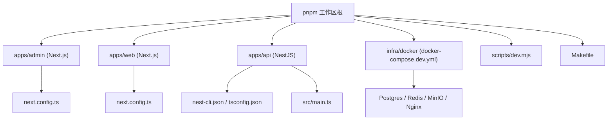
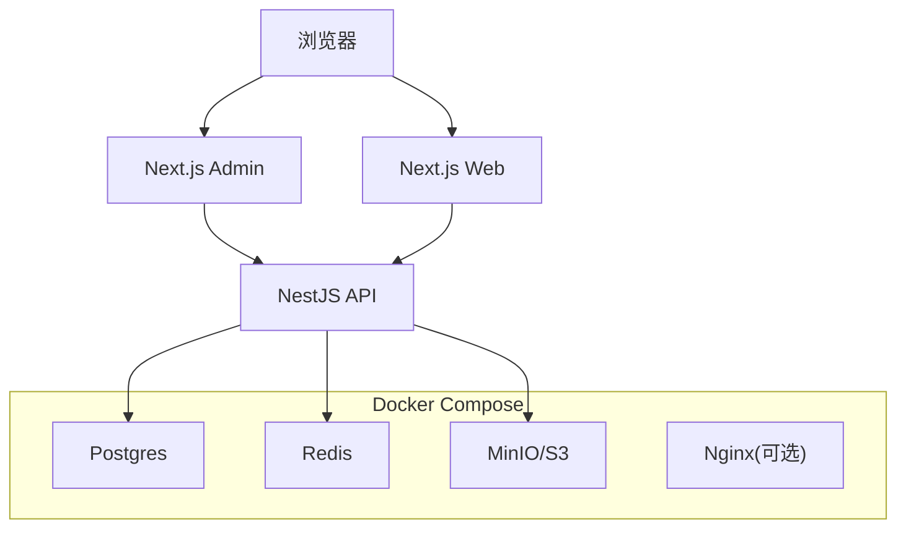
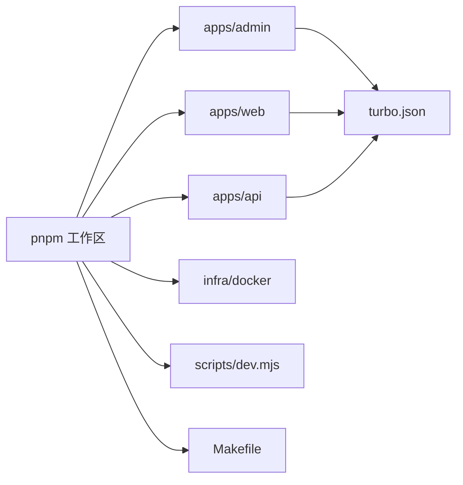

# 开发环境故障排查

<cite>
**本文引用的文件**
- [package.json](file://package.json)
- [pnpm-workspace.yaml](file://pnpm-workspace.yaml)
- [.npmrc](file://.npmrc)
- [turbo.json](file://turbo.json)
- [tsconfig.base.json](file://tsconfig.base.json)
- [apps/admin/package.json](file://apps/admin/package.json)
- [apps/admin/next.config.ts](file://apps/admin/next.config.ts)
- [apps/web/package.json](file://apps/web/package.json)
- [apps/web/next.config.ts](file://apps/web/next.config.ts)
- [apps/api/package.json](file://apps/api/package.json)
- [apps/api/nest-cli.json](file://apps/api/nest-cli.json)
- [apps/api/tsconfig.json](file://apps/api/tsconfig.json)
- [apps/api/src/main.ts](file://apps/api/src/main.ts)
- [apps/api/src/config/env.validation.ts](file://apps/api/src/config/env.validation.ts)
- [infra/docker/docker-compose.dev.yml](file://infra/docker/docker-compose.dev.yml)
- [scripts/dev.mjs](file://scripts/dev.mjs)
- [Makefile](file://Makefile)
- [README.md](file://README.md)
</cite>

## 目录
1. [简介](#简介)
2. [项目结构](#项目结构)
3. [核心组件](#核心组件)
4. [架构总览](#架构总览)
5. [详细组件分析](#详细组件分析)
6. [依赖关系分析](#依赖关系分析)
7. [性能注意事项](#性能注意事项)
8. [故障排查指南](#故障排查指南)
9. [结论](#结论)
10. [附录](#附录)

## 简介
本指南面向使用 pnpm 工作区、Next.js（admin/web）与 NestJS（api）的本地开发环境，聚焦以下高频问题：Node.js 版本不兼容、依赖安装失败、端口冲突、环境变量配置错误、pnpm 工作区配置异常、TypeScript 编译错误、Next.js 构建失败、NestJS 服务启动异常、开发服务器热重载失效、数据库连接池配置、Redis 缓存连接问题。同时提供调试工具使用建议（Chrome DevTools、VS Code 调试、日志级别调整）。

## 项目结构
本项目采用 pnpm 工作区组织多应用：
- apps/admin：Next.js 管理后台
- apps/web：Next.js 官网站点
- apps/api：NestJS 后端服务
- infra/docker：本地开发容器编排（Postgres、Redis、MinIO、Nginx 等）
- scripts/dev.mjs：统一开发脚本入口
- Makefile：常用命令封装

图表来源
- [pnpm-workspace.yaml](file://pnpm-workspace.yaml)
- [apps/admin/next.config.ts](file://apps/admin/next.config.ts)
- [apps/web/next.config.ts](file://apps/web/next.config.ts)
- [apps/api/nest-cli.json](file://apps/api/nest-cli.json)
- [apps/api/src/main.ts](file://apps/api/src/main.ts)
- [infra/docker/docker-compose.dev.yml](file://infra/docker/docker-compose.dev.yml)

章节来源
- [pnpm-workspace.yaml](file://pnpm-workspace.yaml)
- [scripts/dev.mjs](file://scripts/dev.mjs)
- [Makefile](file://Makefile)
- [README.md](file://README.md)

## 核心组件
- Node.js 与包管理器
  - Node.js 版本需与工作区及 Next/Nest 要求一致；pnpm 用于统一依赖解析与安装。
- Next.js 应用（admin/web）
  - 通过 next.config.ts 控制构建与运行时行为；开发模式支持热重载。
- NestJS 应用（api）
  - 通过 nest-cli.json 与 tsconfig.json 管理构建与类型检查；main.ts 为进程入口。
- 基础设施（Docker Compose）
  - docker-compose.dev.yml 定义 Postgres、Redis、MinIO、Nginx 等依赖服务。
- 开发脚本
  - scripts/dev.mjs 聚合开发任务；Makefile 提供便捷命令。

章节来源
- [apps/admin/package.json](file://apps/admin/package.json)
- [apps/web/package.json](file://apps/web/package.json)
- [apps/api/package.json](file://apps/api/package.json)
- [apps/admin/next.config.ts](file://apps/admin/next.config.ts)
- [apps/web/next.config.ts](file://apps/web/next.config.ts)
- [apps/api/nest-cli.json](file://apps/api/nest-cli.json)
- [apps/api/tsconfig.json](file://apps/api/tsconfig.json)
- [apps/api/src/main.ts](file://apps/api/src/main.ts)
- [infra/docker/docker-compose.dev.yml](file://infra/docker/docker-compose.dev.yml)
- [scripts/dev.mjs](file://scripts/dev.mjs)
- [Makefile](file://Makefile)

## 架构总览
下图展示本地开发时各组件交互关系：浏览器访问 Next.js 前端，调用 NestJS API，API 连接 Postgres 与 Redis，Nginx 作为反向代理（可选），所有依赖由 Docker Compose 启动。

图表来源
- [apps/admin/next.config.ts](file://apps/admin/next.config.ts)
- [apps/web/next.config.ts](file://apps/web/next.config.ts)
- [apps/api/src/main.ts](file://apps/api/src/main.ts)
- [infra/docker/docker-compose.dev.yml](file://infra/docker/docker-compose.dev.yml)

## 详细组件分析

### Node.js 版本与 pnpm 工作区
- 常见问题
  - Node.js 版本过低或过高导致 Next/Nest 构建失败或运行异常。
  - pnpm 工作区未正确识别子应用，导致依赖缺失或重复安装。
- 诊断要点
  - 确认 Node.js 版本满足 Next.js 与 NestJS 的要求。
  - 检查工作区配置文件是否包含 apps/* 子应用。
  - 清理并重新安装依赖，确保锁文件一致性。
- 解决步骤
  - 切换至指定 Node.js 版本（建议使用 nvm）。
  - 删除 node_modules 与 pnpm-lock.yaml，重新执行 pnpm install。
  - 验证 pnpm 工作区识别：pnpm list -r。

章节来源
- [package.json](file://package.json)
- [pnpm-workspace.yaml](file://pnpm-workspace.yaml)
- [.npmrc](file://.npmrc)

### TypeScript 编译错误
- 常见问题
  - 基础 tsconfig 配置不一致导致类型检查失败。
  - Next.js 或 NestJS 的 tsconfig 覆盖不当。
- 诊断要点
  - 检查根级 tsconfig.base.json 与应用的 tsconfig.json。
  - 确认模块解析路径、严格模式、目标版本设置。
- 解决步骤
  - 统一基础配置，避免重复声明。
  - 在各自应用中扩展基础配置，保持类型一致性。
  - 使用 tsc --noEmit 进行快速类型检查。

章节来源
- [tsconfig.base.json](file://tsconfig.base.json)
- [apps/api/tsconfig.json](file://apps/api/tsconfig.json)

### Next.js 构建失败
- 常见问题
  - Node.js 版本不匹配、依赖缺失、环境变量未设置。
  - next.config.ts 配置项不兼容当前版本。
- 诊断要点
  - 查看构建日志中的错误堆栈与警告。
  - 检查环境变量是否按 Next.js 约定注入。
- 解决步骤
  - 升级/降级 Node.js 至受支持版本。
  - 清理缓存并重新安装依赖。
  - 校验 next.config.ts 配置项与版本兼容性。

章节来源
- [apps/admin/package.json](file://apps/admin/package.json)
- [apps/web/package.json](file://apps/web/package.json)
- [apps/admin/next.config.ts](file://apps/admin/next.config.ts)
- [apps/web/next.config.ts](file://apps/web/next.config.ts)

### NestJS 服务启动异常
- 常见问题
  - 环境变量缺失或格式错误，导致配置校验失败。
  - 数据库/Redis 连接不可用。
  - 端口被占用。
- 诊断要点
  - 检查 main.ts 启动流程与环境变量加载。
  - 查看 env.validation.ts 中必填字段与类型约束。
  - 确认依赖服务健康状态。
- 解决步骤
  - 补全 .env 或容器环境变量，确保校验通过。
  - 重启依赖服务并验证连通性。
  - 更换可用端口或释放占用端口。

章节来源
- [apps/api/src/main.ts](file://apps/api/src/main.ts)
- [apps/api/src/config/env.validation.ts](file://apps/api/src/config/env.validation.ts)
- [apps/api/package.json](file://apps/api/package.json)
- [apps/api/nest-cli.json](file://apps/api/nest-cli.json)

### 开发服务器热重载失效
- 常见问题
  - 文件监听器未生效，修改后无刷新。
  - 缓存或代理配置影响热更新。
- 诊断要点
  - 确认 Next.js 开发模式已启用。
  - 检查代理与中间件是否阻塞事件流。
- 解决步骤
  - 重启开发服务器，清除缓存。
  - 禁用不必要的代理或中间件定位问题。
  - 使用浏览器开发者工具观察网络请求与 WebSocket 连接。

章节来源
- [apps/admin/next.config.ts](file://apps/admin/next.config.ts)
- [apps/web/next.config.ts](file://apps/web/next.config.ts)

### 数据库连接池配置
- 常见问题
  - 连接数不足导致超时或拒绝连接。
  - 最大连接数超过数据库限制。
- 诊断要点
  - 检查 Prisma/ORM 连接池参数（如 max、min、timeout）。
  - 监控数据库活跃连接与慢查询。
- 解决步骤
  - 根据并发量调整连接池大小。
  - 优化查询与事务，减少长事务占用。
  - 增加数据库实例资源或启用连接复用。

章节来源
- [apps/api/prisma/schema.prisma](file://apps/api/prisma/schema.prisma)

### Redis 缓存连接问题
- 常见问题
  - 地址/端口/密码配置错误。
  - 网络不通或防火墙拦截。
- 诊断要点
  - 检查 Redis 服务是否在 docker-compose.dev.yml 中启动。
  - 验证环境变量中的 host、port、password。
- 解决步骤
  - 修正环境变量并重载服务。
  - 使用 redis-cli 测试连通性。
  - 检查容器网络与端口映射。

章节来源
- [infra/docker/docker-compose.dev.yml](file://infra/docker/docker-compose.dev.yml)

## 依赖关系分析
- 工作区依赖
  - pnpm-workspace.yaml 定义子应用集合，确保依赖共享与隔离。
- 构建与任务编排
  - turbo.json 协调多应用构建与缓存。
  - scripts/dev.mjs 与 Makefile 封装常用命令。
- 外部依赖
  - Postgres、Redis、MinIO、Nginx 由 Docker Compose 管理。

图表来源
- [pnpm-workspace.yaml](file://pnpm-workspace.yaml)
- [turbo.json](file://turbo.json)
- [scripts/dev.mjs](file://scripts/dev.mjs)
- [Makefile](file://Makefile)

章节来源
- [pnpm-workspace.yaml](file://pnpm-workspace.yaml)
- [turbo.json](file://turbo.json)
- [scripts/dev.mjs](file://scripts/dev.mjs)
- [Makefile](file://Makefile)

## 性能注意事项
- 合理设置 Node.js 内存上限，避免构建阶段 OOM。
- 使用 pnpm 的缓存与硬链接加速依赖安装。
- 对 Next.js 静态资源启用 CDN 与压缩。
- 对 NestJS 接口启用响应缓存与分页。
- 数据库连接池与索引优化，减少慢查询。

## 故障排查指南

### Node.js 版本兼容性问题
- 症状
  - 构建报错、模块加载失败、语法不支持。
- 排查
  - 查看 Next.js 与 NestJS 文档要求的 Node.js 版本范围。
  - 使用 nvm 切换版本并验证 node -v。
- 解决
  - 锁定 Node.js 版本（推荐 .nvmrc 或 CI 固定版本）。
  - 清理缓存后重装依赖。

章节来源
- [apps/admin/package.json](file://apps/admin/package.json)
- [apps/web/package.json](file://apps/web/package.json)
- [apps/api/package.json](file://apps/api/package.json)

### 依赖安装失败
- 症状
  - pnpm install 报错、权限不足、网络超时。
- 排查
  - 检查 .npmrc 镜像源与网络可达性。
  - 确认磁盘空间与权限。
- 解决
  - 配置国内镜像源，重试安装。
  - 删除 node_modules 与 pnpm-lock.yaml 后重装。

章节来源
- [.npmrc](file://.npmrc)
- [package.json](file://package.json)

### 端口冲突
- 症状
  - 服务启动失败，提示端口被占用。
- 排查
  - 使用 lsof/netstat 查找占用端口的进程。
  - 检查 docker-compose 端口映射。
- 解决
  - 终止占用进程或修改端口配置。
  - 调整容器端口映射避免冲突。

章节来源
- [infra/docker/docker-compose.dev.yml](file://infra/docker/docker-compose.dev.yml)

### 环境变量配置错误
- 症状
  - 启动时报错缺少必填项或类型错误。
- 排查
  - 核对 env.validation.ts 中字段名与类型。
  - 检查 .env 文件是否被正确加载。
- 解决
  - 补齐缺失变量，修正值格式。
  - 重启服务并查看日志。

章节来源
- [apps/api/src/config/env.validation.ts](file://apps/api/src/config/env.validation.ts)

### pnpm 工作区配置问题
- 症状
  - 子应用无法识别、依赖缺失或重复。
- 排查
  - 检查 pnpm-workspace.yaml 的 packages 列表。
  - 确认子应用 package.json 的依赖声明。
- 解决
  - 修正工作区配置，同步锁文件。
  - 使用 pnpm list -r 验证依赖树。

章节来源
- [pnpm-workspace.yaml](file://pnpm-workspace.yaml)
- [apps/admin/package.json](file://apps/admin/package.json)
- [apps/web/package.json](file://apps/web/package.json)
- [apps/api/package.json](file://apps/api/package.json)

### TypeScript 编译错误
- 症状
  - tsc 报错、类型不匹配、模块找不到。
- 排查
  - 检查 tsconfig.base.json 与应用的 tsconfig.json。
  - 确认路径别名与模块解析策略。
- 解决
  - 统一基础配置，修复类型定义。
  - 使用 tsc --noEmit 快速定位。

章节来源
- [tsconfig.base.json](file://tsconfig.base.json)
- [apps/api/tsconfig.json](file://apps/api/tsconfig.json)

### Next.js 构建失败
- 症状
  - 构建中断、模块缺失、环境变量未注入。
- 排查
  - 查看构建日志与 next.config.ts 配置。
  - 检查 Node.js 版本与依赖完整性。
- 解决
  - 升级/降级 Node.js，清理缓存重装。
  - 修正 next.config.ts 不兼容项。

章节来源
- [apps/admin/next.config.ts](file://apps/admin/next.config.ts)
- [apps/web/next.config.ts](file://apps/web/next.config.ts)

### NestJS 服务启动异常
- 症状
  - 启动失败、依赖注入错误、连接失败。
- 排查
  - 检查 main.ts 启动顺序与依赖服务状态。
  - 验证环境变量与连接参数。
- 解决
  - 修正环境变量，重启依赖服务。
  - 调整端口与网络配置。

章节来源
- [apps/api/src/main.ts](file://apps/api/src/main.ts)
- [apps/api/src/config/env.validation.ts](file://apps/api/src/config/env.validation.ts)

### 开发服务器热重载失效
- 症状
  - 修改代码后页面不刷新。
- 排查
  - 确认 Next.js 开发模式与代理配置。
  - 检查浏览器控制台与网络面板。
- 解决
  - 重启开发服务器，禁用干扰中间件。
  - 使用浏览器调试工具定位。

章节来源
- [apps/admin/next.config.ts](file://apps/admin/next.config.ts)
- [apps/web/next.config.ts](file://apps/web/next.config.ts)

### 数据库连接池配置
- 症状
  - 连接超时、拒绝连接、性能下降。
- 排查
  - 检查连接池参数与数据库负载。
- 解决
  - 调整 max/min/timeout 参数。
  - 优化查询与索引。

章节来源
- [apps/api/prisma/schema.prisma](file://apps/api/prisma/schema.prisma)

### Redis 缓存连接问题
- 症状
  - 连接失败、认证失败、超时。
- 排查
  - 检查 docker-compose 中 Redis 配置与网络。
  - 验证环境变量 host/port/password。
- 解决
  - 修正环境变量，重启服务。
  - 使用 redis-cli 测试连通性。

章节来源
- [infra/docker/docker-compose.dev.yml](file://infra/docker/docker-compose.dev.yml)

### 调试工具使用指南
- Chrome DevTools
  - 打开 Sources 面板断点调试前端代码。
  - 使用 Network 面板检查 API 请求与响应。
  - 利用 Console 输出日志与错误信息。
- VS Code 调试配置
  - 创建 launch.json 配置 Node.js 调试（Next/Nest）。
  - 设置断点与变量监视，逐步执行。
- 日志级别调整
  - NestJS 可通过环境变量或配置调整日志级别。
  - Next.js 开发模式下输出详细构建与运行时日志。

章节来源
- [apps/api/src/main.ts](file://apps/api/src/main.ts)
- [apps/admin/next.config.ts](file://apps/admin/next.config.ts)
- [apps/web/next.config.ts](file://apps/web/next.config.ts)

## 结论
通过系统化的排查流程与工具使用，可高效定位并解决 Node.js 版本、依赖安装、端口冲突、环境变量、pnpm 工作区、TypeScript、Next.js、NestJS、热重载、数据库与 Redis 等常见问题。建议在团队内统一环境与配置规范，结合 CI/CD 固化最佳实践。

## 附录
- 常用命令
  - 安装依赖：pnpm install
  - 启动开发：scripts/dev.mjs 或 Makefile 对应命令
  - 类型检查：tsc --noEmit
  - 构建应用：Next/Nest 构建命令
- 参考文档
  - Next.js 官方文档
  - NestJS 官方文档
  - pnpm 工作区文档
  - Docker Compose 文档