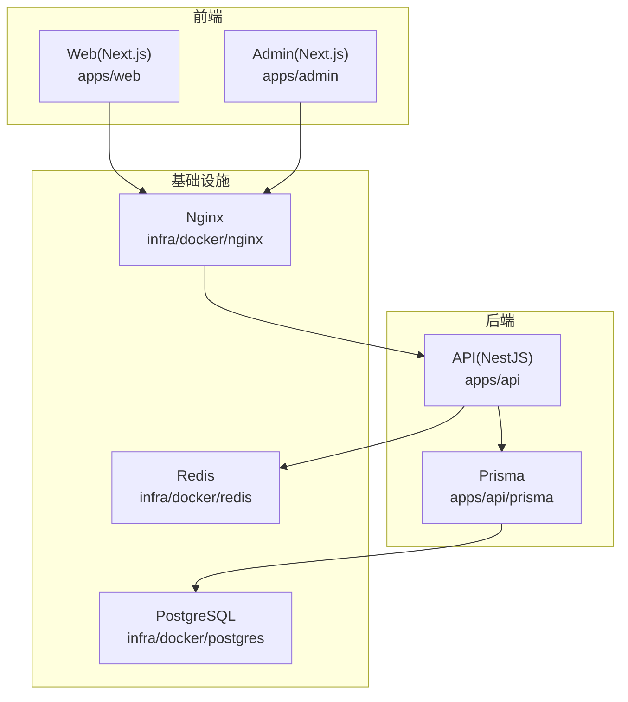
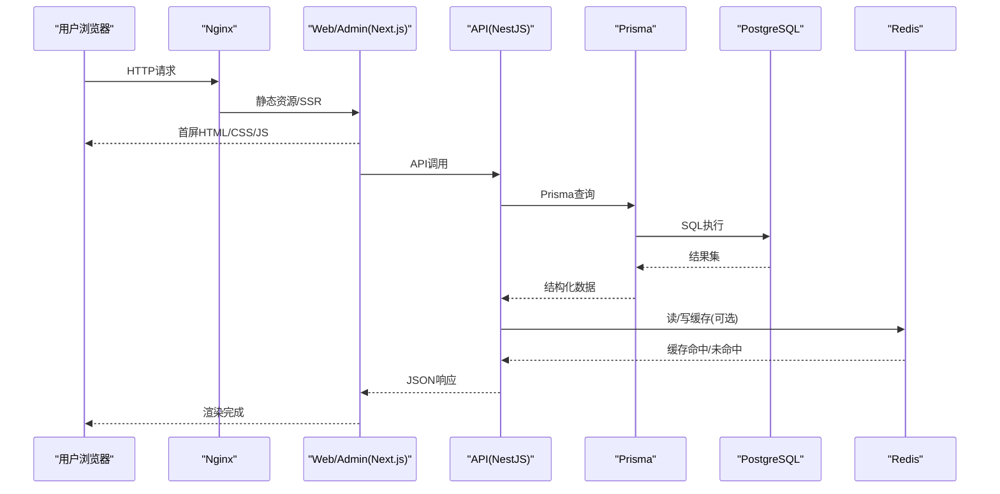
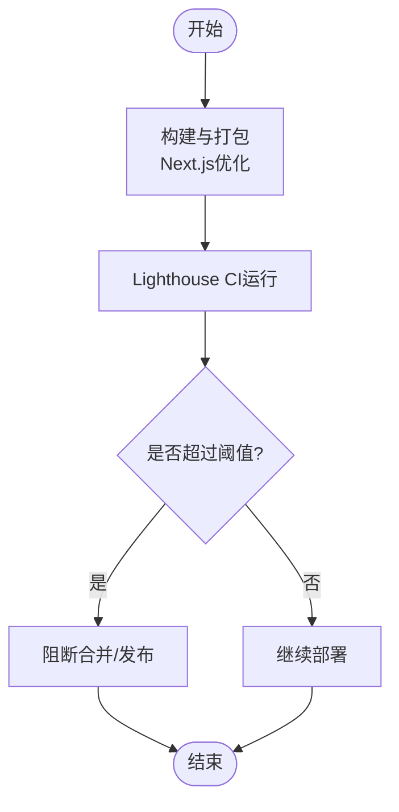
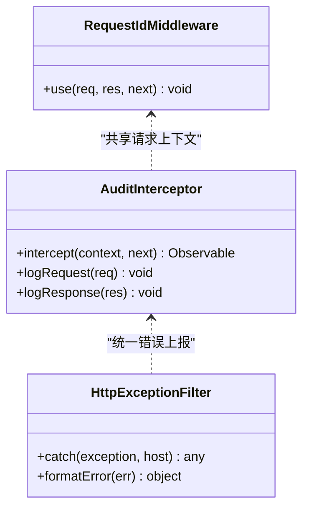
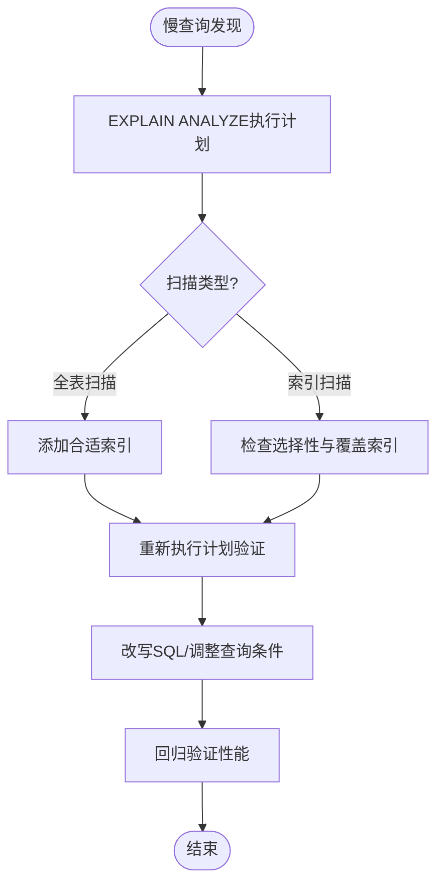
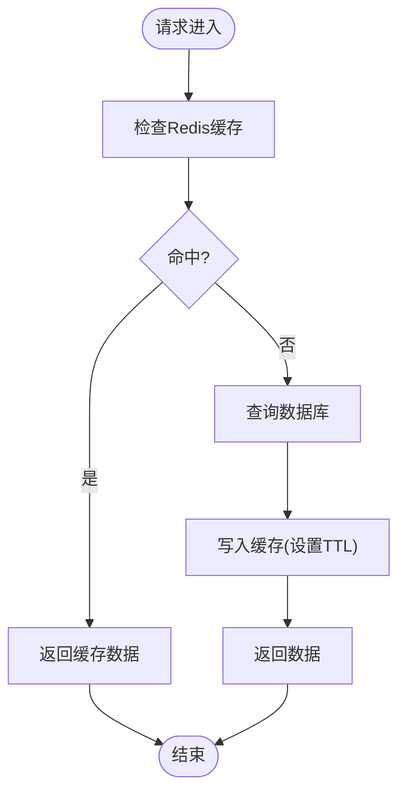
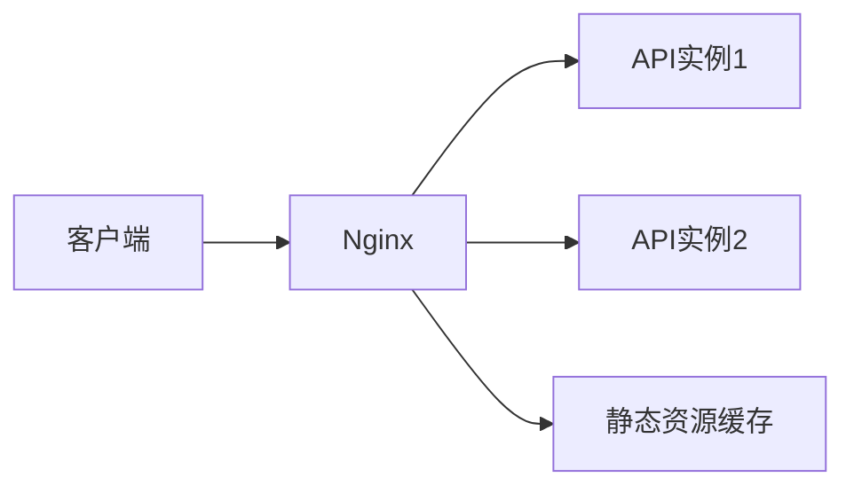
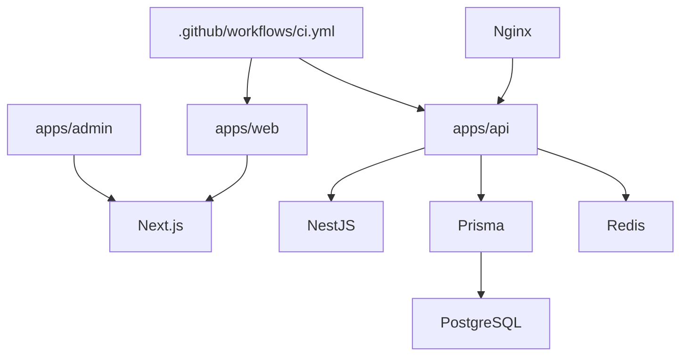

# 性能监控与优化

<cite>
**本文引用的文件**   
- [apps/admin/package.json](file://apps/admin/package.json)
- [apps/web/package.json](file://apps/web/package.json)
- [apps/api/package.json](file://apps/api/package.json)
- [apps/web/lighthouserc.json](file://apps/web/lighthouserc.json)
- [apps/web/next.config.ts](file://apps/web/next.config.ts)
- [apps/admin/next.config.ts](file://apps/admin/next.config.ts)
- [apps/api/src/main.ts](file://apps/api/src/main.ts)
- [apps/api/src/app.module.ts](file://apps/api/src/app.module.ts)
- [apps/api/src/common/middleware/request-id.middleware.ts](file://apps/api/src/common/middleware/request-id.middleware.ts)
- [apps/api/src/common/interceptors/audit.interceptor.ts](file://apps/api/src/common/interceptors/audit.interceptor.ts)
- [apps/api/src/common/filters/http-exception.filter.ts](file://apps/api/src/common/filters/http-exception.filter.ts)
- [apps/api/src/config/env.validation.ts](file://apps/api/src/config/env.validation.ts)
- [apps/api/prisma/schema.prisma](file://apps/api/prisma/schema.prisma)
- [infra/docker/nginx/tzj.conf](file://infra/docker/nginx/tzj.conf)
- [infra/docker/nginx/snippets/proxy-docker.conf](file://infra/docker/nginx/snippets/proxy-docker.conf)
- [infra/docker/postgres/init.sql](file://infra/docker/postgres/init.sql)
- [infra/docker/redis/redis.conf](file://infra/docker/redis/redis.conf)
- [.github/workflows/ci.yml](file://.github/workflows/ci.yml)
</cite>

## 目录
1. [简介](#简介)
2. [项目结构](#项目结构)
3. [核心组件](#核心组件)
4. [架构总览](#架构总览)
5. [详细组件分析](#详细组件分析)
6. [依赖关系分析](#依赖关系分析)
7. [性能考量](#性能考量)
8. [故障排查指南](#故障排查指南)
9. [结论](#结论)
10. [附录](#附录)

## 简介
本指南面向前端页面加载、后端API响应时间、数据库查询效率与内存使用的全链路性能监控与优化。结合仓库中的Next.js前端、NestJS后端、Prisma数据层、Nginx网关以及PostgreSQL/Redis基础设施，提供指标采集、APM集成、日志聚合、告警规则、浏览器与Node.js剖析、数据库执行计划分析与缓存命中率优化的实施方案，并给出基准测试、压测脚本与容量规划模型及调优最佳实践。

## 项目结构
本项目采用多应用（admin、web、api）+ 基础设施（nginx、postgres、redis）的模块化组织：
- 前端：Next.js（admin与web），具备构建与运行时优化配置
- 后端：NestJS（api），包含中间件、拦截器、过滤器与模块划分
- 数据层：Prisma ORM + PostgreSQL；可选Redis用于会话或缓存
- 网关：Nginx反向代理与静态资源加速
- CI/CD：GitHub Actions流水线

**图表来源** 
- [apps/web/next.config.ts](file://apps/web/next.config.ts)
- [apps/admin/next.config.ts](file://apps/admin/next.config.ts)
- [apps/api/src/app.module.ts](file://apps/api/src/app.module.ts)
- [apps/api/prisma/schema.prisma](file://apps/api/prisma/schema.prisma)
- [infra/docker/nginx/tzj.conf](file://infra/docker/nginx/tzj.conf)
- [infra/docker/postgres/init.sql](file://infra/docker/postgres/init.sql)
- [infra/docker/redis/redis.conf](file://infra/docker/redis/redis.conf)

**章节来源**
- [apps/web/package.json](file://apps/web/package.json)
- [apps/admin/package.json](file://apps/admin/package.json)
- [apps/api/package.json](file://apps/api/package.json)

## 核心组件
- 前端性能基线：Lighthouse CI配置与Next.js构建优化
- 后端可观测性：请求ID、审计拦截器、异常过滤器、环境变量校验
- 数据访问：Prisma Schema定义与迁移管理
- 网关与缓存：Nginx反向代理与Redis配置
- 持续集成：CI中嵌入性能检查任务

**章节来源**
- [apps/web/lighthouserc.json](file://apps/web/lighthouserc.json)
- [apps/web/next.config.ts](file://apps/web/next.config.ts)
- [apps/admin/next.config.ts](file://apps/admin/next.config.ts)
- [apps/api/src/main.ts](file://apps/api/src/main.ts)
- [apps/api/src/common/middleware/request-id.middleware.ts](file://apps/api/src/common/middleware/request-id.middleware.ts)
- [apps/api/src/common/interceptors/audit.interceptor.ts](file://apps/api/src/common/interceptors/audit.interceptor.ts)
- [apps/api/src/common/filters/http-exception.filter.ts](file://apps/api/src/common/filters/http-exception.filter.ts)
- [apps/api/src/config/env.validation.ts](file://apps/api/src/config/env.validation.ts)
- [apps/api/prisma/schema.prisma](file://apps/api/prisma/schema.prisma)
- [infra/docker/nginx/tzj.conf](file://infra/docker/nginx/tzj.conf)
- [infra/docker/redis/redis.conf](file://infra/docker/redis/redis.conf)
- [.github/workflows/ci.yml](file://.github/workflows/ci.yml)

## 架构总览
下图展示从浏览器到数据库的关键路径，标注了性能监控与优化落点：

**图表来源** 
- [infra/docker/nginx/tzj.conf](file://infra/docker/nginx/tzj.conf)
- [apps/web/next.config.ts](file://apps/web/next.config.ts)
- [apps/admin/next.config.ts](file://apps/admin/next.config.ts)
- [apps/api/src/app.module.ts](file://apps/api/src/app.module.ts)
- [apps/api/prisma/schema.prisma](file://apps/api/prisma/schema.prisma)
- [infra/docker/redis/redis.conf](file://infra/docker/redis/redis.conf)

## 详细组件分析

### 前端页面加载性能（Next.js + Lighthouse）
- 构建与运行时优化：通过Next.js配置启用必要的优化项（如图片优化、字体优化、代码分割等）
- Lighthouse CI：在CI中运行性能审计，设置阈值阻断低质量变更
- 关键指标：FCP、LCP、CLS、TBT、TTI等

**图表来源** 
- [apps/web/lighthouserc.json](file://apps/web/lighthouserc.json)
- [apps/web/next.config.ts](file://apps/web/next.config.ts)
- [apps/admin/next.config.ts](file://apps/admin/next.config.ts)
- [.github/workflows/ci.yml](file://.github/workflows/ci.yml)

**章节来源**
- [apps/web/lighthouserc.json](file://apps/web/lighthouserc.json)
- [apps/web/next.config.ts](file://apps/web/next.config.ts)
- [apps/admin/next.config.ts](file://apps/admin/next.config.ts)
- [.github/workflows/ci.yml](file://.github/workflows/ci.yml)

### 后端API响应时间（NestJS中间件与拦截器）
- 请求ID：为每个请求生成唯一ID，贯穿日志与追踪
- 审计拦截器：记录请求/响应耗时、状态码、方法、路径
- 异常过滤器：统一错误格式与堆栈信息，便于定位慢请求根因

**图表来源** 
- [apps/api/src/common/middleware/request-id.middleware.ts](file://apps/api/src/common/middleware/request-id.middleware.ts)
- [apps/api/src/common/interceptors/audit.interceptor.ts](file://apps/api/src/common/interceptors/audit.interceptor.ts)
- [apps/api/src/common/filters/http-exception.filter.ts](file://apps/api/src/common/filters/http-exception.filter.ts)

**章节来源**
- [apps/api/src/main.ts](file://apps/api/src/main.ts)
- [apps/api/src/common/middleware/request-id.middleware.ts](file://apps/api/src/common/middleware/request-id.middleware.ts)
- [apps/api/src/common/interceptors/audit.interceptor.ts](file://apps/api/src/common/interceptors/audit.interceptor.ts)
- [apps/api/src/common/filters/http-exception.filter.ts](file://apps/api/src/common/filters/http-exception.filter.ts)

### 数据库查询效率（Prisma + PostgreSQL）
- Schema建模：明确表结构与索引策略，避免N+1查询
- 连接池：合理配置Prisma连接池大小与超时
- 执行计划：对慢查询使用EXPLAIN/ANALYZE定位全表扫描与缺失索引

**图表来源** 
- [apps/api/prisma/schema.prisma](file://apps/api/prisma/schema.prisma)
- [infra/docker/postgres/init.sql](file://infra/docker/postgres/init.sql)

**章节来源**
- [apps/api/prisma/schema.prisma](file://apps/api/prisma/schema.prisma)
- [infra/docker/postgres/init.sql](file://infra/docker/postgres/init.sql)

### 缓存命中率优化（Redis）
- 热点数据缓存：将高频读取的数据放入Redis，降低DB压力
- 缓存策略：TTL、失效策略、一致性保证（先删后更/延迟双删）
- 监控指标：命中率、过期率、内存占用、键空间分布

**图表来源** 
- [infra/docker/redis/redis.conf](file://infra/docker/redis/redis.conf)

**章节来源**
- [infra/docker/redis/redis.conf](file://infra/docker/redis/redis.conf)

### 网关与反向代理（Nginx）
- 负载均衡与健康检查：多实例API服务均衡分发
- 静态资源缓存：开启Gzip/Brotli、HTTP缓存头
- 限流与熔断：基于IP或路径的速率限制

**图表来源** 
- [infra/docker/nginx/tzj.conf](file://infra/docker/nginx/tzj.conf)
- [infra/docker/nginx/snippets/proxy-docker.conf](file://infra/docker/nginx/snippets/proxy-docker.conf)

**章节来源**
- [infra/docker/nginx/tzj.conf](file://infra/docker/nginx/tzj.conf)
- [infra/docker/nginx/snippets/proxy-docker.conf](file://infra/docker/nginx/snippets/proxy-docker.conf)

## 依赖关系分析
- 前端依赖Next.js生态与构建工具链
- 后端依赖NestJS模块体系、Prisma与数据库驱动
- 基础设施依赖Nginx、PostgreSQL、Redis
- CI依赖GitHub Actions与Lighthouse CLI

**图表来源** 
- [apps/web/package.json](file://apps/web/package.json)
- [apps/admin/package.json](file://apps/admin/package.json)
- [apps/api/package.json](file://apps/api/package.json)
- [apps/api/prisma/schema.prisma](file://apps/api/prisma/schema.prisma)
- [.github/workflows/ci.yml](file://.github/workflows/ci.yml)

**章节来源**
- [apps/web/package.json](file://apps/web/package.json)
- [apps/admin/package.json](file://apps/admin/package.json)
- [apps/api/package.json](file://apps/api/package.json)
- [apps/api/prisma/schema.prisma](file://apps/api/prisma/schema.prisma)
- [.github/workflows/ci.yml](file://.github/workflows/ci.yml)

## 性能考量
- 前端
  - 首屏优化：减少主包体积、懒加载路由与组件、预取关键数据
  - 资源优化：图片压缩、字体子集化、HTTP缓存与CDN
  - 监控：Lighthouse CI阈值、浏览器Performance API采集
- 后端
  - 接口耗时：请求级计时、慢请求采样、热点接口限流
  - 内存：Node.js堆快照、GC事件监控、长连接与缓冲控制
  - 日志：结构化日志、请求ID关联、集中式收集
- 数据库
  - 索引：复合索引、覆盖索引、选择性评估
  - 连接池：根据CPU与IO能力调优最大连接数
  - 执行计划：定期巡检慢查询、统计直方图
- 缓存
  - 命中率目标：>90%（热点数据）
  - 失效策略：TTL与主动失效结合
  - 一致性：读写分离场景下的最终一致策略
- 网关
  - 压缩与缓存：Gzip/Brotli、ETag/Last-Modified
  - 限流与降级：突发流量保护与优雅降级

[本节为通用指导，不直接分析具体文件]

## 故障排查指南
- 慢请求定位
  - 通过请求ID串联Nginx、API、数据库日志
  - 使用审计拦截器的耗时字段快速筛选Top慢接口
- 内存泄漏排查
  - Node.js堆快照对比、查看对象增长趋势
  - 关注长生命周期对象与闭包引用
- 数据库瓶颈
  - EXPLAIN输出分析扫描方式与索引使用情况
  - 锁等待与死锁检测
- 缓存问题
  - 命中率下降时检查TTL与并发穿透
  - 热点键倾斜导致内存抖动

**章节来源**
- [apps/api/src/common/middleware/request-id.middleware.ts](file://apps/api/src/common/middleware/request-id.middleware.ts)
- [apps/api/src/common/interceptors/audit.interceptor.ts](file://apps/api/src/common/interceptors/audit.interceptor.ts)
- [apps/api/src/common/filters/http-exception.filter.ts](file://apps/api/src/common/filters/http-exception.filter.ts)
- [apps/api/prisma/schema.prisma](file://apps/api/prisma/schema.prisma)
- [infra/docker/redis/redis.conf](file://infra/docker/redis/redis.conf)

## 结论
通过在前端引入Lighthouse CI与Next.js优化、在后端建立请求级可观测性（请求ID、审计拦截器、异常过滤）、在数据层规范Schema与索引、在网关层强化缓存与限流，并结合Redis缓存命中率与数据库执行计划分析，可以形成闭环的性能监控与优化体系。配合CI门禁与告警规则，确保性能基线不被破坏，持续提升用户体验与系统稳定性。

[本节为总结，不直接分析具体文件]

## 附录

### 性能指标采集与APM集成建议
- 前端
  - 指标：FCP、LCP、CLS、TBT、INP、FID（兼容）
  - 采集：Performance Observer、自定义埋点上报
  - APM：Sentry/RUM接入，按环境区分版本与用户维度
- 后端
  - 指标：QPS、P95/P99延迟、错误率、CPU/内存/GC
  - 采集：Prometheus导出、OpenTelemetry链路追踪
  - APM：集成至集中式平台（如SkyWalking、Jaeger）
- 数据库
  - 指标：慢查询数、连接池利用率、锁等待、复制延迟
  - 采集：pg_stat_statements、慢查询日志
- 缓存
  - 指标：命中率、内存使用、键数量、过期率
  - 采集：Redis INFO/监控面板

[本节为通用指导，不直接分析具体文件]

### 日志聚合分析与告警规则配置
- 日志聚合
  - 统一JSON格式，包含请求ID、级别、消息、上下文
  - 集中存储（ELK/Loki），支持检索与可视化
- 告警规则
  - 接口P99延迟>阈值（如500ms）持续5分钟
  - 错误率>1%且绝对量>阈值
  - 数据库慢查询>阈值、连接池耗尽
  - 缓存命中率<85%持续10分钟
  - 内存使用>80%且GC频繁

[本节为通用指导，不直接分析具体文件]

### 浏览器性能分析工具使用要点
- Chrome DevTools
  - Performance面板录制关键路径，识别长任务与阻塞
  - Network面板分析资源加载顺序与缓存命中
  - Memory面板进行堆快照对比定位泄漏
- Lighthouse
  - 本地与CI双轨运行，设定通过率门槛
- Web Vitals
  - 上报核心指标至分析平台，按页面维度下钻

[本节为通用指导，不直接分析具体文件]

### Node.js性能剖析要点
- 内置Profiler与--inspect
- 堆快照对比（heapdump）
- GC事件监控与日志
- 热点函数火焰图分析

[本节为通用指导，不直接分析具体文件]

### 数据库执行计划分析与缓存命中率优化
- 执行计划
  - EXPLAIN/EXPLAIN ANALYZE解读扫描方式、连接算法、排序成本
  - 针对高成本节点添加索引或改写查询
- 缓存命中率优化
  - 热点Key拆分与分片
  - 批量操作与Pipeline减少RTT
  - 预热与防击穿策略

[本节为通用指导，不直接分析具体文件]

### 性能基准测试与压测脚本
- 前端基准
  - Lighthouse CI阈值、PageSpeed Insights
- 后端压测
  - k6/JMeter编写场景：登录、列表、详情、批量操作
  - 指标：吞吐、延迟分布、错误率、资源使用
- 数据库压测
  - pgbench/自定义SQL负载，观察锁与IO

[本节为通用指导，不直接分析具体文件]

### 容量规划模型与调优最佳实践
- 容量模型
  - 峰值QPS×平均响应时间=并发连接需求
  - 数据库连接池=峰值QPS×DB处理时间/并发度
  - 缓存容量=热点数据总量×放大因子
- 调优实践
  - 前端：按需加载、资源去重、CDN与缓存头
  - 后端：异步化、批处理、连接池与超时、限流降级
  - 数据库：索引优化、分区与归档、读写分离
  - 缓存：分层缓存（本地+分布式）、一致性策略

[本节为通用指导，不直接分析具体文件]