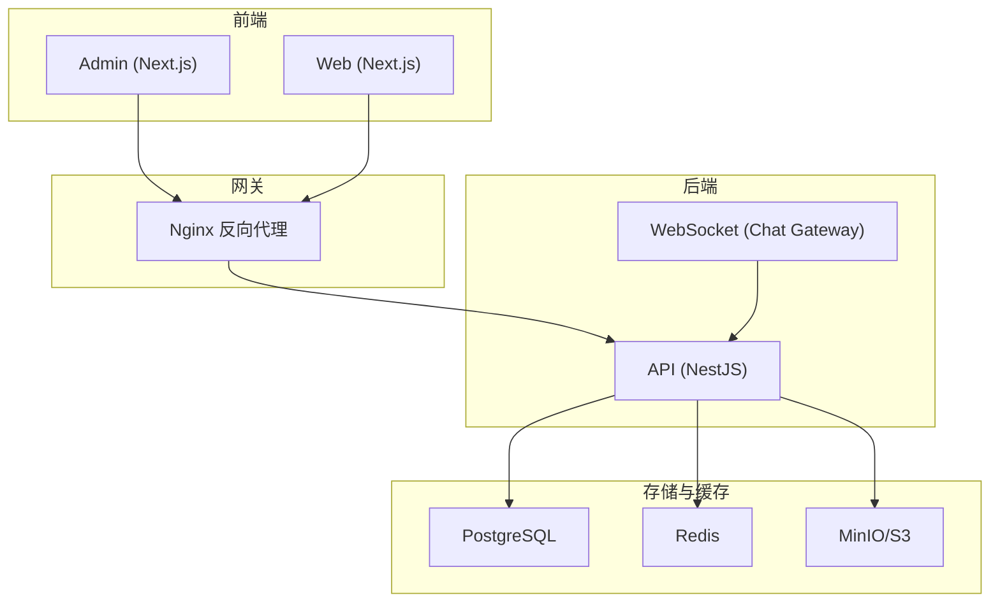
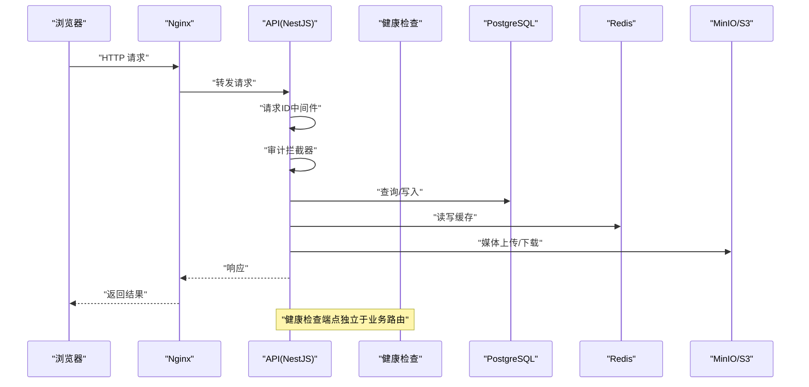
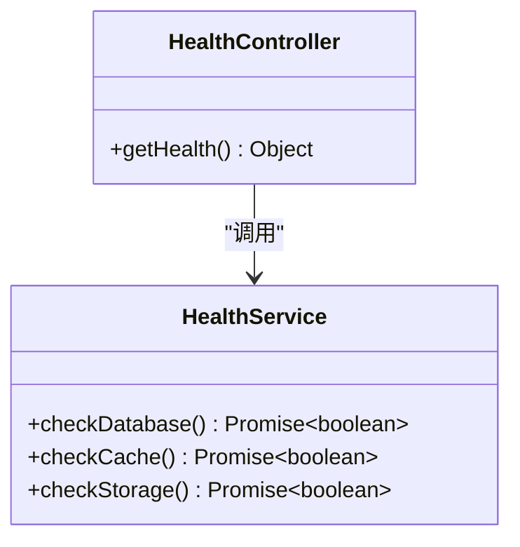
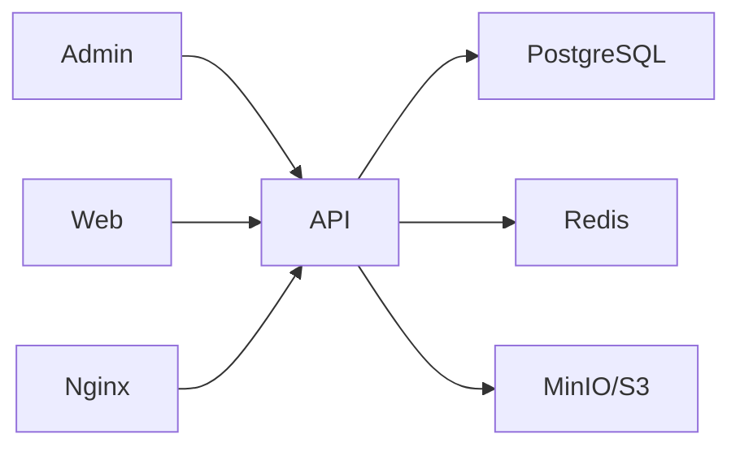

# 故障排查

<cite>
**本文引用的文件**   
- [apps/api/src/health/health.controller.ts](file://apps/api/src/health/health.controller.ts)
- [apps/api/src/health/health.service.ts](file://apps/api/src/health/health.service.ts)
- [apps/api/src/common/filters/http-exception.filter.ts](file://apps/api/src/common/filters/http-exception.filter.ts)
- [apps/api/src/common/interceptors/audit.interceptor.ts](file://apps/api/src/common/interceptors/audit.interceptor.ts)
- [apps/api/src/common/middleware/request-id.middleware.ts](file://apps/api/src/common/middleware/request-id.middleware.ts)
- [apps/api/src/config/env.validation.ts](file://apps/api/src/config/env.validation.ts)
- [apps/api/src/prisma/prisma.service.ts](file://apps/api/src/prisma/prisma.service.ts)
- [apps/api/src/storage/s3.service.ts](file://apps/api/src/storage/s3.service.ts)
- [apps/api/src/support/chat.gateway.ts](file://apps/api/src/support/chat.gateway.ts)
- [apps/api/src/support/chat-room.service.ts](file://apps/api/src/support/chat-room.service.ts)
- [apps/api/src/auth/guards/jwt-auth.guard.ts](file://apps/api/src/auth/guards/jwt-auth.guard.ts)
- [apps/api/src/security/ip-ban.guard.ts](file://apps/api/src/security/ip-ban.guard.ts)
- [apps/admin/src/lib/fetch-retry.ts](file://apps/admin/src/lib/fetch-retry.ts)
- [apps/admin/src/lib/tokenRefresh.ts](file://apps/admin/src/lib/tokenRefresh.ts)
- [apps/web/src/components/analytics/VisitorTracker.tsx](file://apps/web/src/components/analytics/VisitorTracker.tsx)
- [infra/docker/nginx/tzj.conf](file://infra/docker/nginx/tzj.conf)
- [infra/docker/nginx/snippets/proxy-docker.conf](file://infra/docker/nginx/snippets/proxy-docker.conf)
- [infra/docker/postgres/init.sql](file://infra/docker/postgres/init.sql)
- [infra/docker/redis/redis.conf](file://infra/docker/redis/redis.conf)
- [infra/docker/minio/cors.xml](file://infra/docker/minio/cors.xml)
- [.github/workflows/deploy.yml](file://.github/workflows/deploy.yml)
- [.github/workflows/deploy-ssh.yml](file://.github/workflows/deploy-ssh.yml)
- [Makefile](file://Makefile)
</cite>

## 目录
1. [简介](#简介)
2. [项目结构](#项目结构)
3. [核心组件](#核心组件)
4. [架构总览](#架构总览)
5. [详细组件分析](#详细组件分析)
6. [依赖关系分析](#依赖关系分析)
7. [性能考虑](#性能考虑)
8. [故障排查指南](#故障排查指南)
9. [结论](#结论)
10. [附录](#附录)

## 简介
本指南面向运维与开发团队，聚焦于常见问题诊断、错误日志分析、性能调优与自动化恢复。内容覆盖开发环境问题、生产部署故障、数据库连接问题、网络通信异常、调试工具使用、日志收集与分析、内存泄漏检测、CPU 性能瓶颈定位、监控告警配置、健康检查机制与自动恢复策略，并提供问题上报模板、应急处理流程与预防性维护建议。

## 项目结构
本项目采用多应用（Admin、API、Web）+ 基础设施（Nginx、PostgreSQL、Redis、MinIO）的模块化架构。API 层基于 NestJS，提供 REST 与 WebSocket；前端 Admin/Web 通过 Next.js 构建并通过 Nginx 反向代理访问。部署脚本与 CI/CD 位于 .github/workflows，本地与容器化编排位于 infra/docker。

图表来源
- [apps/api/src/main.ts](file://apps/api/src/main.ts)
- [infra/docker/nginx/tzj.conf](file://infra/docker/nginx/tzj.conf)
- [infra/docker/postgres/init.sql](file://infra/docker/postgres/init.sql)
- [infra/docker/redis/redis.conf](file://infra/docker/redis/redis.conf)
- [infra/docker/minio/cors.xml](file://infra/docker/minio/cors.xml)

章节来源
- [Makefile](file://Makefile)
- [.github/workflows/deploy.yml](file://.github/workflows/deploy.yml)
- [.github/workflows/deploy-ssh.yml](file://.github/workflows/deploy-ssh.yml)

## 核心组件
- 健康检查：提供系统级与依赖级健康探针，便于负载均衡与健康探测。
- 全局异常过滤：统一捕获并格式化 HTTP 异常，输出结构化错误信息。
- 审计拦截器：记录关键请求上下文，便于追踪与回溯。
- 请求 ID 中间件：为每个请求分配唯一 ID，贯穿日志链路。
- 环境变量校验：启动时校验必要配置，避免运行时因配置缺失导致崩溃。
- 数据库服务：封装 Prisma 客户端生命周期管理。
- 对象存储服务：封装 S3/MinIO 客户端，处理上传下载与权限。
- 鉴权与限流：JWT 守卫与 IP 封禁守卫保障安全。
- 前端重试与令牌刷新：提升网络稳定性与用户体验。

章节来源
- [apps/api/src/health/health.controller.ts](file://apps/api/src/health/health.controller.ts)
- [apps/api/src/health/health.service.ts](file://apps/api/src/health/health.service.ts)
- [apps/api/src/common/filters/http-exception.filter.ts](file://apps/api/src/common/filters/http-exception.filter.ts)
- [apps/api/src/common/interceptors/audit.interceptor.ts](file://apps/api/src/common/interceptors/audit.interceptor.ts)
- [apps/api/src/common/middleware/request-id.middleware.ts](file://apps/api/src/common/middleware/request-id.middleware.ts)
- [apps/api/src/config/env.validation.ts](file://apps/api/src/config/env.validation.ts)
- [apps/api/src/prisma/prisma.service.ts](file://apps/api/src/prisma/prisma.service.ts)
- [apps/api/src/storage/s3.service.ts](file://apps/api/src/storage/s3.service.ts)
- [apps/api/src/auth/guards/jwt-auth.guard.ts](file://apps/api/src/auth/guards/jwt-auth.guard.ts)
- [apps/api/src/security/ip-ban.guard.ts](file://apps/api/src/security/ip-ban.guard.ts)
- [apps/admin/src/lib/fetch-retry.ts](file://apps/admin/src/lib/fetch-retry.ts)
- [apps/admin/src/lib/tokenRefresh.ts](file://apps/admin/src/lib/tokenRefresh.ts)

## 架构总览
下图展示了从浏览器到 API 再到数据层的典型请求路径，以及健康检查与错误处理的介入点。

图表来源
- [infra/docker/nginx/tzj.conf](file://infra/docker/nginx/tzj.conf)
- [apps/api/src/common/middleware/request-id.middleware.ts](file://apps/api/src/common/middleware/request-id.middleware.ts)
- [apps/api/src/common/interceptors/audit.interceptor.ts](file://apps/api/src/common/interceptors/audit.interceptor.ts)
- [apps/api/src/health/health.controller.ts](file://apps/api/src/health/health.controller.ts)

## 详细组件分析

### 健康检查组件
- 功能：暴露健康检查端点，聚合数据库、缓存、对象存储等依赖状态，支持快速定位不可用依赖。
- 关键点：
  - 控制器定义健康路由，服务实现依赖探测逻辑。
  - 失败项应明确标注原因码，便于上游负载均衡或编排系统做摘除。
- 建议：
  - 将健康检查纳入 Liveness/Readiness 探针。
  - 对慢依赖设置超时与降级策略。

图表来源
- [apps/api/src/health/health.controller.ts](file://apps/api/src/health/health.controller.ts)
- [apps/api/src/health/health.service.ts](file://apps/api/src/health/health.service.ts)

章节来源
- [apps/api/src/health/health.controller.ts](file://apps/api/src/health/health.controller.ts)
- [apps/api/src/health/health.service.ts](file://apps/api/src/health/health.service.ts)

### 全局异常过滤器
- 功能：统一捕获 NestJS 异常，标准化错误响应体，记录请求上下文（如请求 ID）。
- 关键点：
  - 区分业务异常与系统异常，避免泄露敏感信息。
  - 结合审计拦截器输出可追踪日志。
- 建议：
  - 对高频错误进行告警与熔断。
  - 在测试环境输出更详细的堆栈。

章节来源
- [apps/api/src/common/filters/http-exception.filter.ts](file://apps/api/src/common/filters/http-exception.filter.ts)
- [apps/api/src/common/interceptors/audit.interceptor.ts](file://apps/api/src/common/interceptors/audit.interceptor.ts)

### 请求 ID 中间件
- 功能：为每个请求生成唯一 ID，注入响应头与日志上下文，便于跨服务链路追踪。
- 关键点：
  - 若上游已携带请求 ID，优先复用。
  - 确保所有下游调用透传该 ID。
- 建议：
  - 在网关层也生成/透传请求 ID，形成端到端追踪。

章节来源
- [apps/api/src/common/middleware/request-id.middleware.ts](file://apps/api/src/common/middleware/request-id.middleware.ts)

### 环境变量校验
- 功能：启动时校验必需环境变量，提前发现配置缺失或不合法。
- 关键点：
  - 严格模式，缺失即报错退出，避免半可用状态。
  - 区分开发/生产默认值与必填项。
- 建议：
  - 引入配置中心或密钥管理服务，动态更新与版本控制。

章节来源
- [apps/api/src/config/env.validation.ts](file://apps/api/src/config/env.validation.ts)

### 数据库服务（Prisma）
- 功能：管理数据库连接池、生命周期与事务。
- 关键点：
  - 连接失败重试与退避策略。
  - 监控连接池使用率与慢查询。
- 建议：
  - 设置合理的最大连接数与空闲超时。
  - 定期执行索引优化与统计信息更新。

章节来源
- [apps/api/src/prisma/prisma.service.ts](file://apps/api/src/prisma/prisma.service.ts)
- [infra/docker/postgres/init.sql](file://infra/docker/postgres/init.sql)

### 对象存储服务（S3/MinIO）
- 功能：封装上传、下载、预签名 URL 与权限控制。
- 关键点：
  - CORS 配置需匹配前端域名与协议。
  - 大文件分片上传与断点续传。
- 建议：
  - 启用服务端压缩与 CDN 加速。
  - 监控存储容量与 IOPS。

章节来源
- [apps/api/src/storage/s3.service.ts](file://apps/api/src/storage/s3.service.ts)
- [infra/docker/minio/cors.xml](file://infra/docker/minio/cors.xml)

### 鉴权与访问控制
- JWT 守卫：验证令牌有效性、过期时间与角色权限。
- IP 封禁守卫：根据黑名单拒绝请求，支持动态更新。
- 建议：
  - 令牌刷新策略与并发冲突处理。
  - 封禁规则白名单与误封恢复机制。

章节来源
- [apps/api/src/auth/guards/jwt-auth.guard.ts](file://apps/api/src/auth/guards/jwt-auth.guard.ts)
- [apps/api/src/security/ip-ban.guard.ts](file://apps/api/src/security/ip-ban.guard.ts)
- [apps/admin/src/lib/tokenRefresh.ts](file://apps/admin/src/lib/tokenRefresh.ts)

### WebSocket 聊天网关
- 功能：实时消息推送、在线状态与房间管理。
- 关键点：
  - 心跳保活与断线重连。
  - 消息持久化与去重。
- 建议：
  - 水平扩展时共享会话状态（Redis Pub/Sub）。
  - 监控连接数与消息积压。

章节来源
- [apps/api/src/support/chat.gateway.ts](file://apps/api/src/support/chat.gateway.ts)
- [apps/api/src/support/chat-room.service.ts](file://apps/api/src/support/chat-room.service.ts)

### 前端重试与令牌刷新
- 重试策略：指数退避、最大重试次数、幂等请求识别。
- 令牌刷新：静默刷新、失败回退与用户提示。
- 建议：
  - 区分网络错误与服务端错误，避免无效重试。
  - 监控重试率与失败原因分布。

章节来源
- [apps/admin/src/lib/fetch-retry.ts](file://apps/admin/src/lib/fetch-retry.ts)
- [apps/admin/src/lib/tokenRefresh.ts](file://apps/admin/src/lib/tokenRefresh.ts)

### 访客追踪（Web）
- 功能：采集页面访问、设备信息与来源渠道。
- 关键点：
  - 隐私合规与数据最小化。
  - 异步上报避免阻塞渲染。
- 建议：
  - 采样与合并上报，降低带宽占用。
  - 离线队列与失败重试。

章节来源
- [apps/web/src/components/analytics/VisitorTracker.tsx](file://apps/web/src/components/analytics/VisitorTracker.tsx)

## 依赖关系分析
- API 依赖 PostgreSQL、Redis、MinIO/S3 与外部服务（如短信、验证码）。
- Nginx 作为反向代理，负责 TLS 终止、静态资源与路由转发。
- 前端依赖 API 与对象存储，必要时通过 BFF 层聚合。

图表来源
- [infra/docker/nginx/tzj.conf](file://infra/docker/nginx/tzj.conf)
- [apps/api/src/prisma/prisma.service.ts](file://apps/api/src/prisma/prisma.service.ts)
- [apps/api/src/storage/s3.service.ts](file://apps/api/src/storage/s3.service.ts)

章节来源
- [infra/docker/nginx/tzj.conf](file://infra/docker/nginx/tzj.conf)
- [infra/docker/redis/redis.conf](file://infra/docker/redis/redis.conf)

## 性能考虑
- 连接池与超时：合理设置数据库与缓存连接池大小、超时与重试策略。
- 缓存命中：热点数据缓存、缓存穿透/雪崩防护。
- 对象存储：分片上传、CDN 加速、按需转码。
- 前端：懒加载、代码分割、图片优化与缓存策略。
- 监控：APM、指标采集、分布式追踪。

[本节为通用指导，不直接分析具体文件]

## 故障排查指南

### 常见问题分类与定位
- 开发环境问题
  - 现象：端口占用、环境变量缺失、依赖安装失败。
  - 定位：查看启动日志、环境变量校验输出、包管理器日志。
  - 解决：清理端口、补齐配置、重新安装依赖。
- 生产部署故障
  - 现象：服务不可达、滚动升级失败、证书过期。
  - 定位：检查健康检查、CI/CD 日志、Nginx 错误日志。
  - 解决：回滚版本、更新证书、调整资源配置。
- 数据库连接问题
  - 现象：连接超时、连接池耗尽、慢查询。
  - 定位：数据库连接池监控、慢查询日志、锁等待。
  - 解决：扩容连接池、优化 SQL、释放长事务。
- 网络通信异常
  - 现象：CORS 错误、TLS 握手失败、代理超时。
  - 定位：Nginx 日志、浏览器控制台、抓包分析。
  - 解决：修正 CORS、更新证书、调整代理超时。

章节来源
- [apps/api/src/config/env.validation.ts](file://apps/api/src/config/env.validation.ts)
- [infra/docker/nginx/tzj.conf](file://infra/docker/nginx/tzj.conf)
- [apps/api/src/prisma/prisma.service.ts](file://apps/api/src/prisma/prisma.service.ts)
- [infra/docker/minio/cors.xml](file://infra/docker/minio/cors.xml)

### 错误日志分析与链路追踪
- 统一错误格式：包含时间戳、级别、模块、请求 ID、错误码与消息。
- 链路追踪：请求 ID 贯穿网关、API、数据库与对象存储。
- 建议：
  - 集中式日志收集（如 ELK/Loki）。
  - 按请求 ID 聚合日志，快速还原调用链。

章节来源
- [apps/api/src/common/filters/http-exception.filter.ts](file://apps/api/src/common/filters/http-exception.filter.ts)
- [apps/api/src/common/middleware/request-id.middleware.ts](file://apps/api/src/common/middleware/request-id.middleware.ts)
- [apps/api/src/common/interceptors/audit.interceptor.ts](file://apps/api/src/common/interceptors/audit.interceptor.ts)

### 性能瓶颈定位
- CPU 热点：使用性能剖析工具定位热点函数与循环。
- 内存泄漏：观察堆快照与增长趋势，定位未释放引用。
- I/O 瓶颈：监控磁盘与网络 I/O，识别慢查询与大文件传输。
- 建议：
  - 压测与基准测试，建立性能基线。
  - 渐进式优化与回归验证。

[本节为通用指导，不直接分析具体文件]

### 监控告警配置
- 指标采集：服务可用性、QPS、延迟、错误率、资源使用率。
- 告警规则：阈值触发、分级告警、抑制与收敛。
- 建议：
  - 健康检查接入负载均衡与健康探针。
  - 关键依赖（数据库、缓存、对象存储）单独监控。

章节来源
- [apps/api/src/health/health.controller.ts](file://apps/api/src/health/health.controller.ts)
- [apps/api/src/health/health.service.ts](file://apps/api/src/health/health.service.ts)

### 健康检查机制与自动恢复
- 健康检查：Liveness/Readiness 探针，依赖级健康状态。
- 自动恢复：失败重试、熔断降级、优雅重启。
- 建议：
  - 编排系统（K8s/Docker）接管重启与扩缩容。
  - 灰度发布与快速回滚。

章节来源
- [apps/api/src/health/health.controller.ts](file://apps/api/src/health/health.controller.ts)
- [.github/workflows/deploy.yml](file://.github/workflows/deploy.yml)
- [.github/workflows/deploy-ssh.yml](file://.github/workflows/deploy-ssh.yml)

### 调试工具使用
- 前端：浏览器开发者工具、网络面板、性能面板。
- 后端：日志级别调整、请求 ID 追踪、接口模拟。
- 基础设施：Nginx 错误日志、数据库慢查询、缓存命中率。
- 建议：
  - 使用抓包工具复现问题。
  - 在测试环境搭建镜像环境。

章节来源
- [infra/docker/nginx/tzj.conf](file://infra/docker/nginx/tzj.conf)
- [apps/api/src/common/middleware/request-id.middleware.ts](file://apps/api/src/common/middleware/request-id.middleware.ts)

### 问题上报模板
- 标题：简明描述问题影响范围与严重等级。
- 环境：操作系统、版本、部署方式（容器/K8s）。
- 复现步骤：详细步骤与期望行为。
- 日志与指标：相关日志片段、请求 ID、指标截图。
- 影响评估：用户影响、业务损失、持续时间。
- 临时措施：已采取的缓解措施与效果。
- 期望解决：期望修复方案与时间点。

[本节为通用模板，不直接分析具体文件]

### 应急处理流程
- 发现与分级：监控告警与用户反馈，确定严重等级。
- 隔离与恢复：快速回滚、流量切换、降级开关。
- 根因分析：日志与指标分析，定位根本原因。
- 修复与验证：补丁发布、回归测试、灰度上线。
- 复盘与改进：事故复盘、预防措施、文档更新。

[本节为通用流程，不直接分析具体文件]

### 预防性维护建议
- 配置管理：集中化、版本化、变更审批。
- 备份与演练：定期备份、恢复演练、数据一致性校验。
- 容量规划：资源预留、弹性伸缩、成本优化。
- 安全加固：漏洞扫描、依赖更新、访问控制。

[本节为通用建议，不直接分析具体文件]

## 结论
通过统一的健康检查、错误处理、请求追踪与监控告警，结合标准化的故障排查流程与预防性维护，可显著提升系统的可观测性与稳定性。建议持续完善指标体系、自动化恢复能力与知识库沉淀，以支撑高效的问题解决与持续改进。

## 附录
- 常用命令与脚本：参考 Makefile 与部署脚本。
- 配置文件位置：Nginx、PostgreSQL、Redis、MinIO 配置。
- 工作流与流水线：CI/CD 配置与部署策略。

章节来源
- [Makefile](file://Makefile)
- [infra/docker/nginx/tzj.conf](file://infra/docker/nginx/tzj.conf)
- [infra/docker/postgres/init.sql](file://infra/docker/postgres/init.sql)
- [infra/docker/redis/redis.conf](file://infra/docker/redis/redis.conf)
- [infra/docker/minio/cors.xml](file://infra/docker/minio/cors.xml)
- [.github/workflows/deploy.yml](file://.github/workflows/deploy.yml)
- [.github/workflows/deploy-ssh.yml](file://.github/workflows/deploy-ssh.yml)