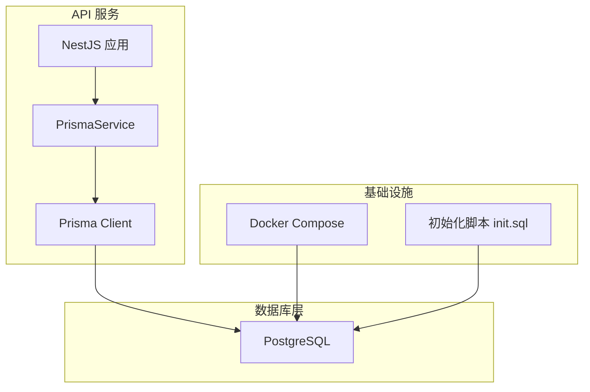
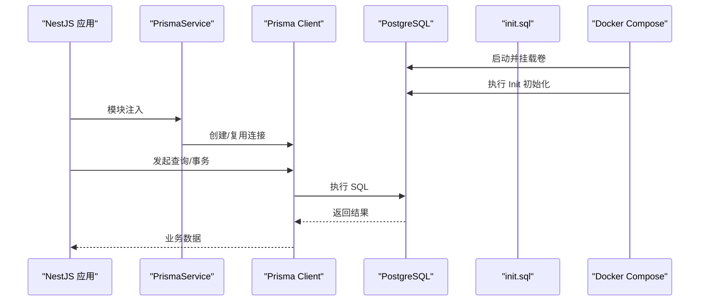
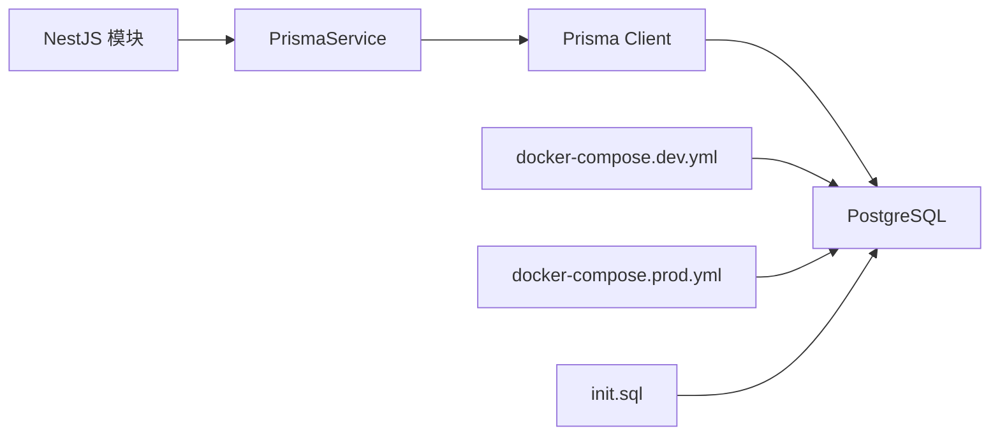
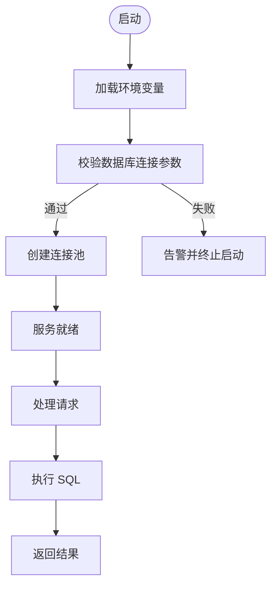

# 数据库问题排查

<cite>
**本文引用的文件**   
- [apps/api/prisma/schema.prisma](file://apps/api/prisma/schema.prisma)
- [apps/api/prisma/migrations/0_init/migration.sql](file://apps/api/prisma/migrations/0_init/migration.sql)
- [apps/api/prisma/migrations/20260723110621_add_device_details/migration.sql](file://apps/api/prisma/migrations/20260723110621_add_device_details/migration.sql)
- [apps/api/prisma/migrations/20260723120000_add_contact_visitor_id/migration.sql](file://apps/api/prisma/migrations/20260723120000_add_contact_visitor_id/migration.sql)
- [apps/api/prisma/migrations/20260724122950_customer_visitor_id/migration.sql](file://apps/api/prisma/migrations/20260724122950_customer_visitor_id/migration.sql)
- [apps/api/prisma/migrations/migration_lock.toml](file://apps/api/prisma/migrations/migration_lock.toml)
- [apps/api/src/prisma/prisma.service.ts](file://apps/api/src/prisma/prisma.service.ts)
- [apps/api/src/prisma/prisma.module.ts](file://apps/api/src/prisma/prisma.module.ts)
- [apps/api/src/config/env.validation.ts](file://apps/api/src/config/env.validation.ts)
- [infra/docker/postgres/init.sql](file://infra/docker/postgres/init.sql)
- [infra/docker/docker-compose.dev.yml](file://infra/docker/docker-compose.dev.yml)
- [infra/docker/docker-compose.prod.yml](file://infra/docker/docker-compose.prod.yml)
- [Makefile](file://Makefile)
</cite>

## 目录
1. [简介](#简介)
2. [项目结构](#项目结构)
3. [核心组件](#核心组件)
4. [架构总览](#架构总览)
5. [详细组件分析](#详细组件分析)
6. [依赖关系分析](#依赖关系分析)
7. [性能考虑](#性能考虑)
8. [故障排查指南](#故障排查指南)
9. [结论](#结论)
10. [附录](#附录)

## 简介
本指南面向使用 PostgreSQL 与 Prisma 的后端服务，聚焦以下问题的定位与解决：连接超时、迁移失败、查询性能优化、数据一致性。内容涵盖连接池配置、慢查询分析、索引优化、死锁检测与处理、备份恢复、主从复制同步、存储空间不足、监控指标、自动清理策略、容量规划与灾难恢复流程。读者可据此快速定位问题根因并落地改进措施。

## 项目结构
本项目采用多应用（admin、api、web）+ infra 部署的架构。数据库相关的关键位置如下：
- Prisma 模型与迁移位于 apps/api/prisma 目录
- NestJS 中通过 PrismaService 暴露数据库客户端
- Docker 环境包含 PostgreSQL 初始化脚本与 compose 配置
- Makefile 提供常用运维命令入口

图表来源
- [apps/api/src/prisma/prisma.service.ts](file://apps/api/src/prisma/prisma.service.ts)
- [apps/api/src/prisma/prisma.module.ts](file://apps/api/src/prisma/prisma.module.ts)
- [infra/docker/postgres/init.sql](file://infra/docker/postgres/init.sql)
- [infra/docker/docker-compose.dev.yml](file://infra/docker/docker-compose.dev.yml)

章节来源
- [apps/api/src/prisma/prisma.service.ts](file://apps/api/src/prisma/prisma.service.ts)
- [apps/api/src/prisma/prisma.module.ts](file://apps/api/src/prisma/prisma.module.ts)
- [infra/docker/postgres/init.sql](file://infra/docker/postgres/init.sql)
- [infra/docker/docker-compose.dev.yml](file://infra/docker/docker-compose.dev.yml)

## 核心组件
- Prisma 模型与迁移：定义表结构、约束与索引，驱动数据库版本演进
- PrismaService：封装 Prisma Client 生命周期管理，统一连接与事务
- 环境变量校验：确保数据库连接参数、连接池大小等关键配置正确加载
- Docker 初始化脚本：在容器启动时执行一次性初始化逻辑

章节来源
- [apps/api/prisma/schema.prisma](file://apps/api/prisma/schema.prisma)
- [apps/api/src/prisma/prisma.service.ts](file://apps/api/src/prisma/prisma.service.ts)
- [apps/api/src/config/env.validation.ts](file://apps/api/src/config/env.validation.ts)
- [infra/docker/postgres/init.sql](file://infra/docker/postgres/init.sql)

## 架构总览
下图展示 API 服务通过 Prisma 访问 PostgreSQL 的整体链路，以及迁移与初始化在部署中的角色。

图表来源
- [apps/api/src/prisma/prisma.service.ts](file://apps/api/src/prisma/prisma.service.ts)
- [apps/api/src/prisma/prisma.module.ts](file://apps/api/src/prisma/prisma.module.ts)
- [infra/docker/postgres/init.sql](file://infra/docker/postgres/init.sql)
- [infra/docker/docker-compose.dev.yml](file://infra/docker/docker-compose.dev.yml)

## 详细组件分析

### Prisma 模型与迁移
- schema.prisma：集中定义数据模型、字段类型、关联关系与索引策略
- migrations：按时间戳命名，记录增量变更；migration_lock.toml 锁定引擎版本
- 典型变更包括新增字段、外键、唯一约束与索引，需关注回滚与幂等性

建议实践
- 对高频查询条件列建立合适索引，避免全表扫描
- 大表变更尽量分步执行，减少锁等待
- 迁移脚本保持幂等，便于重复执行与回滚

章节来源
- [apps/api/prisma/schema.prisma](file://apps/api/prisma/schema.prisma)
- [apps/api/prisma/migrations/0_init/migration.sql](file://apps/api/prisma/migrations/0_init/migration.sql)
- [apps/api/prisma/migrations/20260723110621_add_device_details/migration.sql](file://apps/api/prisma/migrations/20260723110621_add_device_details/migration.sql)
- [apps/api/prisma/migrations/20260723120000_add_contact_visitor_id/migration.sql](file://apps/api/prisma/migrations/20260723120000_add_contact_visitor_id/migration.sql)
- [apps/api/prisma/migrations/20260724122950_customer_visitor_id/migration.sql](file://apps/api/prisma/migrations/20260724122950/customer_visitor_id/migration.sql)
- [apps/api/prisma/migrations/migration_lock.toml](file://apps/api/prisma/migrations/migration_lock.toml)

### PrismaService 与连接管理
- 负责 Prisma Client 的实例化、生命周期与错误处理
- 应在模块级别单例化，避免频繁创建连接导致资源浪费
- 结合环境变量控制连接池大小、超时与重试策略

章节来源
- [apps/api/src/prisma/prisma.service.ts](file://apps/api/src/prisma/prisma.service.ts)
- [apps/api/src/prisma/prisma.module.ts](file://apps/api/src/prisma/prisma.module.ts)

### 环境变量与连接参数
- 数据库连接字符串、端口、用户名、密码、SSL、连接池大小等应通过环境变量注入
- 建议在应用启动时进行严格校验，防止运行时异常

章节来源
- [apps/api/src/config/env.validation.ts](file://apps/api/src/config/env.validation.ts)

### Docker 初始化与部署
- init.sql 用于容器首次启动时的库/用户/权限初始化
- docker-compose 编排数据库与服务，支持开发/生产不同配置

章节来源
- [infra/docker/postgres/init.sql](file://infra/docker/postgres/init.sql)
- [infra/docker/docker-compose.dev.yml](file://infra/docker/docker-compose.dev.yml)
- [infra/docker/docker-compose.prod.yml](file://infra/docker/docker-compose.prod.yml)

## 依赖关系分析
- NestJS 模块依赖 PrismaService，PrismaService 依赖 Prisma Client
- Prisma Client 依赖 PostgreSQL 驱动与连接字符串
- 迁移与初始化脚本由部署工具链触发

图表来源
- [apps/api/src/prisma/prisma.module.ts](file://apps/api/src/prisma/prisma.module.ts)
- [apps/api/src/prisma/prisma.service.ts](file://apps/api/src/prisma/prisma.service.ts)
- [infra/docker/docker-compose.dev.yml](file://infra/docker/docker-compose.dev.yml)
- [infra/docker/docker-compose.prod.yml](file://infra/docker/docker-compose.prod.yml)
- [infra/docker/postgres/init.sql](file://infra/docker/postgres/init.sql)

## 性能考虑
- 连接池配置：根据并发量与延迟目标设置最小/最大连接数，避免过多连接导致上下文切换开销
- 慢查询治理：开启日志、定期导出慢查询，结合 EXPLAIN/EXPLAIN ANALYZE 分析执行计划
- 索引优化：为过滤、排序、分组与关联键建立合适索引，避免冗余与失效索引
- 事务边界：缩小事务范围，减少长事务导致的锁竞争
- 批量操作：优先使用批量写入与更新，降低往返次数与锁持有时间

[本节为通用指导，不直接分析具体文件]

## 故障排查指南

### PostgreSQL 连接超时
常见症状
- 应用启动或请求期间报连接超时、连接被拒绝或连接池耗尽
- 高峰期响应抖动明显

排查步骤
- 检查环境变量是否正确注入连接串与端口，确认网络可达
- 查看 PrismaService 的连接配置与超时参数是否合理
- 观察 PostgreSQL 当前连接数与最大连接限制
- 验证防火墙与安全组规则是否放行数据库端口
- 必要时增加连接池上限与重试间隔，但需评估数据库承载能力

参考实现位置
- [apps/api/src/prisma/prisma.service.ts](file://apps/api/src/prisma/prisma.service.ts)
- [apps/api/src/config/env.validation.ts](file://apps/api/src/config/env.validation.ts)

章节来源
- [apps/api/src/prisma/prisma.service.ts](file://apps/api/src/prisma/prisma.service.ts)
- [apps/api/src/config/env.validation.ts](file://apps/api/src/config/env.validation.ts)

### Prisma 迁移失败
常见原因
- 迁移顺序错误或冲突
- 目标库状态与迁移不一致
- 锁等待或长时间运行的事务阻塞
- 引擎版本不匹配

处理流程
- 核对 migration_lock.toml 与本地/CI 环境的 Prisma 引擎版本一致
- 查看最近一次迁移脚本是否存在语法或约束冲突
- 在低峰期执行迁移，确保无长事务与锁竞争
- 若已部分应用，先回滚到稳定点再重放迁移
- 对大表变更采用分阶段迁移与在线重建

参考位置
- [apps/api/prisma/migrations/migration_lock.toml](file://apps/api/prisma/migrations/migration_lock.toml)
- [apps/api/prisma/migrations/0_init/migration.sql](file://apps/api/prisma/migrations/0_init/migration.sql)
- [apps/api/prisma/migrations/20260723110621_add_device_details/migration.sql](file://apps/api/prisma/migrations/20260723110621_add_device_details/migration.sql)
- [apps/api/prisma/migrations/20260723120000_add_contact_visitor_id/migration.sql](file://apps/api/prisma/migrations/20260723120000_add_contact_visitor_id/migration.sql)
- [apps/api/prisma/migrations/20260724122950_customer_visitor_id/migration.sql](file://apps/api/prisma/migrations/20260724122950_customer_visitor_id/migration.sql)

章节来源
- [apps/api/prisma/migrations/migration_lock.toml](file://apps/api/prisma/migrations/migration_lock.toml)
- [apps/api/prisma/migrations/0_init/migration.sql](file://apps/api/prisma/migrations/0_init/migration.sql)
- [apps/api/prisma/migrations/20260723110621_add_device_details/migration.sql](file://apps/api/prisma/migrations/20260723110621_add_device_details/migration.sql)
- [apps/api/prisma/migrations/20260723120000_add_contact_visitor_id/migration.sql](file://apps/api/prisma/migrations/20260723120000_add_contact_visitor_id/migration.sql)
- [apps/api/prisma/migrations/20260724122950_customer_visitor_id/migration.sql](file://apps/api/prisma/migrations/20260724122950_customer_visitor_id/migration.sql)

### 查询性能优化
分析方法
- 启用慢查询日志，收集耗时超过阈值的语句
- 使用 EXPLAIN/EXPLAIN ANALYZE 分析执行计划，关注全表扫描、临时表与文件排序
- 针对热点查询建立复合索引，覆盖 WHERE、JOIN、ORDER BY、GROUP BY 条件
- 拆分复杂查询，避免 N+1 与过度 JOIN
- 调整统计信息，确保优化器选择最优路径

章节来源
- [apps/api/prisma/schema.prisma](file://apps/api/prisma/schema.prisma)

### 数据一致性问题
常见问题
- 并发写导致脏读/丢失更新
- 长事务与锁竞争引发死锁
- 跨表/跨服务事务未正确补偿

诊断与修复
- 使用行级锁与合适的隔离级别，避免不可重复读与幻读
- 缩短事务边界，减少锁持有时间
- 引入幂等写入与版本号控制，保证最终一致性
- 对关键路径添加分布式事务补偿或消息队列重试

[本节为通用指导，不直接分析具体文件]

### 连接池配置建议
- 根据 QPS 与平均响应时间估算所需连接数
- 设置最小连接数以应对突发流量，最大连接数不超过数据库承载上限
- 合理配置连接超时、空闲回收与健康检查
- 监控连接池使用率，避免长期饱和

章节来源
- [apps/api/src/prisma/prisma.service.ts](file://apps/api/src/prisma/prisma.service.ts)
- [apps/api/src/config/env.validation.ts](file://apps/api/src/config/env.validation.ts)

### 慢查询分析与索引优化
- 定期导出慢查询清单，按模板归类分析
- 优先优化影响面大的查询，结合业务峰值时段验证效果
- 删除无效索引，合并冗余索引，避免写放大

章节来源
- [apps/api/prisma/schema.prisma](file://apps/api/prisma/schema.prisma)

### 死锁检测与解决策略
- 启用死锁日志，捕获冲突事务与锁等待图
- 识别热点行与热点表，调整事务顺序与粒度
- 将批量更新拆分为小批次，降低锁竞争
- 引入重试机制与退避策略，提升鲁棒性

[本节为通用指导，不直接分析具体文件]

### 数据备份与恢复
- 制定全量与增量备份策略，保留多份历史副本
- 定期演练恢复流程，验证 RTO/RPO 目标
- 备份数据脱敏与加密，确保合规安全

章节来源
- [infra/docker/postgres/init.sql](file://infra/docker/postgres/init.sql)

### 主从复制同步问题
- 监控复制延迟与 WAL 积压，及时扩容或优化写入
- 避免在主库执行长时间独占锁操作
- 读写分离场景下，注意从库只读与事务可见性

[本节为通用指导，不直接分析具体文件]

### 存储空间不足
- 监控表空间与 WAL 增长，及时清理归档与膨胀页
- 定期 VACUUM/REINDEX，释放空间并维护统计信息
- 归档策略与压缩策略平衡，避免 I/O 瓶颈

章节来源
- [infra/docker/postgres/init.sql](file://infra/docker/postgres/init.sql)

### 监控指标与告警
- 连接数、QPS、慢查询数、锁等待、复制延迟、磁盘使用率
- 设置阈值告警，联动自动化处置（如限流、扩容）
- 建立仪表盘与巡检报告，持续跟踪趋势

[本节为通用指导，不直接分析具体文件]

### 自动清理策略
- 定时清理过期会话、审计日志与临时表
- 基于业务周期归档历史数据，降低热表压力
- 清理任务需幂等且可观测，避免误删

[本节为通用指导，不直接分析具体文件]

### 容量规划建议
- 根据数据增长率与查询负载预估存储与 CPU/内存需求
- 预留 30%~50% 缓冲空间，支撑突发与扩容窗口
- 分库分表与冷热分层，提升扩展性与成本效益

[本节为通用指导，不直接分析具体文件]

### 灾难恢复流程
- 明确 RTO/RPO 目标，设计多可用区容灾方案
- 定期演练切换与恢复，完善应急预案
- 恢复后验证数据一致性与业务可用性

[本节为通用指导，不直接分析具体文件]

## 依赖关系分析
- 应用层通过 NestJS 模块注入 PrismaService，统一对外暴露数据库能力
- PrismaService 管理 Prisma Client 的生命周期，屏蔽底层连接细节
- 部署层通过 Docker Compose 编排数据库与服务，init.sql 完成初始环境准备

图表来源
- [apps/api/src/config/env.validation.ts](file://apps/api/src/config/env.validation.ts)
- [apps/api/src/prisma/prisma.service.ts](file://apps/api/src/prisma/prisma.service.ts)

章节来源
- [apps/api/src/config/env.validation.ts](file://apps/api/src/config/env.validation.ts)
- [apps/api/src/prisma/prisma.service.ts](file://apps/api/src/prisma/prisma.service.ts)

## 性能考虑
- 连接池与超时：根据压测结果调优，避免连接泄漏与饥饿
- 索引与统计：定期分析索引命中与统计信息准确性
- 事务与锁：缩短事务、减少锁粒度，避免热点冲突
- 批处理与分页：大批量写入与分页查询降低瞬时压力

[本节为通用指导，不直接分析具体文件]

## 故障排查指南
- 连接超时：检查网络、认证、连接池与数据库负载
- 迁移失败：核对版本、回滚到稳定点、分阶段变更
- 慢查询：采集与分析执行计划，优化索引与 SQL
- 一致性：隔离级别、幂等写入、补偿机制
- 备份恢复：演练与验证，确保 RTO/RPO
- 复制延迟：监控 WAL 与延迟，优化写入模式
- 空间不足：VACUUM/REINDEX、归档与压缩
- 监控告警：建立指标与告警闭环

章节来源
- [apps/api/src/prisma/prisma.service.ts](file://apps/api/src/prisma/prisma.service.ts)
- [apps/api/src/config/env.validation.ts](file://apps/api/src/config/env.validation.ts)
- [apps/api/prisma/schema.prisma](file://apps/api/prisma/schema.prisma)
- [infra/docker/postgres/init.sql](file://infra/docker/postgres/init.sql)

## 结论
通过规范化的连接池配置、严格的迁移管理与持续的查询优化，可以显著降低数据库故障概率并提升系统稳定性。建议结合监控与演练，形成“预防—发现—处置—复盘”的闭环体系，保障业务连续性与数据可靠性。

[本节为总结性内容，不直接分析具体文件]

## 附录
- 常用命令与脚本入口参见 Makefile，便于日常运维与自动化集成

章节来源
- [Makefile](file://Makefile)