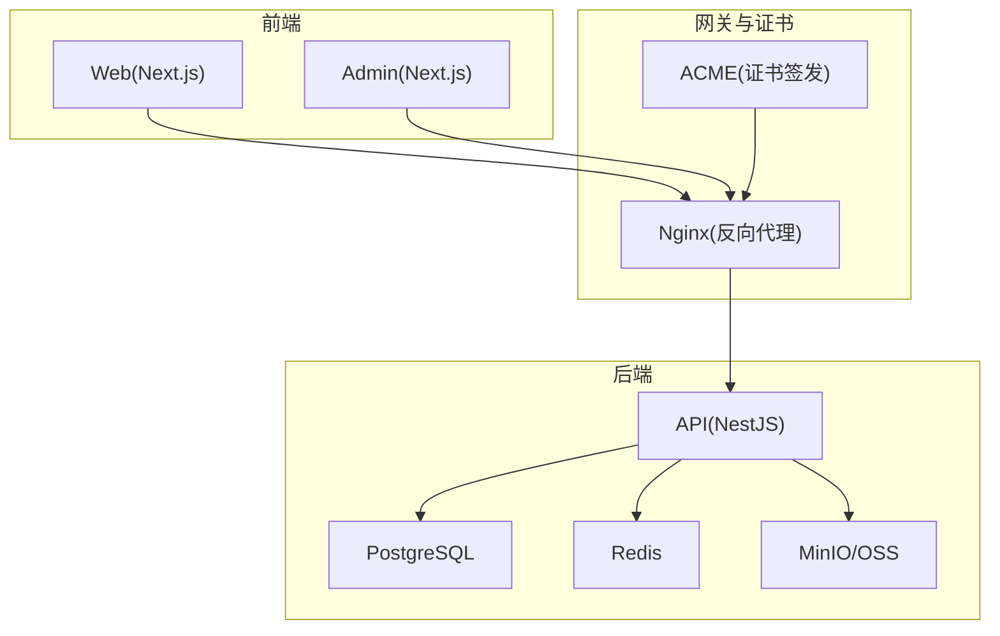
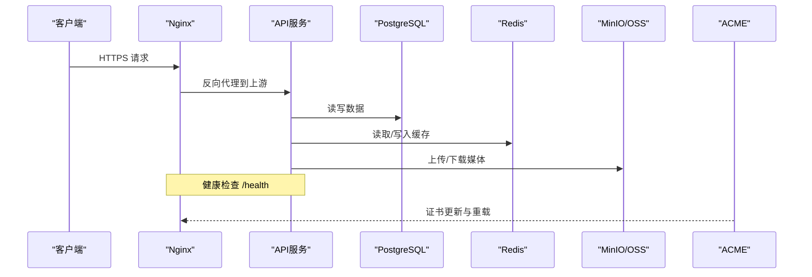
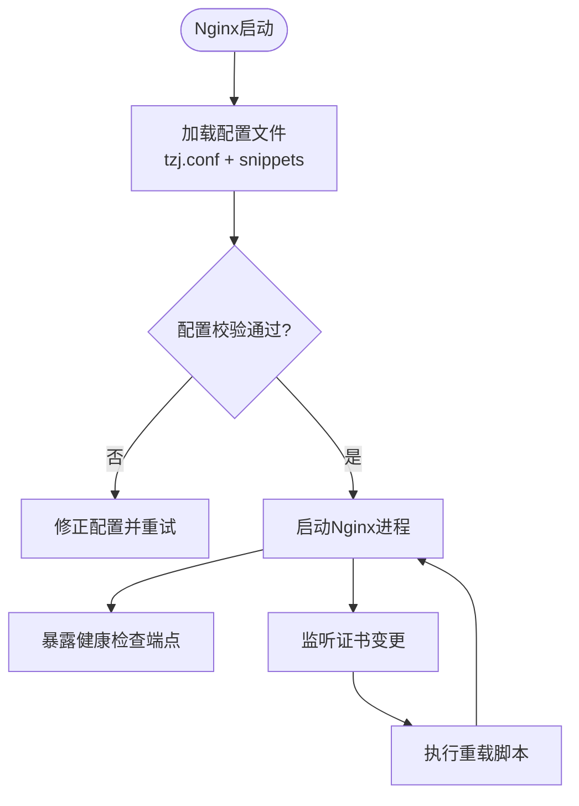
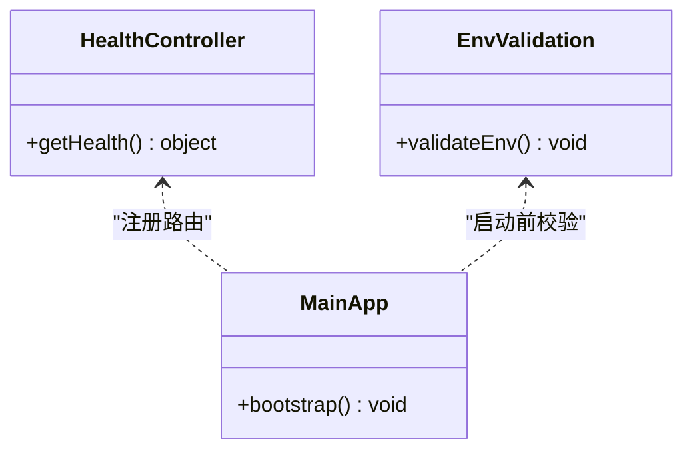
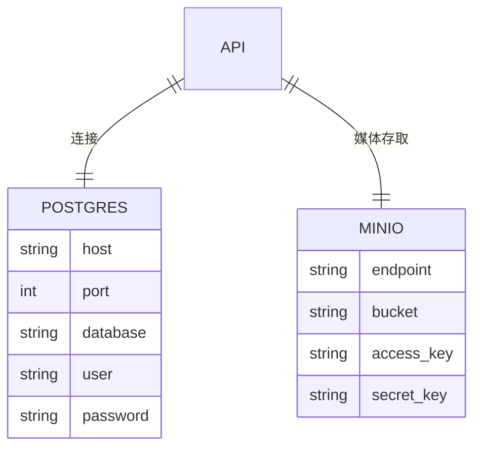
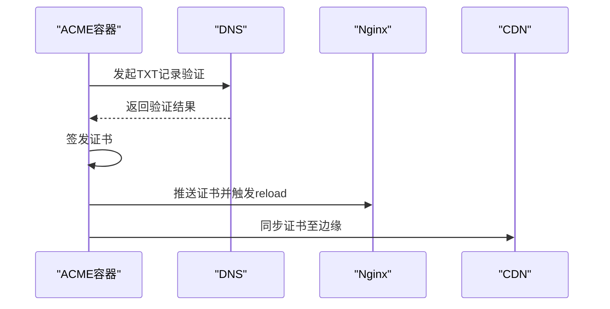
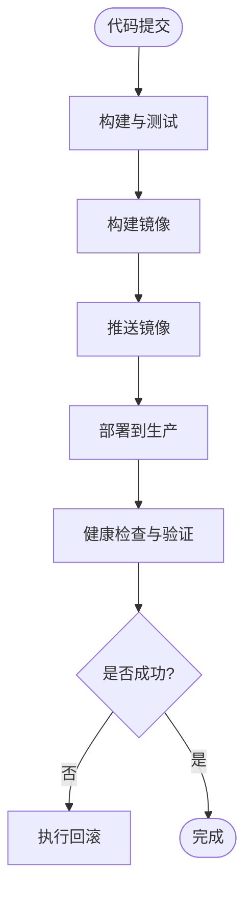
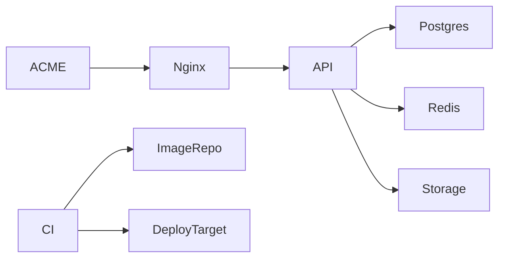

# 生产部署故障排查

<cite>
**本文引用的文件**   
- [ci.yml](file://.github/workflows/ci.yml)
- [deploy-ssh.yml](file://.github/workflows/deploy-ssh.yml)
- [deploy.yml](file://.github/workflows/deploy.yml)
- [docker-compose.prod.yml](file://infra/docker/docker-compose.prod.yml)
- [docker-compose.dev.yml](file://infra/docker/docker-compose.dev.yml)
- [nginx/tzj.conf](file://infra/docker/nginx/tzj.conf)
- [nginx/templates/tzj.conf.template](file://infra/docker/nginx/templates/tzj.conf.template)
- [nginx/snippets/proxy-docker.conf](file://infra/docker/nginx/snippets/proxy-docker.conf)
- [nginx/snippets/ssl.conf](file://infra/docker/nginx/snippets/ssl.conf)
- [nginx/entrypoint.d/90-periodic-reload.sh](file://infra/docker/nginx/entrypoint.d/90-periodic-reload.sh)
- [apps/api/Dockerfile](file://apps/api/Dockerfile)
- [apps/admin/Dockerfile](file://apps/admin/Dockerfile)
- [apps/web/Dockerfile](file://apps/web/Dockerfile)
- [apps/api/src/main.ts](file://apps/api/src/main.ts)
- [apps/api/src/health/health.controller.ts](file://apps/api/src/health/health.controller.ts)
- [apps/api/src/config/env.validation.ts](file://apps/api/src/config/env.validation.ts)
- [apps/api/prisma/schema.prisma](file://apps/api/prisma/schema.prisma)
- [infra/docker/postgres/init.sql](file://infra/docker/postgres/init.sql)
- [infra/docker/minio/cors.xml](file://infra/docker/minio/cors.xml)
- [infra/docker/oss/apply-cors.sh](file://infra/docker/oss/apply-cors.sh)
- [infra/docker/oss/cors.json](file://infra/docker/oss/cors.json)
- [infra/docker/acme/Dockerfile](file://infra/docker/acme/Dockerfile)
- [infra/docker/acme/issue.sh](file://infra/docker/acme/issue.sh)
- [infra/docker/acme/deploy-cdn.sh](file://infra/docker/acme/deploy-cdn.sh)
- [infra/yunxiao/pipeline.yml](file://infra/yunxiao/pipeline.yml)
- [Makefile](file://Makefile)
</cite>

## 目录
1. [简介](#简介)
2. [项目结构](#项目结构)
3. [核心组件](#核心组件)
4. [架构总览](#架构总览)
5. [详细组件分析](#详细组件分析)
6. [依赖关系分析](#依赖关系分析)
7. [性能注意事项](#性能注意事项)
8. [故障排查指南](#故障排查指南)
9. [结论](#结论)
10. [附录](#附录)

## 简介
本指南面向生产环境运维与研发人员，聚焦容器化部署、Nginx反向代理、SSL证书、负载均衡、CI/CD流水线、镜像构建、环境变量注入、存储卷挂载等常见问题的定位与解决。同时覆盖性能监控指标收集、内存泄漏检测、CPU使用率过高的定位策略，以及健康检查接口配置、自动重启机制、滚动更新与回滚的标准化流程。

## 项目结构
本项目采用多应用（API、Admin、Web）+ 基础设施（Nginx、Postgres、MinIO/OSS、Redis、ACME）的分层架构，通过 Docker Compose 编排开发/生产环境，GitHub Actions 与云效流水线驱动 CI/CD。

**图示来源**
- [docker-compose.prod.yml](file://infra/docker/docker-compose.prod.yml)
- [nginx/tzj.conf](file://infra/docker/nginx/tzj.conf)
- [apps/api/src/main.ts](file://apps/api/src/main.ts)

**章节来源**
- [docker-compose.prod.yml](file://infra/docker/docker-compose.prod.yml)
- [nginx/tzj.conf](file://infra/docker/nginx/tzj.conf)

## 核心组件
- Nginx 反向代理：统一入口、TLS终止、静态资源缓存、上游服务路由与健康检查转发。
- API 服务（NestJS）：业务逻辑、鉴权、媒体处理、存储集成、健康检查端点。
- Web/Admin 前端：Next.js 应用，构建产物由 Nginx 托管或通过 API BFF 访问。
- 数据库与缓存：PostgreSQL 持久化，Redis 会话/缓存。
- 对象存储：MinIO 或阿里云 OSS，用于媒体与静态资源。
- 证书管理：ACME 自动化签发与热更新。
- CI/CD：GitHub Actions 与云效流水线，负责构建、测试、镜像推送与部署。

**章节来源**
- [apps/api/src/main.ts](file://apps/api/src/main.ts)
- [apps/api/src/health/health.controller.ts](file://apps/api/src/health/health.controller.ts)
- [apps/api/src/config/env.validation.ts](file://apps/api/src/config/env.validation.ts)
- [nginx/tzj.conf](file://infra/docker/nginx/tzj.conf)
- [nginx/templates/tzj.conf.template](file://infra/docker/nginx/templates/tzj.conf.template)
- [nginx/snippets/proxy-docker.conf](file://infra/docker/nginx/snippets/proxy-docker.conf)
- [nginx/snippets/ssl.conf](file://infra/docker/nginx/snippets/ssl.conf)
- [docker-compose.prod.yml](file://infra/docker/docker-compose.prod.yml)

## 架构总览
下图展示请求从客户端经 Nginx 进入 API，再访问数据库、缓存与对象存储的完整链路，并包含健康检查与证书更新路径。

**图示来源**
- [nginx/tzj.conf](file://infra/docker/nginx/tzj.conf)
- [apps/api/src/health/health.controller.ts](file://apps/api/src/health/health.controller.ts)
- [apps/api/src/main.ts](file://apps/api/src/main.ts)
- [docker-compose.prod.yml](file://infra/docker/docker-compose.prod.yml)

## 详细组件分析

### Nginx 反向代理与 SSL
- 关键职责：TLS终止、域名路由、静态资源缓存、上游服务转发、健康检查、证书热更新。
- 常见问题：
  - 反向代理配置错误导致 502/504：检查 upstream 地址、端口、协议与超时设置。
  - SSL证书问题：证书过期、链不完整、SNI不匹配；确认 ACME 签发与 Nginx 重载脚本。
  - 负载均衡异常：权重、健康检查失败、节点不可达。
- 建议配置要点：
  - 使用模板生成 tzj.conf，确保变量替换正确。
  - 启用 ssl.conf 片段，集中管理 TLS参数。
  - 定期重载 Nginx 以加载新证书。

**图示来源**
- [nginx/tzj.conf](file://infra/docker/nginx/tzj.conf)
- [nginx/templates/tzj.conf.template](file://infra/docker/nginx/templates/tzj.conf.template)
- [nginx/snippets/ssl.conf](file://infra/docker/nginx/snippets/ssl.conf)
- [nginx/entrypoint.d/90-periodic-reload.sh](file://infra/docker/nginx/entrypoint.d/90-periodic-reload.sh)

**章节来源**
- [nginx/tzj.conf](file://infra/docker/nginx/tzj.conf)
- [nginx/templates/tzj.conf.template](file://infra/docker/nginx/templates/tzj.conf.template)
- [nginx/snippets/proxy-docker.conf](file://infra/docker/nginx/snippets/proxy-docker.conf)
- [nginx/snippets/ssl.conf](file://infra/docker/nginx/snippets/ssl.conf)
- [nginx/entrypoint.d/90-periodic-reload.sh](file://infra/docker/nginx/entrypoint.d/90-periodic-reload.sh)

### API 服务与环境变量
- 关键职责：业务接口、鉴权、媒体处理、存储集成、健康检查。
- 环境变量验证：在启动时进行严格校验，缺失或非法值将阻止服务启动。
- 常见问题：
  - 环境变量注入失败：Docker Compose 未正确传递 .env 或密钥；容器内无法读取。
  - 数据库连接失败：连接串、用户名密码、网络隔离。
  - 对象存储配置错误：AccessKey/SecretKey、Bucket、Endpoint 不正确。
- 健康检查：提供 /health 端点，供 Nginx 或编排系统探测。

**图示来源**
- [apps/api/src/health/health.controller.ts](file://apps/api/src/health/health.controller.ts)
- [apps/api/src/config/env.validation.ts](file://apps/api/src/config/env.validation.ts)
- [apps/api/src/main.ts](file://apps/api/src/main.ts)

**章节来源**
- [apps/api/src/main.ts](file://apps/api/src/main.ts)
- [apps/api/src/health/health.controller.ts](file://apps/api/src/health/health.controller.ts)
- [apps/api/src/config/env.validation.ts](file://apps/api/src/config/env.validation.ts)

### 数据库与存储
- PostgreSQL：初始化脚本、迁移、连接池配置。
- MinIO/OSS：CORS 配置、跨域访问、媒体上传下载。
- 常见问题：
  - 数据库迁移失败：版本不一致、权限不足。
  - 存储 CORS 错误：前端跨域被拒绝。
  - 存储凭证错误：签名失败、无权限。

**图示来源**
- [apps/api/prisma/schema.prisma](file://apps/api/prisma/schema.prisma)
- [infra/docker/postgres/init.sql](file://infra/docker/postgres/init.sql)
- [infra/docker/minio/cors.xml](file://infra/docker/minio/cors.xml)
- [infra/docker/oss/apply-cors.sh](file://infra/docker/oss/apply-cors.sh)
- [infra/docker/oss/cors.json](file://infra/docker/oss/cors.json)

**章节来源**
- [apps/api/prisma/schema.prisma](file://apps/api/prisma/schema.prisma)
- [infra/docker/postgres/init.sql](file://infra/docker/postgres/init.sql)
- [infra/docker/minio/cors.xml](file://infra/docker/minio/cors.xml)
- [infra/docker/oss/apply-cors.sh](file://infra/docker/oss/apply-cors.sh)
- [infra/docker/oss/cors.json](file://infra/docker/oss/cors.json)

### 证书管理（ACME）
- 自动化签发与部署：根据域名生成证书，推送到 CDN 或本地 Nginx。
- 常见问题：
  - DNS 解析未生效：ACME 验证失败。
  - 证书未重载：Nginx 未触发 reload。
  - CDN 同步延迟：边缘节点缓存旧证书。

**图示来源**
- [infra/docker/acme/Dockerfile](file://infra/docker/acme/Dockerfile)
- [infra/docker/acme/issue.sh](file://infra/docker/acme/issue.sh)
- [infra/docker/acme/deploy-cdn.sh](file://infra/docker/acme/deploy-cdn.sh)
- [nginx/entrypoint.d/90-periodic-reload.sh](file://infra/docker/nginx/entrypoint.d/90-periodic-reload.sh)

**章节来源**
- [infra/docker/acme/Dockerfile](file://infra/docker/acme/Dockerfile)
- [infra/docker/acme/issue.sh](file://infra/docker/acme/issue.sh)
- [infra/docker/acme/deploy-cdn.sh](file://infra/docker/acme/deploy-cdn.sh)

### CI/CD 流水线
- GitHub Actions：构建、测试、镜像推送、部署。
- 云效流水线：企业级流水线编排。
- 常见问题：
  - 构建失败：依赖安装、编译错误、环境变量缺失。
  - 镜像推送失败：仓库权限、网络问题。
  - 部署失败：目标主机 SSH、Compose 版本、卷挂载权限。

**图示来源**
- [ci.yml](file://.github/workflows/ci.yml)
- [deploy-ssh.yml](file://.github/workflows/deploy-ssh.yml)
- [deploy.yml](file://.github/workflows/deploy.yml)
- [infra/yunxiao/pipeline.yml](file://infra/yunxiao/pipeline.yml)

**章节来源**
- [ci.yml](file://.github/workflows/ci.yml)
- [deploy-ssh.yml](file://.github/workflows/deploy-ssh.yml)
- [deploy.yml](file://.github/workflows/deploy.yml)
- [infra/yunxiao/pipeline.yml](file://infra/yunxiao/pipeline.yml)

## 依赖关系分析
- 组件耦合：Nginx 强依赖 API 健康检查；API 依赖 Postgres、Redis、MinIO/OSS。
- 外部依赖：ACME 依赖 DNS 解析与证书颁发机构；CI/CD 依赖 Git、镜像仓库、部署目标。
- 潜在循环：无直接循环依赖，但需关注健康检查与证书重载的时序。

**图示来源**
- [docker-compose.prod.yml](file://infra/docker/docker-compose.prod.yml)
- [nginx/tzj.conf](file://infra/docker/nginx/tzj.conf)
- [apps/api/src/main.ts](file://apps/api/src/main.ts)

**章节来源**
- [docker-compose.prod.yml](file://infra/docker/docker-compose.prod.yml)
- [nginx/tzj.conf](file://infra/docker/nginx/tzj.conf)
- [apps/api/src/main.ts](file://apps/api/src/main.ts)

## 性能注意事项
- 指标采集：
  - API 层：请求耗时、错误率、QPS、GC 停顿、堆内存使用。
  - Nginx：连接数、带宽、状态码分布、上游响应时间。
  - 数据库：慢查询、锁等待、连接池使用率。
  - 存储：上传/下载吞吐、错误率、CORS 失败。
- 内存泄漏检测：
  - Node.js 应用使用 --inspect 与 heapdump，结合浏览器 DevTools 或 APM 工具定位。
  - 观察堆快照增长趋势，识别未释放引用。
- CPU 使用率过高：
  - 使用 perf、node --prof 分析热点函数。
  - 检查正则表达式、密集计算、无限循环、频繁序列化。
- 优化建议：
  - 合理设置 Nginx worker_processes、worker_connections。
  - API 启用压缩、缓存、分页与限流。
  - 数据库索引优化、连接池调优。

[本节为通用指导，无需特定文件来源]

## 故障排查指南

### Docker 容器启动失败
- 现象：容器启动后立即退出或反复重启。
- 排查步骤：
  - 查看容器日志：定位启动错误与异常堆栈。
  - 检查环境变量：确认 .env 文件存在且键名正确。
  - 检查依赖服务：Postgres、Redis、MinIO/OSS 是否可达。
  - 检查健康检查：/health 是否返回正常。
- 解决方法：
  - 修复环境变量与连接串。
  - 调整资源限制（CPU/内存）。
  - 修正启动命令或入口脚本。

**章节来源**
- [docker-compose.prod.yml](file://infra/docker/docker-compose.prod.yml)
- [apps/api/src/config/env.validation.ts](file://apps/api/src/config/env.validation.ts)
- [apps/api/src/health/health.controller.ts](file://apps/api/src/health/health.controller.ts)

### Nginx 反向代理配置错误
- 现象：502/504、路由错误、静态资源 404。
- 排查步骤：
  - 检查 upstream 地址与端口。
  - 确认 proxy_pass 与 location 规则。
  - 查看 Nginx 错误日志。
- 解决方法：
  - 修正配置并重新加载。
  - 使用模板生成配置，避免手工错误。

**章节来源**
- [nginx/tzj.conf](file://infra/docker/nginx/tzj.conf)
- [nginx/templates/tzj.conf.template](file://infra/docker/nginx/templates/tzj.conf.template)
- [nginx/snippets/proxy-docker.conf](file://infra/docker/nginx/snippets/proxy-docker.conf)

### SSL 证书问题
- 现象：HTTPS 握手失败、证书过期、SNI 不匹配。
- 排查步骤：
  - 检查证书链完整性与有效期。
  - 确认 ACME 签发与 Nginx 重载。
  - 验证 DNS 解析与域名绑定。
- 解决方法：
  - 重新签发证书并推送至 Nginx/CDN。
  - 调整 SNI 与域名映射。

**章节来源**
- [nginx/snippets/ssl.conf](file://infra/docker/nginx/snippets/ssl.conf)
- [infra/docker/acme/issue.sh](file://infra/docker/acme/issue.sh)
- [nginx/entrypoint.d/90-periodic-reload.sh](file://infra/docker/nginx/entrypoint.d/90-periodic-reload.sh)

### 负载均衡配置异常
- 现象：部分节点不可用、请求分配不均。
- 排查步骤：
  - 检查节点健康检查与权重。
  - 查看上游节点日志与资源使用。
- 解决方法：
  - 调整权重与健康检查阈值。
  - 下线故障节点并扩容新节点。

**章节来源**
- [nginx/tzj.conf](file://infra/docker/nginx/tzj.conf)
- [nginx/snippets/proxy-docker.conf](file://infra/docker/nginx/snippets/proxy-docker.conf)

### CI/CD 流水线失败
- 现象：构建失败、镜像推送失败、部署失败。
- 排查步骤：
  - 查看流水线日志与构建输出。
  - 检查环境变量与密钥。
  - 验证目标主机连通性与权限。
- 解决方法：
  - 修复依赖与编译错误。
  - 更新镜像仓库权限。
  - 修正部署脚本与 Compose 配置。

**章节来源**
- [ci.yml](file://.github/workflows/ci.yml)
- [deploy-ssh.yml](file://.github/workflows/deploy-ssh.yml)
- [deploy.yml](file://.github/workflows/deploy.yml)
- [infra/yunxiao/pipeline.yml](file://infra/yunxiao/pipeline.yml)

### 镜像构建问题
- 现象：构建缓慢、体积过大、依赖缺失。
- 排查步骤：
  - 检查 Dockerfile 分层与缓存命中。
  - 清理无用依赖与临时文件。
  - 使用多阶段构建减小镜像体积。
- 解决方法：
  - 优化依赖安装与构建命令。
  - 引入 .dockerignore 排除无关文件。

**章节来源**
- [apps/api/Dockerfile](file://apps/api/Dockerfile)
- [apps/admin/Dockerfile](file://apps/admin/Dockerfile)
- [apps/web/Dockerfile](file://apps/web/Dockerfile)

### 环境变量注入失败
- 现象：服务启动时报缺少环境变量或值非法。
- 排查步骤：
  - 检查 .env 文件与 Compose 环境变量映射。
  - 确认容器内环境变量可见性。
- 解决方法：
  - 修正 .env 键名与值格式。
  - 在 Compose 中显式声明环境变量。

**章节来源**
- [apps/api/src/config/env.validation.ts](file://apps/api/src/config/env.validation.ts)
- [docker-compose.prod.yml](file://infra/docker/docker-compose.prod.yml)

### 存储卷挂载异常
- 现象：数据丢失、权限错误、写入失败。
- 排查步骤：
  - 检查卷路径与权限。
  - 确认宿主机与容器用户 UID/GID。
- 解决方法：
  - 修正卷挂载路径与权限。
  - 使用命名卷或绑定挂载并确保一致性。

**章节来源**
- [docker-compose.prod.yml](file://infra/docker/docker-compose.prod.yml)
- [infra/docker/postgres/init.sql](file://infra/docker/postgres/init.sql)

### 健康检查接口配置
- 建议：
  - API 提供 /health 端点，返回服务状态与依赖健康。
  - Nginx 使用健康检查决定流量分发。
  - 编排系统基于健康检查实现自动重启与滚动更新。

**章节来源**
- [apps/api/src/health/health.controller.ts](file://apps/api/src/health/health.controller.ts)
- [nginx/tzj.conf](file://infra/docker/nginx/tzj.conf)

### 自动重启机制
- 建议：
  - 使用编排系统的 restart policy（如 always、on-failure）。
  - 结合健康检查与探针实现自愈。
- 排查：
  - 检查重启原因与日志。
  - 调整资源限制与依赖可用性。

**章节来源**
- [docker-compose.prod.yml](file://infra/docker/docker-compose.prod.yml)

### 滚动更新与回滚操作
- 建议：
  - 分批次替换实例，保持服务可用。
  - 更新前备份数据与配置。
  - 失败时快速回滚到上一版本。
- 排查：
  - 检查新版本健康检查与兼容性。
  - 回滚后验证功能与数据一致性。

**章节来源**
- [deploy.yml](file://.github/workflows/deploy.yml)
- [infra/yunxiao/pipeline.yml](file://infra/yunxiao/pipeline.yml)

## 结论
通过系统化排查与标准化流程，可显著降低生产部署风险。建议完善健康检查、自动重启、滚动更新与回滚机制，并结合性能监控与容量规划，持续提升系统稳定性与可观测性。

[本节为总结性内容，无需特定文件来源]

## 附录
- 常用命令：
  - 查看容器日志：docker logs <container>
  - 进入容器调试：docker exec -it <container> sh
  - 检查 Nginx 配置：nginx -t
  - 重载 Nginx：nginx -s reload
- 参考文件：
  - Makefile 中的便捷命令与脚本。

**章节来源**
- [Makefile](file://Makefile)