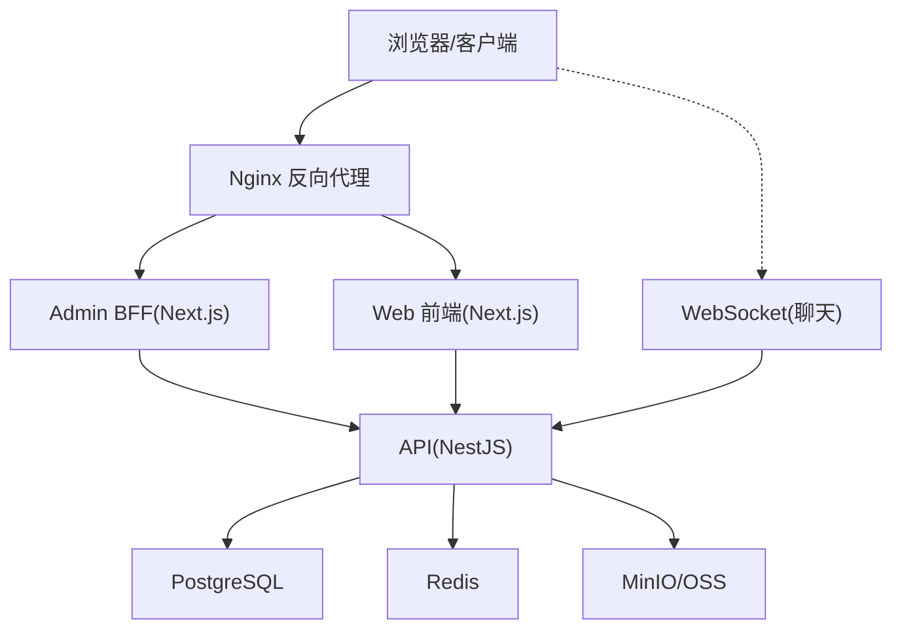
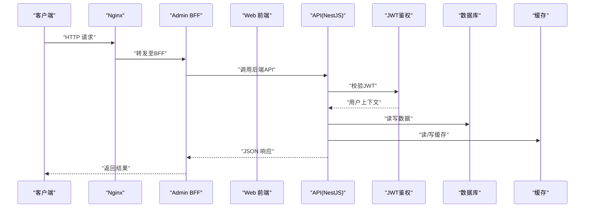
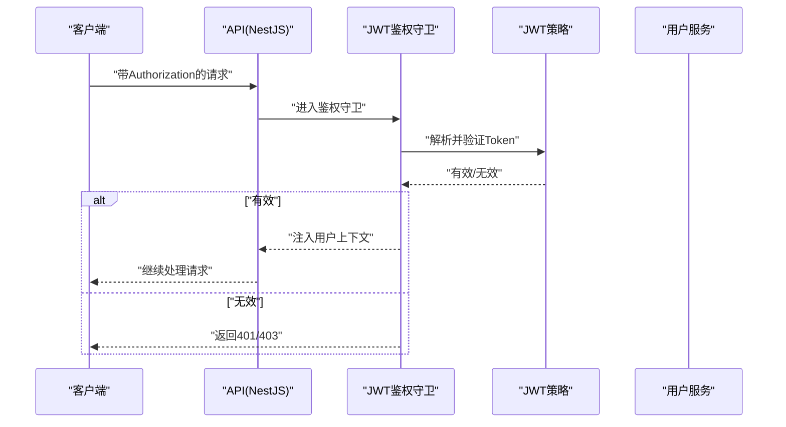
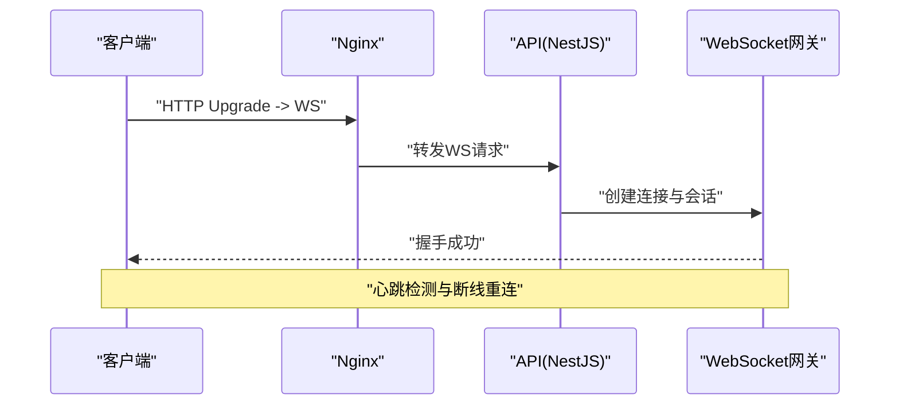
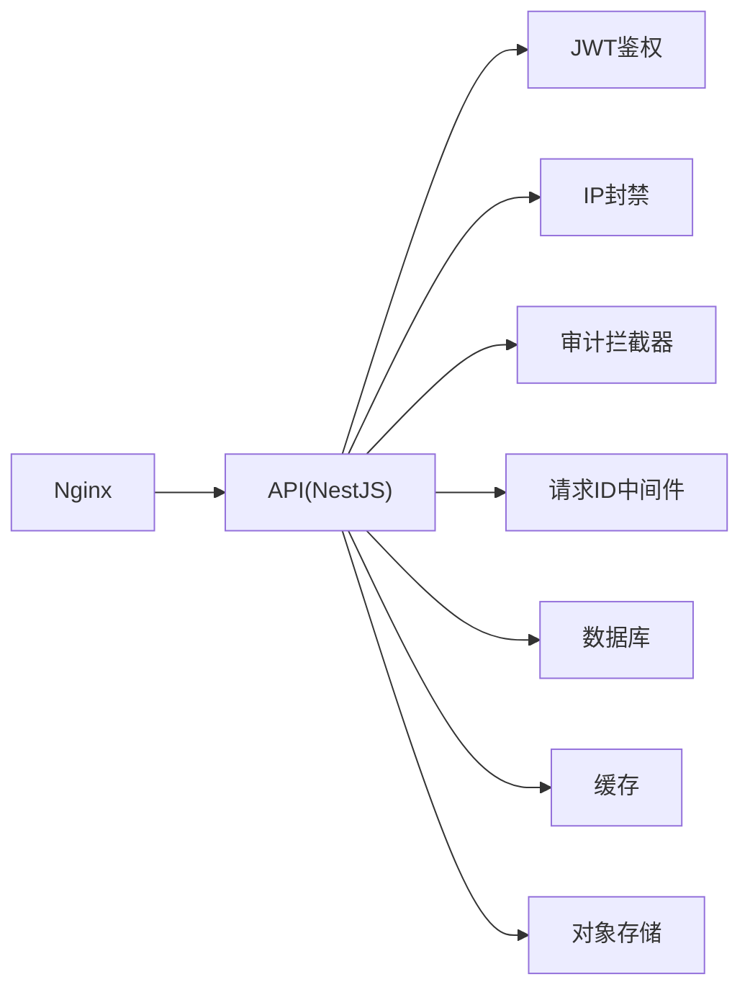

# 网络通信故障排查

<cite>
**本文引用的文件**   
- [apps/api/src/main.ts](file://apps/api/src/main.ts)
- [apps/api/src/app.module.ts](file://apps/api/src/app.module.ts)
- [apps/api/src/common/filters/http-exception.filter.ts](file://apps/api/src/common/filters/http-exception.filter.ts)
- [apps/api/src/common/interceptors/audit.interceptor.ts](file://apps/api/src/common/interceptors/audit.interceptor.ts)
- [apps/api/src/common/middleware/request-id.middleware.ts](file://apps/api/src/common/middleware/request-id.middleware.ts)
- [apps/api/src/auth/guards/jwt-auth.guard.ts](file://apps/api/src/auth/guards/jwt-auth.guard.ts)
- [apps/api/src/auth/strategies/jwt.strategy.ts](file://apps/api/src/auth/strategies/jwt.strategy.ts)
- [apps/api/src/support/chat.gateway.ts](file://apps/api/src/support/chat.gateway.ts)
- [apps/api/src/support/chat-room.controller.ts](file://apps/api/src/support/chat-room.controller.ts)
- [apps/admin/src/lib/apiClient.ts](file://apps/admin/src/lib/apiClient.ts)
- [apps/admin/src/lib/fetch-retry.ts](file://apps/admin/src/lib/fetch-retry.ts)
- [apps/admin/src/features/chat/useChatSocket.ts](file://apps/admin/src/features/chat/useChatSocket.ts)
- [apps/web/src/lib/api.ts](file://apps/web/src/lib/api.ts)
- [infra/docker/nginx/tzj.conf](file://infra/docker/nginx/tzj.conf)
- [infra/docker/nginx/snippets/proxy-docker.conf](file://infra/docker/nginx/snippets/proxy-docker.conf)
- [infra/docker/nginx/templates/tzj.conf.template](file://infra/docker/nginx/templates/tzj.conf.template)
- [infra/docker/minio/cors.xml](file://infra/docker/minio/cors.xml)
- [infra/docker/oss/apply-cors.sh](file://infra/docker/oss/apply-cors.sh)
- [infra/docker/oss/cors.json](file://infra/docker/oss/cors.json)
- [apps/api/src/security/ip-ban.guard.ts](file://apps/api/src/security/ip-ban.guard.ts)
- [apps/api/src/security/ip-ban.service.ts](file://apps/api/src/security/ip-ban.service.ts)
- [apps/api/src/config/env.validation.ts](file://apps/api/src/config/env.validation.ts)
</cite>

## 目录
1. [简介](#简介)
2. [项目结构](#项目结构)
3. [核心组件](#核心组件)
4. [架构总览](#架构总览)
5. [详细组件分析](#详细组件分析)
6. [依赖关系分析](#依赖关系分析)
7. [性能与稳定性优化](#性能与稳定性优化)
8. [故障排查指南](#故障排查指南)
9. [结论](#结论)
10. [附录](#附录)

## 简介
本指南面向生产环境的网络通信问题，覆盖API请求失败、WebSocket连接断开、跨域访问、JWT认证失败的诊断方法；详细说明HTTP状态码含义、错误响应格式、重试机制配置、超时设置优化；并提供防火墙规则、IP白名单管理、DDoS防护策略、请求限流配置的技术细节。同时给出网络抓包工具使用、API网关日志分析、链路追踪配置和性能瓶颈定位方法，帮助快速定位并解决问题。

## 项目结构
本项目采用前后端分离与多应用（admin、web、api）的架构：
- API服务（NestJS）提供REST与WebSocket接口，内置鉴权、审计、异常处理、中间件等通用能力。
- 前端应用（Next.js）通过统一的客户端库发起HTTP请求，并在聊天场景中使用WebSocket。
- 基础设施层包含Nginx反向代理、MinIO/OSS对象存储、PostgreSQL、Redis等。

图表来源
- [apps/api/src/main.ts](file://apps/api/src/main.ts)
- [apps/api/src/app.module.ts](file://apps/api/src/app.module.ts)
- [infra/docker/nginx/tzj.conf](file://infra/docker/nginx/tzj.conf)
- [infra/docker/nginx/snippets/proxy-docker.conf](file://infra/docker/nginx/snippets/proxy-docker.conf)

章节来源
- [apps/api/src/main.ts](file://apps/api/src/main.ts)
- [apps/api/src/app.module.ts](file://apps/api/src/app.module.ts)
- [infra/docker/nginx/tzj.conf](file://infra/docker/nginx/tzj.conf)
- [infra/docker/nginx/snippets/proxy-docker.conf](file://infra/docker/nginx/snippets/proxy-docker.conf)

## 核心组件
- HTTP异常过滤器：统一捕获业务与系统异常，输出标准化错误响应体与状态码。
- 审计拦截器：记录请求耗时、入参与出参摘要，便于性能分析与问题回溯。
- 请求ID中间件：为每个请求生成唯一ID，贯穿日志与链路追踪。
- JWT鉴权守卫与策略：校验Token有效性、角色权限，处理过期与非法令牌。
- WebSocket网关：维护聊天会话、在线状态、消息广播与重连逻辑。
- 客户端HTTP封装与重试：统一请求头、错误处理、指数退避重试与超时控制。
- Nginx反向代理：转发HTTP/WS、设置超时、缓存、限流与安全头。
- 跨域配置：MinIO/OSS CORS策略，避免浏览器跨域拦截。
- IP封禁与限流：基于IP的访问控制与安全防护。

章节来源
- [apps/api/src/common/filters/http-exception.filter.ts](file://apps/api/src/common/filters/http-exception.filter.ts)
- [apps/api/src/common/interceptors/audit.interceptor.ts](file://apps/api/src/common/interceptors/audit.interceptor.ts)
- [apps/api/src/common/middleware/request-id.middleware.ts](file://apps/api/src/common/middleware/request-id.middleware.ts)
- [apps/api/src/auth/guards/jwt-auth.guard.ts](file://apps/api/src/auth/guards/jwt-auth.guard.ts)
- [apps/api/src/auth/strategies/jwt.strategy.ts](file://apps/api/src/auth/strategies/jwt.strategy.ts)
- [apps/api/src/support/chat.gateway.ts](file://apps/api/src/support/chat.gateway.ts)
- [apps/admin/src/lib/apiClient.ts](file://apps/admin/src/lib/apiClient.ts)
- [apps/admin/src/lib/fetch-retry.ts](file://apps/admin/src/lib/fetch-retry.ts)
- [apps/api/src/security/ip-ban.guard.ts](file://apps/api/src/security/ip-ban.guard.ts)
- [apps/api/src/security/ip-ban.service.ts](file://apps/api/src/security/ip-ban.service.ts)

## 架构总览
下图展示从客户端到后端服务的完整调用链，包括Nginx转发、NestJS路由、鉴权、业务处理与外部依赖。

图表来源
- [apps/api/src/main.ts](file://apps/api/src/main.ts)
- [apps/api/src/app.module.ts](file://apps/api/src/app.module.ts)
- [apps/api/src/auth/guards/jwt-auth.guard.ts](file://apps/api/src/auth/guards/jwt-auth.guard.ts)
- [apps/api/src/auth/strategies/jwt.strategy.ts](file://apps/api/src/auth/strategies/jwt.strategy.ts)
- [infra/docker/nginx/tzj.conf](file://infra/docker/nginx/tzj.conf)

## 详细组件分析

### HTTP异常过滤器与错误响应格式
- 作用：统一捕获未处理异常，输出标准错误结构（如code、message、details），便于前端一致化处理。
- 关键点：区分业务异常与系统异常，设置合适的HTTP状态码；在审计拦截器中记录关键信息。
- 建议：对敏感信息脱敏，避免泄露堆栈或内部路径。

章节来源
- [apps/api/src/common/filters/http-exception.filter.ts](file://apps/api/src/common/filters/http-exception.filter.ts)
- [apps/api/src/common/interceptors/audit.interceptor.ts](file://apps/api/src/common/interceptors/audit.interceptor.ts)

### 请求ID与链路追踪
- 作用：为每个请求分配唯一ID，贯穿中间件、控制器、服务与外部调用，便于全链路日志聚合与追踪。
- 关键点：在Nginx透传X-Request-ID，确保跨层一致性；在审计拦截器中记录耗时与请求摘要。
- 建议：结合集中式日志平台（如ELK）进行关联查询。

章节来源
- [apps/api/src/common/middleware/request-id.middleware.ts](file://apps/api/src/common/middleware/request-id.middleware.ts)
- [apps/api/src/common/interceptors/audit.interceptor.ts](file://apps/api/src/common/interceptors/audit.interceptor.ts)

### JWT认证流程与失败诊断
- 流程：客户端携带Authorization头，服务端通过Guard与Strategy解析并验证Token，注入用户上下文。
- 常见失败原因：Token缺失、签名无效、过期、权限不足、算法不匹配。
- 诊断要点：检查Header、时间同步、密钥配置、策略参数；关注鉴权守卫抛出的异常类型与状态码。

图表来源
- [apps/api/src/auth/guards/jwt-auth.guard.ts](file://apps/api/src/auth/guards/jwt-auth.guard.ts)
- [apps/api/src/auth/strategies/jwt.strategy.ts](file://apps/api/src/auth/strategies/jwt.strategy.ts)

章节来源
- [apps/api/src/auth/guards/jwt-auth.guard.ts](file://apps/api/src/auth/guards/jwt-auth.guard.ts)
- [apps/api/src/auth/strategies/jwt.strategy.ts](file://apps/api/src/auth/strategies/jwt.strategy.ts)

### WebSocket连接与断线重连
- 场景：聊天功能使用WebSocket建立长连接，支持心跳保活、断线重连与消息队列。
- 常见问题：握手失败、跨域限制、代理超时、服务端资源耗尽。
- 诊断要点：检查Nginx的WS升级配置、超时设置；客户端重连退避策略；服务端心跳与连接数监控。

图表来源
- [apps/api/src/support/chat.gateway.ts](file://apps/api/src/support/chat.gateway.ts)
- [apps/api/src/support/chat-room.controller.ts](file://apps/api/src/support/chat-room.controller.ts)
- [infra/docker/nginx/snippets/proxy-docker.conf](file://infra/docker/nginx/snippets/proxy-docker.conf)

章节来源
- [apps/api/src/support/chat.gateway.ts](file://apps/api/src/support/chat.gateway.ts)
- [apps/api/src/support/chat-room.controller.ts](file://apps/api/src/support/chat-room.controller.ts)
- [apps/admin/src/features/chat/useChatSocket.ts](file://apps/admin/src/features/chat/useChatSocket.ts)

### 客户端HTTP封装与重试机制
- 作用：统一请求头、错误处理、超时控制与重试策略（指数退避、最大重试次数）。
- 关键点：区分可重试与不可重试错误；对幂等请求启用自动重试；记录失败详情用于分析。
- 建议：根据业务SLA调整超时与重试参数，避免雪崩效应。

章节来源
- [apps/admin/src/lib/apiClient.ts](file://apps/admin/src/lib/apiClient.ts)
- [apps/admin/src/lib/fetch-retry.ts](file://apps/admin/src/lib/fetch-retry.ts)
- [apps/web/src/lib/api.ts](file://apps/web/src/lib/api.ts)

### 跨域访问（CORS）配置
- 范围：Nginx、MinIO/OSS、API服务均需正确配置CORS，避免浏览器跨域拦截。
- 关键点：允许的来源、方法与头部；预检请求缓存；静态资源与媒体上传的CORS策略。
- 建议：最小化允许的源，生产环境严格限定域名。

章节来源
- [infra/docker/minio/cors.xml](file://infra/docker/minio/cors.xml)
- [infra/docker/oss/apply-cors.sh](file://infra/docker/oss/apply-cors.sh)
- [infra/docker/oss/cors.json](file://infra/docker/oss/cors.json)

### IP封禁与访问控制
- 作用：基于IP的访问控制与安全防护，防止恶意扫描与暴力破解。
- 关键点：动态封禁、阈值触发、白名单管理；与网关层限流配合。
- 建议：定期清理过期封禁记录，结合地理信息与信誉评分。

章节来源
- [apps/api/src/security/ip-ban.guard.ts](file://apps/api/src/security/ip-ban.guard.ts)
- [apps/api/src/security/ip-ban.service.ts](file://apps/api/src/security/ip-ban.service.ts)

## 依赖关系分析
- API模块依赖鉴权、审计、中间件、安全策略与外部存储。
- 前端依赖统一的HTTP客户端与WebSocket钩子，确保一致的错误处理与重连逻辑。
- Nginx作为入口，负责转发、超时、缓存与安全头设置。

图表来源
- [apps/api/src/app.module.ts](file://apps/api/src/app.module.ts)
- [apps/api/src/auth/guards/jwt-auth.guard.ts](file://apps/api/src/auth/guards/jwt-auth.guard.ts)
- [apps/api/src/security/ip-ban.guard.ts](file://apps/api/src/security/ip-ban.guard.ts)
- [apps/api/src/common/interceptors/audit.interceptor.ts](file://apps/api/src/common/interceptors/audit.interceptor.ts)
- [apps/api/src/common/middleware/request-id.middleware.ts](file://apps/api/src/common/middleware/request-id.middleware.ts)

章节来源
- [apps/api/src/app.module.ts](file://apps/api/src/app.module.ts)

## 性能与稳定性优化
- 超时设置：合理配置Nginx与API的超时时间，避免长请求阻塞资源。
- 重试策略：仅对幂等请求启用指数退避重试，限制最大重试次数与间隔。
- 连接池：数据库与缓存的连接池大小需根据负载调优。
- 限流与熔断：在网关或服务层实施限流，保护后端免受突发流量冲击。
- 监控告警：对错误率、延迟、连接数、CPU/内存进行监控与告警。

[本节为通用指导，无需特定文件引用]

## 故障排查指南

### API请求失败
- 现象：前端收到非2xx状态码或空响应。
- 诊断步骤：
  - 检查Nginx错误日志与上游健康检查。
  - 查看API异常过滤器输出的错误结构与状态码。
  - 确认请求头、参数与签名是否正确。
  - 检查数据库与缓存连接状态。
- 解决方案：修复参数校验、更新密钥、扩容资源、优化慢查询。

章节来源
- [apps/api/src/common/filters/http-exception.filter.ts](file://apps/api/src/common/filters/http-exception.filter.ts)
- [infra/docker/nginx/tzj.conf](file://infra/docker/nginx/tzj.conf)

### WebSocket连接断开
- 现象：聊天消息无法实时推送，客户端频繁重连。
- 诊断步骤：
  - 检查Nginx的WS升级与超时配置。
  - 查看网关心跳与连接数监控。
  - 确认客户端重连退避策略是否合理。
- 解决方案：调整超时与心跳间隔，优化服务端资源，增加连接池容量。

章节来源
- [apps/api/src/support/chat.gateway.ts](file://apps/api/src/support/chat.gateway.ts)
- [infra/docker/nginx/snippets/proxy-docker.conf](file://infra/docker/nginx/snippets/proxy-docker.conf)
- [apps/admin/src/features/chat/useChatSocket.ts](file://apps/admin/src/features/chat/useChatSocket.ts)

### 跨域访问问题
- 现象：浏览器控制台报CORS错误，预检请求失败。
- 诊断步骤：
  - 检查Nginx与API的CORS配置。
  - 确认MinIO/OSS的CORS策略是否允许当前源。
- 解决方案：修正允许的源、方法与头部，减少不必要的预检请求。

章节来源
- [infra/docker/minio/cors.xml](file://infra/docker/minio/cors.xml)
- [infra/docker/oss/apply-cors.sh](file://infra/docker/oss/apply-cors.sh)
- [infra/docker/oss/cors.json](file://infra/docker/oss/cors.json)

### JWT认证失败
- 现象：登录成功后仍被拒绝访问，或Token过期导致中断。
- 诊断步骤：
  - 检查Authorization头与Token格式。
  - 确认服务器时间与客户端时间同步。
  - 查看鉴权守卫与策略的错误信息。
- 解决方案：更新密钥、刷新Token、修复时间同步、调整策略参数。

章节来源
- [apps/api/src/auth/guards/jwt-auth.guard.ts](file://apps/api/src/auth/guards/jwt-auth.guard.ts)
- [apps/api/src/auth/strategies/jwt.strategy.ts](file://apps/api/src/auth/strategies/jwt.strategy.ts)

### 重试机制与超时优化
- 建议：
  - 对GET等幂等请求启用指数退避重试，限制最大次数。
  - 根据业务SLA设置合理的超时时间，避免长时间占用连接。
  - 在客户端记录失败详情，便于分析热点接口。

章节来源
- [apps/admin/src/lib/fetch-retry.ts](file://apps/admin/src/lib/fetch-retry.ts)
- [apps/admin/src/lib/apiClient.ts](file://apps/admin/src/lib/apiClient.ts)

### 防火墙规则与IP白名单
- 建议：
  - 在网关层限制来源IP段，开放必要端口。
  - 维护动态白名单，允许可信来源绕过限流。
  - 结合地理位置与信誉评分进行动态封禁。

章节来源
- [apps/api/src/security/ip-ban.guard.ts](file://apps/api/src/security/ip-ban.guard.ts)
- [apps/api/src/security/ip-ban.service.ts](file://apps/api/src/security/ip-ban.service.ts)

### DDoS防护与请求限流
- 建议：
  - 在Nginx层实施连接数与请求速率限制。
  - 在服务层对敏感接口进行限流与熔断。
  - 启用验证码与行为分析，识别自动化攻击。

章节来源
- [infra/docker/nginx/tzj.conf](file://infra/docker/nginx/tzj.conf)
- [apps/api/src/config/env.validation.ts](file://apps/api/src/config/env.validation.ts)

### 网络抓包与日志分析
- 工具：tcpdump、Wireshark、curl -v、浏览器开发者工具。
- 步骤：
  - 抓取HTTP/WS握手与报文，分析状态码与头部。
  - 查看Nginx与API日志，定位错误阶段。
  - 结合请求ID进行全链路追踪。

[本节为通用指导，无需特定文件引用]

### API网关日志与链路追踪
- 建议：
  - 在Nginx与API中启用结构化日志，包含请求ID、耗时、状态码。
  - 将日志汇聚至集中式平台，支持按请求ID检索。
  - 集成分布式追踪（如OpenTelemetry）进行端到端分析。

章节来源
- [apps/api/src/common/middleware/request-id.middleware.ts](file://apps/api/src/common/middleware/request-id.middleware.ts)
- [apps/api/src/common/interceptors/audit.interceptor.ts](file://apps/api/src/common/interceptors/audit.interceptor.ts)

### 性能瓶颈定位
- 方法：
  - 使用APM工具分析热点接口与慢查询。
  - 检查数据库索引与缓存命中率。
  - 观察CPU、内存、I/O与网络带宽使用情况。

[本节为通用指导，无需特定文件引用]

## 结论
通过统一的异常处理、鉴权机制、审计与中间件，结合Nginx的反向代理与CORS配置，以及客户端的重试与超时策略，可以有效提升系统的健壮性与可观测性。在生产环境中，应持续监控与优化，结合日志与链路追踪快速定位问题，保障用户体验与服务稳定性。

[本节为总结性内容，无需特定文件引用]

## 附录
- 常用HTTP状态码参考：200（成功）、400（请求错误）、401（未认证）、403（禁止访问）、404（未找到）、500（服务器错误）、502/503（网关错误/服务不可用）。
- 错误响应格式建议：包含code、message、details字段，便于前端统一处理。
- 最佳实践：最小权限原则、输入校验、输出脱敏、超时与重试策略、监控告警。

[本节为补充信息，无需特定文件引用]