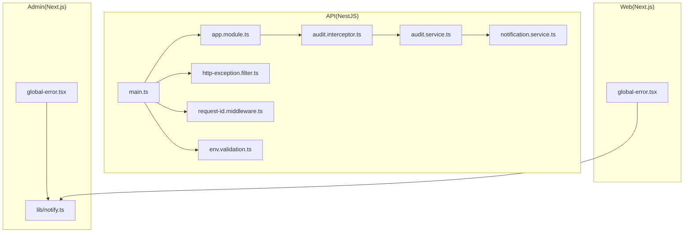
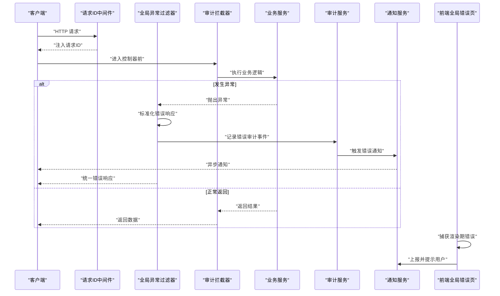
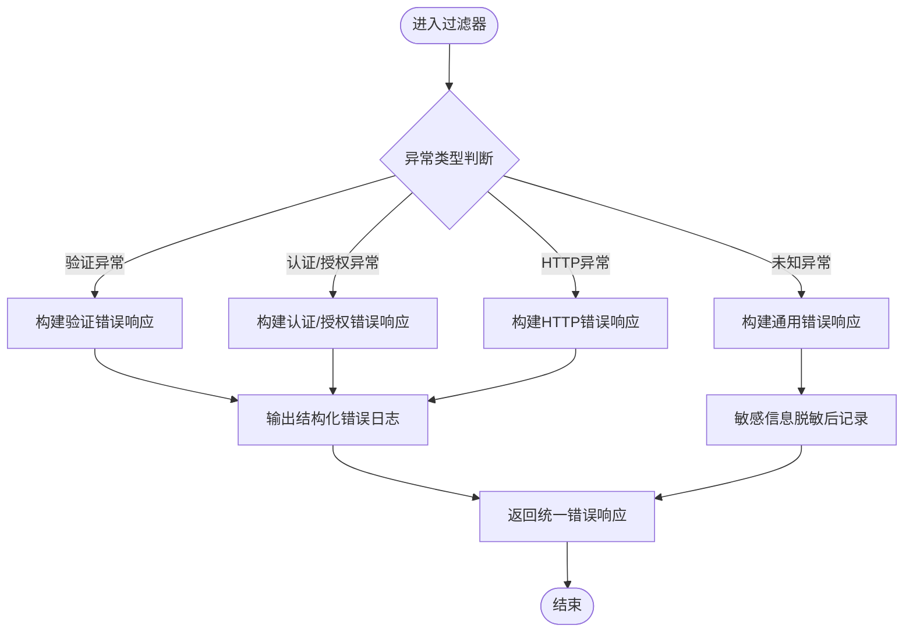
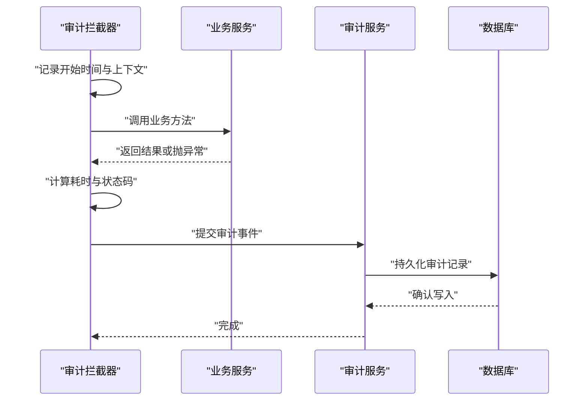
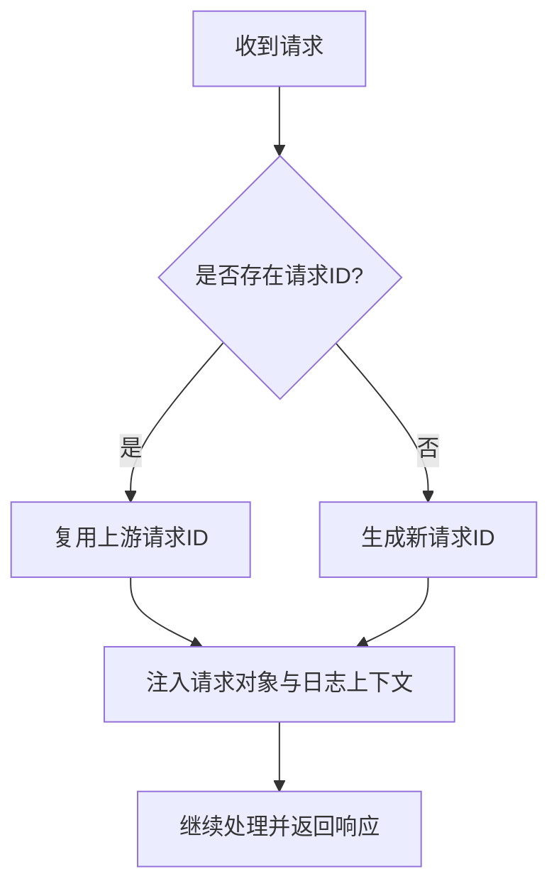
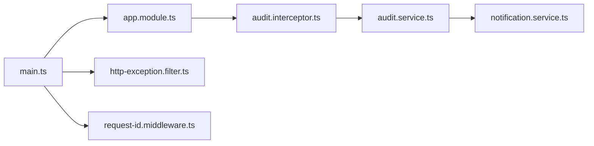

# 错误处理与日志

<cite>
**本文引用的文件**   
- [apps/api/src/main.ts](file://apps/api/src/main.ts)
- [apps/api/src/app.module.ts](file://apps/api/src/app.module.ts)
- [apps/api/src/common/filters/http-exception.filter.ts](file://apps/api/src/common/filters/http-exception.filter.ts)
- [apps/api/src/common/interceptors/audit.interceptor.ts](file://apps/api/src/common/interceptors/audit.interceptor.ts)
- [apps/api/src/common/middleware/request-id.middleware.ts](file://apps/api/src/common/middleware/request-id.middleware.ts)
- [apps/api/src/config/env.validation.ts](file://apps/api/src/config/env.validation.ts)
- [apps/api/src/audit/audit.service.ts](file://apps/api/src/audit/audit.service.ts)
- [apps/api/src/notifications/notification.service.ts](file://apps/api/src/notifications/notification.service.ts)
- [apps/admin/src/lib/notify.ts](file://apps/admin/src/lib/notify.ts)
- [apps/web/src/app/global-error.tsx](file://apps/web/src/app/global-error.tsx)
- [apps/admin/src/app/global-error.tsx](file://apps/admin/src/app/global-error.tsx)
</cite>

## 目录
1. [简介](#简介)
2. [项目结构](#项目结构)
3. [核心组件](#核心组件)
4. [架构总览](#架构总览)
5. [详细组件分析](#详细组件分析)
6. [依赖关系分析](#依赖关系分析)
7. [性能考量](#性能考量)
8. [故障排查指南](#故障排查指南)
9. [结论](#结论)
10. [附录](#附录)

## 简介
本指南面向后端 NestJS API、管理端 Next.js Admin 与前端 Next.js Web，系统化阐述错误处理与日志规范。内容覆盖：
- 全局异常过滤器配置与自定义错误类型定义
- 审计日志记录与结构化日志格式
- 错误通知机制（邮件/站内通知等）
- 日志级别划分、轮转策略与敏感信息脱敏
- 错误堆栈跟踪、上下文信息收集、分布式追踪ID传递
- 错误聚合分析与根因定位方法论
- 日志查询语法与告警规则配置建议

## 项目结构
本项目采用多应用（API、Admin、Web）+ 共享包的组织方式。错误处理与日志相关的关键位置如下：
- API 层：全局异常过滤器、审计拦截器、请求ID中间件、环境校验、审计服务、通知服务
- Admin/Web 前端：全局错误页面、用户侧通知库

图表来源 
- [apps/api/src/main.ts](file://apps/api/src/main.ts)
- [apps/api/src/app.module.ts](file://apps/api/src/app.module.ts)
- [apps/api/src/common/filters/http-exception.filter.ts](file://apps/api/src/common/filters/http-exception.filter.ts)
- [apps/api/src/common/interceptors/audit.interceptor.ts](file://apps/api/src/common/interceptors/audit.interceptor.ts)
- [apps/api/src/common/middleware/request-id.middleware.ts](file://apps/api/src/common/middleware/request-id.middleware.ts)
- [apps/api/src/config/env.validation.ts](file://apps/api/src/config/env.validation.ts)
- [apps/api/src/audit/audit.service.ts](file://apps/api/src/audit/audit.service.ts)
- [apps/api/src/notifications/notification.service.ts](file://apps/api/src/notifications/notification.service.ts)
- [apps/admin/src/lib/notify.ts](file://apps/admin/src/lib/notify.ts)
- [apps/web/src/app/global-error.tsx](file://apps/web/src/app/global-error.tsx)
- [apps/admin/src/app/global-error.tsx](file://apps/admin/src/app/global-error.tsx)

章节来源
- [apps/api/src/main.ts](file://apps/api/src/main.ts)
- [apps/api/src/app.module.ts](file://apps/api/src/app.module.ts)

## 核心组件
- 全局异常过滤器：统一捕获 HTTP 异常与未处理异常，标准化响应体，输出结构化错误日志
- 审计拦截器：在请求生命周期内采集操作上下文并写入审计日志
- 请求ID中间件：生成并注入请求级追踪ID，贯穿日志与链路追踪
- 环境校验：启动时校验环境变量，避免运行时配置缺失导致的不稳定
- 审计服务：持久化审计事件，支持按主体、动作、资源维度检索
- 通知服务：将关键错误与审计事件通过邮件或站内信通知相关人员
- 前端全局错误页：捕获渲染期与路由期错误，上报并展示友好提示
- 通知库：封装用户侧通知交互（Toast/弹窗），屏蔽技术细节

章节来源
- [apps/api/src/common/filters/http-exception.filter.ts](file://apps/api/src/common/filters/http-exception.filter.ts)
- [apps/api/src/common/interceptors/audit.interceptor.ts](file://apps/api/src/common/interceptors/audit.interceptor.ts)
- [apps/api/src/common/middleware/request-id.middleware.ts](file://apps/api/src/common/middleware/request-id.middleware.ts)
- [apps/api/src/config/env.validation.ts](file://apps/api/src/config/env.validation.ts)
- [apps/api/src/audit/audit.service.ts](file://apps/api/src/audit/audit.service.ts)
- [apps/api/src/notifications/notification.service.ts](file://apps/api/src/notifications/notification.service.ts)
- [apps/admin/src/lib/notify.ts](file://apps/admin/src/lib/notify.ts)
- [apps/web/src/app/global-error.tsx](file://apps/web/src/app/global-error.tsx)
- [apps/admin/src/app/global-error.tsx](file://apps/admin/src/app/global-error.tsx)

## 架构总览
下图展示了从请求进入 API 到错误处理、审计与通知的完整流程，以及前端全局错误捕获与用户通知的联动。

图表来源 
- [apps/api/src/common/middleware/request-id.middleware.ts](file://apps/api/src/common/middleware/request-id.middleware.ts)
- [apps/api/src/common/filters/http-exception.filter.ts](file://apps/api/src/common/filters/http-exception.filter.ts)
- [apps/api/src/common/interceptors/audit.interceptor.ts](file://apps/api/src/common/interceptors/audit.interceptor.ts)
- [apps/api/src/audit/audit.service.ts](file://apps/api/src/audit/audit.service.ts)
- [apps/api/src/notifications/notification.service.ts](file://apps/api/src/notifications/notification.service.ts)
- [apps/web/src/app/global-error.tsx](file://apps/web/src/app/global-error.tsx)
- [apps/admin/src/app/global-error.tsx](file://apps/admin/src/app/global-error.tsx)

## 详细组件分析

### 全局异常过滤器
职责：
- 捕获所有未处理异常与 HTTP 异常
- 统一错误响应结构（包含错误码、消息、时间戳、请求ID等）
- 输出结构化错误日志（含堆栈、上下文、请求摘要）
- 区分可恢复错误与致命错误，控制是否暴露内部细节

实现要点：
- 使用 NestJS ExceptionFilter 接口
- 基于异常类型判断错误等级（如 ValidationException、UnauthorizedException、HttpException、未知异常）
- 对敏感字段进行脱敏（如密码、令牌、密钥）
- 附加请求级上下文（方法、路径、参数摘要、IP、UA、请求ID）

图表来源 
- [apps/api/src/common/filters/http-exception.filter.ts](file://apps/api/src/common/filters/http-exception.filter.ts)

章节来源
- [apps/api/src/common/filters/http-exception.filter.ts](file://apps/api/src/common/filters/http-exception.filter.ts)

### 审计拦截器
职责：
- 在请求进入与返回阶段记录审计事件（谁、做了什么、对什么资源、结果如何）
- 收集上下文：用户身份、角色、IP、UA、请求ID、耗时、状态码
- 过滤敏感输入（如密码、Token）后再落盘
- 支持批量/异步写入，降低主链路延迟

实现要点：
- 使用 NestJS Interceptor 包装处理器
- 基于装饰器或白名单决定是否审计
- 与审计服务对接，持久化审计事件

图表来源 
- [apps/api/src/common/interceptors/audit.interceptor.ts](file://apps/api/src/common/interceptors/audit.interceptor.ts)
- [apps/api/src/audit/audit.service.ts](file://apps/api/src/audit/audit.service.ts)

章节来源
- [apps/api/src/common/interceptors/audit.interceptor.ts](file://apps/api/src/common/interceptors/audit.interceptor.ts)
- [apps/api/src/audit/audit.service.ts](file://apps/api/src/audit/audit.service.ts)

### 请求ID中间件
职责：
- 为每个请求生成唯一追踪ID（如 UUID v4）
- 将请求ID注入响应头与日志上下文
- 贯穿整个调用链，便于跨服务关联日志

实现要点：
- 优先读取上游传入的请求ID（如网关透传）
- 若不存在则生成新ID
- 挂载到请求对象与日志上下文

图表来源 
- [apps/api/src/common/middleware/request-id.middleware.ts](file://apps/api/src/common/middleware/request-id.middleware.ts)

章节来源
- [apps/api/src/common/middleware/request-id.middleware.ts](file://apps/api/src/common/middleware/request-id.middleware.ts)

### 环境校验
职责：
- 启动时校验必需环境变量（如数据库连接、存储、第三方服务密钥）
- 失败时快速失败，避免运行期不稳定

实现要点：
- 使用 Joi/Zod 等 schema 校验环境变量
- 提供默认值与严格模式开关
- 输出清晰的缺失项报告

章节来源
- [apps/api/src/config/env.validation.ts](file://apps/api/src/config/env.validation.ts)

### 审计服务
职责：
- 抽象审计事件的写入接口
- 支持批量写入与重试
- 提供查询与导出能力

章节来源
- [apps/api/src/audit/audit.service.ts](file://apps/api/src/audit/audit.service.ts)

### 通知服务
职责：
- 将关键错误与审计事件通过邮件、站内信等方式通知
- 支持模板化内容与收件人路由规则
- 支持去重与限流，避免风暴

章节来源
- [apps/api/src/notifications/notification.service.ts](file://apps/api/src/notifications/notification.service.ts)

### 前端全局错误页与通知
- Admin/Web 全局错误页：捕获渲染期错误，上报错误上下文（路由、组件、用户会话），展示友好提示
- 通知库：封装用户侧通知（Toast/弹窗），屏蔽技术细节，支持国际化

章节来源
- [apps/web/src/app/global-error.tsx](file://apps/web/src/app/global-error.tsx)
- [apps/admin/src/app/global-error.tsx](file://apps/admin/src/app/global-error.tsx)
- [apps/admin/src/lib/notify.ts](file://apps/admin/src/lib/notify.ts)

## 依赖关系分析
- main.ts 注册全局异常过滤器、中间件与模块
- app.module.ts 装配拦截器与服务
- 审计拦截器依赖审计服务；审计服务可能依赖通知服务
- 请求ID中间件为后续日志与追踪提供上下文
- 环境校验在应用启动阶段执行

图表来源 
- [apps/api/src/main.ts](file://apps/api/src/main.ts)
- [apps/api/src/app.module.ts](file://apps/api/src/app.module.ts)
- [apps/api/src/common/filters/http-exception.filter.ts](file://apps/api/src/common/filters/http-exception.filter.ts)
- [apps/api/src/common/interceptors/audit.interceptor.ts](file://apps/api/src/common/interceptors/audit.interceptor.ts)
- [apps/api/src/common/middleware/request-id.middleware.ts](file://apps/api/src/common/middleware/request-id.middleware.ts)
- [apps/api/src/audit/audit.service.ts](file://apps/api/src/audit/audit.service.ts)
- [apps/api/src/notifications/notification.service.ts](file://apps/api/src/notifications/notification.service.ts)

章节来源
- [apps/api/src/main.ts](file://apps/api/src/main.ts)
- [apps/api/src/app.module.ts](file://apps/api/src/app.module.ts)

## 性能考量
- 审计写入采用异步/批量化，避免阻塞主链路
- 日志输出采用结构化 JSON，便于下游解析与索引
- 对高频路径启用采样策略，减少日志量
- 敏感字段脱敏在内存中完成，避免额外 IO
- 通知发送走队列或异步任务，防止同步阻塞

## 故障排查指南
- 快速定位：通过请求ID串联日志，定位一次请求的全链路轨迹
- 错误分类：根据异常类型与错误码快速归类（验证、认证、权限、业务、系统）
- 上下文收集：检查 IP、UA、租户/用户、路由、参数摘要、耗时、状态码
- 根因分析：结合审计事件与错误堆栈，定位变更点与外部依赖问题
- 告警策略：按错误率、P99 延迟、特定错误码阈值触发告警
- 日志查询语法建议：
  - 按请求ID查询：trace_id = "xxx"
  - 按错误级别查询：level = "error" AND status_code >= 500
  - 按用户/资源查询：user_id = "xxx" AND resource_type = "document"
  - 按时间范围查询：timestamp >= "2024-01-01T00:00:00Z" AND timestamp <= "2024-01-01T01:00:00Z"
- 告警规则示例：
  - 5xx 错误率 > 1% 持续 5 分钟
  - 特定错误码（如 401/403）突增超过基线 3 倍
  - 审计事件“删除”操作频率异常
- 趋势分析与复盘：
  - 按日/周统计错误分布与热点接口
  - 对比发布前后错误变化，定位回归问题
  - 建立错误知识库，沉淀常见场景与修复方案

## 结论
通过统一的全局异常过滤器、审计拦截器、请求ID中间件与通知服务，配合结构化日志与严格的脱敏策略，可实现端到端的错误处理与可观测性。结合合理的日志查询与告警规则，能够快速定位根因、降低 MTTR，并持续提升系统稳定性。

## 附录
- 日志级别划分建议：
  - trace：调试级，仅开发环境开启
  - debug：详细过程信息
  - info：关键业务流程与审计事件
  - warn：潜在风险与降级行为
  - error：可恢复错误与业务异常
  - fatal：不可恢复的系统错误
- 结构化日志字段建议：
  - 基础：timestamp、level、service、version、host
  - 请求：trace_id、method、path、status_code、latency_ms
  - 用户：user_id、roles、ip、ua
  - 业务：resource_type、resource_id、action
  - 错误：error_code、error_message、stack_trace（脱敏）
- 日志轮转配置建议：
  - 按大小（如 100MB）与时间（每日）双维度轮转
  - 保留周期（如 30 天）与压缩策略
  - 集中式采集（如 ELK/Loki）与索引优化
- 敏感信息脱敏清单：
  - 密码、Token、密钥、证书、个人身份信息（PII）
  - 脱敏策略：哈希、掩码、截断、替换
- 分布式追踪ID传递：
  - 上游透传优先，否则本地生成
  - 跨服务通过请求头传递
  - 日志与监控平台统一解析 trace_id