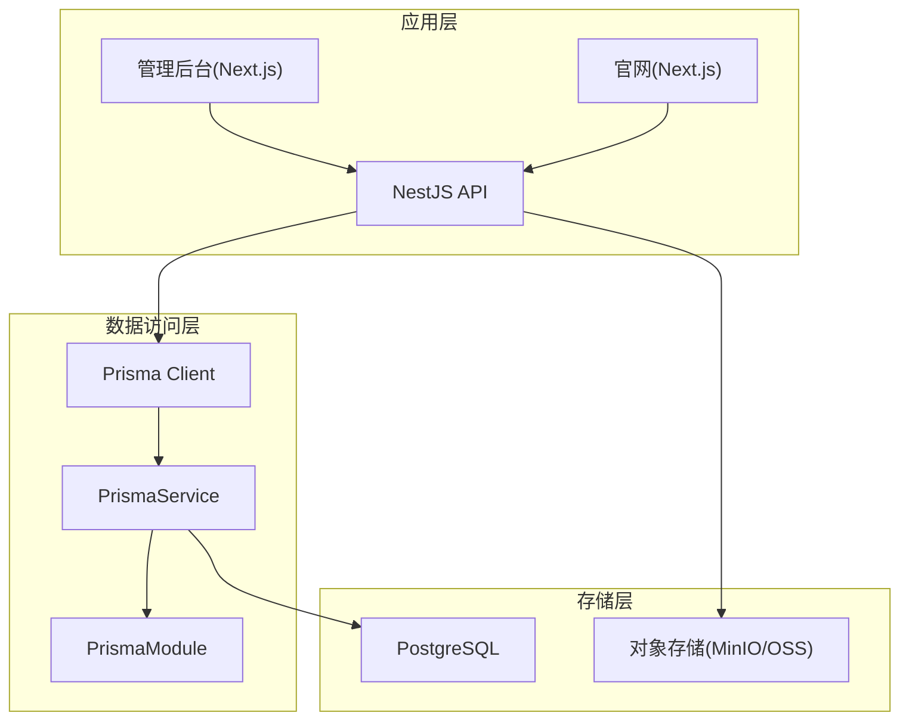
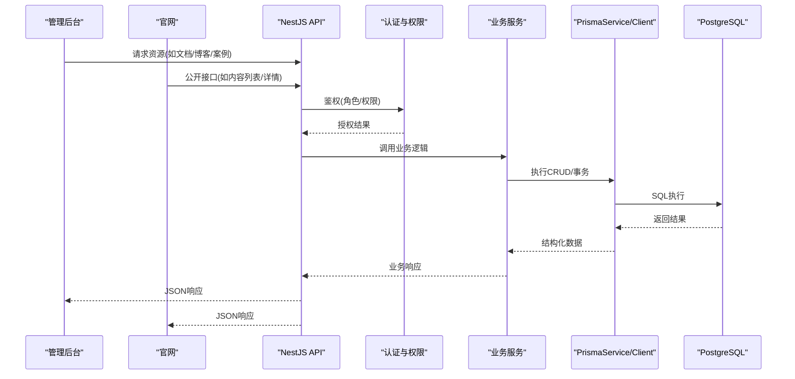
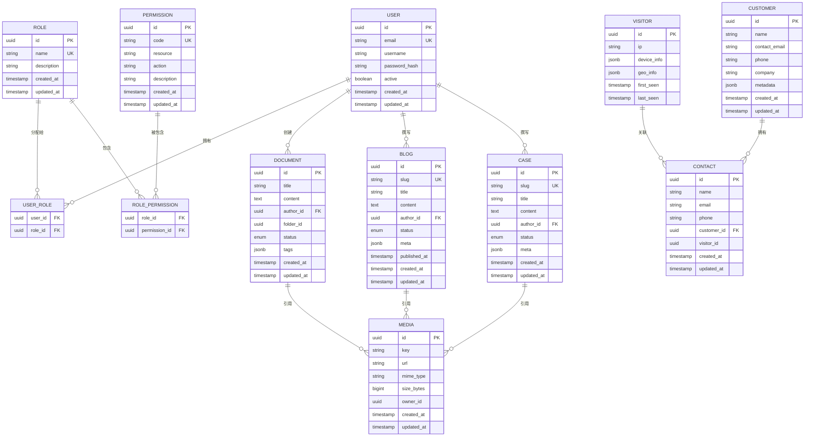
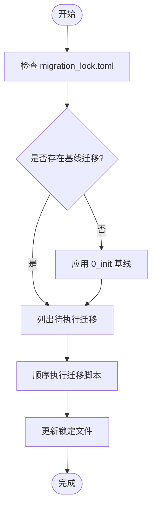
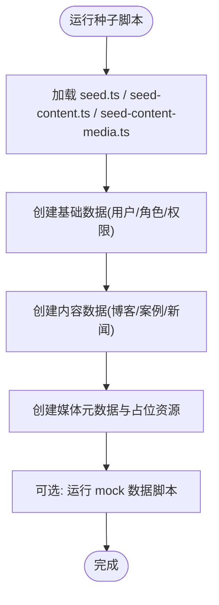
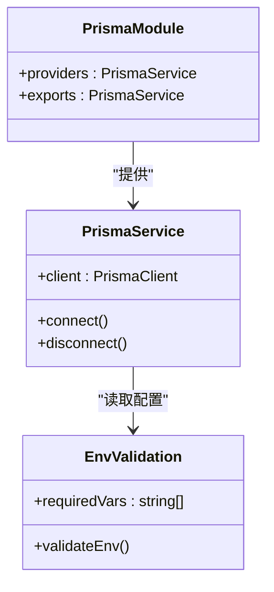

# 数据库设计

<cite>
**本文引用的文件**   
- [schema.prisma](file://apps/api/prisma/schema.prisma)
- [0_init/migration.sql](file://apps/api/prisma/migrations/0_init/migration.sql)
- [20260723110621_add_device_details/migration.sql](file://apps/api/prisma/migrations/20260723110621_add_device_details/migration.sql)
- [20260723120000_add_contact_visitor_id/migration.sql](file://apps/api/prisma/migrations/20260723120000_add_contact_visitor_id/migration.sql)
- [20260724122950_customer_visitor_id/migration.sql](file://apps/api/prisma/migrations/20260724122950_customer_visitor_id/migration.sql)
- [migration_lock.toml](file://apps/api/prisma/migrations/migration_lock.toml)
- [seed.ts](file://apps/api/prisma/seed.ts)
- [seed-content.ts](file://apps/api/prisma/seed-content.ts)
- [seed-content-media.ts](file://apps/api/prisma/seed-content-media.ts)
- [prisma.service.ts](file://apps/api/src/prisma/prisma.service.ts)
- [prisma.module.ts](file://apps/api/src/prisma/prisma.module.ts)
- [env.validation.ts](file://apps/api/src/config/env.validation.ts)
- [baseline-migrations.sh](file://apps/api/scripts/baseline-migrations.sh)
- [migrate-deprecated-roles.ts](file://apps/api/scripts/migrate-deprecated-roles.ts)
- [prune-deprecated-permissions.ts](file://apps/api/scripts/prune-deprecated-permissions.ts)
- [restore-media-to-minio.mjs](file://apps/api/scripts/restore-media-to-minio.mjs)
- [seed-chat-mock.ts](file://apps/api/scripts/seed-chat-mock.ts)
- [seed-contacts-mock.ts](file://apps/api/scripts/seed-contacts-mock.ts)
- [seed-roles.ts](file://apps/api/scripts/seed-roles.ts)
- [seed-visitors-mock.ts](file://apps/api/scripts/seed-visitors-mock.ts)
- [init.sql](file://infra/docker/postgres/init.sql)
</cite>

## 目录
1. [简介](#简介)
2. [项目结构](#项目结构)
3. [核心组件](#核心组件)
4. [架构总览](#架构总览)
5. [详细组件分析](#详细组件分析)
6. [依赖关系分析](#依赖关系分析)
7. [性能考虑](#性能考虑)
8. [故障排查指南](#故障排查指南)
9. [结论](#结论)
10. [附录](#附录)

## 简介
本文件面向数据库管理员与后端开发者，系统性阐述基于 PostgreSQL 的数据库架构与 Prisma ORM 配置。内容覆盖核心实体（用户、角色、权限、访客、客户、文档、博客、案例等）的关系模型、数据迁移策略、种子数据生成、备份恢复方案，以及索引设计、查询优化、数据完整性约束与安全考量。文档提供 ER 图、表结构说明与常用查询示例，帮助读者快速理解并高效维护数据层。

## 项目结构
- 数据模型定义位于 Prisma Schema：apps/api/prisma/schema.prisma
- 数据库迁移脚本位于 apps/api/prisma/migrations/*
- Prisma 客户端与服务在 NestJS 中注入：apps/api/src/prisma/*
- 环境校验与数据库连接参数由环境变量驱动：apps/api/src/config/env.validation.ts
- 种子数据与辅助脚本位于 apps/api/prisma 与 apps/api/scripts

图表来源
- [prisma.service.ts](file://apps/api/src/prisma/prisma.service.ts)
- [prisma.module.ts](file://apps/api/src/prisma/prisma.module.ts)
- [env.validation.ts](file://apps/api/src/config/env.validation.ts)

章节来源
- [schema.prisma](file://apps/api/prisma/schema.prisma)
- [prisma.service.ts](file://apps/api/src/prisma/prisma.service.ts)
- [prisma.module.ts](file://apps/api/src/prisma/prisma.module.ts)
- [env.validation.ts](file://apps/api/src/config/env.validation.ts)

## 核心组件
- 数据模型与关系：通过 schema.prisma 统一声明实体、字段类型、关联与约束。
- 迁移管理：使用 Prisma Migrate，按时间戳或命名组织迁移脚本，确保可重复部署。
- 服务注入：PrismaService 暴露 PrismaClient 实例，供业务模块按需注入。
- 环境配置：通过环境变量校验确保数据库连接信息正确。
- 种子数据：提供基础数据与演示数据的初始化脚本。

章节来源
- [schema.prisma](file://apps/api/prisma/schema.prisma)
- [prisma.service.ts](file://apps/api/src/prisma/prisma.service.ts)
- [prisma.module.ts](file://apps/api/src/prisma/prisma.module.ts)
- [env.validation.ts](file://apps/api/src/config/env.validation.ts)

## 架构总览
下图展示从前端到数据库的整体数据流与关键组件交互。

图表来源
- [prisma.service.ts](file://apps/api/src/prisma/prisma.service.ts)
- [env.validation.ts](file://apps/api/src/config/env.validation.ts)

## 详细组件分析

### 实体关系模型（ER 图）
以下 ER 图概括了用户、角色、权限、访客、客户、文档、博客、案例等核心实体的关系与约束。

图表来源
- [schema.prisma](file://apps/api/prisma/schema.prisma)

章节来源
- [schema.prisma](file://apps/api/prisma/schema.prisma)

### 迁移策略与版本控制
- 使用 Prisma Migrate 进行增量迁移，每个变更对应一个迁移目录与 SQL 文件。
- 基线迁移与后续迁移分离，便于冷启动与升级。
- 锁定文件记录已应用的迁移哈希，保证一致性。

图表来源
- [0_init/migration.sql](file://apps/api/prisma/migrations/0_init/migration.sql)
- [20260723110621_add_device_details/migration.sql](file://apps/api/prisma/migrations/20260723110621_add_device_details/migration.sql)
- [20260723120000_add_contact_visitor_id/migration.sql](file://apps/api/prisma/migrations/20260723120000_add_contact_visitor_id/migration.sql)
- [20260724122950_customer_visitor_id/migration.sql](file://apps/api/prisma/migrations/20260724122950_customer_visitor_id/migration.sql)
- [migration_lock.toml](file://apps/api/prisma/migrations/migration_lock.toml)

章节来源
- [0_init/migration.sql](file://apps/api/prisma/migrations/0_init/migration.sql)
- [20260723110621_add_device_details/migration.sql](file://apps/api/prisma/migrations/20260723110621_add_device_details/migration.sql)
- [20260723120000_add_contact_visitor_id/migration.sql](file://apps/api/prisma/migrations/20260723120000_add_contact_visitor_id/migration.sql)
- [20260724122950_customer_visitor_id/migration.sql](file://apps/api/prisma/migrations/20260724122950_customer_visitor_id/migration.sql)
- [migration_lock.toml](file://apps/api/prisma/migrations/migration_lock.toml)

### 种子数据与演示数据
- 基础种子：用户、角色、权限、系统设置等。
- 内容种子：博客、案例、新闻、贸易展等。
- 媒体种子：占位图片与媒体元数据。
- Mock 数据：访客、联系人、聊天会话等用于测试。

图表来源
- [seed.ts](file://apps/api/prisma/seed.ts)
- [seed-content.ts](file://apps/api/prisma/seed-content.ts)
- [seed-content-media.ts](file://apps/api/prisma/seed-content-media.ts)
- [seed-chat-mock.ts](file://apps/api/scripts/seed-chat-mock.ts)
- [seed-contacts-mock.ts](file://apps/api/scripts/seed-contacts-mock.ts)
- [seed-roles.ts](file://apps/api/scripts/seed-roles.ts)
- [seed-visitors-mock.ts](file://apps/api/scripts/seed-visitors-mock.ts)

章节来源
- [seed.ts](file://apps/api/prisma/seed.ts)
- [seed-content.ts](file://apps/api/prisma/seed-content.ts)
- [seed-content-media.ts](file://apps/api/prisma/seed-content-media.ts)
- [seed-chat-mock.ts](file://apps/api/scripts/seed-chat-mock.ts)
- [seed-contacts-mock.ts](file://apps/api/scripts/seed-contacts-mock.ts)
- [seed-roles.ts](file://apps/api/scripts/seed-roles.ts)
- [seed-visitors-mock.ts](file://apps/api/scripts/seed-visitors-mock.ts)

### 数据完整性与约束
- 主键与唯一性：为关键字段添加唯一约束，避免重复。
- 外键关系：确保关联数据的一致性，支持级联删除或限制删除。
- 枚举与校验：对状态、类型等使用枚举或校验规则。
- JSONB 字段：灵活扩展元数据，配合应用层校验。

章节来源
- [schema.prisma](file://apps/api/prisma/schema.prisma)

### 索引设计与查询优化
- 高频查询字段建立索引：如 slug、email、status、published_at 等。
- 复合索引：针对常见过滤条件组合（如 status + published_at）。
- 全文检索：对内容字段使用 Postgres 全文搜索或外部搜索引擎。
- 分页与排序：合理分页、避免深分页；排序字段加索引。
- 统计与聚合：使用物化视图或定时汇总提升报表性能。

章节来源
- [schema.prisma](file://apps/api/prisma/schema.prisma)

### 安全性考虑
- 密码加密：使用强哈希算法存储密码。
- 最小权限原则：数据库账号仅授予必要权限。
- 传输加密：启用 TLS，保护连接安全。
- 敏感数据脱敏：日志与调试输出避免泄露敏感信息。
- 访问控制：结合角色与权限模型控制资源访问。

章节来源
- [schema.prisma](file://apps/api/prisma/schema.prisma)

### 常用查询示例（概念性）
- 获取已发布的博客列表（分页、按发布时间倒序）
- 根据作者筛选文档并返回标签集合
- 统计各角色的用户数量
- 查找最近活跃的访客及其设备信息
- 将访客转换为潜在客户并保留历史追踪

章节来源
- [schema.prisma](file://apps/api/prisma/schema.prisma)

## 依赖关系分析
- PrismaService 作为单例暴露 PrismaClient，供各模块注入。
- 环境变量校验确保数据库连接参数有效。
- 迁移脚本与锁定文件共同保障数据库状态一致。

图表来源
- [prisma.service.ts](file://apps/api/src/prisma/prisma.service.ts)
- [prisma.module.ts](file://apps/api/src/prisma/prisma.module.ts)
- [env.validation.ts](file://apps/api/src/config/env.validation.ts)

章节来源
- [prisma.service.ts](file://apps/api/src/prisma/prisma.service.ts)
- [prisma.module.ts](file://apps/api/src/prisma/prisma.module.ts)
- [env.validation.ts](file://apps/api/src/config/env.validation.ts)

## 性能考虑
- 连接池：合理配置 Prisma 连接池大小，避免连接耗尽。
- 查询计划：定期分析慢查询，优化 SQL 与索引。
- 缓存策略：热点数据使用 Redis 缓存，降低数据库压力。
- 批量操作：使用批量写入减少往返次数。
- 读写分离：在高并发场景考虑只读副本。

[本节为通用指导，不直接分析具体文件]

## 故障排查指南
- 迁移失败：检查迁移脚本与锁定文件一致性，回滚或修复后重试。
- 连接错误：核对环境变量与网络连通性，确认数据库可达。
- 权限问题：确认数据库账号权限与应用所需最小权限匹配。
- 数据不一致：使用事务包裹关键操作，确保原子性。
- 媒体恢复：使用脚本将媒体恢复到对象存储，确保资源路径一致。

章节来源
- [baseline-migrations.sh](file://apps/api/scripts/baseline-migrations.sh)
- [migrate-deprecated-roles.ts](file://apps/api/scripts/migrate-deprecated-roles.ts)
- [prune-deprecated-permissions.ts](file://apps/api/scripts/prune-deprecated-permissions.ts)
- [restore-media-to-minio.mjs](file://apps/api/scripts/restore-media-to-minio.mjs)
- [init.sql](file://infra/docker/postgres/init.sql)

## 结论
本数据库设计以 Prisma 为核心，结合 PostgreSQL 的强大能力，构建了可扩展、可维护的数据层。通过清晰的实体关系、严格的迁移管理与完善的种子数据机制，保障了系统的稳定性与可演进性。建议在生产环境中持续监控查询性能、完善备份恢复流程，并遵循安全最佳实践。

[本节为总结，不直接分析具体文件]

## 附录

### 表结构与字段说明（摘要）
- 用户表：标识、邮箱、用户名、密码哈希、状态、时间戳
- 角色表：名称、描述、时间戳
- 权限表：代码、资源、动作、描述、时间戳
- 用户-角色关联：多对多映射
- 角色-权限关联：多对多映射
- 访客表：IP、设备信息、地理信息、首次/最后访问时间
- 客户表：名称、联系方式、公司、元数据、时间戳
- 文档表：标题、内容、作者、文件夹、状态、标签、时间戳
- 博客表：slug、标题、内容、作者、状态、元数据、发布时间、时间戳
- 案例表：slug、标题、内容、作者、状态、元数据、时间戳
- 联系人表：姓名、邮箱、电话、所属客户、关联访客、时间戳
- 媒体表：键、URL、MIME、大小、所有者、时间戳

章节来源
- [schema.prisma](file://apps/api/prisma/schema.prisma)

### 备份与恢复方案（概念性）
- 全量备份：定期导出数据库快照，存储于异地或对象存储。
- 增量备份：利用 WAL 归档实现近实时增量备份。
- 恢复演练：定期验证恢复流程，确保 RTO/RPO 目标达成。
- 数据清理：归档历史数据，保持生产库轻量。

[本节为通用指导，不直接分析具体文件]