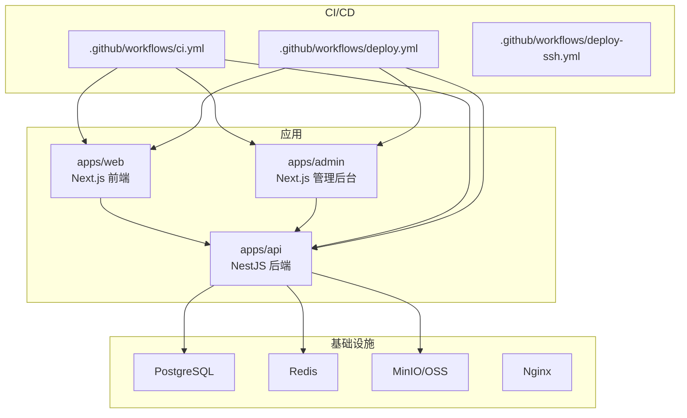
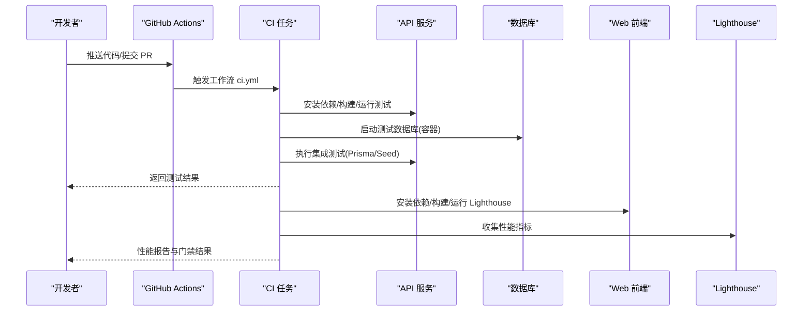
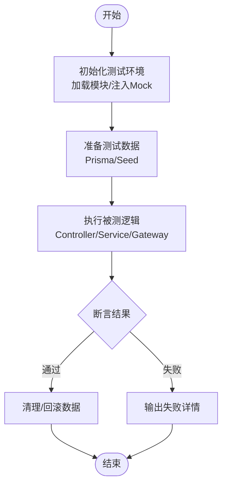
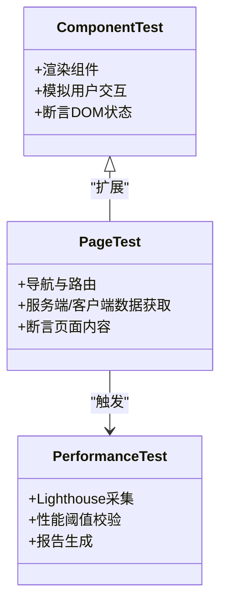
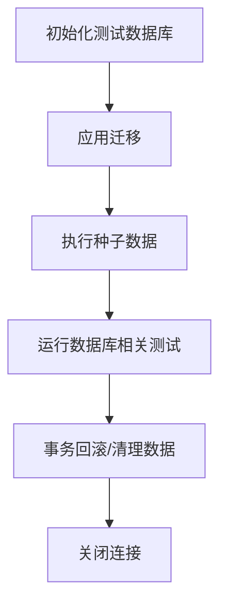
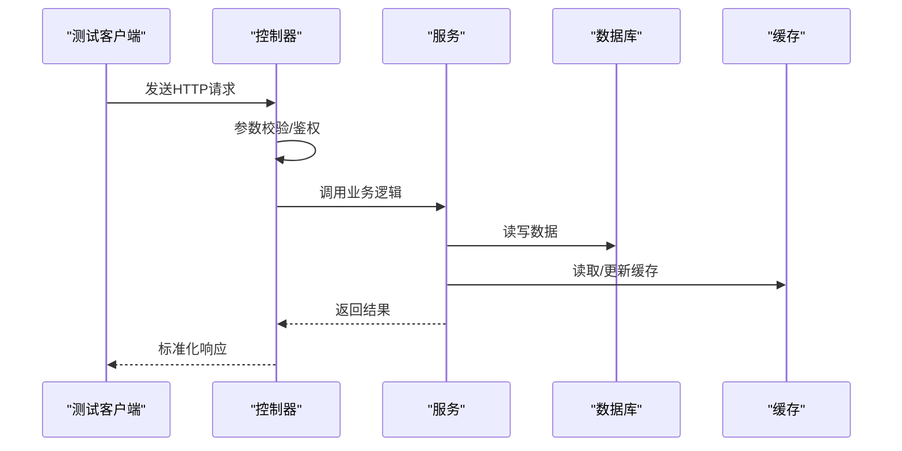
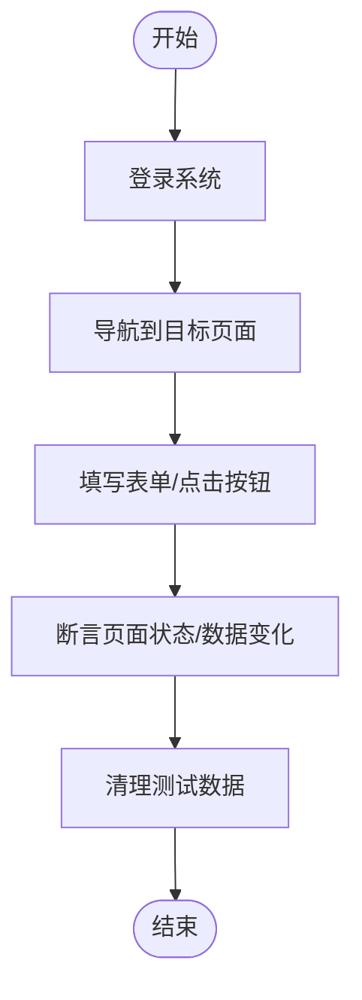
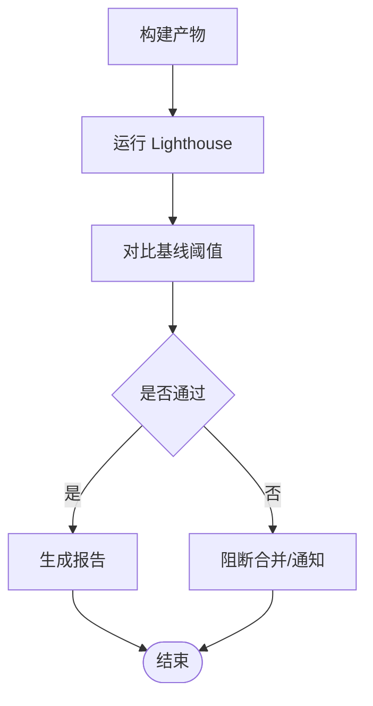
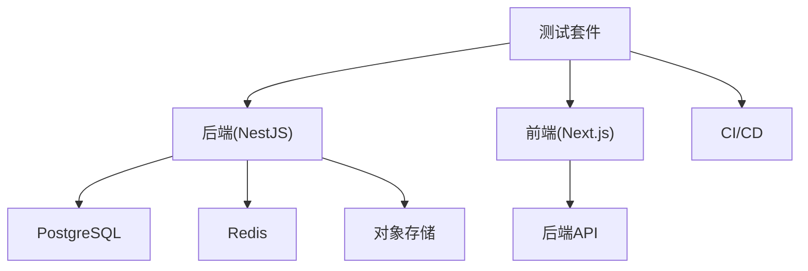

# 测试指南

<cite>
**本文引用的文件**   
- [ci.yml](file://.github/workflows/ci.yml)
- [deploy-ssh.yml](file://.github/workflows/deploy-ssh.yml)
- [deploy.yml](file://.github/workflows/deploy.yml)
- [package.json](file://apps/api/package.json)
- [nest-cli.json](file://apps/api/nest-cli.json)
- [schema.prisma](file://apps/api/prisma/schema.prisma)
- [seed.ts](file://apps/api/prisma/seed.ts)
- [seed-content-media.ts](file://apps/api/prisma/seed-content-media.ts)
- [seed-chat-mock.ts](file://apps/api/scripts/seed-chat-mock.ts)
- [seed-contacts-mock.ts](file://apps/api/scripts/seed-contacts-mock.ts)
- [seed-visitors-mock.ts](file://apps/api/scripts/seed-visitors-mock.ts)
- [agent-presence.integration.spec.ts](file://apps/api/src/support/agent-presence.integration.spec.ts)
- [chat-conversation-lifecycle.integration.spec.ts](file://apps/api/src/support/chat-conversation-lifecycle.integration.spec.ts)
- [chat-panel.integration.spec.ts](file://apps/api/src/support/chat-panel.integration.spec.ts)
- [chat.gateway.presence.spec.ts](file://apps/api/src/support/chat.gateway.presence.spec.ts)
- [visitor-presence.spec.ts](file://apps/api/src/support/visitor-presence.spec.ts)
- [lighthouserc.json](file://apps/web/lighthouserc.json)
- [docker-compose.dev.yml](file://infra/docker/docker-compose.dev.yml)
- [docker-compose.prod.yml](file://infra/docker/docker-compose.prod.yml)
- [Makefile](file://Makefile)
</cite>

## 目录
1. [简介](#简介)
2. [项目结构](#项目结构)
3. [核心组件](#核心组件)
4. [架构总览](#架构总览)
5. [详细组件分析](#详细组件分析)
6. [依赖分析](#依赖分析)
7. [性能考虑](#性能考虑)
8. [故障排查指南](#故障排查指南)
9. [结论](#结论)
10. [附录](#附录)

## 简介
本指南面向开发团队，提供覆盖单元测试、集成测试与端到端测试的完整实践方案。结合仓库中现有的 NestJS API、Next.js 前端以及 CI/CD 配置，给出测试框架选型、环境配置、数据管理、Mock 策略、异步与错误处理、覆盖率统计、持续集成质量门禁与回归测试的最佳实践，帮助团队建立高质量、可维护、可演进的测试体系。

## 项目结构
本项目为多应用仓库，包含：
- apps/api：NestJS 后端服务（含 Prisma、迁移、种子脚本）
- apps/web：Next.js 前端站点
- apps/admin：Next.js 管理后台
- infra/docker：本地与生产环境容器编排
- .github/workflows：CI/CD 流水线
- packages：共享包（主题、UI、类型等）

图表来源
- [ci.yml](file://.github/workflows/ci.yml)
- [deploy.yml](file://.github/workflows/deploy.yml)
- [deploy-ssh.yml](file://.github/workflows/deploy-ssh.yml)
- [docker-compose.dev.yml](file://infra/docker/docker-compose.dev.yml)
- [docker-compose.prod.yml](file://infra/docker/docker-compose.prod.yml)

章节来源
- [package.json](file://apps/api/package.json)
- [nest-cli.json](file://apps/api/nest-cli.json)
- [schema.prisma](file://apps/api/prisma/schema.prisma)
- [seed.ts](file://apps/api/prisma/seed.ts)
- [seed-content-media.ts](file://apps/api/prisma/seed-content-media.ts)
- [seed-chat-mock.ts](file://apps/api/scripts/seed-chat-mock.ts)
- [seed-contacts-mock.ts](file://apps/api/scripts/seed-contacts-mock.ts)
- [seed-visitors-mock.ts](file://apps/api/scripts/seed-visitors-mock.ts)
- [lighthouserc.json](file://apps/web/lighthouserc.json)
- [Makefile](file://Makefile)

## 核心组件
- 后端测试现状
  - 已存在若干集成测试与网关存在性测试，位于支持模块下，使用 Jest 运行器与 Nest Testing Module。
  - 关键测试文件包括会话生命周期、面板交互、网关存在性与访客存在性等。
- 前端测试现状
  - 未在当前结构中直接发现前端测试配置文件或测试用例；建议引入 React Testing Library + Vitest/Jest 进行组件与页面级测试。
- 性能测试现状
  - 前端 Lighthouse CI 配置存在，可用于自动化性能基线检查。
- 数据与数据库测试
  - 使用 Prisma Schema 与迁移，配合种子脚本生成测试数据；可通过事务回滚或独立测试库隔离。

章节来源
- [agent-presence.integration.spec.ts](file://apps/api/src/support/agent-presence.integration.spec.ts)
- [chat-conversation-lifecycle.integration.spec.ts](file://apps/api/src/support/chat-conversation-lifecycle.integration.spec.ts)
- [chat-panel.integration.spec.ts](file://apps/api/src/support/chat-panel.integration.spec.ts)
- [chat.gateway.presence.spec.ts](file://apps/api/src/support/chat.gateway.presence.spec.ts)
- [visitor-presence.spec.ts](file://apps/api/src/support/visitor-presence.spec.ts)
- [schema.prisma](file://apps/api/prisma/schema.prisma)
- [seed.ts](file://apps/api/prisma/seed.ts)
- [seed-content-media.ts](file://apps/api/prisma/seed-content-media.ts)
- [seed-chat-mock.ts](file://apps/api/scripts/seed-chat-mock.ts)
- [seed-contacts-mock.ts](file://apps/api/scripts/seed-contacts-mock.ts)
- [seed-visitors-mock.ts](file://apps/api/scripts/seed-visitors-mock.ts)
- [lighthouserc.json](file://apps/web/lighthouserc.json)

## 架构总览
下图展示从 CI 触发到各层测试执行与结果上报的整体流程，并标注了与代码文件的对应关系。

图表来源
- [ci.yml](file://.github/workflows/ci.yml)
- [docker-compose.dev.yml](file://infra/docker/docker-compose.dev.yml)
- [lighthouserc.json](file://apps/web/lighthouserc.json)

## 详细组件分析

### 后端集成测试（NestJS + Jest）
- 目标
  - 验证控制器、服务、网关与外部依赖（数据库、缓存、消息总线）的协作行为。
- 推荐实践
  - 使用 Nest Testing Module 搭建测试环境，按需替换真实依赖为 Mock。
  - 对数据库操作采用事务包裹或独立测试库，确保用例间隔离与快速回滚。
  - 对 WebSocket/Gateway 场景使用 Nest 提供的测试工具模拟连接与事件。
- 现有用例参考
  - 会话生命周期、聊天面板、网关存在性与访客存在性等集成测试。

图表来源
- [chat-conversation-lifecycle.integration.spec.ts](file://apps/api/src/support/chat-conversation-lifecycle.integration.spec.ts)
- [chat-panel.integration.spec.ts](file://apps/api/src/support/chat-panel.integration.spec.ts)
- [chat.gateway.presence.spec.ts](file://apps/api/src/support/chat.gateway.presence.spec.ts)
- [visitor-presence.spec.ts](file://apps/api/src/support/visitor-presence.spec.ts)

章节来源
- [chat-conversation-lifecycle.integration.spec.ts](file://apps/api/src/support/chat-conversation-lifecycle.integration.spec.ts)
- [chat-panel.integration.spec.ts](file://apps/api/src/support/chat-panel.integration.spec.ts)
- [chat.gateway.presence.spec.ts](file://apps/api/src/support/chat.gateway.presence.spec.ts)
- [visitor-presence.spec.ts](file://apps/api/src/support/visitor-presence.spec.ts)

### 前端组件与页面测试（Next.js）
- 目标
  - 验证 UI 组件渲染、用户交互、路由与数据获取的正确性。
- 推荐实践
  - 组件测试：React Testing Library + Vitest/Jest，聚焦用户行为与可访问性。
  - 页面测试：Next.js Test Runner 或 Cypress/Playwright 进行页面级与跨页流程测试。
  - 网络请求：使用 MSW 拦截 API，保证稳定与可重复。
- 性能测试
  - 使用 Lighthouse CI 配置进行自动化性能基线检查，防止性能退化。

图表来源
- [lighthouserc.json](file://apps/web/lighthouserc.json)

章节来源
- [lighthouserc.json](file://apps/web/lighthouserc.json)

### 数据库测试（Prisma）
- 目标
  - 验证模型变更、查询与写入、约束与索引的正确性。
- 推荐实践
  - 使用独立测试数据库实例，避免污染开发/生产数据。
  - 每个测试用例前后进行数据准备与清理，或使用事务回滚。
  - 利用 Prisma Client 的测试模式与迁移快照，确保一致性。
- 数据准备
  - 使用种子脚本批量生成基础数据，便于快速复现实验场景。

图表来源
- [schema.prisma](file://apps/api/prisma/schema.prisma)
- [seed.ts](file://apps/api/prisma/seed.ts)
- [seed-content-media.ts](file://apps/api/prisma/seed-content-media.ts)

章节来源
- [schema.prisma](file://apps/api/prisma/schema.prisma)
- [seed.ts](file://apps/api/prisma/seed.ts)
- [seed-content-media.ts](file://apps/api/prisma/seed-content-media.ts)

### API 接口测试
- 目标
  - 验证 REST/GraphQL 接口的输入校验、权限控制、业务逻辑与响应格式。
- 推荐实践
  - 使用 Nest 的 supertest 或 HTTP 客户端发起请求，断言状态码与响应体。
  - 对鉴权与权限路径使用 Mock 用户与角色，覆盖正常与异常分支。
  - 对第三方依赖（短信、邮件、存储）进行 Mock，确保测试稳定性。

图表来源
- [package.json](file://apps/api/package.json)
- [nest-cli.json](file://apps/api/nest-cli.json)

章节来源
- [package.json](file://apps/api/package.json)
- [nest-cli.json](file://apps/api/nest-cli.json)

### 端到端测试（E2E）
- 目标
  - 模拟真实用户流程，覆盖登录、导航、表单提交、文件上传、搜索等关键路径。
- 推荐实践
  - 使用 Playwright/Cypress 编写跨浏览器、跨环境的 E2E 用例。
  - 在 CI 中并行执行，缩短反馈时间。
  - 使用稳定的测试账号与固定数据快照，减少不稳定因素。

[本图为概念流程图，不映射具体源码]

### 性能测试与基准
- 目标
  - 监控前端性能指标（FCP、LCP、CLS 等），防止性能退化。
- 推荐实践
  - 使用 Lighthouse CI 在每次构建后自动采集并比较基线。
  - 对关键接口进行压测（如 k6、Artillery），评估吞吐与延迟。
  - 将性能阈值纳入质量门禁，失败阻断合并。

图表来源
- [lighthouserc.json](file://apps/web/lighthouserc.json)

章节来源
- [lighthouserc.json](file://apps/web/lighthouserc.json)

## 依赖分析
- 测试框架与工具
  - 后端：Jest、Nest Testing、Prisma Client、supertest（建议）。
  - 前端：React Testing Library、Vitest/Jest、MSW、Cypress/Playwright（建议）、Lighthouse CI。
- 基础设施依赖
  - 数据库：PostgreSQL（容器化）。
  - 缓存：Redis（容器化）。
  - 对象存储：MinIO/OSS（容器化或云端）。
- 依赖耦合与内聚
  - 控制器与服务解耦，便于单测与集成测试。
  - 对外部依赖通过接口抽象与依赖注入，降低耦合度。

图表来源
- [docker-compose.dev.yml](file://infra/docker/docker-compose.dev.yml)
- [docker-compose.prod.yml](file://infra/docker/docker-compose.prod.yml)
- [package.json](file://apps/api/package.json)

章节来源
- [docker-compose.dev.yml](file://infra/docker/docker-compose.dev.yml)
- [docker-compose.prod.yml](file://infra/docker/docker-compose.prod.yml)
- [package.json](file://apps/api/package.json)

## 性能考虑
- 测试执行优化
  - 并行运行测试用例，合理划分测试集，缩短 CI 时间。
  - 使用内存数据库或轻量替代（如 SQLite）加速单测。
- 资源隔离
  - 为每个测试进程分配独立数据库实例或命名空间，避免冲突。
- 缓存与预热
  - 对热点数据在测试前进行预热，减少随机 IO 带来的抖动。
- 前端性能
  - 定期运行 Lighthouse，关注关键指标趋势，及时修复性能回归。

[本节为通用指导，不直接分析具体文件]

## 故障排查指南
- 常见问题定位
  - 数据库连接失败：检查环境变量、容器端口映射与网络连通性。
  - 测试数据不一致：确认种子脚本执行顺序与事务回滚策略。
  - 前端网络请求不稳定：使用 MSW 固定响应，避免外部依赖波动。
  - 性能测试失败：核对 Lighthouse 阈值与网络环境差异。
- 调试技巧
  - 增加日志与断点，捕获关键路径的状态与异常。
  - 使用最小化用例复现问题，逐步缩小范围。
  - 在 CI 中保留中间产物与报告，便于离线分析。

章节来源
- [ci.yml](file://.github/workflows/ci.yml)
- [docker-compose.dev.yml](file://infra/docker/docker-compose.dev.yml)
- [lighthouserc.json](file://apps/web/lighthouserc.json)

## 结论
通过统一的测试策略、严格的 CI 质量门禁与完善的性能监控，团队可以持续提升代码质量与交付效率。建议优先补齐前端测试与 E2E 覆盖，完善数据库与 API 测试用例，并将性能基线与回归测试纳入日常开发流程。

[本节为总结性内容，不直接分析具体文件]

## 附录
- 持续集成与质量门禁
  - 在 CI 中串联单元测试、集成测试、E2E 与性能测试，设置失败即阻断的策略。
  - 使用 Makefile 统一命令入口，简化本地与 CI 的执行差异。
- 测试数据管理
  - 使用种子脚本与固定快照，确保测试数据的可重复性与可追溯性。
- 覆盖率统计
  - 在后端与前端分别启用覆盖率收集，设定最低覆盖率阈值，作为合并条件之一。

章节来源
- [ci.yml](file://.github/workflows/ci.yml)
- [Makefile](file://Makefile)
- [seed.ts](file://apps/api/prisma/seed.ts)
- [seed-content-media.ts](file://apps/api/prisma/seed-content-media.ts)
- [seed-chat-mock.ts](file://apps/api/scripts/seed-chat-mock.ts)
- [seed-contacts-mock.ts](file://apps/api/scripts/seed-contacts-mock.ts)
- [seed-visitors-mock.ts](file://apps/api/scripts/seed-visitors-mock.ts)