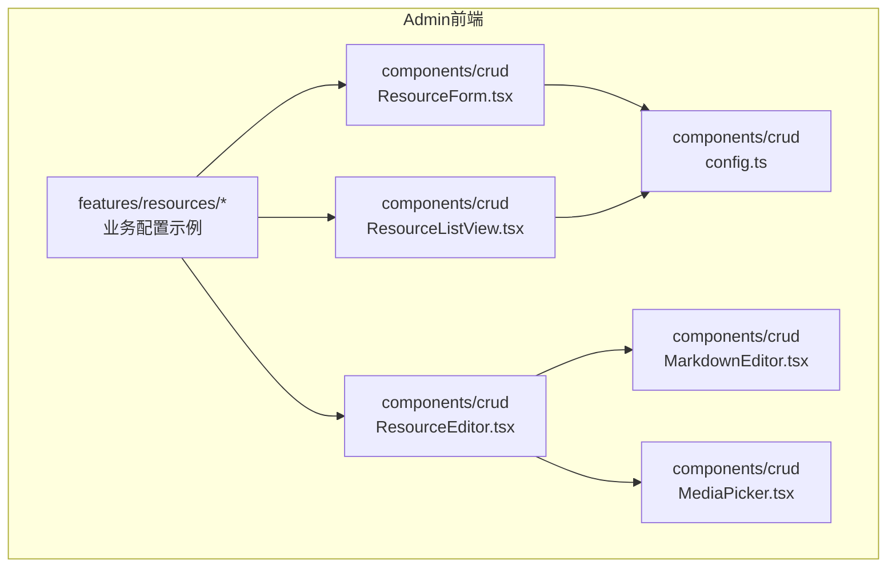
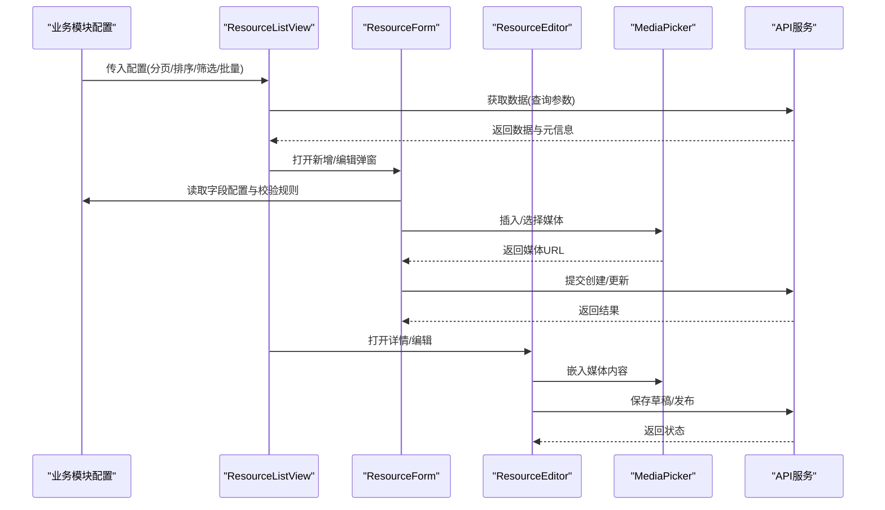
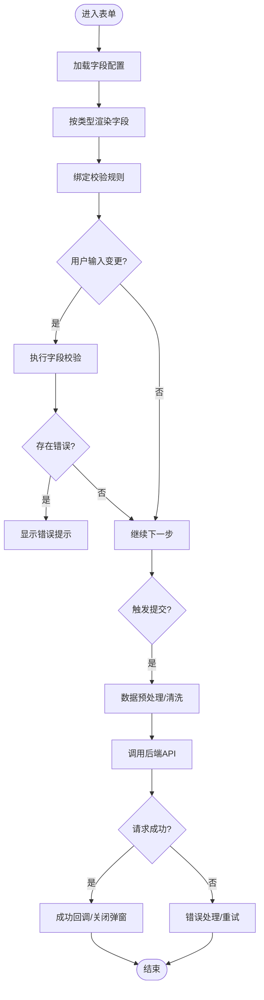
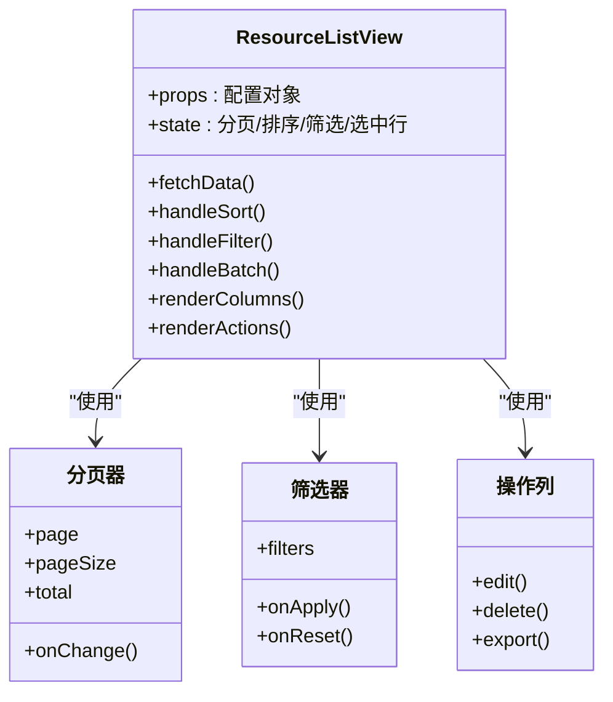
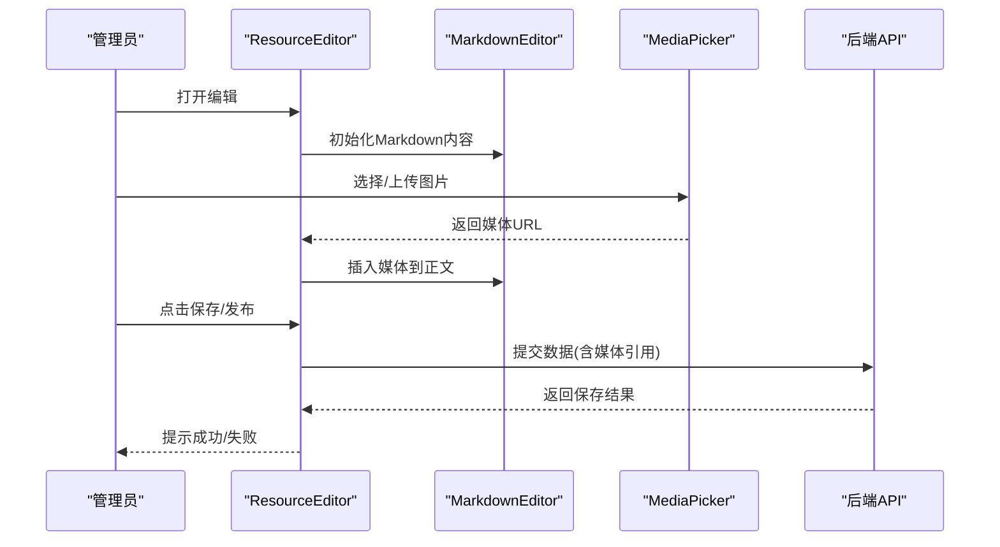
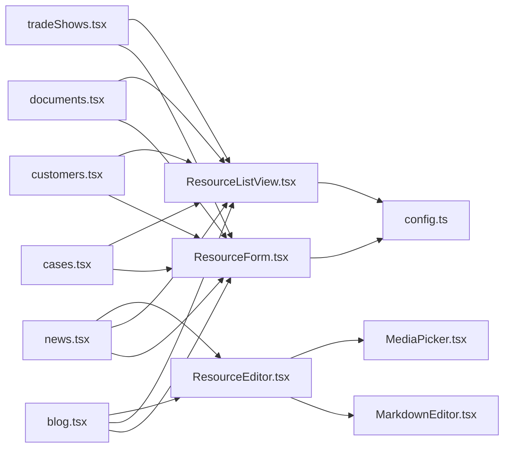

# CRUD操作框架

<cite>
**本文引用的文件**   
- [ResourceForm.tsx](file://apps/admin/src/components/crud/ResourceForm.tsx)
- [ResourceListView.tsx](file://apps/admin/src/components/crud/ResourceListView.tsx)
- [ResourceEditor.tsx](file://apps/admin/src/components/crud/ResourceEditor.tsx)
- [MarkdownEditor.tsx](file://apps/admin/src/components/crud/MarkdownEditor.tsx)
- [MediaPicker.tsx](file://apps/admin/src/components/crud/MediaPicker.tsx)
- [config.ts](file://apps/admin/src/components/crud/config.ts)
- [blog.tsx](file://apps/admin/src/features/resources/blog.tsx)
- [cases.tsx](file://apps/admin/src/features/resources/cases.tsx)
- [customers.tsx](file://apps/admin/src/features/resources/customers.tsx)
- [documents.tsx](file://apps/admin/src/features/resources/documents.tsx)
- [news.tsx](file://apps/admin/src/features/resources/news.tsx)
- [tradeShows.tsx](file://apps/admin/src/features/resources/tradeShows.tsx)
</cite>

## 目录
1. [简介](#简介)
2. [项目结构](#项目结构)
3. [核心组件](#核心组件)
4. [架构总览](#架构总览)
5. [详细组件分析](#详细组件分析)
6. [依赖关系分析](#依赖关系分析)
7. [性能考量](#性能考量)
8. [故障排查指南](#故障排查指南)
9. [结论](#结论)
10. [附录：CRUD配置模板与扩展方法](#附录crud配置模板与扩展方法)

## 简介
本文件面向管理后台的CRUD（增删改查）操作框架，聚焦以下目标：
- ResourceForm表单组件的配置化实现、字段类型支持与数据验证
- ResourceListView表格组件的分页、排序、筛选与批量操作能力
- ResourceEditor编辑器的统一封装与Markdown支持
- MediaPicker媒体选择器、文件上传与预览功能
- 提供CRUD配置模板与自定义扩展方法，便于快速落地业务模块

该框架以“配置驱动”为核心思想，通过统一的组件与接口契约，将通用CRUD能力沉淀为可复用、可扩展的前端基础设施。

## 项目结构
CRUD相关代码集中在admin应用的components/crud目录，并在features/resources中提供各业务模块的配置示例。

图表来源
- [ResourceForm.tsx](file://apps/admin/src/components/crud/ResourceForm.tsx)
- [ResourceListView.tsx](file://apps/admin/src/components/crud/ResourceListView.tsx)
- [ResourceEditor.tsx](file://apps/admin/src/components/crud/ResourceEditor.tsx)
- [MarkdownEditor.tsx](file://apps/admin/src/components/crud/MarkdownEditor.tsx)
- [MediaPicker.tsx](file://apps/admin/src/components/crud/MediaPicker.tsx)
- [config.ts](file://apps/admin/src/components/crud/config.ts)
- [blog.tsx](file://apps/admin/src/features/resources/blog.tsx)
- [cases.tsx](file://apps/admin/src/features/resources/cases.tsx)
- [customers.tsx](file://apps/admin/src/features/resources/customers.tsx)
- [documents.tsx](file://apps/admin/src/features/resources/documents.tsx)
- [news.tsx](file://apps/admin/src/features/resources/news.tsx)
- [tradeShows.tsx](file://apps/admin/src/features/resources/tradeShows.tsx)

章节来源
- [ResourceForm.tsx](file://apps/admin/src/components/crud/ResourceForm.tsx)
- [ResourceListView.tsx](file://apps/admin/src/components/crud/ResourceListView.tsx)
- [ResourceEditor.tsx](file://apps/admin/src/components/crud/ResourceEditor.tsx)
- [MarkdownEditor.tsx](file://apps/admin/src/components/crud/MarkdownEditor.tsx)
- [MediaPicker.tsx](file://apps/admin/src/components/crud/MediaPicker.tsx)
- [config.ts](file://apps/admin/src/components/crud/config.ts)
- [blog.tsx](file://apps/admin/src/features/resources/blog.tsx)
- [cases.tsx](file://apps/admin/src/features/resources/cases.tsx)
- [customers.tsx](file://apps/admin/src/features/resources/customers.tsx)
- [documents.tsx](file://apps/admin/src/features/resources/documents.tsx)
- [news.tsx](file://apps/admin/src/features/resources/news.tsx)
- [tradeShows.tsx](file://apps/admin/src/features/resources/tradeShows.tsx)

## 核心组件
- ResourceForm：基于配置的表单生成器，支持多字段类型、校验规则、联动与动态渲染
- ResourceListView：列表展示与交互中心，内置分页、排序、筛选、批量操作与导出
- ResourceEditor：统一编辑器外壳，集成Markdown与媒体选择，提供保存草稿与发布流程
- MarkdownEditor：Markdown编辑器封装，支持工具栏、快捷键、预览与国际化
- MediaPicker：媒体选择器，支持图片/视频/文档选择、上传、预览与去重
- config：CRUD配置项定义与默认值，约束表单字段、列定义、API路径等

章节来源
- [ResourceForm.tsx](file://apps/admin/src/components/crud/ResourceForm.tsx)
- [ResourceListView.tsx](file://apps/admin/src/components/crud/ResourceListView.tsx)
- [ResourceEditor.tsx](file://apps/admin/src/components/crud/ResourceEditor.tsx)
- [MarkdownEditor.tsx](file://apps/admin/src/components/crud/MarkdownEditor.tsx)
- [MediaPicker.tsx](file://apps/admin/src/components/crud/MediaPicker.tsx)
- [config.ts](file://apps/admin/src/components/crud/config.ts)

## 架构总览
CRUD框架采用“配置驱动 + 组件组合”的架构模式。业务模块通过配置描述资源模型、字段、列、API与权限，框架自动装配表单、列表与编辑器，减少样板代码。

图表来源
- [ResourceListView.tsx](file://apps/admin/src/components/crud/ResourceListView.tsx)
- [ResourceForm.tsx](file://apps/admin/src/components/crud/ResourceForm.tsx)
- [ResourceEditor.tsx](file://apps/admin/src/components/crud/ResourceEditor.tsx)
- [MediaPicker.tsx](file://apps/admin/src/components/crud/MediaPicker.tsx)
- [blog.tsx](file://apps/admin/src/features/resources/blog.tsx)
- [news.tsx](file://apps/admin/src/features/resources/news.tsx)

## 详细组件分析

### ResourceForm表单组件
- 配置化实现：通过字段配置数组驱动渲染，支持文本、数字、日期、富文本、下拉、单选、多选、开关、关联对象、媒体等类型
- 数据验证：内置必填、长度、格式、范围、正则等校验；支持异步校验与自定义校验函数
- 联动与动态：字段间联动（如分类影响标签）、条件显示/隐藏、动态选项加载
- 表单行为：提交前数据清洗、错误提示、防重复提交、撤销/恢复

图表来源
- [ResourceForm.tsx](file://apps/admin/src/components/crud/ResourceForm.tsx)
- [config.ts](file://apps/admin/src/components/crud/config.ts)

章节来源
- [ResourceForm.tsx](file://apps/admin/src/components/crud/ResourceForm.tsx)
- [config.ts](file://apps/admin/src/components/crud/config.ts)

### ResourceListView表格组件
- 分页：支持服务端分页、页码跳转、每页条数切换、总条数统计
- 排序：单列/多列排序，升序/降序，默认排序策略
- 筛选：文本搜索、数值区间、枚举筛选、时间范围、复合条件
- 批量操作：全选/反选、批量删除、批量状态切换、批量导出
- 列定义：列宽、固定列、格式化、插槽扩展、操作列

图表来源
- [ResourceListView.tsx](file://apps/admin/src/components/crud/ResourceListView.tsx)

章节来源
- [ResourceListView.tsx](file://apps/admin/src/components/crud/ResourceListView.tsx)

### ResourceEditor编辑器与Markdown支持
- 统一封装：提供标题、摘要、封面、正文、标签、状态等通用字段编排
- Markdown支持：基于MarkdownEditor，支持实时预览、快捷键、工具栏、语法高亮
- 媒体集成：在编辑器内插入图片/视频/文档，支持拖拽与预览
- 版本控制：草稿保存、发布/撤回、修订历史（可选）

图表来源
- [ResourceEditor.tsx](file://apps/admin/src/components/crud/ResourceEditor.tsx)
- [MarkdownEditor.tsx](file://apps/admin/src/components/crud/MarkdownEditor.tsx)
- [MediaPicker.tsx](file://apps/admin/src/components/crud/MediaPicker.tsx)

章节来源
- [ResourceEditor.tsx](file://apps/admin/src/components/crud/ResourceEditor.tsx)
- [MarkdownEditor.tsx](file://apps/admin/src/components/crud/MarkdownEditor.tsx)
- [MediaPicker.tsx](file://apps/admin/src/components/crud/MediaPicker.tsx)

### MediaPicker媒体选择器
- 功能：浏览媒体库、上传新文件、预览、去重、批量选择
- 类型：图片、视频、文档，支持缩略图与元数据展示
- 集成：与表单和编辑器无缝对接，返回标准化媒体对象

章节来源
- [MediaPicker.tsx](file://apps/admin/src/components/crud/MediaPicker.tsx)

### 配置系统config
- 字段配置：定义字段名、类型、标签、占位符、默认值、校验、可见性、顺序
- 列配置：定义列名、宽度、排序、筛选、格式化、操作按钮
- API配置：定义列表、详情、创建、更新、删除接口路径与参数映射
- 权限配置：控制按钮显隐与操作权限

章节来源
- [config.ts](file://apps/admin/src/components/crud/config.ts)

## 依赖关系分析
CRUD框架内部组件之间职责清晰，业务模块通过配置注入具体领域逻辑。

图表来源
- [blog.tsx](file://apps/admin/src/features/resources/blog.tsx)
- [news.tsx](file://apps/admin/src/features/resources/news.tsx)
- [cases.tsx](file://apps/admin/src/features/resources/cases.tsx)
- [customers.tsx](file://apps/admin/src/features/resources/customers.tsx)
- [documents.tsx](file://apps/admin/src/features/resources/documents.tsx)
- [tradeShows.tsx](file://apps/admin/src/features/resources/tradeShows.tsx)
- [ResourceForm.tsx](file://apps/admin/src/components/crud/ResourceForm.tsx)
- [ResourceListView.tsx](file://apps/admin/src/components/crud/ResourceListView.tsx)
- [ResourceEditor.tsx](file://apps/admin/src/components/crud/ResourceEditor.tsx)
- [MarkdownEditor.tsx](file://apps/admin/src/components/crud/MarkdownEditor.tsx)
- [MediaPicker.tsx](file://apps/admin/src/components/crud/MediaPicker.tsx)
- [config.ts](file://apps/admin/src/components/crud/config.ts)

章节来源
- [blog.tsx](file://apps/admin/src/features/resources/blog.tsx)
- [news.tsx](file://apps/admin/src/features/resources/news.tsx)
- [cases.tsx](file://apps/admin/src/features/resources/cases.tsx)
- [customers.tsx](file://apps/admin/src/features/resources/customers.tsx)
- [documents.tsx](file://apps/admin/src/features/resources/documents.tsx)
- [tradeShows.tsx](file://apps/admin/src/features/resources/tradeShows.tsx)
- [ResourceForm.tsx](file://apps/admin/src/components/crud/ResourceForm.tsx)
- [ResourceListView.tsx](file://apps/admin/src/components/crud/ResourceListView.tsx)
- [ResourceEditor.tsx](file://apps/admin/src/components/crud/ResourceEditor.tsx)
- [MarkdownEditor.tsx](file://apps/admin/src/components/crud/MarkdownEditor.tsx)
- [MediaPicker.tsx](file://apps/admin/src/components/crud/MediaPicker.tsx)
- [config.ts](file://apps/admin/src/components/crud/config.ts)

## 性能考量
- 列表分页与服务端排序/筛选：避免一次性加载大量数据，降低内存占用与网络传输
- 懒加载与虚拟滚动：大数据量场景下启用虚拟滚动提升渲染性能
- 防抖与节流：搜索框与筛选输入防抖，减少频繁请求
- 缓存策略：对静态配置与字典数据做本地缓存，缩短首屏时间
- 图片优化：媒体缩略图与按需加载，延迟加载非首屏图片
- 并发控制：批量操作限制并发数，避免阻塞UI与后端过载

[本节为通用指导，不直接分析具体文件]

## 故障排查指南
- 表单校验失败：检查字段配置中的校验规则是否正确，确认异步校验接口可达
- 列表无数据：核对API路径与参数映射，查看分页与筛选条件是否导致空结果
- 编辑器无法插入媒体：确认媒体选择器返回的URL格式与编辑器期望一致
- 批量操作异常：检查权限配置与后端批量接口实现，确认选中行数据完整
- 性能问题：开启浏览器性能面板，定位渲染瓶颈与网络请求热点

章节来源
- [ResourceForm.tsx](file://apps/admin/src/components/crud/ResourceForm.tsx)
- [ResourceListView.tsx](file://apps/admin/src/components/crud/ResourceListView.tsx)
- [ResourceEditor.tsx](file://apps/admin/src/components/crud/ResourceEditor.tsx)
- [MediaPicker.tsx](file://apps/admin/src/components/crud/MediaPicker.tsx)

## 结论
本CRUD框架通过配置化与组件化设计，显著降低了管理后台的开发成本，提升了可维护性与扩展性。借助ResourceForm、ResourceListView、ResourceEditor与MediaPicker等核心组件，能够快速构建具备分页、排序、筛选、批量操作与Markdown编辑能力的业务页面。配合统一的配置系统与扩展点，可满足多样化业务需求并保证一致性体验。

[本节为总结性内容，不直接分析具体文件]

## 附录：CRUD配置模板与扩展方法
- 配置模板要点
  - 字段配置：name、label、type、required、default、rules、visible、order
  - 列配置：key、title、width、sortable、filterable、formatter、actions
  - API配置：listUrl、detailUrl、createUrl、updateUrl、deleteUrl、paramsMap
  - 权限配置：按钮级权限标识与角色映射
- 扩展方法建议
  - 自定义字段类型：注册新的字段渲染器与校验器
  - 自定义列渲染：通过插槽或formatter扩展列展示
  - 自定义操作：在操作列中注入业务动作（如审核、归档）
  - 自定义筛选：实现复杂筛选条件与聚合统计
  - 事件钩子：在提交前后、列表刷新后、编辑器保存后注入自定义逻辑

章节来源
- [config.ts](file://apps/admin/src/components/crud/config.ts)
- [blog.tsx](file://apps/admin/src/features/resources/blog.tsx)
- [news.tsx](file://apps/admin/src/features/resources/news.tsx)
- [cases.tsx](file://apps/admin/src/features/resources/cases.tsx)
- [customers.tsx](file://apps/admin/src/features/resources/customers.tsx)
- [documents.tsx](file://apps/admin/src/features/resources/documents.tsx)
- [tradeShows.tsx](file://apps/admin/src/features/resources/tradeShows.tsx)