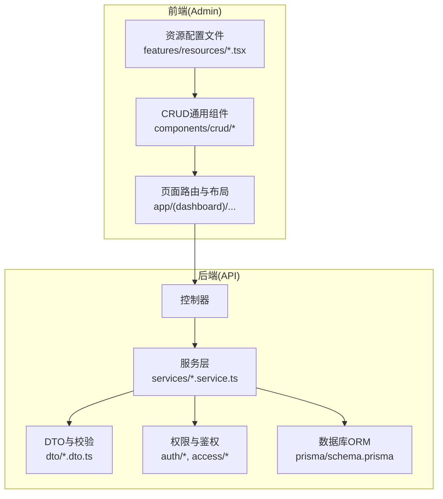
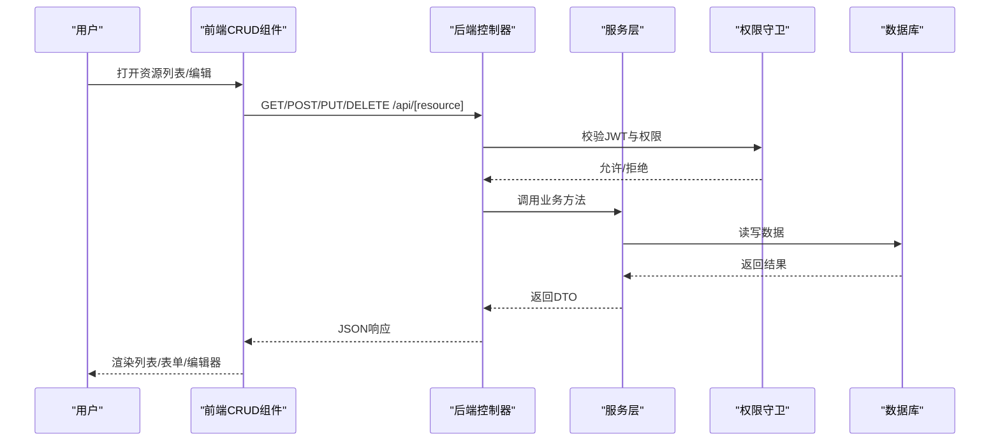
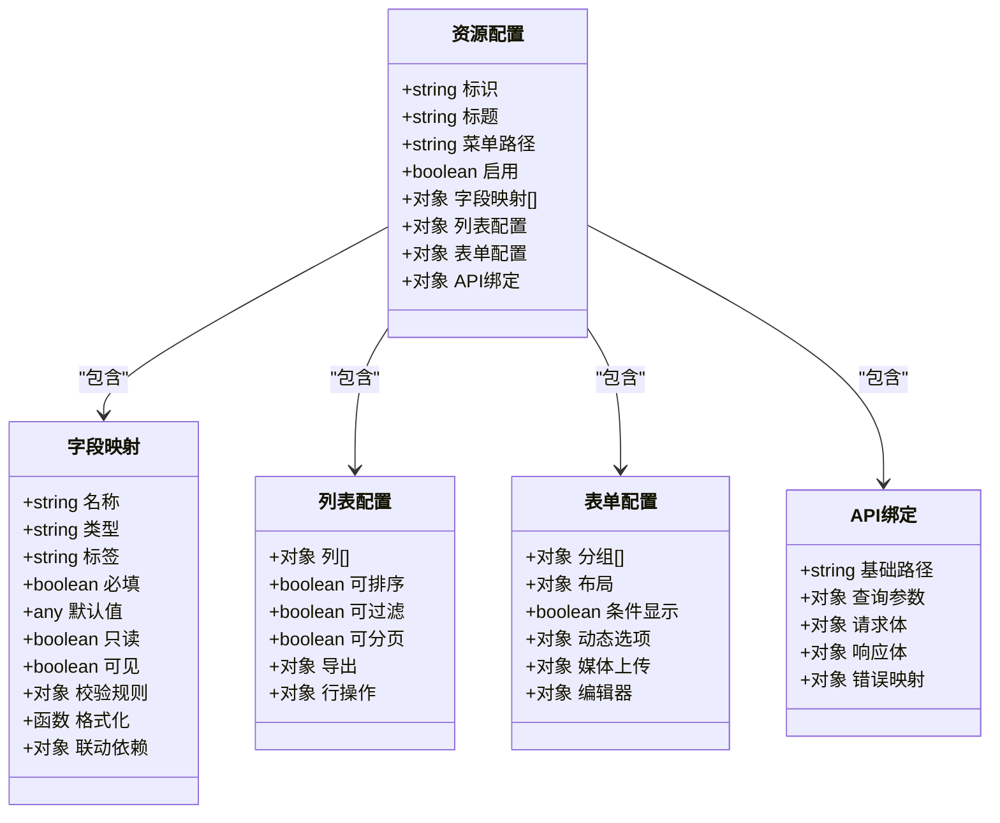
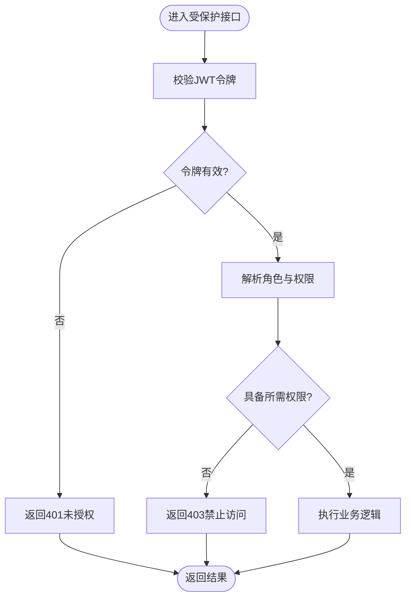
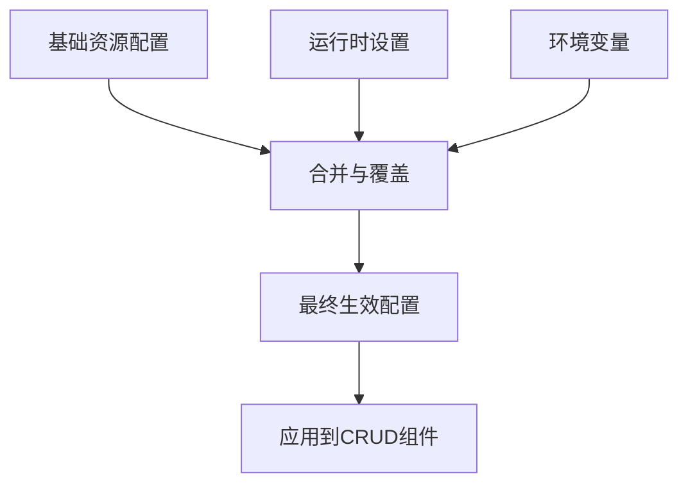
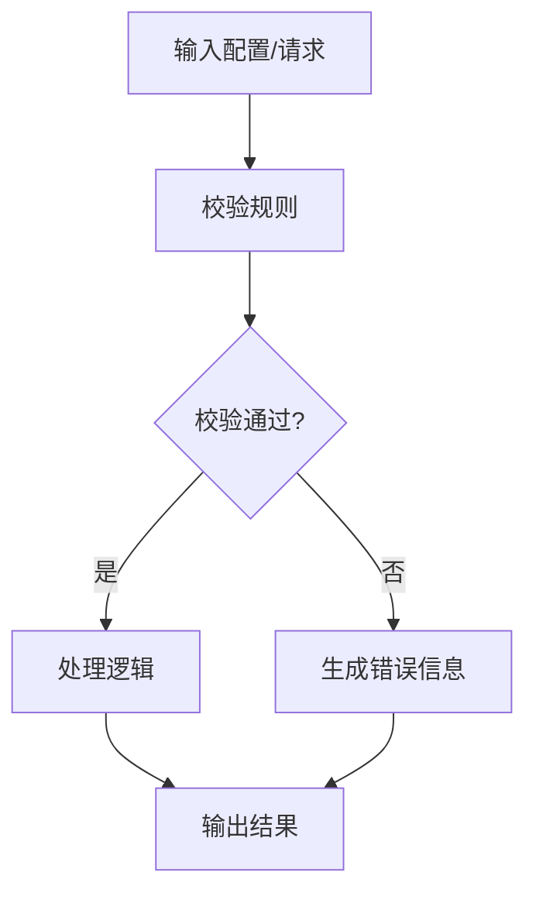
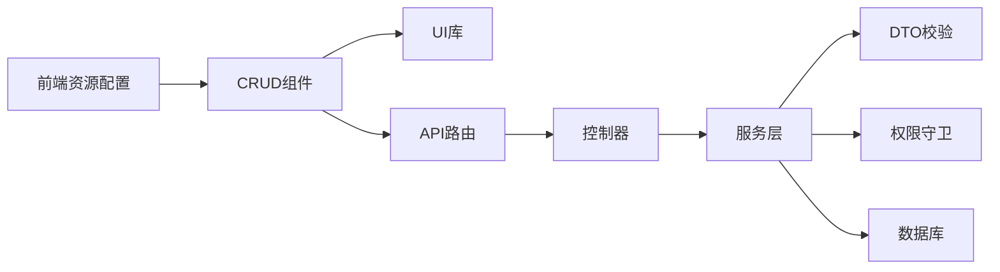

# CRUD配置系统

<cite>
**本文档引用的文件**   
- [apps/admin/src/components/crud/config.ts](file://apps/admin/src/components/crud/config.ts)
- [apps/admin/src/components/crud/ResourceEditor.tsx](file://apps/admin/src/components/crud/ResourceEditor.tsx)
- [apps/admin/src/components/crud/ResourceForm.tsx](file://apps/admin/src/components/crud/ResourceForm.tsx)
- [apps/admin/src/components/crud/ResourceListView.tsx](file://apps/admin/src/components/crud/ResourceListView.tsx)
- [apps/admin/src/features/resources/blog.tsx](file://apps/admin/src/features/resources/blog.tsx)
- [apps/admin/src/features/resources/customers.tsx](file://apps/admin/src/features/resources/customers.tsx)
- [apps/admin/src/features/resources/documents.tsx](file://apps/admin/src/features/resources/documents.tsx)
- [apps/admin/src/features/resources/news.tsx](file://apps/admin/src/features/resources/news.tsx)
- [apps/api/src/access/permissions.ts](file://apps/api/src/access/permissions.ts)
- [apps/api/src/auth/guards/jwt-auth.guard.ts](file://apps/api/src/auth/guards/jwt-auth.guard.ts)
- [apps/api/src/common/filters/http-exception.filter.ts](file://apps/api/src/common/filters/http-exception.filter.ts)
- [apps/api/src/settings/settings.schema.ts](file://apps/api/src/settings/settings.schema.ts)
- [apps/api/src/settings/settings.service.ts](file://apps/api/src/settings/settings.service.ts)
- [apps/api/src/prisma/schema.prisma](file://apps/api/src/prisma/schema.prisma)
</cite>

## 目录
1. [简介](#简介)
2. [项目结构](#项目结构)
3. [核心组件](#核心组件)
4. [架构总览](#架构总览)
5. [详细组件分析](#详细组件分析)
6. [依赖关系分析](#依赖关系分析)
7. [性能考虑](#性能考虑)
8. [故障排查指南](#故障排查指南)
9. [结论](#结论)
10. [附录](#附录)

## 简介
本文件面向CRUD配置系统的开发者与运维人员，系统化说明配置文件的结构与语法、资源定义、字段映射、权限控制与API接口绑定，并解释配置继承、动态配置与环境变量支持。同时提供配置验证、错误提示与调试工具的使用建议，以及常见业务场景的配置模板与最佳实践。

## 项目结构
CRUD配置系统由前端管理端（Next.js）与后端服务（NestJS）两部分组成：
- 前端通过统一的CRUD组件与资源配置文件，声明式地生成列表、表单、编辑器等界面，并自动绑定对应的API。
- 后端通过控制器、服务、DTO与权限守卫，实现数据访问、校验、鉴权与审计。

图表来源
- [apps/admin/src/components/crud/config.ts](file://apps/admin/src/components/crud/config.ts)
- [apps/admin/src/components/crud/ResourceEditor.tsx](file://apps/admin/src/components/crud/ResourceEditor.tsx)
- [apps/admin/src/components/crud/ResourceForm.tsx](file://apps/admin/src/components/crud/ResourceForm.tsx)
- [apps/admin/src/components/crud/ResourceListView.tsx](file://apps/admin/src/components/crud/ResourceListView.tsx)
- [apps/api/src/auth/guards/jwt-auth.guard.ts](file://apps/api/src/auth/guards/jwt-auth.guard.ts)
- [apps/api/src/prisma/schema.prisma](file://apps/api/src/prisma/schema.prisma)

章节来源
- [apps/admin/src/components/crud/config.ts](file://apps/admin/src/components/crud/config.ts)
- [apps/admin/src/components/crud/ResourceEditor.tsx](file://apps/admin/src/components/crud/ResourceEditor.tsx)
- [apps/admin/src/components/crud/ResourceForm.tsx](file://apps/admin/src/components/crud/ResourceForm.tsx)
- [apps/admin/src/components/crud/ResourceListView.tsx](file://apps/admin/src/components/crud/ResourceListView.tsx)
- [apps/api/src/auth/guards/jwt-auth.guard.ts](file://apps/api/src/auth/guards/jwt-auth.guard.ts)
- [apps/api/src/prisma/schema.prisma](file://apps/api/src/prisma/schema.prisma)

## 核心组件
- 资源配置文件：以模块化的方式定义资源名称、标题、列表字段、表单字段、编辑器、排序过滤、分页、权限与API路径等。
- CRUD通用组件：
  - ResourceListView：渲染表格、搜索、筛选、分页、批量操作。
  - ResourceForm：根据字段配置动态生成表单，包含类型化输入、校验规则与联动逻辑。
  - ResourceEditor：富文本或Markdown编辑器的集成与预览。
- 权限与鉴权：基于JWT的认证与角色/权限控制，结合装饰器在控制器层进行细粒度授权。
- 配置与设置：集中式的设置项管理与Schema校验，支持默认值与运行时覆盖。

章节来源
- [apps/admin/src/components/crud/ResourceListView.tsx](file://apps/admin/src/components/crud/ResourceListView.tsx)
- [apps/admin/src/components/crud/ResourceForm.tsx](file://apps/admin/src/components/crud/ResourceForm.tsx)
- [apps/admin/src/components/crud/ResourceEditor.tsx](file://apps/admin/src/components/crud/ResourceEditor.tsx)
- [apps/api/src/auth/guards/jwt-auth.guard.ts](file://apps/api/src/auth/guards/jwt-auth.guard.ts)
- [apps/api/src/settings/settings.schema.ts](file://apps/api/src/settings/settings.schema.ts)
- [apps/api/src/settings/settings.service.ts](file://apps/api/src/settings/settings.service.ts)

## 架构总览
CRUD配置系统采用“配置驱动”的前端与“契约驱动”的后端协作模式：
- 前端通过资源配置文件描述UI与交互行为，CRUD组件负责渲染与事件处理。
- 后端通过控制器暴露REST API，服务层封装业务逻辑，DTO负责请求体校验，权限守卫确保访问安全。
- 数据库模型通过Prisma定义，前后端通过一致的字段命名与类型约定进行对接。

图表来源
- [apps/admin/src/components/crud/ResourceListView.tsx](file://apps/admin/src/components/crud/ResourceListView.tsx)
- [apps/admin/src/components/crud/ResourceForm.tsx](file://apps/admin/src/components/crud/ResourceForm.tsx)
- [apps/api/src/auth/guards/jwt-auth.guard.ts](file://apps/api/src/auth/guards/jwt-auth.guard.ts)
- [apps/api/src/prisma/schema.prisma](file://apps/api/src/prisma/schema.prisma)

## 详细组件分析

### 资源配置文件与字段映射
- 资源定义：包括资源标识、显示名称、菜单路径、是否启用、是否可搜索、默认排序等。
- 字段映射：为每个字段指定类型（字符串、数字、布尔、日期、枚举、关联等）、标签、占位符、必填、默认值、只读、可见性、校验规则、格式化函数、联动依赖等。
- 列表视图：列名、宽度、排序、过滤、聚合、导出、行操作（查看、编辑、删除）。
- 表单视图：分组、布局、条件显示、动态选项、上传媒体、富文本编辑器。
- API绑定：基础路径、查询参数、请求体结构、响应结构、错误码映射。

图表来源
- [apps/admin/src/components/crud/config.ts](file://apps/admin/src/components/crud/config.ts)
- [apps/admin/src/features/resources/blog.tsx](file://apps/admin/src/features/resources/blog.tsx)
- [apps/admin/src/features/resources/customers.tsx](file://apps/admin/src/features/resources/customers.tsx)
- [apps/admin/src/features/resources/documents.tsx](file://apps/admin/src/features/resources/documents.tsx)
- [apps/admin/src/features/resources/news.tsx](file://apps/admin/src/features/resources/news.tsx)

章节来源
- [apps/admin/src/components/crud/config.ts](file://apps/admin/src/components/crud/config.ts)
- [apps/admin/src/features/resources/blog.tsx](file://apps/admin/src/features/resources/blog.tsx)
- [apps/admin/src/features/resources/customers.tsx](file://apps/admin/src/features/resources/customers.tsx)
- [apps/admin/src/features/resources/documents.tsx](file://apps/admin/src/features/resources/documents.tsx)
- [apps/admin/src/features/resources/news.tsx](file://apps/admin/src/features/resources/news.tsx)

### 权限控制与API接口绑定
- 权限模型：基于角色与资源的权限矩阵，支持细粒度的操作级控制（创建、读取、更新、删除、导出、审核等）。
- 鉴权流程：JWT令牌校验、角色解析、权限检查，未授权时返回标准错误。
- API绑定：资源配置文件中的API路径与后端控制器路由一致，请求体与DTO结构对齐，响应体与前端字段映射一致。

图表来源
- [apps/api/src/auth/guards/jwt-auth.guard.ts](file://apps/api/src/auth/guards/jwt-auth.guard.ts)
- [apps/api/src/access/permissions.ts](file://apps/api/src/access/permissions.ts)

章节来源
- [apps/api/src/auth/guards/jwt-auth.guard.ts](file://apps/api/src/auth/guards/jwt-auth.guard.ts)
- [apps/api/src/access/permissions.ts](file://apps/api/src/access/permissions.ts)

### 配置继承、动态配置与环境变量支持
- 配置继承：基础资源配置可被具体资源覆盖，避免重复定义；支持字段级覆盖与扩展。
- 动态配置：运行时从设置中心加载配置，支持热更新与多环境切换。
- 环境变量：敏感信息与部署相关配置通过环境变量注入，保证安全与灵活性。

章节来源
- [apps/api/src/settings/settings.schema.ts](file://apps/api/src/settings/settings.schema.ts)
- [apps/api/src/settings/settings.service.ts](file://apps/api/src/settings/settings.service.ts)

### 配置验证、错误提示与调试工具
- 配置验证：前端对资源配置文件进行结构校验，缺失必填字段或类型不匹配时给出明确提示。
- 错误提示：统一错误过滤器将后端异常转换为标准格式，前端展示友好消息。
- 调试工具：网络请求日志、表单校验状态、权限诊断面板，帮助快速定位问题。

章节来源
- [apps/api/src/common/filters/http-exception.filter.ts](file://apps/api/src/common/filters/http-exception.filter.ts)

## 依赖关系分析
- 前端依赖：资源配置文件驱动CRUD组件，组件依赖UI库与状态管理。
- 后端依赖：控制器依赖服务，服务依赖DTO与权限模块，最终访问数据库。
- 外部依赖：认证服务、存储、第三方集成等通过适配器接入。

图表来源
- [apps/admin/src/components/crud/config.ts](file://apps/admin/src/components/crud/config.ts)
- [apps/api/src/prisma/schema.prisma](file://apps/api/src/prisma/schema.prisma)

章节来源
- [apps/admin/src/components/crud/config.ts](file://apps/admin/src/components/crud/config.ts)
- [apps/api/src/prisma/schema.prisma](file://apps/api/src/prisma/schema.prisma)

## 性能考虑
- 列表分页与懒加载：合理设置每页条数，避免一次性加载大量数据。
- 字段按需渲染：仅渲染可见字段，减少DOM节点与内存占用。
- 缓存策略：对静态配置与热点数据进行缓存，降低重复请求。
- 后端优化：使用索引、批量操作、异步任务提升吞吐。

## 故障排查指南
- 常见问题：
  - 权限不足：检查JWT令牌与角色权限配置。
  - 字段映射错误：核对前后端字段命名与类型一致性。
  - 配置缺失：确认资源配置文件完整性与必填项。
- 调试步骤：
  - 查看网络请求与响应，确认API路径与参数。
  - 检查权限守卫日志与错误过滤器输出。
  - 使用浏览器开发者工具与后端日志定位问题。

章节来源
- [apps/api/src/common/filters/http-exception.filter.ts](file://apps/api/src/common/filters/http-exception.filter.ts)
- [apps/api/src/auth/guards/jwt-auth.guard.ts](file://apps/api/src/auth/guards/jwt-auth.guard.ts)

## 结论
CRUD配置系统通过声明式配置与通用组件，显著提升了开发效率与一致性。配合严格的权限控制与配置验证，确保了系统的安全性与稳定性。遵循最佳实践与模板，可以快速构建高质量的后台管理功能。

## 附录
- 常见业务场景配置模板：
  - 博客管理：文章列表、分类、标签、发布状态。
  - 客户管理：客户信息、联系人、跟进记录。
  - 文档管理：文档树、权限、版本控制。
  - 新闻管理：新闻条目、栏目、推荐位。
- 最佳实践：
  - 保持字段命名规范与类型一致。
  - 合理使用权限与角色，最小权限原则。
  - 配置模块化与继承，避免重复。
  - 完善错误处理与日志记录。