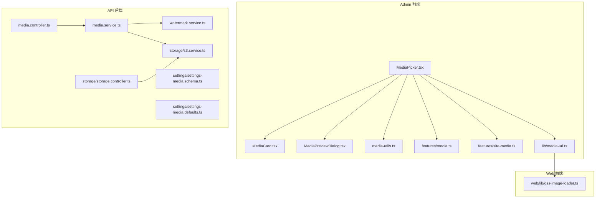
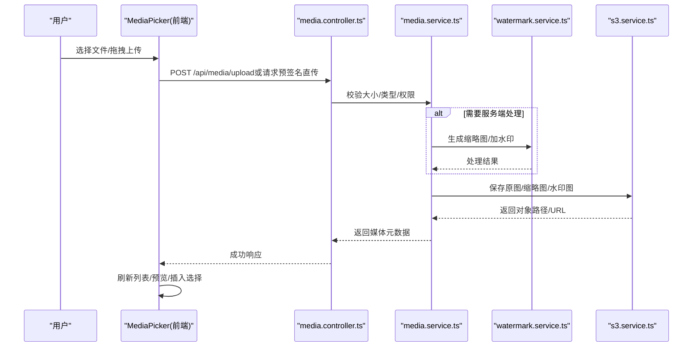
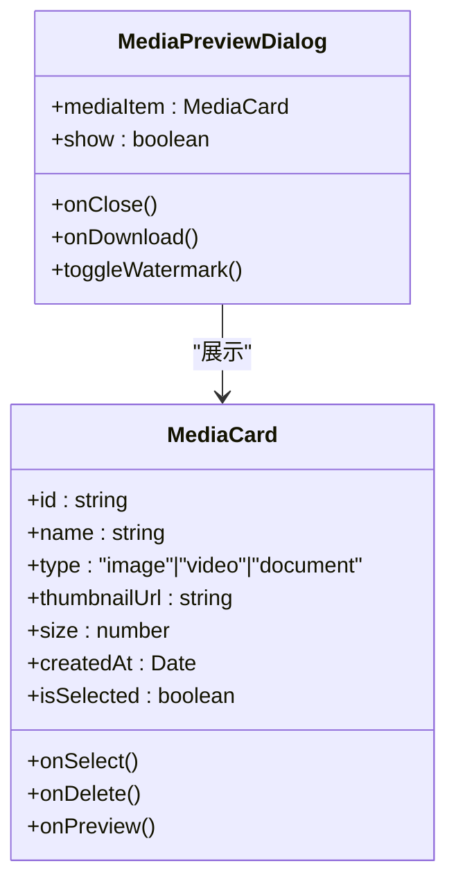
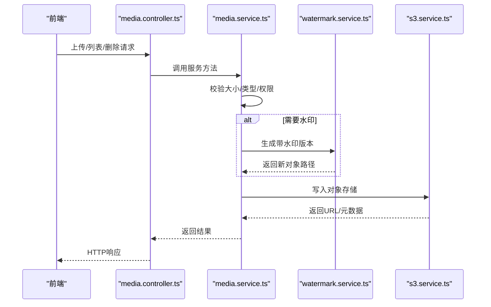
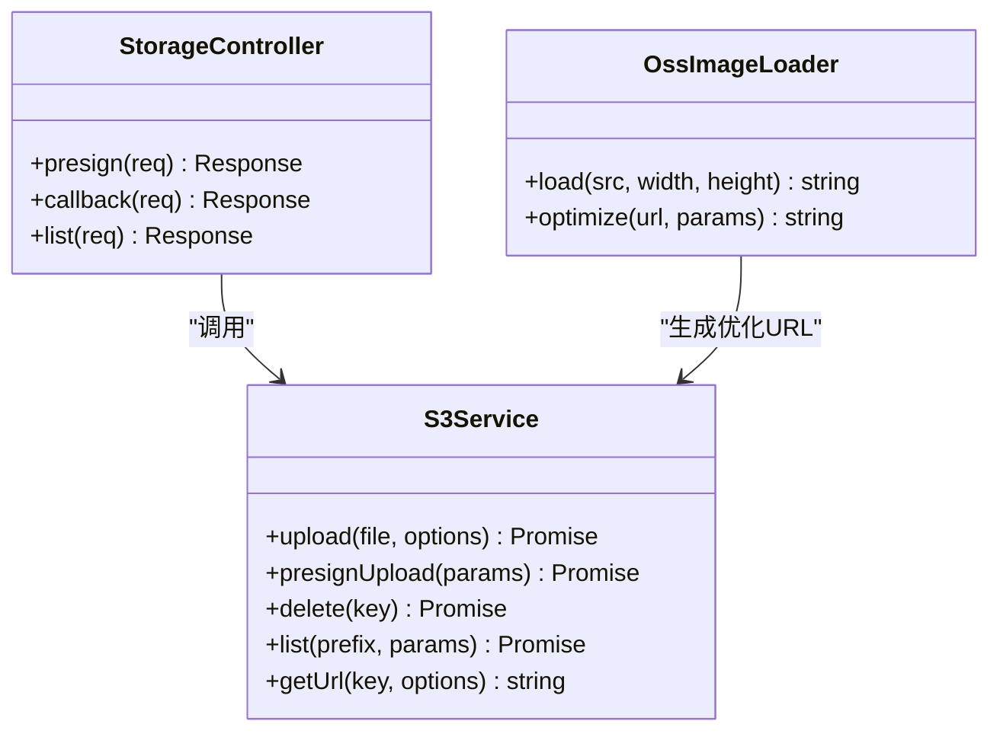
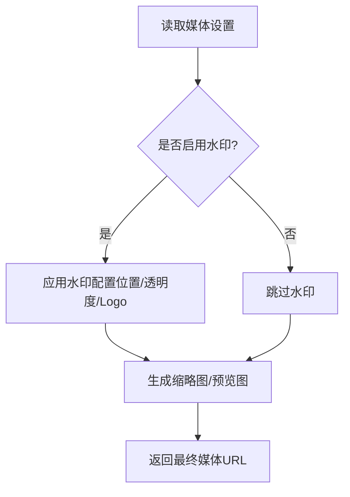
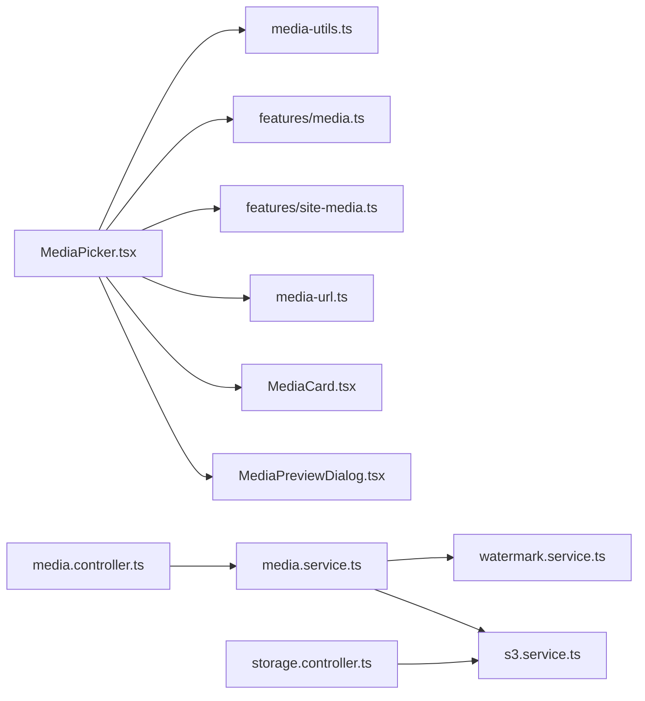

# MediaPicker媒体选择器

<cite>
**本文档引用的文件**   
- [MediaPicker.tsx](file://apps/admin/src/components/crud/MediaPicker.tsx)
- [media-utils.ts](file://apps/admin/src/components/media/media-utils.ts)
- [MediaCard.tsx](file://apps/admin/src/components/media/MediaCard.tsx)
- [MediaPreviewDialog.tsx](file://apps/admin/src/components/media/MediaPreviewDialog.tsx)
- [media.ts](file://apps/admin/src/features/media.ts)
- [site-media.ts](file://apps/admin/src/features/site-media.ts)
- [media.controller.ts](file://apps/api/src/media/media.controller.ts)
- [media.service.ts](file://apps/api/src/media/media.service.ts)
- [watermark.service.ts](file://apps/api/src/media/watermark.service.ts)
- [s3.service.ts](file://apps/api/src/storage/s3.service.ts)
- [storage.controller.ts](file://apps/api/src/storage/storage.controller.ts)
- [settings-media.schema.ts](file://apps/api/src/settings/settings-media.schema.ts)
- [settings-media.defaults.ts](file://apps/api/src/settings/settings-media.defaults.ts)
- [media-url.ts](file://apps/admin/src/lib/media-url.ts)
- [oss-image-loader.ts](file://apps/web/src/lib/oss-image-loader.ts)
</cite>

## 目录
1. [简介](#简介)
2. [项目结构](#项目结构)
3. [核心组件](#核心组件)
4. [架构总览](#架构总览)
5. [详细组件分析](#详细组件分析)
6. [依赖关系分析](#依赖关系分析)
7. [性能考虑](#性能考虑)
8. [故障排查指南](#故障排查指南)
9. [结论](#结论)
10. [附录](#附录)

## 简介
本文件面向开发者与内容运营人员，系统性说明 MediaPicker 媒体选择器的完整能力与实现方式。涵盖：
- 媒体上传、预览、选择与管理的全流程
- 支持的媒体类型（图片、视频、文档）、文件大小限制与格式校验
- 媒体库浏览、搜索过滤、批量操作
- 云存储集成（S3/MinIO/OSS）
- 自定义上传处理器、缩略图生成与水印添加的实现方法

## 项目结构
MediaPicker 涉及前端 Admin 应用、API 服务以及可选的 Web 展示端。关键目录与职责如下：
- apps/admin/src/components/crud/MediaPicker.tsx：媒体选择器 UI 与交互逻辑
- apps/admin/src/components/media/*：媒体卡片、预览弹窗与工具函数
- apps/admin/src/features/media.ts、site-media.ts：媒体相关的数据获取与配置
- apps/api/src/media/*：媒体控制器、服务、水印处理等后端能力
- apps/api/src/storage/*：对象存储（S3/MinIO/OSS）抽象与服务
- apps/api/src/settings/*：媒体设置（大小限制、允许类型、水印开关等）
- apps/admin/src/lib/media-url.ts、apps/web/src/lib/oss-image-loader.ts：媒体 URL 构建与图片加载优化

**图表来源** 
- [MediaPicker.tsx](file://apps/admin/src/components/crud/MediaPicker.tsx)
- [MediaCard.tsx](file://apps/admin/src/components/media/MediaCard.tsx)
- [MediaPreviewDialog.tsx](file://apps/admin/src/components/media/MediaPreviewDialog.tsx)
- [media-utils.ts](file://apps/admin/src/components/media/media-utils.ts)
- [media.ts](file://apps/admin/src/features/media.ts)
- [site-media.ts](file://apps/admin/src/features/site-media.ts)
- [media.controller.ts](file://apps/api/src/media/media.controller.ts)
- [media.service.ts](file://apps/api/src/media/media.service.ts)
- [watermark.service.ts](file://apps/api/src/media/watermark.service.ts)
- [s3.service.ts](file://apps/api/src/storage/s3.service.ts)
- [storage.controller.ts](file://apps/api/src/storage/storage.controller.ts)
- [settings-media.schema.ts](file://apps/api/src/settings/settings-media.schema.ts)
- [settings-media.defaults.ts](file://apps/api/src/settings/settings-media.defaults.ts)
- [media-url.ts](file://apps/admin/src/lib/media-url.ts)
- [oss-image-loader.ts](file://apps/web/src/lib/oss-image-loader.ts)

**章节来源**
- [MediaPicker.tsx](file://apps/admin/src/components/crud/MediaPicker.tsx)
- [media.controller.ts](file://apps/api/src/media/media.controller.ts)
- [media.service.ts](file://apps/api/src/media/media.service.ts)
- [s3.service.ts](file://apps/api/src/storage/s3.service.ts)
- [settings-media.schema.ts](file://apps/api/src/settings/settings-media.schema.ts)
- [settings-media.defaults.ts](file://apps/api/src/settings/settings-media.defaults.ts)
- [media-url.ts](file://apps/admin/src/lib/media-url.ts)
- [oss-image-loader.ts](file://apps/web/src/lib/oss-image-loader.ts)

## 核心组件
- MediaPicker（选择器）：提供拖拽/点击上传、列表浏览、搜索过滤、多选、删除、预览、插入到编辑器或表单字段等能力。
- MediaCard（卡片）：渲染单条媒体信息（缩略图、名称、类型、尺寸、时间），支持选中状态与快捷操作。
- MediaPreviewDialog（预览弹窗）：大图/视频播放、元数据查看、下载、加水印预览等。
- media-utils（工具）：类型判断、大小格式化、MIME 校验、文件名清洗、URL 构造辅助。
- features/media.ts、site-media.ts：封装媒体列表查询、分页、筛选、上传进度、错误提示等。
- API media.controller.ts、media.service.ts：上传接口、列表接口、删除接口、元数据更新、水印处理入口。
- storage/s3.service.ts：统一对象存储访问（S3/MinIO/OSS），分片上传、预签名、直传、回调。
- settings 媒体配置：最大文件大小、允许 MIME/扩展名、是否启用水印、缩略图策略等。

**章节来源**
- [MediaPicker.tsx](file://apps/admin/src/components/crud/MediaPicker.tsx)
- [MediaCard.tsx](file://apps/admin/src/components/media/MediaCard.tsx)
- [MediaPreviewDialog.tsx](file://apps/admin/src/components/media/MediaPreviewDialog.tsx)
- [media-utils.ts](file://apps/admin/src/components/media/media-utils.ts)
- [media.ts](file://apps/admin/src/features/media.ts)
- [site-media.ts](file://apps/admin/src/features/site-media.ts)
- [media.controller.ts](file://apps/api/src/media/media.controller.ts)
- [media.service.ts](file://apps/api/src/media/media.service.ts)
- [s3.service.ts](file://apps/api/src/storage/s3.service.ts)
- [settings-media.schema.ts](file://apps/api/src/settings/settings-media.schema.ts)
- [settings-media.defaults.ts](file://apps/api/src/settings/settings-media.defaults.ts)

## 架构总览
MediaPicker 采用前后端分离架构：前端通过 REST/直传协议与 API 交互，API 层负责鉴权、校验、转码/水印、缩略图生成与对象存储操作。

**图表来源** 
- [media.controller.ts](file://apps/api/src/media/media.controller.ts)
- [media.service.ts](file://apps/api/src/media/media.service.ts)
- [watermark.service.ts](file://apps/api/src/media/watermark.service.ts)
- [s3.service.ts](file://apps/api/src/storage/s3.service.ts)

## 详细组件分析

### MediaPicker 组件（上传、预览、选择与管理）
- 功能要点
  - 支持图片、视频、文档三类媒体；根据类型显示不同卡片与预览行为
  - 支持拖拽与点击上传，实时进度反馈，失败重试
  - 列表分页、关键词搜索、按类型/时间排序、多选与批量删除
  - 选中后回调给上层（如富文本插入、表单字段赋值）
  - 预览大图/视频播放，支持下载、加水印预览
- 交互流程
  - 选择文件 -> 校验（类型/大小）-> 上传（直传或中转）-> 成功后加入本地列表并刷新
  - 搜索/筛选 -> 调用媒体列表接口 -> 渲染卡片
  - 多选 -> 批量删除/移动（如有）-> 同步后端
- 关键实现点
  - 使用 media-utils 进行类型与大小校验
  - 使用 features/media.ts 发起 API 请求与状态管理
  - 使用 MediaCard 与 MediaPreviewDialog 完成展示与交互

**图表来源** 
- [MediaPicker.tsx](file://apps/admin/src/components/crud/MediaPicker.tsx)
- [media-utils.ts](file://apps/admin/src/components/media/media-utils.ts)
- [media.ts](file://apps/admin/src/features/media.ts)

**章节来源**
- [MediaPicker.tsx](file://apps/admin/src/components/crud/MediaPicker.tsx)
- [media-utils.ts](file://apps/admin/src/components/media/media-utils.ts)
- [media.ts](file://apps/admin/src/features/media.ts)

### 媒体卡片与预览（MediaCard、MediaPreviewDialog）
- MediaCard：展示缩略图、名称、类型、尺寸、创建时间；支持选中高亮、右键菜单（预览/删除/重命名）。
- MediaPreviewDialog：图片放大、视频播放器、文档在线预览（如 PDF）、下载按钮、水印预览开关。

**图表来源** 
- [MediaCard.tsx](file://apps/admin/src/components/media/MediaCard.tsx)
- [MediaPreviewDialog.tsx](file://apps/admin/src/components/media/MediaPreviewDialog.tsx)

**章节来源**
- [MediaCard.tsx](file://apps/admin/src/components/media/MediaCard.tsx)
- [MediaPreviewDialog.tsx](file://apps/admin/src/components/media/MediaPreviewDialog.tsx)

### 媒体工具与 URL 构建（media-utils、media-url）
- media-utils：类型判断（image/video/document）、MIME 校验、大小格式化、文件名清洗、缩略图 URL 拼接规则。
- media-url：统一媒体 URL 构建（含域名、路径、参数），适配 CDN/直链/签名链接。

**图表来源** 
- [media-utils.ts](file://apps/admin/src/components/media/media-utils.ts)
- [media-url.ts](file://apps/admin/src/lib/media-url.ts)

**章节来源**
- [media-utils.ts](file://apps/admin/src/components/media/media-utils.ts)
- [media-url.ts](file://apps/admin/src/lib/media-url.ts)

### 后端媒体服务（media.controller、media.service、watermark.service）
- media.controller：定义上传、列表、删除、元数据更新等路由，鉴权与参数校验。
- media.service：业务编排（校验、存储、缩略图、水印、索引更新），事务与异常处理。
- watermark.service：为图片/视频帧添加水印（位置、透明度、字体、Logo），支持异步任务。

**图表来源** 
- [media.controller.ts](file://apps/api/src/media/media.controller.ts)
- [media.service.ts](file://apps/api/src/media/media.service.ts)
- [watermark.service.ts](file://apps/api/src/media/watermark.service.ts)
- [s3.service.ts](file://apps/api/src/storage/s3.service.ts)

**章节来源**
- [media.controller.ts](file://apps/api/src/media/media.controller.ts)
- [media.service.ts](file://apps/api/src/media/media.service.ts)
- [watermark.service.ts](file://apps/api/src/media/watermark.service.ts)

### 对象存储集成（S3/MinIO/OSS）
- s3.service：统一 S3 兼容接口，支持直传（预签名）、服务端上传、分片上传、回调、删除、列出对象。
- storage.controller：暴露存储相关接口（如预签名上传、直传回调），供前端直接对接。
- oss-image-loader：Web 端图片加载优化（自适应尺寸、懒加载、CDN 参数）。

**图表来源** 
- [s3.service.ts](file://apps/api/src/storage/s3.service.ts)
- [storage.controller.ts](file://apps/api/src/storage/storage.controller.ts)
- [oss-image-loader.ts](file://apps/web/src/lib/oss-image-loader.ts)

**章节来源**
- [s3.service.ts](file://apps/api/src/storage/s3.service.ts)
- [storage.controller.ts](file://apps/api/src/storage/storage.controller.ts)
- [oss-image-loader.ts](file://apps/web/src/lib/oss-image-loader.ts)

### 媒体设置与校验（settings-media.schema、settings-media.defaults）
- schema：定义媒体配置项（最大大小、允许类型、水印开关、缩略图尺寸等）及校验规则。
- defaults：默认值（如默认最大大小、默认水印样式、默认缩略图策略）。

**图表来源** 
- [settings-media.schema.ts](file://apps/api/src/settings/settings-media.schema.ts)
- [settings-media.defaults.ts](file://apps/api/src/settings/settings-media.defaults.ts)

**章节来源**
- [settings-media.schema.ts](file://apps/api/src/settings/settings-media.schema.ts)
- [settings-media.defaults.ts](file://apps/api/src/settings/settings-media.defaults.ts)

## 依赖关系分析
- 前端依赖
  - MediaPicker 依赖 media-utils、features/media.ts、features/site-media.ts、media-url.ts
  - MediaCard、MediaPreviewDialog 作为展示子组件被 MediaPicker 引用
- 后端依赖
  - media.controller 依赖 media.service
  - media.service 依赖 watermark.service、s3.service
  - storage.controller 依赖 s3.service
- 外部依赖
  - 对象存储服务（S3/MinIO/OSS）
  - CDN/域名解析（用于媒体 URL 与图片优化）

**图表来源** 
- [MediaPicker.tsx](file://apps/admin/src/components/crud/MediaPicker.tsx)
- [media-utils.ts](file://apps/admin/src/components/media/media-utils.ts)
- [media.ts](file://apps/admin/src/features/media.ts)
- [site-media.ts](file://apps/admin/src/features/site-media.ts)
- [media-url.ts](file://apps/admin/src/lib/media-url.ts)
- [MediaCard.tsx](file://apps/admin/src/components/media/MediaCard.tsx)
- [MediaPreviewDialog.tsx](file://apps/admin/src/components/media/MediaPreviewDialog.tsx)
- [media.controller.ts](file://apps/api/src/media/media.controller.ts)
- [media.service.ts](file://apps/api/src/media/media.service.ts)
- [watermark.service.ts](file://apps/api/src/media/watermark.service.ts)
- [s3.service.ts](file://apps/api/src/storage/s3.service.ts)
- [storage.controller.ts](file://apps/api/src/storage/storage.controller.ts)

**章节来源**
- [MediaPicker.tsx](file://apps/admin/src/components/crud/MediaPicker.tsx)
- [media.controller.ts](file://apps/api/src/media/media.controller.ts)
- [media.service.ts](file://apps/api/src/media/media.service.ts)
- [s3.service.ts](file://apps/api/src/storage/s3.service.ts)

## 性能考虑
- 上传性能
  - 优先使用预签名直传减少服务器带宽压力
  - 大文件分片上传与断点续传
  - 并发控制与队列管理，避免阻塞 UI
- 预览与渲染
  - 缩略图按需生成与缓存（CDN）
  - 图片懒加载与自适应尺寸（OssImageLoader）
  - 视频使用流式播放与封面图
- 存储与网络
  - 合理分区与命名规范，提升列举效率
  - 开启 CDN 缓存与压缩
  - 使用签名 URL 缩短有效期，降低泄露风险

[本节为通用指导，无需特定文件引用]

## 故障排查指南
- 上传失败
  - 检查类型与大小限制（schema/defaults）
  - 确认对象存储凭证与 CORS 配置
  - 查看直传回调与签名有效性
- 预览异常
  - 检查媒体 URL 构建（media-url）与 CDN 可达性
  - 验证缩略图是否生成成功
- 水印问题
  - 确认水印配置（位置、透明度、字体）
  - 检查水印资源（Logo）可访问性与格式
- 列表加载慢
  - 分页与筛选参数是否正确
  - 对象存储前缀与分页游标是否合理

**章节来源**
- [settings-media.schema.ts](file://apps/api/src/settings/settings-media.schema.ts)
- [settings-media.defaults.ts](file://apps/api/src/settings/settings-media.defaults.ts)
- [media-url.ts](file://apps/admin/src/lib/media-url.ts)
- [s3.service.ts](file://apps/api/src/storage/s3.service.ts)

## 结论
MediaPicker 提供了完整的媒体选择与管理能力，覆盖上传、预览、选择、批量操作与云存储集成。通过模块化设计与清晰的职责划分，既满足内容运营的高效需求，也为开发者提供了良好的扩展点（自定义处理器、缩略图、水印）。建议在生产环境结合 CDN、分片上传与合理的缓存策略，以获得最佳的用户体验与系统性能。

[本节为总结，无需特定文件引用]

## 附录
- 支持的媒体类型
  - 图片：JPEG、PNG、WebP、GIF（静态）
  - 视频：MP4、WebM、MOV（视平台支持）
  - 文档：PDF、DOCX、XLSX、TXT（在线预览取决于后端能力）
- 文件大小限制
  - 由 settings-media.schema/defaults 配置，建议区分图片/视频/文档上限
- 格式验证
  - 前端 MIME/扩展名校验 + 后端二次校验，确保安全性
- 批量操作
  - 多选删除、批量移动（若实现）、批量打标签（可扩展）
- 自定义上传处理器
  - 在 media.service 中扩展校验与转码逻辑，或替换 s3.service 的上传实现
- 缩略图生成
  - 在服务端生成多尺寸缩略图，配合 CDN 缓存
- 水印添加
  - 通过 watermark.service 配置水印样式与位置，支持图片与视频帧

[本节为补充说明，无需特定文件引用]