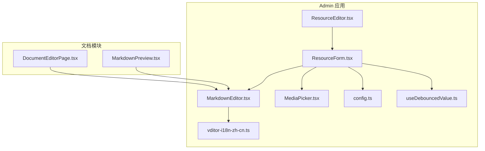
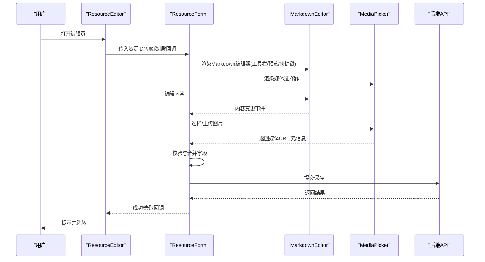
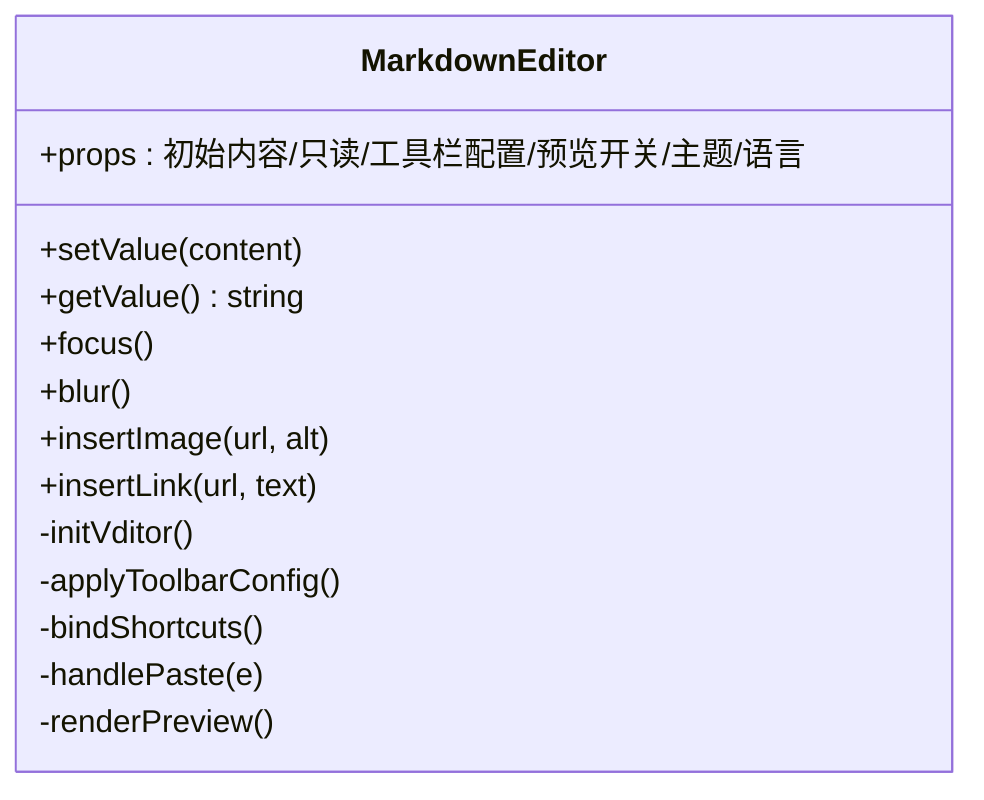
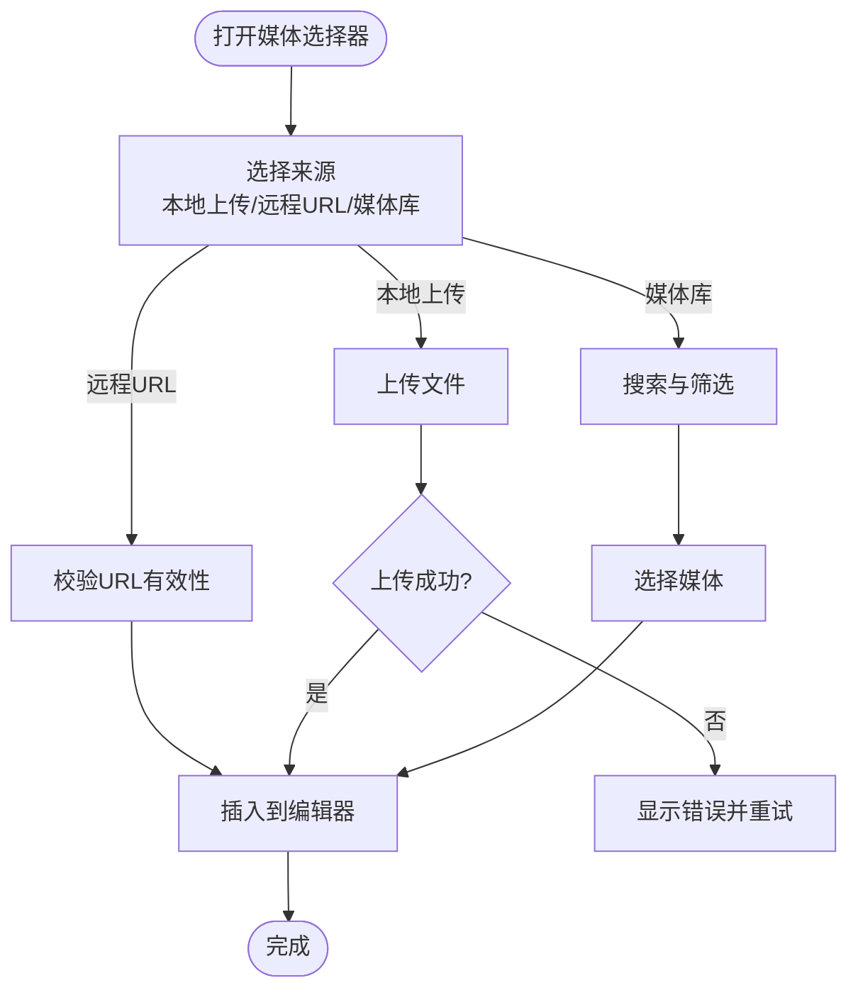
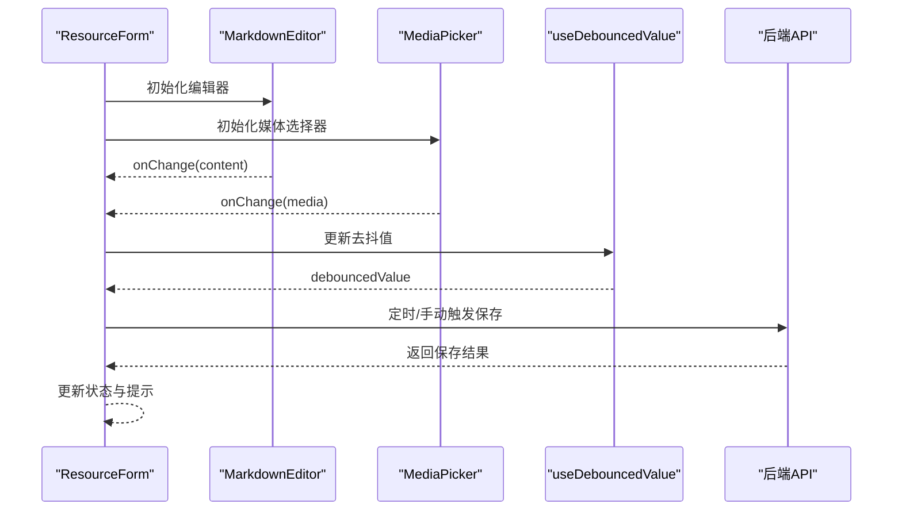
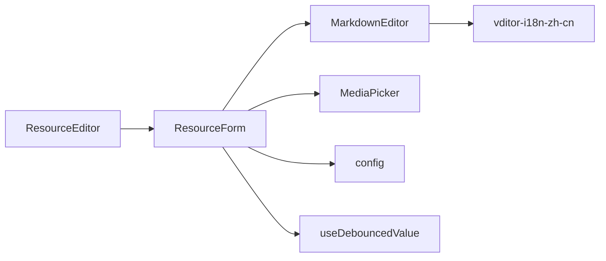

# ResourceEditor编辑器

<cite>
**本文引用的文件**   
- [ResourceEditor.tsx](file://apps/admin/src/components/crud/ResourceEditor.tsx)
- [MarkdownEditor.tsx](file://apps/admin/src/components/crud/MarkdownEditor.tsx)
- [MediaPicker.tsx](file://apps/admin/src/components/crud/MediaPicker.tsx)
- [ResourceForm.tsx](file://apps/admin/src/components/crud/ResourceForm.tsx)
- [config.ts](file://apps/admin/src/components/crud/config.ts)
- [vditor-i18n-zh-cn.ts](file://apps/admin/src/lib/vditor-i18n-zh-cn.ts)
- [DocumentEditorPage.tsx](file://apps/admin/src/components/documents/DocumentEditorPage.tsx)
- [MarkdownPreview.tsx](file://apps/admin/src/components/documents/MarkdownPreview.tsx)
- [useDebouncedValue.ts](file://apps/admin/src/hooks/useDebouncedValue.ts)
</cite>

## 目录
1. [简介](#简介)
2. [项目结构](#项目结构)
3. [核心组件](#核心组件)
4. [架构总览](#架构总览)
5. [详细组件分析](#详细组件分析)
6. [依赖关系分析](#依赖关系分析)
7. [性能考量](#性能考量)
8. [故障排查指南](#故障排查指南)
9. [结论](#结论)
10. [附录](#附录)

## 简介
本文件面向“ResourceEditor”统一资源编辑器的实现与使用，聚焦以下目标：
- 统一编辑器封装的实现原理：以 MarkdownEditor 为核心，结合 MediaPicker、表单与配置系统，提供一致的编辑体验。
- Markdown 编辑器集成：工具栏配置、内容格式化、国际化与主题适配。
- 编辑器状态管理：受控值、去抖保存、自动保存策略与版本控制思路。
- 协作编辑能力：基于 WebSocket/Presence 的协同编辑扩展点（文档模块）。
- 自定义插件开发：工具栏按钮、快捷键、预览增强等扩展方式。
- 内容导出/导入/转换：从 Markdown 到 HTML、媒体资源处理与批量导入流程。

## 项目结构
ResourceEditor 位于 admin 应用的 crud 组件层，围绕“资源编辑”这一通用场景，将表单、编辑器、媒体选择与业务配置解耦。

图表来源
- [ResourceEditor.tsx](file://apps/admin/src/components/crud/ResourceEditor.tsx)
- [ResourceForm.tsx](file://apps/admin/src/components/crud/ResourceForm.tsx)
- [MarkdownEditor.tsx](file://apps/admin/src/components/crud/MarkdownEditor.tsx)
- [MediaPicker.tsx](file://apps/admin/src/components/crud/MediaPicker.tsx)
- [config.ts](file://apps/admin/src/components/crud/config.ts)
- [vditor-i18n-zh-cn.ts](file://apps/admin/src/lib/vditor-i18n-zh-cn.ts)
- [useDebouncedValue.ts](file://apps/admin/src/hooks/useDebouncedValue.ts)
- [DocumentEditorPage.tsx](file://apps/admin/src/components/documents/DocumentEditorPage.tsx)
- [MarkdownPreview.tsx](file://apps/admin/src/components/documents/MarkdownPreview.tsx)

章节来源
- [ResourceEditor.tsx](file://apps/admin/src/components/crud/ResourceEditor.tsx)
- [ResourceForm.tsx](file://apps/admin/src/components/crud/ResourceForm.tsx)
- [MarkdownEditor.tsx](file://apps/admin/src/components/crud/MarkdownEditor.tsx)
- [MediaPicker.tsx](file://apps/admin/src/components/crud/MediaPicker.tsx)
- [config.ts](file://apps/admin/src/components/crud/config.ts)
- [vditor-i18n-zh-cn.ts](file://apps/admin/src/lib/vditor-i18n-zh-cn.ts)
- [useDebouncedValue.ts](file://apps/admin/src/hooks/useDebouncedValue.ts)
- [DocumentEditorPage.tsx](file://apps/admin/src/components/documents/DocumentEditorPage.tsx)
- [MarkdownPreview.tsx](file://apps/admin/src/components/documents/MarkdownPreview.tsx)

## 核心组件
- ResourceEditor：统一入口，负责路由参数解析、权限校验、数据加载、提交与错误提示。
- ResourceForm：表单容器，聚合字段定义、校验规则、编辑器与媒体选择器，驱动保存流程。
- MarkdownEditor：基于 Vditor 的 Markdown 编辑器封装，提供工具栏、预览、快捷键、国际化与主题。
- MediaPicker：媒体选择器，支持上传、搜索、插入链接或图片。
- config：资源类型与字段映射、默认值、校验与展示配置。
- vditor-i18n-zh-cn：Vditor 中文本地化文案。
- useDebouncedValue：去抖 Hook，用于自动保存与输入优化。
- DocumentEditorPage / MarkdownPreview：文档编辑与预览页面示例，体现编辑器在业务中的使用。

章节来源
- [ResourceEditor.tsx](file://apps/admin/src/components/crud/ResourceEditor.tsx)
- [ResourceForm.tsx](file://apps/admin/src/components/crud/ResourceForm.tsx)
- [MarkdownEditor.tsx](file://apps/admin/src/components/crud/MarkdownEditor.tsx)
- [MediaPicker.tsx](file://apps/admin/src/components/crud/MediaPicker.tsx)
- [config.ts](file://apps/admin/src/components/crud/config.ts)
- [vditor-i18n-zh-cn.ts](file://apps/admin/src/lib/vditor-i18n-zh-cn.ts)
- [useDebouncedValue.ts](file://apps/admin/src/hooks/useDebouncedValue.ts)
- [DocumentEditorPage.tsx](file://apps/admin/src/components/documents/DocumentEditorPage.tsx)
- [MarkdownPreview.tsx](file://apps/admin/src/components/documents/MarkdownPreview.tsx)

## 架构总览
ResourceEditor 采用“表单容器 + 可插拔编辑器”的架构。ResourceForm 通过 config 描述字段与行为，MarkdownEditor 作为富文本能力提供者，MediaPicker 提供媒体能力，整体由 ResourceEditor 编排生命周期与数据流。

图表来源
- [ResourceEditor.tsx](file://apps/admin/src/components/crud/ResourceEditor.tsx)
- [ResourceForm.tsx](file://apps/admin/src/components/crud/ResourceForm.tsx)
- [MarkdownEditor.tsx](file://apps/admin/src/components/crud/MarkdownEditor.tsx)
- [MediaPicker.tsx](file://apps/admin/src/components/crud/MediaPicker.tsx)

## 详细组件分析

### MarkdownEditor：Markdown 编辑器封装
- 集成 Vditor，提供所见即所得与源码模式切换。
- 工具栏配置：标题、加粗、斜体、列表、代码块、链接、图片、表格等常用功能。
- 内容格式化：自动折叠空行、统一换行、粘贴清洗、图片路径规范化。
- 国际化：通过 vditor-i18n-zh-cn 注入中文文案。
- 主题定制：支持明暗主题切换与样式覆盖。
- 快捷键：支持常见 Markdown 快捷键与自定义命令绑定。
- 预览：实时预览与分屏预览，支持锚点定位。

图表来源
- [MarkdownEditor.tsx](file://apps/admin/src/components/crud/MarkdownEditor.tsx)
- [vditor-i18n-zh-cn.ts](file://apps/admin/src/lib/vditor-i18n-zh-cn.ts)

章节来源
- [MarkdownEditor.tsx](file://apps/admin/src/components/crud/MarkdownEditor.tsx)
- [vditor-i18n-zh-cn.ts](file://apps/admin/src/lib/vditor-i18n-zh-cn.ts)

### MediaPicker：媒体选择器
- 支持本地上传、远程 URL 插入、媒体库搜索。
- 图片压缩与格式转换（可选），生成缩略图与 CDN 地址。
- 与 MarkdownEditor 联动，插入图片/视频标签。

图表来源
- [MediaPicker.tsx](file://apps/admin/src/components/crud/MediaPicker.tsx)

章节来源
- [MediaPicker.tsx](file://apps/admin/src/components/crud/MediaPicker.tsx)

### ResourceForm：表单容器与数据流
- 字段定义：通过 config 声明字段类型、校验规则、默认值与展示选项。
- 编辑器集成：将 MarkdownEditor 与 MediaPicker 接入表单，统一管理值与校验。
- 提交流程：组装 payload、调用 API、处理成功/失败回调与错误提示。
- 自动保存：结合 useDebouncedValue 实现去抖保存，避免频繁请求。

图表来源
- [ResourceForm.tsx](file://apps/admin/src/components/crud/ResourceForm.tsx)
- [useDebouncedValue.ts](file://apps/admin/src/hooks/useDebouncedValue.ts)

章节来源
- [ResourceForm.tsx](file://apps/admin/src/components/crud/ResourceForm.tsx)
- [useDebouncedValue.ts](file://apps/admin/src/hooks/useDebouncedValue.ts)

### ResourceEditor：统一入口与编排
- 路由与权限：根据资源类型与权限决定可编辑字段与操作。
- 数据加载：拉取初始数据，填充表单与编辑器。
- 生命周期：创建/编辑模式切换、保存成功后的导航与刷新。
- 错误处理：网络异常、校验失败、权限不足的统一提示。

章节来源
- [ResourceEditor.tsx](file://apps/admin/src/components/crud/ResourceEditor.tsx)

### 文档编辑与预览：DocumentEditorPage 与 MarkdownPreview
- DocumentEditorPage：文档编辑页面的具体实现，集成 ResourceForm 与 MarkdownEditor。
- MarkdownPreview：Markdown 内容渲染为 HTML，支持安全过滤与样式隔离。

章节来源
- [DocumentEditorPage.tsx](file://apps/admin/src/components/documents/DocumentEditorPage.tsx)
- [MarkdownPreview.tsx](file://apps/admin/src/components/documents/MarkdownPreview.tsx)

## 依赖关系分析
- MarkdownEditor 依赖 Vditor 与国际化文案。
- ResourceForm 依赖 config 字段定义与 useDebouncedValue 去抖逻辑。
- MediaPicker 依赖媒体服务与上传接口。
- ResourceEditor 依赖路由、权限与业务 API。

图表来源
- [ResourceEditor.tsx](file://apps/admin/src/components/crud/ResourceEditor.tsx)
- [ResourceForm.tsx](file://apps/admin/src/components/crud/ResourceForm.tsx)
- [MarkdownEditor.tsx](file://apps/admin/src/components/crud/MarkdownEditor.tsx)
- [MediaPicker.tsx](file://apps/admin/src/components/crud/MediaPicker.tsx)
- [config.ts](file://apps/admin/src/components/crud/config.ts)
- [vditor-i18n-zh-cn.ts](file://apps/admin/src/lib/vditor-i18n-zh-cn.ts)
- [useDebouncedValue.ts](file://apps/admin/src/hooks/useDebouncedValue.ts)

章节来源
- [ResourceEditor.tsx](file://apps/admin/src/components/crud/ResourceEditor.tsx)
- [ResourceForm.tsx](file://apps/admin/src/components/crud/ResourceForm.tsx)
- [MarkdownEditor.tsx](file://apps/admin/src/components/crud/MarkdownEditor.tsx)
- [MediaPicker.tsx](file://apps/admin/src/components/crud/MediaPicker.tsx)
- [config.ts](file://apps/admin/src/components/crud/config.ts)
- [vditor-i18n-zh-cn.ts](file://apps/admin/src/lib/vditor-i18n-zh-cn.ts)
- [useDebouncedValue.ts](file://apps/admin/src/hooks/useDebouncedValue.ts)

## 性能考量
- 编辑器渲染：按需加载 Vditor 与预览模块，减少首屏体积。
- 去抖保存：使用 useDebouncedValue 降低保存频率，避免阻塞 UI。
- 媒体上传：支持断点续传与并发限制，提升大文件上传稳定性。
- 预览优化：懒加载长文档预览，分页或虚拟滚动。
- 缓存策略：对静态资源与常用配置进行缓存，减少重复请求。

## 故障排查指南
- 编辑器无法加载：检查 Vditor 资源是否完整引入，确认 CDN 或本地路径正确。
- 工具栏不生效：核对工具栏配置键名与 Vditor 版本兼容性。
- 自动保存无效：检查去抖时间设置与网络状态，确认 API 响应码。
- 媒体上传失败：查看上传接口 CORS、鉴权与文件大小限制。
- 预览样式错乱：确认样式隔离与安全过滤配置，避免外部 CSS 冲突。

章节来源
- [MarkdownEditor.tsx](file://apps/admin/src/components/crud/MarkdownEditor.tsx)
- [MediaPicker.tsx](file://apps/admin/src/components/crud/MediaPicker.tsx)
- [ResourceForm.tsx](file://apps/admin/src/components/crud/ResourceForm.tsx)

## 结论
ResourceEditor 通过统一的表单容器与可插拔编辑器，实现了 Markdown 编辑、媒体选择、自动保存与版本控制的完整能力。借助 config 与国际化，开发者可以快速扩展新的资源类型与编辑场景。未来可在协作编辑、插件生态与内容转换方面进一步增强。

## 附录

### 编辑器状态管理与自动保存
- 受控值：MarkdownEditor 的值由 ResourceForm 统一管理，onChange 事件同步至表单状态。
- 去抖保存：useDebouncedValue 将高频输入合并为低频保存，避免抖动与重复请求。
- 版本控制：建议在保存时携带版本号或时间戳，后端进行乐观锁或冲突检测。

章节来源
- [ResourceForm.tsx](file://apps/admin/src/components/crud/ResourceForm.tsx)
- [useDebouncedValue.ts](file://apps/admin/src/hooks/useDebouncedValue.ts)

### 协作编辑扩展点
- Presence 机制：记录当前在线用户与光标位置，用于实时协作。
- 冲突解决：基于操作转换（OT）或 CRDT 算法，保证多端一致性。
- 消息通道：通过 WebSocket 推送增量更新与用户状态。

章节来源
- [DocumentEditorPage.tsx](file://apps/admin/src/components/documents/DocumentEditorPage.tsx)

### 自定义插件开发
- 工具栏按钮：在 MarkdownEditor 中注册自定义命令，插入特定语法或组件。
- 快捷键绑定：扩展快捷键映射，提升编辑效率。
- 预览增强：在 MarkdownPreview 中注入自定义渲染器，支持数学公式、流程图等。

章节来源
- [MarkdownEditor.tsx](file://apps/admin/src/components/crud/MarkdownEditor.tsx)

### 内容导出、导入与转换
- 导出：将 Markdown 转换为 HTML、PDF 或纯文本，支持模板与样式定制。
- 导入：支持 Markdown、HTML、Word 等格式的解析与清洗。
- 转换：统一内部模型，确保不同来源内容的结构与样式一致。

章节来源
- [MarkdownPreview.tsx](file://apps/admin/src/components/documents/MarkdownPreview.tsx)
- [MediaPicker.tsx](file://apps/admin/src/components/crud/MediaPicker.tsx)