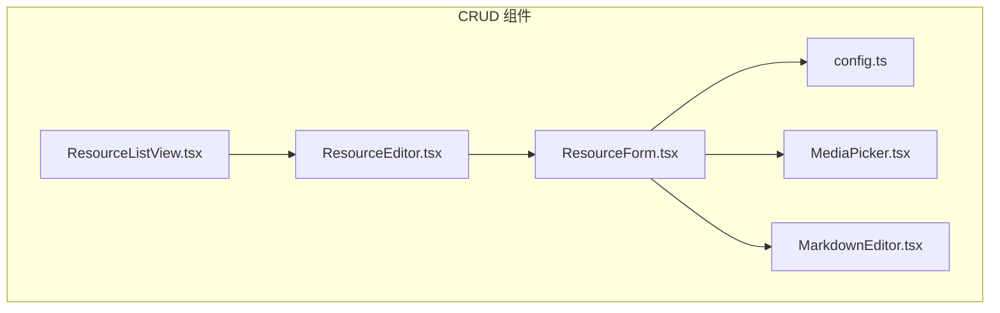
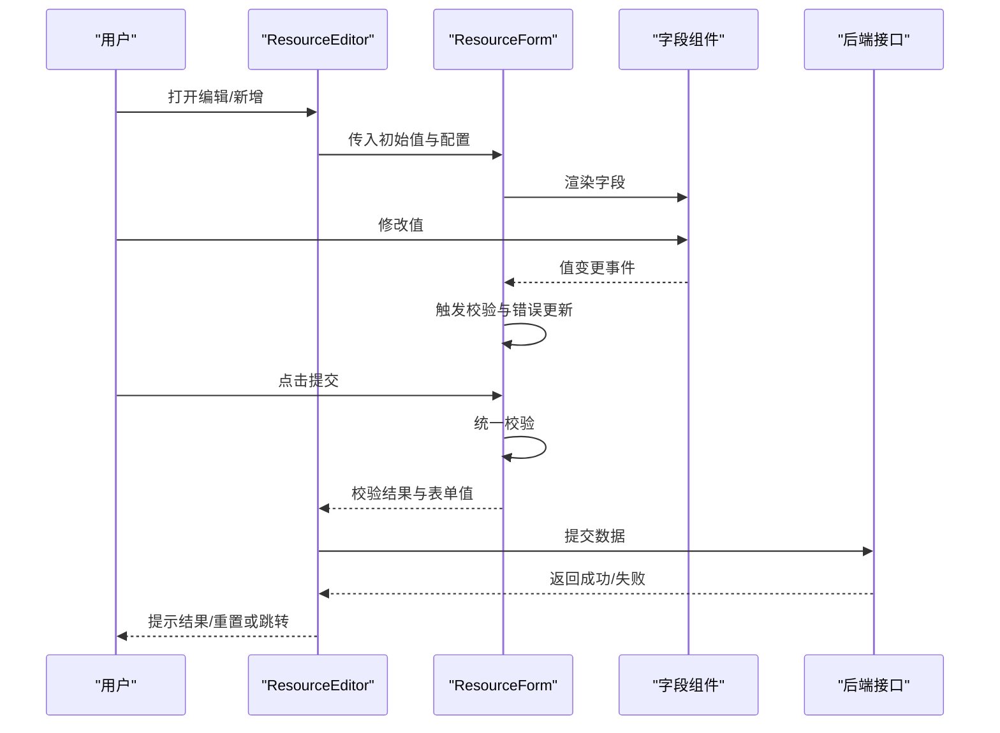
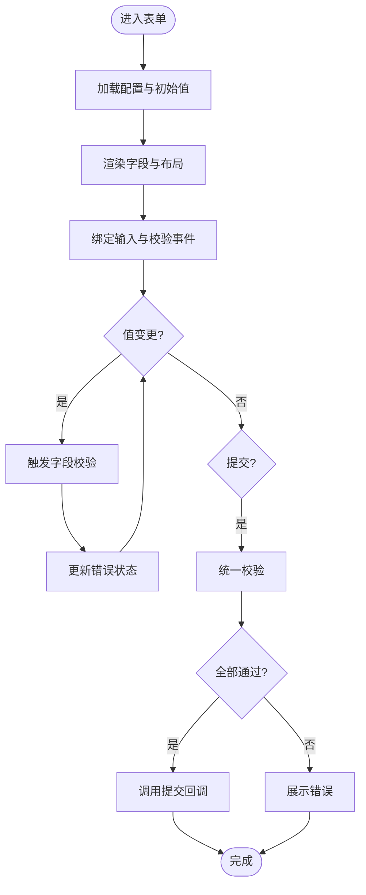
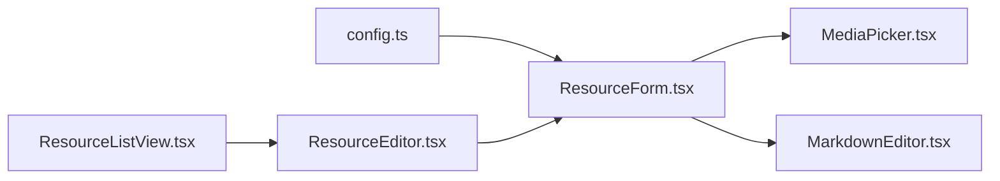

# ResourceForm表单组件

<cite>
**本文档引用的文件**   
- [ResourceForm.tsx](file://apps/admin/src/components/crud/ResourceForm.tsx)
- [config.ts](file://apps/admin/src/components/crud/config.ts)
- [ResourceEditor.tsx](file://apps/admin/src/components/crud/ResourceEditor.tsx)
- [ResourceListView.tsx](file://apps/admin/src/components/crud/ResourceListView.tsx)
- [MediaPicker.tsx](file://apps/admin/src/components/crud/MediaPicker.tsx)
- [MarkdownEditor.tsx](file://apps/admin/src/components/crud/MarkdownEditor.tsx)
</cite>

## 目录
1. [简介](#简介)
2. [项目结构](#项目结构)
3. [核心组件](#核心组件)
4. [架构总览](#架构总览)
5. [详细组件分析](#详细组件分析)
6. [依赖关系分析](#依赖关系分析)
7. [性能考量](#性能考量)
8. [故障排查指南](#故障排查指南)
9. [结论](#结论)
10. [附录](#附录)

## 简介
本文件面向使用与扩展 ResourceForm 表单组件的开发者，系统化说明其配置化实现方式、字段类型支持、数据验证规则、必填项设置、自定义验证器、布局与分组、条件显示与动态字段生成、提交处理、错误处理与重置功能，并提供可复用的配置模板与最佳实践。该组件位于管理后台的通用 CRUD 能力中，通过声明式配置驱动表单渲染与交互，降低重复代码并提升一致性。

## 项目结构
ResourceForm 属于 admin 应用中的通用 CRUD 组件集合，相关文件组织如下：
- 表单核心：ResourceForm.tsx
- 表单配置与类型定义：config.ts
- 编辑容器：ResourceEditor.tsx（负责数据加载、校验、提交、错误处理）
- 列表页集成：ResourceListView.tsx（触发新增/编辑，承载表单）
- 专用输入控件：MediaPicker.tsx（媒体选择）、MarkdownEditor.tsx（富文本）

图表来源
- [ResourceForm.tsx](file://apps/admin/src/components/crud/ResourceForm.tsx)
- [config.ts](file://apps/admin/src/components/crud/config.ts)
- [ResourceEditor.tsx](file://apps/admin/src/components/crud/ResourceEditor.tsx)
- [ResourceListView.tsx](file://apps/admin/src/components/crud/ResourceListView.tsx)
- [MediaPicker.tsx](file://apps/admin/src/components/crud/MediaPicker.tsx)
- [MarkdownEditor.tsx](file://apps/admin/src/components/crud/MarkdownEditor.tsx)

章节来源
- [ResourceForm.tsx](file://apps/admin/src/components/crud/ResourceForm.tsx)
- [config.ts](file://apps/admin/src/components/crud/config.ts)
- [ResourceEditor.tsx](file://apps/admin/src/components/crud/ResourceEditor.tsx)
- [ResourceListView.tsx](file://apps/admin/src/components/crud/ResourceListView.tsx)
- [MediaPicker.tsx](file://apps/admin/src/components/crud/MediaPicker.tsx)
- [MarkdownEditor.tsx](file://apps/admin/src/components/crud/MarkdownEditor.tsx)

## 核心组件
- ResourceForm：基于配置的表单渲染引擎，负责字段解析、布局、校验、事件绑定与值同步。
- config：集中定义字段类型、默认值、校验规则、选项、分组与布局等元信息。
- ResourceEditor：页面级编辑器，封装数据获取、保存、错误提示与表单重置流程。
- MediaPicker / MarkdownEditor：领域专用输入控件，作为 ResourceForm 的可插拔字段组件。

章节来源
- [ResourceForm.tsx](file://apps/admin/src/components/crud/ResourceForm.tsx)
- [config.ts](file://apps/admin/src/components/crud/config.ts)
- [ResourceEditor.tsx](file://apps/admin/src/components/crud/ResourceEditor.tsx)
- [MediaPicker.tsx](file://apps/admin/src/components/crud/MediaPicker.tsx)
- [MarkdownEditor.tsx](file://apps/admin/src/components/crud/MarkdownEditor.tsx)

## 架构总览
ResourceForm 采用“配置驱动 + 可控渲染”的架构：
- 配置层：以 JSON/TS 对象描述字段、校验、布局、条件与动态规则。
- 渲染层：根据配置动态生成 UI，并挂载对应输入组件。
- 校验层：内置常用校验与可扩展自定义校验器。
- 数据流：表单值变更 -> 实时校验 -> 错误状态更新 -> 提交时统一校验 -> 回调处理。

图表来源
- [ResourceEditor.tsx](file://apps/admin/src/components/crud/ResourceEditor.tsx)
- [ResourceForm.tsx](file://apps/admin/src/components/crud/ResourceForm.tsx)

## 详细组件分析

### ResourceForm：配置化表单引擎
- 字段类型支持
  - 文本：单行/多行文本输入，支持占位符、只读、禁用、长度限制等。
  - 数字：数值输入，支持最小/最大值、步长、格式化。
  - 选择：单选下拉或多选框，支持远程搜索、分页、过滤。
  - 日期：日期/时间选择器，支持范围选择与格式转换。
  - 富文本：基于 Markdown 编辑器，支持工具栏、预览、图片上传。
  - 媒体选择：图片/视频等资源选择器，支持多选与预览。
  - 开关/布尔：开关控件，用于布尔值字段。
  - 自定义：允许注入任意 React 组件作为字段渲染器。
- 数据验证规则
  - 必填项：通过 required 标记控制。
  - 内置规则：长度、正则、数值范围、枚举、唯一性（前端缓存）。
  - 自定义校验器：提供异步校验函数，支持跨字段联动校验。
- 布局与分组
  - 栅格布局：按列数自动分配宽度，支持响应式。
  - 分组：将字段归入逻辑组，便于折叠/展开与权限控制。
  - 条件显示：基于其他字段值动态显示/隐藏字段。
- 动态字段生成
  - 根据配置或运行时数据动态生成字段数组。
  - 支持嵌套对象与数组字段的增删改。
- 提交与错误处理
  - 提交前统一校验，展示字段级错误。
  - 支持全局错误提示与重试机制。
- 重置功能
  - 一键重置为初始值或清空所有字段。

图表来源
- [ResourceForm.tsx](file://apps/admin/src/components/crud/ResourceForm.tsx)

章节来源
- [ResourceForm.tsx](file://apps/admin/src/components/crud/ResourceForm.tsx)

### config：表单配置与类型定义
- 字段元信息
  - 标识、标题、占位符、默认值、是否必填、是否只读/禁用。
  - 字段类型、选项、校验规则、帮助文案、排序权重。
- 布局与分组
  - 列宽、分组名称、折叠默认状态、权限可见性。
- 条件与动态
  - 显示条件表达式、动态选项源、联动字段映射。
- 校验策略
  - 内置规则组合、自定义校验器注册、异步校验超时与重试。

章节来源
- [config.ts](file://apps/admin/src/components/crud/config.ts)

### ResourceEditor：编辑器容器
- 职责
  - 数据加载：从 API 获取详情或准备新建空值。
  - 表单集成：将数据与配置传递给 ResourceForm。
  - 提交处理：调用后端接口，处理成功/失败分支。
  - 错误处理：捕获网络与业务错误，统一提示。
  - 生命周期：打开/关闭时的初始化与清理。
- 与 ResourceForm 的协作
  - 通过 props 传递初始值、配置、提交回调与错误处理器。
  - 监听表单校验状态与提交结果，决定提示与跳转。

章节来源
- [ResourceEditor.tsx](file://apps/admin/src/components/crud/ResourceEditor.tsx)

### 专用输入控件：MediaPicker 与 MarkdownEditor
- MediaPicker
  - 支持图片/视频选择、预览、多选、删除。
  - 与资源库集成，支持搜索与分类筛选。
- MarkdownEditor
  - 支持 Markdown 语法、工具栏、预览模式。
  - 支持图片上传与链接插入。

章节来源
- [MediaPicker.tsx](file://apps/admin/src/components/crud/MediaPicker.tsx)
- [MarkdownEditor.tsx](file://apps/admin/src/components/crud/MarkdownEditor.tsx)

## 依赖关系分析
- 组件内聚
  - ResourceForm 对 config 强依赖，对专用控件弱依赖（通过类型约定）。
- 外部依赖
  - 第三方 UI 库（如表单框架、日期选择器、富文本编辑器）。
  - 媒体服务与存储接口（图片/视频上传）。
- 潜在循环依赖
  - 避免在 config 中反向引用表单实例，保持单向依赖。

图表来源
- [config.ts](file://apps/admin/src/components/crud/config.ts)
- [ResourceForm.tsx](file://apps/admin/src/components/crud/ResourceForm.tsx)
- [MediaPicker.tsx](file://apps/admin/src/components/crud/MediaPicker.tsx)
- [MarkdownEditor.tsx](file://apps/admin/src/components/crud/MarkdownEditor.tsx)
- [ResourceEditor.tsx](file://apps/admin/src/components/crud/ResourceEditor.tsx)
- [ResourceListView.tsx](file://apps/admin/src/components/crud/ResourceListView.tsx)

章节来源
- [config.ts](file://apps/admin/src/components/crud/config.ts)
- [ResourceForm.tsx](file://apps/admin/src/components/crud/ResourceForm.tsx)
- [ResourceEditor.tsx](file://apps/admin/src/components/crud/ResourceEditor.tsx)
- [ResourceListView.tsx](file://apps/admin/src/components/crud/ResourceListView.tsx)
- [MediaPicker.tsx](file://apps/admin/src/components/crud/MediaPicker.tsx)
- [MarkdownEditor.tsx](file://apps/admin/src/components/crud/MarkdownEditor.tsx)

## 性能考量
- 渲染优化
  - 按需渲染：仅渲染可见字段，懒加载复杂控件。
  - 防抖输入：对频繁输入字段进行防抖以减少校验开销。
- 校验优化
  - 增量校验：仅在字段变更时触发相关校验。
  - 异步校验去重：相同请求合并，避免重复网络调用。
- 内存管理
  - 及时释放订阅与定时器，避免内存泄漏。
- 大数据集
  - 选择器分页加载与虚拟滚动，减少 DOM 压力。

[本节为通用指导，不直接分析具体文件]

## 故障排查指南
- 常见问题
  - 字段未渲染：检查配置标识与类型是否正确，确认字段权限与条件显示。
  - 校验不生效：确认必填与规则配置，检查自定义校验器返回值。
  - 提交失败：查看网络错误与业务错误码，确认接口契约与参数映射。
  - 重置无效：确认初始值来源与重置逻辑是否覆盖受控组件。
- 调试建议
  - 打印表单值快照与校验状态。
  - 隔离问题字段，逐步缩小范围。
  - 使用浏览器开发者工具观察网络请求与错误堆栈。

章节来源
- [ResourceEditor.tsx](file://apps/admin/src/components/crud/ResourceEditor.tsx)
- [ResourceForm.tsx](file://apps/admin/src/components/crud/ResourceForm.tsx)

## 结论
ResourceForm 通过配置化设计实现了高内聚、低耦合的表单能力，覆盖常见字段类型与校验场景，支持布局分组、条件显示与动态生成，配合专用输入控件与编辑器容器，形成完整的表单解决方案。遵循本文的最佳实践与排障建议，可快速构建稳定、可维护的管理后台表单。

[本节为总结，不直接分析具体文件]

## 附录

### 表单配置模板（示例结构）
以下为典型配置结构要点，供参考：
- 字段基础属性：标识、标题、类型、默认值、必填、只读/禁用、占位符、帮助文案。
- 校验规则：长度、正则、数值范围、枚举、唯一性、自定义校验器。
- 布局与分组：列宽、分组名称、折叠默认状态、权限可见性。
- 条件与动态：显示条件表达式、动态选项源、联动字段映射。
- 提交与错误：提交回调、错误处理器、重置行为。

章节来源
- [config.ts](file://apps/admin/src/components/crud/config.ts)
- [ResourceForm.tsx](file://apps/admin/src/components/crud/ResourceForm.tsx)

### 最佳实践
- 配置优先：尽量通过配置驱动，减少硬编码与重复逻辑。
- 校验分层：前端快速校验 + 后端严格校验，保证数据安全。
- 用户体验：即时反馈、友好提示、可恢复的错误处理。
- 可测试性：为自定义校验器与动态逻辑编写单元测试。
- 可访问性：确保键盘导航、屏幕阅读器支持与语义化标签。

[本节为通用指导，不直接分析具体文件]