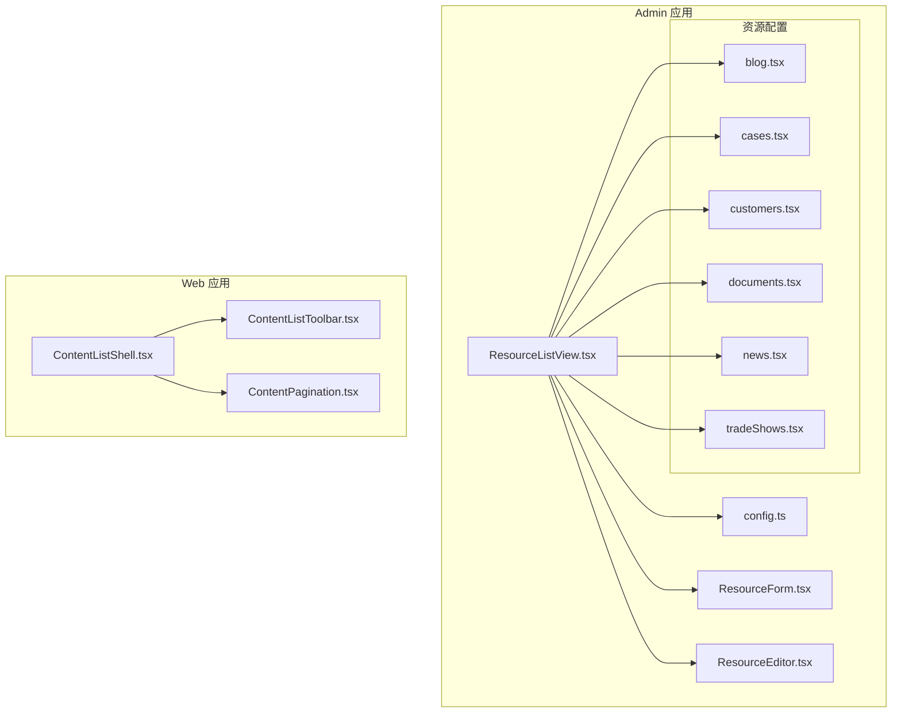
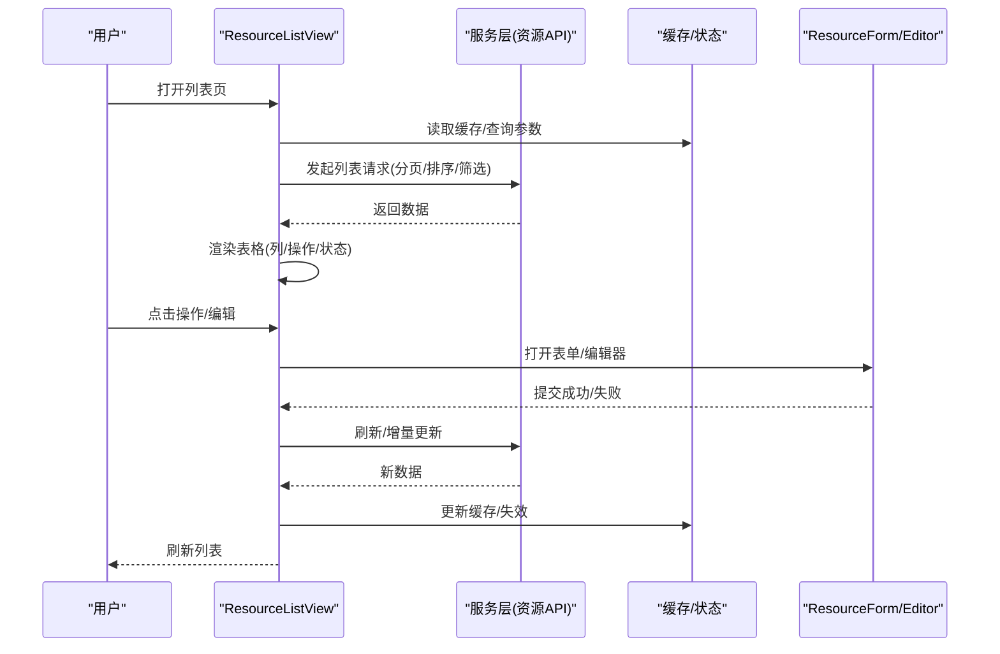
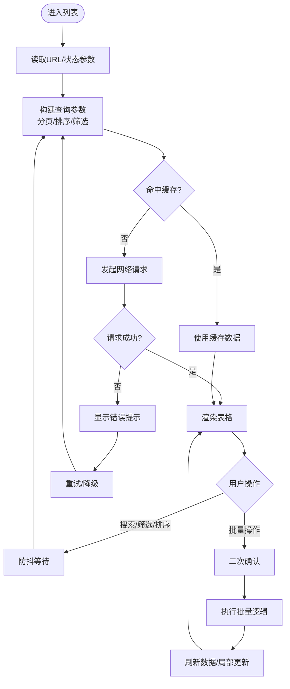
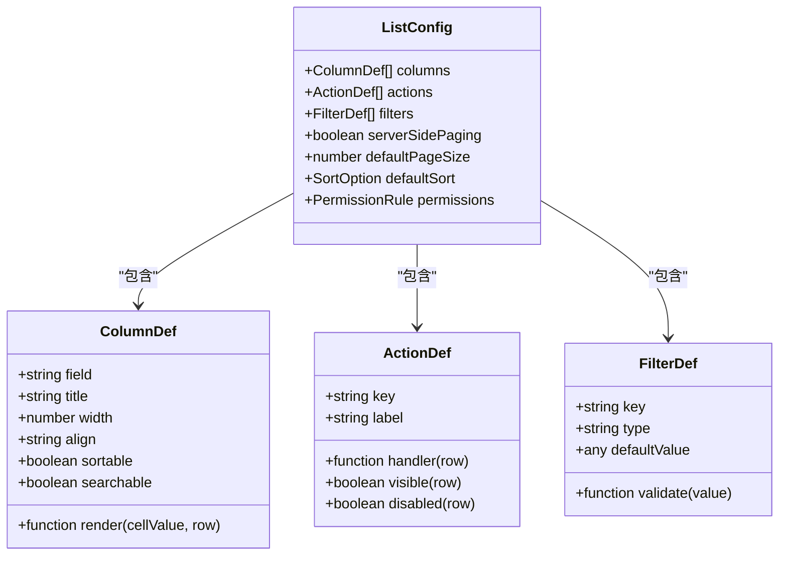
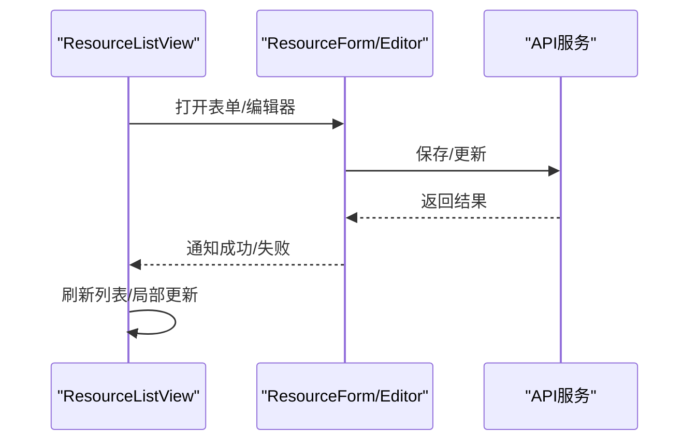
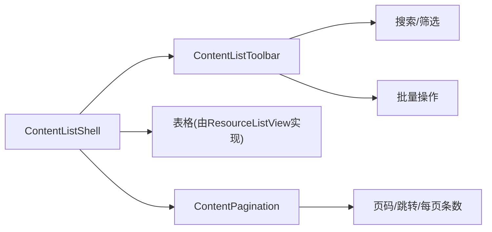
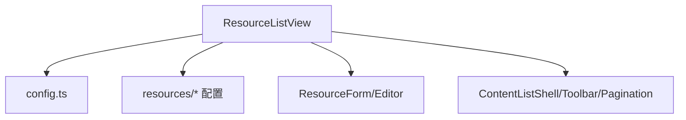

# ResourceListView列表组件

<cite>
**本文引用的文件**   
- [ResourceListView.tsx](file://apps/admin/src/components/crud/ResourceListView.tsx)
- [config.ts](file://apps/admin/src/components/crud/config.ts)
- [ResourceForm.tsx](file://apps/admin/src/components/crud/ResourceForm.tsx)
- [ResourceEditor.tsx](file://apps/admin/src/components/crud/ResourceEditor.tsx)
- [ContentListShell.tsx](file://apps/web/src/components/content/ContentListShell.tsx)
- [ContentListToolbar.tsx](file://apps/web/src/components/content/ContentListToolbar.tsx)
- [ContentPagination.tsx](file://apps/web/src/components/content/ContentPagination.tsx)
- [blog.tsx](file://apps/admin/src/features/resources/blog.tsx)
- [cases.tsx](file://apps/admin/src/features/resources/cases.tsx)
- [customers.tsx](file://apps/admin/src/features/resources/customers.tsx)
- [documents.tsx](file://apps/admin/src/features/resources/documents.tsx)
- [news.tsx](file://apps/admin/src/features/resources/news.tsx)
- [tradeShows.tsx](file://apps/admin/src/features/resources/tradeShows.tsx)
</cite>

## 目录
1. [简介](#简介)
2. [项目结构](#项目结构)
3. [核心组件与能力](#核心组件与能力)
4. [架构总览](#架构总览)
5. [详细组件分析](#详细组件分析)
6. [依赖关系分析](#依赖关系分析)
7. [性能与优化](#性能与优化)
8. [故障排查指南](#故障排查指南)
9. [结论](#结论)
10. [附录：配置项参考](#附录配置项参考)

## 简介
本文件面向后台管理场景中的“资源列表”需求，系统化梳理并文档化 ResourceListView 列表组件。内容覆盖表格列定义、排序、分页、搜索筛选、批量操作、数据加载策略、缓存机制、性能优化、自定义渲染器、操作按钮配置、响应式布局，以及复杂场景（嵌套表格、虚拟滚动、大数据处理）的使用示例与最佳实践。

## 项目结构
ResourceListView 位于 admin 应用的通用 CRUD 组件集中，配合 features/resources 下的业务资源配置文件使用；同时 web 端提供一套通用的内容列表壳层与工具栏、分页等基础 UI，便于复用。

图表来源
- [ResourceListView.tsx](file://apps/admin/src/components/crud/ResourceListView.tsx)
- [config.ts](file://apps/admin/src/components/crud/config.ts)
- [ResourceForm.tsx](file://apps/admin/src/components/crud/ResourceForm.tsx)
- [ResourceEditor.tsx](file://apps/admin/src/components/crud/ResourceEditor.tsx)
- [ContentListShell.tsx](file://apps/web/src/components/content/ContentListShell.tsx)
- [ContentListToolbar.tsx](file://apps/web/src/components/content/ContentListToolbar.tsx)
- [ContentPagination.tsx](file://apps/web/src/components/content/ContentPagination.tsx)
- [blog.tsx](file://apps/admin/src/features/resources/blog.tsx)
- [cases.tsx](file://apps/admin/src/features/resources/cases.tsx)
- [customers.tsx](file://apps/admin/src/features/resources/customers.tsx)
- [documents.tsx](file://apps/admin/src/features/resources/documents.tsx)
- [news.tsx](file://apps/admin/src/features/resources/news.tsx)
- [tradeShows.tsx](file://apps/admin/src/features/resources/tradeShows.tsx)

章节来源
- [ResourceListView.tsx](file://apps/admin/src/components/crud/ResourceListView.tsx)
- [config.ts](file://apps/admin/src/components/crud/config.ts)
- [ContentListShell.tsx](file://apps/web/src/components/content/ContentListShell.tsx)
- [ContentListToolbar.tsx](file://apps/web/src/components/content/ContentListToolbar.tsx)
- [ContentPagination.tsx](file://apps/web/src/components/content/ContentPagination.tsx)

## 核心组件与能力
- 列表展示：支持多列展示、行选择、操作列、状态标签、时间格式化等
- 列定义：通过配置对象声明列名、字段映射、渲染函数、宽度、对齐方式、可排序性
- 排序：支持单列/多列排序，服务端或客户端排序开关
- 分页：支持服务端分页参数传递、页码同步 URL、跳转与每页条数切换
- 搜索与筛选：关键词搜索、条件筛选、高级筛选面板、URL 状态同步
- 批量操作：多选行、批量删除/导出/状态变更、二次确认
- 数据加载：统一的数据获取封装、错误重试、加载态与骨架屏
- 缓存：请求级去抖/节流、结果缓存、按需失效
- 自定义渲染：单元格渲染函数、操作按钮、扩展插槽
- 响应式：移动端适配、列隐藏/折叠、横向滚动优化

章节来源
- [ResourceListView.tsx](file://apps/admin/src/components/crud/ResourceListView.tsx)
- [config.ts](file://apps/admin/src/components/crud/config.ts)

## 架构总览
ResourceListView 作为“视图层”，通过配置驱动渲染表格；数据层由业务资源模块提供 API 调用与缓存策略；表单编辑与弹窗由 ResourceForm/ResourceEditor 提供；Web 端的 ContentListShell/Toolbar/Pagination 提供通用 UI 能力。

图表来源
- [ResourceListView.tsx](file://apps/admin/src/components/crud/ResourceListView.tsx)
- [ResourceForm.tsx](file://apps/admin/src/components/crud/ResourceForm.tsx)
- [ResourceEditor.tsx](file://apps/admin/src/components/crud/ResourceEditor.tsx)

## 详细组件分析

### ResourceListView 组件
- 职责：接收配置与数据源，渲染表格、工具栏、分页、筛选、批量操作
- 关键能力：
  - 列定义：支持文本、数字、日期、布尔、枚举、图片、链接、富文本摘要等类型
  - 排序：支持升序/降序/取消，服务端排序时自动拼接参数
  - 分页：页码、每页大小、总条数、跳转、URL 同步
  - 搜索与筛选：关键词输入、下拉筛选、范围选择、组合条件
  - 批量操作：选择框、批量按钮、二次确认、进度反馈
  - 自定义渲染：单元格 render、操作列按钮、状态标签
  - 响应式：小屏隐藏次要列、横向滚动、固定列
- 数据流：
  - 初始化：从 URL/状态读取查询参数，合并默认值
  - 请求：组装分页/排序/筛选参数，触发数据获取
  - 渲染：根据列配置生成表格，绑定事件
  - 交互：搜索/筛选/排序变化时防抖触发请求
  - 更新：成功后刷新缓存与列表，必要时局部更新行

图表来源
- [ResourceListView.tsx](file://apps/admin/src/components/crud/ResourceListView.tsx)

章节来源
- [ResourceListView.tsx](file://apps/admin/src/components/crud/ResourceListView.tsx)

### 配置系统 config.ts
- 职责：定义列、操作、筛选、分页、排序、国际化文案等元数据
- 关键点：
  - 列定义：字段名、标题、宽度、对齐、是否可排序、是否可搜索、渲染函数
  - 操作按钮：新增、编辑、删除、查看、导出、自定义动作
  - 筛选器：类型（文本、下拉、日期范围）、默认值、校验规则
  - 分页：默认页大小、最大页大小、是否服务端分页
  - 排序：默认排序字段与方向、允许排序的列
  - 权限控制：基于角色/权限隐藏列或操作
- 扩展点：
  - 自定义渲染器：单元格渲染、操作按钮渲染
  - 数据转换：前后端字段映射、枚举翻译、时间格式化
  - 事件钩子：加载前/后、成功回调、错误回调

图表来源
- [config.ts](file://apps/admin/src/components/crud/config.ts)

章节来源
- [config.ts](file://apps/admin/src/components/crud/config.ts)

### 表单与编辑器 ResourceForm / ResourceEditor
- ResourceForm：用于新增/编辑资源的表单，支持字段校验、联动、上传、富文本等
- ResourceEditor：更复杂的编辑场景，如分步编辑、预览、版本对比等
- 与列表集成：
  - 列表操作列触发打开表单/编辑器
  - 提交成功后返回列表并刷新数据
  - 错误回显与提示

图表来源
- [ResourceForm.tsx](file://apps/admin/src/components/crud/ResourceForm.tsx)
- [ResourceEditor.tsx](file://apps/admin/src/components/crud/ResourceEditor.tsx)

章节来源
- [ResourceForm.tsx](file://apps/admin/src/components/crud/ResourceForm.tsx)
- [ResourceEditor.tsx](file://apps/admin/src/components/crud/ResourceEditor.tsx)

### Web 端通用列表能力 ContentListShell / Toolbar / Pagination
- ContentListShell：列表容器，承载工具栏、表格、分页
- ContentListToolbar：搜索、筛选、导出、批量操作入口
- ContentPagination：分页控件，支持页码、跳转、每页条数

图表来源
- [ContentListShell.tsx](file://apps/web/src/components/content/ContentListShell.tsx)
- [ContentListToolbar.tsx](file://apps/web/src/components/content/ContentListToolbar.tsx)
- [ContentPagination.tsx](file://apps/web/src/components/content/ContentPagination.tsx)

章节来源
- [ContentListShell.tsx](file://apps/web/src/components/content/ContentListShell.tsx)
- [ContentListToolbar.tsx](file://apps/web/src/components/content/ContentListToolbar.tsx)
- [ContentPagination.tsx](file://apps/web/src/components/content/ContentPagination.tsx)

### 资源配置示例 blog.tsx / cases.tsx / customers.tsx / documents.tsx / news.tsx / tradeShows.tsx
- 每个资源模块提供独立的 ListConfig，定义列、操作、筛选、权限等
- 典型用法：
  - 博客/新闻：标题、分类、状态、发布时间、作者
  - 案例：封面图、摘要、标签、浏览量
  - 客户：名称、联系方式、来源、跟进状态
  - 文档：文件名、大小、上传者、访问次数
  - 展会：名称、时间、地点、报名状态

章节来源
- [blog.tsx](file://apps/admin/src/features/resources/blog.tsx)
- [cases.tsx](file://apps/admin/src/features/resources/cases.tsx)
- [customers.tsx](file://apps/admin/src/features/resources/customers.tsx)
- [documents.tsx](file://apps/admin/src/features/resources/documents.tsx)
- [news.tsx](file://apps/admin/src/features/resources/news.tsx)
- [tradeShows.tsx](file://apps/admin/src/features/resources/tradeShows.tsx)

## 依赖关系分析
- ResourceListView 依赖配置系统（config.ts）与业务资源模块（features/resources/*）
- 表单与编辑器（ResourceForm/ResourceEditor）与列表解耦，通过事件通信
- Web 端通用 UI（ContentListShell/Toolbar/Pagination）提供基础能力，降低重复开发

图表来源
- [ResourceListView.tsx](file://apps/admin/src/components/crud/ResourceListView.tsx)
- [config.ts](file://apps/admin/src/components/crud/config.ts)
- [ResourceForm.tsx](file://apps/admin/src/components/crud/ResourceForm.tsx)
- [ResourceEditor.tsx](file://apps/admin/src/components/crud/ResourceEditor.tsx)
- [ContentListShell.tsx](file://apps/web/src/components/content/ContentListShell.tsx)
- [ContentListToolbar.tsx](file://apps/web/src/components/content/ContentListToolbar.tsx)
- [ContentPagination.tsx](file://apps/web/src/components/content/ContentPagination.tsx)

章节来源
- [ResourceListView.tsx](file://apps/admin/src/components/crud/ResourceListView.tsx)
- [config.ts](file://apps/admin/src/components/crud/config.ts)

## 性能与优化
- 数据加载策略
  - 服务端分页：避免一次性拉取大量数据
  - 请求去抖：搜索/筛选输入防抖，减少无效请求
  - 缓存策略：按查询键缓存结果，支持失效与预取
  - 增量更新：编辑成功后仅更新受影响行
- 渲染优化
  - 虚拟滚动：大数据量时使用虚拟列表，只渲染可视区域
  - 列虚拟化：宽表场景下按需渲染列
  - 懒加载：图片/富文本延迟加载
- 交互优化
  - 骨架屏：提升首屏感知速度
  - 错误重试：网络异常自动重试与降级
  - 批量操作：分批执行，避免阻塞主线程

[本节为通用指导，不直接分析具体文件]

## 故障排查指南
- 常见问题
  - 列表不刷新：检查缓存键与失效逻辑、URL 参数同步
  - 排序异常：确认服务端排序字段映射与方向
  - 筛选无效：检查筛选器类型与默认值、后端接口兼容
  - 批量操作失败：确认权限、二次确认、批量接口限制
  - 性能问题：开启虚拟滚动、减少重渲染、优化渲染函数
- 调试建议
  - 打印请求参数与响应结构
  - 使用浏览器开发者工具观察网络与渲染耗时
  - 逐步关闭功能定位瓶颈（如先禁用筛选/排序）

[本节为通用指导，不直接分析具体文件]

## 结论
ResourceListView 以配置驱动为核心，结合统一的表单/编辑器与通用 UI 能力，快速搭建后台资源列表。通过合理的分页、缓存、虚拟滚动与渲染优化，可在大数据量场景下保持良好体验。建议在业务资源模块中遵循统一的配置规范，确保一致性与可维护性。

[本节为总结，不直接分析具体文件]

## 附录：配置项参考
- 列定义（ColumnDef）
  - 字段：field、title、width、align、sortable、searchable、render
  - 用途：描述表格列的展示与行为
- 操作按钮（ActionDef）
  - 字段：key、label、handler、visible、disabled
  - 用途：定义行级操作与权限控制
- 筛选器（FilterDef）
  - 字段：key、type、defaultValue、validate
  - 用途：定义搜索与筛选条件
- 列表配置（ListConfig）
  - 字段：columns、actions、filters、serverSidePaging、defaultPageSize、defaultSort、permissions
  - 用途：聚合所有列表元数据

章节来源
- [config.ts](file://apps/admin/src/components/crud/config.ts)