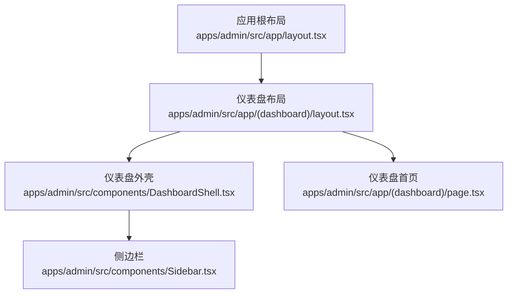
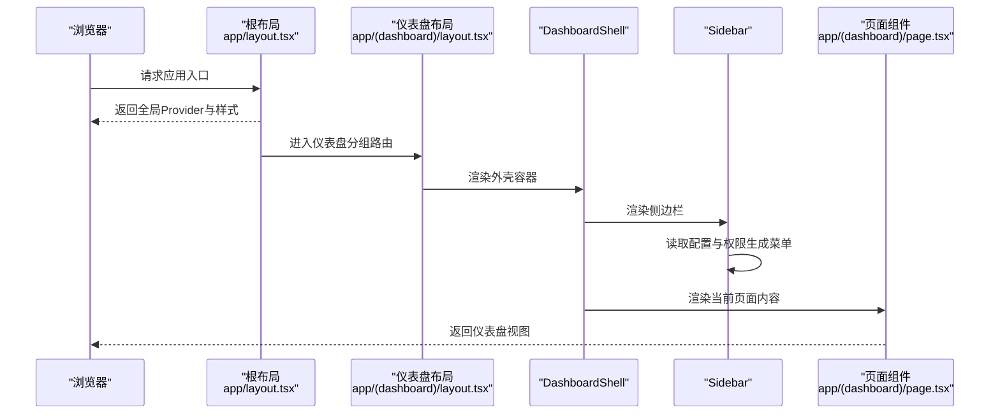
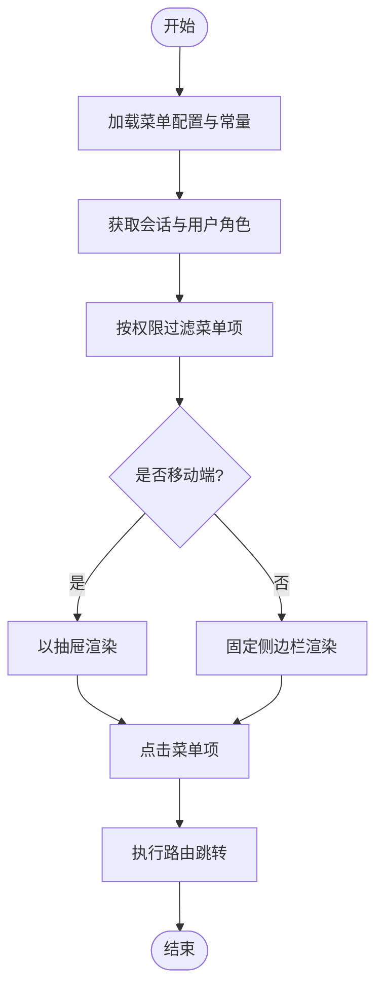
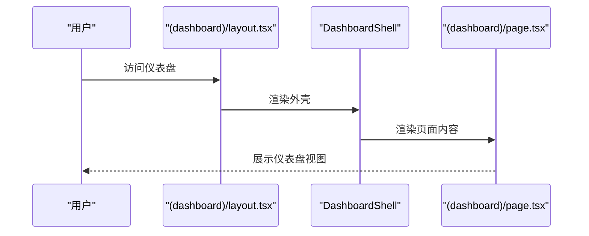
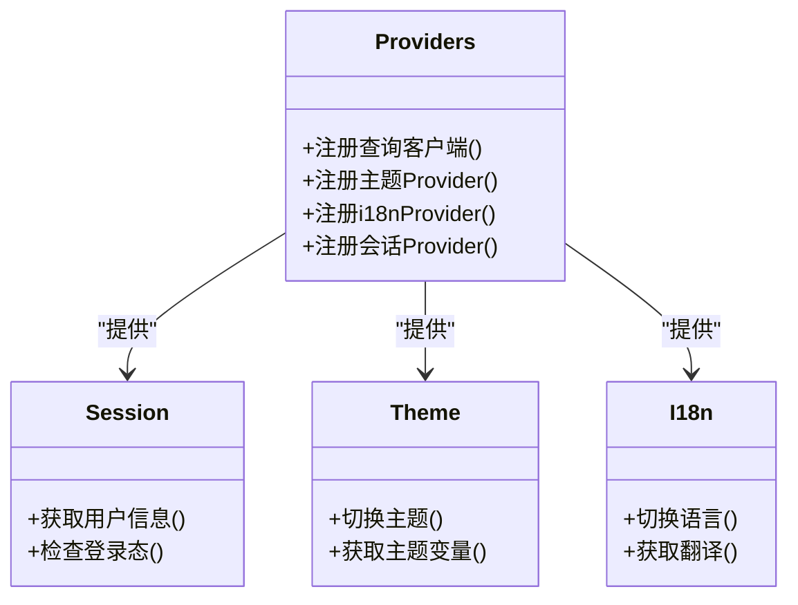
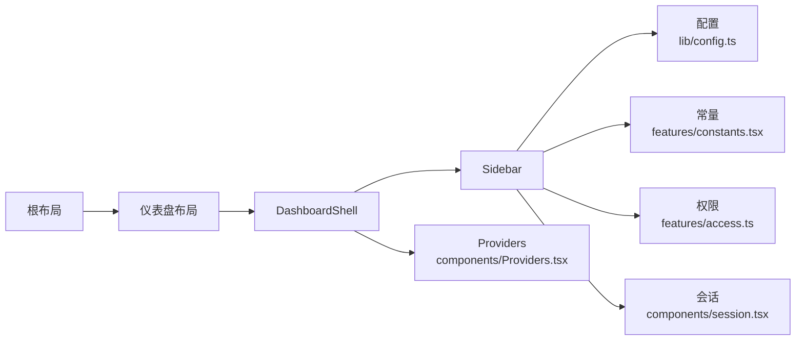

# 仪表盘布局与导航

<cite>
**本文引用的文件**   
- [apps/admin/src/app/(dashboard)/layout.tsx](file://apps/admin/src/app/(dashboard)/layout.tsx)
- [apps/admin/src/app/(dashboard)/page.tsx](file://apps/admin/src/app/(dashboard)/page.tsx)
- [apps/admin/src/app/layout.tsx](file://apps/admin/src/app/layout.tsx)
- [apps/admin/src/components/DashboardShell.tsx](file://apps/admin/src/components/DashboardShell.tsx)
- [apps/admin/src/components/Sidebar.tsx](file://apps/admin/src/components/Sidebar.tsx)
- [apps/admin/src/components/Providers.tsx](file://apps/admin/src/components/Providers.tsx)
- [apps/admin/src/components/session.tsx](file://apps/admin/src/components/session.tsx)
- [apps/admin/src/lib/config.ts](file://apps/admin/src/lib/config.ts)
- [apps/admin/src/features/constants.tsx](file://apps/admin/src/features/constants.tsx)
- [apps/admin/src/features/access.ts](file://apps/admin/src/features/access.ts)
- [apps/admin/src/lib/auth.ts](file://apps/admin/src/lib/auth.ts)
- [apps/admin/src/lib/vditor-i18n-zh-cn.ts](file://apps/admin/src/lib/vditor-i18n-zh-cn.ts)
</cite>

## 目录
1. [简介](#简介)
2. [项目结构](#项目结构)
3. [核心组件](#核心组件)
4. [架构总览](#架构总览)
5. [详细组件分析](#详细组件分析)
6. [依赖关系分析](#依赖关系分析)
7. [性能考虑](#性能考虑)
8. [故障排查指南](#故障排查指南)
9. [结论](#结论)
10. [附录](#附录)

## 简介
本文件聚焦于 Next.js App Router 管理后台的仪表盘布局与导航系统，涵盖路由组织、动态菜单生成、侧边栏实现、DashboardShell 布局模式与响应式适配、Provider 集成与状态管理、主题定制、国际化支持以及无障碍访问要点。同时提供导航优化与性能调优建议，帮助读者快速理解并高效扩展该系统的布局与导航能力。

## 项目结构
管理后台位于 apps/admin 下，采用 Next.js App Router 的分组路由（(dashboard)）组织仪表盘相关页面与布局。根级 layout.tsx 负责全局 Provider 与样式注入；(dashboard) 分组下的 layout.tsx 作为仪表盘外壳，组合 DashboardShell、Sidebar 等组件，并通过 page.tsx 渲染默认仪表盘内容。

图表来源
- [apps/admin/src/app/layout.tsx](file://apps/admin/src/app/layout.tsx)
- [apps/admin/src/app/(dashboard)/layout.tsx](file://apps/admin/src/app/(dashboard)/layout.tsx)
- [apps/admin/src/components/DashboardShell.tsx](file://apps/admin/src/components/DashboardShell.tsx)
- [apps/admin/src/components/Sidebar.tsx](file://apps/admin/src/components/Sidebar.tsx)
- [apps/admin/src/app/(dashboard)/page.tsx](file://apps/admin/src/app/(dashboard)/page.tsx)

章节来源
- [apps/admin/src/app/layout.tsx](file://apps/admin/src/app/layout.tsx)
- [apps/admin/src/app/(dashboard)/layout.tsx](file://apps/admin/src/app/(dashboard)/layout.tsx)
- [apps/admin/src/app/(dashboard)/page.tsx](file://apps/admin/src/app/(dashboard)/page.tsx)

## 核心组件
- DashboardShell：仪表盘外壳容器，负责主区域与侧边栏的布局、响应式切换、头部工具栏占位、全局水印与通知等。
- Sidebar：侧边栏导航，基于配置数据动态渲染菜单项，支持权限过滤、图标与标签、移动端抽屉模式。
- Providers：集中注册 React Context、查询客户端、主题、i18n 等全局 Provider，确保上下文可用性与一致性。
- session：会话状态与用户信息获取，用于权限判断与菜单可见性控制。
- config：应用级配置（如站点设置、功能开关），供布局与导航读取。
- constants：常量与枚举（如角色、权限、菜单分类）。
- access：权限判定逻辑，结合用户角色与资源权限决定菜单显示与操作可用性。
- auth：认证相关工具函数，辅助登录态校验与跳转。
- vditor-i18n-zh-cn：编辑器国际化文案，支撑富文本编辑器的本地化。

章节来源
- [apps/admin/src/components/DashboardShell.tsx](file://apps/admin/src/components/DashboardShell.tsx)
- [apps/admin/src/components/Sidebar.tsx](file://apps/admin/src/components/Sidebar.tsx)
- [apps/admin/src/components/Providers.tsx](file://apps/admin/src/components/Providers.tsx)
- [apps/admin/src/components/session.tsx](file://apps/admin/src/components/session.tsx)
- [apps/admin/src/lib/config.ts](file://apps/admin/src/lib/config.ts)
- [apps/admin/src/features/constants.tsx](file://apps/admin/src/features/constants.tsx)
- [apps/admin/src/features/access.ts](file://apps/admin/src/features/access.ts)
- [apps/admin/src/lib/auth.ts](file://apps/admin/src/lib/auth.ts)
- [apps/admin/src/lib/vditor-i18n-zh-cn.ts](file://apps/admin/src/lib/vditor-i18n-zh-cn.ts)

## 架构总览
仪表盘布局与导航的整体流程如下：根布局初始化全局 Provider；仪表盘布局加载 DashboardShell 与 Sidebar；Sidebar 根据用户权限与配置动态生成菜单；页面内容在 Shell 的主区域渲染。

图表来源
- [apps/admin/src/app/layout.tsx](file://apps/admin/src/app/layout.tsx)
- [apps/admin/src/app/(dashboard)/layout.tsx](file://apps/admin/src/app/(dashboard)/layout.tsx)
- [apps/admin/src/components/DashboardShell.tsx](file://apps/admin/src/components/DashboardShell.tsx)
- [apps/admin/src/components/Sidebar.tsx](file://apps/admin/src/components/Sidebar.tsx)
- [apps/admin/src/app/(dashboard)/page.tsx](file://apps/admin/src/app/(dashboard)/page.tsx)

## 详细组件分析

### DashboardShell 布局模式与响应式设计
- 布局模式：采用“侧边栏 + 主内容区”的经典后台布局，顶部可放置工具栏或面包屑，底部可放置页脚或水印。
- 响应式策略：在小屏设备将侧边栏折叠为抽屉（Drawer），通过遮罩层与手势关闭；在大屏设备固定展示侧边栏。
- 无障碍：为可交互元素添加合适的 aria-* 属性，确保键盘导航与屏幕阅读器友好。
- 主题：通过主题 Provider 注入颜色、字体、间距等变量，支持明暗主题切换。
- 性能：懒加载非关键 UI 模块，避免首屏过重；对大列表使用虚拟滚动。

章节来源
- [apps/admin/src/components/DashboardShell.tsx](file://apps/admin/src/components/DashboardShell.tsx)

### Sidebar 动态菜单与权限控制
- 菜单数据来源：从配置与常量中聚合菜单项，支持分组、图标、路径、子菜单。
- 权限过滤：结合用户角色与资源权限，隐藏无权限的菜单项。
- 交互行为：点击菜单项进行路由跳转，支持高亮当前激活项；移动端以抽屉形式呈现。
- 可扩展性：新增菜单只需在配置中添加条目，无需修改渲染逻辑。

图表来源
- [apps/admin/src/components/Sidebar.tsx](file://apps/admin/src/components/Sidebar.tsx)
- [apps/admin/src/components/session.tsx](file://apps/admin/src/components/session.tsx)
- [apps/admin/src/features/access.ts](file://apps/admin/src/features/access.ts)
- [apps/admin/src/features/constants.tsx](file://apps/admin/src/features/constants.tsx)

章节来源
- [apps/admin/src/components/Sidebar.tsx](file://apps/admin/src/components/Sidebar.tsx)
- [apps/admin/src/components/session.tsx](file://apps/admin/src/components/session.tsx)
- [apps/admin/src/features/access.ts](file://apps/admin/src/features/access.ts)
- [apps/admin/src/features/constants.tsx](file://apps/admin/src/features/constants.tsx)

### 仪表盘布局与页面渲染流程
- 仪表盘布局：(dashboard)/layout.tsx 作为分组布局，包裹 DashboardShell 与页面内容。
- 默认页面：(dashboard)/page.tsx 渲染仪表盘首页，通常包含统计卡片、图表等。
- 路由组织：每个业务模块以文件夹划分，便于维护与权限控制。

图表来源
- [apps/admin/src/app/(dashboard)/layout.tsx](file://apps/admin/src/app/(dashboard)/layout.tsx)
- [apps/admin/src/app/(dashboard)/page.tsx](file://apps/admin/src/app/(dashboard)/page.tsx)
- [apps/admin/src/components/DashboardShell.tsx](file://apps/admin/src/components/DashboardShell.tsx)

章节来源
- [apps/admin/src/app/(dashboard)/layout.tsx](file://apps/admin/src/app/(dashboard)/layout.tsx)
- [apps/admin/src/app/(dashboard)/page.tsx](file://apps/admin/src/app/(dashboard)/page.tsx)

### Provider 集成与状态管理
- Providers.tsx：集中注册查询客户端、主题、i18n、会话等 Provider，保证组件树内上下文可用。
- 会话管理：session.tsx 提供用户信息与登录态，配合权限模块控制菜单与操作。
- 主题与 i18n：通过 Provider 注入主题变量与语言包，支持运行时切换。

图表来源
- [apps/admin/src/components/Providers.tsx](file://apps/admin/src/components/Providers.tsx)
- [apps/admin/src/components/session.tsx](file://apps/admin/src/components/session.tsx)

章节来源
- [apps/admin/src/components/Providers.tsx](file://apps/admin/src/components/Providers.tsx)
- [apps/admin/src/components/session.tsx](file://apps/admin/src/components/session.tsx)

### 主题定制与国际化支持
- 主题定制：通过主题 Provider 暴露颜色、字体、间距等变量，组件按需读取，支持明暗模式。
- 国际化：i18n Provider 注入多语言文案，组件通过 hooks 获取翻译；编辑器文案由 vditor-i18n-zh-cn.ts 提供中文支持。
- 无障碍：遵循 WCAG 规范，确保对比度、焦点顺序与语义化标签正确。

章节来源
- [apps/admin/src/components/Providers.tsx](file://apps/admin/src/components/Providers.tsx)
- [apps/admin/src/lib/vditor-i18n-zh-cn.ts](file://apps/admin/src/lib/vditor-i18n-zh-cn.ts)

### 权限与认证集成
- 权限模型：access.ts 定义角色与资源权限规则，结合用户会话进行菜单与操作过滤。
- 认证流程：auth.ts 提供登录态校验与跳转逻辑，未登录时重定向至登录页。
- 安全实践：敏感操作需二次确认，错误提示统一通过 Toaster 展示。

章节来源
- [apps/admin/src/features/access.ts](file://apps/admin/src/features/access.ts)
- [apps/admin/src/lib/auth.ts](file://apps/admin/src/lib/auth.ts)
- [apps/admin/src/components/session.tsx](file://apps/admin/src/components/session.tsx)

## 依赖关系分析
仪表盘布局与导航的核心依赖包括：
- 布局层：根布局与仪表盘布局负责 Provider 与外壳组装。
- 组件层：DashboardShell 与 Sidebar 负责 UI 与交互。
- 数据层：config、constants、access、session 提供配置、常量、权限与会话数据。
- 外部依赖：查询客户端、主题库、i18n 库等。

图表来源
- [apps/admin/src/app/layout.tsx](file://apps/admin/src/app/layout.tsx)
- [apps/admin/src/app/(dashboard)/layout.tsx](file://apps/admin/src/app/(dashboard)/layout.tsx)
- [apps/admin/src/components/DashboardShell.tsx](file://apps/admin/src/components/DashboardShell.tsx)
- [apps/admin/src/components/Sidebar.tsx](file://apps/admin/src/components/Sidebar.tsx)
- [apps/admin/src/lib/config.ts](file://apps/admin/src/lib/config.ts)
- [apps/admin/src/features/constants.tsx](file://apps/admin/src/features/constants.tsx)
- [apps/admin/src/features/access.ts](file://apps/admin/src/features/access.ts)
- [apps/admin/src/components/session.tsx](file://apps/admin/src/components/session.tsx)
- [apps/admin/src/components/Providers.tsx](file://apps/admin/src/components/Providers.tsx)

章节来源
- [apps/admin/src/app/layout.tsx](file://apps/admin/src/app/layout.tsx)
- [apps/admin/src/app/(dashboard)/layout.tsx](file://apps/admin/src/app/(dashboard)/layout.tsx)
- [apps/admin/src/components/DashboardShell.tsx](file://apps/admin/src/components/DashboardShell.tsx)
- [apps/admin/src/components/Sidebar.tsx](file://apps/admin/src/components/Sidebar.tsx)
- [apps/admin/src/lib/config.ts](file://apps/admin/src/lib/config.ts)
- [apps/admin/src/features/constants.tsx](file://apps/admin/src/features/constants.tsx)
- [apps/admin/src/features/access.ts](file://apps/admin/src/features/access.ts)
- [apps/admin/src/components/session.tsx](file://apps/admin/src/components/session.tsx)
- [apps/admin/src/components/Providers.tsx](file://apps/admin/src/components/Providers.tsx)

## 性能考虑
- 代码分割与懒加载：将非首屏组件与重型模块延迟加载，减少初始包体积。
- 路由级优化：使用 App Router 的并行路由与缓存策略，提升页面切换速度。
- 列表渲染优化：大数据量列表使用虚拟滚动与分页，避免长列表卡顿。
- 网络请求优化：合并请求、缓存响应、失败重试与超时处理。
- 主题与 i18n：按需加载语言包与主题资源，避免全量加载。
- 无障碍与可访问性：确保键盘导航与屏幕阅读器兼容，提升用户体验。

[本节为通用指导，不直接分析具体文件]

## 故障排查指南
- 菜单不显示：检查权限配置与用户角色是否正确；确认会话数据是否加载成功。
- 侧边栏异常：验证响应式断点与抽屉开关逻辑；检查 CSS 类名与样式冲突。
- 主题切换无效：确认主题 Provider 已正确注册；检查变量覆盖与优先级。
- i18n 缺失：检查语言包是否加载；确认翻译键是否存在。
- 登录态丢失：检查认证流程与 Token 刷新逻辑；确认重定向路径正确。

章节来源
- [apps/admin/src/features/access.ts](file://apps/admin/src/features/access.ts)
- [apps/admin/src/components/session.tsx](file://apps/admin/src/components/session.tsx)
- [apps/admin/src/components/Sidebar.tsx](file://apps/admin/src/components/Sidebar.tsx)
- [apps/admin/src/components/Providers.tsx](file://apps/admin/src/components/Providers.tsx)
- [apps/admin/src/lib/auth.ts](file://apps/admin/src/lib/auth.ts)

## 结论
本系统通过 Next.js App Router 的分层布局与模块化组件设计，实现了灵活的仪表盘布局与导航体系。DashboardShell 与 Sidebar 的组合提供了良好的响应式体验与可扩展性；Providers 集中管理全局状态，简化了主题与国际化配置。结合权限与认证机制，系统能够安全地控制菜单与操作。通过合理的性能优化与无障碍实践，整体用户体验得到显著提升。

[本节为总结性内容，不直接分析具体文件]

## 附录
- 最佳实践建议：
  - 新增菜单项仅需更新配置，避免修改渲染逻辑。
  - 使用统一的权限模型与错误提示，保持行为一致。
  - 对复杂页面进行组件拆分与懒加载，提升首屏性能。
  - 遵循无障碍规范，确保所有用户均可顺畅使用。

[本节为补充说明，不直接分析具体文件]