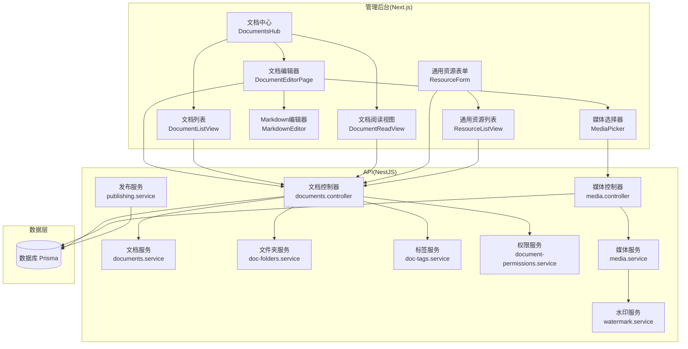
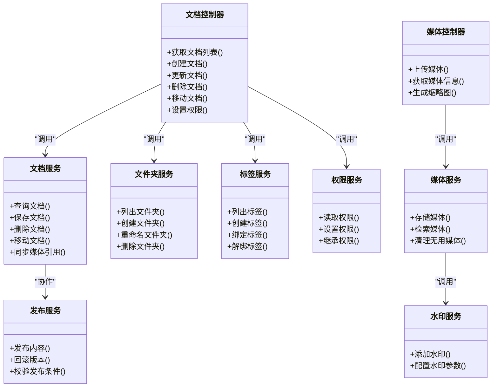
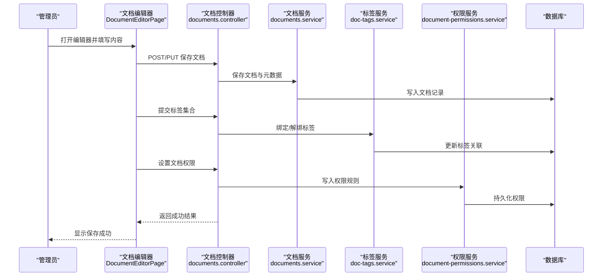
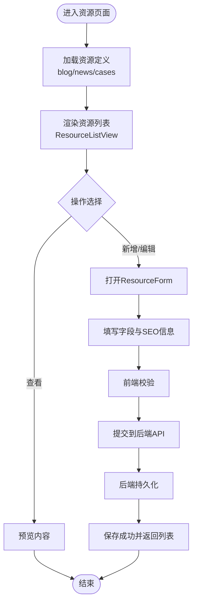
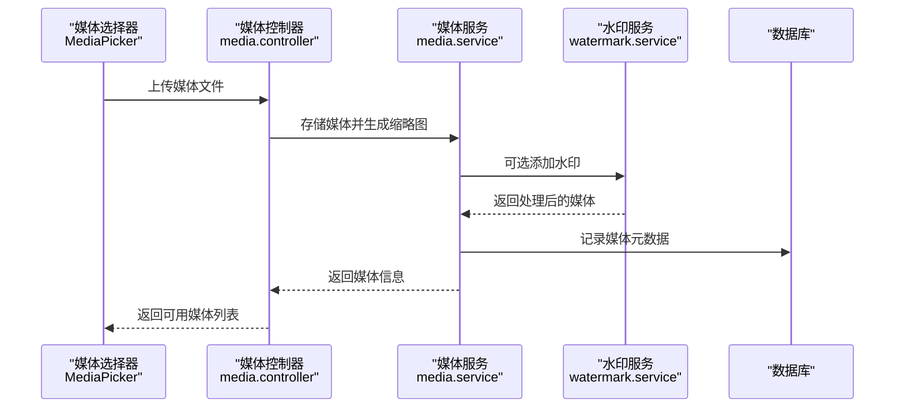
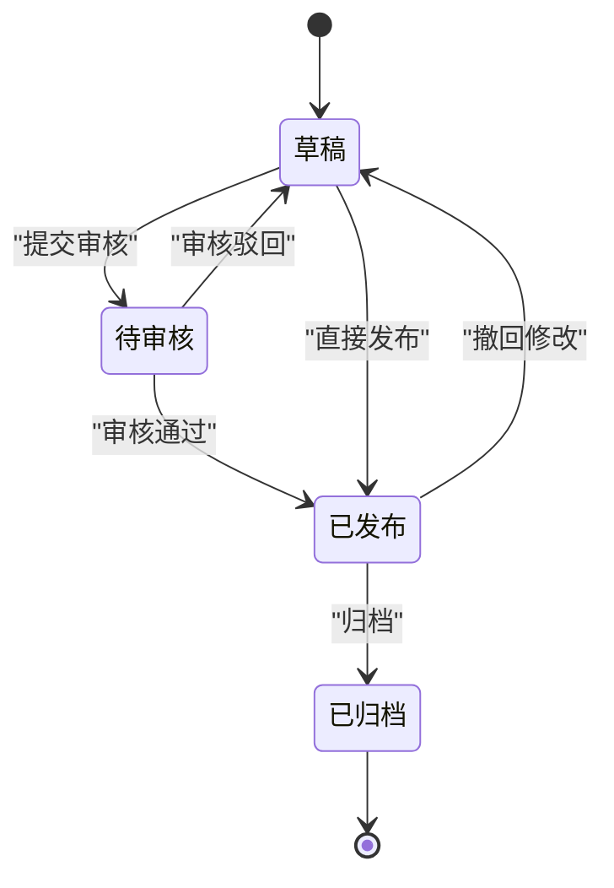
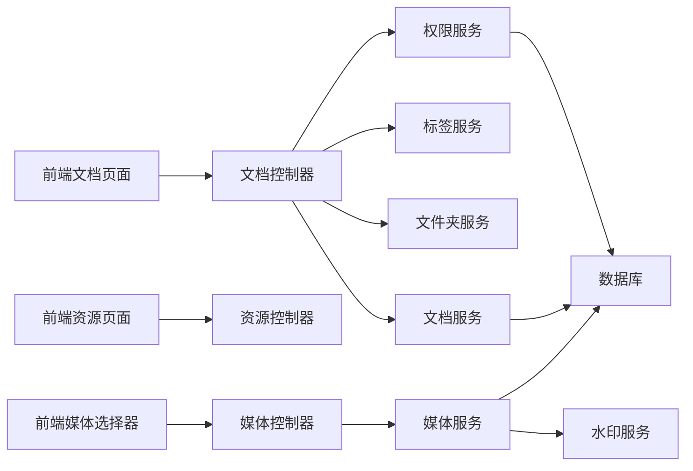

# 内容管理系统

<cite>
**本文引用的文件**   
- [apps/admin/src/app/(dashboard)/documents/DocumentsHub.tsx](file://apps/admin/src/app/(dashboard)/documents/DocumentsHub.tsx)
- [apps/admin/src/components/documents/DocumentListView.tsx](file://apps/admin/src/components/documents/DocumentListView.tsx)
- [apps/admin/src/components/documents/DocumentEditorPage.tsx](file://apps/admin/src/components/documents/DocumentEditorPage.tsx)
- [apps/admin/src/components/documents/DocumentReadView.tsx](file://apps/admin/src/components/documents/DocumentReadView.tsx)
- [apps/admin/src/components/documents/DocFolderSidebar.tsx](file://apps/admin/src/components/documents/DocFolderSidebar.tsx)
- [apps/admin/src/components/documents/DocumentTagsManageDialog.tsx](file://apps/admin/src/components/documents/DocumentTagsManageDialog.tsx)
- [apps/admin/src/components/documents/DocumentMoveDialog.tsx](file://apps/admin/src/components/documents/DocumentMoveDialog.tsx)
- [apps/admin/src/components/crud/ResourceForm.tsx](file://apps/admin/src/components/crud/ResourceForm.tsx)
- [apps/admin/src/components/crud/ResourceListView.tsx](file://apps/admin/src/components/crud/ResourceListView.tsx)
- [apps/admin/src/components/crud/MediaPicker.tsx](file://apps/admin/src/components/crud/MediaPicker.tsx)
- [apps/admin/src/features/resources/documents.tsx](file://apps/admin/src/features/resources/documents.tsx)
- [apps/admin/src/features/resources/blog.tsx](file://apps/admin/src/features/resources/blog.tsx)
- [apps/admin/src/features/resources/news.tsx](file://apps/admin/src/features/resources/news.tsx)
- [apps/admin/src/features/resources/cases.tsx](file://apps/admin/src/features/resources/cases.tsx)
- [apps/api/src/documents/documents.controller.ts](file://apps/api/src/documents/documents.controller.ts)
- [apps/api/src/documents/documents.service.ts](file://apps/api/src/documents/documents.service.ts)
- [apps/api/src/documents/doc-folders.service.ts](file://apps/api/src/documents/doc-folders.service.ts)
- [apps/api/src/documents/doc-tags.service.ts](file://apps/api/src/documents/doc-tags.service.ts)
- [apps/api/src/documents/document-permissions.service.ts](file://apps/api/src/documents/document-permissions.service.ts)
- [apps/api/src/blogs/blogs.controller.ts](file://apps/api/src/blogs/blogs.controller.ts)
- [apps/api/src/blogs/blogs.service.ts](file://apps/api/src/blogs/blogs.service.ts)
- [apps/api/src/news/news.controller.ts](file://apps/api/src/news/news.controller.ts)
- [apps/api/src/news/news.service.ts](file://apps/api/src/news/news.service.ts)
- [apps/api/src/cases/cases.controller.ts](file://apps/api/src/cases/cases.controller.ts)
- [apps/api/src/cases/cases.service.ts](file://apps/api/src/cases/cases.service.ts)
- [apps/api/src/media/media.controller.ts](file://apps/api/src/media/media.controller.ts)
- [apps/api/src/media/media.service.ts](file://apps/api/src/media/media.service.ts)
- [apps/api/src/media/watermark.service.ts](file://apps/api/src/media/watermark.service.ts)
- [apps/api/src/publishing/publishing.service.ts](file://apps/api/src/publishing/publishing.service.ts)
- [apps/api/src/common/enums/content-status.enum.ts](file://apps/api/src/common/enums/content-status.enum.ts)
- [apps/api/src/prisma/schema.prisma](file://apps/api/src/prisma/schema.prisma)
- [apps/api/src/scripts/migrate-deprecated-roles.ts](file://apps/api/src/scripts/migrate-deprecated-roles.ts)
- [apps/api/src/scripts/seed-content-media.ts](file://apps/api/src/scripts/seed-content-media.ts)
- [apps/api/src/scripts/seed-content.ts](file://apps/api/src/scripts/seed-content.ts)
</cite>

## 目录
1. [简介](#简介)
2. [项目结构](#项目结构)
3. [核心组件](#核心组件)
4. [架构总览](#架构总览)
5. [详细组件分析](#详细组件分析)
6. [依赖关系分析](#依赖关系分析)
7. [性能考量](#性能考量)
8. [故障排查指南](#故障排查指南)
9. [结论](#结论)
10. [附录](#附录)

## 简介
本文件为管理后台内容管理系统的技术文档，聚焦于文档管理模块的文件树结构、标签系统与权限控制；博客、新闻、案例等内容类型的CRUD与富文本编辑器集成；内容发布流程、版本管理与SEO优化；媒体资源管理、图片处理与水印添加；以及内容迁移工具与批量操作接口。读者无需深入代码即可理解系统能力与使用方式。

## 项目结构
管理后台采用前后端分离架构：
- 前端（Next.js）提供管理界面，包含文档、博客、新闻、案例等资源的列表、编辑、预览与媒体选择器。
- 后端（NestJS）提供REST API，涵盖文档、媒体、权限、发布、审计等能力，并通过Prisma访问数据库。

图表来源
- [apps/admin/src/app/(dashboard)/documents/DocumentsHub.tsx](file://apps/admin/src/app/(dashboard)/documents/DocumentsHub.tsx)
- [apps/admin/src/components/documents/DocumentListView.tsx](file://apps/admin/src/components/documents/DocumentListView.tsx)
- [apps/admin/src/components/documents/DocumentEditorPage.tsx](file://apps/admin/src/components/documents/DocumentEditorPage.tsx)
- [apps/admin/src/components/documents/DocumentReadView.tsx](file://apps/admin/src/components/documents/DocumentReadView.tsx)
- [apps/admin/src/components/crud/ResourceForm.tsx](file://apps/admin/src/components/crud/ResourceForm.tsx)
- [apps/admin/src/components/crud/ResourceListView.tsx](file://apps/admin/src/components/crud/ResourceListView.tsx)
- [apps/admin/src/components/crud/MediaPicker.tsx](file://apps/admin/src/components/crud/MediaPicker.tsx)
- [apps/api/src/documents/documents.controller.ts](file://apps/api/src/documents/documents.controller.ts)
- [apps/api/src/documents/documents.service.ts](file://apps/api/src/documents/documents.service.ts)
- [apps/api/src/documents/doc-folders.service.ts](file://apps/api/src/documents/doc-folders.service.ts)
- [apps/api/src/documents/doc-tags.service.ts](file://apps/api/src/documents/doc-tags.service.ts)
- [apps/api/src/documents/document-permissions.service.ts](file://apps/api/src/documents/document-permissions.service.ts)
- [apps/api/src/media/media.controller.ts](file://apps/api/src/media/media.controller.ts)
- [apps/api/src/media/media.service.ts](file://apps/api/src/media/media.service.ts)
- [apps/api/src/media/watermark.service.ts](file://apps/api/src/media/watermark.service.ts)
- [apps/api/src/publishing/publishing.service.ts](file://apps/api/src/publishing/publishing.service.ts)
- [apps/api/src/prisma/schema.prisma](file://apps/api/src/prisma/schema.prisma)

章节来源
- [apps/admin/src/app/(dashboard)/documents/DocumentsHub.tsx](file://apps/admin/src/app/(dashboard)/documents/DocumentsHub.tsx)
- [apps/api/src/documents/documents.controller.ts](file://apps/api/src/documents/documents.controller.ts)
- [apps/api/src/media/media.controller.ts](file://apps/api/src/media/media.controller.ts)
- [apps/api/src/prisma/schema.prisma](file://apps/api/src/prisma/schema.prisma)

## 核心组件
- 文档中心：提供文档的文件夹导航、列表浏览、在线编辑、阅读预览、标签与权限管理、移动与批量操作。
- 通用资源框架：通过统一的ResourceForm与ResourceListView快速搭建博客、新闻、案例等内容的CRUD页面。
- 媒体管理：上传、预览、搜索、选择媒体，支持图片处理与水印。
- 发布与状态：统一的内容状态枚举与发布服务，支撑草稿、待审、已发布等生命周期。
- 权限与角色：基于角色的访问控制与细粒度文档级权限。

章节来源
- [apps/admin/src/components/crud/ResourceForm.tsx](file://apps/admin/src/components/crud/ResourceForm.tsx)
- [apps/admin/src/components/crud/ResourceListView.tsx](file://apps/admin/src/components/crud/ResourceListView.tsx)
- [apps/admin/src/components/crud/MediaPicker.tsx](file://apps/admin/src/components/crud/MediaPicker.tsx)
- [apps/api/src/common/enums/content-status.enum.ts](file://apps/api/src/common/enums/content-status.enum.ts)
- [apps/api/src/publishing/publishing.service.ts](file://apps/api/src/publishing/publishing.service.ts)
- [apps/api/src/documents/document-permissions.service.ts](file://apps/api/src/documents/document-permissions.service.ts)

## 架构总览
内容管理系统以“资源类型”为核心抽象，通过统一的表单与列表组件驱动不同内容类型的CRUD；文档模块在此基础上扩展了文件夹、标签、权限与移动能力；媒体模块提供统一的存储与图像处理；发布服务贯穿内容生命周期；权限体系覆盖角色与资源级控制。

图表来源
- [apps/api/src/documents/documents.controller.ts](file://apps/api/src/documents/documents.controller.ts)
- [apps/api/src/documents/documents.service.ts](file://apps/api/src/documents/documents.service.ts)
- [apps/api/src/documents/doc-folders.service.ts](file://apps/api/src/documents/doc-folders.service.ts)
- [apps/api/src/documents/doc-tags.service.ts](file://apps/api/src/documents/doc-tags.service.ts)
- [apps/api/src/documents/document-permissions.service.ts](file://apps/api/src/documents/document-permissions.service.ts)
- [apps/api/src/media/media.controller.ts](file://apps/api/src/media/media.controller.ts)
- [apps/api/src/media/media.service.ts](file://apps/api/src/media/media.service.ts)
- [apps/api/src/media/watermark.service.ts](file://apps/api/src/media/watermark.service.ts)
- [apps/api/src/publishing/publishing.service.ts](file://apps/api/src/publishing/publishing.service.ts)

## 详细组件分析

### 文档管理模块
- 文件树结构
  - 文档中心入口：DocumentsHub负责路由与布局组织。
  - 列表视图：DocumentListView提供分页、筛选、排序与批量操作。
  - 编辑器：DocumentEditorPage集成Markdown编辑器与媒体选择器，支持元数据与SEO字段。
  - 阅读视图：DocumentReadView用于预览渲染。
  - 文件夹侧边栏：DocFolderSidebar提供层级导航与拖拽移动。
  - 标签管理：DocumentTagsManageDialog用于标签的增删改与分配。
  - 移动对话框：DocumentMoveDialog实现文档在文件夹间的移动。
- 标签系统
  - 标签作为独立实体，支持多对多关联到文档，便于分类与检索。
- 权限控制
  - 文档级权限可针对用户或角色设置读/写/管理等级别，支持继承与覆盖。

图表来源
- [apps/admin/src/components/documents/DocumentEditorPage.tsx](file://apps/admin/src/components/documents/DocumentEditorPage.tsx)
- [apps/api/src/documents/documents.controller.ts](file://apps/api/src/documents/documents.controller.ts)
- [apps/api/src/documents/documents.service.ts](file://apps/api/src/documents/documents.service.ts)
- [apps/api/src/documents/doc-tags.service.ts](file://apps/api/src/documents/doc-tags.service.ts)
- [apps/api/src/documents/document-permissions.service.ts](file://apps/api/src/documents/document-permissions.service.ts)

章节来源
- [apps/admin/src/app/(dashboard)/documents/DocumentsHub.tsx](file://apps/admin/src/app/(dashboard)/documents/DocumentsHub.tsx)
- [apps/admin/src/components/documents/DocumentListView.tsx](file://apps/admin/src/components/documents/DocumentListView.tsx)
- [apps/admin/src/components/documents/DocumentEditorPage.tsx](file://apps/admin/src/components/documents/DocumentEditorPage.tsx)
- [apps/admin/src/components/documents/DocumentReadView.tsx](file://apps/admin/src/components/documents/DocumentReadView.tsx)
- [apps/admin/src/components/documents/DocFolderSidebar.tsx](file://apps/admin/src/components/documents/DocFolderSidebar.tsx)
- [apps/admin/src/components/documents/DocumentTagsManageDialog.tsx](file://apps/admin/src/components/documents/DocumentTagsManageDialog.tsx)
- [apps/admin/src/components/documents/DocumentMoveDialog.tsx](file://apps/admin/src/components/documents/DocumentMoveDialog.tsx)
- [apps/api/src/documents/documents.controller.ts](file://apps/api/src/documents/documents.controller.ts)
- [apps/api/src/documents/documents.service.ts](file://apps/api/src/documents/documents.service.ts)
- [apps/api/src/documents/doc-tags.service.ts](file://apps/api/src/documents/doc-tags.service.ts)
- [apps/api/src/documents/document-permissions.service.ts](file://apps/api/src/documents/document-permissions.service.ts)

### 博客、新闻、案例内容类型（CRUD与富文本）
- 资源定义
  - 各内容类型通过features/resources下的配置文件声明字段、校验规则与展示列。
- 表单与列表
  - ResourceForm与ResourceListView提供统一的输入与展示能力，减少重复代码。
- 富文本编辑器
  - 编辑器集成Markdown能力，支持插入媒体、链接与基础样式。
- SEO优化
  - 表单中包含标题、描述、关键词等SEO字段，便于搜索引擎收录。

图表来源
- [apps/admin/src/features/resources/blog.tsx](file://apps/admin/src/features/resources/blog.tsx)
- [apps/admin/src/features/resources/news.tsx](file://apps/admin/src/features/resources/news.tsx)
- [apps/admin/src/features/resources/cases.tsx](file://apps/admin/src/features/resources/cases.tsx)
- [apps/admin/src/components/crud/ResourceForm.tsx](file://apps/admin/src/components/crud/ResourceForm.tsx)
- [apps/admin/src/components/crud/ResourceListView.tsx](file://apps/admin/src/components/crud/ResourceListView.tsx)

章节来源
- [apps/admin/src/features/resources/blog.tsx](file://apps/admin/src/features/resources/blog.tsx)
- [apps/admin/src/features/resources/news.tsx](file://apps/admin/src/features/resources/news.tsx)
- [apps/admin/src/features/resources/cases.tsx](file://apps/admin/src/features/resources/cases.tsx)
- [apps/admin/src/components/crud/ResourceForm.tsx](file://apps/admin/src/components/crud/ResourceForm.tsx)
- [apps/admin/src/components/crud/ResourceListView.tsx](file://apps/admin/src/components/crud/ResourceListView.tsx)
- [apps/api/src/blogs/blogs.controller.ts](file://apps/api/src/blogs/blogs.controller.ts)
- [apps/api/src/blogs/blogs.service.ts](file://apps/api/src/blogs/blogs.service.ts)
- [apps/api/src/news/news.controller.ts](file://apps/api/src/news/news.controller.ts)
- [apps/api/src/news/news.service.ts](file://apps/api/src/news/news.service.ts)
- [apps/api/src/cases/cases.controller.ts](file://apps/api/src/cases/cases.controller.ts)
- [apps/api/src/cases/cases.service.ts](file://apps/api/src/cases/cases.service.ts)

### 媒体资源管理与图片处理
- 媒体上传与预览
  - MediaPicker提供选择与预览能力，支持按类型与名称过滤。
- 图片处理与水印
  - watermark.service提供水印添加与参数配置，媒体服务负责存储与生成缩略图。
- 静态路径与CDN
  - 站点静态路径与媒体URL策略确保资源高效分发。

图表来源
- [apps/admin/src/components/crud/MediaPicker.tsx](file://apps/admin/src/components/crud/MediaPicker.tsx)
- [apps/api/src/media/media.controller.ts](file://apps/api/src/media/media.controller.ts)
- [apps/api/src/media/media.service.ts](file://apps/api/src/media/media.service.ts)
- [apps/api/src/media/watermark.service.ts](file://apps/api/src/media/watermark.service.ts)

章节来源
- [apps/admin/src/components/crud/MediaPicker.tsx](file://apps/admin/src/components/crud/MediaPicker.tsx)
- [apps/api/src/media/media.controller.ts](file://apps/api/src/media/media.controller.ts)
- [apps/api/src/media/media.service.ts](file://apps/api/src/media/media.service.ts)
- [apps/api/src/media/watermark.service.ts](file://apps/api/src/media/watermark.service.ts)

### 内容发布流程与版本管理
- 状态模型
  - content-status.enum定义内容状态（如草稿、待审、已发布）。
- 发布服务
  - publishing.service提供发布、回滚与校验逻辑，确保一致性。
- 版本管理
  - 通过状态与审计记录实现版本追踪，支持回滚到历史版本。

图表来源
- [apps/api/src/common/enums/content-status.enum.ts](file://apps/api/src/common/enums/content-status.enum.ts)
- [apps/api/src/publishing/publishing.service.ts](file://apps/api/src/publishing/publishing.service.ts)

章节来源
- [apps/api/src/common/enums/content-status.enum.ts](file://apps/api/src/common/enums/content-status.enum.ts)
- [apps/api/src/publishing/publishing.service.ts](file://apps/api/src/publishing/publishing.service.ts)

### 内容迁移工具与批量操作接口
- 迁移脚本
  - migrate-deprecated-roles用于角色权限迁移，保障向后兼容。
- 种子数据
  - seed-content与seed-content-media用于初始化内容与媒体，便于测试与演示。
- 批量操作
  - 列表组件支持批量删除、移动与标签分配，提升管理效率。

章节来源
- [apps/api/src/scripts/migrate-deprecated-roles.ts](file://apps/api/src/scripts/migrate-deprecated-roles.ts)
- [apps/api/src/scripts/seed-content.ts](file://apps/api/src/scripts/seed-content.ts)
- [apps/api/src/scripts/seed-content-media.ts](file://apps/api/src/scripts/seed-content-media.ts)
- [apps/admin/src/components/crud/ResourceListView.tsx](file://apps/admin/src/components/crud/ResourceListView.tsx)

## 依赖关系分析
- 前端依赖
  - 文档与资源页面依赖通用表单与列表组件，媒体选择器依赖媒体API。
- 后端依赖
  - 文档控制器依赖文档、文件夹、标签与权限服务；媒体控制器依赖媒体与水印服务；发布服务与数据库交互。
- 数据层
  - Prisma schema定义实体关系，包括文档、标签、媒体、权限等。

图表来源
- [apps/admin/src/app/(dashboard)/documents/DocumentsHub.tsx](file://apps/admin/src/app/(dashboard)/documents/DocumentsHub.tsx)
- [apps/admin/src/components/crud/ResourceForm.tsx](file://apps/admin/src/components/crud/ResourceForm.tsx)
- [apps/admin/src/components/crud/MediaPicker.tsx](file://apps/admin/src/components/crud/MediaPicker.tsx)
- [apps/api/src/documents/documents.controller.ts](file://apps/api/src/documents/documents.controller.ts)
- [apps/api/src/media/media.controller.ts](file://apps/api/src/media/media.controller.ts)
- [apps/api/src/prisma/schema.prisma](file://apps/api/src/prisma/schema.prisma)

章节来源
- [apps/api/src/documents/documents.controller.ts](file://apps/api/src/documents/documents.controller.ts)
- [apps/api/src/media/media.controller.ts](file://apps/api/src/media/media.controller.ts)
- [apps/api/src/prisma/schema.prisma](file://apps/api/src/prisma/schema.prisma)

## 性能考量
- 列表分页与懒加载：避免一次性加载大量数据，提升首屏速度。
- 媒体缩略图与CDN：按需生成缩略图并通过CDN分发，降低带宽占用。
- 编辑器增量保存：频繁自动保存减少数据丢失风险。
- 缓存策略：对静态资源与常用查询进行缓存，提高响应速度。
- 并发与事务：在批量操作中合理使用事务保证一致性。

[本节为通用指导，不直接分析具体文件]

## 故障排查指南
- 常见问题
  - 媒体上传失败：检查存储配置与权限，确认水印服务可用。
  - 文档权限异常：核对角色与权限规则，检查继承与覆盖逻辑。
  - 发布状态不一致：查看审计日志与状态机转换，确认前置条件满足。
- 调试建议
  - 启用请求ID中间件定位问题链路。
  - 使用审计拦截器记录关键操作。
  - 检查HTTP异常过滤器输出错误详情。

章节来源
- [apps/api/src/common/filters/http-exception.filter.ts](file://apps/api/src/common/filters/http-exception.filter.ts)
- [apps/api/src/common/interceptors/audit.interceptor.ts](file://apps/api/src/common/interceptors/audit.interceptor.ts)
- [apps/api/src/common/middleware/request-id.middleware.ts](file://apps/api/src/common/middleware/request-id.middleware.ts)

## 结论
本内容管理系统通过统一的资源抽象与组件化设计，实现了文档、博客、新闻、案例等多类型内容的CRUD与富文本编辑；结合媒体管理、水印与发布流程，提供了完整的内容生产与分发能力；权限与标签系统保障了内容的安全与可检索性；迁移与种子脚本提升了运维效率。建议在后续迭代中持续优化性能与用户体验，完善监控与告警机制。

[本节为总结，不直接分析具体文件]

## 附录
- 术语表
  - 文档：结构化内容，支持文件夹、标签与权限。
  - 资源：博客、新闻、案例等内容的统称。
  - 媒体：图片、视频等文件的统称。
  - 发布：将内容从草稿状态转为公开可见的过程。
- 最佳实践
  - 合理划分文件夹与标签，便于检索与维护。
  - 使用SEO字段提升搜索引擎收录质量。
  - 定期备份与清理无用媒体，保持存储健康。

[本节为补充说明，不直接分析具体文件]