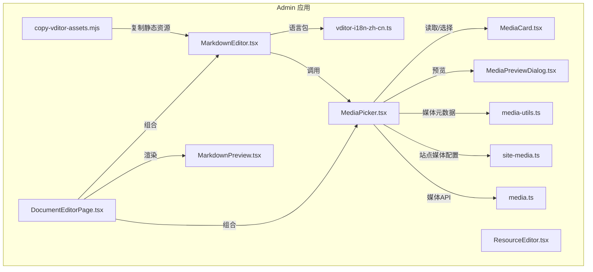
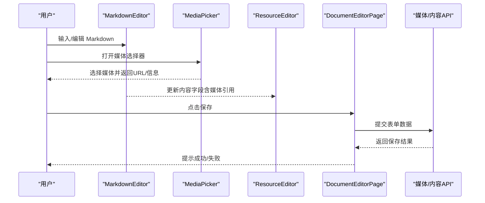
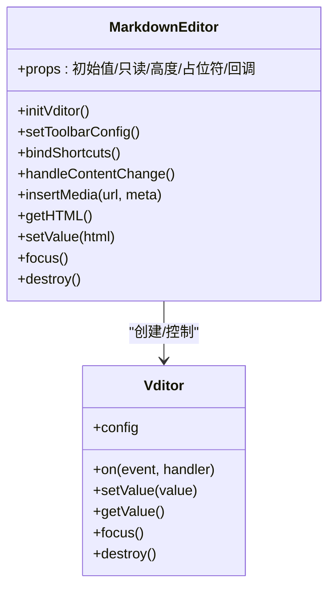
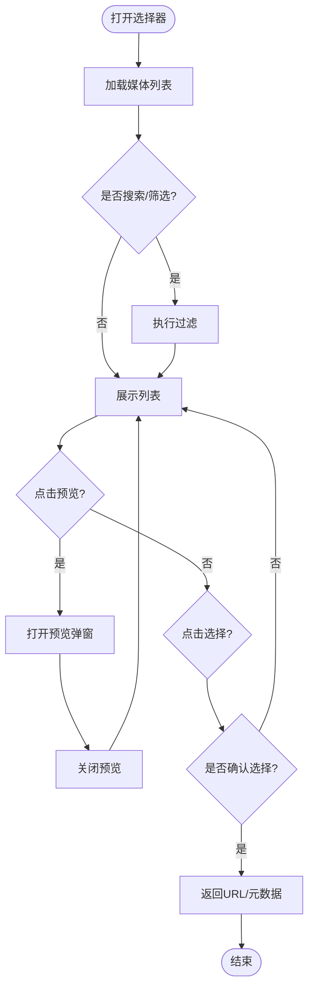
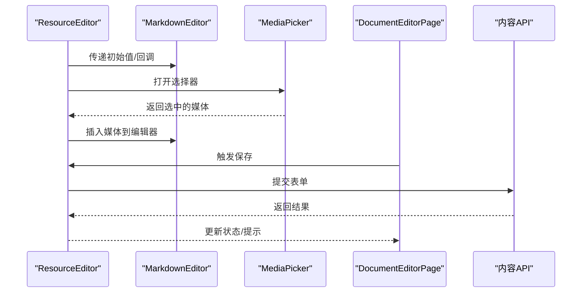
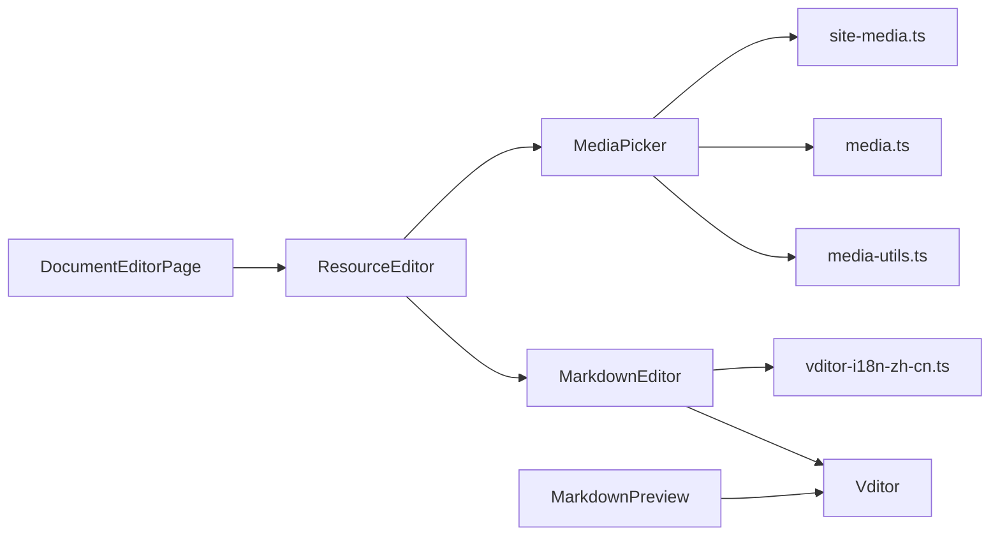

# 内容编辑器

<cite>
**本文引用的文件**   
- [MarkdownEditor.tsx](file://apps/admin/src/components/crud/MarkdownEditor.tsx)
- [MediaPicker.tsx](file://apps/admin/src/components/crud/MediaPicker.tsx)
- [ResourceEditor.tsx](file://apps/admin/src/components/crud/ResourceEditor.tsx)
- [vditor-i18n-zh-cn.ts](file://apps/admin/src/lib/vditor-i18n-zh-cn.ts)
- [copy-vditor-assets.mjs](file://apps/admin/scripts/copy-vditor-assets.mjs)
- [DocumentEditorPage.tsx](file://apps/admin/src/components/documents/DocumentEditorPage.tsx)
- [MarkdownPreview.tsx](file://apps/admin/src/components/documents/MarkdownPreview.tsx)
- [media-utils.ts](file://apps/admin/src/components/media/media-utils.ts)
- [MediaCard.tsx](file://apps/admin/src/components/media/MediaCard.tsx)
- [MediaPreviewDialog.tsx](file://apps/admin/src/components/media/MediaPreviewDialog.tsx)
- [site-media.ts](file://apps/admin/src/features/site-media.ts)
- [media.ts](file://apps/admin/src/features/media.ts)
</cite>

## 目录
1. [简介](#简介)
2. [项目结构](#项目结构)
3. [核心组件](#核心组件)
4. [架构总览](#架构总览)
5. [详细组件分析](#详细组件分析)
6. [依赖关系分析](#依赖关系分析)
7. [性能考虑](#性能考虑)
8. [故障排查指南](#故障排查指南)
9. [结论](#结论)
10. [附录](#附录)

## 简介
本章节面向内容编辑器的使用者与二次开发者，系统性说明 Vditor Markdown 编辑器在本项目中的集成方式、配置项、工具栏定制、快捷键支持、媒体资源选择器、图片上传与文件管理、主题与国际化、无障碍访问以及 API 扩展开发要点。文档以实际代码为依据，提供可视化架构图与流程图，帮助读者快速定位实现位置并安全扩展。

## 项目结构
本项目在 admin 应用中通过 React 组件封装 Vditor，并在脚本中拷贝静态资源；在文档编辑场景中组合使用 Markdown 编辑器与媒体选择器，形成“编辑—预览—媒体”的闭环工作流。

图表来源 
- [MarkdownEditor.tsx](file://apps/admin/src/components/crud/MarkdownEditor.tsx)
- [MediaPicker.tsx](file://apps/admin/src/components/crud/MediaPicker.tsx)
- [ResourceEditor.tsx](file://apps/admin/src/components/crud/ResourceEditor.tsx)
- [vditor-i18n-zh-cn.ts](file://apps/admin/src/lib/vditor-i18n-zh-cn.ts)
- [copy-vditor-assets.mjs](file://apps/admin/scripts/copy-vditor-assets.mjs)
- [DocumentEditorPage.tsx](file://apps/admin/src/components/documents/DocumentEditorPage.tsx)
- [MarkdownPreview.tsx](file://apps/admin/src/components/documents/MarkdownPreview.tsx)
- [media-utils.ts](file://apps/admin/src/components/media/media-utils.ts)
- [MediaCard.tsx](file://apps/admin/src/components/media/MediaCard.tsx)
- [MediaPreviewDialog.tsx](file://apps/admin/src/components/media/MediaPreviewDialog.tsx)
- [site-media.ts](file://apps/admin/src/features/site-media.ts)
- [media.ts](file://apps/admin/src/features/media.ts)

章节来源
- [MarkdownEditor.tsx](file://apps/admin/src/components/crud/MarkdownEditor.tsx)
- [MediaPicker.tsx](file://apps/admin/src/components/crud/MediaPicker.tsx)
- [ResourceEditor.tsx](file://apps/admin/src/components/crud/ResourceEditor.tsx)
- [vditor-i18n-zh-cn.ts](file://apps/admin/src/lib/vditor-i18n-zh-cn.ts)
- [copy-vditor-assets.mjs](file://apps/admin/scripts/copy-vditor-assets.mjs)
- [DocumentEditorPage.tsx](file://apps/admin/src/components/documents/DocumentEditorPage.tsx)
- [MarkdownPreview.tsx](file://apps/admin/src/components/documents/MarkdownPreview.tsx)
- [media-utils.ts](file://apps/admin/src/components/media/media-utils.ts)
- [MediaCard.tsx](file://apps/admin/src/components/media/MediaCard.tsx)
- [MediaPreviewDialog.tsx](file://apps/admin/src/components/media/MediaPreviewDialog.tsx)
- [site-media.ts](file://apps/admin/src/features/site-media.ts)
- [media.ts](file://apps/admin/src/features/media.ts)

## 核心组件
- MarkdownEditor：基于 Vditor 的 Markdown 编辑器封装，负责初始化、工具栏配置、快捷键、事件回调（如插入媒体）、主题与国际化注入。
- MediaPicker：媒体资源选择器，提供本地/远端媒体浏览、搜索、预览与选中回写至编辑器。
- ResourceEditor：通用资源表单容器，将 MarkdownEditor 与 MediaPicker 组合到具体业务表单中。
- DocumentEditorPage：文档编辑页面，串联编辑器、预览与保存流程。
- MarkdownPreview：Markdown 渲染预览组件，用于即时或提交后预览。
- media-utils：媒体 URL 处理、类型判断、尺寸计算等工具函数。
- MediaCard / MediaPreviewDialog：媒体卡片展示与大图预览弹窗。
- site-media / media：站点媒体配置与媒体相关 API 封装。

章节来源
- [MarkdownEditor.tsx](file://apps/admin/src/components/crud/MarkdownEditor.tsx)
- [MediaPicker.tsx](file://apps/admin/src/components/crud/MediaPicker.tsx)
- [ResourceEditor.tsx](file://apps/admin/src/components/crud/ResourceEditor.tsx)
- [DocumentEditorPage.tsx](file://apps/admin/src/components/documents/DocumentEditorPage.tsx)
- [MarkdownPreview.tsx](file://apps/admin/src/components/documents/MarkdownPreview.tsx)
- [media-utils.ts](file://apps/admin/src/components/media/media-utils.ts)
- [MediaCard.tsx](file://apps/admin/src/components/media/MediaCard.tsx)
- [MediaPreviewDialog.tsx](file://apps/admin/src/components/media/MediaPreviewDialog.tsx)
- [site-media.ts](file://apps/admin/src/features/site-media.ts)
- [media.ts](file://apps/admin/src/features/media.ts)

## 架构总览
下图展示了从用户操作到内容落库的关键路径：用户在 MarkdownEditor 中编辑，通过 MediaPicker 插入媒体，ResourceEditor 统一收集表单值，DocumentEditorPage 触发保存，最终由后端接口持久化。

图表来源 
- [MarkdownEditor.tsx](file://apps/admin/src/components/crud/MarkdownEditor.tsx)
- [MediaPicker.tsx](file://apps/admin/src/components/crud/MediaPicker.tsx)
- [ResourceEditor.tsx](file://apps/admin/src/components/crud/ResourceEditor.tsx)
- [DocumentEditorPage.tsx](file://apps/admin/src/components/documents/DocumentEditorPage.tsx)
- [media.ts](file://apps/admin/src/features/media.ts)

## 详细组件分析

### MarkdownEditor 组件分析
- 功能要点
  - Vditor 实例初始化与销毁生命周期管理
  - 工具栏定制：基础语法、表格、代码块、媒体插入等按钮显隐与顺序
  - 快捷键支持：自定义快捷键绑定与冲突处理
  - 事件回调：内容变化、粘贴处理、插入媒体、预览切换
  - 主题与国际化：注入主题样式与中文语言包
  - 无障碍：ARIA 属性、键盘导航、屏幕阅读器友好
- 关键实现点
  - 通过 props 传入初始值、只读模式、高度、占位符等
  - 监听 onChange 同步父级状态
  - 暴露 API 方法：获取内容、设置内容、聚焦、禁用等
  - 与 MediaPicker 协作：通过回调插入媒体链接或 HTML

图表来源 
- [MarkdownEditor.tsx](file://apps/admin/src/components/crud/MarkdownEditor.tsx)
- [vditor-i18n-zh-cn.ts](file://apps/admin/src/lib/vditor-i18n-zh-cn.ts)

章节来源
- [MarkdownEditor.tsx](file://apps/admin/src/components/crud/MarkdownEditor.tsx)
- [vditor-i18n-zh-cn.ts](file://apps/admin/src/lib/vditor-i18n-zh-cn.ts)

### MediaPicker 组件分析
- 功能要点
  - 媒体列表加载、分页、搜索与筛选
  - 图片/视频预览与缩略图优化
  - 多选与单选模式，选中项回写至编辑器
  - 上传入口（可选），对接媒体服务
- 交互流程
  - 打开选择器 → 加载媒体列表 → 预览 → 确认选择 → 回调插入

图表来源 
- [MediaPicker.tsx](file://apps/admin/src/components/crud/MediaPicker.tsx)
- [MediaCard.tsx](file://apps/admin/src/components/media/MediaCard.tsx)
- [MediaPreviewDialog.tsx](file://apps/admin/src/components/media/MediaPreviewDialog.tsx)
- [media-utils.ts](file://apps/admin/src/components/media/media-utils.ts)
- [media.ts](file://apps/admin/src/features/media.ts)

章节来源
- [MediaPicker.tsx](file://apps/admin/src/components/crud/MediaPicker.tsx)
- [MediaCard.tsx](file://apps/admin/src/components/media/MediaCard.tsx)
- [MediaPreviewDialog.tsx](file://apps/admin/src/components/media/MediaPreviewDialog.tsx)
- [media-utils.ts](file://apps/admin/src/components/media/media-utils.ts)
- [media.ts](file://apps/admin/src/features/media.ts)

### ResourceEditor 与 DocumentEditorPage 协作
- ResourceEditor：作为表单容器，聚合 MarkdownEditor 与 MediaPicker，统一管理校验与提交。
- DocumentEditorPage：编排编辑器与预览，处理保存逻辑与错误提示。

图表来源 
- [ResourceEditor.tsx](file://apps/admin/src/components/crud/ResourceEditor.tsx)
- [DocumentEditorPage.tsx](file://apps/admin/src/components/documents/DocumentEditorPage.tsx)
- [MarkdownEditor.tsx](file://apps/admin/src/components/crud/MarkdownEditor.tsx)
- [MediaPicker.tsx](file://apps/admin/src/components/crud/MediaPicker.tsx)

章节来源
- [ResourceEditor.tsx](file://apps/admin/src/components/crud/ResourceEditor.tsx)
- [DocumentEditorPage.tsx](file://apps/admin/src/components/documents/DocumentEditorPage.tsx)

### 媒体资源与工具链
- copy-vditor-assets.mjs：构建阶段拷贝 Vditor 静态资源到 public 目录，确保前端可访问。
- media-utils.ts：媒体 URL 规范化、类型判断、尺寸估算、占位图等工具。
- site-media.ts：站点媒体配置（如默认存储、CDN 前缀、水印策略）。
- media.ts：媒体相关 API 封装（列表、上传、删除、元数据）。

章节来源
- [copy-vditor-assets.mjs](file://apps/admin/scripts/copy-vditor-assets.mjs)
- [media-utils.ts](file://apps/admin/src/components/media/media-utils.ts)
- [site-media.ts](file://apps/admin/src/features/site-media.ts)
- [media.ts](file://apps/admin/src/features/media.ts)

### 预览与渲染
- MarkdownPreview：将 Markdown 渲染为 HTML，支持代码高亮、数学公式、表格等。
- 与编辑器联动：实时预览或提交后渲染，保持一致的样式与主题。

章节来源
- [MarkdownPreview.tsx](file://apps/admin/src/components/documents/MarkdownPreview.tsx)

## 依赖关系分析
- 组件内聚与耦合
  - MarkdownEditor 与 Vditor 强耦合，但通过封装暴露稳定 API
  - MediaPicker 与媒体 API 解耦，便于替换存储后端
  - ResourceEditor 对 MarkdownEditor 与 MediaPicker 弱耦合，通过回调通信
- 外部依赖
  - Vditor 静态资源通过脚本拷贝，避免运行时动态加载
  - 媒体服务通过统一的 API 层抽象，屏蔽底层差异

图表来源 
- [MarkdownEditor.tsx](file://apps/admin/src/components/crud/MarkdownEditor.tsx)
- [MediaPicker.tsx](file://apps/admin/src/components/crud/MediaPicker.tsx)
- [ResourceEditor.tsx](file://apps/admin/src/components/crud/ResourceEditor.tsx)
- [DocumentEditorPage.tsx](file://apps/admin/src/components/documents/DocumentEditorPage.tsx)
- [vditor-i18n-zh-cn.ts](file://apps/admin/src/lib/vditor-i18n-zh-cn.ts)
- [media-utils.ts](file://apps/admin/src/components/media/media-utils.ts)
- [media.ts](file://apps/admin/src/features/media.ts)
- [site-media.ts](file://apps/admin/src/features/site-media.ts)

章节来源
- [MarkdownEditor.tsx](file://apps/admin/src/components/crud/MarkdownEditor.tsx)
- [MediaPicker.tsx](file://apps/admin/src/components/crud/MediaPicker.tsx)
- [ResourceEditor.tsx](file://apps/admin/src/components/crud/ResourceEditor.tsx)
- [DocumentEditorPage.tsx](file://apps/admin/src/components/documents/DocumentEditorPage.tsx)
- [vditor-i18n-zh-cn.ts](file://apps/admin/src/lib/vditor-i18n-zh-cn.ts)
- [media-utils.ts](file://apps/admin/src/components/media/media-utils.ts)
- [media.ts](file://apps/admin/src/features/media.ts)
- [site-media.ts](file://apps/admin/src/features/site-media.ts)

## 性能考虑
- 资源加载
  - 构建期拷贝 Vditor 静态资源，减少运行时请求与缓存失效风险
  - 按需加载媒体缩略图与懒加载大图，降低首屏压力
- 渲染优化
  - 长文档分片渲染与虚拟滚动（若列表较大）
  - 预览时启用增量更新，避免全量重绘
- 网络优化
  - 媒体列表分页与搜索前置，减少无效请求
  - CDN 加速与缓存策略配合，提升加载速度

[本节为通用指导，不直接分析具体文件]

## 故障排查指南
- 编辑器无法显示或白屏
  - 检查 Vditor 静态资源是否已拷贝至 public 目录
  - 确认语言包是否正确注入
- 媒体选择器无数据
  - 核对媒体 API 连通性与权限
  - 检查站点媒体配置（CDN 前缀、存储桶名称）
- 插入媒体失败
  - 查看粘贴/上传回调是否被正确触发
  - 确认返回的 URL 格式是否符合预期
- 预览异常
  - 检查 Markdown 语法与 HTML 转义
  - 验证主题样式是否生效

章节来源
- [copy-vditor-assets.mjs](file://apps/admin/scripts/copy-vditor-assets.mjs)
- [vditor-i18n-zh-cn.ts](file://apps/admin/src/lib/vditor-i18n-zh-cn.ts)
- [media.ts](file://apps/admin/src/features/media.ts)
- [site-media.ts](file://apps/admin/src/features/site-media.ts)

## 结论
本项目通过模块化封装将 Vditor 编辑器与媒体选择器深度整合，形成“编辑—预览—媒体”的一体化内容生产链路。借助清晰的组件边界与稳定的 API 设计，既满足日常编辑需求，也为后续扩展（如插件、第三方存储、多语言主题）提供了良好基础。

[本节为总结性内容，不直接分析具体文件]

## 附录
- 主题配置
  - 通过 Vditor 主题选项切换明暗主题与配色方案
  - 结合 CSS 变量覆盖默认样式，保持品牌一致性
- 国际化支持
  - 使用 vditor-i18n-zh-cn.ts 注入中文文案
  - 可扩展其他语言包，按区域动态加载
- 无障碍访问
  - 为编辑器容器添加 ARIA 标签与角色
  - 确保键盘可达性与屏幕阅读器可读
- API 扩展
  - 在 MarkdownEditor 中注册自定义工具栏按钮与快捷键
  - 在 MediaPicker 中扩展筛选维度与上传策略

[本节为概念性补充，不直接分析具体文件]