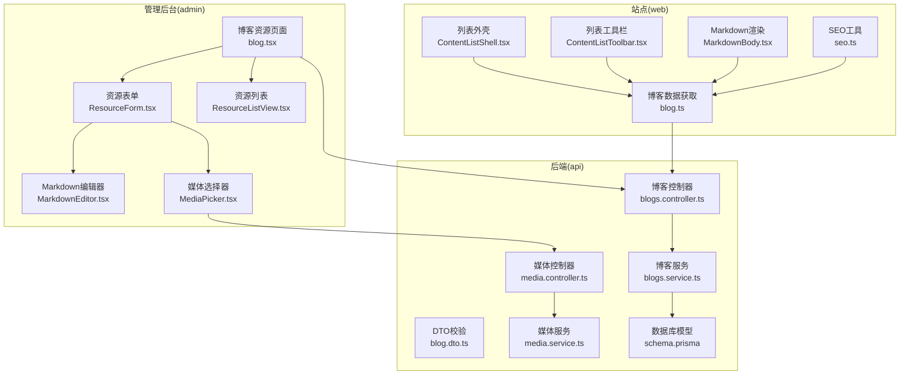
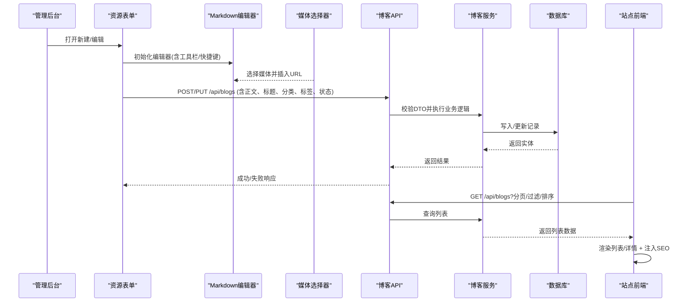
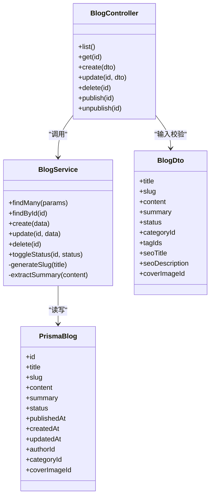
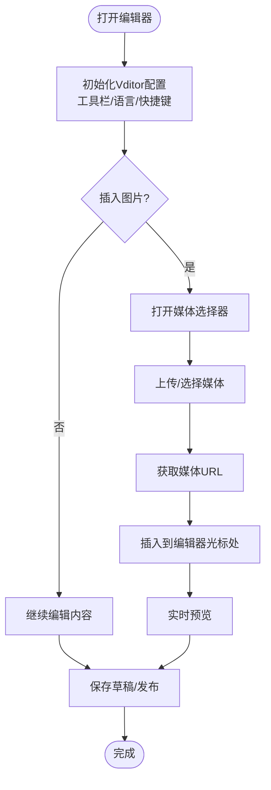
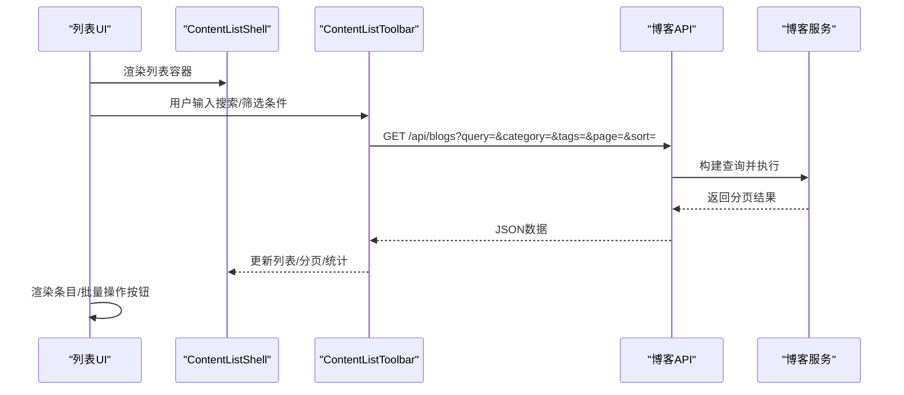
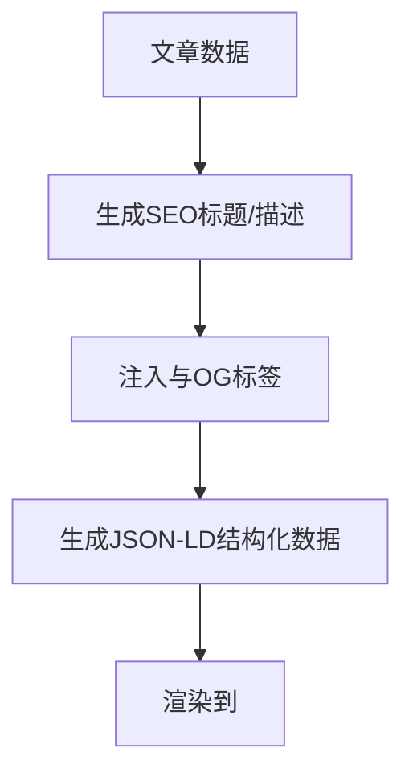
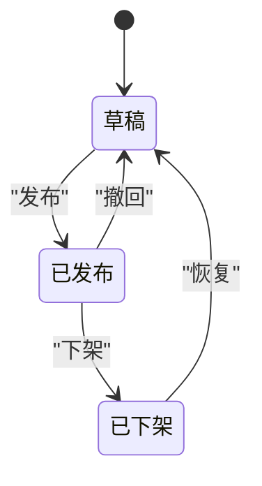
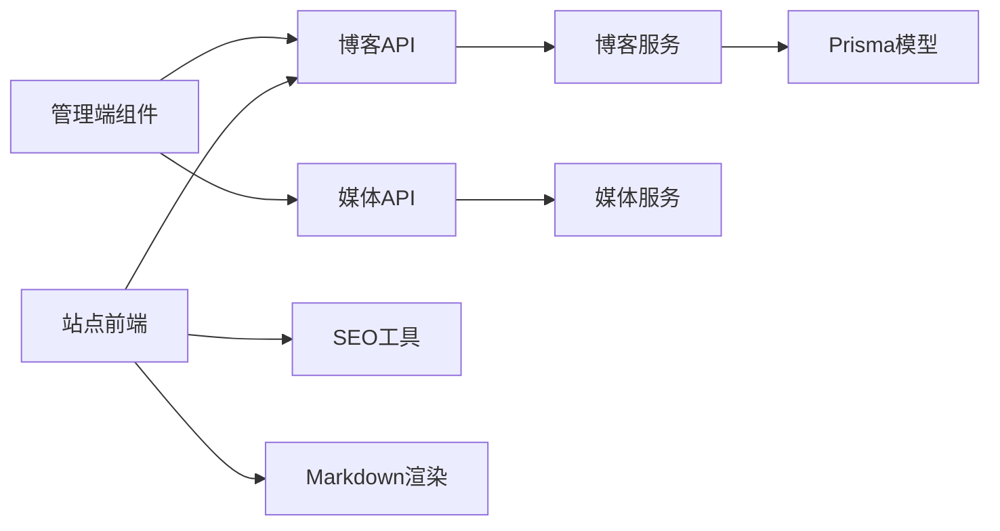

# 博客管理

<cite>
**本文引用的文件**   
- [blogs.controller.ts](file://apps/api/src/blogs/blogs.controller.ts)
- [blogs.service.ts](file://apps/api/src/blogs/blogs.service.ts)
- [blog.dto.ts](file://apps/api/src/blogs/dto/blog.dto.ts)
- [schema.prisma](file://apps/api/prisma/schema.prisma)
- [content-status.enum.ts](file://apps/api/src/common/enums/content-status.enum.ts)
- [markdown.ts](file://apps/api/src/common/utils/markdown.ts)
- [slug.ts](file://apps/api/src/common/utils/slug.ts)
- [media.controller.ts](file://apps/api/src/media/media.controller.ts)
- [media.service.ts](file://apps/api/src/media/media.service.ts)
- [MediaPicker.tsx](file://apps/admin/src/components/crud/MediaPicker.tsx)
- [MarkdownEditor.tsx](file://apps/admin/src/components/crud/MarkdownEditor.tsx)
- [ResourceForm.tsx](file://apps/admin/src/components/crud/ResourceForm.tsx)
- [ResourceListView.tsx](file://apps/admin/src/components/crud/ResourceListView.tsx)
- [config.ts](file://apps/admin/src/components/crud/config.ts)
- [blog.tsx](file://apps/admin/src/features/resources/blog.tsx)
- [blog.ts](file://apps/web/src/lib/blog.ts)
- [seo.ts](file://apps/web/src/lib/seo.ts)
- [ContentListShell.tsx](file://apps/web/src/components/content/ContentListShell.tsx)
- [ContentListToolbar.tsx](file://apps/web/src/components/content/ContentListToolbar.tsx)
- [MarkdownBody.tsx](file://apps/web/src/components/content/MarkdownBody.tsx)
</cite>

## 目录
1. [简介](#简介)
2. [项目结构](#项目结构)
3. [核心组件](#核心组件)
4. [架构总览](#架构总览)
5. [详细组件分析](#详细组件分析)
6. [依赖关系分析](#依赖关系分析)
7. [性能考量](#性能考量)
8. [故障排查指南](#故障排查指南)
9. [结论](#结论)
10. [附录](#附录)

## 简介
本文件面向“博客内容管理”的完整实现，覆盖后台管理端与前端展示端的协作方式。重点包括：
- 博客文章的创建、编辑、发布流程
- SEO优化能力（标题、描述、结构化数据等）
- 分类管理与标签系统
- 富文本编辑器配置（Vditor）、图片上传与媒体资源管理
- 博客列表视图、搜索过滤与批量操作
- 博客API接口说明与数据模型定义

## 项目结构
本项目采用前后端分离的多应用架构：
- apps/admin：Next.js 管理后台，提供博客CRUD、媒体选择器、富文本编辑器集成、列表与工具栏等
- apps/api：NestJS 后端服务，提供博客、媒体、权限、设置等API，使用Prisma访问数据库
- apps/web：Next.js 站点前端，负责博客列表、详情渲染、SEO与搜索

图表来源
- [blog.tsx](file://apps/admin/src/features/resources/blog.tsx)
- [ResourceForm.tsx](file://apps/admin/src/components/crud/ResourceForm.tsx)
- [MarkdownEditor.tsx](file://apps/admin/src/components/crud/MarkdownEditor.tsx)
- [MediaPicker.tsx](file://apps/admin/src/components/crud/MediaPicker.tsx)
- [ResourceListView.tsx](file://apps/admin/src/components/crud/ResourceListView.tsx)
- [blogs.controller.ts](file://apps/api/src/blogs/blogs.controller.ts)
- [blogs.service.ts](file://apps/api/src/blogs/blogs.service.ts)
- [media.controller.ts](file://apps/api/src/media/media.controller.ts)
- [media.service.ts](file://apps/api/src/media/media.service.ts)
- [schema.prisma](file://apps/api/prisma/schema.prisma)
- [blog.ts](file://apps/web/src/lib/blog.ts)
- [seo.ts](file://apps/web/src/lib/seo.ts)
- [ContentListShell.tsx](file://apps/web/src/components/content/ContentListShell.tsx)
- [ContentListToolbar.tsx](file://apps/web/src/components/content/ContentListToolbar.tsx)
- [MarkdownBody.tsx](file://apps/web/src/components/content/MarkdownBody.tsx)

章节来源
- [blog.tsx](file://apps/admin/src/features/resources/blog.tsx)
- [blogs.controller.ts](file://apps/api/src/blogs/blogs.controller.ts)
- [blogs.service.ts](file://apps/api/src/blogs/blogs.service.ts)
- [schema.prisma](file://apps/api/prisma/schema.prisma)
- [blog.ts](file://apps/web/src/lib/blog.ts)

## 核心组件
- 管理端博客资源页：聚合表单、编辑器、媒体选择器与列表操作
- 资源表单：统一封装字段校验、保存草稿/发布、状态切换
- Markdown编辑器：基于Vditor，支持预览、快捷键、本地/远程图片插入
- 媒体选择器：对接媒体API，支持上传、预览、选择并插入到编辑器
- 后端博客模块：REST API、DTO校验、业务逻辑、数据库映射
- 媒体模块：上传、存储、URL生成、水印等
- 站点博客库：服务端数据获取、分页、排序、过滤；SEO元信息注入；Markdown渲染

章节来源
- [ResourceForm.tsx](file://apps/admin/src/components/crud/ResourceForm.tsx)
- [MarkdownEditor.tsx](file://apps/admin/src/components/crud/MarkdownEditor.tsx)
- [MediaPicker.tsx](file://apps/admin/src/components/crud/MediaPicker.tsx)
- [blogs.controller.ts](file://apps/api/src/blogs/blogs.controller.ts)
- [blogs.service.ts](file://apps/api/src/blogs/blogs.service.ts)
- [media.controller.ts](file://apps/api/src/media/media.controller.ts)
- [media.service.ts](file://apps/api/src/media/media.service.ts)
- [blog.ts](file://apps/web/src/lib/blog.ts)

## 架构总览
博客管理的端到端流程如下：
- 管理员在后台编辑文章，通过表单提交至后端API
- 后端校验DTO、处理业务逻辑（生成slug、摘要、时间戳等），持久化到数据库
- 媒体资源通过媒体API上传并返回可访问URL，编辑器将URL嵌入内容
- 站点侧通过博客库拉取数据，渲染列表与详情，同时注入SEO元信息与结构化数据

图表来源
- [ResourceForm.tsx](file://apps/admin/src/components/crud/ResourceForm.tsx)
- [MarkdownEditor.tsx](file://apps/admin/src/components/crud/MarkdownEditor.tsx)
- [MediaPicker.tsx](file://apps/admin/src/components/crud/MediaPicker.tsx)
- [blogs.controller.ts](file://apps/api/src/blogs/blogs.controller.ts)
- [blogs.service.ts](file://apps/api/src/blogs/blogs.service.ts)
- [blog.ts](file://apps/web/src/lib/blog.ts)

## 详细组件分析

### 博客API与数据模型
- 控制器：定义博客相关REST路由（列表、详情、创建、更新、删除、状态变更等）
- DTO：字段校验规则（标题、正文、分类、标签、状态、SEO字段等）
- 服务：业务逻辑（slug生成、摘要提取、发布时间、作者信息、状态流转）
- 数据模型：通过Prisma定义博客实体、分类、标签、媒体关联等

图表来源
- [blogs.controller.ts](file://apps/api/src/blogs/blogs.controller.ts)
- [blogs.service.ts](file://apps/api/src/blogs/blogs.service.ts)
- [blog.dto.ts](file://apps/api/src/blogs/dto/blog.dto.ts)
- [schema.prisma](file://apps/api/prisma/schema.prisma)

章节来源
- [blogs.controller.ts](file://apps/api/src/blogs/blogs.controller.ts)
- [blogs.service.ts](file://apps/api/src/blogs/blogs.service.ts)
- [blog.dto.ts](file://apps/api/src/blogs/dto/blog.dto.ts)
- [schema.prisma](file://apps/api/prisma/schema.prisma)

### 富文本编辑器与媒体资源管理
- Markdown编辑器：基于Vditor，支持实时预览、快捷键、代码高亮、表格、数学公式等
- 媒体选择器：对接媒体API，支持上传、预览、选择并插入到编辑器光标位置
- 媒体服务：处理上传、存储、URL生成、水印、跨域等

图表来源
- [MarkdownEditor.tsx](file://apps/admin/src/components/crud/MarkdownEditor.tsx)
- [MediaPicker.tsx](file://apps/admin/src/components/crud/MediaPicker.tsx)
- [media.controller.ts](file://apps/api/src/media/media.controller.ts)
- [media.service.ts](file://apps/api/src/media/media.service.ts)

章节来源
- [MarkdownEditor.tsx](file://apps/admin/src/components/crud/MarkdownEditor.tsx)
- [MediaPicker.tsx](file://apps/admin/src/components/crud/MediaPicker.tsx)
- [media.controller.ts](file://apps/api/src/media/media.controller.ts)
- [media.service.ts](file://apps/api/src/media/media.service.ts)

### 博客列表、搜索过滤与批量操作
- 列表外壳：统一布局、分页、加载状态、错误处理
- 工具栏：搜索框、分类筛选、标签筛选、排序、批量操作（发布/下架/删除）
- 数据获取：服务端分页、过滤、排序，减少前端压力

图表来源
- [ContentListShell.tsx](file://apps/web/src/components/content/ContentListShell.tsx)
- [ContentListToolbar.tsx](file://apps/web/src/components/content/ContentListToolbar.tsx)
- [blogs.controller.ts](file://apps/api/src/blogs/blogs.controller.ts)
- [blogs.service.ts](file://apps/api/src/blogs/blogs.service.ts)

章节来源
- [ContentListShell.tsx](file://apps/web/src/components/content/ContentListShell.tsx)
- [ContentListToolbar.tsx](file://apps/web/src/components/content/ContentListToolbar.tsx)
- [blogs.controller.ts](file://apps/api/src/blogs/blogs.controller.ts)
- [blogs.service.ts](file://apps/api/src/blogs/blogs.service.ts)

### SEO优化功能
- 标题与描述：支持自定义SEO标题与描述，优先于默认生成
- 结构化数据：为博客文章注入Article或BlogPosting JSON-LD
- 元标签与OpenGraph：确保分享卡片与搜索引擎抓取效果

图表来源
- [seo.ts](file://apps/web/src/lib/seo.ts)
- [blog.ts](file://apps/web/src/lib/blog.ts)

章节来源
- [seo.ts](file://apps/web/src/lib/seo.ts)
- [blog.ts](file://apps/web/src/lib/blog.ts)

### 分类管理与标签系统
- 分类：用于组织文章主题，支持按分类筛选与归档
- 标签：细粒度关键词，支持多标签组合筛选
- 关联：文章与分类、标签多对多关系，便于检索与推荐

章节来源
- [schema.prisma](file://apps/api/prisma/schema.prisma)
- [blog.dto.ts](file://apps/api/src/blogs/dto/blog.dto.ts)

### 发布流程与状态管理
- 状态枚举：草稿、已发布、已下架等
- 状态流转：从草稿到发布，支持回退与批量操作
- 审计与时间戳：记录创建、更新时间与发布时刻

图表来源
- [content-status.enum.ts](file://apps/api/src/common/enums/content-status.enum.ts)

章节来源
- [content-status.enum.ts](file://apps/api/src/common/enums/content-status.enum.ts)
- [blogs.service.ts](file://apps/api/src/blogs/blogs.service.ts)

## 依赖关系分析
- 管理端依赖：资源表单、编辑器、媒体选择器、列表组件
- 后端依赖：控制器→服务→Prisma模型；媒体控制器→媒体服务→存储
- 站点端依赖：博客库→API；SEO工具→元数据注入；Markdown渲染→内容解析

图表来源
- [ResourceForm.tsx](file://apps/admin/src/components/crud/ResourceForm.tsx)
- [MarkdownEditor.tsx](file://apps/admin/src/components/crud/MarkdownEditor.tsx)
- [MediaPicker.tsx](file://apps/admin/src/components/crud/MediaPicker.tsx)
- [blogs.controller.ts](file://apps/api/src/blogs/blogs.controller.ts)
- [blogs.service.ts](file://apps/api/src/blogs/blogs.service.ts)
- [media.controller.ts](file://apps/api/src/media/media.controller.ts)
- [media.service.ts](file://apps/api/src/media/media.service.ts)
- [schema.prisma](file://apps/api/prisma/schema.prisma)
- [blog.ts](file://apps/web/src/lib/blog.ts)
- [seo.ts](file://apps/web/src/lib/seo.ts)
- [MarkdownBody.tsx](file://apps/web/src/components/content/MarkdownBody.tsx)

章节来源
- [ResourceForm.tsx](file://apps/admin/src/components/crud/ResourceForm.tsx)
- [blogs.controller.ts](file://apps/api/src/blogs/blogs.controller.ts)
- [blogs.service.ts](file://apps/api/src/blogs/blogs.service.ts)
- [media.controller.ts](file://apps/api/src/media/media.controller.ts)
- [media.service.ts](file://apps/api/src/media/media.service.ts)
- [schema.prisma](file://apps/api/prisma/schema.prisma)
- [blog.ts](file://apps/web/src/lib/blog.ts)
- [seo.ts](file://apps/web/src/lib/seo.ts)
- [MarkdownBody.tsx](file://apps/web/src/components/content/MarkdownBody.tsx)

## 性能考量
- 服务端分页与过滤：减少数据传输量，提升列表加载速度
- 懒加载与缓存：媒体资源按需加载，合理设置CDN与缓存策略
- 编辑器优化：增量渲染、防抖保存、避免大文档阻塞主线程
- SEO与渲染：服务端预渲染关键元数据，减少客户端计算开销

[本节为通用指导，不直接分析具体文件]

## 故障排查指南
- 编辑器无法插入图片：检查媒体上传接口权限、CORS配置、URL可达性
- 列表加载缓慢：确认分页参数、索引是否命中、网络请求是否重复
- 发布失败：检查DTO校验规则、状态枚举值、数据库约束
- SEO未生效：确认<meta>与JSON-LD是否正确注入，浏览器缓存是否清理

章节来源
- [media.controller.ts](file://apps/api/src/media/media.controller.ts)
- [media.service.ts](file://apps/api/src/media/media.service.ts)
- [blog.dto.ts](file://apps/api/src/blogs/dto/blog.dto.ts)
- [content-status.enum.ts](file://apps/api/src/common/enums/content-status.enum.ts)
- [seo.ts](file://apps/web/src/lib/seo.ts)

## 结论
本博客管理系统以模块化设计实现完整的CRUD、媒体管理与SEO能力，前后端职责清晰，易于扩展与维护。建议在生产环境启用CDN、缓存与监控，持续优化用户体验与性能。

[本节为总结，不直接分析具体文件]

## 附录

### 博客API接口概览
- 列表：GET /api/blogs，支持分页、排序、过滤（分类、标签、关键词）
- 详情：GET /api/blogs/:id
- 创建：POST /api/blogs，包含标题、正文、分类、标签、状态、SEO字段
- 更新：PUT /api/blogs/:id
- 删除：DELETE /api/blogs/:id
- 状态变更：PATCH /api/blogs/:id/status，支持发布/下架

章节来源
- [blogs.controller.ts](file://apps/api/src/blogs/blogs.controller.ts)
- [blog.dto.ts](file://apps/api/src/blogs/dto/blog.dto.ts)

### 数据模型说明
- 博客实体：包含标题、slug、正文、摘要、状态、发布时间、作者、封面、分类、标签等
- 分类与标签：独立实体，与博客多对多关联
- 媒体资源：独立实体，支持类型、URL、尺寸、水印等信息

章节来源
- [schema.prisma](file://apps/api/prisma/schema.prisma)