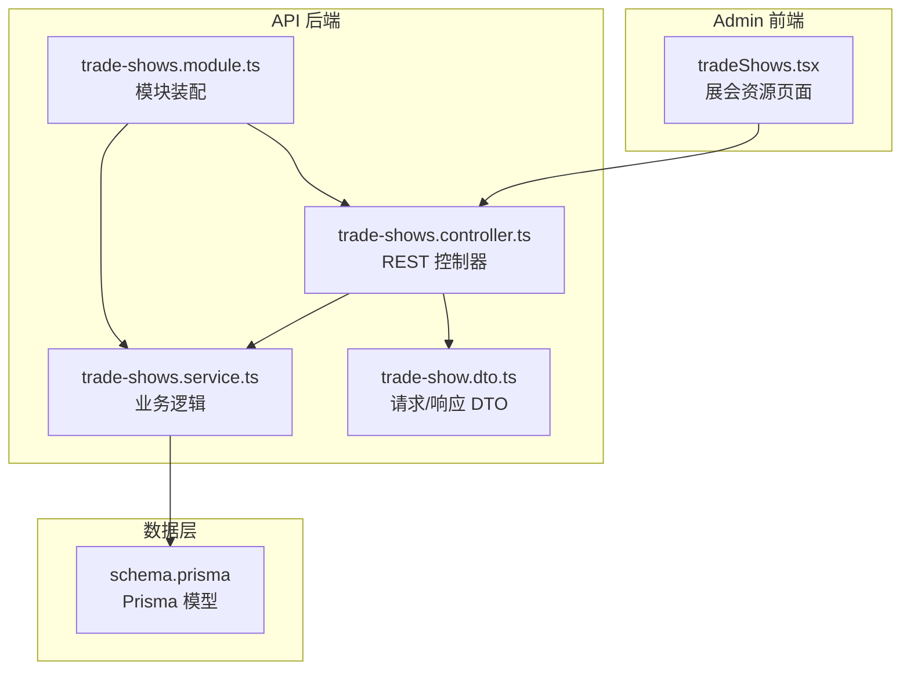
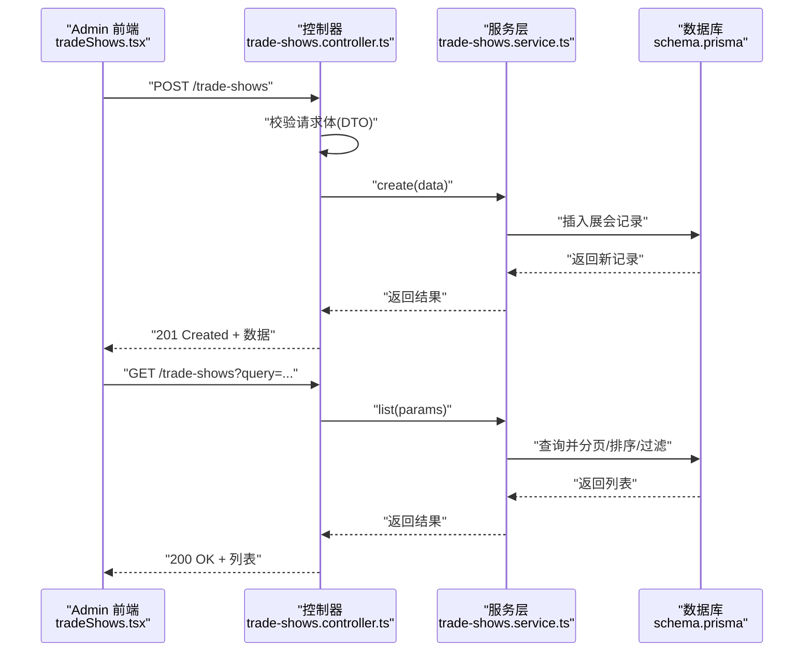
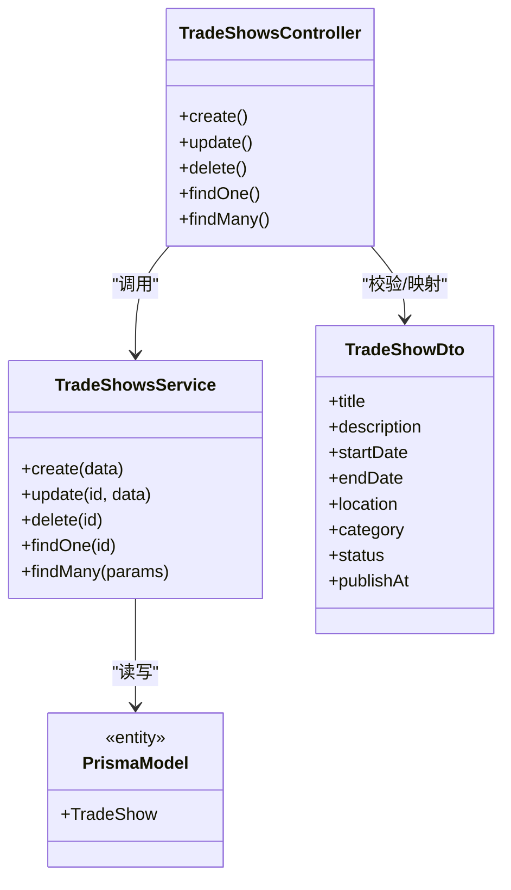
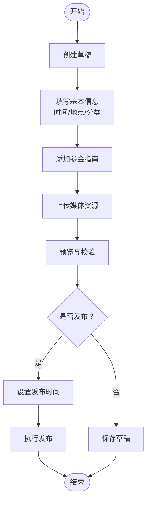

# 展会管理

<cite>
**本文引用的文件**   
- [trade-shows.controller.ts](file://apps/api/src/trade-shows/trade-shows.controller.ts)
- [trade-shows.service.ts](file://apps/api/src/trade-shows/trade-shows.service.ts)
- [trade-show.dto.ts](file://apps/api/src/trade-shows/dto/trade-show.dto.ts)
- [trade-shows.module.ts](file://apps/api/src/trade-shows/trade-shows.module.ts)
- [tradeShows.tsx](file://apps/admin/src/features/resources/tradeShows.tsx)
- [schema.prisma](file://apps/api/prisma/schema.prisma)
</cite>

## 目录
1. [简介](#简介)
2. [项目结构](#项目结构)
3. [核心组件](#核心组件)
4. [架构总览](#架构总览)
5. [详细组件分析](#详细组件分析)
6. [依赖关系分析](#依赖关系分析)
7. [性能考虑](#性能考虑)
8. [故障排查指南](#故障排查指南)
9. [结论](#结论)
10. [附录：API 接口与数据模型](#附录api-接口与数据模型)

## 简介
本文件面向“展会内容管理”的创建、编辑、发布与展示全流程，覆盖展会时间管理、地点信息、参会指南、分类与状态管理、展示配置、列表管理与搜索、以及报名集成。文档同时提供后端 API 接口说明与数据模型说明，帮助前后端开发者快速对接与扩展。

## 项目结构
展会功能在前后端均有实现：
- 后端（NestJS）：位于 apps/api/src/trade-shows，包含控制器、服务、DTO 与模块注册。
- 前端（Next.js Admin）：位于 apps/admin/src/features/resources/tradeShows.tsx，用于后台资源管理与表单交互。
- 数据库模型：位于 apps/api/prisma/schema.prisma，定义展会实体及字段。

图表来源 
- [trade-shows.controller.ts](file://apps/api/src/trade-shows/trade-shows.controller.ts)
- [trade-shows.service.ts](file://apps/api/src/trade-shows/trade-shows.service.ts)
- [trade-show.dto.ts](file://apps/api/src/trade-shows/dto/trade-show.dto.ts)
- [trade-shows.module.ts](file://apps/api/src/trade-shows/trade-shows.module.ts)
- [schema.prisma](file://apps/api/prisma/schema.prisma)

章节来源
- [trade-shows.controller.ts](file://apps/api/src/trade-shows/trade-shows.controller.ts)
- [trade-shows.service.ts](file://apps/api/src/trade-shows/trade-shows.service.ts)
- [trade-show.dto.ts](file://apps/api/src/trade-shows/dto/trade-show.dto.ts)
- [trade-shows.module.ts](file://apps/api/src/trade-shows/trade-shows.module.ts)
- [tradeShows.tsx](file://apps/admin/src/features/resources/tradeShows.tsx)
- [schema.prisma](file://apps/api/prisma/schema.prisma)

## 核心组件
- 控制器（Controller）：暴露 REST 接口，处理路由、参数校验与响应格式化。
- 服务（Service）：封装业务逻辑，包括展会的增删改查、状态流转、排序分页、搜索过滤等。
- DTO：定义请求体与响应体的字段约束与类型。
- 模块（Module）：聚合控制器与服务，完成依赖注入与生命周期管理。
- 前端资源页：提供展会数据的可视化编辑、列表展示与操作入口。

章节来源
- [trade-shows.controller.ts](file://apps/api/src/trade-shows/trade-shows.controller.ts)
- [trade-shows.service.ts](file://apps/api/src/trade-shows/trade-shows.service.ts)
- [trade-show.dto.ts](file://apps/api/src/trade-shows/dto/trade-show.dto.ts)
- [trade-shows.module.ts](file://apps/api/src/trade-shows/trade-shows.module.ts)
- [tradeShows.tsx](file://apps/admin/src/features/resources/tradeShows.tsx)

## 架构总览
展会管理的整体调用链如下：
- 前端通过 Next.js Admin 页面发起 HTTP 请求至后端控制器。
- 控制器进行参数校验后调用服务层执行具体业务。
- 服务层访问 Prisma 数据层读写数据库。
- 响应经控制器统一格式返回给前端。

图表来源 
- [trade-shows.controller.ts](file://apps/api/src/trade-shows/trade-shows.controller.ts)
- [trade-shows.service.ts](file://apps/api/src/trade-shows/trade-shows.service.ts)
- [schema.prisma](file://apps/api/prisma/schema.prisma)

## 详细组件分析

### 控制器（Controller）
职责：
- 定义 REST 路由（如创建、更新、删除、获取详情、列表查询）。
- 使用 DTO 对输入进行校验与类型转换。
- 将服务层返回的数据标准化为响应。

关键点：
- 路由命名遵循 RESTful 风格。
- 错误码与异常由全局过滤器或拦截器统一处理（可结合系统通用能力）。
- 支持查询参数（分页、排序、筛选）透传到服务层。

章节来源
- [trade-shows.controller.ts](file://apps/api/src/trade-shows/trade-shows.controller.ts)
- [trade-show.dto.ts](file://apps/api/src/trade-shows/dto/trade-show.dto.ts)

### 服务（Service）
职责：
- 实现展会的 CRUD 逻辑。
- 处理状态管理（草稿、已发布、已归档等）。
- 实现列表查询的分页、排序与多条件过滤。
- 可选：与报名系统集成，生成报名链接或回调。

关键点：
- 使用事务保证数据一致性（如创建展会与关联媒体同步）。
- 对敏感字段（如联系人邮箱）做脱敏或权限控制。
- 对时间范围、地点信息进行规范化存储与检索。

章节来源
- [trade-shows.service.ts](file://apps/api/src/trade-shows/trade-shows.service.ts)

### DTO（数据传输对象）
职责：
- 定义创建/更新请求体的字段、类型与校验规则。
- 定义列表查询参数（分页、排序、筛选）。
- 定义响应体结构，确保前后端契约稳定。

关键点：
- 必填字段与默认值明确。
- 枚举类型用于状态、分类等固定取值。
- 时间字段采用 ISO 8601 字符串或时间戳。

章节来源
- [trade-show.dto.ts](file://apps/api/src/trade-shows/dto/trade-show.dto.ts)

### 模块（Module）
职责：
- 注册控制器与服务，完成依赖注入。
- 导入必要的中间件、拦截器、管道等。
- 配置跨域、鉴权、审计等横切关注点。

章节来源
- [trade-shows.module.ts](file://apps/api/src/trade-shows/trade-shows.module.ts)

### 前端资源页（Admin）
职责：
- 提供展会数据的可视化编辑界面（表单、富文本、媒体选择）。
- 展示展会列表，支持搜索、分页、批量操作。
- 触发创建、编辑、发布、删除等操作，并处理反馈。

关键点：
- 表单校验与错误提示。
- 与后端 API 的异步交互与重试机制。
- 国际化与本地化文案。

章节来源
- [tradeShows.tsx](file://apps/admin/src/features/resources/tradeShows.tsx)

## 依赖关系分析
- 控制器依赖服务与 DTO。
- 服务依赖数据层（Prisma）与可能的第三方服务（如报名系统、邮件通知）。
- 前端依赖后端 API 契约（路由、参数、响应结构）。

图表来源 
- [trade-shows.controller.ts](file://apps/api/src/trade-shows/trade-shows.controller.ts)
- [trade-shows.service.ts](file://apps/api/src/trade-shows/trade-shows.service.ts)
- [trade-show.dto.ts](file://apps/api/src/trade-shows/dto/trade-show.dto.ts)
- [schema.prisma](file://apps/api/prisma/schema.prisma)

章节来源
- [trade-shows.controller.ts](file://apps/api/src/trade-shows/trade-shows.controller.ts)
- [trade-shows.service.ts](file://apps/api/src/trade-shows/trade-shows.service.ts)
- [trade-show.dto.ts](file://apps/api/src/trade-shows/dto/trade-show.dto.ts)
- [schema.prisma](file://apps/api/prisma/schema.prisma)

## 性能考虑
- 列表查询应支持分页、排序与索引优化，避免全表扫描。
- 富文本与媒体资源建议异步加载与懒渲染。
- 缓存热点数据（如已发布的展会列表），减少数据库压力。
- 对大字段（描述、参会指南）进行分片或延迟加载。

[本节为通用指导，不直接分析具体文件]

## 故障排查指南
常见问题与定位方法：
- 参数校验失败：检查 DTO 定义与前端传参是否一致。
- 权限不足：确认用户角色与权限策略配置。
- 数据不一致：检查事务与并发更新逻辑。
- 搜索无结果：确认索引与查询条件是否正确。
- 报名集成失败：检查第三方服务回调与错误码处理。

章节来源
- [trade-shows.controller.ts](file://apps/api/src/trade-shows/trade-shows.controller.ts)
- [trade-shows.service.ts](file://apps/api/src/trade-shows/trade-shows.service.ts)

## 结论
展会管理模块以清晰的层次结构与稳定的 API 契约为基础，支持完整的创建、编辑、发布与展示流程。通过合理的 DTO、服务层逻辑与前端资源页，可实现高效的展会内容运营与用户参与体验。后续可扩展报名集成、数据分析与多渠道分发能力。

[本节为总结性内容，不直接分析具体文件]

## 附录：API 接口与数据模型

### 数据模型（Prisma）
- 实体：TradeShow
- 关键字段（示例）：标题、描述、开始时间、结束时间、地点、分类、状态、发布时间、参会指南、媒体资源等。
- 关系：可与媒体、报名订单、评论等实体建立关联（按需扩展）。

章节来源
- [schema.prisma](file://apps/api/prisma/schema.prisma)

### 接口清单（RESTful）
- 创建展会
  - 方法：POST
  - 路径：/trade-shows
  - 请求体：基于 DTO 的创建参数
  - 响应：新建的展会数据
- 更新展会
  - 方法：PATCH/PUT
  - 路径：/trade-shows/:id
  - 请求体：基于 DTO 的更新参数
  - 响应：更新后的展会数据
- 删除展会
  - 方法：DELETE
  - 路径：/trade-shows/:id
  - 响应：成功状态
- 获取详情
  - 方法：GET
  - 路径：/trade-shows/:id
  - 响应：展会详情
- 列表查询
  - 方法：GET
  - 路径：/trade-shows
  - 查询参数：分页、排序、筛选（分类、状态、时间范围、关键词）
  - 响应：展会列表与分页元信息

章节来源
- [trade-shows.controller.ts](file://apps/api/src/trade-shows/trade-shows.controller.ts)
- [trade-show.dto.ts](file://apps/api/src/trade-shows/dto/trade-show.dto.ts)

### 业务流程图（创建与发布）

[该图为概念流程图，不直接映射到具体源文件]