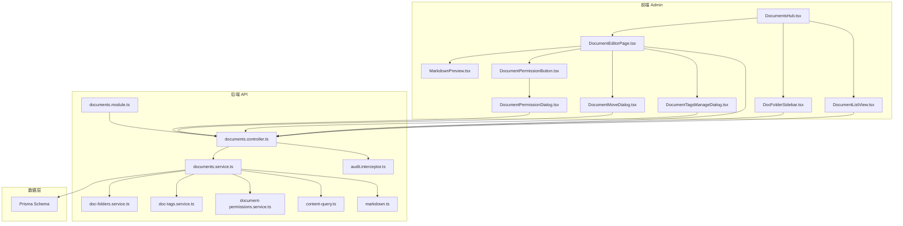
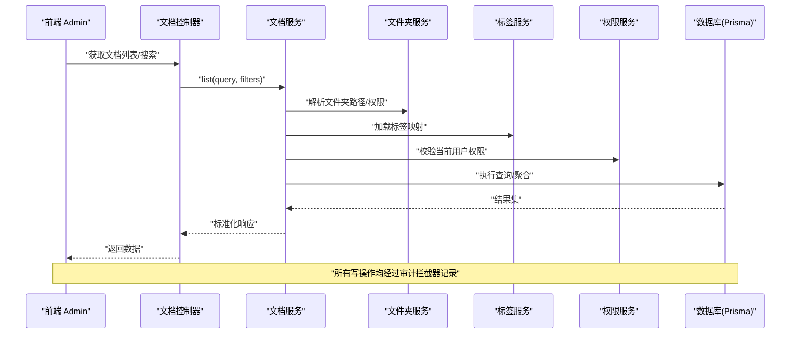
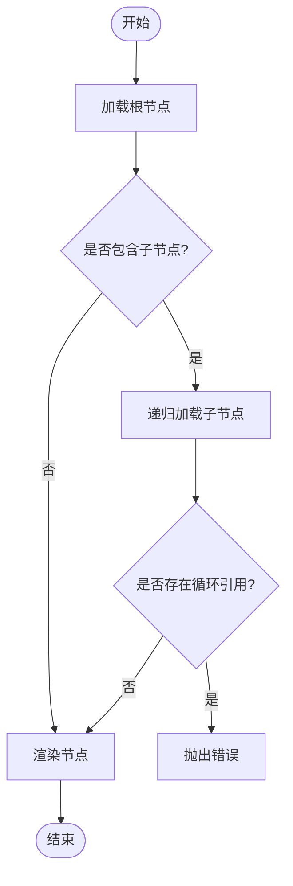
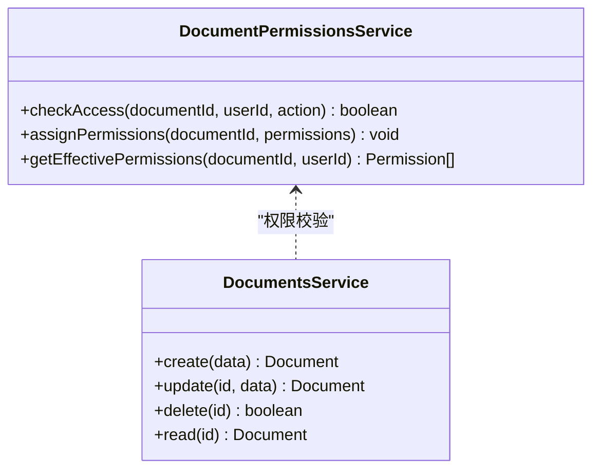
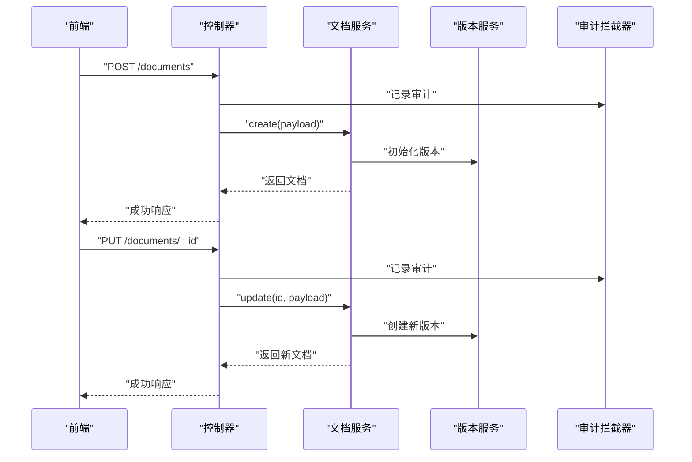
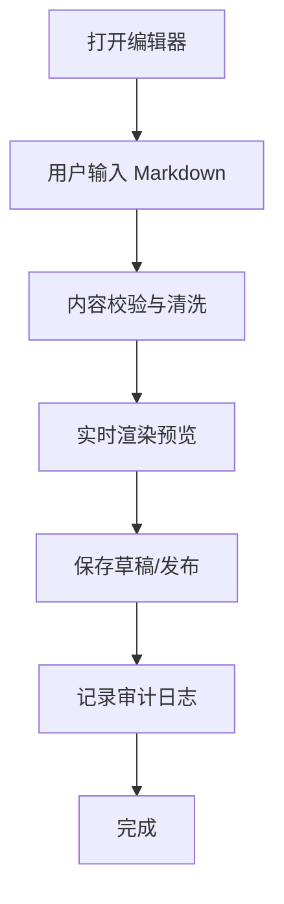
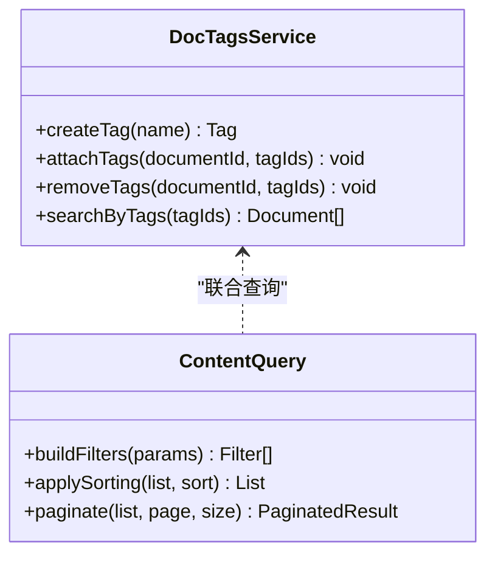
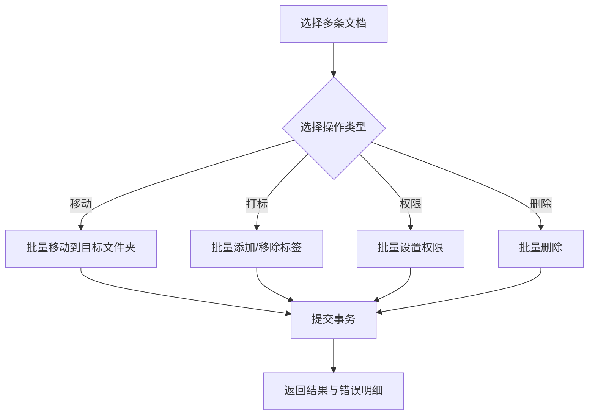
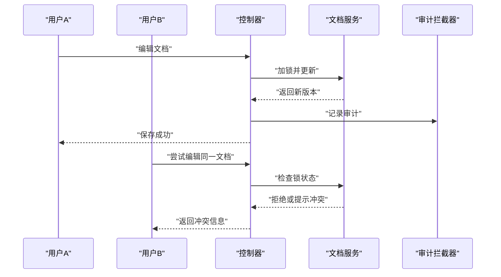
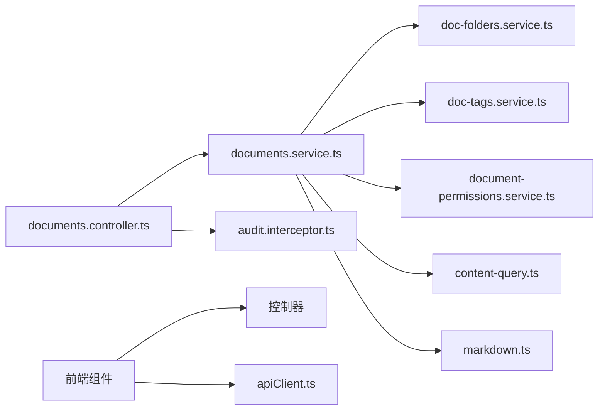

# 文档管理

<cite>
**本文引用的文件**   
- [documents.controller.ts](file://apps/api/src/documents/documents.controller.ts)
- [documents.service.ts](file://apps/api/src/documents/documents.service.ts)
- [doc-folders.service.ts](file://apps/api/src/documents/doc-folders.service.ts)
- [doc-tags.service.ts](file://apps/api/src/documents/doc-tags.service.ts)
- [document-permissions.service.ts](file://apps/api/src/documents/document-permissions.service.ts)
- [document.dto.ts](file://apps/api/src/documents/dto/document.dto.ts)
- [document-permission.dto.ts](file://apps/api/src/documents/dto/document-permission.dto.ts)
- [documents.module.ts](file://apps/api/src/documents/documents.module.ts)
- [audit.interceptor.ts](file://apps/api/src/common/interceptors/audit.interceptor.ts)
- [content-query.ts](file://apps/api/src/common/utils/content-query.ts)
- [markdown.ts](file://apps/api/src/common/utils/markdown.ts)
- [documents.tsx](file://apps/admin/src/features/resources/documents.tsx)
- [DocumentsHub.tsx](file://apps/admin/src/components/documents/DocumentsHub.tsx)
- [DocumentListView.tsx](file://apps/admin/src/components/documents/DocumentListView.tsx)
- [DocFolderSidebar.tsx](file://apps/admin/src/components/documents/DocFolderSidebar.tsx)
- [DocumentEditorPage.tsx](file://apps/admin/src/components/documents/DocumentEditorPage.tsx)
- [MarkdownPreview.tsx](file://apps/admin/src/components/documents/MarkdownPreview.tsx)
- [DocumentTagsManageDialog.tsx](file://apps/admin/src/components/documents/DocumentTagsManageDialog.tsx)
- [DocumentMoveDialog.tsx](file://apps/admin/src/components/documents/DocumentMoveDialog.tsx)
- [DocumentPermissionButton.tsx](file://apps/admin/src/components/DocumentPermissionButton.tsx)
- [DocumentPermissionDialog.tsx](file://apps/admin/src/components/DocumentPermissionDialog.tsx)
- [apiClient.ts](file://apps/admin/src/lib/apiClient.ts)
- [schema.prisma](file://apps/api/prisma/schema.prisma)
</cite>

## 目录
1. [简介](#简介)
2. [项目结构](#项目结构)
3. [核心组件](#核心组件)
4. [架构总览](#架构总览)
5. [详细组件分析](#详细组件分析)
6. [依赖关系分析](#依赖关系分析)
7. [性能考量](#性能考量)
8. [故障排查指南](#故障排查指南)
9. [结论](#结论)
10. [附录](#附录)

## 简介
本模块提供企业级文档管理能力，涵盖文档树形结构、文件夹管理、权限控制、CRUD 操作、Markdown 编辑器与实时预览、标签系统、搜索、批量操作、版本管理、协作编辑与审计日志，以及迁移工具与 API 接口说明。前端基于 Next.js Admin 应用，后端采用 NestJS 微服务风格模块化设计，数据持久化通过 Prisma 与数据库交互。

## 项目结构
文档管理功能横跨前后端：
- 后端（NestJS）
  - 控制器层：路由与请求校验
  - 服务层：业务逻辑、权限校验、搜索与聚合
  - DTO：入参出参与校验
  - 通用中间件/拦截器：审计日志、转换等
  - Prisma Schema：文档、文件夹、标签、权限等模型定义
- 前端（Next.js Admin）
  - 资源页面与列表视图：文档树、列表、搜索、批量操作
  - 编辑器与预览：Vditor Markdown 编辑器与实时预览
  - 对话框：移动、标签管理、权限设置
  - 特性配置：资源路由与表单配置

图表来源
- [documents.controller.ts](file://apps/api/src/documents/documents.controller.ts)
- [documents.service.ts](file://apps/api/src/documents/documents.service.ts)
- [doc-folders.service.ts](file://apps/api/src/documents/doc-folders.service.ts)
- [doc-tags.service.ts](file://apps/api/src/documents/doc-tags.service.ts)
- [document-permissions.service.ts](file://apps/api/src/documents/document-permissions.service.ts)
- [documents.module.ts](file://apps/api/src/documents/documents.module.ts)
- [audit.interceptor.ts](file://apps/api/src/common/interceptors/audit.interceptor.ts)
- [content-query.ts](file://apps/api/src/common/utils/content-query.ts)
- [markdown.ts](file://apps/api/src/common/utils/markdown.ts)
- [schema.prisma](file://apps/api/prisma/schema.prisma)
- [DocumentsHub.tsx](file://apps/admin/src/components/documents/DocumentsHub.tsx)
- [DocumentListView.tsx](file://apps/admin/src/components/documents/DocumentListView.tsx)
- [DocFolderSidebar.tsx](file://apps/admin/src/components/documents/DocFolderSidebar.tsx)
- [DocumentEditorPage.tsx](file://apps/admin/src/components/documents/DocumentEditorPage.tsx)
- [MarkdownPreview.tsx](file://apps/admin/src/components/documents/MarkdownPreview.tsx)
- [DocumentTagsManageDialog.tsx](file://apps/admin/src/components/documents/DocumentTagsManageDialog.tsx)
- [DocumentMoveDialog.tsx](file://apps/admin/src/components/documents/DocumentMoveDialog.tsx)
- [DocumentPermissionButton.tsx](file://apps/admin/src/components/DocumentPermissionButton.tsx)
- [DocumentPermissionDialog.tsx](file://apps/admin/src/components/DocumentPermissionDialog.tsx)

章节来源
- [documents.controller.ts](file://apps/api/src/documents/documents.controller.ts)
- [documents.service.ts](file://apps/api/src/documents/documents.service.ts)
- [documents.module.ts](file://apps/api/src/documents/documents.module.ts)
- [DocumentsHub.tsx](file://apps/admin/src/components/documents/DocumentsHub.tsx)
- [DocumentListView.tsx](file://apps/admin/src/components/documents/DocumentListView.tsx)
- [DocFolderSidebar.tsx](file://apps/admin/src/components/documents/DocFolderSidebar.tsx)
- [DocumentEditorPage.tsx](file://apps/admin/src/components/documents/DocumentEditorPage.tsx)
- [MarkdownPreview.tsx](file://apps/admin/src/components/documents/MarkdownPreview.tsx)
- [DocumentTagsManageDialog.tsx](file://apps/admin/src/components/documents/DocumentTagsManageDialog.tsx)
- [DocumentMoveDialog.tsx](file://apps/admin/src/components/documents/DocumentMoveDialog.tsx)
- [DocumentPermissionButton.tsx](file://apps/admin/src/components/DocumentPermissionButton.tsx)
- [DocumentPermissionDialog.tsx](file://apps/admin/src/components/DocumentPermissionDialog.tsx)

## 核心组件
- 控制器层
  - 统一暴露文档相关 REST 接口，负责参数校验、鉴权装饰器、响应封装与审计记录。
- 服务层
  - documents.service.ts：文档 CRUD、版本管理、搜索与摘要生成、权限检查、批量操作。
  - doc-folders.service.ts：文件夹树构建、层级校验、移动与重命名。
  - doc-tags.service.ts：标签创建、关联、去重与统计。
  - document-permissions.service.ts：文档级权限分配、继承策略与权限合并。
- DTO
  - document.dto.ts：文档创建/更新/查询的输入输出结构。
  - document-permission.dto.ts：权限分配的数据契约。
- 通用能力
  - audit.interceptor.ts：自动记录关键操作的审计日志。
  - content-query.ts：统一的列表查询、过滤、排序与分页。
  - markdown.ts：Markdown 处理工具（如摘要提取、安全清洗）。
- 前端
  - DocumentsHub.tsx：文档中心入口，组织侧边栏、列表与编辑器。
  - DocumentListView.tsx：列表展示、搜索、批量选择与操作。
  - DocFolderSidebar.tsx：文件夹树导航与拖拽。
  - DocumentEditorPage.tsx：集成 Vditor 编辑器与实时预览。
  - MarkdownPreview.tsx：Markdown 渲染与样式适配。
  - DocumentTagsManageDialog.tsx：标签管理与批量打标。
  - DocumentMoveDialog.tsx：跨文件夹移动与复制。
  - DocumentPermissionButton.tsx / DocumentPermissionDialog.tsx：权限设置与授权弹窗。

章节来源
- [documents.controller.ts](file://apps/api/src/documents/documents.controller.ts)
- [documents.service.ts](file://apps/api/src/documents/documents.service.ts)
- [doc-folders.service.ts](file://apps/api/src/documents/doc-folders.service.ts)
- [doc-tags.service.ts](file://apps/api/src/documents/doc-tags.service.ts)
- [document-permissions.service.ts](file://apps/api/src/documents/document-permissions.service.ts)
- [document.dto.ts](file://apps/api/src/documents/dto/document.dto.ts)
- [document-permission.dto.ts](file://apps/api/src/documents/dto/document-permission.dto.ts)
- [audit.interceptor.ts](file://apps/api/src/common/interceptors/audit.interceptor.ts)
- [content-query.ts](file://apps/api/src/common/utils/content-query.ts)
- [markdown.ts](file://apps/api/src/common/utils/markdown.ts)
- [DocumentsHub.tsx](file://apps/admin/src/components/documents/DocumentsHub.tsx)
- [DocumentListView.tsx](file://apps/admin/src/components/documents/DocumentListView.tsx)
- [DocFolderSidebar.tsx](file://apps/admin/src/components/documents/DocFolderSidebar.tsx)
- [DocumentEditorPage.tsx](file://apps/admin/src/components/documents/DocumentEditorPage.tsx)
- [MarkdownPreview.tsx](file://apps/admin/src/components/documents/MarkdownPreview.tsx)
- [DocumentTagsManageDialog.tsx](file://apps/admin/src/components/documents/DocumentTagsManageDialog.tsx)
- [DocumentMoveDialog.tsx](file://apps/admin/src/components/documents/DocumentMoveDialog.tsx)
- [DocumentPermissionButton.tsx](file://apps/admin/src/components/DocumentPermissionButton.tsx)
- [DocumentPermissionDialog.tsx](file://apps/admin/src/components/DocumentPermissionDialog.tsx)

## 架构总览
文档管理采用前后端分离与分层架构：
- 前端通过 apiClient 调用后端 REST API，使用 React Hooks 进行状态管理。
- 控制器接收请求并委派给服务层；服务层组合多个子服务完成复杂业务。
- 审计拦截器在控制器层自动记录操作轨迹。
- 数据访问由 Prisma 抽象，确保类型安全与一致性。

图表来源
- [documents.controller.ts](file://apps/api/src/documents/documents.controller.ts)
- [documents.service.ts](file://apps/api/src/documents/documents.service.ts)
- [doc-folders.service.ts](file://apps/api/src/documents/doc-folders.service.ts)
- [doc-tags.service.ts](file://apps/api/src/documents/doc-tags.service.ts)
- [document-permissions.service.ts](file://apps/api/src/documents/document-permissions.service.ts)
- [audit.interceptor.ts](file://apps/api/src/common/interceptors/audit.interceptor.ts)
- [schema.prisma](file://apps/api/prisma/schema.prisma)

## 详细组件分析

### 文档树形结构与文件夹管理
- 树形构建
  - 基于父节点 ID 或路径字段递归构建层级结构，支持按名称、更新时间排序。
  - 文件夹服务提供层级校验（避免循环引用）、路径规范化与深度限制。
- 移动与重命名
  - 移动时校验目标文件夹存在性与权限，必要时更新路径与索引字段。
  - 重命名需校验唯一性并触发审计日志。
- 前端交互
  - 侧边栏展示树形结构，支持展开/折叠、右键菜单、拖拽排序。

图表来源
- [doc-folders.service.ts](file://apps/api/src/documents/doc-folders.service.ts)
- [documents.service.ts](file://apps/api/src/documents/documents.service.ts)
- [DocFolderSidebar.tsx](file://apps/admin/src/components/documents/DocFolderSidebar.tsx)

章节来源
- [doc-folders.service.ts](file://apps/api/src/documents/doc-folders.service.ts)
- [documents.service.ts](file://apps/api/src/documents/documents.service.ts)
- [DocFolderSidebar.tsx](file://apps/admin/src/components/documents/DocFolderSidebar.tsx)

### 权限控制机制
- 权限模型
  - 文档级权限可覆盖默认继承策略（如团队/角色），支持读/写/管理等多粒度。
  - 权限合并规则：精确匹配优先于继承，拒绝显式优于允许隐式。
- 校验流程
  - 读取：检查公开可见性或用户具备读权限。
  - 写入：检查写权限或管理权限。
  - 删除：仅管理权限允许。
- 前端展示
  - 根据权限动态显示操作按钮与编辑能力。

图表来源
- [document-permissions.service.ts](file://apps/api/src/documents/document-permissions.service.ts)
- [documents.service.ts](file://apps/api/src/documents/documents.service.ts)
- [document-permission.dto.ts](file://apps/api/src/documents/dto/document-permission.dto.ts)

章节来源
- [document-permissions.service.ts](file://apps/api/src/documents/document-permissions.service.ts)
- [document-permission.dto.ts](file://apps/api/src/documents/dto/document-permission.dto.ts)
- [DocumentPermissionButton.tsx](file://apps/admin/src/components/DocumentPermissionButton.tsx)
- [DocumentPermissionDialog.tsx](file://apps/admin/src/components/DocumentPermissionDialog.tsx)

### 文档 CRUD 与版本管理
- 创建与更新
  - 支持标题、内容（Markdown）、元数据（作者、描述、封面）、标签与权限。
  - 更新时自动生成新版本记录，保留历史快照。
- 删除与恢复
  - 软删除标记，支持回收站与定时清理。
- 版本对比
  - 提供差异对比与回滚能力，便于协作审阅。

图表来源
- [documents.controller.ts](file://apps/api/src/documents/documents.controller.ts)
- [documents.service.ts](file://apps/api/src/documents/documents.service.ts)
- [audit.interceptor.ts](file://apps/api/src/common/interceptors/audit.interceptor.ts)

章节来源
- [documents.controller.ts](file://apps/api/src/documents/documents.controller.ts)
- [documents.service.ts](file://apps/api/src/documents/documents.service.ts)
- [document.dto.ts](file://apps/api/src/documents/dto/document.dto.ts)

### Markdown 编辑器与实时预览
- 编辑器集成
  - 使用 Vditor 实现所见即所得编辑，支持工具栏、快捷键与扩展插件。
  - 内容保存前进行基础校验与清洗。
- 实时预览
  - 监听输入事件，增量渲染预览区域，优化滚动与性能。
- 导出与分享
  - 支持导出为 PDF/HTML，生成只读链接供外部查看。

图表来源
- [DocumentEditorPage.tsx](file://apps/admin/src/components/documents/DocumentEditorPage.tsx)
- [MarkdownPreview.tsx](file://apps/admin/src/components/documents/MarkdownPreview.tsx)
- [markdown.ts](file://apps/api/src/common/utils/markdown.ts)
- [audit.interceptor.ts](file://apps/api/src/common/interceptors/audit.interceptor.ts)

章节来源
- [DocumentEditorPage.tsx](file://apps/admin/src/components/documents/DocumentEditorPage.tsx)
- [MarkdownPreview.tsx](file://apps/admin/src/components/documents/MarkdownPreview.tsx)
- [markdown.ts](file://apps/api/src/common/utils/markdown.ts)

### 标签系统与搜索
- 标签系统
  - 标签可全局或文档级存在，支持分类与层级。
  - 批量打标与去重，统计每个标签下的文档数量。
- 搜索功能
  - 全文检索与多条件过滤（标题、标签、文件夹、时间范围）。
  - 高亮关键词与分页加载。

图表来源
- [doc-tags.service.ts](file://apps/api/src/documents/doc-tags.service.ts)
- [content-query.ts](file://apps/api/src/common/utils/content-query.ts)

章节来源
- [doc-tags.service.ts](file://apps/api/src/documents/doc-tags.service.ts)
- [DocumentTagsManageDialog.tsx](file://apps/admin/src/components/documents/DocumentTagsManageDialog.tsx)
- [content-query.ts](file://apps/api/src/common/utils/content-query.ts)
- [DocumentListView.tsx](file://apps/admin/src/components/documents/DocumentListView.tsx)

### 批量操作
- 批量选择与操作
  - 支持多选后批量移动、打标签、修改权限、删除等。
- 事务与回滚
  - 批量写操作以事务包裹，失败回滚并返回明细错误。

图表来源
- [documents.service.ts](file://apps/api/src/documents/documents.service.ts)
- [DocumentListView.tsx](file://apps/admin/src/components/documents/DocumentListView.tsx)

章节来源
- [documents.service.ts](file://apps/api/src/documents/documents.service.ts)
- [DocumentListView.tsx](file://apps/admin/src/components/documents/DocumentListView.tsx)

### 协作编辑与审计日志
- 协作编辑
  - 基于锁定与冲突检测，避免多人同时编辑同一文档导致覆盖。
  - 可选开启实时同步（WebSocket）提升协作体验。
- 审计日志
  - 记录操作人、时间、IP、变更内容与影响范围。
  - 支持按文档、用户、时间范围筛选审计记录。

图表来源
- [documents.controller.ts](file://apps/api/src/documents/documents.controller.ts)
- [documents.service.ts](file://apps/api/src/documents/documents.service.ts)
- [audit.interceptor.ts](file://apps/api/src/common/interceptors/audit.interceptor.ts)

章节来源
- [documents.controller.ts](file://apps/api/src/documents/documents.controller.ts)
- [documents.service.ts](file://apps/api/src/documents/documents.service.ts)
- [audit.interceptor.ts](file://apps/api/src/common/interceptors/audit.interceptor.ts)

### 迁移工具与 API 接口说明
- 迁移工具
  - 提供脚本用于从旧版数据结构迁移到新版 Schema，包括字段映射、数据清洗与校验。
  - 支持幂等执行与回滚脚本。
- API 接口
  - 文档 CRUD：创建、读取、更新、删除、批量操作。
  - 文件夹管理：创建、重命名、移动、层级查询。
  - 标签管理：创建、关联、解绑、统计。
  - 权限管理：分配、撤销、查询有效权限。
  - 搜索与列表：过滤、排序、分页、高亮。
  - 版本管理：版本列表、差异对比、回滚。
  - 审计日志：查询与导出。

章节来源
- [documents.controller.ts](file://apps/api/src/documents/documents.controller.ts)
- [documents.service.ts](file://apps/api/src/documents/documents.service.ts)
- [doc-folders.service.ts](file://apps/api/src/documents/doc-folders.service.ts)
- [doc-tags.service.ts](file://apps/api/src/documents/doc-tags.service.ts)
- [document-permissions.service.ts](file://apps/api/src/documents/document-permissions.service.ts)
- [document.dto.ts](file://apps/api/src/documents/dto/document.dto.ts)
- [document-permission.dto.ts](file://apps/api/src/documents/dto/document-permission.dto.ts)
- [schema.prisma](file://apps/api/prisma/schema.prisma)

## 依赖关系分析
- 模块内依赖
  - 控制器依赖服务层，服务层组合文件夹、标签、权限等子服务。
  - 通用工具（查询、Markdown、审计）被多处复用。
- 前后端耦合点
  - 通过 DTO 与 API 契约约束前后端数据结构。
  - 前端通过 apiClient 统一发起请求，集中处理鉴权与重试。

图表来源
- [documents.controller.ts](file://apps/api/src/documents/documents.controller.ts)
- [documents.service.ts](file://apps/api/src/documents/documents.service.ts)
- [doc-folders.service.ts](file://apps/api/src/documents/doc-folders.service.ts)
- [doc-tags.service.ts](file://apps/api/src/documents/doc-tags.service.ts)
- [document-permissions.service.ts](file://apps/api/src/documents/document-permissions.service.ts)
- [content-query.ts](file://apps/api/src/common/utils/content-query.ts)
- [markdown.ts](file://apps/api/src/common/utils/markdown.ts)
- [audit.interceptor.ts](file://apps/api/src/common/interceptors/audit.interceptor.ts)
- [apiClient.ts](file://apps/admin/src/lib/apiClient.ts)

章节来源
- [documents.controller.ts](file://apps/api/src/documents/documents.controller.ts)
- [documents.service.ts](file://apps/api/src/documents/documents.service.ts)
- [apiClient.ts](file://apps/admin/src/lib/apiClient.ts)

## 性能考量
- 查询优化
  - 使用索引字段（如文件夹路径、标签 ID）加速过滤与排序。
  - 分页与懒加载减少首屏压力。
- 缓存策略
  - 对热点文档与标签统计启用短期缓存。
  - 预览渲染结果可缓存以减少重复计算。
- 并发控制
  - 协作编辑引入乐观锁或分布式锁，避免写冲突。
- 前端优化
  - 编辑器防抖与增量渲染，避免频繁重排。
  - 图片与媒体资源按需加载与压缩。

[本节为通用指导，不直接分析具体文件]

## 故障排查指南
- 常见问题
  - 权限不足：检查用户角色与文档权限分配，确认继承策略生效。
  - 循环引用：文件夹层级校验失败，检查父子关系与路径字段。
  - 搜索无结果：确认分词与索引是否正确，检查过滤条件。
  - 协作冲突：查看锁状态与版本差异，提示用户合并更改。
- 调试建议
  - 启用审计日志定位问题操作。
  - 使用开发环境日志与断点跟踪服务层逻辑。
  - 前端网络面板检查请求与响应格式。

章节来源
- [audit.interceptor.ts](file://apps/api/src/common/interceptors/audit.interceptor.ts)
- [documents.service.ts](file://apps/api/src/documents/documents.service.ts)
- [doc-folders.service.ts](file://apps/api/src/documents/doc-folders.service.ts)
- [doc-tags.service.ts](file://apps/api/src/documents/doc-tags.service.ts)
- [document-permissions.service.ts](file://apps/api/src/documents/document-permissions.service.ts)

## 结论
文档管理模块提供了完整的文档生命周期管理能力，涵盖树形结构、权限控制、CRUD、Markdown 编辑与预览、标签与搜索、批量操作、版本管理、协作与审计。通过清晰的分层架构与完善的工具链，能够满足企业级文档协作与治理需求。建议在大规模场景下进一步优化缓存与并发控制，并完善迁移与监控能力。

[本节为总结，不直接分析具体文件]

## 附录
- 资源配置
  - 前端资源路由与表单配置位于 features/resources/documents.tsx，定义页面行为与字段映射。
- 数据模型
  - Prisma Schema 定义了文档、文件夹、标签、权限等实体及其关系。

章节来源
- [documents.tsx](file://apps/admin/src/features/resources/documents.tsx)
- [schema.prisma](file://apps/api/prisma/schema.prisma)