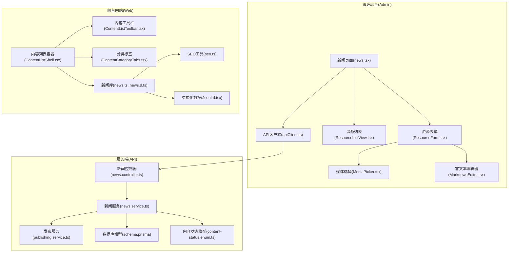
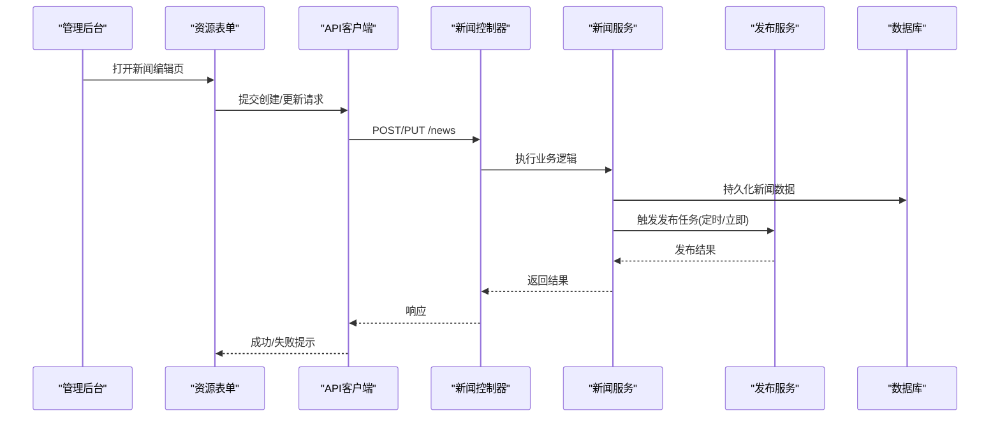
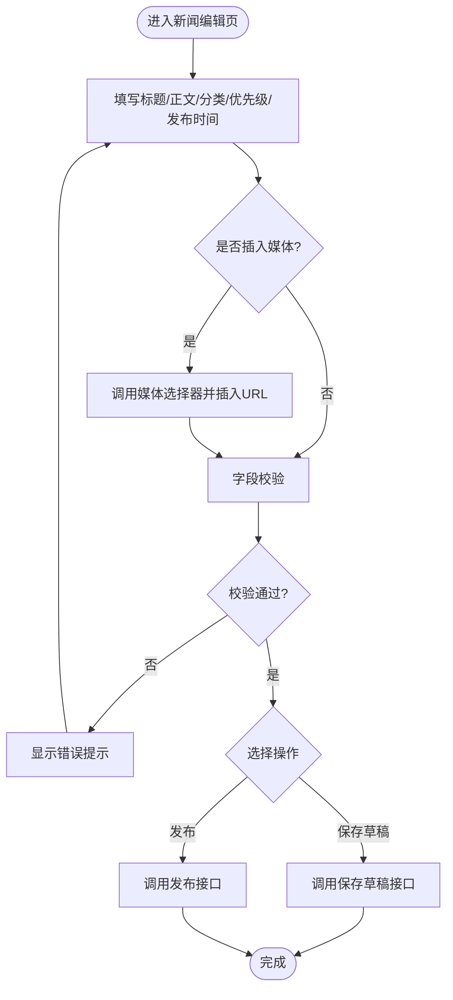
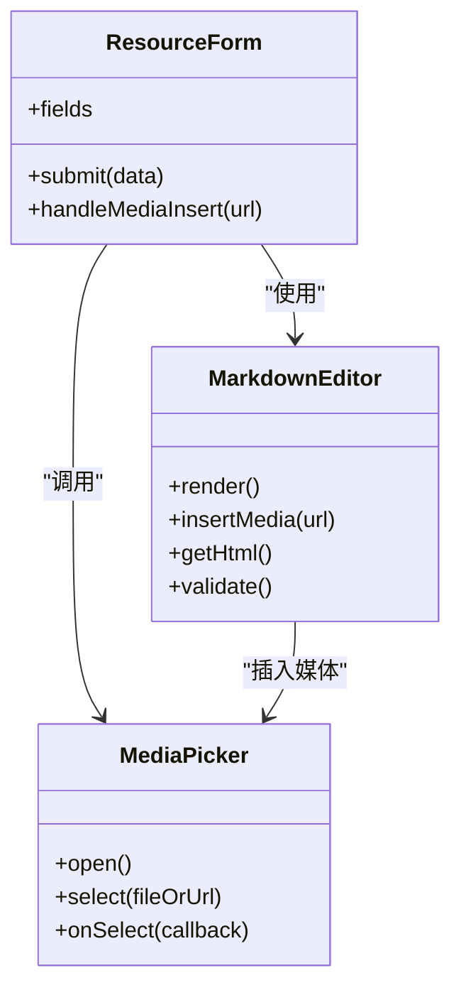
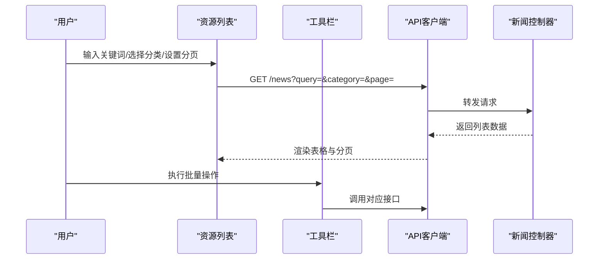
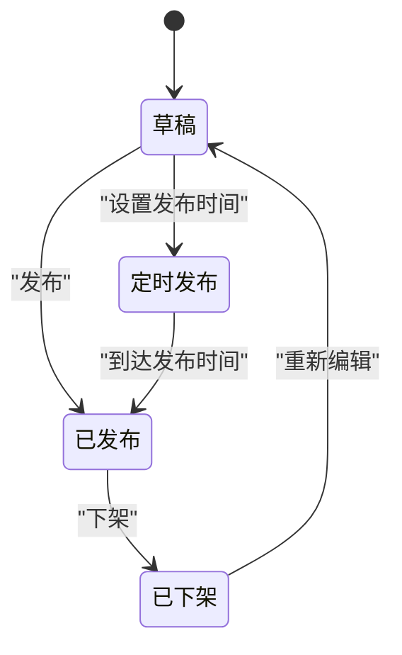
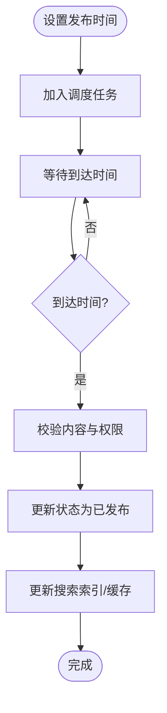
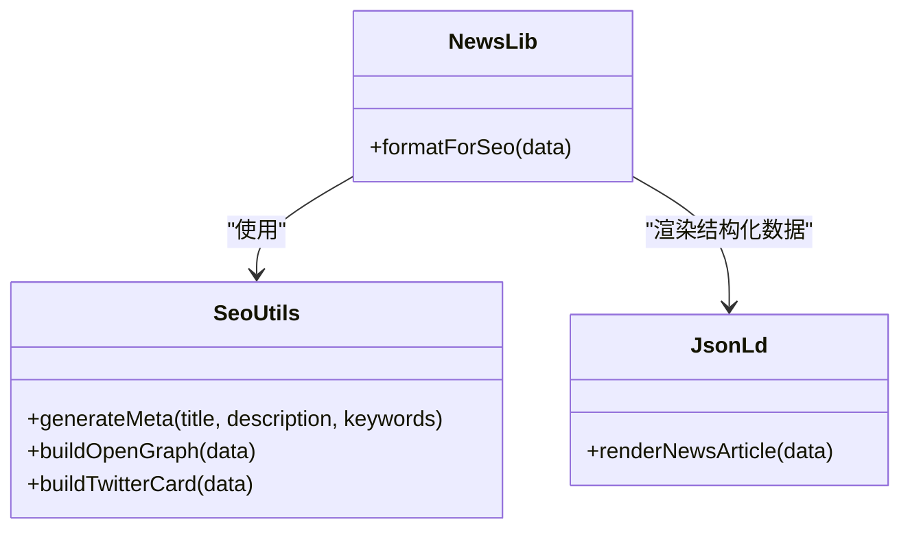
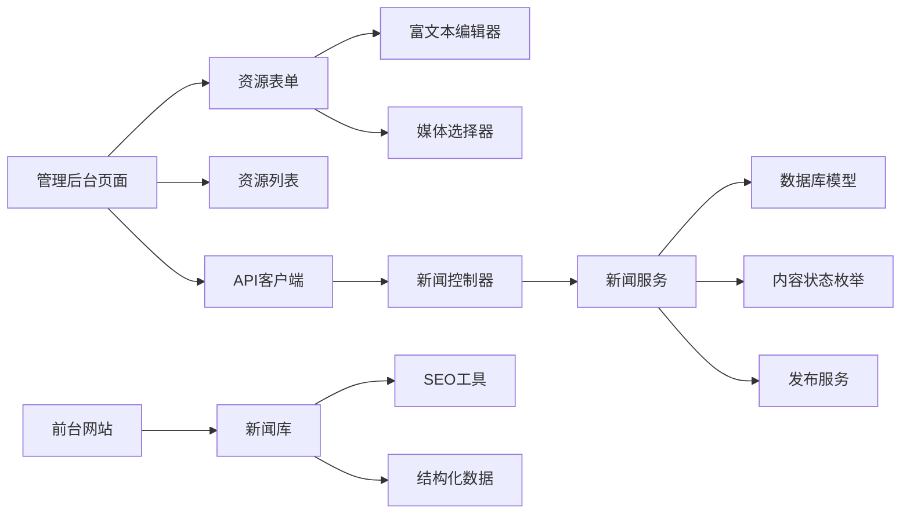
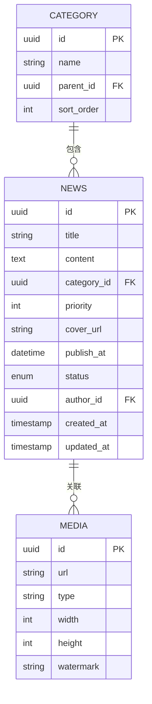

# 新闻管理

<cite>
**本文引用的文件**   
- [news.controller.ts](file://apps/api/src/news/news.controller.ts)
- [news.service.ts](file://apps/api/src/news/news.service.ts)
- [news.dto.ts](file://apps/api/src/news/dto/news.dto.ts)
- [schema.prisma](file://apps/api/prisma/schema.prisma)
- [content-status.enum.ts](file://apps/api/src/common/enums/content-status.enum.ts)
- [publishing.service.ts](file://apps/api/src/publishing/publishing.service.ts)
- [publishing.module.ts](file://apps/api/src/publishing/publishing.module.ts)
- [news.tsx](file://apps/admin/src/features/resources/news.tsx)
- [ResourceForm.tsx](file://apps/admin/src/components/crud/ResourceForm.tsx)
- [ResourceListView.tsx](file://apps/admin/src/components/crud/ResourceListView.tsx)
- [MediaPicker.tsx](file://apps/admin/src/components/crud/MediaPicker.tsx)
- [MarkdownEditor.tsx](file://apps/admin/src/components/crud/MarkdownEditor.tsx)
- [apiClient.ts](file://apps/admin/src/lib/apiClient.ts)
- [news.d.ts](file://apps/web/src/lib/news.d.ts)
- [news.ts](file://apps/web/src/lib/news.ts)
- [ContentListShell.tsx](file://apps/web/src/components/content/ContentListShell.tsx)
- [ContentListToolbar.tsx](file://apps/web/src/components/content/ContentListToolbar.tsx)
- [ContentCategoryTabs.tsx](file://apps/web/src/components/content/ContentCategoryTabs.tsx)
- [seo.ts](file://apps/web/src/lib/seo.ts)
- [JsonLd.tsx](file://apps/web/src/components/JsonLd.tsx)
</cite>

## 目录
1. [简介](#简介)
2. [项目结构](#项目结构)
3. [核心组件](#核心组件)
4. [架构总览](#架构总览)
5. [详细组件分析](#详细组件分析)
6. [依赖关系分析](#依赖关系分析)
7. [性能考虑](#性能考虑)
8. [故障排查指南](#故障排查指南)
9. [结论](#结论)
10. [附录：API 与数据模型规范](#附录api-与数据模型规范)

## 简介
本文件面向“新闻内容管理”模块，覆盖从创建、编辑到发布的完整流程，包括分类、优先级、定时发布、富文本编辑器集成、多媒体支持、SEO 优化、列表管理、搜索与状态管理等。文档同时提供后端 API 接口与数据模型规范，帮助前后端开发者快速理解并扩展功能。

## 项目结构
新闻模块采用前后端分离的架构：
- 前端（Admin）：提供新闻的增删改查、富文本编辑、媒体选择、列表与搜索等能力。
- 后端（API）：基于 NestJS 提供 RESTful 接口，使用 Prisma 访问数据库，并通过通用枚举与工具处理内容状态与元数据。
- 前端（Web）：对外展示新闻列表与详情，支持 SEO 与结构化数据。

**图示来源** 
- [news.tsx](file://apps/admin/src/features/resources/news.tsx)
- [ResourceForm.tsx](file://apps/admin/src/components/crud/ResourceForm.tsx)
- [ResourceListView.tsx](file://apps/admin/src/components/crud/ResourceListView.tsx)
- [MediaPicker.tsx](file://apps/admin/src/components/crud/MediaPicker.tsx)
- [MarkdownEditor.tsx](file://apps/admin/src/components/crud/MarkdownEditor.tsx)
- [apiClient.ts](file://apps/admin/src/lib/apiClient.ts)
- [news.controller.ts](file://apps/api/src/news/news.controller.ts)
- [news.service.ts](file://apps/api/src/news/news.service.ts)
- [publishing.service.ts](file://apps/api/src/publishing/publishing.service.ts)
- [schema.prisma](file://apps/api/prisma/schema.prisma)
- [content-status.enum.ts](file://apps/api/src/common/enums/content-status.enum.ts)
- [ContentListShell.tsx](file://apps/web/src/components/content/ContentListShell.tsx)
- [ContentListToolbar.tsx](file://apps/web/src/components/content/ContentListToolbar.tsx)
- [ContentCategoryTabs.tsx](file://apps/web/src/components/content/ContentCategoryTabs.tsx)
- [seo.ts](file://apps/web/src/lib/seo.ts)
- [JsonLd.tsx](file://apps/web/src/components/JsonLd.tsx)
- [news.ts](file://apps/web/src/lib/news.ts)
- [news.d.ts](file://apps/web/src/lib/news.d.ts)

**章节来源**
- [news.controller.ts](file://apps/api/src/news/news.controller.ts)
- [news.service.ts](file://apps/api/src/news/news.service.ts)
- [news.dto.ts](file://apps/api/src/news/dto/news.dto.ts)
- [schema.prisma](file://apps/api/prisma/schema.prisma)
- [content-status.enum.ts](file://apps/api/src/common/enums/content-status.enum.ts)
- [publishing.service.ts](file://apps/api/src/publishing/publishing.service.ts)
- [publishing.module.ts](file://apps/api/src/publishing/publishing.module.ts)
- [news.tsx](file://apps/admin/src/features/resources/news.tsx)
- [ResourceForm.tsx](file://apps/admin/src/components/crud/ResourceForm.tsx)
- [ResourceListView.tsx](file://apps/admin/src/components/crud/ResourceListView.tsx)
- [MediaPicker.tsx](file://apps/admin/src/components/crud/MediaPicker.tsx)
- [MarkdownEditor.tsx](file://apps/admin/src/components/crud/MarkdownEditor.tsx)
- [apiClient.ts](file://apps/admin/src/lib/apiClient.ts)
- [news.d.ts](file://apps/web/src/lib/news.d.ts)
- [news.ts](file://apps/web/src/lib/news.ts)
- [ContentListShell.tsx](file://apps/web/src/components/content/ContentListShell.tsx)
- [ContentListToolbar.tsx](file://apps/web/src/components/content/ContentListToolbar.tsx)
- [ContentCategoryTabs.tsx](file://apps/web/src/components/content/ContentCategoryTabs.tsx)
- [seo.ts](file://apps/web/src/lib/seo.ts)
- [JsonLd.tsx](file://apps/web/src/components/JsonLd.tsx)

## 核心组件
- 管理后台新闻页面：负责导航、路由与页面级状态，调用资源表单与列表组件完成 CRUD 操作。
- 资源表单：封装标题、正文（富文本）、分类、优先级、封面图、发布时间、状态等字段校验与提交。
- 资源列表：分页、排序、筛选、搜索与批量操作。
- 媒体选择器：上传或选择图片/视频等多媒体资源，返回可嵌入正文的 URL 或引用。
- 富文本编辑器：基于 Vditor/Markdown 的编辑器，支持预览、快捷键与媒体插入。
- API 客户端：统一请求封装、错误处理、鉴权与重试。
- 后端控制器与服务：REST 接口实现、业务逻辑、数据持久化、状态流转与发布调度。
- Web 展示层：新闻列表与详情页渲染、SEO 元信息、结构化数据注入。

**章节来源**
- [news.tsx](file://apps/admin/src/features/resources/news.tsx)
- [ResourceForm.tsx](file://apps/admin/src/components/crud/ResourceForm.tsx)
- [ResourceListView.tsx](file://apps/admin/src/components/crud/ResourceListView.tsx)
- [MediaPicker.tsx](file://apps/admin/src/components/crud/MediaPicker.tsx)
- [MarkdownEditor.tsx](file://apps/admin/src/components/crud/MarkdownEditor.tsx)
- [apiClient.ts](file://apps/admin/src/lib/apiClient.ts)
- [news.controller.ts](file://apps/api/src/news/news.controller.ts)
- [news.service.ts](file://apps/api/src/news/news.service.ts)

## 架构总览
新闻模块遵循“前端页面 → API 客户端 → 控制器 → 服务 → 数据模型”的分层架构，结合通用内容状态与发布服务，形成统一的新闻生命周期管理。

**图示来源** 
- [news.tsx](file://apps/admin/src/features/resources/news.tsx)
- [ResourceForm.tsx](file://apps/admin/src/components/crud/ResourceForm.tsx)
- [apiClient.ts](file://apps/admin/src/lib/apiClient.ts)
- [news.controller.ts](file://apps/api/src/news/news.controller.ts)
- [news.service.ts](file://apps/api/src/news/news.service.ts)
- [publishing.service.ts](file://apps/api/src/publishing/publishing.service.ts)
- [schema.prisma](file://apps/api/prisma/schema.prisma)

## 详细组件分析

### 管理后台新闻页面与表单
- 页面职责：组织路由、权限控制、页面级状态与通知。
- 表单职责：字段校验（标题、正文、分类、优先级、发布时间、状态）、媒体插入、草稿保存与发布提交。
- 交互流程：用户编辑后点击保存或发布，表单通过 API 客户端调用后端接口，根据响应更新本地状态与提示。

**图示来源** 
- [news.tsx](file://apps/admin/src/features/resources/news.tsx)
- [ResourceForm.tsx](file://apps/admin/src/components/crud/ResourceForm.tsx)
- [MediaPicker.tsx](file://apps/admin/src/components/crud/MediaPicker.tsx)
- [apiClient.ts](file://apps/admin/src/lib/apiClient.ts)

**章节来源**
- [news.tsx](file://apps/admin/src/features/resources/news.tsx)
- [ResourceForm.tsx](file://apps/admin/src/components/crud/ResourceForm.tsx)
- [MediaPicker.tsx](file://apps/admin/src/components/crud/MediaPicker.tsx)
- [apiClient.ts](file://apps/admin/src/lib/apiClient.ts)

### 富文本编辑器与多媒体支持
- 编辑器：基于 Markdown/Vditor，支持实时预览、快捷键、代码高亮与媒体插入。
- 媒体：通过媒体选择器上传或选择图片/视频，生成可嵌入的 URL；支持缩略图与水印（由后端媒体服务处理）。
- 集成点：编辑器将媒体 URL 以特定语法插入正文，提交时由后端解析并存储。

**图示来源** 
- [MarkdownEditor.tsx](file://apps/admin/src/components/crud/MarkdownEditor.tsx)
- [MediaPicker.tsx](file://apps/admin/src/components/crud/MediaPicker.tsx)
- [ResourceForm.tsx](file://apps/admin/src/components/crud/ResourceForm.tsx)

**章节来源**
- [MarkdownEditor.tsx](file://apps/admin/src/components/crud/MarkdownEditor.tsx)
- [MediaPicker.tsx](file://apps/admin/src/components/crud/MediaPicker.tsx)
- [ResourceForm.tsx](file://apps/admin/src/components/crud/ResourceForm.tsx)

### 新闻列表管理与搜索
- 列表：分页、排序、筛选（分类、状态、时间范围）、关键词搜索。
- 工具栏：提供新建、批量删除、导出等操作入口。
- 分类标签：按分类过滤与切换。

**图示来源** 
- [ResourceListView.tsx](file://apps/admin/src/components/crud/ResourceListView.tsx)
- [ContentListToolbar.tsx](file://apps/web/src/components/content/ContentListToolbar.tsx)
- [ContentCategoryTabs.tsx](file://apps/web/src/components/content/ContentCategoryTabs.tsx)
- [apiClient.ts](file://apps/admin/src/lib/apiClient.ts)
- [news.controller.ts](file://apps/api/src/news/news.controller.ts)

**章节来源**
- [ResourceListView.tsx](file://apps/admin/src/components/crud/ResourceListView.tsx)
- [ContentListToolbar.tsx](file://apps/web/src/components/content/ContentListToolbar.tsx)
- [ContentCategoryTabs.tsx](file://apps/web/src/components/content/ContentCategoryTabs.tsx)
- [apiClient.ts](file://apps/admin/src/lib/apiClient.ts)
- [news.controller.ts](file://apps/api/src/news/news.controller.ts)

### 分类、优先级与状态管理
- 分类：支持多级分类，用于列表筛选与展示分组。
- 优先级：数值或枚举类型，影响排序与推荐策略。
- 状态：草稿、已发布、定时发布、已下架等，由通用内容状态枚举驱动。

**图示来源** 
- [content-status.enum.ts](file://apps/api/src/common/enums/content-status.enum.ts)
- [news.service.ts](file://apps/api/src/news/news.service.ts)

**章节来源**
- [content-status.enum.ts](file://apps/api/src/common/enums/content-status.enum.ts)
- [news.service.ts](file://apps/api/src/news/news.service.ts)

### 定时发布与发布流程
- 定时发布：在创建或编辑时设置发布时间，服务层将任务加入调度队列，到期自动变更状态为已发布。
- 发布流程：校验内容完整性、生成 SEO 元数据、更新索引、推送缓存（可选）。

**图示来源** 
- [publishing.service.ts](file://apps/api/src/publishing/publishing.service.ts)
- [publishing.module.ts](file://apps/api/src/publishing/publishing.module.ts)
- [news.service.ts](file://apps/api/src/news/news.service.ts)

**章节来源**
- [publishing.service.ts](file://apps/api/src/publishing/publishing.service.ts)
- [publishing.module.ts](file://apps/api/src/publishing/publishing.module.ts)
- [news.service.ts](file://apps/api/src/news/news.service.ts)

### SEO 优化与结构化数据
- SEO：自动生成标题、描述、关键词、Open Graph 与 Twitter Card 元信息。
- 结构化数据：注入 NewsArticle JSON-LD，提升搜索引擎收录质量。
- 展示层：Web 侧根据新闻数据渲染 meta 与结构化数据。

**图示来源** 
- [seo.ts](file://apps/web/src/lib/seo.ts)
- [JsonLd.tsx](file://apps/web/src/components/JsonLd.tsx)
- [news.ts](file://apps/web/src/lib/news.ts)

**章节来源**
- [seo.ts](file://apps/web/src/lib/seo.ts)
- [JsonLd.tsx](file://apps/web/src/components/JsonLd.tsx)
- [news.ts](file://apps/web/src/lib/news.ts)

## 依赖关系分析
- 管理后台依赖：资源表单、列表、媒体选择器、富文本编辑器与 API 客户端。
- 后端依赖：控制器依赖服务，服务依赖数据模型与通用枚举，发布服务作为独立模块被服务调用。
- 前台依赖：新闻库、SEO 工具与结构化数据组件。

**图示来源** 
- [news.tsx](file://apps/admin/src/features/resources/news.tsx)
- [ResourceForm.tsx](file://apps/admin/src/components/crud/ResourceForm.tsx)
- [ResourceListView.tsx](file://apps/admin/src/components/crud/ResourceListView.tsx)
- [MediaPicker.tsx](file://apps/admin/src/components/crud/MediaPicker.tsx)
- [MarkdownEditor.tsx](file://apps/admin/src/components/crud/MarkdownEditor.tsx)
- [apiClient.ts](file://apps/admin/src/lib/apiClient.ts)
- [news.controller.ts](file://apps/api/src/news/news.controller.ts)
- [news.service.ts](file://apps/api/src/news/news.service.ts)
- [schema.prisma](file://apps/api/prisma/schema.prisma)
- [content-status.enum.ts](file://apps/api/src/common/enums/content-status.enum.ts)
- [publishing.service.ts](file://apps/api/src/publishing/publishing.service.ts)
- [news.ts](file://apps/web/src/lib/news.ts)
- [seo.ts](file://apps/web/src/lib/seo.ts)
- [JsonLd.tsx](file://apps/web/src/components/JsonLd.tsx)

**章节来源**
- [news.controller.ts](file://apps/api/src/news/news.controller.ts)
- [news.service.ts](file://apps/api/src/news/news.service.ts)
- [schema.prisma](file://apps/api/prisma/schema.prisma)
- [content-status.enum.ts](file://apps/api/src/common/enums/content-status.enum.ts)
- [publishing.service.ts](file://apps/api/src/publishing/publishing.service.ts)
- [publishing.module.ts](file://apps/api/src/publishing/publishing.module.ts)
- [news.tsx](file://apps/admin/src/features/resources/news.tsx)
- [ResourceForm.tsx](file://apps/admin/src/components/crud/ResourceForm.tsx)
- [ResourceListView.tsx](file://apps/admin/src/components/crud/ResourceListView.tsx)
- [MediaPicker.tsx](file://apps/admin/src/components/crud/MediaPicker.tsx)
- [MarkdownEditor.tsx](file://apps/admin/src/components/crud/MarkdownEditor.tsx)
- [apiClient.ts](file://apps/admin/src/lib/apiClient.ts)
- [news.d.ts](file://apps/web/src/lib/news.d.ts)
- [news.ts](file://apps/web/src/lib/news.ts)
- [ContentListShell.tsx](file://apps/web/src/components/content/ContentListShell.tsx)
- [ContentListToolbar.tsx](file://apps/web/src/components/content/ContentListToolbar.tsx)
- [ContentCategoryTabs.tsx](file://apps/web/src/components/content/ContentCategoryTabs.tsx)
- [seo.ts](file://apps/web/src/lib/seo.ts)
- [JsonLd.tsx](file://apps/web/src/components/JsonLd.tsx)

## 性能考虑
- 列表分页与懒加载：避免一次性加载大量数据，提升首屏性能。
- 富文本内容缓存：对已发布内容生成静态片段或缓存，减少重复渲染。
- 媒体优化：压缩图片、按需加载视频，使用 CDN 加速。
- 搜索索引：增量更新索引，避免全量重建。
- 发布调度：使用异步队列与重试机制，确保定时任务可靠性。

[本节为通用指导，不直接分析具体文件]

## 故障排查指南
- 富文本无法插入媒体：检查媒体选择器回调与编辑器插入方法是否正确绑定。
- 定时发布未生效：确认调度任务是否注册、时间配置与时区设置是否正确。
- 列表搜索无结果：检查查询参数传递与后端过滤逻辑是否匹配。
- SEO 元信息缺失：确认 Web 侧渲染顺序与数据结构是否符合预期。

**章节来源**
- [MediaPicker.tsx](file://apps/admin/src/components/crud/MediaPicker.tsx)
- [MarkdownEditor.tsx](file://apps/admin/src/components/crud/MarkdownEditor.tsx)
- [publishing.service.ts](file://apps/api/src/publishing/publishing.service.ts)
- [news.controller.ts](file://apps/api/src/news/news.controller.ts)
- [seo.ts](file://apps/web/src/lib/seo.ts)

## 结论
新闻管理模块通过清晰的前后端分层与通用内容状态管理，实现了完整的新闻生命周期。富文本与多媒体集成提升了内容创作体验，SEO 与结构化数据增强了对外展示质量。建议在生产环境中完善缓存、索引与调度监控，进一步提升稳定性与性能。

[本节为总结性内容，不直接分析具体文件]

## 附录：API 与数据模型规范

### 数据模型（Prisma）
- 新闻实体包含：标题、正文（富文本）、分类、优先级、封面图、发布时间、状态、作者、创建/更新时间等。
- 分类实体：名称、父级、排序等。
- 媒体实体：URL、类型、尺寸、水印信息等。

**图示来源** 
- [schema.prisma](file://apps/api/prisma/schema.prisma)

**章节来源**
- [schema.prisma](file://apps/api/prisma/schema.prisma)

### API 接口规范（示例）
- 列表查询：GET /news?query=&category=&status=&page=&pageSize=
- 详情获取：GET /news/:id
- 创建新闻：POST /news
- 更新新闻：PUT /news/:id
- 删除新闻：DELETE /news/:id
- 发布/下架：PATCH /news/:id/status
- 定时发布：PATCH /news/:id/schedule

请求与响应字段参考 DTO 定义与数据模型。

**章节来源**
- [news.controller.ts](file://apps/api/src/news/news.controller.ts)
- [news.dto.ts](file://apps/api/src/news/dto/news.dto.ts)