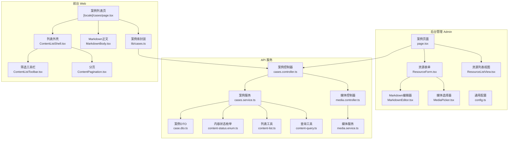
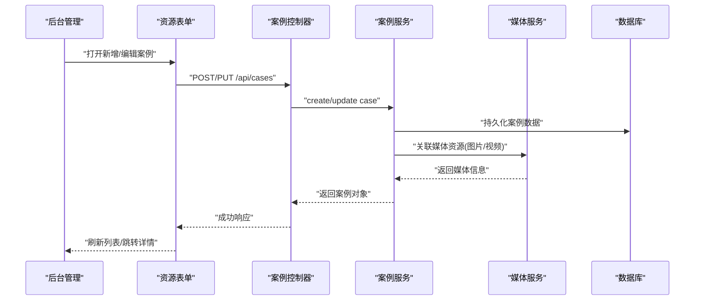
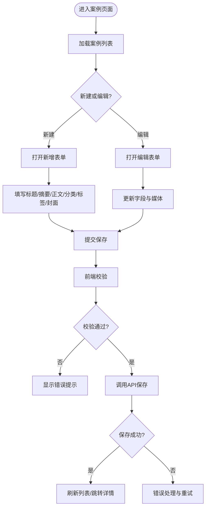
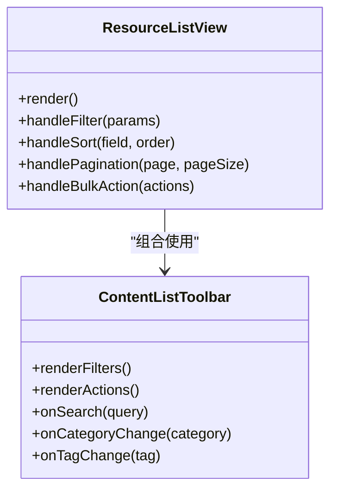
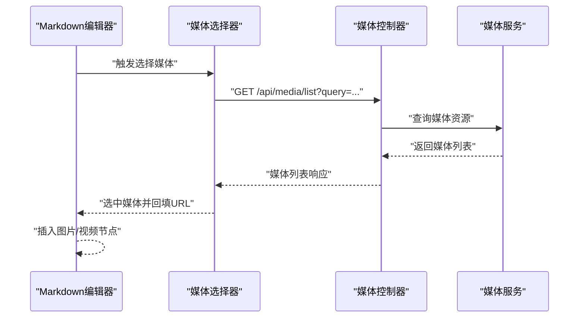
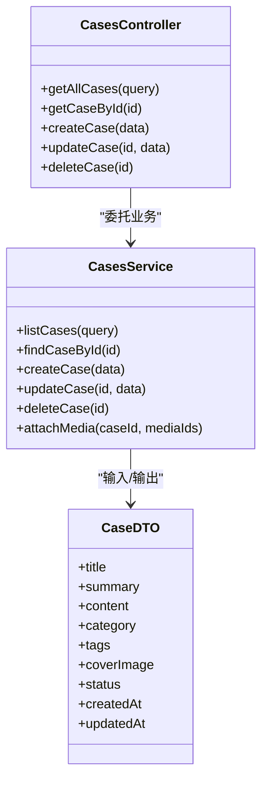
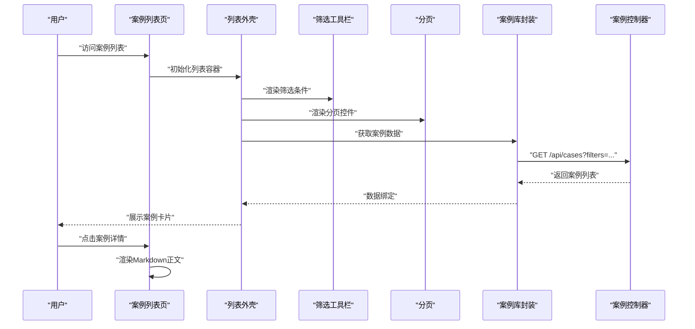
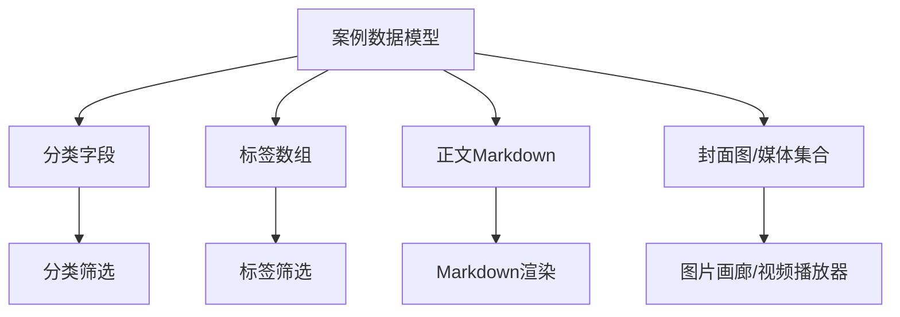
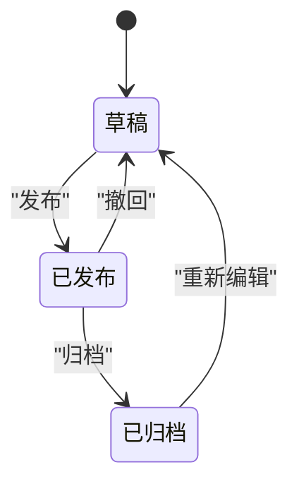
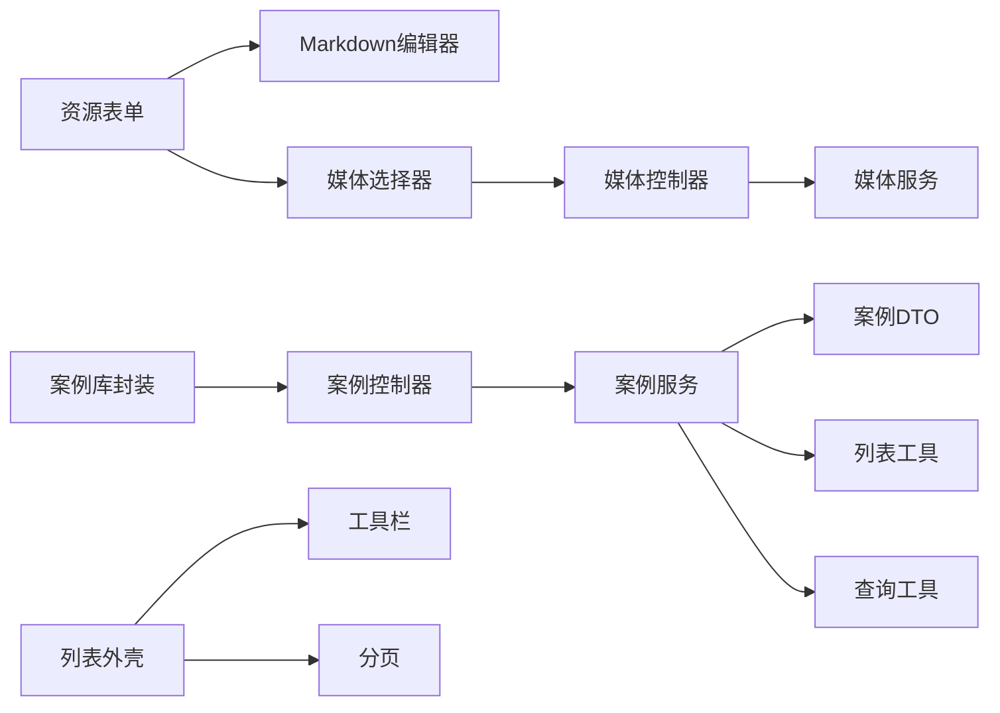

# 案例管理

<cite>
**本文引用的文件**   
- [apps/admin/src/app/(dashboard)/cases/page.tsx](file://apps/admin/src/app/(dashboard)/cases/page.tsx)
- [apps/admin/src/features/resources/cases.tsx](file://apps/admin/src/features/resources/cases.tsx)
- [apps/admin/src/components/crud/ResourceForm.tsx](file://apps/admin/src/components/crud/ResourceForm.tsx)
- [apps/admin/src/components/crud/ResourceListView.tsx](file://apps/admin/src/components/crud/ResourceListView.tsx)
- [apps/admin/src/components/crud/MarkdownEditor.tsx](file://apps/admin/src/components/crud/MarkdownEditor.tsx)
- [apps/admin/src/components/crud/MediaPicker.tsx](file://apps/admin/src/components/crud/MediaPicker.tsx)
- [apps/admin/src/components/crud/config.ts](file://apps/admin/src/components/crud/config.ts)
- [apps/api/src/cases/cases.controller.ts](file://apps/api/src/cases/cases.controller.ts)
- [apps/api/src/cases/cases.service.ts](file://apps/api/src/cases/cases.service.ts)
- [apps/api/src/cases/dto/case.dto.ts](file://apps/api/src/cases/dto/case.dto.ts)
- [apps/api/src/common/enums/content-status.enum.ts](file://apps/api/src/common/enums/content-status.enum.ts)
- [apps/api/src/common/utils/content-list.ts](file://apps/api/src/common/utils/content-list.ts)
- [apps/api/src/common/utils/content-query.ts](file://apps/api/src/common/utils/content-query.ts)
- [apps/api/src/media/media.controller.ts](file://apps/api/src/media/media.controller.ts)
- [apps/api/src/media/media.service.ts](file://apps/api/src/media/media.service.ts)
- [apps/web/src/lib/cases.ts](file://apps/web/src/lib/cases.ts)
- [apps/web/src/app/[locale]/cases/page.tsx](file://apps/web/src/app/[locale]/cases/page.tsx)
- [apps/web/src/components/content/ContentListShell.tsx](file://apps/web/src/components/content/ContentListShell.tsx)
- [apps/web/src/components/content/ContentListToolbar.tsx](file://apps/web/src/components/content/ContentListToolbar.tsx)
- [apps/web/src/components/content/ContentPagination.tsx](file://apps/web/src/components/content/ContentPagination.tsx)
- [apps/web/src/components/content/MarkdownBody.tsx](file://apps/web/src/components/content/MarkdownBody.tsx)
</cite>

## 目录
1. [简介](#简介)
2. [项目结构](#项目结构)
3. [核心组件](#核心组件)
4. [架构总览](#架构总览)
5. [详细组件分析](#详细组件分析)
6. [依赖关系分析](#依赖关系分析)
7. [性能考虑](#性能考虑)
8. [故障排查指南](#故障排查指南)
9. [结论](#结论)
10. [附录](#附录)

## 简介
本文件面向“案例内容管理”的完整生命周期，覆盖后台管理端与前台展示端的实现要点。内容包括：
- 案例项目的创建、编辑与管理流程
- 案例分类、标签系统与展示模板
- 富文本编辑器配置、图片画廊与多媒体支持
- 案例列表管理、筛选功能与状态跟踪
- 案例API接口规范与数据结构定义

## 项目结构
案例管理涉及前后端多个模块：
- 后台管理（Admin）：提供案例资源的CRUD界面、媒体选择器、富文本编辑器、列表与分页等能力
- API服务（NestJS）：提供案例资源的数据访问、查询过滤、状态枚举、媒体上传与处理等接口
- 前台站点（Web）：提供案例列表页、详情页渲染、Markdown正文渲染与分页等

图表来源
- [apps/admin/src/app/(dashboard)/cases/page.tsx](file://apps/admin/src/app/(dashboard)/cases/page.tsx)
- [apps/admin/src/components/crud/ResourceForm.tsx](file://apps/admin/src/components/crud/ResourceForm.tsx)
- [apps/admin/src/components/crud/ResourceListView.tsx](file://apps/admin/src/components/crud/ResourceListView.tsx)
- [apps/admin/src/components/crud/MarkdownEditor.tsx](file://apps/admin/src/components/crud/MarkdownEditor.tsx)
- [apps/admin/src/components/crud/MediaPicker.tsx](file://apps/admin/src/components/crud/MediaPicker.tsx)
- [apps/admin/src/components/crud/config.ts](file://apps/admin/src/components/crud/config.ts)
- [apps/api/src/cases/cases.controller.ts](file://apps/api/src/cases/cases.controller.ts)
- [apps/api/src/cases/cases.service.ts](file://apps/api/src/cases/cases.service.ts)
- [apps/api/src/cases/dto/case.dto.ts](file://apps/api/src/cases/dto/case.dto.ts)
- [apps/api/src/common/enums/content-status.enum.ts](file://apps/api/src/common/enums/content-status.enum.ts)
- [apps/api/src/common/utils/content-list.ts](file://apps/api/src/common/utils/content-list.ts)
- [apps/api/src/common/utils/content-query.ts](file://apps/api/src/common/utils/content-query.ts)
- [apps/api/src/media/media.controller.ts](file://apps/api/src/media/media.controller.ts)
- [apps/api/src/media/media.service.ts](file://apps/api/src/media/media.service.ts)
- [apps/web/src/app/[locale]/cases/page.tsx](file://apps/web/src/app/[locale]/cases/page.tsx)
- [apps/web/src/components/content/ContentListShell.tsx](file://apps/web/src/components/content/ContentListShell.tsx)
- [apps/web/src/components/content/ContentListToolbar.tsx](file://apps/web/src/components/content/ContentListToolbar.tsx)
- [apps/web/src/components/content/ContentPagination.tsx](file://apps/web/src/components/content/ContentPagination.tsx)
- [apps/web/src/components/content/MarkdownBody.tsx](file://apps/web/src/components/content/MarkdownBody.tsx)
- [apps/web/src/lib/cases.ts](file://apps/web/src/lib/cases.ts)

章节来源
- [apps/admin/src/app/(dashboard)/cases/page.tsx](file://apps/admin/src/app/(dashboard)/cases/page.tsx)
- [apps/api/src/cases/cases.controller.ts](file://apps/api/src/cases/cases.controller.ts)
- [apps/web/src/app/[locale]/cases/page.tsx](file://apps/web/src/app/[locale]/cases/page.tsx)

## 核心组件
- 后台案例页面：聚合案例列表与新增/编辑入口，统一调用资源表单与列表视图
- 资源表单：承载案例字段编辑，集成Markdown编辑器与媒体选择器
- 资源列表视图：支持分页、排序、筛选、批量操作
- Markdown编辑器：基于Vditor的富文本编辑能力，支持图片插入与预览
- 媒体选择器：对接媒体服务，支持图片/视频选择与URL回填
- API控制器与服务：实现案例的CRUD、查询过滤、状态管理、媒体关联
- 前台案例列表与详情：通过统一的列表外壳与工具栏进行筛选与分页，Markdown正文渲染

章节来源
- [apps/admin/src/components/crud/ResourceForm.tsx](file://apps/admin/src/components/crud/ResourceForm.tsx)
- [apps/admin/src/components/crud/ResourceListView.tsx](file://apps/admin/src/components/crud/ResourceListView.tsx)
- [apps/admin/src/components/crud/MarkdownEditor.tsx](file://apps/admin/src/components/crud/MarkdownEditor.tsx)
- [apps/admin/src/components/crud/MediaPicker.tsx](file://apps/admin/src/components/crud/MediaPicker.tsx)
- [apps/api/src/cases/cases.controller.ts](file://apps/api/src/cases/cases.controller.ts)
- [apps/api/src/cases/cases.service.ts](file://apps/api/src/cases/cases.service.ts)

## 架构总览
案例管理的整体数据流如下：
- 后台管理通过资源表单提交案例数据，调用API控制器
- API控制器校验并委托服务层处理业务逻辑，使用DTO进行数据契约
- 服务层调用数据库与媒体服务，完成案例与媒体资源的关联
- 前台通过案例库封装调用API获取数据，渲染列表与详情

图表来源
- [apps/admin/src/components/crud/ResourceForm.tsx](file://apps/admin/src/components/crud/ResourceForm.tsx)
- [apps/api/src/cases/cases.controller.ts](file://apps/api/src/cases/cases.controller.ts)
- [apps/api/src/cases/cases.service.ts](file://apps/api/src/cases/cases.service.ts)
- [apps/api/src/media/media.service.ts](file://apps/api/src/media/media.service.ts)

## 详细组件分析

### 后台案例页面与资源表单
- 案例页面负责挂载资源表单与列表视图，统一处理权限与路由参数
- 资源表单封装字段校验、富文本内容与媒体选择器的交互，支持草稿与发布状态切换

章节来源
- [apps/admin/src/app/(dashboard)/cases/page.tsx](file://apps/admin/src/app/(dashboard)/cases/page.tsx)
- [apps/admin/src/components/crud/ResourceForm.tsx](file://apps/admin/src/components/crud/ResourceForm.tsx)

### 资源列表视图与筛选
- 列表视图支持分页、排序、关键词搜索、分类与标签筛选
- 工具栏提供批量操作与导出能力

图表来源
- [apps/admin/src/components/crud/ResourceListView.tsx](file://apps/admin/src/components/crud/ResourceListView.tsx)
- [apps/web/src/components/content/ContentListToolbar.tsx](file://apps/web/src/components/content/ContentListToolbar.tsx)

章节来源
- [apps/admin/src/components/crud/ResourceListView.tsx](file://apps/admin/src/components/crud/ResourceListView.tsx)
- [apps/web/src/components/content/ContentListToolbar.tsx](file://apps/web/src/components/content/ContentListToolbar.tsx)

### 富文本编辑器与媒体选择器
- Markdown编辑器基于Vditor，支持工具栏配置、图片粘贴与预览
- 媒体选择器对接媒体服务，支持图片/视频选择与URL回填到编辑器

图表来源
- [apps/admin/src/components/crud/MarkdownEditor.tsx](file://apps/admin/src/components/crud/MarkdownEditor.tsx)
- [apps/admin/src/components/crud/MediaPicker.tsx](file://apps/admin/src/components/crud/MediaPicker.tsx)
- [apps/api/src/media/media.controller.ts](file://apps/api/src/media/media.controller.ts)
- [apps/api/src/media/media.service.ts](file://apps/api/src/media/media.service.ts)

章节来源
- [apps/admin/src/components/crud/MarkdownEditor.tsx](file://apps/admin/src/components/crud/MarkdownEditor.tsx)
- [apps/admin/src/components/crud/MediaPicker.tsx](file://apps/admin/src/components/crud/MediaPicker.tsx)
- [apps/api/src/media/media.controller.ts](file://apps/api/src/media/media.controller.ts)
- [apps/api/src/media/media.service.ts](file://apps/api/src/media/media.service.ts)

### API控制器与服务
- 控制器暴露RESTful接口，处理请求校验、响应转换与异常处理
- 服务层实现案例的增删改查、状态管理、媒体关联与列表查询优化

图表来源
- [apps/api/src/cases/cases.controller.ts](file://apps/api/src/cases/cases.controller.ts)
- [apps/api/src/cases/cases.service.ts](file://apps/api/src/cases/cases.service.ts)
- [apps/api/src/cases/dto/case.dto.ts](file://apps/api/src/cases/dto/case.dto.ts)

章节来源
- [apps/api/src/cases/cases.controller.ts](file://apps/api/src/cases/cases.controller.ts)
- [apps/api/src/cases/cases.service.ts](file://apps/api/src/cases/cases.service.ts)
- [apps/api/src/cases/dto/case.dto.ts](file://apps/api/src/cases/dto/case.dto.ts)

### 前台案例列表与详情
- 列表页通过统一外壳与工具栏实现筛选与分页，调用案例库封装获取数据
- 详情页渲染Markdown正文，支持图片与视频的多媒体展示

图表来源
- [apps/web/src/app/[locale]/cases/page.tsx](file://apps/web/src/app/[locale]/cases/page.tsx)
- [apps/web/src/components/content/ContentListShell.tsx](file://apps/web/src/components/content/ContentListShell.tsx)
- [apps/web/src/components/content/ContentListToolbar.tsx](file://apps/web/src/components/content/ContentListToolbar.tsx)
- [apps/web/src/components/content/ContentPagination.tsx](file://apps/web/src/components/content/ContentPagination.tsx)
- [apps/web/src/lib/cases.ts](file://apps/web/src/lib/cases.ts)
- [apps/api/src/cases/cases.controller.ts](file://apps/api/src/cases/cases.controller.ts)

章节来源
- [apps/web/src/app/[locale]/cases/page.tsx](file://apps/web/src/app/[locale]/cases/page.tsx)
- [apps/web/src/components/content/ContentListShell.tsx](file://apps/web/src/components/content/ContentListShell.tsx)
- [apps/web/src/components/content/ContentListToolbar.tsx](file://apps/web/src/components/content/ContentListToolbar.tsx)
- [apps/web/src/components/content/ContentPagination.tsx](file://apps/web/src/components/content/ContentPagination.tsx)
- [apps/web/src/lib/cases.ts](file://apps/web/src/lib/cases.ts)

### 分类、标签与展示模板
- 分类与标签作为案例的元数据，用于筛选与展示分组
- 展示模板由Markdown正文与媒体节点组成，支持图片画廊与视频嵌入

章节来源
- [apps/api/src/cases/dto/case.dto.ts](file://apps/api/src/cases/dto/case.dto.ts)
- [apps/web/src/components/content/MarkdownBody.tsx](file://apps/web/src/components/content/MarkdownBody.tsx)

### 状态跟踪与内容状态枚举
- 内容状态枚举统一管理案例的生命周期状态（如草稿、已发布、已归档）
- 列表与表单根据状态控制可见性与可操作项

图表来源
- [apps/api/src/common/enums/content-status.enum.ts](file://apps/api/src/common/enums/content-status.enum.ts)

章节来源
- [apps/api/src/common/enums/content-status.enum.ts](file://apps/api/src/common/enums/content-status.enum.ts)

## 依赖关系分析
- 后台资源表单依赖Markdown编辑器与媒体选择器，二者分别依赖媒体服务
- API控制器依赖服务层，服务层依赖DTO与公共工具（列表、查询）
- 前台案例库封装依赖API控制器，列表外壳依赖工具栏与分页组件

图表来源
- [apps/admin/src/components/crud/ResourceForm.tsx](file://apps/admin/src/components/crud/ResourceForm.tsx)
- [apps/admin/src/components/crud/MarkdownEditor.tsx](file://apps/admin/src/components/crud/MarkdownEditor.tsx)
- [apps/admin/src/components/crud/MediaPicker.tsx](file://apps/admin/src/components/crud/MediaPicker.tsx)
- [apps/api/src/media/media.controller.ts](file://apps/api/src/media/media.controller.ts)
- [apps/api/src/media/media.service.ts](file://apps/api/src/media/media.service.ts)
- [apps/api/src/cases/cases.controller.ts](file://apps/api/src/cases/cases.controller.ts)
- [apps/api/src/cases/cases.service.ts](file://apps/api/src/cases/cases.service.ts)
- [apps/api/src/cases/dto/case.dto.ts](file://apps/api/src/cases/dto/case.dto.ts)
- [apps/api/src/common/utils/content-list.ts](file://apps/api/src/common/utils/content-list.ts)
- [apps/api/src/common/utils/content-query.ts](file://apps/api/src/common/utils/content-query.ts)
- [apps/web/src/lib/cases.ts](file://apps/web/src/lib/cases.ts)
- [apps/web/src/components/content/ContentListShell.tsx](file://apps/web/src/components/content/ContentListShell.tsx)
- [apps/web/src/components/content/ContentListToolbar.tsx](file://apps/web/src/components/content/ContentListToolbar.tsx)
- [apps/web/src/components/content/ContentPagination.tsx](file://apps/web/src/components/content/ContentPagination.tsx)

章节来源
- [apps/api/src/cases/cases.controller.ts](file://apps/api/src/cases/cases.controller.ts)
- [apps/api/src/cases/cases.service.ts](file://apps/api/src/cases/cases.service.ts)
- [apps/api/src/cases/dto/case.dto.ts](file://apps/api/src/cases/dto/case.dto.ts)
- [apps/api/src/common/utils/content-list.ts](file://apps/api/src/common/utils/content-list.ts)
- [apps/api/src/common/utils/content-query.ts](file://apps/api/src/common/utils/content-query.ts)
- [apps/web/src/lib/cases.ts](file://apps/web/src/lib/cases.ts)

## 性能考虑
- 列表查询使用分页与索引优化，避免全表扫描
- 媒体资源按需加载与懒加载，减少首屏压力
- Markdown渲染在客户端进行，服务端仅存储原始内容
- 媒体选择器支持缓存最近选择的媒体，提升用户体验

## 故障排查指南
- 富文本编辑器无法插入图片：检查媒体选择器与媒体服务的连通性，确认CORS与鉴权配置
- 案例列表筛选无效：核对查询参数与后端过滤器映射，确保分类与标签字段正确传递
- 状态变更不生效：检查内容状态枚举值与前端状态映射是否一致
- 媒体上传失败：查看媒体控制器与服务层的日志，确认存储路径与权限设置

章节来源
- [apps/api/src/media/media.controller.ts](file://apps/api/src/media/media.controller.ts)
- [apps/api/src/media/media.service.ts](file://apps/api/src/media/media.service.ts)
- [apps/api/src/common/enums/content-status.enum.ts](file://apps/api/src/common/enums/content-status.enum.ts)

## 结论
案例管理系统通过前后端分离的架构，实现了从内容创作、媒体管理到前台展示的完整闭环。借助统一的资源表单与列表视图、强大的富文本与媒体能力，以及灵活的筛选与状态管理，能够满足企业级案例内容的管理与展示需求。

## 附录

### 案例API接口规范
- 基础路径：/api/cases
- 方法：
  - GET /api/cases：获取案例列表（支持分页、排序、筛选）
  - GET /api/cases/:id：获取单个案例详情
  - POST /api/cases：创建案例
  - PUT /api/cases/:id：更新案例
  - DELETE /api/cases/:id：删除案例
- 请求头：
  - Authorization：Bearer <token>
  - Content-Type：application/json
- 响应体：
  - 列表：包含案例数组与分页信息
  - 详情：包含案例字段与媒体信息
  - 错误：标准错误码与消息

章节来源
- [apps/api/src/cases/cases.controller.ts](file://apps/api/src/cases/cases.controller.ts)

### 数据结构定义
- 案例DTO字段：
  - title：字符串，必填
  - summary：字符串，可选
  - content：Markdown字符串，必填
  - category：字符串，可选
  - tags：字符串数组，可选
  - coverImage：字符串，可选
  - status：枚举值（草稿、已发布、已归档）
  - createdAt：时间戳
  - updatedAt：时间戳

章节来源
- [apps/api/src/cases/dto/case.dto.ts](file://apps/api/src/cases/dto/case.dto.ts)