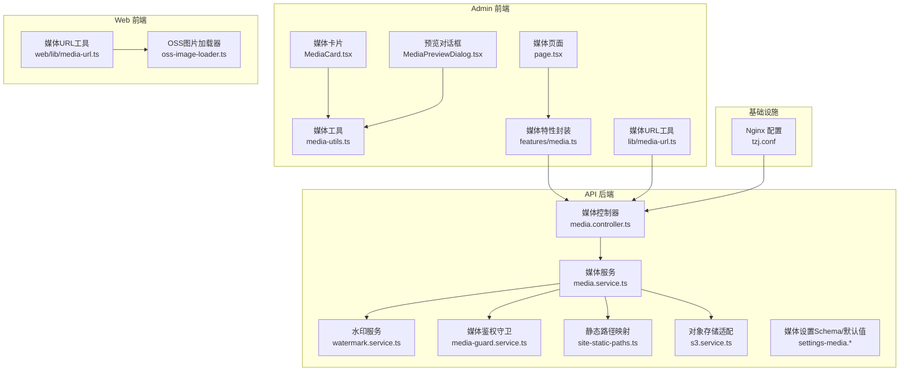
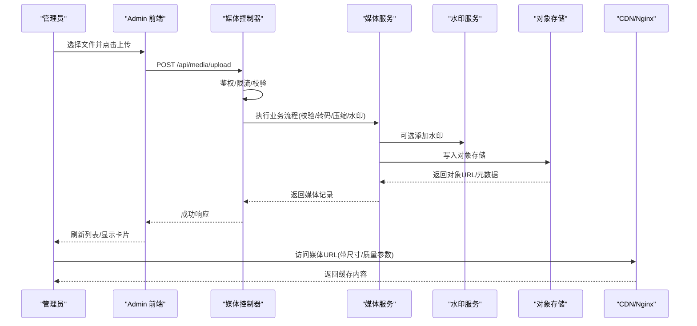
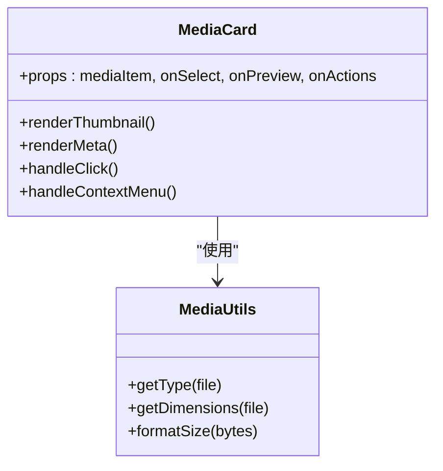
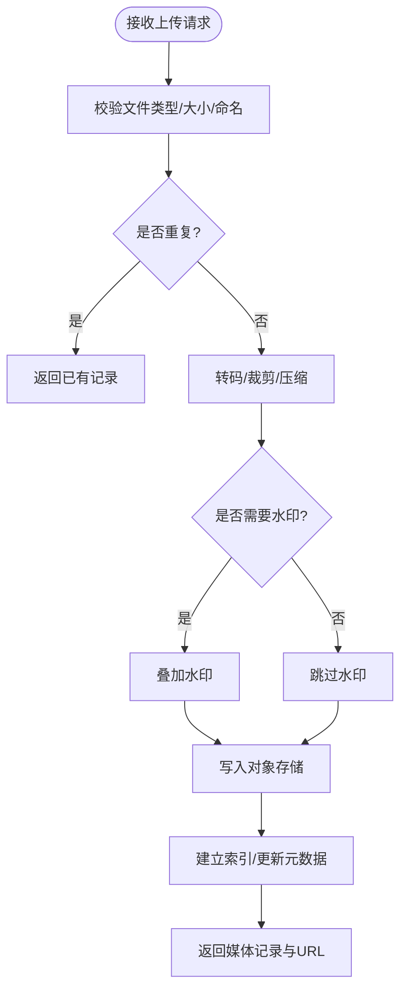
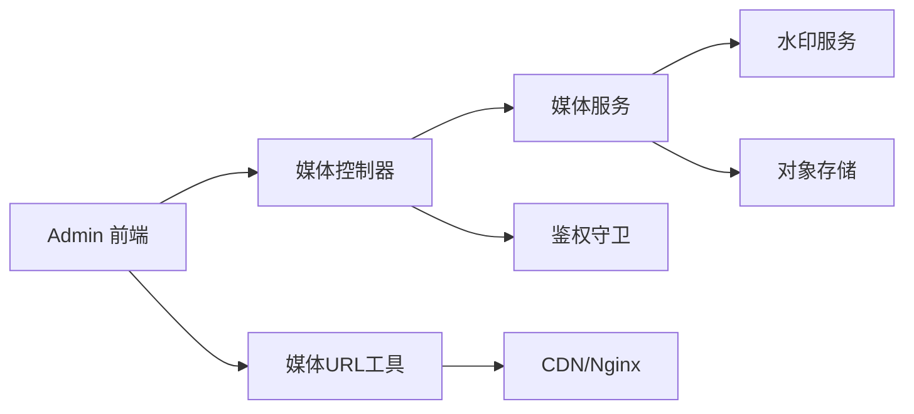

# 媒体资源管理

<cite>
**本文引用的文件**   
- [apps/admin/src/app/(dashboard)/media/page.tsx](file://apps/admin/src/app/(dashboard)/media/page.tsx)
- [apps/admin/src/components/media/MediaCard.tsx](file://apps/admin/src/components/media/MediaCard.tsx)
- [apps/admin/src/components/media/MediaPreviewDialog.tsx](file://apps/admin/src/components/media/MediaPreviewDialog.tsx)
- [apps/admin/src/components/media/media-utils.ts](file://apps/admin/src/components/media/media-utils.ts)
- [apps/admin/src/features/media.ts](file://apps/admin/src/features/media.ts)
- [apps/admin/src/lib/media-url.ts](file://apps/admin/src/lib/media-url.ts)
- [apps/api/src/media/media.controller.ts](file://apps/api/src/media/media.controller.ts)
- [apps/api/src/media/media.service.ts](file://apps/api/src/media/media.service.ts)
- [apps/api/src/media/media-guard.service.ts](file://apps/api/src/media/media-guard.service.ts)
- [apps/api/src/media/watermark.service.ts](file://apps/api/src/media/watermark.service.ts)
- [apps/api/src/media/site-static-paths.ts](file://apps/api/src/media/site-static-paths.ts)
- [apps/api/src/storage/s3.service.ts](file://apps/api/src/storage/s3.service.ts)
- [apps/api/src/settings/settings-media.schema.ts](file://apps/api/src/settings/settings-media.schema.ts)
- [apps/api/src/settings/settings-media.defaults.ts](file://apps/api/src/settings/settings-media.defaults.ts)
- [apps/web/src/lib/media-url.ts](file://apps/web/src/lib/media-url.ts)
- [apps/web/src/lib/oss-image-loader.ts](file://apps/web/src/lib/oss-image-loader.ts)
- [infra/docker/nginx/tzj.conf](file://infra/docker/nginx/tzj.conf)
</cite>

## 目录
1. [简介](#简介)
2. [项目结构](#项目结构)
3. [核心组件](#核心组件)
4. [架构总览](#架构总览)
5. [详细组件分析](#详细组件分析)
6. [依赖关系分析](#依赖关系分析)
7. [性能与优化](#性能与优化)
8. [故障排查指南](#故障排查指南)
9. [结论](#结论)
10. [附录](#附录)

## 简介
本文件系统性地梳理管理后台的媒体资源管理能力，覆盖文件上传、图片处理（格式转换、尺寸调整、压缩）、媒体库管理（卡片展示、预览对话框、批量操作）、存储策略（本地/对象存储）、CDN 集成与缓存优化、搜索与标签分类、以及权限控制。文档面向产品、前端、后端与运维人员，既提供高层概览，也给出代码级实现要点与排障建议。

## 项目结构
媒体功能横跨前端 Admin 应用、API 服务与基础设施配置：
- Admin 前端：媒体页面、媒体卡片、预览对话框、工具函数与 API 调用封装
- API 后端：媒体控制器、服务层、水印服务、鉴权守卫、设置项与对象存储适配
- Web 前端：媒体 URL 构建与图片加载器（用于生产站点）
- 基础设施：Nginx 反向代理与静态路径映射

图表来源
- [apps/admin/src/app/(dashboard)/media/page.tsx](file://apps/admin/src/app/(dashboard)/media/page.tsx)
- [apps/admin/src/components/media/MediaCard.tsx](file://apps/admin/src/components/media/MediaCard.tsx)
- [apps/admin/src/components/media/MediaPreviewDialog.tsx](file://apps/admin/src/components/media/MediaPreviewDialog.tsx)
- [apps/admin/src/components/media/media-utils.ts](file://apps/admin/src/components/media/media-utils.ts)
- [apps/admin/src/features/media.ts](file://apps/admin/src/features/media.ts)
- [apps/admin/src/lib/media-url.ts](file://apps/admin/src/lib/media-url.ts)
- [apps/api/src/media/media.controller.ts](file://apps/api/src/media/media.controller.ts)
- [apps/api/src/media/media.service.ts](file://apps/api/src/media/media.service.ts)
- [apps/api/src/media/watermark.service.ts](file://apps/api/src/media/watermark.service.ts)
- [apps/api/src/media/media-guard.service.ts](file://apps/api/src/media/media-guard.service.ts)
- [apps/api/src/media/site-static-paths.ts](file://apps/api/src/media/site-static-paths.ts)
- [apps/api/src/storage/s3.service.ts](file://apps/api/src/storage/s3.service.ts)
- [apps/api/src/settings/settings-media.schema.ts](file://apps/api/src/settings/settings-media.schema.ts)
- [apps/api/src/settings/settings-media.defaults.ts](file://apps/api/src/settings/settings-media.defaults.ts)
- [apps/web/src/lib/media-url.ts](file://apps/web/src/lib/media-url.ts)
- [apps/web/src/lib/oss-image-loader.ts](file://apps/web/src/lib/oss-image-loader.ts)
- [infra/docker/nginx/tzj.conf](file://infra/docker/nginx/tzj.conf)

章节来源
- [apps/admin/src/app/(dashboard)/media/page.tsx](file://apps/admin/src/app/(dashboard)/media/page.tsx)
- [apps/api/src/media/media.controller.ts](file://apps/api/src/media/media.controller.ts)
- [apps/api/src/media/media.service.ts](file://apps/api/src/media/media.service.ts)
- [apps/api/src/storage/s3.service.ts](file://apps/api/src/storage/s3.service.ts)
- [infra/docker/nginx/tzj.conf](file://infra/docker/nginx/tzj.conf)

## 核心组件
- 媒体页面：承载媒体库入口与列表/筛选/分页等交互
- 媒体卡片：展示缩略图、名称、类型、大小、时间等元信息，支持选择与批量操作触发
- 预览对话框：大图/视频预览、下载、复制链接、编辑元数据
- 媒体工具：文件类型判断、尺寸计算、压缩参数生成、URL 变换
- 媒体特性封装：统一请求封装、错误提示、状态管理
- API 媒体控制器：上传、下载、删除、列表查询、元数据更新、批量操作
- 媒体服务：业务编排（校验、转码、裁剪、压缩、水印、去重、索引）
- 水印服务：动态或预置水印叠加
- 媒体鉴权守卫：基于角色/权限的访问控制
- 静态路径映射：将媒体路径映射到 CDN/对象存储域名
- 对象存储适配：S3/OSS 兼容接口，统一上传/下载/删除
- 媒体设置：存储策略、压缩参数、水印开关、CDN 域名、缓存头

章节来源
- [apps/admin/src/components/media/MediaCard.tsx](file://apps/admin/src/components/media/MediaCard.tsx)
- [apps/admin/src/components/media/MediaPreviewDialog.tsx](file://apps/admin/src/components/media/MediaPreviewDialog.tsx)
- [apps/admin/src/components/media/media-utils.ts](file://apps/admin/src/components/media/media-utils.ts)
- [apps/admin/src/features/media.ts](file://apps/admin/src/features/media.ts)
- [apps/api/src/media/media.controller.ts](file://apps/api/src/media/media.controller.ts)
- [apps/api/src/media/media.service.ts](file://apps/api/src/media/media.service.ts)
- [apps/api/src/media/watermark.service.ts](file://apps/api/src/media/watermark.service.ts)
- [apps/api/src/media/media-guard.service.ts](file://apps/api/src/media/media-guard.service.ts)
- [apps/api/src/media/site-static-paths.ts](file://apps/api/src/media/site-static-paths.ts)
- [apps/api/src/storage/s3.service.ts](file://apps/api/src/storage/s3.service.ts)
- [apps/api/src/settings/settings-media.schema.ts](file://apps/api/src/settings/settings-media.schema.ts)
- [apps/api/src/settings/settings-media.defaults.ts](file://apps/api/src/settings/settings-media.defaults.ts)

## 架构总览
媒体资源管理采用“前端组件 + API 服务 + 对象存储”的分层架构。前端通过统一的媒体特性封装发起请求；API 层负责鉴权、校验、转码/压缩/水印、索引与持久化；对象存储承担实际文件落盘与分发。Nginx 作为反向代理，将媒体路径转发至 API 或直接命中 CDN。

图表来源
- [apps/admin/src/features/media.ts](file://apps/admin/src/features/media.ts)
- [apps/api/src/media/media.controller.ts](file://apps/api/src/media/media.controller.ts)
- [apps/api/src/media/media.service.ts](file://apps/api/src/media/media.service.ts)
- [apps/api/src/media/watermark.service.ts](file://apps/api/src/media/watermark.service.ts)
- [apps/api/src/storage/s3.service.ts](file://apps/api/src/storage/s3.service.ts)
- [infra/docker/nginx/tzj.conf](file://infra/docker/nginx/tzj.conf)

## 详细组件分析

### 媒体页面与列表
- 职责：渲染媒体列表、提供搜索/筛选/排序/分页、批量选择与操作入口
- 交互：打开预览对话框、进入编辑表单、执行批量删除/移动/打标签
- 数据源：通过媒体特性封装调用 API 获取列表与统计

章节来源
- [apps/admin/src/app/(dashboard)/media/page.tsx](file://apps/admin/src/app/(dashboard)/media/page.tsx)
- [apps/admin/src/features/media.ts](file://apps/admin/src/features/media.ts)

### 媒体卡片组件
- 职责：展示缩略图与基础元信息，支持选中、右键菜单、快速预览
- 行为：点击打开预览对话框；多选时显示批量操作栏；长按/拖拽支持（如启用）
- 性能：懒加载缩略图、占位图、错误回退

图表来源
- [apps/admin/src/components/media/MediaCard.tsx](file://apps/admin/src/components/media/MediaCard.tsx)
- [apps/admin/src/components/media/media-utils.ts](file://apps/admin/src/components/media/media-utils.ts)

章节来源
- [apps/admin/src/components/media/MediaCard.tsx](file://apps/admin/src/components/media/MediaCard.tsx)
- [apps/admin/src/components/media/media-utils.ts](file://apps/admin/src/components/media/media-utils.ts)

### 预览对话框
- 职责：大图/视频预览、下载原图、复制链接、编辑元数据（标题/描述/标签）
- 行为：键盘导航（左右切换、ESC 关闭）、全屏模式、缩放
- 数据：从媒体服务获取完整元数据与多尺寸变体

章节来源
- [apps/admin/src/components/media/MediaPreviewDialog.tsx](file://apps/admin/src/components/media/MediaPreviewDialog.tsx)
- [apps/admin/src/components/media/media-utils.ts](file://apps/admin/src/components/media/media-utils.ts)

### 媒体工具函数
- 职责：文件类型识别、尺寸读取、单位换算、URL 参数拼装（尺寸/质量/格式）
- 输出：标准化媒体 URL、缩略图 URL、预览 URL

章节来源
- [apps/admin/src/components/media/media-utils.ts](file://apps/admin/src/components/media/media-utils.ts)
- [apps/admin/src/lib/media-url.ts](file://apps/admin/src/lib/media-url.ts)

### 媒体特性封装（前端 API）
- 职责：统一封装上传、下载、删除、列表查询、元数据更新、批量操作
- 能力：错误提示、重试机制、进度回调、取消上传

章节来源
- [apps/admin/src/features/media.ts](file://apps/admin/src/features/media.ts)

### API 媒体控制器
- 职责：定义上传、下载、删除、列表、详情、更新、批量操作的 HTTP 接口
- 安全：鉴权守卫、权限校验、频率限制
- 响应：统一结果包装、错误码规范

章节来源
- [apps/api/src/media/media.controller.ts](file://apps/api/src/media/media.controller.ts)
- [apps/api/src/media/media-guard.service.ts](file://apps/api/src/media/media-guard.service.ts)

### API 媒体服务
- 职责：编排上传流程（校验、去重、转码、裁剪、压缩、水印、索引）
- 存储：对接对象存储，生成可分发的媒体 URL
- 元数据：持久化媒体记录（类型、尺寸、哈希、路径、标签、权限）

图表来源
- [apps/api/src/media/media.service.ts](file://apps/api/src/media/media.service.ts)
- [apps/api/src/media/watermark.service.ts](file://apps/api/src/media/watermark.service.ts)
- [apps/api/src/storage/s3.service.ts](file://apps/api/src/storage/s3.service.ts)

章节来源
- [apps/api/src/media/media.service.ts](file://apps/api/src/media/media.service.ts)
- [apps/api/src/media/watermark.service.ts](file://apps/api/src/media/watermark.service.ts)
- [apps/api/src/storage/s3.service.ts](file://apps/api/src/storage/s3.service.ts)

### 水印服务
- 职责：根据配置在指定位置叠加文字/图片水印，支持透明度、缩放、边距
- 场景：版权保护、品牌标识、敏感内容标注

章节来源
- [apps/api/src/media/watermark.service.ts](file://apps/api/src/media/watermark.service.ts)

### 静态路径映射与 CDN 集成
- 职责：将媒体路径映射为 CDN 域名下的可访问 URL，支持路径白名单与缓存头
- 配置：媒体根路径、CDN 域名、缓存策略、CORS

章节来源
- [apps/api/src/media/site-static-paths.ts](file://apps/api/src/media/site-static-paths.ts)
- [infra/docker/nginx/tzj.conf](file://infra/docker/nginx/tzj.conf)

### 对象存储适配（S3/OSS）
- 职责：统一上传、下载、删除、列举、签名 URL 生成
- 能力：分片上传、断点续传、并发控制、错误重试

章节来源
- [apps/api/src/storage/s3.service.ts](file://apps/api/src/storage/s3.service.ts)

### 媒体设置（Schema/默认值）
- 职责：集中管理存储策略、压缩参数、水印开关、CDN 域名、缓存头、最大尺寸/质量阈值
- 扩展：运行时热更新、灰度发布、环境隔离

章节来源
- [apps/api/src/settings/settings-media.schema.ts](file://apps/api/src/settings/settings-media.schema.ts)
- [apps/api/src/settings/settings-media.defaults.ts](file://apps/api/src/settings/settings-media.defaults.ts)

### Web 端媒体 URL 与图片加载器
- 职责：构建生产站点的媒体 URL，接入 OSS 图片处理器（尺寸/质量/格式）
- 优势：按需生成、减少带宽、提升首屏速度

章节来源
- [apps/web/src/lib/media-url.ts](file://apps/web/src/lib/media-url.ts)
- [apps/web/src/lib/oss-image-loader.ts](file://apps/web/src/lib/oss-image-loader.ts)

## 依赖关系分析
- 前端依赖：媒体特性封装、媒体 URL 工具、媒体卡片与预览组件
- 后端依赖：媒体控制器依赖服务层；服务层依赖水印服务与对象存储；鉴权守卫贯穿控制器
- 基础设施：Nginx 将媒体路径转发至 API 或直连 CDN

图表来源
- [apps/admin/src/features/media.ts](file://apps/admin/src/features/media.ts)
- [apps/admin/src/lib/media-url.ts](file://apps/admin/src/lib/media-url.ts)
- [apps/api/src/media/media.controller.ts](file://apps/api/src/media/media.controller.ts)
- [apps/api/src/media/media.service.ts](file://apps/api/src/media/media.service.ts)
- [apps/api/src/media/watermark.service.ts](file://apps/api/src/media/watermark.service.ts)
- [apps/api/src/media/media-guard.service.ts](file://apps/api/src/media/media-guard.service.ts)
- [apps/api/src/storage/s3.service.ts](file://apps/api/src/storage/s3.service.ts)
- [infra/docker/nginx/tzj.conf](file://infra/docker/nginx/tzj.conf)

章节来源
- [apps/api/src/media/media.controller.ts](file://apps/api/src/media/media.controller.ts)
- [apps/api/src/media/media.service.ts](file://apps/api/src/media/media.service.ts)
- [apps/api/src/media/media-guard.service.ts](file://apps/api/src/media/media-guard.service.ts)
- [apps/api/src/storage/s3.service.ts](file://apps/api/src/storage/s3.service.ts)

## 性能与优化
- 上传阶段
  - 客户端分片上传与并发控制，失败重试与断点续传
  - 上传前压缩与尺寸限制，避免超大文件进入后端
- 处理阶段
  - 异步队列处理转码/压缩/水印，降低主线程阻塞
  - 多分辨率/多格式变体按需生成，命中即缓存
- 分发阶段
  - CDN 缓存策略：长缓存+版本号/ETag，缩短回源
  - 图片处理器：按需提供尺寸/质量/格式，减少带宽
- 缓存优化
  - 浏览器缓存：Cache-Control 与 Stale-While-Revalidate
  - 服务端缓存：热门媒体元数据与缩略图缓存
- 监控与告警
  - 上传成功率、处理时长、CDN 命中率、错误率监控

[本节为通用指导，不直接分析具体文件]

## 故障排查指南
- 上传失败
  - 检查文件大小/类型限制、网络超时、对象存储配额
  - 查看上传日志与错误码，定位是前端还是后端问题
- 预览空白或无法加载
  - 确认媒体 URL 是否正确、CDN 是否生效、CORS 是否允许
  - 检查浏览器控制台与 CDN 访问日志
- 水印未生效
  - 核对水印配置（位置/透明度/素材），确认处理流水线是否开启
- 权限拒绝
  - 检查用户角色与权限配置，确认鉴权守卫规则
- 缓存异常
  - 清理浏览器缓存与 CDN 缓存，验证版本化 URL 是否更新

章节来源
- [apps/api/src/media/media-guard.service.ts](file://apps/api/src/media/media-guard.service.ts)
- [apps/api/src/media/media.service.ts](file://apps/api/src/media/media.service.ts)
- [apps/api/src/storage/s3.service.ts](file://apps/api/src/storage/s3.service.ts)
- [infra/docker/nginx/tzj.conf](file://infra/docker/nginx/tzj.conf)

## 结论
本系统以清晰的层次划分与模块化设计，实现了从上传、处理到分发的完整媒体资源管理闭环。通过对象存储与 CDN 的结合、完善的权限控制与设置化管理，兼顾了安全性、可扩展性与性能。建议在后续迭代中持续完善监控与自动化测试，进一步提升稳定性与可观测性。

[本节为总结性内容，不直接分析具体文件]

## 附录
- 常用媒体 URL 参数
  - 尺寸：width/height
  - 质量：quality
  - 格式：format（如 webp/jpg/png）
  - 裁剪：crop（center/left/right/top/bottom）
- 最佳实践
  - 上传前压缩与尺寸限制
  - 使用 CDN 与图片处理器
  - 合理设置缓存头与版本化 URL
  - 对敏感媒体启用水印与访问鉴权

[本节为补充说明，不直接分析具体文件]