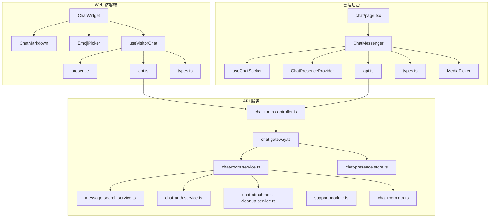
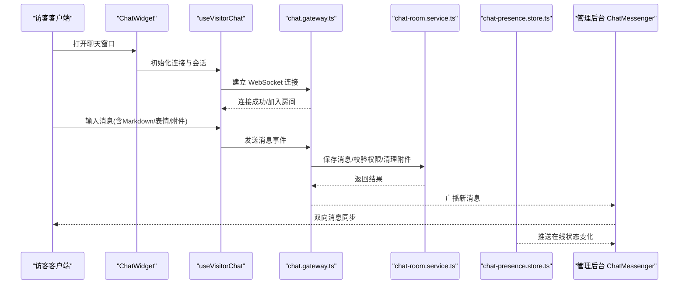
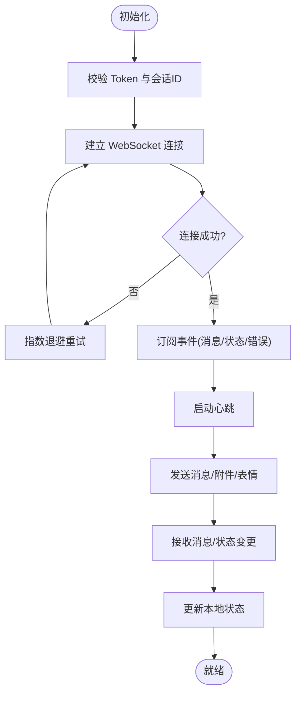
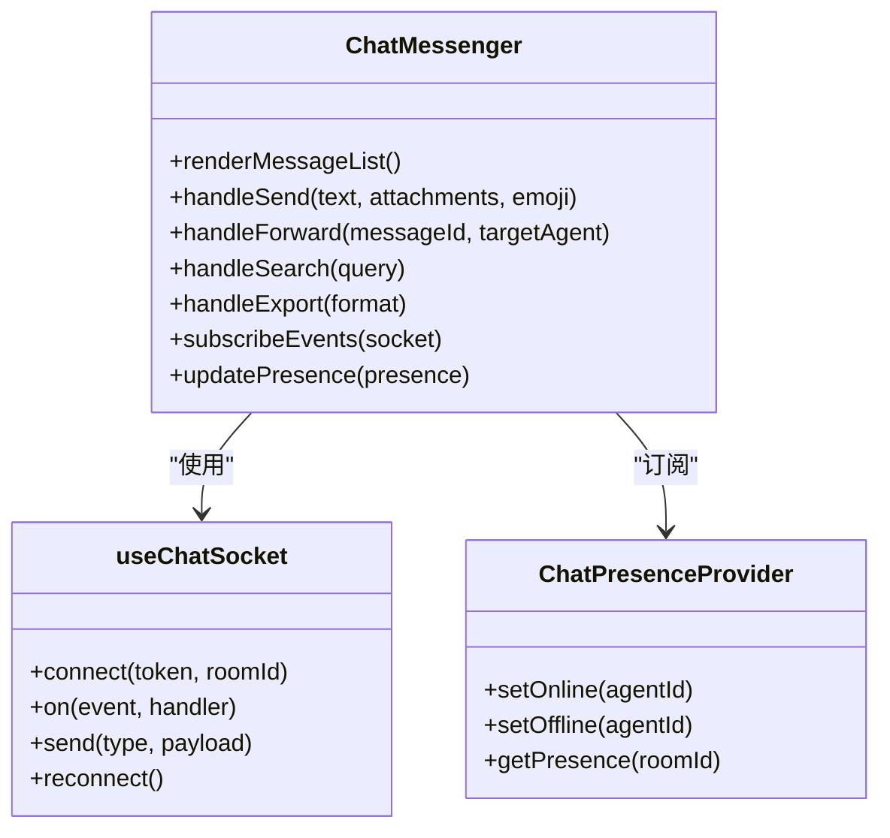
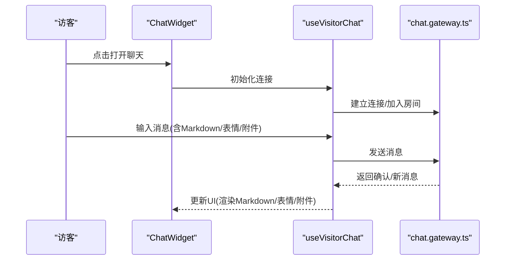
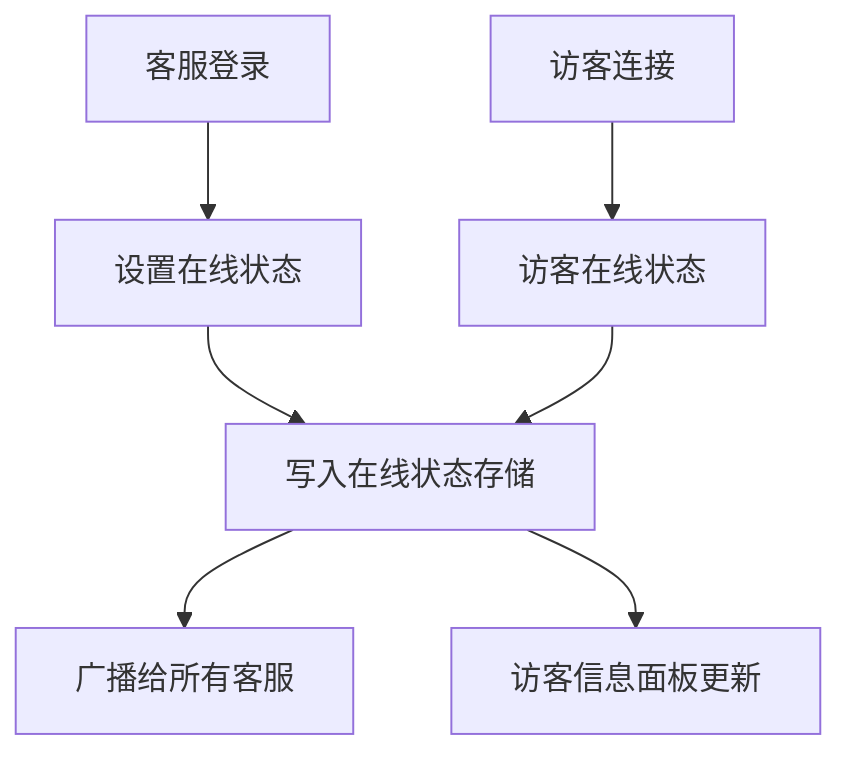
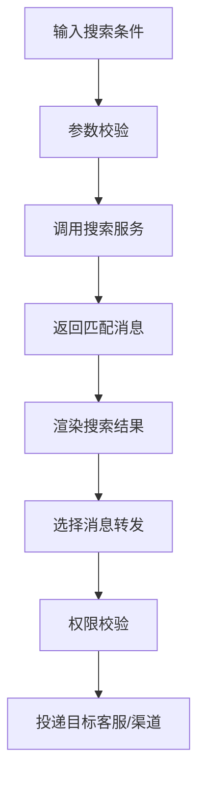
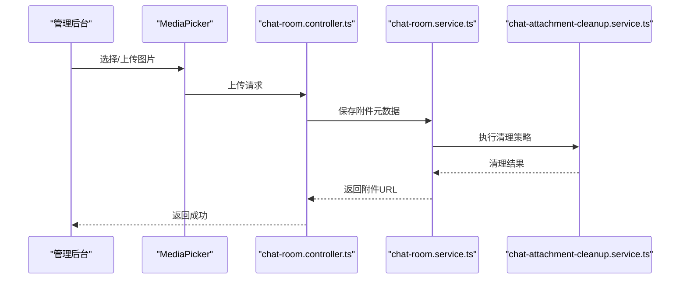
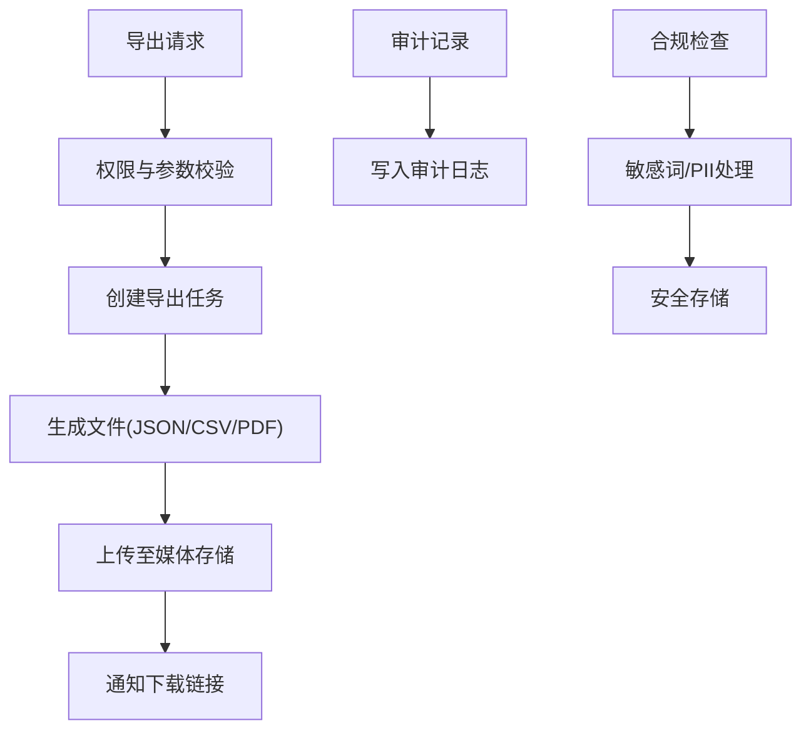
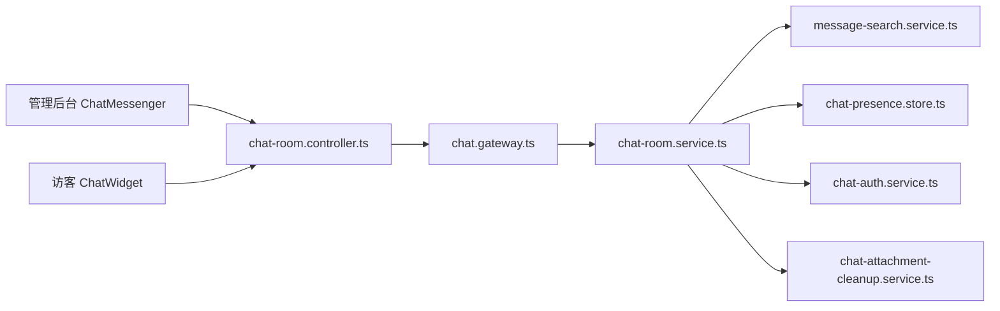

# 实时聊天系统

<cite>
**本文引用的文件**   
- [apps/admin/src/features/chat/ChatMessenger.tsx](file://apps/admin/src/features/chat/ChatMessenger.tsx)
- [apps/admin/src/features/chat/useChatSocket.ts](file://apps/admin/src/features/chat/useChatSocket.ts)
- [apps/admin/src/features/chat/ChatPresenceProvider.tsx](file://apps/admin/src/features/chat/ChatPresenceProvider.tsx)
- [apps/admin/src/features/chat/api.ts](file://apps/admin/src/features/chat/api.ts)
- [apps/admin/src/features/chat/types.ts](file://apps/admin/src/features/chat/types.ts)
- [apps/admin/src/app/(dashboard)/chat/page.tsx](file://apps/admin/src/app/(dashboard)/chat/page.tsx)
- [apps/admin/src/app/api/chat/token/route.ts](file://apps/admin/src/app/api/chat/token/route.ts)
- [apps/admin/src/components/crud/MediaPicker.tsx](file://apps/admin/src/components/crud/MediaPicker.tsx)
- [apps/web/src/components/chat/ChatWidget.tsx](file://apps/web/src/components/chat/ChatWidget.tsx)
- [apps/web/src/components/chat/ChatMarkdown.tsx](file://apps/web/src/components/chat/ChatMarkdown.tsx)
- [apps/web/src/components/chat/EmojiPicker.tsx](file://apps/web/src/components/chat/EmojiPicker.tsx)
- [apps/web/src/features/chat/useVisitorChat.ts](file://apps/web/src/features/chat/useVisitorChat.ts)
- [apps/web/src/features/chat/presence.ts](file://apps/web/src/features/chat/presence.ts)
- [apps/web/src/features/chat/types.ts](file://apps/web/src/features/chat/types.ts)
- [apps/web/src/features/chat/api.ts](file://apps/web/src/features/chat/api.ts)
- [apps/api/src/support/chat.gateway.ts](file://apps/api/src/support/chat.gateway.ts)
- [apps/api/src/support/chat-room.service.ts](file://apps/api/src/support/chat-room.service.ts)
- [apps/api/src/support/chat-room.controller.ts](file://apps/api/src/support/chat-room.controller.ts)
- [apps/api/src/support/message-search.service.ts](file://apps/api/src/support/message-search.service.ts)
- [apps/api/src/support/chat-presence.store.ts](file://apps/api/src/support/chat-presence.store.ts)
- [apps/api/src/support/chat-auth.service.ts](file://apps/api/src/support/chat-auth.service.ts)
- [apps/api/src/support/chat-attachment-cleanup.service.ts](file://apps/api/src/support/chat-attachment-cleanup.service.ts)
- [apps/api/src/support/support.module.ts](file://apps/api/src/support/support.module.ts)
- [apps/api/src/support/dto/chat-room.dto.ts](file://apps/api/src/support/dto/chat-room.dto.ts)
</cite>

## 目录
1. [简介](#简介)
2. [项目结构](#项目结构)
3. [核心组件](#核心组件)
4. [架构总览](#架构总览)
5. [详细组件分析](#详细组件分析)
6. [依赖关系分析](#依赖关系分析)
7. [性能考虑](#性能考虑)
8. [故障排查指南](#故障排查指南)
9. [结论](#结论)
10. [附录](#附录)

## 简介
本文件面向管理后台的“实时聊天系统”，覆盖以下关键能力：
- WebSocket 连接管理与消息收发
- 会话状态同步与在线状态显示
- 聊天界面组件、消息气泡渲染与 Markdown 支持
- 访客信息面板、消息搜索与转发
- 文件附件处理与表情选择
- 聊天记录导出、消息审计与合规性检查

该系统由三部分组成：
- Web 端（访客侧）：轻量聊天入口，负责展示聊天窗口、输入与基础交互。
- 管理后台（客服侧）：完整的聊天工作台，包含会话列表、消息面板、访客信息、搜索与导出等。
- API 服务（NestJS）：WebSocket Gateway、房间服务、消息搜索、在线状态存储、附件清理与鉴权等。

## 项目结构
本项目采用多应用（monorepo）组织方式，聊天功能横跨三个应用：
- apps/web：访客端聊天组件与状态管理
- apps/admin：管理后台聊天工作台与集成
- apps/api：后端网关、业务服务与数据访问

图表来源
- [apps/web/src/components/chat/ChatWidget.tsx](file://apps/web/src/components/chat/ChatWidget.tsx)
- [apps/web/src/components/chat/ChatMarkdown.tsx](file://apps/web/src/components/chat/ChatMarkdown.tsx)
- [apps/web/src/components/chat/EmojiPicker.tsx](file://apps/web/src/components/chat/EmojiPicker.tsx)
- [apps/web/src/features/chat/useVisitorChat.ts](file://apps/web/src/features/chat/useVisitorChat.ts)
- [apps/web/src/features/chat/presence.ts](file://apps/web/src/features/chat/presence.ts)
- [apps/web/src/features/chat/types.ts](file://apps/web/src/features/chat/types.ts)
- [apps/web/src/features/chat/api.ts](file://apps/web/src/features/chat/api.ts)
- [apps/admin/src/app/(dashboard)/chat/page.tsx](file://apps/admin/src/app/(dashboard)/chat/page.tsx)
- [apps/admin/src/features/chat/ChatMessenger.tsx](file://apps/admin/src/features/chat/ChatMessenger.tsx)
- [apps/admin/src/features/chat/useChatSocket.ts](file://apps/admin/src/features/chat/useChatSocket.ts)
- [apps/admin/src/features/chat/ChatPresenceProvider.tsx](file://apps/admin/src/features/chat/ChatPresenceProvider.tsx)
- [apps/admin/src/features/chat/api.ts](file://apps/admin/src/features/chat/api.ts)
- [apps/admin/src/features/chat/types.ts](file://apps/admin/src/features/chat/types.ts)
- [apps/admin/src/components/crud/MediaPicker.tsx](file://apps/admin/src/components/crud/MediaPicker.tsx)
- [apps/api/src/support/chat.gateway.ts](file://apps/api/src/support/chat.gateway.ts)
- [apps/api/src/support/chat-room.service.ts](file://apps/api/src/support/chat-room.service.ts)
- [apps/api/src/support/chat-room.controller.ts](file://apps/api/src/support/chat-room.controller.ts)
- [apps/api/src/support/message-search.service.ts](file://apps/api/src/support/message-search.service.ts)
-apps/api/src/support/chat-presence.store.ts](file://apps/api/src/support/chat-presence.store.ts)
- [apps/api/src/support/chat-auth.service.ts](file://apps/api/src/support/chat-auth.service.ts)
- [apps/api/src/support/chat-attachment-cleanup.service.ts](file://apps/api/src/support/chat-attachment-cleanup.service.ts)
- [apps/api/src/support/support.module.ts](file://apps/api/src/support/support.module.ts)
- [apps/api/src/support/dto/chat-room.dto.ts](file://apps/api/src/support/dto/chat-room.dto.ts)

章节来源
- [apps/admin/src/app/(dashboard)/chat/page.tsx](file://apps/admin/src/app/(dashboard)/chat/page.tsx)
- [apps/api/src/support/support.module.ts](file://apps/api/src/support/support.module.ts)

## 核心组件
- 管理后台聊天工作台
  - ChatMessenger：聚合消息列表、输入框、附件与表情、发送逻辑与状态管理
  - useChatSocket：封装 WebSocket 生命周期、重连、事件订阅与消息派发
  - ChatPresenceProvider：提供客服在线状态上下文与广播
  - api.ts：REST 接口调用（如获取会话、发送消息、搜索、导出等）
  - types.ts：聊天相关类型定义（消息、会话、状态等）
  - MediaPicker：用于选择并上传附件到媒体库
- 访客端聊天
  - ChatWidget：悬浮聊天入口与窗口容器
  - ChatMarkdown：消息内容 Markdown 渲染
  - EmojiPicker：表情选择器
  - useVisitorChat：访客侧 WebSocket 与状态管理
  - presence：访客在线状态
  - api.ts：访客侧 REST 接口
  - types.ts：访客侧类型定义
- API 服务
  - chat.gateway.ts：WebSocket 网关，处理连接、房间、消息广播、在线状态
  - chat-room.service.ts：会话生命周期、消息持久化、搜索、附件清理、权限校验
  - chat-room.controller.ts：REST 控制器（令牌、会话、消息、搜索、导出等）
  - message-search.service.ts：消息全文检索
  - chat-presence.store.ts：在线状态存储（内存或缓存）
  - chat-auth.service.ts：聊天鉴权与令牌校验
  - chat-attachment-cleanup.service.ts：附件清理策略
  - support.module.ts：模块装配与依赖注入
  - chat-room.dto.ts：数据传输对象（DTO）

章节来源
- [apps/admin/src/features/chat/ChatMessenger.tsx](file://apps/admin/src/features/chat/ChatMessenger.tsx)
- [apps/admin/src/features/chat/useChatSocket.ts](file://apps/admin/src/features/chat/useChatSocket.ts)
- [apps/admin/src/features/chat/ChatPresenceProvider.tsx](file://apps/admin/src/features/chat/ChatPresenceProvider.tsx)
- [apps/admin/src/features/chat/api.ts](file://apps/admin/src/features/chat/api.ts)
- [apps/admin/src/features/chat/types.ts](file://apps/admin/src/features/chat/types.ts)
- [apps/admin/src/components/crud/MediaPicker.tsx](file://apps/admin/src/components/crud/MediaPicker.tsx)
- [apps/web/src/components/chat/ChatWidget.tsx](file://apps/web/src/components/chat/ChatWidget.tsx)
- [apps/web/src/components/chat/ChatMarkdown.tsx](file://apps/web/src/components/chat/ChatMarkdown.tsx)
- [apps/web/src/components/chat/EmojiPicker.tsx](file://apps/web/src/components/chat/EmojiPicker.tsx)
- [apps/web/src/features/chat/useVisitorChat.ts](file://apps/web/src/features/chat/useVisitorChat.ts)
- [apps/web/src/features/chat/presence.ts](file://apps/web/src/features/chat/presence.ts)
- [apps/web/src/features/chat/types.ts](file://apps/web/src/features/chat/types.ts)
- [apps/web/src/features/chat/api.ts](file://apps/web/src/features/chat/api.ts)
- [apps/api/src/support/chat.gateway.ts](file://apps/api/src/support/chat.gateway.ts)
- [apps/api/src/support/chat-room.service.ts](file://apps/api/src/support/chat-room.service.ts)
- [apps/api/src/support/chat-room.controller.ts](file://apps/api/src/support/chat-room.controller.ts)
- [apps/api/src/support/message-search.service.ts](file://apps/api/src/support/message-search.service.ts)
- [apps/api/src/support/chat-presence.store.ts](file://apps/api/src/support/chat-presence.store.ts)
- [apps/api/src/support/chat-auth.service.ts](file://apps/api/src/support/chat-auth.service.ts)
- [apps/api/src/support/chat-attachment-cleanup.service.ts](file://apps/api/src/support/chat-attachment-cleanup.service.ts)
- [apps/api/src/support/support.module.ts](file://apps/api/src/support/support.module.ts)
- [apps/api/src/support/dto/chat-room.dto.ts](file://apps/api/src/support/dto/chat-room.dto.ts)

## 架构总览
整体流程包括：
- 访客通过 ChatWidget 发起对话，使用 useVisitorChat 建立 WebSocket 连接，发送/接收消息，渲染 Markdown 与表情。
- 管理后台通过 ChatMessenger 接入同一会话，使用 useChatSocket 管理连接与事件，借助 ChatPresenceProvider 维护客服在线状态。
- API 层由 chat.gateway 统一处理 WebSocket 事件，chat-room.service 负责会话与消息的业务逻辑，配合 message-search.service 进行检索，chat-auth.service 进行鉴权，chat-attachment-cleanup.service 进行附件清理。

图表来源
- [apps/web/src/components/chat/ChatWidget.tsx](file://apps/web/src/components/chat/ChatWidget.tsx)
- [apps/web/src/features/chat/useVisitorChat.ts](file://apps/web/src/features/chat/useVisitorChat.ts)
- [apps/api/src/support/chat.gateway.ts](file://apps/api/src/support/chat.gateway.ts)
- [apps/api/src/support/chat-room.service.ts](file://apps/api/src/support/chat-room.service.ts)
- [apps/api/src/support/chat-presence.store.ts](file://apps/api/src/support/chat-presence.store.ts)
- [apps/admin/src/features/chat/ChatMessenger.tsx](file://apps/admin/src/features/chat/ChatMessenger.tsx)

## 详细组件分析

### WebSocket 连接管理（useChatSocket）
- 职责
  - 建立与关闭 WebSocket 连接
  - 自动重连与心跳检测
  - 事件订阅与分发（消息、在线状态、错误）
  - 与房间/会话标识绑定
- 关键点
  - 连接参数来源于 token 与会话 ID
  - 错误码映射与用户提示
  - 断线恢复策略（指数退避）
  - 与 React 状态同步（消息队列、去重）

图表来源
- [apps/admin/src/features/chat/useChatSocket.ts](file://apps/admin/src/features/chat/useChatSocket.ts)

章节来源
- [apps/admin/src/features/chat/useChatSocket.ts](file://apps/admin/src/features/chat/useChatSocket.ts)

### 聊天界面组件（ChatMessenger）
- 职责
  - 渲染消息列表与气泡（区分访客/客服）
  - 输入区：文本、Markdown、表情、附件
  - 操作：发送、转发、搜索、导出
  - 与 useChatSocket 和 ChatPresenceProvider 协作
- 关键点
  - 消息渲染：Markdown 解析、图片预览、附件下载
  - 输入增强：表情面板、快捷回复、粘贴图片
  - 状态同步：未读计数、已读回执、在线状态
  - 权限控制：仅允许当前客服操作对应会话

图表来源
- [apps/admin/src/features/chat/ChatMessenger.tsx](file://apps/admin/src/features/chat/ChatMessenger.tsx)
- [apps/admin/src/features/chat/useChatSocket.ts](file://apps/admin/src/features/chat/useChatSocket.ts)
- [apps/admin/src/features/chat/ChatPresenceProvider.tsx](file://apps/admin/src/features/chat/ChatPresenceProvider.tsx)

章节来源
- [apps/admin/src/features/chat/ChatMessenger.tsx](file://apps/admin/src/features/chat/ChatMessenger.tsx)

### 访客端聊天（ChatWidget、ChatMarkdown、EmojiPicker、useVisitorChat）
- ChatWidget：悬浮入口与窗口容器，控制显隐与尺寸
- ChatMarkdown：将 Markdown 转换为富文本，支持代码块、链接、图片
- EmojiPicker：表情选择与插入
- useVisitorChat：访客侧 WebSocket 与状态管理，负责消息发送、接收、离线缓存与重发

图表来源
- [apps/web/src/components/chat/ChatWidget.tsx](file://apps/web/src/components/chat/ChatWidget.tsx)
- [apps/web/src/components/chat/ChatMarkdown.tsx](file://apps/web/src/components/chat/ChatMarkdown.tsx)
- [apps/web/src/components/chat/EmojiPicker.tsx](file://apps/web/src/components/chat/EmojiPicker.tsx)
- [apps/web/src/features/chat/useVisitorChat.ts](file://apps/web/src/features/chat/useVisitorChat.ts)
- [apps/api/src/support/chat.gateway.ts](file://apps/api/src/support/chat.gateway.ts)

章节来源
- [apps/web/src/components/chat/ChatWidget.tsx](file://apps/web/src/components/chat/ChatWidget.tsx)
- [apps/web/src/components/chat/ChatMarkdown.tsx](file://apps/web/src/components/chat/ChatMarkdown.tsx)
- [apps/web/src/components/chat/EmojiPicker.tsx](file://apps/web/src/components/chat/EmojiPicker.tsx)
- [apps/web/src/features/chat/useVisitorChat.ts](file://apps/web/src/features/chat/useVisitorChat.ts)

### 在线状态与访客信息面板
- 在线状态
  - 客服在线状态由 ChatPresenceProvider 维护，并通过 chat-presence.store 同步
  - 访客在线状态由 presence 模块管理，结合 Gateway 广播
- 访客信息面板
  - 在管理后台中展示访客基本信息、设备信息、最近活动
  - 与联系人/客户模块联动，支持一键转线索

图表来源
- [apps/admin/src/features/chat/ChatPresenceProvider.tsx](file://apps/admin/src/features/chat/ChatPresenceProvider.tsx)
- [apps/api/src/support/chat-presence.store.ts](file://apps/api/src/support/chat-presence.store.ts)
- [apps/web/src/features/chat/presence.ts](file://apps/web/src/features/chat/presence.ts)

章节来源
- [apps/admin/src/features/chat/ChatPresenceProvider.tsx](file://apps/admin/src/features/chat/ChatPresenceProvider.tsx)
- [apps/api/src/support/chat-presence.store.ts](file://apps/api/src/support/chat-presence.store.ts)
- [apps/web/src/features/chat/presence.ts](file://apps/web/src/features/chat/presence.ts)

### 消息搜索与转发
- 搜索
  - 支持按关键词、时间范围、发送者筛选
  - 使用 message-search.service 进行全文检索
- 转发
  - 将单条或多条消息转发给其他客服或外部渠道
  - 保留原始消息元数据与附件引用

图表来源
- [apps/admin/src/features/chat/ChatMessenger.tsx](file://apps/admin/src/features/chat/ChatMessenger.tsx)
- [apps/api/src/support/message-search.service.ts](file://apps/api/src/support/message-search.service.ts)

章节来源
- [apps/admin/src/features/chat/ChatMessenger.tsx](file://apps/admin/src/features/chat/ChatMessenger.tsx)
- [apps/api/src/support/message-search.service.ts](file://apps/api/src/support/message-search.service.ts)

### 文件附件处理与表情选择
- 附件处理
  - 管理后台使用 MediaPicker 选择并上传附件
  - 后端 chat-attachment-cleanup.service 执行清理策略（过期、大小限制、敏感词过滤）
- 表情选择
  - EmojiPicker 提供常用表情集合，支持自定义扩展
  - 前端将表情序列化为可传输格式，后端安全存储

图表来源
- [apps/admin/src/components/crud/MediaPicker.tsx](file://apps/admin/src/components/crud/MediaPicker.tsx)
- [apps/api/src/support/chat-room.controller.ts](file://apps/api/src/support/chat-room.controller.ts)
- [apps/api/src/support/chat-room.service.ts](file://apps/api/src/support/chat-room.service.ts)
- [apps/api/src/support/chat-attachment-cleanup.service.ts](file://apps/api/src/support/chat-attachment-cleanup.service.ts)

章节来源
- [apps/admin/src/components/crud/MediaPicker.tsx](file://apps/admin/src/components/crud/MediaPicker.tsx)
- [apps/api/src/support/chat-room.controller.ts](file://apps/api/src/support/chat-room.controller.ts)
- [apps/api/src/support/chat-room.service.ts](file://apps/api/src/support/chat-room.service.ts)
- [apps/api/src/support/chat-attachment-cleanup.service.ts](file://apps/api/src/support/chat-attachment-cleanup.service.ts)

### 聊天记录导出、消息审计与合规性检查
- 导出
  - 支持 JSON/CSV/PDF 等格式导出，包含消息正文、时间戳、发送者与附件信息
  - 导出任务异步执行，完成后通知下载
- 审计
  - 记录关键操作（登录、发消息、删除、导出），便于追溯
- 合规性
  - 敏感词过滤、PII 脱敏、数据留存策略、访问日志

图表来源
- [apps/api/src/support/chat-room.controller.ts](file://apps/api/src/support/chat-room.controller.ts)
- [apps/api/src/support/chat-room.service.ts](file://apps/api/src/support/chat-room.service.ts)

章节来源
- [apps/api/src/support/chat-room.controller.ts](file://apps/api/src/support/chat-room.controller.ts)
- [apps/api/src/support/chat-room.service.ts](file://apps/api/src/support/chat-room.service.ts)

## 依赖关系分析
- 管理后台与访客端均依赖 API 层的 REST 与 WebSocket
- 聊天模块通过 support.module 统一装配，避免循环依赖
- 在线状态与消息检索为独立服务，便于横向扩展

图表来源
- [apps/admin/src/features/chat/ChatMessenger.tsx](file://apps/admin/src/features/chat/ChatMessenger.tsx)
- [apps/web/src/components/chat/ChatWidget.tsx](file://apps/web/src/components/chat/ChatWidget.tsx)
- [apps/api/src/support/chat-room.controller.ts](file://apps/api/src/support/chat-room.controller.ts)
- [apps/api/src/support/chat.gateway.ts](file://apps/api/src/support/chat.gateway.ts)
- [apps/api/src/support/chat-room.service.ts](file://apps/api/src/support/chat-room.service.ts)
- [apps/api/src/support/message-search.service.ts](file://apps/api/src/support/message-search.service.ts)
- [apps/api/src/support/chat-presence.store.ts](file://apps/api/src/support/chat-presence.store.ts)
- [apps/api/src/support/chat-auth.service.ts](file://apps/api/src/support/chat-auth.service.ts)
- [apps/api/src/support/chat-attachment-cleanup.service.ts](file://apps/api/src/support/chat-attachment-cleanup.service.ts)

章节来源
- [apps/api/src/support/support.module.ts](file://apps/api/src/support/support.module.ts)

## 性能考虑
- WebSocket 连接优化
  - 连接池与复用，减少频繁握手开销
  - 心跳与超时控制，避免僵尸连接
  - 断线重连指数退避，降低服务器压力
- 消息渲染优化
  - 虚拟滚动与分页加载，避免大列表卡顿
  - Markdown 增量渲染与懒加载
  - 图片与附件按需加载与压缩
- 搜索与导出
  - 索引构建与缓存，提升查询速度
  - 异步导出任务，避免阻塞主线程
- 在线状态存储
  - 使用高性能键值存储（如 Redis）以支撑高并发

[本节为通用指导，不直接分析具体文件]

## 故障排查指南
- 连接问题
  - 检查 Token 有效性与会话 ID 是否正确
  - 查看浏览器控制台网络与 WebSocket 帧
  - 确认防火墙与代理配置
- 消息丢失
  - 检查消息队列与持久化是否成功
  - 核对事件订阅是否完整
  - 查看 Gateway 与 Room 服务日志
- 在线状态不同步
  - 检查 Presence Store 读写是否正常
  - 确认广播通道是否可达
- 附件异常
  - 校验文件大小与类型限制
  - 查看清理策略与存储路径权限
- 搜索无结果
  - 验证索引是否构建完成
  - 检查查询条件与分词器配置

章节来源
- [apps/api/src/support/chat.gateway.ts](file://apps/api/src/support/chat.gateway.ts)
- [apps/api/src/support/chat-room.service.ts](file://apps/api/src/support/chat-room.service.ts)
- [apps/api/src/support/chat-presence.store.ts](file://apps/api/src/support/chat-presence.store.ts)
- [apps/api/src/support/chat-attachment-cleanup.service.ts](file://apps/api/src/support/chat-attachment-cleanup.service.ts)

## 结论
该实时聊天系统通过清晰的模块化设计与前后端分离，实现了稳定的 WebSocket 通信、丰富的聊天交互与完善的后台管理能力。通过在线状态、消息搜索、附件处理、导出与审计等功能，满足企业级客服场景的需求。建议在生产环境进一步引入缓存与索引优化，并完善监控告警体系以提升稳定性与可观测性。

[本节为总结，不直接分析具体文件]

## 附录
- 数据类型参考
  - 管理后台 types.ts：消息、会话、状态等类型定义
  - 访客端 types.ts：访客侧消息与状态类型
  - DTO：chat-room.dto.ts 定义数据传输结构
- 模块装配
  - support.module.ts：聊天相关服务的依赖注入与注册

章节来源
- [apps/admin/src/features/chat/types.ts](file://apps/admin/src/features/chat/types.ts)
- [apps/web/src/features/chat/types.ts](file://apps/web/src/features/chat/types.ts)
- [apps/api/src/support/dto/chat-room.dto.ts](file://apps/api/src/support/dto/chat-room.dto.ts)
- [apps/api/src/support/support.module.ts](file://apps/api/src/support/support.module.ts)