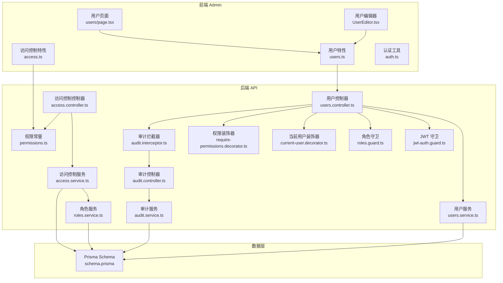
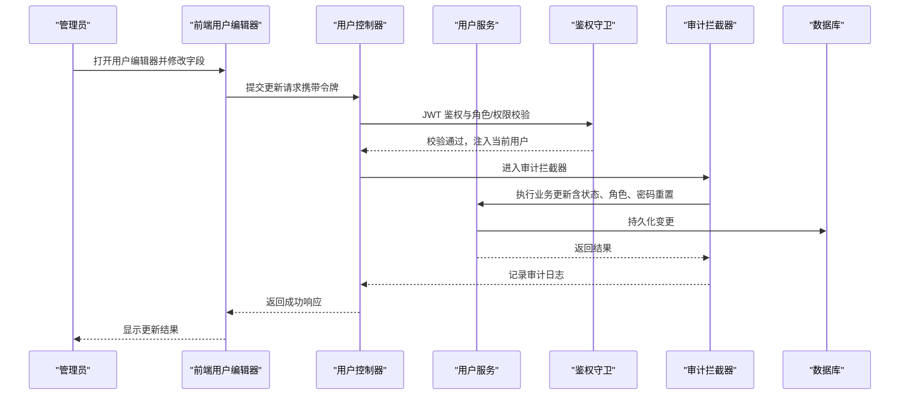
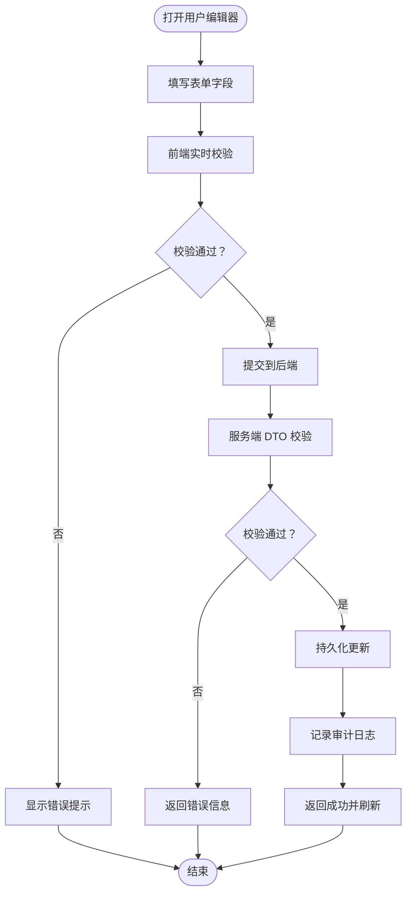
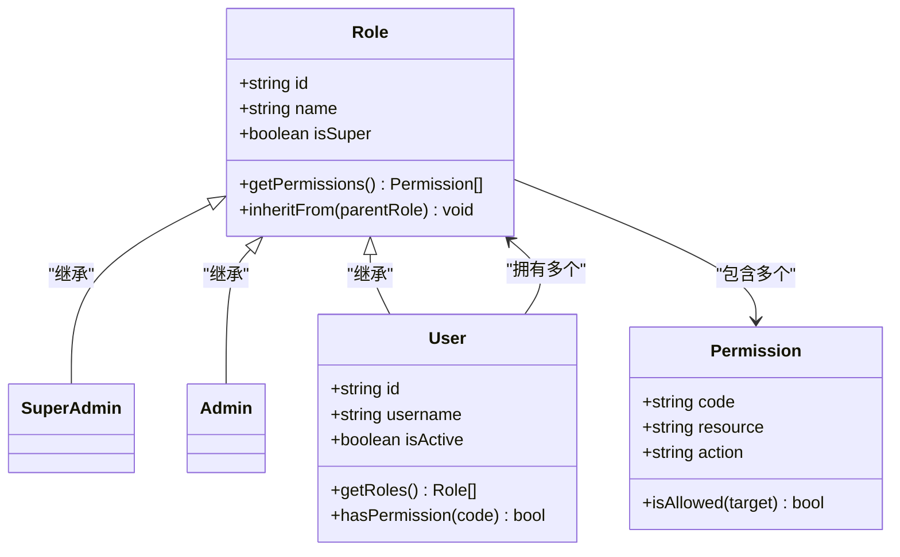
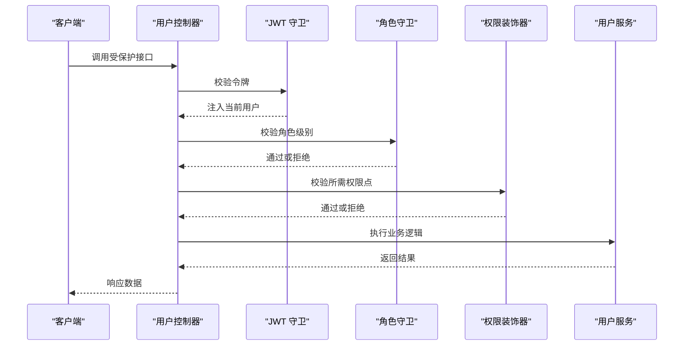
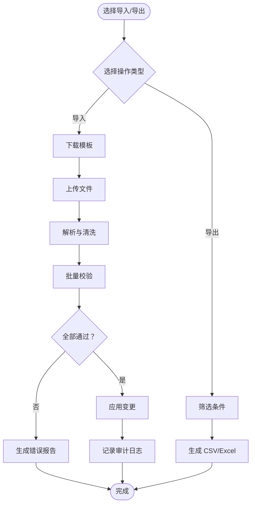
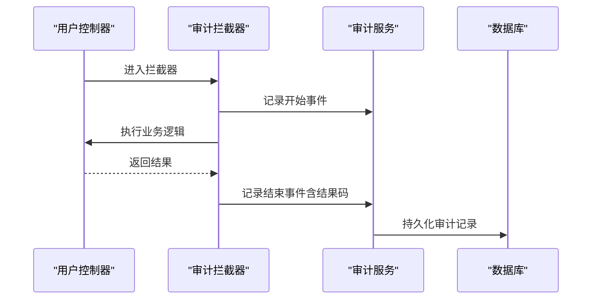
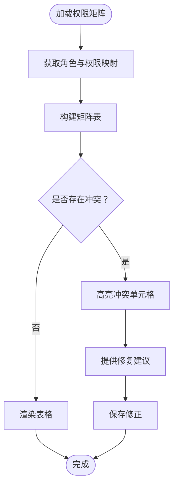
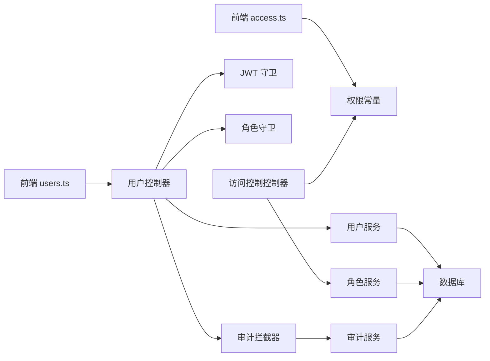

# 用户与权限管理

<cite>
**本文引用的文件**   
- [apps/admin/src/app/(dashboard)/users/page.tsx](file://apps/admin/src/app/(dashboard)/users/page.tsx)
- [apps/admin/src/components/users/UserEditor.tsx](file://apps/admin/src/components/users/UserEditor.tsx)
- [apps/admin/src/features/access.ts](file://apps/admin/src/features/access.ts)
- [apps/admin/src/features/users.ts](file://apps/admin/src/features/users.ts)
- [apps/admin/src/lib/auth.ts](file://apps/admin/src/lib/auth.ts)
- [apps/api/src/access/permissions.ts](file://apps/api/src/access/permissions.ts)
- [apps/api/src/access/roles.service.ts](file://apps/api/src/access/roles.service.ts)
- [apps/api/src/access/access.controller.ts](file://apps/api/src/access/access.controller.ts)
- [apps/api/src/access/access.service.ts](file://apps/api/src/access/access.service.ts)
- [apps/api/src/auth/guards/jwt-auth.guard.ts](file://apps/api/src/auth/guards/jwt-auth.guard.ts)
- [apps/api/src/auth/guards/roles.guard.ts](file://apps/api/src/auth/guards/roles.guard.ts)
- [apps/api/src/auth/decorators/current-user.decorator.ts](file://apps/api/src/auth/decorators/current-user.decorator.ts)
- [apps/api/src/auth/decorators/require-permissions.decorator.ts](file://apps/api/src/auth/decorators/require-permissions.decorator.ts)
- [apps/api/src/users/users.controller.ts](file://apps/api/src/users/users.controller.ts)
- [apps/api/src/users/users.service.ts](file://apps/api/src/users/users.service.ts)
- [apps/api/src/users/dto/user.dto.ts](file://apps/api/src/users/dto/user.dto.ts)
- [apps/api/src/common/interceptors/audit.interceptor.ts](file://apps/api/src/common/interceptors/audit.interceptor.ts)
- [apps/api/src/audit/audit.controller.ts](file://apps/api/src/audit/audit.controller.ts)
- [apps/api/src/audit/audit.service.ts](file://apps/api/src/audit/audit.service.ts)
- [apps/api/prisma/schema.prisma](file://apps/api/prisma/schema.prisma)
</cite>

## 目录
1. [简介](#简介)
2. [项目结构](#项目结构)
3. [核心组件](#核心组件)
4. [架构总览](#架构总览)
5. [详细组件分析](#详细组件分析)
6. [依赖关系分析](#依赖关系分析)
7. [性能考虑](#性能考虑)
8. [故障排查指南](#故障排查指南)
9. [结论](#结论)
10. [附录](#附录)

## 简介
本文件面向管理后台的“用户与权限管理系统”，覆盖以下能力：
- 用户账户管理：创建、编辑、启用/禁用、密码重置、状态管理。
- 角色与权限：角色分配、权限继承、细粒度控制、权限矩阵视图与冲突检测。
- 数据导入导出与批量操作：用户批量导入/导出、批量状态变更等。
- 审计日志：关键操作的记录与查询，满足合规与可追溯需求。

该文档既适合开发者深入理解实现细节，也适合产品与运维人员快速掌握功能边界与使用方式。

## 项目结构
本项目采用前后端分离架构：
- 前端（Next.js）：提供管理后台页面与交互，包含用户列表、用户编辑器、访问控制相关组件与特性模块。
- 后端（NestJS）：提供 REST API，封装用户、角色、权限、审计等核心服务，并通过守卫与装饰器实现鉴权与授权。
- 数据库（Prisma）：通过 schema 定义实体与关系，支撑用户、角色、权限、审计日志等持久化。

**图表来源** 
- [apps/admin/src/app/(dashboard)/users/page.tsx](file://apps/admin/src/app/(dashboard)/users/page.tsx)
- [apps/admin/src/components/users/UserEditor.tsx](file://apps/admin/src/components/users/UserEditor.tsx)
- [apps/admin/src/features/access.ts](file://apps/admin/src/features/access.ts)
- [apps/admin/src/features/users.ts](file://apps/admin/src/features/users.ts)
- [apps/admin/src/lib/auth.ts](file://apps/admin/src/lib/auth.ts)
- [apps/api/src/users/users.controller.ts](file://apps/api/src/users/users.controller.ts)
- [apps/api/src/users/users.service.ts](file://apps/api/src/users/users.service.ts)
- [apps/api/src/access/access.controller.ts](file://apps/api/src/access/access.controller.ts)
- [apps/api/src/access/access.service.ts](file://apps/api/src/access/access.service.ts)
- [apps/api/src/access/roles.service.ts](file://apps/api/src/access/roles.service.ts)
- [apps/api/src/access/permissions.ts](file://apps/api/src/access/permissions.ts)
- [apps/api/src/auth/guards/jwt-auth.guard.ts](file://apps/api/src/auth/guards/jwt-auth.guard.ts)
- [apps/api/src/auth/guards/roles.guard.ts](file://apps/api/src/auth/guards/roles.guard.ts)
- [apps/api/src/auth/decorators/current-user.decorator.ts](file://apps/api/src/auth/decorators/current-user.decorator.ts)
- [apps/api/src/auth/decorators/require-permissions.decorator.ts](file://apps/api/src/auth/decorators/require-permissions.decorator.ts)
- [apps/api/src/common/interceptors/audit.interceptor.ts](file://apps/api/src/common/interceptors/audit.interceptor.ts)
- [apps/api/src/audit/audit.controller.ts](file://apps/api/src/audit/audit.controller.ts)
- [apps/api/src/audit/audit.service.ts](file://apps/api/src/audit/audit.service.ts)
- [apps/api/prisma/schema.prisma](file://apps/api/prisma/schema.prisma)

**章节来源**
- [apps/admin/src/app/(dashboard)/users/page.tsx](file://apps/admin/src/app/(dashboard)/users/page.tsx)
- [apps/api/src/users/users.controller.ts](file://apps/api/src/users/users.controller.ts)
- [apps/api/prisma/schema.prisma](file://apps/api/prisma/schema.prisma)

## 核心组件
- 用户管理（前端）
  - 用户列表页：展示用户信息、搜索过滤、分页、批量操作入口。
  - 用户编辑器：表单校验（邮箱、手机号、用户名、密码规则）、状态切换、角色分配、密码重置流程。
- 访问控制（前端）
  - 权限常量与判断：基于权限标识进行按钮级/路由级可见性控制。
  - 角色与权限配置界面：角色编辑、权限勾选、继承关系可视化。
- 用户管理（后端）
  - 用户控制器与服务：CRUD、状态管理、密码重置、批量操作、导入导出。
  - DTO 校验：输入参数校验与错误提示。
- 访问控制（后端）
  - 权限常量与策略：集中定义权限点，支持细粒度控制。
  - 角色服务：角色与权限映射、继承计算、冲突检测。
  - 守卫与装饰器：JWT 鉴权、角色/权限校验、当前用户注入。
- 审计日志
  - 审计拦截器：自动记录关键操作上下文（操作人、资源、动作、结果）。
  - 审计控制器与服务：日志写入、查询、导出。

**章节来源**
- [apps/admin/src/components/users/UserEditor.tsx](file://apps/admin/src/components/users/UserEditor.tsx)
- [apps/admin/src/features/access.ts](file://apps/admin/src/features/access.ts)
- [apps/admin/src/features/users.ts](file://apps/admin/src/features/users.ts)
- [apps/api/src/users/users.controller.ts](file://apps/api/src/users/users.controller.ts)
- [apps/api/src/users/users.service.ts](file://apps/api/src/users/users.service.ts)
- [apps/api/src/users/dto/user.dto.ts](file://apps/api/src/users/dto/user.dto.ts)
- [apps/api/src/access/access.controller.ts](file://apps/api/src/access/access.controller.ts)
- [apps/api/src/access/access.service.ts](file://apps/api/src/access/access.service.ts)
- [apps/api/src/access/roles.service.ts](file://apps/api/src/access/roles.service.ts)
- [apps/api/src/access/permissions.ts](file://apps/api/src/access/permissions.ts)
- [apps/api/src/common/interceptors/audit.interceptor.ts](file://apps/api/src/common/interceptors/audit.interceptor.ts)
- [apps/api/src/audit/audit.controller.ts](file://apps/api/src/audit/audit.controller.ts)
- [apps/api/src/audit/audit.service.ts](file://apps/api/src/audit/audit.service.ts)

## 架构总览
系统采用分层架构与职责分离：
- 表现层（Admin）：页面与组件负责用户交互与展示。
- 业务层（API Services）：封装领域逻辑，如用户生命周期、角色权限计算、审计记录。
- 安全层（Guards & Decorators）：统一鉴权与授权，确保接口访问受控。
- 数据层（Prisma）：以强类型 ORM 管理实体与关系。

**图表来源** 
- [apps/admin/src/components/users/UserEditor.tsx](file://apps/admin/src/components/users/UserEditor.tsx)
- [apps/api/src/users/users.controller.ts](file://apps/api/src/users/users.controller.ts)
- [apps/api/src/users/users.service.ts](file://apps/api/src/users/users.service.ts)
- [apps/api/src/auth/guards/jwt-auth.guard.ts](file://apps/api/src/auth/guards/jwt-auth.guard.ts)
- [apps/api/src/common/interceptors/audit.interceptor.ts](file://apps/api/src/common/interceptors/audit.interceptor.ts)
- [apps/api/prisma/schema.prisma](file://apps/api/prisma/schema.prisma)

## 详细组件分析

### 用户编辑器与表单验证
- 表单字段：用户名、邮箱、手机号、角色、状态、密码（新增/重置）。
- 校验规则：必填、格式（邮箱/手机号）、密码强度、唯一性检查。
- 交互流程：本地即时校验 + 服务端二次校验；失败时回显错误；成功后刷新列表。
- 密码重置：支持强制重置或邀请链接重置，需记录审计日志。

**图表来源** 
- [apps/admin/src/components/users/UserEditor.tsx](file://apps/admin/src/components/users/UserEditor.tsx)
- [apps/api/src/users/dto/user.dto.ts](file://apps/api/src/users/dto/user.dto.ts)
- [apps/api/src/users/users.service.ts](file://apps/api/src/users/users.service.ts)
- [apps/api/src/common/interceptors/audit.interceptor.ts](file://apps/api/src/common/interceptors/audit.interceptor.ts)

**章节来源**
- [apps/admin/src/components/users/UserEditor.tsx](file://apps/admin/src/components/users/UserEditor.tsx)
- [apps/api/src/users/dto/user.dto.ts](file://apps/api/src/users/dto/user.dto.ts)
- [apps/api/src/users/users.service.ts](file://apps/api/src/users/users.service.ts)

### 角色与权限模型（RBAC）
- 角色：一组权限的集合，支持层级与继承（如超级管理员 > 管理员 > 普通用户）。
- 权限：细粒度操作点（如 users:create、users:update、users:delete、roles:assign）。
- 继承与冲突：子角色继承父角色权限；当存在显式拒绝与允许冲突时，按策略判定（通常拒绝优先）。
- 权限矩阵：以表格形式展示角色×权限点的覆盖情况，便于审计与排错。

**图表来源** 
- [apps/api/src/access/roles.service.ts](file://apps/api/src/access/roles.service.ts)
- [apps/api/src/access/permissions.ts](file://apps/api/src/access/permissions.ts)
- [apps/api/prisma/schema.prisma](file://apps/api/prisma/schema.prisma)

**章节来源**
- [apps/api/src/access/roles.service.ts](file://apps/api/src/access/roles.service.ts)
- [apps/api/src/access/permissions.ts](file://apps/api/src/access/permissions.ts)
- [apps/api/prisma/schema.prisma](file://apps/api/prisma/schema.prisma)

### 鉴权与授权（守卫与装饰器）
- JWT 鉴权：解析令牌，校验有效期与签名，注入当前用户。
- 角色守卫：根据路由元数据要求的最小角色级别进行校验。
- 权限装饰器：在方法级别声明所需权限点，未满足则拒绝访问。
- 当前用户装饰器：便捷获取当前登录用户信息。

**图表来源** 
- [apps/api/src/auth/guards/jwt-auth.guard.ts](file://apps/api/src/auth/guards/jwt-auth.guard.ts)
- [apps/api/src/auth/guards/roles.guard.ts](file://apps/api/src/auth/guards/roles.guard.ts)
- [apps/api/src/auth/decorators/current-user.decorator.ts](file://apps/api/src/auth/decorators/current-user.decorator.ts)
- [apps/api/src/auth/decorators/require-permissions.decorator.ts](file://apps/api/src/auth/decorators/require-permissions.decorator.ts)
- [apps/api/src/users/users.controller.ts](file://apps/api/src/users/users.controller.ts)
- [apps/api/src/users/users.service.ts](file://apps/api/src/users/users.service.ts)

**章节来源**
- [apps/api/src/auth/guards/jwt-auth.guard.ts](file://apps/api/src/auth/guards/jwt-auth.guard.ts)
- [apps/api/src/auth/guards/roles.guard.ts](file://apps/api/src/auth/guards/roles.guard.ts)
- [apps/api/src/auth/decorators/current-user.decorator.ts](file://apps/api/src/auth/decorators/current-user.decorator.ts)
- [apps/api/src/auth/decorators/require-permissions.decorator.ts](file://apps/api/src/auth/decorators/require-permissions.decorator.ts)
- [apps/api/src/users/users.controller.ts](file://apps/api/src/users/users.controller.ts)

### 用户导入导出与批量操作
- 导入：支持 CSV/Excel 模板下载、批量上传、数据清洗与校验、重复处理策略（跳过/覆盖）。
- 导出：按条件筛选导出用户清单，包含角色与状态。
- 批量操作：批量启用/禁用、批量分配角色、批量删除（软删除保留审计）。

**图表来源** 
- [apps/api/src/users/users.controller.ts](file://apps/api/src/users/users.controller.ts)
- [apps/api/src/users/users.service.ts](file://apps/api/src/users/users.service.ts)
- [apps/api/src/common/interceptors/audit.interceptor.ts](file://apps/api/src/common/interceptors/audit.interceptor.ts)

**章节来源**
- [apps/api/src/users/users.controller.ts](file://apps/api/src/users/users.controller.ts)
- [apps/api/src/users/users.service.ts](file://apps/api/src/users/users.service.ts)
- [apps/api/src/common/interceptors/audit.interceptor.ts](file://apps/api/src/common/interceptors/audit.interceptor.ts)

### 审计日志
- 自动记录：通过拦截器捕获请求上下文（用户、IP、时间、资源、动作、结果）。
- 查询与导出：支持按时间范围、操作人、资源类型、动作类型筛选与导出。
- 敏感操作：密码重置、角色分配、状态变更等必须记录。

**图表来源** 
- [apps/api/src/common/interceptors/audit.interceptor.ts](file://apps/api/src/common/interceptors/audit.interceptor.ts)
- [apps/api/src/audit/audit.controller.ts](file://apps/api/src/audit/audit.controller.ts)
- [apps/api/src/audit/audit.service.ts](file://apps/api/src/audit/audit.service.ts)
- [apps/api/prisma/schema.prisma](file://apps/api/prisma/schema.prisma)

**章节来源**
- [apps/api/src/common/interceptors/audit.interceptor.ts](file://apps/api/src/common/interceptors/audit.interceptor.ts)
- [apps/api/src/audit/audit.controller.ts](file://apps/api/src/audit/audit.controller.ts)
- [apps/api/src/audit/audit.service.ts](file://apps/api/src/audit/audit.service.ts)
- [apps/api/prisma/schema.prisma](file://apps/api/prisma/schema.prisma)

### 权限矩阵视图与冲突检测
- 权限矩阵：以角色为行、权限点为列，展示是否具备某权限，支持一键调整。
- 冲突检测：当同一权限点同时被允许与拒绝时，输出冲突详情与建议修复方案。
- 可视化：高亮冲突单元格，提供定位到具体角色与权限配置的跳转。

**图表来源** 
- [apps/api/src/access/roles.service.ts](file://apps/api/src/access/roles.service.ts)
- [apps/api/src/access/permissions.ts](file://apps/api/src/access/permissions.ts)

**章节来源**
- [apps/api/src/access/roles.service.ts](file://apps/api/src/access/roles.service.ts)
- [apps/api/src/access/permissions.ts](file://apps/api/src/access/permissions.ts)

## 依赖关系分析
- 前端依赖：
  - 用户页面依赖用户特性模块（users.ts），用于调用后端 API 与状态管理。
  - 用户编辑器依赖表单校验库与通知组件。
  - 访问控制特性模块依赖权限常量，用于 UI 级权限控制。
- 后端依赖：
  - 用户控制器依赖用户服务、鉴权守卫、审计拦截器。
  - 访问控制控制器依赖权限常量与角色服务。
  - 审计服务依赖数据库 ORM。
- 数据依赖：
  - Prisma schema 定义用户、角色、权限、审计日志等实体与关系。

**图表来源** 
- [apps/admin/src/features/users.ts](file://apps/admin/src/features/users.ts)
- [apps/admin/src/features/access.ts](file://apps/admin/src/features/access.ts)
- [apps/api/src/users/users.controller.ts](file://apps/api/src/users/users.controller.ts)
- [apps/api/src/users/users.service.ts](file://apps/api/src/users/users.service.ts)
- [apps/api/src/access/access.controller.ts](file://apps/api/src/access/access.controller.ts)
- [apps/api/src/access/roles.service.ts](file://apps/api/src/access/roles.service.ts)
- [apps/api/src/access/permissions.ts](file://apps/api/src/access/permissions.ts)
- [apps/api/src/auth/guards/jwt-auth.guard.ts](file://apps/api/src/auth/guards/jwt-auth.guard.ts)
- [apps/api/src/auth/guards/roles.guard.ts](file://apps/api/src/auth/guards/roles.guard.ts)
- [apps/api/src/common/interceptors/audit.interceptor.ts](file://apps/api/src/common/interceptors/audit.interceptor.ts)
- [apps/api/src/audit/audit.service.ts](file://apps/api/src/audit/audit.service.ts)
- [apps/api/prisma/schema.prisma](file://apps/api/prisma/schema.prisma)

**章节来源**
- [apps/admin/src/features/users.ts](file://apps/admin/src/features/users.ts)
- [apps/admin/src/features/access.ts](file://apps/admin/src/features/access.ts)
- [apps/api/src/users/users.controller.ts](file://apps/api/src/users/users.controller.ts)
- [apps/api/src/access/access.controller.ts](file://apps/api/src/access/access.controller.ts)
- [apps/api/prisma/schema.prisma](file://apps/api/prisma/schema.prisma)

## 性能考虑
- 前端：
  - 列表分页与虚拟滚动，避免一次性渲染大量数据。
  - 表单校验采用防抖与增量校验，减少无效请求。
  - 权限矩阵按需加载与缓存，降低重复计算。
- 后端：
  - 数据库查询优化：索引设计（用户邮箱、手机号、状态、角色关联）。
  - 批量操作事务化，保证一致性并减少往返次数。
  - 审计日志异步落盘，避免阻塞主流程。
- 安全与稳定性：
  - 限流与重试机制，防止恶意刷接口。
  - 敏感操作二次确认与幂等设计。

[本节为通用指导，不直接分析具体文件]

## 故障排查指南
- 鉴权失败：
  - 检查 JWT 令牌是否有效、是否过期。
  - 确认当前用户角色是否满足路由或方法所需的权限点。
- 表单校验失败：
  - 核对 DTO 校验规则与前端校验规则一致性。
  - 查看服务端错误响应中的字段级错误信息。
- 权限冲突：
  - 使用权限矩阵定位冲突单元格，检查角色继承链与显式拒绝设置。
- 审计日志缺失：
  - 确认审计拦截器已注册且未被跳过。
  - 检查审计服务写入是否成功，数据库连接是否正常。

**章节来源**
- [apps/api/src/auth/guards/jwt-auth.guard.ts](file://apps/api/src/auth/guards/jwt-auth.guard.ts)
- [apps/api/src/auth/guards/roles.guard.ts](file://apps/api/src/auth/guards/roles.guard.ts)
- [apps/api/src/users/dto/user.dto.ts](file://apps/api/src/users/dto/user.dto.ts)
- [apps/api/src/access/roles.service.ts](file://apps/api/src/access/roles.service.ts)
- [apps/api/src/common/interceptors/audit.interceptor.ts](file://apps/api/src/common/interceptors/audit.interceptor.ts)
- [apps/api/src/audit/audit.service.ts](file://apps/api/src/audit/audit.service.ts)

## 结论
本系统通过清晰的分层架构与完善的鉴权授权机制，实现了管理后台的用户与权限管理闭环。前端注重用户体验与交互反馈，后端强调安全性、一致性与可追溯性。结合权限矩阵与冲突检测工具，可有效提升权限治理效率与准确性。建议在后续迭代中持续完善批量操作体验与审计日志的可观测性。

[本节为总结性内容，不直接分析具体文件]

## 附录
- 术语说明：
  - RBAC：基于角色的访问控制。
  - DTO：数据传输对象，用于接口参数校验。
  - 权限点：最小粒度的操作标识，如 users:create。
- 最佳实践：
  - 所有敏感操作必须记录审计日志。
  - 权限变更需经过审批与复核流程。
  - 定期清理过期令牌与冗余角色。

[本节为补充信息，不直接分析具体文件]