# 管理后台系统

<cite>
**本文引用的文件**   
- [apps/admin/src/app/(dashboard)/layout.tsx](file://apps/admin/src/app/(dashboard)/layout.tsx)
- [apps/admin/src/app/layout.tsx](file://apps/admin/src/app/layout.tsx)
- [apps/admin/src/components/Sidebar.tsx](file://apps/admin/src/components/Sidebar.tsx)
- [apps/admin/src/components/Providers.tsx](file://apps/admin/src/components/Providers.tsx)
- [apps/admin/src/lib/auth.ts](file://apps/admin/src/lib/auth.ts)
- [apps/admin/src/features/access.ts](file://apps/admin/src/features/access.ts)
- [apps/admin/src/components/crud/config.ts](file://apps/admin/src/components/crud/config.ts)
- [apps/admin/src/components/crud/ResourceForm.tsx](file://apps/admin/src/components/crud/ResourceForm.tsx)
- [apps/admin/src/components/crud/ResourceListView.tsx](file://apps/admin/src/components/crud/ResourceListView.tsx)
- [apps/admin/src/components/crud/MediaPicker.tsx](file://apps/admin/src/components/crud/MediaPicker.tsx)
- [apps/admin/src/components/crud/MarkdownEditor.tsx](file://apps/admin/src/components/crud/MarkdownEditor.tsx)
- [apps/admin/src/features/chat/ChatMessenger.tsx](file://apps/admin/src/features/chat/ChatMessenger.tsx)
- [apps/admin/src/features/chat/useChatSocket.ts](file://apps/admin/src/features/chat/useChatSocket.ts)
- [apps/admin/src/features/chat/api.ts](file://apps/admin/src/features/chat/api.ts)
- [apps/admin/src/features/analytics.ts](file://apps/admin/src/features/analytics.ts)
- [apps/admin/src/components/analytics/AnalyticsCharts.tsx](file://apps/admin/src/components/analytics/AnalyticsCharts.tsx)
- [apps/admin/src/components/analytics/VisitorActivityTimeline.tsx](file://apps/admin/src/components/analytics/VisitorActivityTimeline.tsx)
- [apps/admin/src/components/analytics/device-columns.tsx](file://apps/admin/src/components/analytics/device-columns.tsx)
- [apps/admin/src/features/documents.ts](file://apps/admin/src/features/documents.ts)
- [apps/admin/src/components/documents/DocumentsHub.tsx](file://apps/admin/src/components/documents/DocumentsHub.tsx)
- [apps/admin/src/components/documents/DocumentReadView.tsx](file://apps/admin/src/components/documents/DocumentReadView.tsx)
- [apps/admin/src/components/settings/WatermarkSettingsCard.tsx](file://apps/admin/src/components/settings/WatermarkSettingsCard.tsx)
- [apps/admin/src/components/security/IpBlockPanel.tsx](file://apps/admin/src/components/security/IpBlockPanel.tsx)
- [apps/admin/src/features/system-status.ts](file://apps/admin/src/features/system-status.ts)
- [apps/admin/src/app/api/bff/[...path]/route.ts](file://apps/admin/src/app/api/bff/[...path]/route.ts)
- [apps/admin/src/lib/apiClient.ts](file://apps/admin/src/lib/apiClient.ts)
- [apps/admin/src/lib/tokenRefresh.ts](file://apps/admin/src/lib/tokenRefresh.ts)
- [apps/admin/src/app/login/page.tsx](file://apps/admin/src/app/login/page.tsx)
- [apps/admin/src/components/session.tsx](file://apps/admin/src/components/session.tsx)
- [apps/admin/src/components/Can.tsx](file://apps/admin/src/components/Can.tsx)
- [apps/admin/src/features/users.ts](file://apps/admin/src/features/users.ts)
- [apps/admin/src/components/users/UserEditor.tsx](file://apps/admin/src/components/users/UserEditor.tsx)
- [apps/admin/src/components/customers/CustomerList.tsx](file://apps/admin/src/components/customers/CustomerList.tsx)
- [apps/admin/src/features/media.ts](file://apps/admin/src/features/media.ts)
- [apps/admin/src/components/media/MediaCard.tsx](file://apps/admin/src/components/media/MediaCard.tsx)
- [apps/admin/src/components/media/media-utils.ts](file://apps/admin/src/components/media/media-utils.ts)
- [apps/admin/src/lib/site-settings.ts](file://apps/admin/src/lib/site-settings.ts)
- [apps/admin/src/features/site-settings.ts](file://apps/admin/src/features/site-settings.ts)
- [apps/admin/src/features/constants.tsx](file://apps/admin/src/features/constants.tsx)
- [apps/admin/src/features/audit-labels.ts](file://apps/admin/src/features/audit-labels.ts)
- [apps/admin/src/features/audit.ts](file://apps/admin/src/features/audit.ts)
- [apps/admin/src/features/integrations.ts](file://apps/admin/src/features/integrations.ts)
- [apps/admin/src/features/analytics-export.ts](file://apps/admin/src/features/analytics-export.ts)
- [apps/admin/src/features/security-ip-block.ts](file://apps/admin/src/features/security-ip-block.ts)
- [apps/admin/src/features/site-media.ts](file://apps/admin/src/features/site-media.ts)
- [apps/admin/src/features/normalize.ts](file://apps/admin/src/features/normalize.ts)
- [apps/admin/src/hooks/useDebouncedValue.ts](file://apps/admin/src/hooks/useDebouncedValue.ts)
- [apps/admin/src/lib/vditor-i18n-zh-cn.ts](file://apps/admin/src/lib/vditor-i18n-zh-cn.ts)
- [apps/admin/src/app/globals.css](file://apps/admin/src/app/globals.css)
- [apps/admin/src/components/DashboardShell.tsx](file://apps/admin/src/components/DashboardShell.tsx)
- [apps/admin/src/components/AppToaster.tsx](file://apps/admin/src/components/AppToaster.tsx)
- [apps/admin/src/components/RichHint.tsx](file://apps/admin/src/components/RichHint.tsx)
- [apps/admin/src/components/ScreenWatermark.tsx](file://apps/admin/src/components/ScreenWatermark.tsx)
- [apps/admin/src/components/LastOperatorCell.tsx](file://apps/admin/src/components/LastOperatorCell.tsx)
- [apps/admin/src/components/QueryProvider.tsx](file://apps/admin/src/components/QueryProvider.tsx)
</cite>

## 目录
1. [简介](#简介)
2. [项目结构](#项目结构)
3. [核心组件](#核心组件)
4. [架构总览](#架构总览)
5. [详细组件分析](#详细组件分析)
6. [依赖关系分析](#依赖关系分析)
7. [性能考量](#性能考量)
8. [故障排查指南](#故障排查指南)
9. [结论](#结论)
10. [附录](#附录)

## 简介
本文件面向管理员与开发者，系统化阐述基于 Next.js App Router 的管理后台实现。内容覆盖用户认证、角色权限、动态路由与菜单、CRUD 封装、表单处理、数据表格、文件上传、实时聊天、访客分析、内容管理、系统监控等模块，并给出 UI 组件库集成、主题定制与响应式设计的实践要点，帮助快速上手与二次开发。

## 项目结构
管理后台位于 apps/admin 子应用，采用 Next.js App Router 组织页面与 API 路由；业务逻辑通过 features、components、lib、hooks 分层组织；BFF（Backend For Frontend）层通过 /api/bff 转发到 NestJS 后端服务。

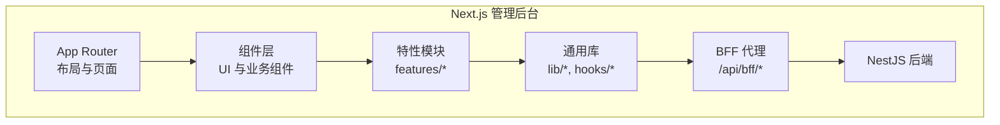

图表来源
- [apps/admin/src/app/(dashboard)/layout.tsx](file://apps/admin/src/app/(dashboard)/layout.tsx)
- [apps/admin/src/app/layout.tsx](file://apps/admin/src/app/layout.tsx)
- [apps/admin/src/app/api/bff/[...path]/route.ts](file://apps/admin/src/app/api/bff/[...path]/route.ts)

章节来源
- [apps/admin/src/app/(dashboard)/layout.tsx](file://apps/admin/src/app/(dashboard)/layout.tsx)
- [apps/admin/src/app/layout.tsx](file://apps/admin/src/app/layout.tsx)
- [apps/admin/src/app/api/bff/[...path]/route.ts](file://apps/admin/src/app/api/bff/[...path]/route.ts)

## 核心组件
- 认证与会话：集中管理登录态、Token 刷新与鉴权拦截，提供全局会话上下文。
- 权限控制：基于角色的访问控制（RBAC），在 UI 与路由层进行权限判定。
- CRUD 抽象：统一的资源编辑与列表视图，支持表单校验、富文本与媒体选择。
- 实时聊天：WebSocket 连接、消息收发、在线状态与房间管理。
- 访客分析：采集、聚合与可视化展示，支持设备维度与时间线。
- 内容管理：文档、媒体、站点设置等资源的统一管理与预览。
- 系统监控：健康检查、审计日志、安全策略（IP 封禁）与系统集成。

章节来源
- [apps/admin/src/lib/auth.ts](file://apps/admin/src/lib/auth.ts)
- [apps/admin/src/components/session.tsx](file://apps/admin/src/components/session.tsx)
- [apps/admin/src/features/access.ts](file://apps/admin/src/features/access.ts)
- [apps/admin/src/components/Can.tsx](file://apps/admin/src/components/Can.tsx)
- [apps/admin/src/components/crud/config.ts](file://apps/admin/src/components/crud/config.ts)
- [apps/admin/src/components/crud/ResourceForm.tsx](file://apps/admin/src/components/crud/ResourceForm.tsx)
- [apps/admin/src/components/crud/ResourceListView.tsx](file://apps/admin/src/components/crud/ResourceListView.tsx)
- [apps/admin/src/features/chat/ChatMessenger.tsx](file://apps/admin/src/features/chat/ChatMessenger.tsx)
- [apps/admin/src/features/chat/useChatSocket.ts](file://apps/admin/src/features/chat/useChatSocket.ts)
- [apps/admin/src/features/analytics.ts](file://apps/admin/src/features/analytics.ts)
- [apps/admin/src/components/analytics/AnalyticsCharts.tsx](file://apps/admin/src/components/analytics/AnalyticsCharts.tsx)
- [apps/admin/src/features/documents.ts](file://apps/admin/src/features/documents.ts)
- [apps/admin/src/components/documents/DocumentsHub.tsx](file://apps/admin/src/components/documents/DocumentsHub.tsx)
- [apps/admin/src/features/system-status.ts](file://apps/admin/src/features/system-status.ts)

## 架构总览
前端采用“页面 + 组件 + 特性模块”的分层模式，通过 BFF 统一对接后端。认证与权限贯穿请求链路，CRUD 与媒体能力作为横切能力被各模块复用。

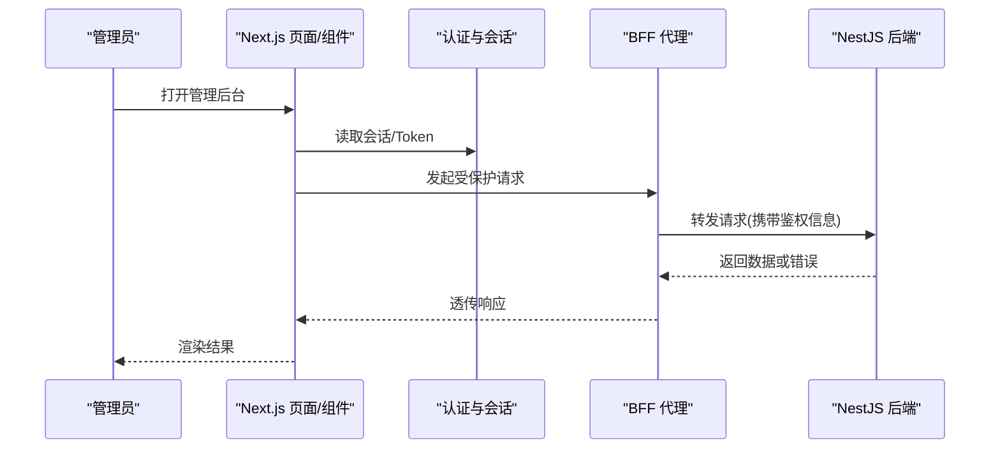

图表来源
- [apps/admin/src/app/api/bff/[...path]/route.ts](file://apps/admin/src/app/api/bff/[...path]/route.ts)
- [apps/admin/src/lib/apiClient.ts](file://apps/admin/src/lib/apiClient.ts)
- [apps/admin/src/lib/tokenRefresh.ts](file://apps/admin/src/lib/tokenRefresh.ts)
- [apps/admin/src/lib/auth.ts](file://apps/admin/src/lib/auth.ts)

## 详细组件分析

### 认证与会话
- 登录流程：登录页提交凭证，成功后写入 Token 与会话，进入受保护路由。
- 会话上下文：全局 Provider 维护当前用户、角色与权限集合，供 Can 组件与路由守卫使用。
- Token 刷新：自动检测过期并在静默状态下刷新，避免频繁重新登录。

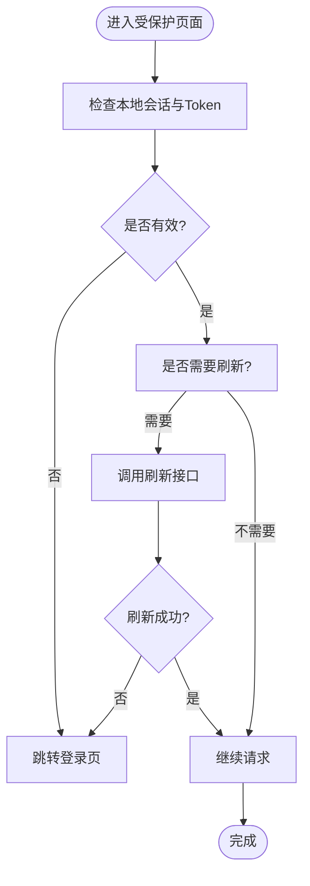

图表来源
- [apps/admin/src/app/login/page.tsx](file://apps/admin/src/app/login/page.tsx)
- [apps/admin/src/components/session.tsx](file://apps/admin/src/components/session.tsx)
- [apps/admin/src/lib/tokenRefresh.ts](file://apps/admin/src/lib/tokenRefresh.ts)
- [apps/admin/src/lib/auth.ts](file://apps/admin/src/lib/auth.ts)

章节来源
- [apps/admin/src/app/login/page.tsx](file://apps/admin/src/app/login/page.tsx)
- [apps/admin/src/components/session.tsx](file://apps/admin/src/components/session.tsx)
- [apps/admin/src/lib/tokenRefresh.ts](file://apps/admin/src/lib/tokenRefresh.ts)
- [apps/admin/src/lib/auth.ts](file://apps/admin/src/lib/auth.ts)

### 角色权限与动态路由
- 权限模型：基于角色与权限点，结合路由元信息与菜单配置，实现细粒度控制。
- 动态路由：根据权限生成可访问的路由与侧边栏菜单，未授权路径重定向至首页或 403。
- UI 级控制：Can 组件按权限条件渲染按钮或区块。

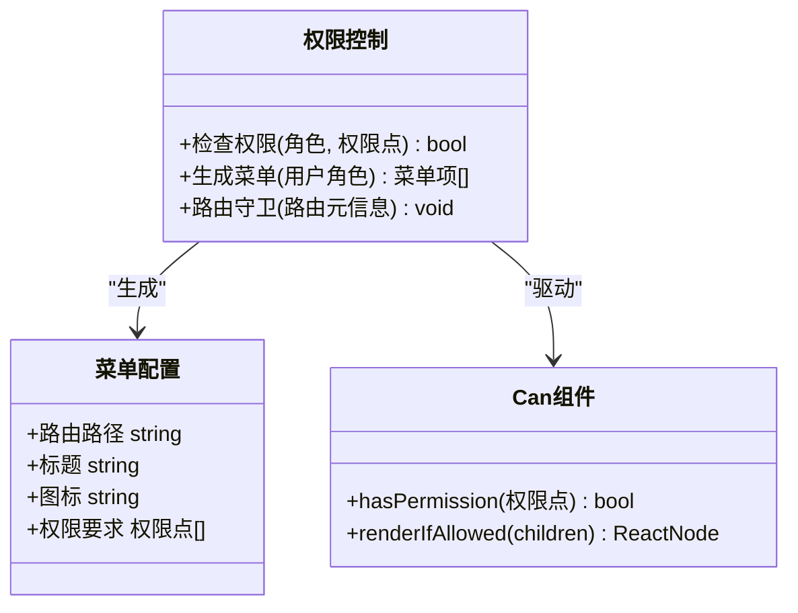

图表来源
- [apps/admin/src/features/access.ts](file://apps/admin/src/features/access.ts)
- [apps/admin/src/components/Can.tsx](file://apps/admin/src/components/Can.tsx)
- [apps/admin/src/components/Sidebar.tsx](file://apps/admin/src/components/Sidebar.tsx)

章节来源
- [apps/admin/src/features/access.ts](file://apps/admin/src/features/access.ts)
- [apps/admin/src/components/Can.tsx](file://apps/admin/src/components/Can.tsx)
- [apps/admin/src/components/Sidebar.tsx](file://apps/admin/src/components/Sidebar.tsx)

### CRUD 操作封装与表单处理
- 资源定义：通过配置文件声明字段类型、校验规则、默认值与显示列。
- 表单编辑器：统一表单构建、联动校验、富文本与媒体选择器集成。
- 列表视图：分页、搜索、排序、批量操作与导出。

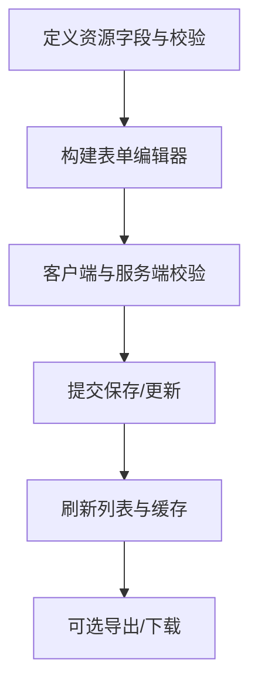

图表来源
- [apps/admin/src/components/crud/config.ts](file://apps/admin/src/components/crud/config.ts)
- [apps/admin/src/components/crud/ResourceForm.tsx](file://apps/admin/src/components/crud/ResourceForm.tsx)
- [apps/admin/src/components/crud/ResourceListView.tsx](file://apps/admin/src/components/crud/ResourceListView.tsx)

章节来源
- [apps/admin/src/components/crud/config.ts](file://apps/admin/src/components/crud/config.ts)
- [apps/admin/src/components/crud/ResourceForm.tsx](file://apps/admin/src/components/crud/ResourceForm.tsx)
- [apps/admin/src/components/crud/ResourceListView.tsx](file://apps/admin/src/components/crud/ResourceListView.tsx)

### 文件上传与媒体管理
- 媒体选择器：在表单中嵌入媒体选择弹窗，支持预览、分类与替换。
- 上传流程：分片/进度反馈、失败重试、服务端校验与水印处理。
- 媒体卡片：缩略图、元数据展示与快捷操作。

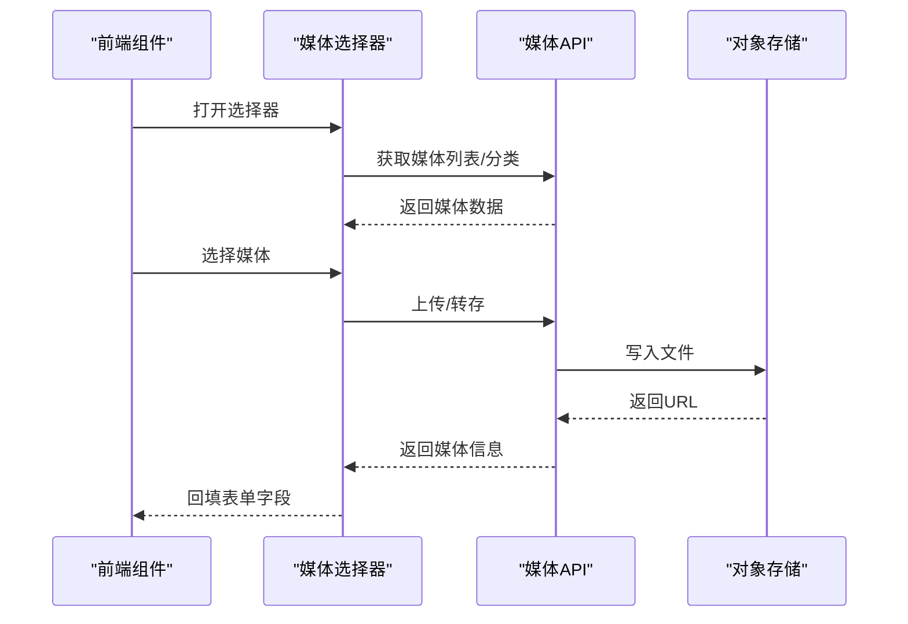

图表来源
- [apps/admin/src/components/crud/MediaPicker.tsx](file://apps/admin/src/components/crud/MediaPicker.tsx)
- [apps/admin/src/components/media/MediaCard.tsx](file://apps/admin/src/components/media/MediaCard.tsx)
- [apps/admin/src/components/media/media-utils.ts](file://apps/admin/src/components/media/media-utils.ts)
- [apps/admin/src/features/media.ts](file://apps/admin/src/features/media.ts)

章节来源
- [apps/admin/src/components/crud/MediaPicker.tsx](file://apps/admin/src/components/crud/MediaPicker.tsx)
- [apps/admin/src/components/media/MediaCard.tsx](file://apps/admin/src/components/media/MediaCard.tsx)
- [apps/admin/src/components/media/media-utils.ts](file://apps/admin/src/components/media/media-utils.ts)
- [apps/admin/src/features/media.ts](file://apps/admin/src/features/media.ts)

### 实时聊天系统
- 连接管理：WebSocket 长连接、断线重连、心跳保活。
- 消息流：发送、接收、已读回执、附件与表情。
- 在线状态：访客与客服的在线/离线状态同步。

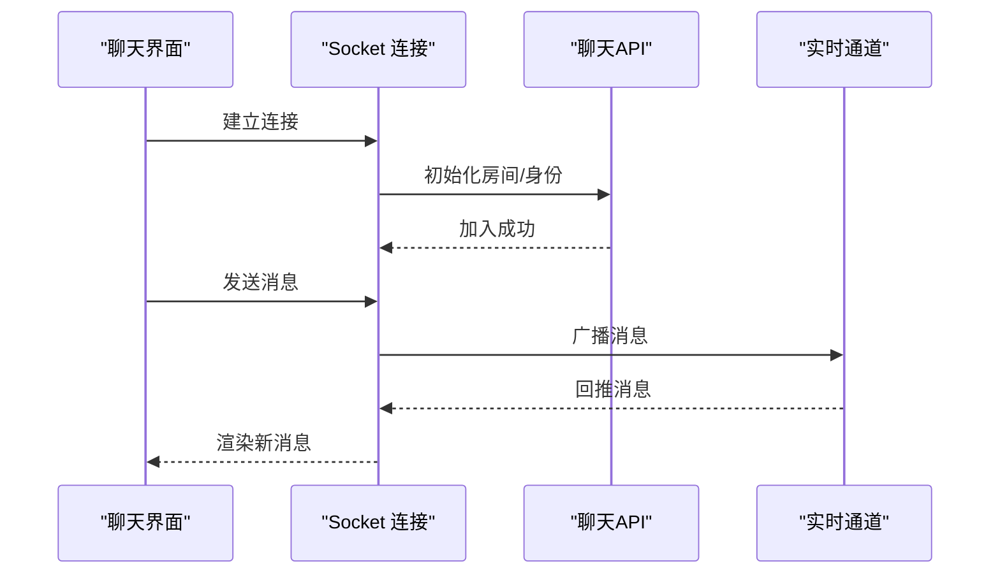

图表来源
- [apps/admin/src/features/chat/ChatMessenger.tsx](file://apps/admin/src/features/chat/ChatMessenger.tsx)
- [apps/admin/src/features/chat/useChatSocket.ts](file://apps/admin/src/features/chat/useChatSocket.ts)
- [apps/admin/src/features/chat/api.ts](file://apps/admin/src/features/chat/api.ts)

章节来源
- [apps/admin/src/features/chat/ChatMessenger.tsx](file://apps/admin/src/features/chat/ChatMessenger.tsx)
- [apps/admin/src/features/chat/useChatSocket.ts](file://apps/admin/src/features/chat/useChatSocket.ts)
- [apps/admin/src/features/chat/api.ts](file://apps/admin/src/features/chat/api.ts)

### 访客分析与数据可视化
- 数据采集：页面浏览、设备信息、地理位置与来源渠道。
- 指标聚合：按时间粒度聚合 PV/UV、设备分布、地域分布。
- 可视化：图表主题、交互筛选与导出。

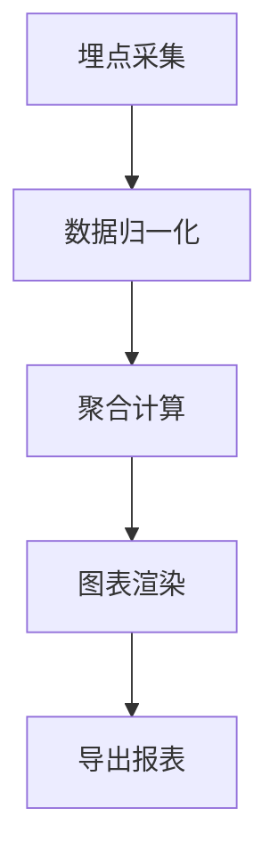

图表来源
- [apps/admin/src/features/analytics.ts](file://apps/admin/src/features/analytics.ts)
- [apps/admin/src/components/analytics/AnalyticsCharts.tsx](file://apps/admin/src/components/analytics/AnalyticsCharts.tsx)
- [apps/admin/src/components/analytics/VisitorActivityTimeline.tsx](file://apps/admin/src/components/analytics/VisitorActivityTimeline.tsx)
- [apps/admin/src/components/analytics/device-columns.tsx](file://apps/admin/src/components/analytics/device-columns.tsx)
- [apps/admin/src/features/analytics-export.ts](file://apps/admin/src/features/analytics-export.ts)

章节来源
- [apps/admin/src/features/analytics.ts](file://apps/admin/src/features/analytics.ts)
- [apps/admin/src/components/analytics/AnalyticsCharts.tsx](file://apps/admin/src/components/analytics/AnalyticsCharts.tsx)
- [apps/admin/src/components/analytics/VisitorActivityTimeline.tsx](file://apps/admin/src/components/analytics/VisitorActivityTimeline.tsx)
- [apps/admin/src/components/analytics/device-columns.tsx](file://apps/admin/src/components/analytics/device-columns.tsx)
- [apps/admin/src/features/analytics-export.ts](file://apps/admin/src/features/analytics-export.ts)

### 内容管理（文档与媒体）
- 文档中心：文件夹树、标签管理、权限控制与阅读视图。
- 富文本编辑：Markdown 编辑器、预览与国际化。
- 媒体库：分类、搜索、预览与批量操作。

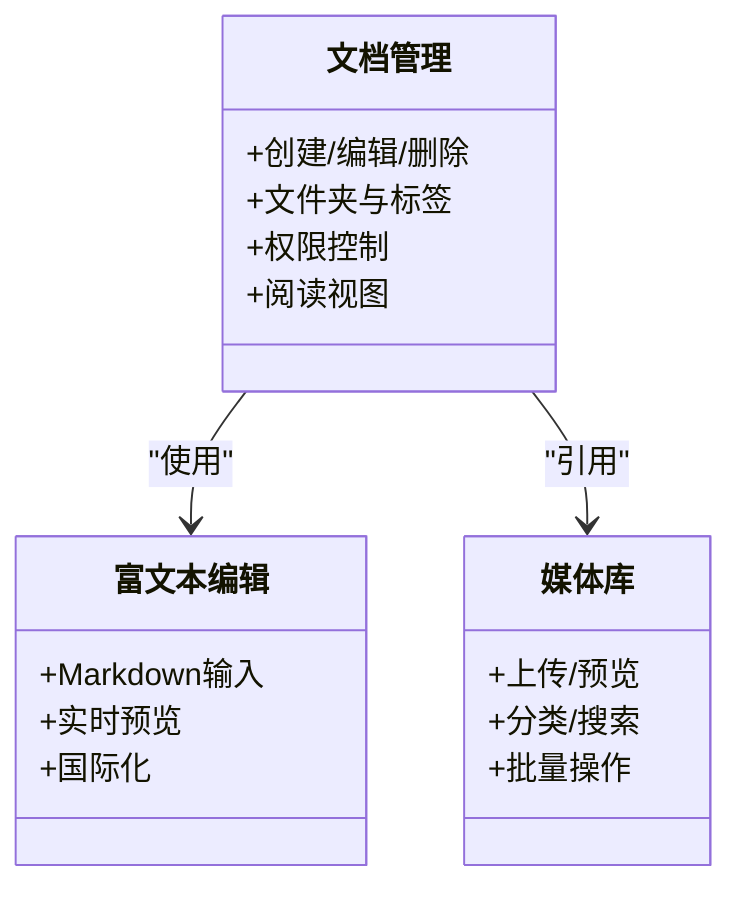

图表来源
- [apps/admin/src/features/documents.ts](file://apps/admin/src/features/documents.ts)
- [apps/admin/src/components/documents/DocumentsHub.tsx](file://apps/admin/src/components/documents/DocumentsHub.tsx)
- [apps/admin/src/components/documents/DocumentReadView.tsx](file://apps/admin/src/components/documents/DocumentReadView.tsx)
- [apps/admin/src/components/crud/MarkdownEditor.tsx](file://apps/admin/src/components/crud/MarkdownEditor.tsx)

章节来源
- [apps/admin/src/features/documents.ts](file://apps/admin/src/features/documents.ts)
- [apps/admin/src/components/documents/DocumentsHub.tsx](file://apps/admin/src/components/documents/DocumentsHub.tsx)
- [apps/admin/src/components/documents/DocumentReadView.tsx](file://apps/admin/src/components/documents/DocumentReadView.tsx)
- [apps/admin/src/components/crud/MarkdownEditor.tsx](file://apps/admin/src/components/crud/MarkdownEditor.tsx)

### 系统监控与安全
- 系统状态：健康检查、依赖服务可用性。
- 审计日志：关键操作的记录与查询。
- 安全策略：IP 封禁、访问限制与告警。

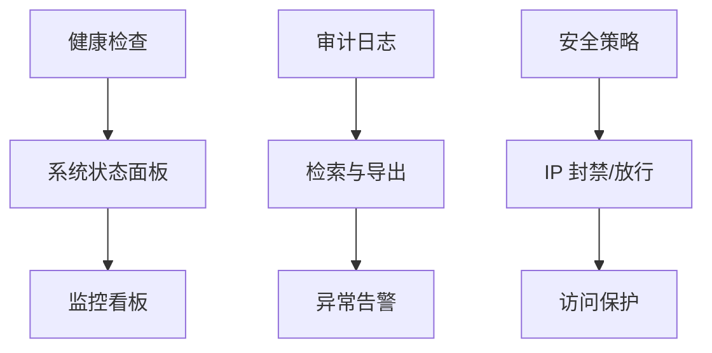

图表来源
- [apps/admin/src/features/system-status.ts](file://apps/admin/src/features/system-status.ts)
- [apps/admin/src/features/audit.ts](file://apps/admin/src/features/audit.ts)
- [apps/admin/src/features/audit-labels.ts](file://apps/admin/src/features/audit-labels.ts)
- [apps/admin/src/components/security/IpBlockPanel.tsx](file://apps/admin/src/components/security/IpBlockPanel.tsx)
- [apps/admin/src/features/security-ip-block.ts](file://apps/admin/src/features/security-ip-block.ts)

章节来源
- [apps/admin/src/features/system-status.ts](file://apps/admin/src/features/system-status.ts)
- [apps/admin/src/features/audit.ts](file://apps/admin/src/features/audit.ts)
- [apps/admin/src/features/audit-labels.ts](file://apps/admin/src/features/audit-labels.ts)
- [apps/admin/src/components/security/IpBlockPanel.tsx](file://apps/admin/src/components/security/IpBlockPanel.tsx)
- [apps/admin/src/features/security-ip-block.ts](file://apps/admin/src/features/security-ip-block.ts)

### 站点设置与主题定制
- 站点设置：Favicon、水印、通知等配置项。
- 主题定制：全局样式、组件主题与暗色模式。
- 响应式设计：移动端适配与布局切换。

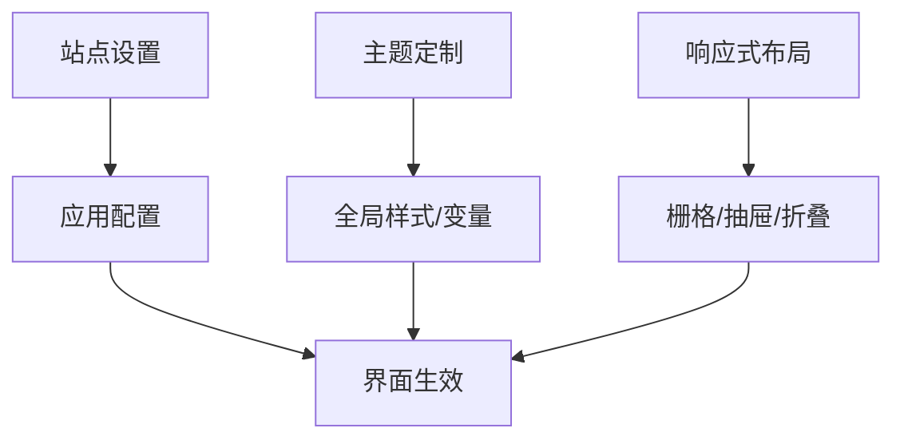

图表来源
- [apps/admin/src/components/settings/WatermarkSettingsCard.tsx](file://apps/admin/src/components/settings/WatermarkSettingsCard.tsx)
- [apps/admin/src/lib/site-settings.ts](file://apps/admin/src/lib/site-settings.ts)
- [apps/admin/src/features/site-settings.ts](file://apps/admin/src/features/site-settings.ts)
- [apps/admin/src/app/globals.css](file://apps/admin/src/app/globals.css)
- [apps/admin/src/components/ScreenWatermark.tsx](file://apps/admin/src/components/ScreenWatermark.tsx)

章节来源
- [apps/admin/src/components/settings/WatermarkSettingsCard.tsx](file://apps/admin/src/components/settings/WatermarkSettingsCard.tsx)
- [apps/admin/src/lib/site-settings.ts](file://apps/admin/src/lib/site-settings.ts)
- [apps/admin/src/features/site-settings.ts](file://apps/admin/src/features/site-settings.ts)
- [apps/admin/src/app/globals.css](file://apps/admin/src/app/globals.css)
- [apps/admin/src/components/ScreenWatermark.tsx](file://apps/admin/src/components/ScreenWatermark.tsx)

### 用户与联系人管理
- 用户管理：增删改查、角色分配与密码重置。
- 联系人/客户：导入、转换线索与关联访客。

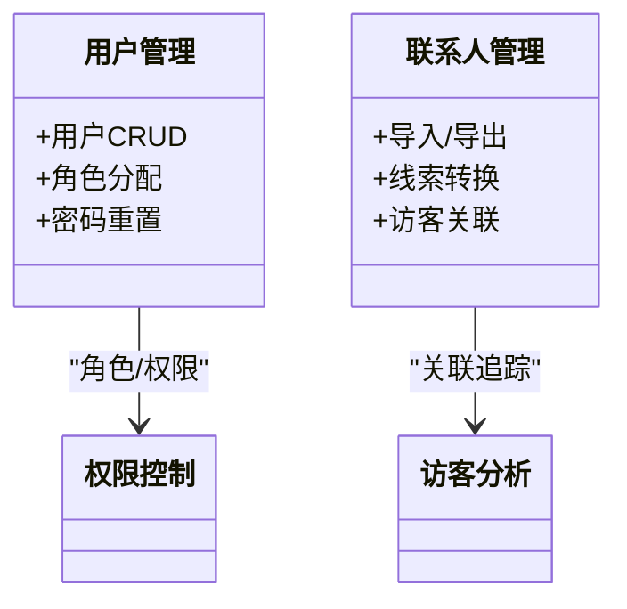

图表来源
- [apps/admin/src/features/users.ts](file://apps/admin/src/features/users.ts)
- [apps/admin/src/components/users/UserEditor.tsx](file://apps/admin/src/components/users/UserEditor.tsx)
- [apps/admin/src/components/customers/CustomerList.tsx](file://apps/admin/src/components/customers/CustomerList.tsx)

章节来源
- [apps/admin/src/features/users.ts](file://apps/admin/src/features/users.ts)
- [apps/admin/src/components/users/UserEditor.tsx](file://apps/admin/src/components/users/UserEditor.tsx)
- [apps/admin/src/components/customers/CustomerList.tsx](file://apps/admin/src/components/customers/CustomerList.tsx)

## 依赖关系分析
- 前端内部依赖：页面依赖组件，组件依赖特性模块，特性模块依赖通用库。
- 外部依赖：BFF 代理统一转发到 NestJS 后端；媒体服务对接对象存储；WebSocket 用于实时通信。
- 潜在循环依赖：通过特性模块解耦，避免组件直接跨层调用。

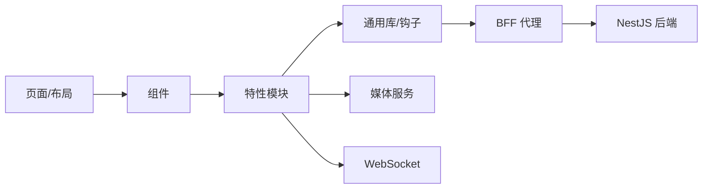

图表来源
- [apps/admin/src/app/(dashboard)/layout.tsx](file://apps/admin/src/app/(dashboard)/layout.tsx)
- [apps/admin/src/components/Sidebar.tsx](file://apps/admin/src/components/Sidebar.tsx)
- [apps/admin/src/app/api/bff/[...path]/route.ts](file://apps/admin/src/app/api/bff/[...path]/route.ts)
- [apps/admin/src/lib/apiClient.ts](file://apps/admin/src/lib/apiClient.ts)

章节来源
- [apps/admin/src/app/(dashboard)/layout.tsx](file://apps/admin/src/app/(dashboard)/layout.tsx)
- [apps/admin/src/components/Sidebar.tsx](file://apps/admin/src/components/Sidebar.tsx)
- [apps/admin/src/app/api/bff/[...path]/route.ts](file://apps/admin/src/app/api/bff/[...path]/route.ts)
- [apps/admin/src/lib/apiClient.ts](file://apps/admin/src/lib/apiClient.ts)

## 性能考量
- 请求优化：BFF 层合并与缓存、按需加载与懒渲染。
- 网络健壮性：自动重试、退避策略与超时控制。
- 渲染优化：虚拟列表、分页与增量更新。
- 资源优化：图片压缩、CDN 加速与字体按需加载。
- WebSocket：心跳保活、断线重连与消息去重。

[本节为通用指导，不直接分析具体文件]

## 故障排查指南
- 认证问题：检查 Token 有效期、刷新流程与跨域配置。
- 权限问题：核对角色与权限点映射、路由元信息与菜单配置。
- 上传失败：确认媒体服务连通、存储空间配额与水印配置。
- 聊天异常：查看 WebSocket 连接状态、房间权限与消息队列。
- 分析数据缺失：验证埋点脚本、数据归一化与聚合任务。
- 系统监控：关注健康检查接口、依赖服务状态与审计日志。

章节来源
- [apps/admin/src/lib/tokenRefresh.ts](file://apps/admin/src/lib/tokenRefresh.ts)
- [apps/admin/src/lib/auth.ts](file://apps/admin/src/lib/auth.ts)
- [apps/admin/src/features/access.ts](file://apps/admin/src/features/access.ts)
- [apps/admin/src/features/media.ts](file://apps/admin/src/features/media.ts)
- [apps/admin/src/features/chat/useChatSocket.ts](file://apps/admin/src/features/chat/useChatSocket.ts)
- [apps/admin/src/features/analytics.ts](file://apps/admin/src/features/analytics.ts)
- [apps/admin/src/features/system-status.ts](file://apps/admin/src/features/system-status.ts)

## 结论
本管理后台以 Next.js App Router 为核心，结合 BFF 与 NestJS 后端，形成清晰的前后端边界与稳定的鉴权体系。通过 CRD 抽象、媒体与富文本能力、实时聊天与分析可视化，覆盖了管理员日常运营的核心场景。建议持续完善权限模型、扩展导出与审计能力，并加强性能与可观测性建设。

[本节为总结性内容，不直接分析具体文件]

## 附录
- 常用功能入口
  - 登录与权限：[apps/admin/src/app/login/page.tsx](file://apps/admin/src/app/login/page.tsx)、[apps/admin/src/features/access.ts](file://apps/admin/src/features/access.ts)
  - 资源编辑与列表：[apps/admin/src/components/crud/ResourceForm.tsx](file://apps/admin/src/components/crud/ResourceForm.tsx)、[apps/admin/src/components/crud/ResourceListView.tsx](file://apps/admin/src/components/crud/ResourceListView.tsx)
  - 媒体与富文本：[apps/admin/src/components/crud/MediaPicker.tsx](file://apps/admin/src/components/crud/MediaPicker.tsx)、[apps/admin/src/components/crud/MarkdownEditor.tsx](file://apps/admin/src/components/crud/MarkdownEditor.tsx)
  - 实时聊天：[apps/admin/src/features/chat/ChatMessenger.tsx](file://apps/admin/src/features/chat/ChatMessenger.tsx)、[apps/admin/src/features/chat/useChatSocket.ts](file://apps/admin/src/features/chat/useChatSocket.ts)
  - 访客分析：[apps/admin/src/features/analytics.ts](file://apps/admin/src/features/analytics.ts)、[apps/admin/src/components/analytics/AnalyticsCharts.tsx](file://apps/admin/src/components/analytics/AnalyticsCharts.tsx)
  - 内容管理：[apps/admin/src/features/documents.ts](file://apps/admin/src/features/documents.ts)、[apps/admin/src/components/documents/DocumentsHub.tsx](file://apps/admin/src/components/documents/DocumentsHub.tsx)
  - 系统监控与安全：[apps/admin/src/features/system-status.ts](file://apps/admin/src/features/system-status.ts)、[apps/admin/src/components/security/IpBlockPanel.tsx](file://apps/admin/src/components/security/IpBlockPanel.tsx)
  - 站点设置与主题：[apps/admin/src/lib/site-settings.ts](file://apps/admin/src/lib/site-settings.ts)、[apps/admin/src/app/globals.css](file://apps/admin/src/app/globals.css)

[本节为索引性内容，不直接分析具体文件]